# Lecture 1 — Introduction to Deep Learning: slide-by-slide

Text and figures of all 81 slides of
[`mit6_7960_f24_lec1.pdf`](https://ocw.mit.edu/courses/6-7960-deep-learning-fall-2024/mit6_7960_f24_lec1.pdf),
transcribed from the deck (speaker: Sara Beery). Cite these as "slide N" — the printed
number equals the PDF page number for slides 1–80; slide 81 is OCW's appended end page. Diagrams, plots and photographs are described in prose since the KB is
read as text.

**Reused-deck discrepancy.** The footer of the title slide (slide 1) prints "6.S898 Deep
Learning", "https://phillipi.github.io/6.s898" and "Fall 2022", not 6.7960 / Fall 2024: the
deck was reused from an earlier offering of the course (6.S898, Fall 2022). It is transcribed as printed.

**Signposting slides you can skip.** Recurring agenda / "what we'll cover" / "what we
expect you to have seen" slides: see the Contents table; slides 6 and 80 (the lecture agenda), slide 25 (the two-signpost divider) and the signpost build slides 26, 29, 31, 46, 48, 50, 53, 67, 71, 74, 76 and 78, which only add one bullet at a time to the "What we expect you to have seen before" / "What we'll cover in this class" lists (the final cumulative lists are on slides 67 and 78). The pale-yellow banner slides (30, 47, 49, 52, 73, 75, 77, 79) are not agenda filler: they name the later lecture numbers and topics where each theme is covered, i.e. a map of the course (lecture pointers). Slides 44, 45 and 70 are blank or clipped animation snapshots.

Many slides are **build steps** — the same slide re-shown with one more element
revealed. They are transcribed individually so that a citation to any one of them
resolves, with a note of what each adds relative to the previous one.

Companion pages: [wiki page for this lecture](../../wiki/01-introduction.md) ·
[transcript](../transcripts/01-introduction.md)

## Contents

| Slides | Section |
| ------ | ------- |
| 1 | Title |
| 2–5 | What is deep learning; course philosophy; AI assistants policy; why are we here |
| 6 | Agenda (Introduction to Deep Learning) |
| 7–23 | A brief history of neural networks: the enthusiasm-vs-time cycle (Perceptrons 1958, Minsky and Papert 1972, PDP 1986, XOR, LeNet 1998, NIPS 2000, AlexNet 2012, "What comes next?") |
| 24 | What is deep learning today? |
| 25 | Signposting: what we expect you to have seen / what we will cover |
| 26–28 | Expected background: gradient descent (J(θ), loss surface) |
| 29–30 | Coverage: backprop and differentiable programming (Lecture 2 pointer) |
| 31–45 | Expected background: MLPs and nonlinearities: linear layer, perceptron, tanh, sigmoid, ReLU, stacking layers, nonlinear classification example |
| 46–47 | Coverage: why we can approximate; representational power (Lecture 3 pointer) |
| 48–49 | Coverage: architectures (Lectures 4, 5, 9, 11 pointer) |
| 50–52 | Coverage: when and why can we generalize; double descent; simplicity hypothesis (Lectures 7, 17 pointer) |
| 53–66 | Expected background: softmax, cross-entropy loss; deep nets as composed layers; classifier layer; loss function; the deep-learning training setup |
| 67–70 | Expected background: parallel (batch) processing and tensors |
| 71–73 | Coverage: how deep networks represent data; representation learning (Lectures 11–13 pointer) |
| 74–75 | Coverage: generative models (Lectures 14–16 pointer) |
| 76–77 | Coverage: reusing weights; transfer learning (Lectures 18–19 pointer) |
| 78–79 | Coverage: scaling; scale in deep learning (Lectures 6, 22, 23 pointer) |
| 80 | Agenda recap (same as slide 6) |
| 81 | MIT OpenCourseWare end page |

---

## Slide 1 — Lecture 1: Introduction to Deep Learning

Title: "Lecture 1: Introduction to Deep Learning". Subtitle: "Speaker: Sara Beery".

Below the title is a large, light-grey line drawing of the AlexNet architecture diagram (the 2012 ImageNet network): a 224×224×3 input image on the left, with an 11×11 filter and "Stride of 4", feeding two parallel streams of 3D convolutional feature-map blocks (labelled with sizes 55, 48, 27, 128, 13, 192, 192, 128, with 5×5 and 3×3 kernels and "Max pooling" labels), then two "dense" layers of 2048 units each in two streams with crossing arrows between the streams, ending in a 1000-unit output layer.

Footer bar (grey): MIT logo, "6.S898 Deep Learning", "https://phillipi.github.io/6.s898", right side "Fall 2022".

*OCW notice: © Krizhevsky, Sutskever, and Hinton. All rights reserved — excluded from the CC license.*

## Slide 2 — What is "deep learning"?

1. **Neural nets**: A class of machine learning architectures that use stacks of linear transformations interleaved with pointwise nonlinearities
2. **Differentiable programming**: A programming paradigm where parameterize parts of the program and let gradient-based optimization tune the parameters

## Slide 3 — Course philosophy

- Breakthroughs in deep learning have been driven by a mixture of theory and practice, and both dimensions are vital for future progress in the field
- This course provides:
  - Theoretical grounding in important deep learning building blocks
  - Practice implementing, understanding, and using those blocks

## Slide 4 — AI Assistants Policy

- Our policy for using ChatGPT and other AI assistants is *identical* to our policy for using human assistants.
- This is a deep learning class and you *should* try out all the latest AI assistants (they are pretty much all using deep learning). It's very important to play with them to learn what they can do and what they can't do. That's a part of the content of this course.
- Just like you can come to office hours and ask a human questions (about the lecture material, clarifications about pset questions, tips for getting started, etc), you are very welcome to do the same with AI assistants.
- But: just like you are not allowed to ask an expert friend to do your homework for you, you also should not ask an expert AI.
- If it is ever unclear, just imagine the AI as a human and apply the same norm as you would with a human.
- If you work with any AI on a pset, briefly describe which AI and how you used it at the top of the pset (a few sentences is enough).

## Slide 5 — Why are we here?

- **What's the goal?**
  - Model complex phenomena in the real world
- **What are complex phonemena?** (sic — spelled "phonemena" on the slide)
  - Natural language, Images, DNA, Ecosystems, Climate Change
- **Why is this hard?**
  - See: <u>complex</u> (underlined, i.e. a hyperlink)
- **Existence proof for deep learning as a solution:** The human brain?

## Slide 6 — 1. Introduction to Deep Learning

(Agenda / signpost slide.)

- How did we get where we are today? (Brief History)
- What we expect you have seen before (ok if you haven't!)
- What we will cover in this class

## Slide 7 — A brief history of Neural Networks

An empty plot: a vertical arrow-axis labelled "enthusiasm" and a horizontal arrow-axis labelled "time". No curve yet. (The next slides progressively draw a grey curve on these axes.)

## Slide 8 — Perceptrons, 1958

Title "Perceptrons, 1958". Left: a black-and-white photograph of a man in a white short-sleeved shirt and tie with glasses, standing in profile at a chalkboard and writing on it with chalk (some formulas, including a square-root expression and "where Δ = noise component", are faintly visible on the board); caption overlaid on the photo: "Rosenblatt". Right: a photograph of the blue paper cover of the journal "Psychological Review", Vol. 65, No. 6, November 1958, Theodore M. Newcomb, Editor, University of Michigan, with a contents list. The last listed item is "The Perceptron: A Probabilistic Model for Information Storage and Organization in the Brain ... F. Rosenblatt 386". Other listed items: "Herbert Sidney Langfeld: 1879–1958 ... Carroll C. Pratt 321"; "Psychological Structure and Psychological Activity ... Helen Peak 325"; "Basic Issues in Perceptual Theory ... W. M. O'Neil 348"; "A Concept-Formation Approach to Attitude Acquisition ... Ramon J. Rhine 362"; "Symptoms and Symptom Substitution ... Aubrey J. Yates 371"; "Transfer of Training and Its Relation to Perceptual Learning and Recognition ... James M. Vanderplas 375". Footer on the cover: "Published bimonthly by the American Psychological Association, Inc."

*OCW notice: Left © George Nagy. Right © American Psychological Association, Inc. All rights reserved — excluded from the CC license.*

## Slide 9 — Perceptrons, 1958

Title "Perceptrons, 1958". A line diagram of Rosenblatt's perceptron: on the left a tilted rectangular "retina" plane containing a drawn letter "A" and several black dots on it; thin curved wires run from groups of dots to three rectangular boxes (stacked vertically, labelled below as $\phi_j$). Each box has an arrow going to a circle containing "Σ" (the arrow from the bottom box is labelled $w_j$). The Σ circle has an arrow to a circle labelled "g", which has an output arrow to the right.

*OCW notice: © source unknown. All rights reserved — excluded from the CC license.*

## Slide 10 — (enthusiasm vs. time) Perceptrons, 1958

Same axes as slide 7 ("enthusiasm" vertical, "time" horizontal). Added: a short grey curve starting partway up the vertical axis and rising to a peak near the top, annotated in blue "Perceptrons, 1958" above it. (One series, only a rising stub.)

## Slide 11 — Minsky and Papert, Perceptrons, 1972

Title "Minsky and Papert, Perceptrons, 1972". A screenshot of a publisher's book web page: left, the green book cover (two red-and-green square spiral/maze patterns, text "Expanded Edition", "Perceptrons", "Marvin L. Minsky, Seymour A. Papert"), social-share icons (Facebook, Twitter, email, Pinterest, plus), "FOR BUYING OPTIONS, START HERE", a "Select Shipping Destination" drop-down, and "Paperback | $35.00 Short | £24.95 | ISBN: 9780262631112 | 308 pp. | 6 x 8.9 in | December 1987". Right, text:

"**Perceptrons, expanded edition**" — "An Introduction to Computational Geometry" — "By Marvin Minsky and Seymour A. Papert" — "**Overview**"

"*Perceptrons* - the first systematic study of parallelism in computation - has remained a classical work on threshold automata networks for nearly two decades. It marked a historical turn in artificial intelligence, and it is required reading for anyone who wants to understand the connectionist counterrevolution that is going on today."

"Artificial-intelligence research, which for a time concentrated on the programming of ton Neumann computers, is swinging back to the idea that intelligence might emerge from the activity of networks of neuronlike entities. Minsky and Papert's book was the first example of a mathematical analysis carried far enough to show the exact limitations of a class of computing machines that could seriously be considered as models of the brain. Now the new developments in mathematical tools, the recent interest of physicists in the theory of disordered matter, the new insights into and psychological models of how the brain works, and the evolution of fast computers that can simulate networks of automata have given *Perceptrons* new importance."

"Witnessing the swing of the intellectual pendulum, Minsky and Papert have added a new chapter in which they discuss the current state of parallel computers, review developments since the appearance of the 1972 edition, and identify new research directions related to connectionism. They note a central theoretical challenge facing connectionism: the challenge to reach a deeper understanding of how "objects" or "agents" with individuality can emerge in a network. Progress in this area would link connectionism with what the authors have called "society theories of mind.""

(The "ton Neumann" is as printed; it is a typo for "von Neumann" in the source page.)

*OCW notice: © source unknown. All rights reserved — excluded from the CC license.*

## Slide 12 — (enthusiasm vs. time) Minsky and Papert, 1972

Same axes. The grey curve now rises to a peak (labelled in blue "Perceptrons, 1958" above) and then falls steeply to near the bottom, with the blue label "Minsky and Papert, 1972" at the trough. Added relative to slide 10: the downturn and the Minsky and Papert label.

## Slide 13 — Parallel Distributed Processing (PDP), 1986

Title "Parallel Distributed Processing (PDP), 1986". A photo of a book cover: blue background with a faint circuit-like pattern; white title "PARALLEL DISTRIBUTED PROCESSING", yellow italic subtitle "Explorations in the Microstructure of Cognition", "Volume 1: Foundations"; an orange twisting ribbon graphic in the centre; at the bottom "DAVID E. RUMELHART, JAMES L. McCLELLAND, AND THE PDP RESEARCH GROUP".

*OCW notice: © Massachusetts Institute of Technology. All rights reserved — excluded from the CC license.*

## Slide 14 — XOR problem

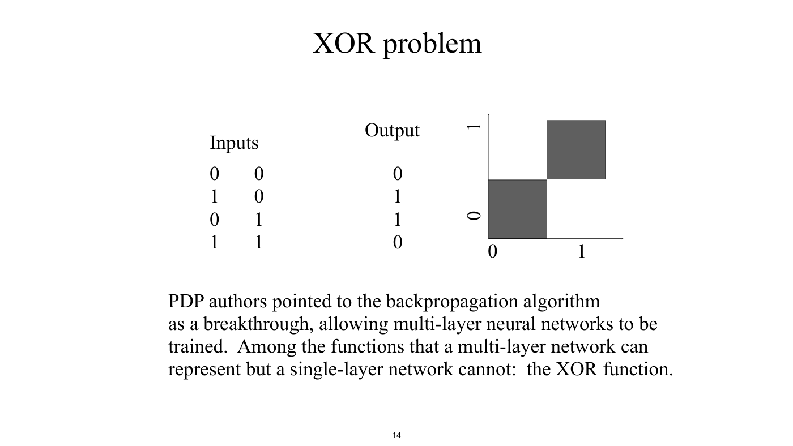

Title "XOR problem". A truth table with column headings "Inputs" and "Output":

| Input 1 | Input 2 | Output |
| ------- | ------- | ------ |
| 0 | 0 | 0 |
| 1 | 0 | 1 |
| 0 | 1 | 1 |
| 1 | 1 | 0 |

To the right, a small 2-D plot with horizontal axis ticks "0" and "1" and vertical axis ticks "0" and "1": two dark-grey filled squares, one in the lower-left cell (input 0,0) and one in the upper-right cell (input 1,1); the other two cells (lower-right, upper-left) are white. This shows the two classes are not linearly separable.

Text below: "PDP authors pointed to the backpropagation algorithm as a breakthrough, allowing multi-layer neural networks to be trained. Among the functions that a multi-layer network can represent but a single-layer network cannot: the XOR function."

## Slide 15 — (enthusiasm vs. time) PDP book, 1986

Same axes. The grey curve now goes: peak (blue label "Perceptrons, 1958"), trough ("Minsky and Papert, 1972"), and back up to a second peak at the same height, labelled "PDP book, 1986". Added relative to slide 12: the recovery and the "PDP book, 1986" label.

## Slide 16 — LeCun conv nets, 1998

Title "LeCun conv nets, 1998". A reproduction of Fig. 2 of the paper (header "PROC. OF THE IEEE, NOVEMBER 1998", page 7): the LeNet-5 architecture diagram. Left to right: "INPUT 32x32" (an image of a handwritten "A"); "C1: feature maps 6@28x28" (a stack of 6 grey squares); "S2: f. maps 6@14x14"; "C3: f. maps 16@10x10"; "S4: f. maps 16@5x5"; "C5: layer 120"; "F6: layer 84"; "OUTPUT 10". Operation labels beneath: "Convolutions", "Subsampling", "Convolutions", "Subsampling", "Full connection", "Full connection", "Gaussian connections". Small squares in the input and feature maps are connected by thin lines forming cones to units in the next layer, showing local receptive fields.

Caption: "Fig. 2. Architecture of LeNet-5, a Convolutional Neural Network, here for digits recognition. Each plane is a feature map, i.e. a set of units whose weights are constrained to be identical."

Below: "Demos:" and a link: http://yann.lecun.com/exdb/lenet/index.html

*OCW notice: © IEEE. All rights reserved — excluded from the CC license.*

## Slide 17 — Neural Information Processing Systems 2000

- Neural Information Processing Systems is the premier conference on machine learning. Evolved from an interdisciplinary conference to a machine learning conference.
- For the 2000 conference:
  - <u>title words predictive of paper acceptance</u>: "Belief Propagation" and "Gaussian".
  - <u>title words predictive of paper rejection</u>: "Neural" and "Network".

## Slide 18 — (enthusiasm vs. time) AI winter, 2000

Same axes. The grey curve now continues from the second peak ("PDP book, 1986") down to near the bottom again, with a new blue label "AI winter, 2000" at that second trough. Labels in place: "Perceptrons, 1958" (first peak), "Minsky and Papert, 1972" (first trough), "PDP book, 1986" (second peak), "AI winter, 2000" (second trough). Added relative to slide 15: the second decline and the label.

## Slide 19 — Krizhevsky, Sutskever, and Hinton, NeurIPS 2012 ("Alexnet")

Title "Krizhevsky, Sutskever, and Hinton, NeurIPS 2012", subtitle "“Alexnet”". The full AlexNet architecture diagram (same drawing as on slide 1, shown at full size and in black line art): a 224×224×3 input image, first conv layer with 11×11 filters and "Stride of 4" producing 55×55 maps (48 channels per GPU stream), "Max pooling", 5×5 convolutions to 27×27×128 maps, "Max pooling", then three 3×3 convolution stages at 13×13 with 192, 192 and 128 channels, "Max pooling", two "dense" layers of 2048 units (in two parallel streams with crossing connections) and a final dense 1000-unit output.

*OCW notice: © Krizhevsky, Sutskever, and Hinton. All rights reserved — excluded from the CC license.*

## Slide 20 — Krizhevsky, Sutskever, and Hinton, NeurIPS 2012

Title "Krizhevsky, Sutskever, and Hinton, NeurIPS 2012". A 4×2 grid of eight ImageNet test photographs, each with its true label printed beneath and a small horizontal bar chart of the network's top-5 predicted classes (bar length = predicted probability; the bar for the true class is coloured pink/red, other bars blue). If the true label is not in the top 5, no bar is pink.

- Top row: "mite" (a red mite on a pale surface) — top 5: mite (pink, longest), black widow, cockroach, tick, starfish. "container ship" (aerial view of a loaded cargo ship) — container ship (pink, long), lifeboat, amphibian, fireboat, drilling platform. "motor scooter" (two people on a scooter) — motor scooter (pink, long), go-kart, moped, bumper car, golfcart. "leopard" (a leopard on a log) — leopard (pink, longest), jaguar, cheetah, snow leopard, Egyptian cat.
- Bottom row: "grille" (front of a red vintage car) — convertible (blue, longest), grille (pink, second), pickup, beach wagon, fire engine. "mushroom" (two orange mushrooms on bark) — agaric (blue, longest), mushroom (pink, nearly as long), jelly fungus, gill fungus, dead-man's-fingers. "cherry" (a Dalmatian dog behind a pile of cherries) — dalmatian (blue, longest), grape, elderberry, ffordshire bullterrier (truncated on the slide), currant; no pink bar. "Madagascar cat" (a ring-tailed lemur on a branch) — squirrel monkey (blue, longest), spider monkey, titi, indri, howler monkey; no pink bar.

*OCW notice: © Krizhevsky, Sutskever, and Hinton. All rights reserved — excluded from the CC license.*

## Slide 21 — (enthusiasm vs. time) 28 years, 28 years, Krizhevsky et al. 2012

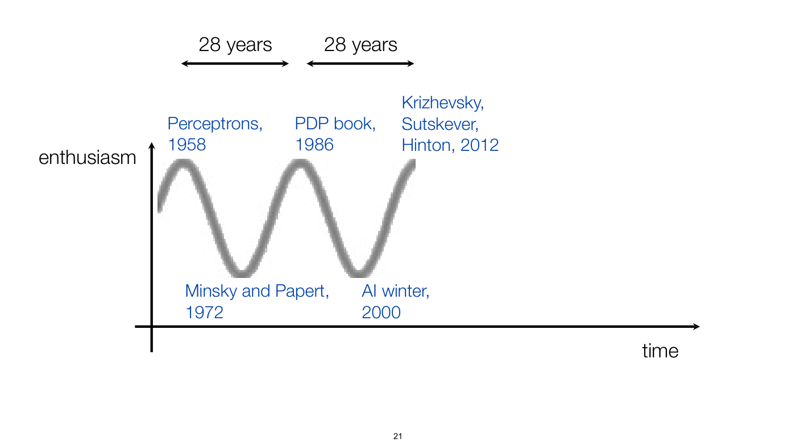

Same axes. The grey curve is now a sine-like wave with three peaks reached/climbing: first peak "Perceptrons, 1958", trough "Minsky and Papert, 1972", second peak "PDP book, 1986", trough "AI winter, 2000", and a third rise that is cut off at about peak height at the right end, just under the label (top right, blue) "Krizhevsky, Sutskever, Hinton, 2012" — the curve does not draw a third peak. Above the curve, two double-headed horizontal arrows, each labelled "28 years", each about one cycle long and sitting slightly left of the peaks: they mark the spacing 1958 → 1986 → 2012. Added relative to slide 18: the rise to the 2012 peak and the two "28 years" spans.

## Slide 22 — What comes next?

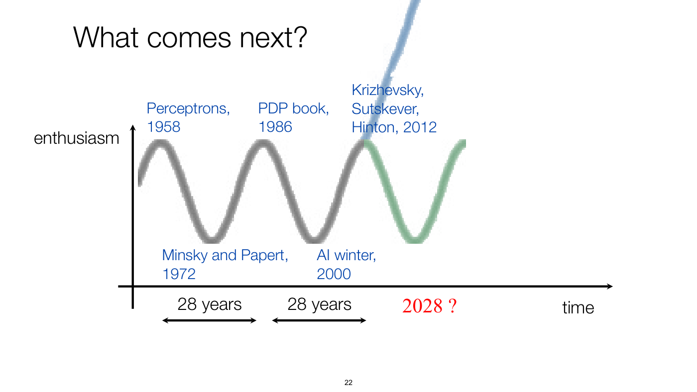

Title "What comes next?". Same wave as slide 21 in grey (peaks: Perceptrons 1958, PDP book 1986, Krizhevsky, Sutskever, Hinton 2012; troughs: Minsky and Papert 1972, AI winter 2000). Now the two "28 years" arrows sit below the time axis. Added: after the 2012 peak, two alternative continuations are drawn — a green curve that falls to a trough and rises again (the cyclical prediction), and a steep blue straight line shooting up off the top of the slide (the "keeps growing" alternative). Red serif label near the time axis under the green curve: "2028 ?".

## Slide 23 — What comes next?

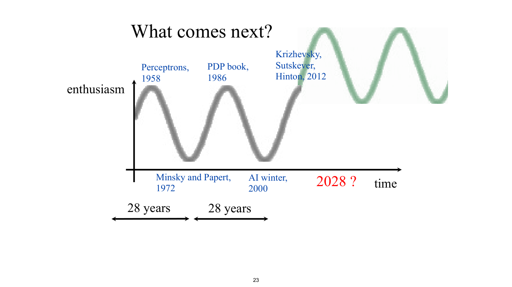

Title "What comes next?". Same as slide 22 (same labels, "28 years" arrows and red "2028 ?", all in a serif font) but the continuation after 2012 is a green wave that goes up to higher peaks (two full oscillations, each peak higher than the previous grey ones, extending above the 2012 peak and to the right), instead of the green dip plus blue steep line. The blue steep line is gone. Conveys that enthusiasm may keep oscillating but at an overall higher level.

## Slide 24 — What is deep learning today?

- Autograd (pytorch, tensorflow)
- Billion+ data point datasets
- Parallel training on thousands of GPUs
- Billion+ parameter architectures
- Million+ dollar training costs
- Shockingly good results
- Massive isn't necessary - e.g. Stable Diffusion
- Open source community and modular reuse

## Slide 25 — Signposting for the rest of the lecture

(Agenda / signpost slide.) Title "Signposting for the rest of the lecture". Two black signposts, each with two arrow-shaped signs. Left post: a black arrow pointing right (top) and a blue arrow pointing left (lower, highlighted); caption below: "What we expect you to have seen before". Right post: a green arrow pointing right (top, highlighted) and a black arrow pointing left (lower); caption below: "What we will cover in this class". The coloured arrow marks which direction/section is being discussed.

## Slide 26 — What we expect you to have seen before

(Signpost.) Title "What we expect you to have seen before". Bullet: "Gradient descent". At right, a black signpost with a black right-pointing arrow on top and a blue left-pointing arrow (highlighted) below.

## Slide 27 — Gradient descent

Title "Gradient descent". A yellow-outlined box containing

$$\theta^{\ast } = \arg\min_{\theta} \sum_{i=1}^{N} L\left(f_\theta(x^{(i)}), y^{(i)}\right)$$

(The star on $\theta$ is rendered as an empty-box glyph in the PDF; read as $\theta^{\ast }$, the optimal parameters.) Below the sum a curly brace underlines the summation and is labelled $J(\theta)$.

## Slide 28 — Gradient descent

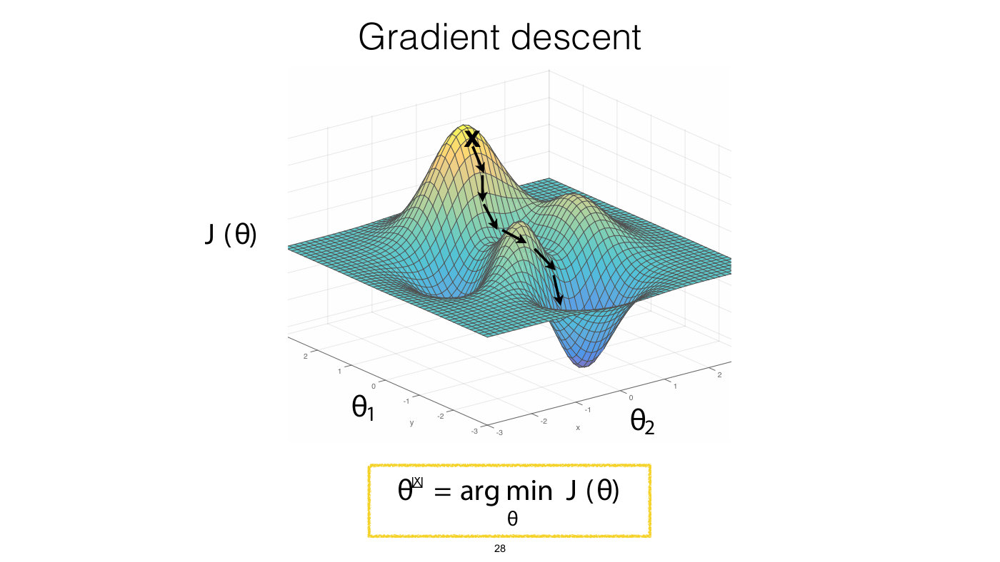

Title "Gradient descent". A 3-D surface plot (a coloured mesh, yellow at high values through green to blue at low values) of the loss $J(\theta)$ (label on the vertical axis, left) over the two horizontal axes labelled $\theta_1$ (left axis, ticks −3 to 2) and $\theta_2$ (right axis, ticks −3 to 2). The surface has a tall peak (yellow) at the back left, a smaller bump in the middle, a second large bump at the back right, a flat plain, and a deep narrow well (blue) at the front right. (The small grey axis letters printed on the plot itself are "y" on the left axis and "x" on the right; the slide's own labels are $\theta_1$ and $\theta_2$.) A black "X" marks the starting point at the top of the tall peak, and a chain of black arrows steps down the slope over the middle bump and into the well, illustrating gradient-descent steps. Below, a yellow-outlined box:

$$\theta^{\ast } = \arg\min_{\theta} J(\theta)$$

(star again rendered as a box glyph in the PDF).

## Slide 29 — What we'll cover in this class

(Signpost.) Title "What we'll cover in this class". Bullet: "Backprop and differentiable programming". At right, a signpost with a green right-pointing arrow (highlighted) on top and a black left-pointing arrow below.

## Slide 30 — Gradient descent (with "Lecture 2" banner)

Title "Gradient descent". (The PDF text layer shows a hidden line "One iteration of gradient descent:" sitting behind the banner.) The top box from slide 27 is visible: $\theta^{\ast } = \arg\min_\theta \sum_{i=1}^{N} L(f_\theta(x^{(i)}), y^{(i)})$. A large pale-yellow sticky-note banner overlays the middle of the slide reading "Lecture 2: Backprop and Differentiable Programming". It hides most of the middle equation; the visible lower part shows the update rule

$$\theta^{t+1} = \theta^{t} - \eta_t \frac{\partial J(\theta)}{\partial \theta}\Big|_ {\theta=\theta^t}$$

(the numerator $J(\theta)$ and the start of $\theta^{t+1}$ are partly covered by the banner), with a dotted arrow from $\eta_t$ to the bold label "learning rate". Meaning: gradient descent is covered in Lecture 2.

## Slide 31 — What we expect you to have seen before

(Signpost.) Same as slide 26 with a second bullet added:

- Gradient descent
- MLPs, Nonlinearities (ReLu)

Signpost at right as on slide 26 (blue left arrow highlighted).

## Slide 32 — Computation in a neural net

Title "Computation in a neural net". Two empty tall rectangles: left labelled "Input representation", right labelled "Output representation", with a yellow arrow pointing from the left rectangle to the right one.

## Slide 33 — Computation in a neural net (Linear layer)

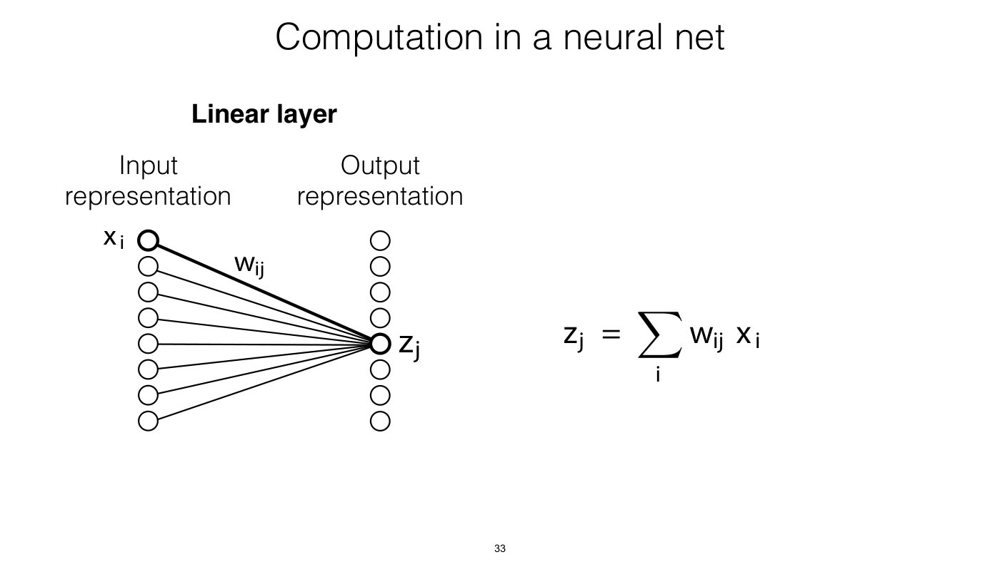

Title "Computation in a neural net"; heading "**Linear layer**". Columns of circles: left column of 8 circles labelled "Input representation" (the top one labelled $x_i$), right column of 9 circles labelled "Output representation", one of them (fifth from top) labelled $z_j$. Lines connect every input circle to $z_j$; the line from the top input is thick and labelled $w_{ij}$. Equation at right:

$$z_j = \sum_i w_{ij}\thinspace  x_i$$

Added relative to slide 32: the explicit unit-level picture and equation.

## Slide 34 — Computation in a neural net (Linear layer, with bias)

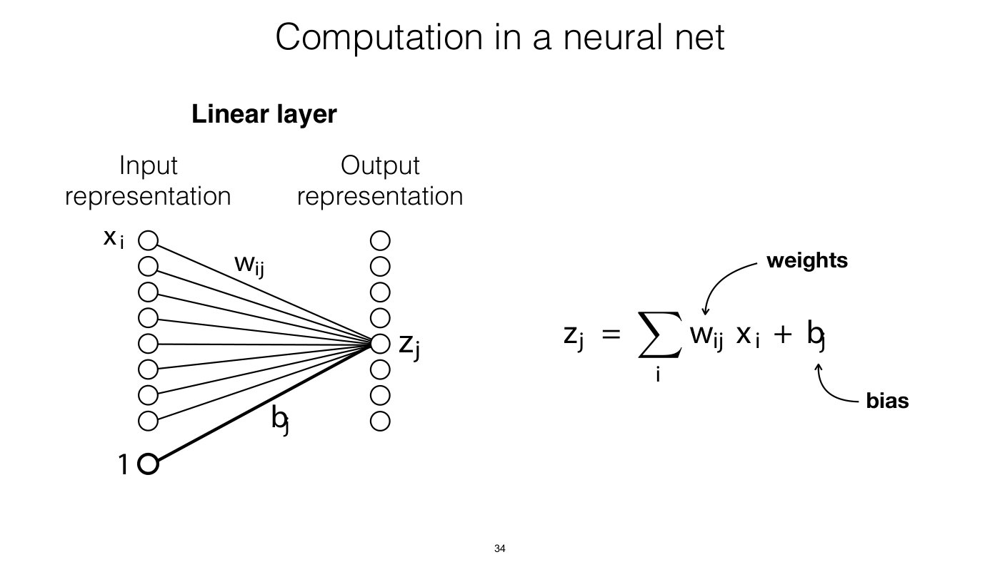

Same as slide 33 plus a bottom extra input circle labelled "1" connected to $z_j$ by a thick line labelled $b_j$. Equation now

$$z_j = \sum_i w_{ij}\thinspace  x_i + b_j$$

with annotation arrows: "weights" pointing at $w_{ij}$ and "bias" pointing at $b_j$. Added relative to slide 33: the bias term $b_j$ and constant-1 input.

## Slide 35 — Computation in a neural net (Linear layer, vector form)

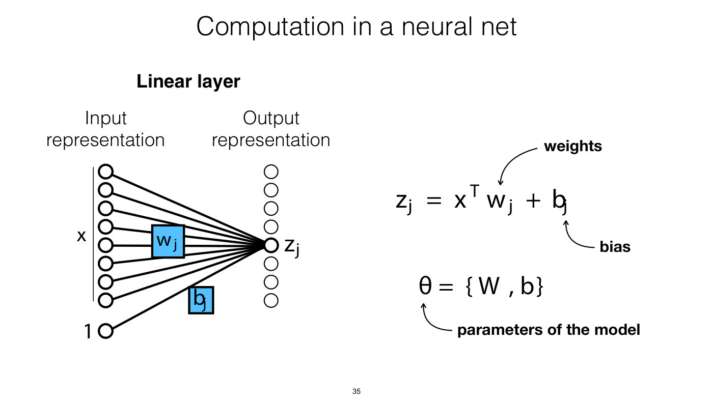

Same diagram: all 8 input circles are bracketed by a vertical bar and labelled $\mathbf{x}$; all connecting lines are thick, with a blue square labelled $w_j$ on the bundle of lines (the weight vector for output $j$), and a blue square labelled $b_j$ on the bias line from the "1" circle. Right side:

$$z_j = x^{T} w_j + b_j$$

annotated "weights" (pointing at $w_j$) and "bias" (pointing at $b_j$); below it

$$\theta = \lbrace W, b\rbrace$$

annotated "parameters of the model". Added relative to slide 34: vector notation $x^T w_j$ and the parameter set $\theta = \lbrace W, b\rbrace$.

## Slide 36 — Computation in a neural net ("Perceptron")

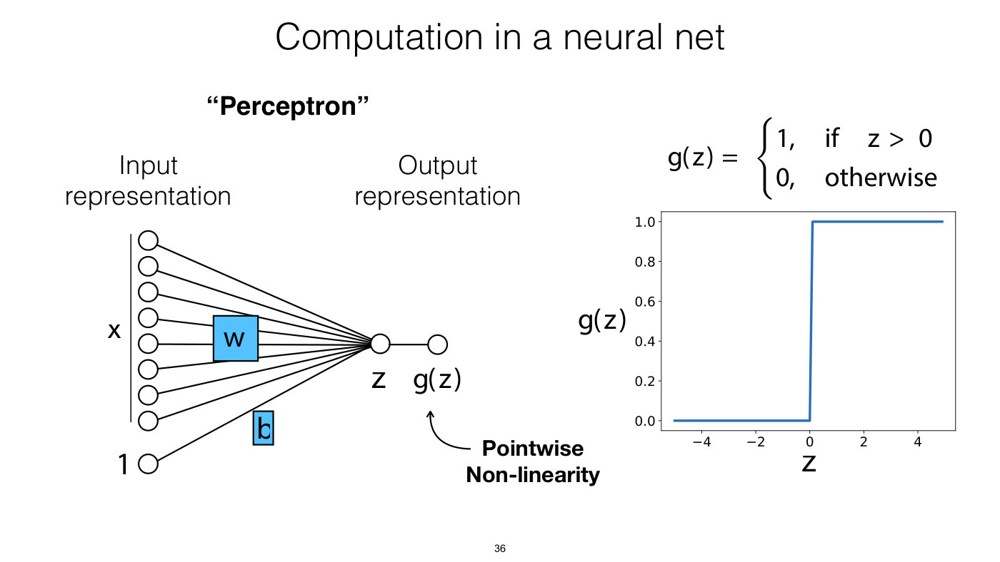

Heading "“**Perceptron**”". Left: the same input column (bracketed $x$, blue box $w$, blue box $b$, constant-1 unit) feeding a single circle labelled $z$, which connects by a short line to a second circle labelled $g(z)$ (column header "Output representation"); an arrow annotation "Pointwise Non-linearity" points at $g(z)$. Right:

$$g(z) = \begin{cases} 1, & \text{if } z > 0 \cr  0, & \text{otherwise} \end{cases}$$

and a plot: x-axis "z" from −4 to 4 (ticks −4, −2, 0, 2, 4), y-axis "g(z)" with ticks 0.0 to 1.0. One blue series: a step function equal to 0.0 for z < 0 and jumping vertically to 1.0 at z = 0, staying at 1.0 for z > 0.

## Slide 37 — Computation in a neural net

Same as slide 36 but without the "Perceptron" heading and without the "Pointwise Non-linearity" annotation (build-step difference only). Same diagram, same step-function formula $g(z)$ and the same plot of the step function.

## Slide 38 — Computation in a neural net — nonlinearity (Tanh)

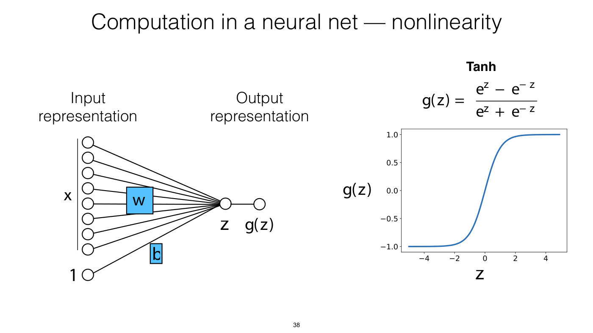

Title "Computation in a neural net — nonlinearity". Left: the same network diagram as slide 37 (inputs $x$, $w$, $b$, 1, $z$ and $g(z)$, as before). Right: heading "**Tanh**",

$$g(z) = \frac{e^{z} - e^{-z}}{e^{z} + e^{-z}}$$

and a plot: x-axis "z" (−4 to 4), y-axis "g(z)" (ticks −1.0, −0.5, 0.0, 0.5, 1.0). One blue S-shaped curve: approaches −1.0 for z < −2, passes through 0 at z = 0 with the steepest slope, and flattens to 1.0 for z > 2.

## Slide 39 — Computation in a neural net — nonlinearity (Tanh properties)

Same title. The left-hand network diagram is replaced by blue-bulleted text; right side (heading "**Tanh**", the same formula and the same tanh plot) unchanged.

- Bounded between [-1,+1]
- Saturation for large +/- inputs
- Gradients go to zero
- Outputs centered at 0
- tanh(z) = 2 sigmoid(2z) −1

## Slide 40 — Computation in a neural net — nonlinearity (Sigmoid)

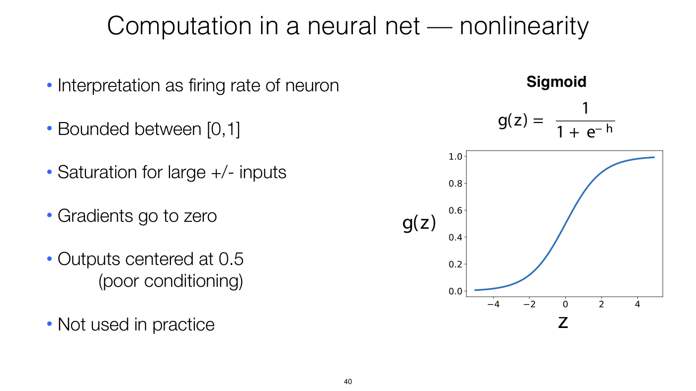

Same title. Blue-bulleted text:

- Interpretation as firing rate of neuron
- Bounded between [0,1]
- Saturation for large +/- inputs
- Gradients go to zero
- Outputs centered at 0.5 (poor conditioning)
- Not used in practice

Right: heading "**Sigmoid**",

$$g(z) = \frac{1}{1 + e^{-h}}$$

(printed with $h$ in the exponent, not $z$ — as on the slide), and a plot: x-axis "z" (−4 to 4), y-axis "g(z)" (ticks 0.0, 0.2, ..., 1.0). One blue S-shaped curve rising from near 0.0 at z = −5, through 0.5 at z = 0, to near 1.0 at z = 5, gentler than the tanh curve.

## Slide 41 — Computation in a neural net — nonlinearity (ReLU)

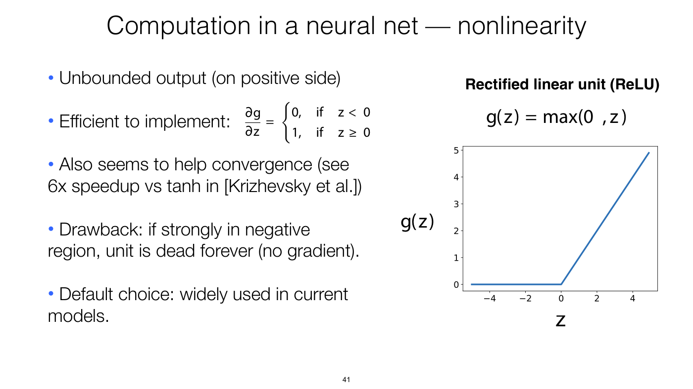

Title "Computation in a neural net — nonlinearity". Blue-bulleted text on the left:

- Unbounded output (on positive side)
- Efficient to implement (derivative below)
- Also seems to help convergence (see 6x speedup vs tanh in [Krizhevsky et al.])
- Drawback: if strongly in negative region, unit is dead forever (no gradient).
- Default choice: widely used in current models.

The derivative given in the "efficient to implement" bullet:

$$\frac{\partial g}{\partial z} = \begin{cases} 0, & \text{if } z < 0 \cr  1, & \text{if } z \geq 0 \end{cases}$$

Right: heading "**Rectified linear unit (ReLU)**",

$$g(z) = \max(0, z)$$

and a plot: x-axis "z" (−4 to 4), y-axis "g(z)" (ticks 0 to 5). One blue series: flat at 0 for z ≤ 0, then a straight line of slope 1 rising to about 5 at z = 5.

## Slide 42 — Stacking layers

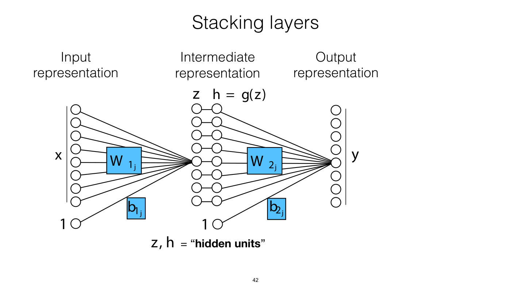

Title "Stacking layers". A three-column network diagram with column headings "Input representation", "Intermediate representation", "Output representation". Input column: 8 circles bracketed by a vertical bar and labelled $x$, plus a constant "1" circle below. Intermediate column: two sub-columns of 8 circles joined pairwise by short horizontal lines, labelled $z$ (left sub-column) and $h = g(z)$ (right sub-column), plus a "1" circle at the bottom of the $h$ sub-column. Output column: 9 circles bracketed by a vertical bar and labelled $y$. Fan-in lines run from all input circles (and the "1") to one middle $z$ unit, with a blue square on the bundle labelled $W_{1_j}$ and a blue square on the bias line labelled $b_{1_j}$; similarly lines from all $h$ circles (and the "1") to one output unit, with blue squares $W_{2_j}$ and $b_{2_j}$. Caption below: "z, h = “**hidden units**”". Added relative to slide 41: stacking two linear+nonlinearity layers into one network.

## Slide 43 — Stacking layers

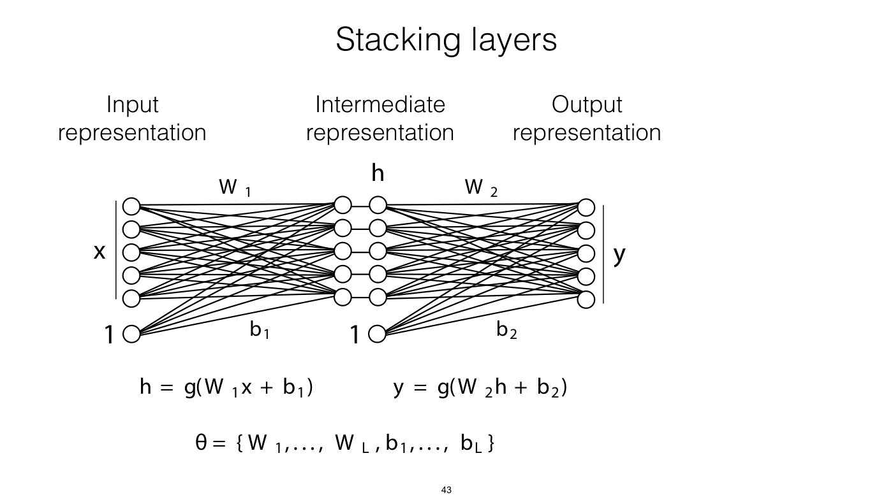

Title "Stacking layers". Same three columns, now drawn with fully connected layers (5 circles each plus the constant "1" bias circles; all pairs connected). Labels: $W_1$ above the first set of connections, $b_1$ below it, $h$ over the intermediate layer, $W_2$ above the second set, $b_2$ below it, $x$ and $y$ bracketed on the left and right. Equations:

$$h = g(W_1 x + b_1) \qquad\qquad y = g(W_2 h + b_2)$$

$$\theta = \lbrace W_1, \ldots, W_L, b_1, \ldots, b_L\rbrace$$

## Slide 44 — (blank)

A blank white slide: no text, no figure, only the slide number "44" at the bottom (likely an animation or transition placeholder).

## Slide 45 — Example: nonlinear classification with a deep net

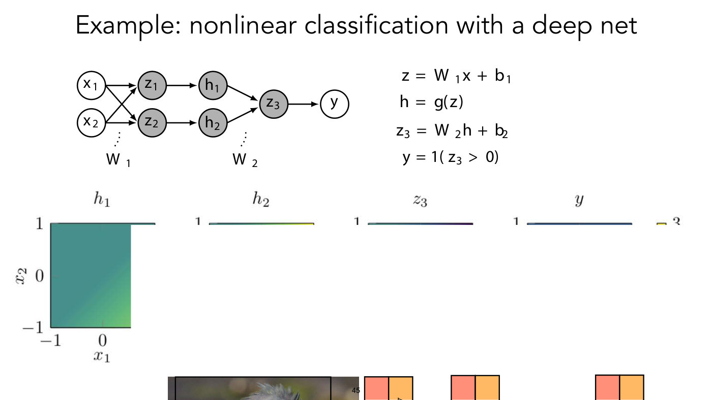

Title "Example: nonlinear classification with a deep net". Top left: a small network graph. Two white input circles $x_1$, $x_2$ each have arrows to two grey circles $z_1$, $z_2$ (all four connections, crossing); the label $W_1$ sits below with a dotted pointer. $z_1 \to h_1$ and $z_2 \to h_2$ (grey circles); $h_1$ and $h_2$ both feed grey circle $z_3$ (label $W_2$ below with a dotted pointer); $z_3 \to y$ (white circle). Top right, the equations:

$$z = W_1 x + b_1,\quad h = g(z),\quad z_3 = W_2 h + b_2,\quad y = \mathbf{1}(z_3 > 0)$$

(written on four lines as "z = W₁x + b₁", "h = g(z)", "z₃ = W₂h + b₂", "y = 1( z₃ > 0)").

Lower half: a row of four panels titled $h_1$, $h_2$, $z_3$, $y$ meant to show these quantities as 2-D colour maps over the input square $x_1 \in [-1, 1]$, $x_2 \in [-1, 1]$ (axis ticks −1, 0 and 1 are visible on the first panel, labelled $x_1$ horizontal and $x_2$ vertical). In this PDF page the figure is a snapshot of an animation mid-build and is rendered clipped: only the $h_1$ panel shows area (the left part of the square, teal-green with a lighter green gradient toward the lower right), while the $h_2$, $z_3$ and $y$ panels are collapsed to thin horizontal strips at the top (the $y$ strip has a small yellow dash and a tick "3" at the right). At the very bottom of the page, cut off by the page edge, part of a photograph of a grey-feathered bird inside a black rectangle and three pairs of pink/orange rectangles are visible (probably the next animation step); they are unreadable. The actual decision-region maps cannot be read from this page.

## Slide 46 — What we'll cover in this class

(Signpost.) Same as slide 29 with a second bullet added:

- Backprop and differentiable programming
- Why we can approximate

Signpost at right: green right-pointing arrow highlighted, black left arrow.

## Slide 47 — Representational power

Title "Representational power". Bullets:

- 1 layer? Linear decision surface.
- 2+ layers? In theory, can represent any function. Assuming non-trivial non-linearity.
- But issue is efficiency: very wide two layers vs narrow deep model? In practice, more layers helps.

A pale-yellow banner reads "Lecture 3: Approximation theory". It covers a pair of small plots between the 2nd and 3rd bullets: left, a wiggly curve on axes; right, the same curve approximated by blue histogram-style bars (a staircase of blue rectangles hugging the curve) — only the bottom edge of each is visible below the banner, so details are unreadable.

## Slide 48 — What we'll cover in this class

(Signpost.) Same as slide 46 with a third bullet:

- Backprop and differentiable programming
- Why we can approximate
- Architectures

## Slide 49 — Deep nets (Architectures banner)

Title "*Deep* nets". Three rotated labels with dotted leader lines: "Linear", "Non-linearity", "Classify" (as in slide 54's diagram). A large pale-yellow banner covers the diagram (it hides the fish image, layers and equation $f(x) = f_L(f_{L-1}(\ldots f_2(f_1(x))))$ shown on slide 54) and reads:

**Architectures**
Lecture 4: CNNs
Lecture 5: GNNs
Lecture 9: Transformers
Lecture 11: RNNs

## Slide 50 — What we'll cover in this class

(Signpost.) Same as slide 48 with a fourth bullet:

- Backprop and differentiable programming
- Why we can approximate
- Architectures
- When and why can we generalize

## Slide 51 — Why do deep nets generalize?

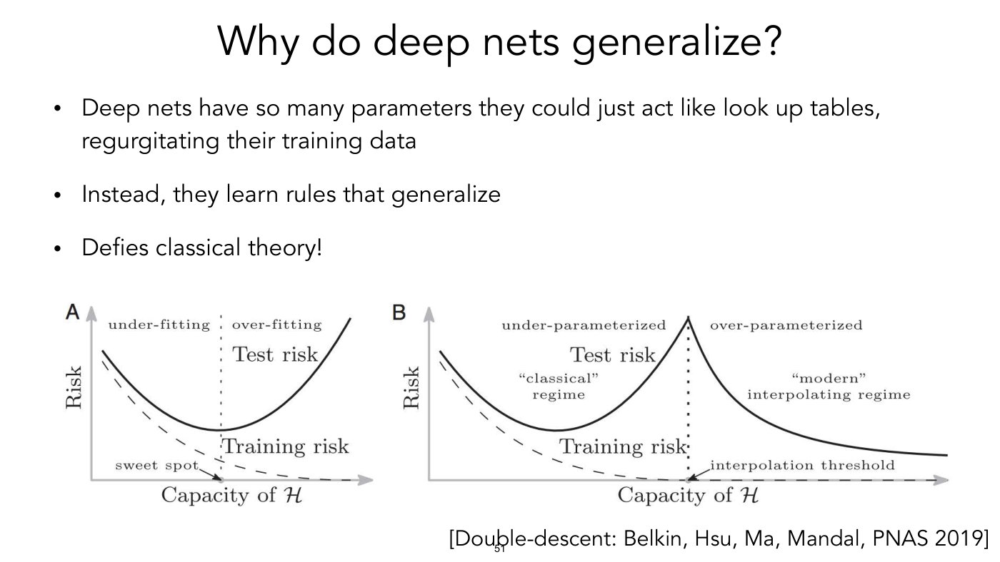

Title "Why do deep nets generalize?". Bullets:

- Deep nets have so many parameters they could just act like look up tables, regurgitating their training data
- Instead, they learn rules that generalize
- Defies classical theory!

Two schematic plots (from the cited paper), both with y-axis "Risk" and x-axis "Capacity of $\mathcal{H}$":

- **Panel A** (classical U-curve). Two series: a solid black "Test risk" curve that falls then rises (U shape, minimum at the "sweet spot"), and a dashed "Training risk" curve that decreases monotonically towards 0. A vertical dotted line at the minimum separates "under-fitting" (left) from "over-fitting" (right); an arrow labelled "sweet spot" points to the bottom of that line on the x-axis.
- **Panel B** (double descent). Two series: a solid black "Test risk" curve that falls (classical U-shape), then rises to a sharp peak at the vertical dotted line labelled "interpolation threshold" (arrow to the x-axis), then falls again and levels off at low risk on the right; and a dashed "Training risk" curve that decreases to 0 at the interpolation threshold and stays at 0 beyond. Left of the peak is labelled "under-parameterized" with "“classical” regime"; right of the peak is "over-parameterized" with "“modern” interpolating regime".

Citation at bottom right: "[Double-descent: Belkin, Hsu, Ma, Mandal, PNAS 2019]".

## Slide 52 — The simplicity hypothesis

Title "The simplicity hypothesis". Text (partly hidden behind a pale-yellow banner on the slide; the hidden lines are recovered from the PDF text layer):

Classical theory: big models learn complicated functions, and overfit the data

Emerging theory: deep nets learn *simple* functions that generalize

The banner reads "Lecture 7: Generalization theory" and "Lecture 17: OOD generalization".

## Slide 53 — What we expect you to have seen before

(Signpost.) Same as slide 31 with a third bullet:

- Gradient descent
- MLPs, Nonlinearities (ReLu)
- Softmax, cross-entropy loss

Signpost at right: blue left arrow highlighted, black right arrow.

## Slide 54 — Deep nets

Title "*Deep* nets". Left: a photograph of an orange-and-white clownfish on a dark blue background. Three triple-arrow groups lead through a chain of three tall two-tone rectangles (dark red-orange left half, orange right half) with "..." between the second and third. Dotted leader lines with rotated labels: "Linear" points at the red half of the first block, "Non-linearity" at the orange half; "Classify" points at the arrows leaving the last block, which end at the text "“clown fish”". Equation under the diagram:

$$f(x) = f_L(f_{L-1}(\ldots f_2(f_1(x))))$$

*OCW notice: © source unknown. All rights reserved — excluded from the CC license.*

## Slide 55 — Classifier layer

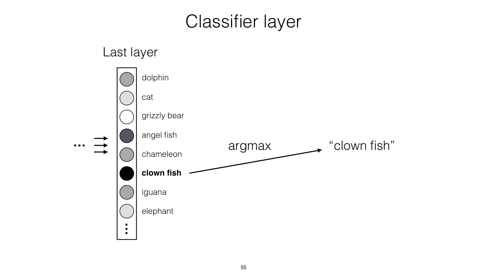

Title "Classifier layer". Heading "Last layer". A tall box of circles, each labelled by an animal class, shaded by activation (darker = larger): dolphin (mid-grey), cat (light grey), grizzly bear (white), angel fish (dark grey), chameleon (mid-grey), **clown fish** (black, label in bold), iguana (mid-grey), elephant (light grey), then a vertical "⋮" ellipsis. Three arrows coming in from the left with "…" represent the earlier layers. A long arrow from the clown fish unit, labelled "argmax", points to the text "“clown fish”".

## Slide 56 — Loss function

Title "Loss function". Underlined headings "Network output" (left) and "Ground truth label" (right). The same unit column as slide 55 (clown fish black). On the right: "“clown fish”" with a downward arrow to the word "Loss"; an arrow from the network's clown fish unit also points to "Loss"; "Loss" has an arrow to "error".

## Slide 57 — Loss function

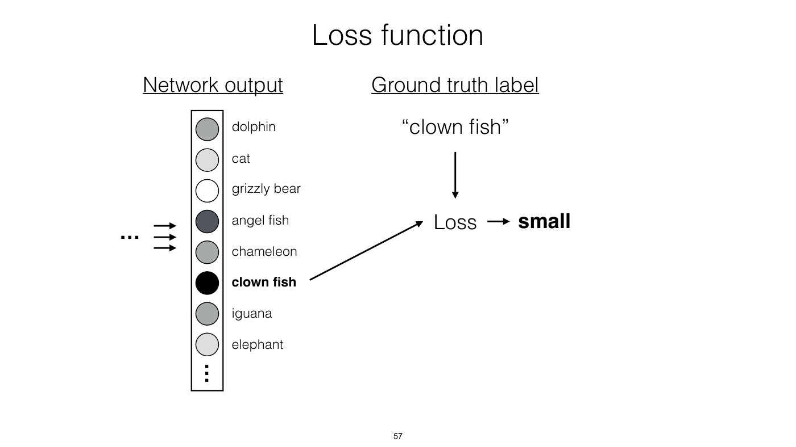

Same as slide 56, but the output reads "Loss → **small**" (ground truth "clown fish" matches the prediction). Added: the word "small" in bold in place of "error".

## Slide 58 — Loss function

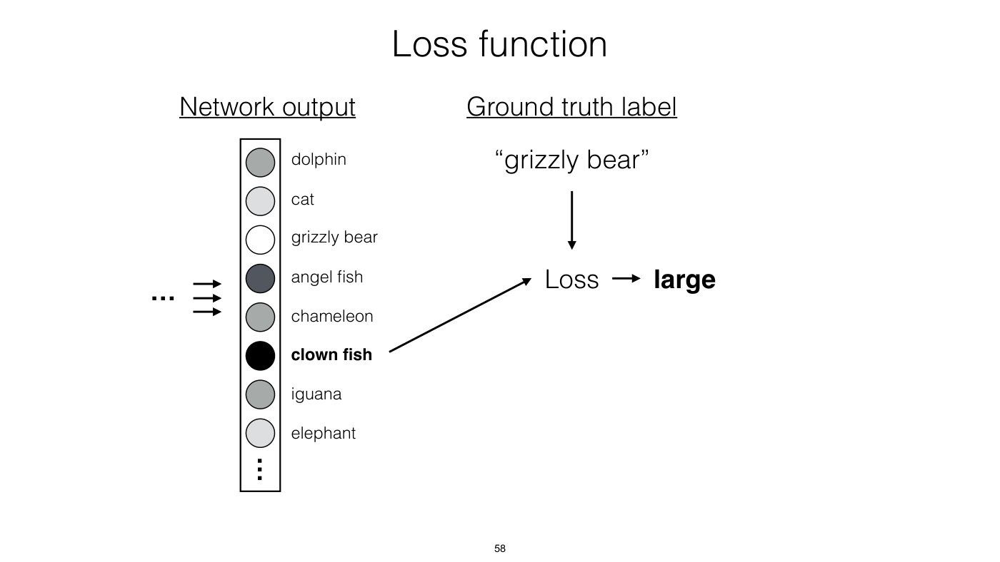

Same as slide 57 but the ground-truth label is "“grizzly bear”" and the output reads "Loss → **large**" (the network still predicts clown fish). Added: the mismatching label and "large".

## Slide 59 — Cross-entropy (Network output vs. Ground truth label)

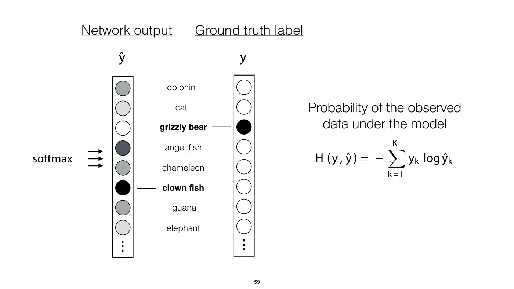

Underlined headings "Network output" and "Ground truth label"; no slide title. Two vertical unit columns: the left column labelled $\hat{y}$ (the network output after a "softmax" with three incoming arrows), shaded as before (clown fish black, bold label "clown fish" with a short line to it); the right column labelled $y$ is one-hot: only the "grizzly bear" unit is black (bold label "grizzly bear" with a line to it), all other circles white. Class labels in between: dolphin, cat, grizzly bear, angel fish, chameleon, clown fish, iguana, elephant, "⋮". Right side text: "Probability of the observed data under the model" and

$$H(y, \hat{y}) = -\sum_{k=1}^{K} y_k \log \hat{y}_ k$$

## Slide 60 — Prediction vs ground truth (log probabilities)

No slide title. Left: input image $x$ (the clownfish photo) and a block arrow labelled $f$ leading to the prediction. Heading "Prediction $\log \hat{y}$" and below it $f_\theta : X \to \mathbb{R}^K$ (the arrow is rendered as an empty-box glyph in the PDF). Two horizontal bar charts, each with the 8 class rows (dolphin, cat, grizzly bear, angel fish, chameleon, **clown fish**, iguana, elephant, "⋮"):

- Left chart "Prediction $\log \hat{y}$": x-axis "log prob" from "−∞" (left) to "0" (right). One series of black bars growing from the left axis: clown fish longest (about 40% of the width), angel fish next (medium), then chameleon and dolphin (similar, medium-short), iguana (short), then cat, grizzly bear and elephant (shortest).
- Right chart "Ground truth label": x-axis "Prob" from "0" to "1". One series: only the clown fish row has a bar, spanning almost the full width (about 0.9–1); all other rows are empty.

(Here the ground truth is "clown fish", unlike slide 59 where the one-hot label was "grizzly bear".)

*OCW notice: © source unknown. All rights reserved — excluded from the CC license.*

## Slide 61 — Prediction, ground truth and score (cross-entropy as "how much better you could have done")

No slide title. Same layout as slide 60 (input image $x$ = the clownfish photo, block arrow $f$, "Prediction $\log \hat{y}$", $f_\theta : X \to \mathbb{R}^K$ with the arrow rendered as a box glyph) with a third panel and a $\odot$ symbol between the first two panels (a circle containing a dot, meaning elementwise product). Three bar charts, each with the 8 class rows dolphin, cat, grizzly bear, angel fish, chameleon, **clown fish**, iguana, elephant and "⋮":

- Panel 1 "Prediction $\log \hat{y}$": x-axis "log prob", "−∞" to "0". One series of black bars as on slide 60 (clown fish longest, about 40% of the width; angel fish, chameleon, dolphin medium-short; others short).
- Panel 2 "Ground truth label $y$": x-axis "Prob", "0" to "1". One bar: clown fish row only, spanning nearly the full width.
- Panel 3 "Score $-L(\hat{y}, y)$" with the equation $-H(y, \hat{y}) = \sum_{k=1}^{K} y_k \log \hat{y}_ k$: x-axis "- Loss", "−∞" to "0". One bar in the clown fish row, two-coloured: a black part from the left axis up to roughly 38% of the width, then a **red** part from there to 0 (the right end). A curly brace over the red part is annotated "How much better you could have done".

Added relative to slide 60: the elementwise-product symbol and the score panel.

*OCW notice: © source unknown. All rights reserved — excluded from the CC license.*

## Slide 62 — Prediction, ground truth and score (grizzly bear example)

Same layout as slide 61, with a new input: a photo of a brown bear standing on its hind legs, one front paw raised (waving). Prediction $\log \hat{y}$ bars: **grizzly bear** longest (about two-thirds of the width, row label bold), cat medium-short, elephant short, dolphin/angel fish/chameleon/clown fish/iguana tiny. Ground truth $y$: one bar at grizzly bear spanning nearly the full width. Score panel ($-L(\hat{y}, y)$, equation $-H(y,\hat{y}) = \sum_{k=1}^{K} y_k \log \hat{y}_ k$, axis "- Loss" from −∞ to 0): one bar in the grizzly bear row, black up to about two-thirds of the width, then a smaller red part to 0 (small gap, i.e. low loss).

*OCW notice: © source unknown. All rights reserved — excluded from the CC license.*

## Slide 63 — Prediction, ground truth and score (chameleon example, misclassified)

Same layout as slides 61–62, with a new input: a photo of a blue-green-orange chameleon on a plant against a green background. Prediction $\log \hat{y}$ bars: **iguana** (label in bold) is the longest (about 42% of the width), chameleon next (about 19%), the rest tiny. Ground truth $y$: one bar at **chameleon** (bold) spanning nearly the full width. Score panel: one bar in the chameleon row, with a short black part (about 19% of the width) and a long red part from there to 0 — a large "how much better you could have done", i.e. a large loss because the true class (chameleon) was given lower probability than iguana.

*OCW notice: © source unknown. All rights reserved — excluded from the CC license.*

## Slide 64 — Deep learning (training example 1)

Title "Deep learning". Diagram of a training example flowing through a network, example $i=1$. Left: label $x^{(1)}$ over the clownfish photo; above it the text $y^{(1)}$ and "“clown fish”". A row of six tall empty rectangles (the layers), with yellow arrows from the image into the first rectangle and between successive rectangles; a black arrow from the last rectangle into a box "**Loss**". Below the rectangles, dotted vertical lines point to labels $\theta_1, \theta_2, \theta_3, \theta_4, \theta_5, \theta_6$ (one parameter set per layer). A long black line goes from the label "“clown fish”" across the top and down into the Loss box. To the right of Loss: $L(f_\theta(x^{(1)}), y^{(1)})$. At top right, a yellow-outlined label "Learned" (marking the $\theta$ parameters as the learned part). At the bottom, a yellow-outlined box:

$$\theta^{\ast } = \arg\min_{\theta} \sum_{i=1}^{N} L\left(f_\theta(x^{(i)}), y^{(i)}\right)$$

(star rendered as a box glyph in the PDF).

*OCW notice: © source unknown. All rights reserved — excluded from the CC license.*

## Slide 65 — Deep learning (training example 2)

Same as slide 64 with example 2: input $x^{(2)}$ is the standing-bear photo, label $y^{(2)}$ "“grizzly bear”", loss expression $L(f_\theta(x^{(2)}), y^{(2)})$. Everything else (six layers, $\theta_1 \ldots \theta_6$, "Learned", the $\arg\min$ box) is unchanged.

*OCW notice: © source unknown. All rights reserved — excluded from the CC license.*

## Slide 66 — Deep learning (training example i)

Same as slides 64–65 with the general example $i$: input $x^{(i)}$ is the chameleon photo, label $y^{(i)}$ "“chameleon”", loss expression $L(f_\theta(x^{(i)}), y^{(i)})$.

*OCW notice: © source unknown. All rights reserved — excluded from the CC license.*

## Slide 67 — What we expect you to have seen before

(Signpost.) Same as slide 53 with a fourth bullet:

- Gradient descent
- MLPs, Nonlinearities (ReLu)
- Softmax, cross-entropy loss
- Parallel processing, tensors

Signpost at right: blue left arrow highlighted, black right arrow.

## Slide 68 — Batch (parallel) processing

Title "Batch (parallel) processing". Three parallel copies of the deep-learning pipeline, stacked vertically: each row has an input photo (clownfish, chameleon, grizzly bear; "⋮" below to indicate more), eight tall rectangles joined by yellow arrows, and a "Loss" box. Arrows from the three Loss boxes converge on a "Σ" at the right (summing the per-example losses). At top right, a small grid diagram: columns of small circles titled "*Images*" (horizontal; 7 columns, the right four enclosed in a box with vertical dividers) and rows "*Features*" (vertical, rotated label; about 10 rows of circles) — a features × images matrix showing the batch as one 2-D array.

*OCW notice: © source unknown. All rights reserved — excluded from the CC license.*

## Slide 69 — Tensors (multi-dimensional arrays)

Title "Tensors" with subtitle "(multi-dimensional arrays)". A grid of 4 rows × 6 columns of circles shaded white-to-black by value, inside a rectangle. Rows are labelled by small thumbnail images at left: clownfish, chameleon, grizzly bear, "⋮". Columns carry rotated headings "Furry?", "Is a fish?", "Size", "# Stripes", "…" (the first four columns are named; the grid has 6 columns, two remaining unnamed under "…"). Circle shades, row by row (columns 1–6): clownfish: black, white, dark grey, light grey, light grey, mid grey; chameleon: black, black, mid grey, dark grey, black, dark grey; grizzly bear: white, black, white, black, dark slate, mid grey; "⋮" row: white, black, light grey, light grey, light grey, white. A large yellow arrow points into the grid from the left and another out of it to the right. Caption below: "*Each layer is a representation of the data*". (The shading values are illustrative; the slide does not give numbers.)

*OCW notice: © source unknown. All rights reserved — excluded from the CC license.*

## Slide 70 — Everything is a tensor

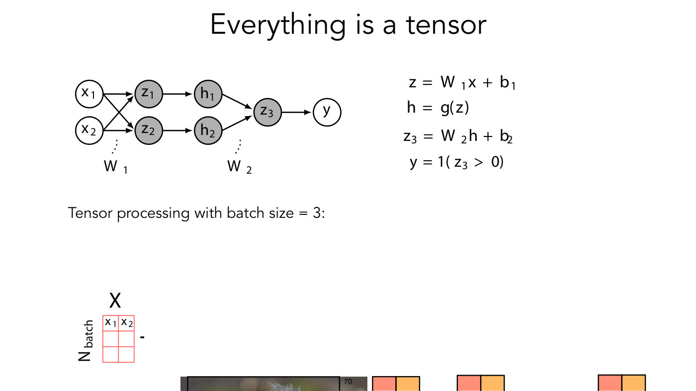

Title "Everything is a tensor". Top left: the small network from slide 45 (inputs $x_1$, $x_2$ → $z_1$, $z_2$ → $h_1$, $h_2$ → $z_3$ → $y$, with $W_1$, $W_2$ labels). Top right equations:

$$z = W_1 x + b_1,\quad h = g(z),\quad z_3 = W_2 h + b_2,\quad y = \mathbf{1}(z_3 > 0)$$

Text: "Tensor processing with batch size = 3:". Lower left: a matrix drawn as a red-outlined grid labelled $X$ with column headings $x_1$, $x_2$ and a vertical axis label $N_{batch}$ (3 rows × 2 columns), followed by a small "-" fragment. This PDF page is again a clipped animation snapshot: at the bottom edge a black-framed photo of a grey bird and three pairs of pink/orange rectangles are cut off by the page boundary, and the page's text layer names the remaining matrices of the full build: $X$, $W_1$, $Z_1$, $H_1$, $W_2$, $Z_2$, $Y$ (the batch version of $z = W_1 x + b_1$, $h = g(z)$, etc., with $x_1$ $x_2$; $z_1$ $z_2$; $h_1$ $h_2$; $z_3$; $y$ as column headings). The actual matrix diagram cannot be read from this page.

## Slide 71 — What we'll cover in this class

(Signpost.) Same as slide 50 with a fifth bullet:

- Backprop and differentiable programming
- Why we can approximate
- Architectures
- When and why can we generalize
- How deep networks represent data

## Slide 72 — Brain and deep-network representation hierarchy (Serre, 2014; Donahue, 2013)

No slide title. Three parts, left to right.

Left: a black line drawing of a human head in profile with the brain outlined inside.

Middle (labelled "Serre, 2014"): a figure of the visual-cortex hierarchy. From bottom to top: a picture of a fox among bushes with a red dot on it (a receptive field) and two red lines going up to the first layer; "V1/V2" (red label) with rows of small red circles containing oriented-line icons (horizontal, diagonal, vertical, anti-diagonal bars); "V2/V4" (yellow/orange label) with yellow circles containing corner/curve/junction/spiral patterns; "V4/PIT" (green label) with two green circles above dashed green circles containing a three-way junction and a spiral; "PIT/AIT" (cyan label) with two dashed cyan circles; finally "Classification units" with four small pictures — a deer, a bird on a branch, a fox, a coiled snake. The arrows from the two PIT/AIT units both point to the fox only, the class of the input image. Arrows connect each level to the one above.

Right (labelled "Donahue, 2013"): a large black up-arrow, and two stacked panels. Bottom panel: the clownfish photo feeds a six-rectangle network (yellow arrows) in which the **first** rectangle is filled black, with a 2-D scatter (t-SNE style) of thousands of points below it in mixed colours (magenta, blue, green, red), showing no clear clusters. Top panel: the clownfish feeds the same network with the **last** rectangle filled black, and its scatter plot below shows clearly separated colour clusters (magenta cluster on the left, blue and light-blue in the middle, green on the right, with some red/yellow dots). A boxed legend gives the colour classes: red "structure, construction"; yellow "covering"; light green "commodity, trade good, good"; green-teal "conveyance, transport"; blue "invertebrate"; dark blue "bird"; magenta "hunting dog". The arrow indicates going from early-layer features (mixed) to late-layer features (class-structured), echoing the brain hierarchy at the left.

*OCW notice: Left and clown fish © source unknown. Middle © Springer Science+Business Media, LLC, part of Springer Nature. Right © Donahue, et al. All rights reserved — excluded from the CC license.*

## Slide 73 — Representation Learning (lecture pointer)

No title other than the banner. Background figure: a vertical stack of translucent diamond-shaped planes, each holding a coloured point cloud, with thin dotted trajectories connecting the points between planes; between planes are upward arrows with rounded boxes labelled "ViT block x3" (four such boxes in the figure, two visible above and below the banner). It illustrates how a Vision Transformer's layers move/reorganize data points. A large pale-yellow banner overlays the middle:

**Representation Learning**
Lecture 11: Reconstruction-based
Lecture 12: Similarity-based
Lecture 13: Theory

(Lecture 11 is also listed as "RNNs" on slide 49; both are printed as such in the deck.)

*OCW notice: © Torralba, Isola, and Freeman. All rights reserved — excluded from the CC license.*

## Slide 74 — What we'll cover in this class

(Signpost.) Same as slide 71 with a sixth bullet:

- Backprop and differentiable programming
- Why we can approximate
- Architectures
- When and why can we generalize
- How deep networks represent data
- Generative Models

## Slide 75 — Generative Models (lecture pointer)

Title "Generative Models". Left: a screenshot of an OpenAI web page (dark green background, pink OpenAI logo and the word "OpenAI" at top left, magenta horizontal stripes at bottom right), captioned "openai.com". Right: a 2×2 grid of AI-generated images (captioned "stability.ai"): city high-rise buildings with a blue billboard reading "PRETTY GOOD"; a pink-glazed donut with sprinkles; the lower half of a young woman's face with blonde hair in a teal V-neck sweater; an orange-and-white clownfish among anemone tentacles. A pale-yellow banner overlays the middle and hides parts of the images:

**Generative Models**
Lecture 14: Basics
Lecture 15: Representations + Generation
Lecture 16: Conditional Models

*OCW notice: © openai.com and stability.ai. All rights reserved — excluded from the CC license.*

## Slide 76 — What we'll cover in this class

(Signpost.) Same as slide 74 with a seventh bullet:

- Backprop and differentiable programming
- Why we can approximate
- Architectures
- When and why can we generalize
- How deep networks represent data
- Generative Models
- Reusing weights

## Slide 77 — Reuse (Transfer Learning lecture pointer)

Title "Reuse". Two copies of the visual-cortex hierarchy figure from slide 72 side by side. Left ("Serre, 2014"): classification units (deer, bird, fox, snake), PIT/AIT cyan dashed circles, V1/V2 edge icons and the fox photo at the bottom with a red dot. Right ("Gandour, 2018"): the same hierarchy with the same lower layers, but the "Classification units" are replaced by a red circle with a white cross (X) and a green circle with a white check mark, and the input at the bottom is a pair of satellite/aerial photographs of buildings (one intact building with a roof, one damaged/collapsed building). The PDF text layer also contains the word "Useful?", hidden behind the banner (the swapped output labels). A pale-yellow banner overlays the middle:

**Transfer Learning**
Lecture 18: Models
Lecture 19: Data

Idea shown: reuse the lower layers of a network trained on one task (animals) for another (assessing building damage), changing only the classification units.

*OCW notice: Left © Springer Science+Business Media, LLC, part of Springer Nature. Right © Gandour, et al. All rights reserved — excluded from the CC license.*

## Slide 78 — What we'll cover in this class

(Signpost.) Same as slide 76 with an eighth bullet (and "Generative models" now with a lowercase m):

- Backprop and differentiable programming
- Why we can approximate
- Architectures
- When and why can we generalize
- How deep networks represent data
- Generative models
- Reusing weights
- Scaling

## Slide 79 — Scale (lecture pointer)

Title "Scale". Four boxed photographs in a row, each with a caption beneath: "302 Neurons", "15 Thousand Neurons", "100 Billion Neurons", "250 Billion Neurons" (top halves of the photos and the first line of each caption are hidden behind the banner; the numbers are taken from the PDF text layer; the photos' content is not readable — only fragments, e.g. a dark image with a small light object, a blank white frame, the top of a person's head, a grey landscape-like image). A pale-yellow banner overlays the middle:

**Scale in Deep Learning**
Lecture 6: Scaling Rules for Optimization
Lecture 22: Scaling laws
Lecture 23: Automatic gradient descent

## Slide 80 — 1. Introduction to Deep Learning

(Agenda / signpost slide; identical to slide 6.)

- How did we get where we are today? (Brief History)
- What we expect you have seen before (ok if you haven't!)
- What we will cover in this class

## Slide 81 — MIT OpenCourseWare end page

(Page 81 prints "81", but it is OCW's appended end page, not part of the lecture deck.) Text:

MIT OpenCourseWare
https://ocw.mit.edu

6.7960 Deep Learning
Fall 2024

For information about citing these materials or our Terms of Use, visit: https://ocw.mit.edu/terms
