# Lecture 2 — How to Train a Neural Net: slide-by-slide

Text and figures of all 81 slides of
[`mit6_7960_f24_lec2.pdf`](https://ocw.mit.edu/courses/6-7960-deep-learning-fall-2024/mit6_7960_f24_lec2.pdf),
transcribed from the deck (speaker: Sara Beery). Cite these as "slide N" — the printed
number equals the PDF page number for slides 1–80; slide 81 is OCW's appended end page. Diagrams, plots and photographs are described in prose since the KB is read as text.

**Images.** 45 slides carry a whole-slide render under their heading: 7, 10–22, 24–27, 30, 34, 36–38, 41–44, 46, 48–55, 60, 63, 66–68, 70, 72, 73 and 75. Not rendered: the seven slides with an OCW "All rights reserved" notice (4, 57, 58, 59, 64, 65, 69); build steps superseded by a rendered slide (8, 29, 39, 40, 47, 61, 62); text, agenda, equation-only and divider slides (1–3, 5, 6, 9, 23, 28, 31–33, 35, 45, 71, 74, 76–81); and slide 56, whose two-box diagram is fully described below and whose other content is third-party logos and an uncredited code screenshot. Use an image path only if it appears in this file.

Companion pages: [wiki page for this lecture](../../wiki/02-how-to-train-a-neural-net.md) ·
[transcript](../transcripts/02-how-to-train-a-neural-net.md)

**Signposting slides you can skip.** Slides 2 (announcements), 3 and 71 (the lecture agenda, identical to each other) and 74 (a divider, "Step by step solution") carry no technical content. Slides 31 and 35 are build frames showing only a single large parenthesis, bracketing the matrix-calculus slides.

Many slides are **build steps** — the same slide re-shown with one more element revealed. They are transcribed individually so that a citation to any one of them resolves, each with a note of what it adds relative to the previous one. Slide numbers printed at the bottom of the pages equal the PDF page numbers for slides 1–80; page 81 is OCW's appended end page and also prints the number 81.

## Contents

| Slides | Section |
| ------ | ------- |
| 1 | Title |
| 2 | Announcements (Pset 1 due 9/24, office hours, PyTorch tutorials) |
| 3 | Agenda (How to train a neural net) |
| 4–5 | Deep learning setup and the training objective; gradient descent notation $J(\theta)$ |
| 6–9 | Optimization: black-box, first-order, second-order; gradient descent update and learning rate; stochastic gradient descent |
| 10–11 | Momentum, including Goh's "Why Momentum Really Works" |
| 12–20 | Which loss curves are differentiable, have PyTorch gradients, or are hard to optimize; convex, discontinuous, vanishing, zero, exploding gradient, multiple local minima |
| 21–22 | Evolution strategies; gradient clipping |
| 23–25 | What is important in a loss function: continuous, differentiable, smooth (ReLU, GeLU) |
| 26–30 | Computation graphs; forward pass for one layer and for multiple layers; learning |
| 31–35 | Matrix calculus: derivative shapes, Jacobian, chain rule (slides 31 and 35 are lone-parenthesis build frames) |
| 36–42 | Backpropagation: reuse of computation; forward and backward pass; backward for a generic layer; the full algorithm |
| 43–45 | Backpropagation for layer $l$; summary; over data batches |
| 46–49 | Linear layer: backprop to input and to weights |
| 50–52 | Whole MLP: forward, backward, and the full one-iteration diagram |
| 53–55 | DAGs (merge and branch) and parameter sharing |
| 56–60 | Differentiable programming (deep learning versus differentiable programming; LeCun and Dietterich posts; Neural Module Networks; Software 2.0; programmed by human versus backprop) |
| 61–70 | Backprop with respect to any node or input; optimizing parameters versus inputs; unit visualization; Deep dream; CLIP; CLIP+GAN |
| 71 | Agenda recap (same as slide 3) |
| 72–80 | Worked example: one iteration of backpropagation on a five-node network |
| 81 | MIT OpenCourseWare end page |

---

## Slide 1 — Lecture 2: How to train a neural net

Title: "Lecture 2: How to train a neural net". Subtitle: "Speaker: Sara Beery".

The background is a faint, pale blue-green-to-yellow shaded surface with a grey wireframe mesh: a loss-surface-like landscape with one tall rounded peak in the centre and valleys around it.

Footer bar (grey): MIT logo, "6.7960 Deep Learning" (red), "https://phillipi.github.io/6.7960", right side "Fall 2024".

## Slide 2 — Announcements

- Pset 1 out — due 9/24
- OH starting this week, see webpage for locations and times
- Pytorch tutorials this week

## Slide 3 — 2. How to train a neural net

(Agenda / signpost slide.)

- Review of gradient descent, SGD
- Computation graphs
- Backprop through chains
- Backprop through MLPs
- Backprop through DAGs
- Differentiable programming

## Slide 4 — Deep learning

The "deep learning" training-setup diagram, from left to right:

- A photograph of a clown fish (orange with white stripes, on a dark-blue background), labelled above as $\mathbf{x}^{(i)}$. Beneath it, a small caption: "Clown fish © source unknown. All rights reserved. This content is excluded from our Creative Commons license. For more information, see https://ocw.mit.edu/help/faq-fair-use/".
- Above the photo, the label $\mathbf{y}^{(i)}$ with the text "clown fish" (monospace) beneath it. A black line runs from this label rightwards across the slide and then down with an arrowhead into the "Loss" box.
- Six tall, narrow empty rectangles in a row (the layers of the network). Yellow arrows lead from the image into the first rectangle and then between each successive rectangle; a black arrow leads from the last rectangle into a box labelled "Loss".
- Below each yellow arrow (the transformation that precedes each rectangle), a dotted vertical line leads down to a parameter label, in order: $\theta_1$, $\theta_2$, $\theta_3$, $\theta_4$, $\theta_5$, $\theta_6$.
- To the right of the Loss box is the expression $\mathcal{L}(f_\theta(\mathbf{x}^{(i)}), \mathbf{y}^{(i)})$.
- A yellow-outlined box at top right says "Learned" (referring to the $\theta$ parameters).
- At the bottom, in a yellow-outlined box:

$$\theta^\ast = \arg\min_\theta \sum_{i=1}^{N} \mathcal{L}(f_\theta(\mathbf{x}^{(i)}), \mathbf{y}^{(i)})$$

*OCW notice: © source unknown (clown fish photograph). All rights reserved — excluded from the CC license.*

## Slide 5 — Gradient Descent

In a yellow-outlined box:

$$\theta^\ast = \arg\min_\theta \sum_{i=1}^{N} \mathcal{L}(f_\theta(\mathbf{x}^{(i)}), \mathbf{y}^{(i)})$$

A curly brace under the sum-of-losses part (from the $\sum$ to the end of the expression, not including $\theta^\ast = \arg\min_\theta$) is labelled $J(\theta)$.

## Slide 6 — Optimization

Top left: the word "Params" with $\theta$ beneath it, and an arrow pointing right into a large dark-grey square (a black box) that contains a small white square with the letter $J$. An arrow leaves the box to the right, pointing at three outputs listed vertically: $J(\theta)$, $\nabla_\theta J(\theta)$, $H_\theta(J(\theta))$.

Top right, in a yellow-outlined box: $\theta^\ast = \arg\min_\theta J(\theta)$.

Below:

- What's the knowledge we have about J?
  - We can evaluate $J(\theta)$ — arrow to the right: "Black box optimization"
  - We can evaluate $J(\theta)$ and $\nabla_\theta J(\theta)$ — arrow to the right: "First order optimization". The $\nabla_\theta J(\theta)$ is annotated by a curved line labelled "Gradient".
  - We can evaluate $J(\theta)$, $\nabla_\theta J(\theta)$, and $H_\theta(J(\theta))$ — arrow to the right: "Second order optimization". The $H_\theta(J(\theta))$ is annotated by a curved line labelled "Hessian".

## Slide 7 — Gradient Descent

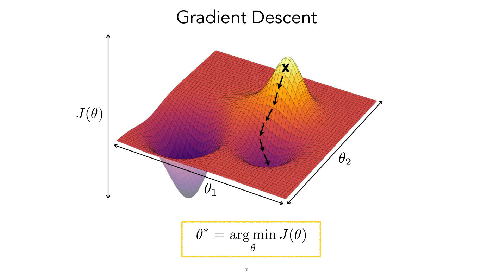

A 3D surface plot of a loss landscape, drawn as a coloured mesh. Axes: a vertical double-headed arrow on the left labelled $J(\theta)$; two horizontal arrows along the base labelled $\theta_1$ (front-left edge, running left to right) and $\theta_2$ (right edge, running into the page). The surface is mostly flat and red-orange, with three features: a tall yellow-orange peak at the back right, a deep purple basin at front left (which extends below the base plane, drawn in lighter purple-grey, a deep narrow pit), and a shallower purple basin at the front right-centre. A black "x" marks the top of the peak, and a dashed black arrow path leads from the x down the side of the peak, curving down into the shallower front-right basin (not the deeper left pit), illustrating gradient descent ending in a local minimum.

Below, in a yellow-outlined box: $\theta^\ast = \arg\min_\theta J(\theta)$.

## Slide 8 — Gradient Descent

Same as slide 5 (the yellow-boxed $\theta^\ast = \arg\min_\theta \sum_{i=1}^{N} \mathcal{L}(f_\theta(\mathbf{x}^{(i)}), \mathbf{y}^{(i)})$ with the brace labelled $J(\theta)$ under the sum), plus:

"One iteration of gradient descent:"

$$\theta^{k+1} \qquad \theta^k - \eta \nabla_\theta J(\theta^k)$$

(As printed, there is a gap between the left side $\theta^{k+1}$ and the right side; no equals or assignment symbol is visible.) A dotted curved line from the $\eta$ points down to the bold label "learning rate".

Added relative to slide 5: the one-iteration update rule and the "learning rate" label.

## Slide 9 — Stochastic Gradient Descent (SGD)

- Want to minimize overall loss function J, which is sum of individual losses over each example.
- In Stochastic gradient descent, compute gradient on sub-set (batch) of data.
  - If batchsize=1 then θ is updated after each example.
  - If batchsize=N (full set) then this is standard gradient descent.
- Gradient direction is noisy, relative to average over all examples (standard gradient descent).
- Advantages
  - Faster: approximates total gradient with small sample
  - Implicit regularizer
- Disadvantages
  - High variance, unstable updates

## Slide 10 — Momentum

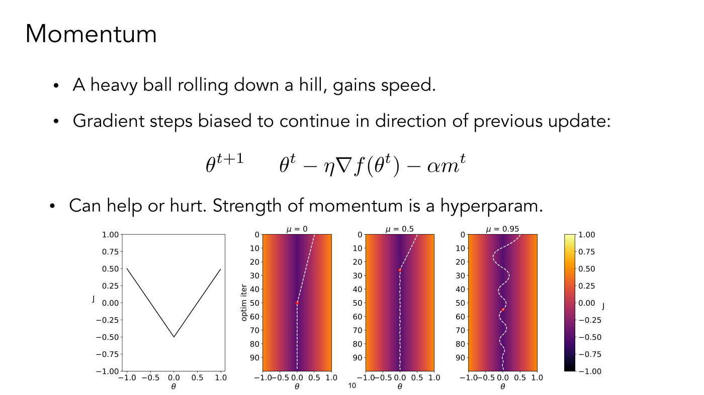

- A heavy ball rolling down a hill, gains speed.
- Gradient steps biased to continue in direction of previous update:

$$\theta^{t+1} \qquad \theta^t - \eta \nabla f(\theta^t) - \alpha m^t$$

(As printed, there is a gap between the left side and the right side; no equals or assignment symbol is visible.)

- Can help or hurt. Strength of momentum is a hyperparam.

Figure along the bottom: five panels in a row (four plots and a colour bar).

- Panel 1: a line plot of $J$ (vertical axis, −1.00 to 1.00 in steps of 0.25) against $\theta$ (horizontal axis, −1.0 to 1.0). One black curve, a "V" (absolute-value shape): $J \approx 0.5$ at $\theta=-1$, decreasing linearly to a minimum of about −0.5 at $\theta=0$, then rising linearly to about 0.5 at $\theta=1$.
- Panels 2–4: heat maps, each titled with a momentum value $\mu$: "μ = 0", "μ = 0.5", "μ = 0.95". Horizontal axis $\theta$ from −1.0 to 1.0; vertical axis "optim iter" from 0 (top) to about 99 (ticks 0, 10, …, 90). The background is the loss $J(\theta)$ rendered as vertical colour bands (dark purple near $\theta=0$, orange at the edges $\theta=\pm 1$). A white dashed line traces the value of $\theta$ over the optimization iterations, starting at $\theta \approx 0.5$ at iteration 0, and a red dot marks where it first reaches the minimum.
  - $\mu = 0$: the path goes in a straight diagonal line to $\theta=0$, reaching it (red dot) at about iteration 50, then stays at 0.
  - $\mu = 0.5$: the path goes in a straight diagonal line, reaching $\theta=0$ (red dot) at about iteration 26, then stays near 0.
  - $\mu = 0.95$: the path overshoots and oscillates around $\theta=0$ with a decaying wobble (to about −0.2 at iteration ≈ 17, back to positive, and so on), with the first red dot at about iteration 55; the oscillation is still visible at iteration 90.
- Panel 5: a colour bar for $J$ (labelled "J" on its right), from yellow (1.00) through orange (0.50), red/magenta (0.00), purple (−0.50) to black (−1.00).

## Slide 11 — Why Momentum Really Works

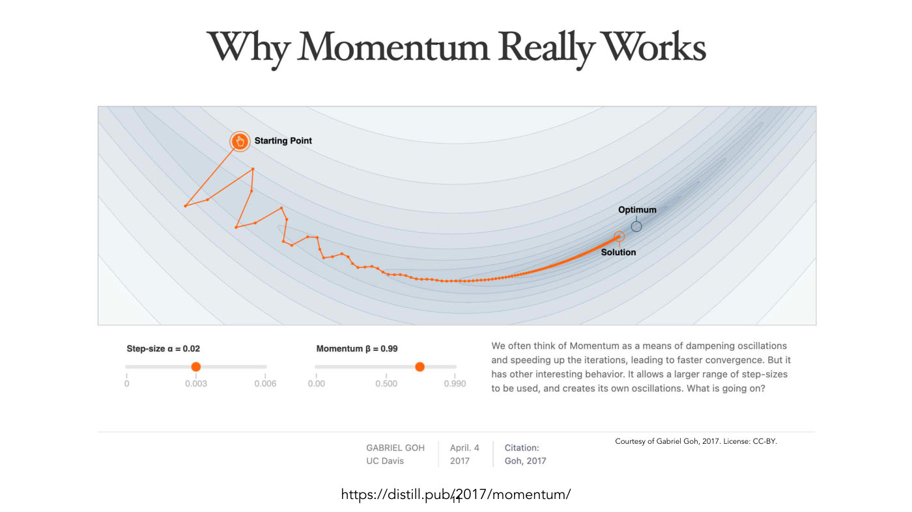

A screenshot of the Distill article by Gabriel Goh (title "Why Momentum Really Works"). It shows an interactive 2D contour plot of an elongated curved valley (pale blue-grey contour lines, curving like a shallow bowl/banana from upper left to right). An orange "Starting Point" handle sits at upper left; an orange path of dots zig-zags from it with large oscillations that damp out as it moves down the valley, then follows a smooth curve to the right where it ends at a point labelled "Solution", just short of a small circle labelled "Optimum" at right.

Below the plot, two sliders: "Step-size α = 0.02" (axis ticks 0, 0.003, 0.006; handle near 0.003) and "Momentum β = 0.99" (axis ticks 0.00, 0.500, 0.990; handle near 0.7 of the way along). To their right, the article text: "We often think of Momentum as a means of dampening oscillations and speeding up the iterations, leading to faster convergence. But it has other interesting behavior. It allows a larger range of step-sizes to be used, and creates its own oscillations. What is going on?"

Beneath: byline "GABRIEL GOH, UC Davis", "April. 4 2017", "Citation: Goh, 2017". Credit line on the slide: "Courtesy of Gabriel Goh, 2017. License: CC-BY." At the bottom: https://distill.pub/2017/momentum/

## Slide 12 — Which are differentiable?

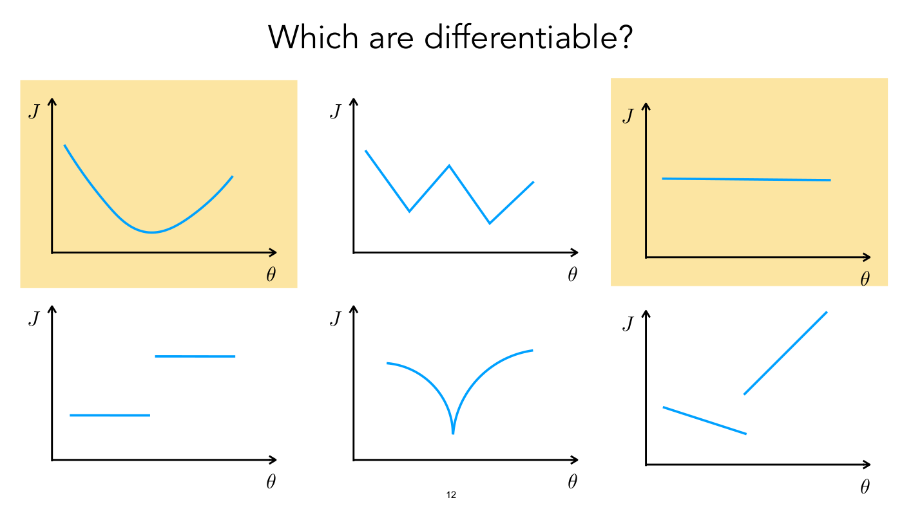

Six small plots arranged in a 2×3 grid, each with a vertical axis $J$ and horizontal axis $\theta$ and one blue curve. Two of the six are highlighted with a pale-orange background (top-left and top-right), marking them as the differentiable ones.

- Top left (highlighted): a smooth U-shaped convex curve with a single minimum in the middle.
- Top middle (not highlighted): a piecewise-linear zig-zag: falls from upper left to a low point, rises to a peak, falls to a second low point, then rises to the right end (two local minima, sharp corners).
- Top right (highlighted): a flat horizontal line.
- Bottom left (not highlighted): a step function: a low horizontal segment on the left, then a higher horizontal segment on the right, with a jump between them.
- Bottom middle (not highlighted): a cusp: a curve falling steeply into a sharp point at the bottom and rising again on the other side (a "V" with curved, concave sides, vertical tangent at the minimum).
- Bottom right (not highlighted): a discontinuity: a gently downward-sloping line segment on the left, then a jump up to a steeper upward-sloping line segment on the right.

## Slide 13 — Which are have defined gradients in pytorch?

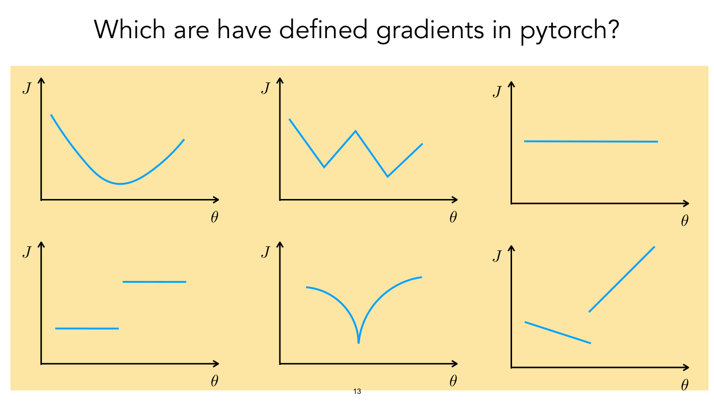

(Title printed as "Which are have defined gradients in pytorch?")

The same six plots as slide 12, in the same positions, but now all six sit on one pale-orange highlighted background, i.e. all six are marked as having defined gradients in PyTorch.

Added relative to slide 12: all six plots are highlighted, not just the top-left and top-right ones.

## Slide 14 — Which will be hard to optimize?

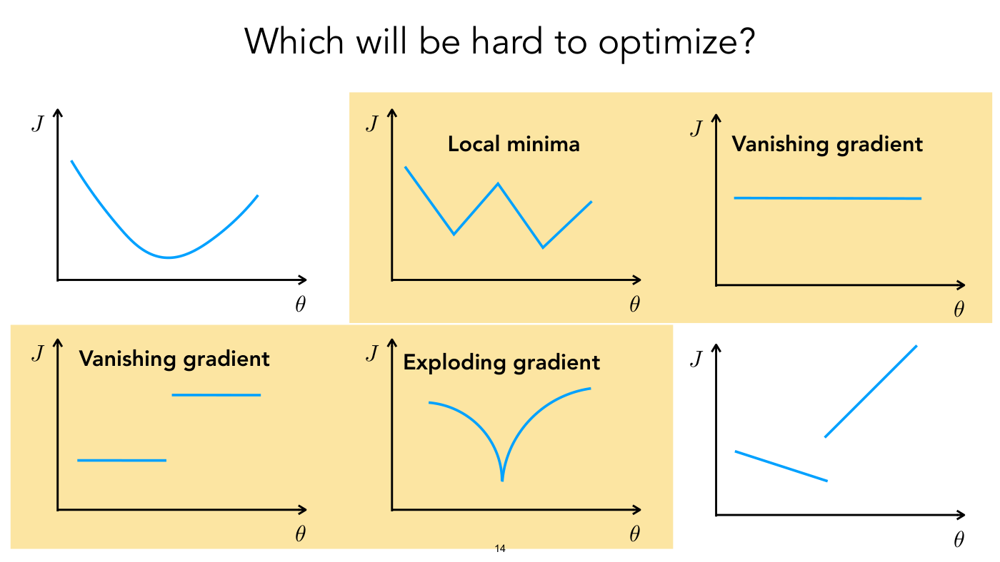

The same six plots again, with annotations. Highlighted in pale orange are the top-middle and top-right plots (one highlight block) and the bottom-left and bottom-middle plots (a second block). Not highlighted: top left (smooth U) and bottom right (the discontinuous line pair).

- Top left (not highlighted): the smooth U-shaped curve; no label.
- Top middle (highlighted): the zig-zag, labelled "Local minima".
- Top right (highlighted): the flat line, labelled "Vanishing gradient".
- Bottom left (highlighted): the step function, labelled "Vanishing gradient".
- Bottom middle (highlighted): the cusp, labelled "Exploding gradient".
- Bottom right (not highlighted): the jump-discontinuity line pair; no label.

## Slide 15 — Simple case (convex)

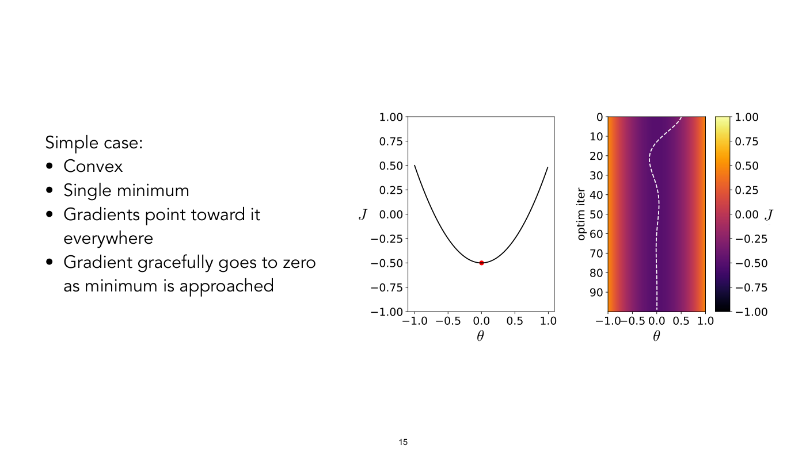

No slide title. Text on the left:

Simple case:
- Convex
- Single minimum
- Gradients point toward it everywhere
- Gradient gracefully goes to zero as minimum is approached

Two plots on the right.

- Left plot: $J$ (vertical, −1.00 to 1.00) versus $\theta$ (horizontal, −1.0 to 1.0). One black smooth parabola-like curve, $J\approx 0.5$ at $\theta=-1$, minimum of about −0.5 at $\theta=0$ (marked with a red dot), rising to about 0.5 at $\theta=1$.
- Right plot: a heat map of "optim iter" (vertical, 0 at top to about 99) against $\theta$ (−1.0 to 1.0), background is the same loss as vertical colour bands (dark purple near the centre, orange at the edges), with a colour bar from yellow (1.00) through orange, magenta (0.00), purple, to black (−1.00), labelled $J$. A white dashed path starts at $\theta \approx 0.5$ at iteration 0, moves left to about −0.2 at iteration ≈ 20 (a slight overshoot), then curves back and settles at $\theta=0$ by iteration ≈ 50, staying there through iteration 99.

## Slide 16 — Discontinuous

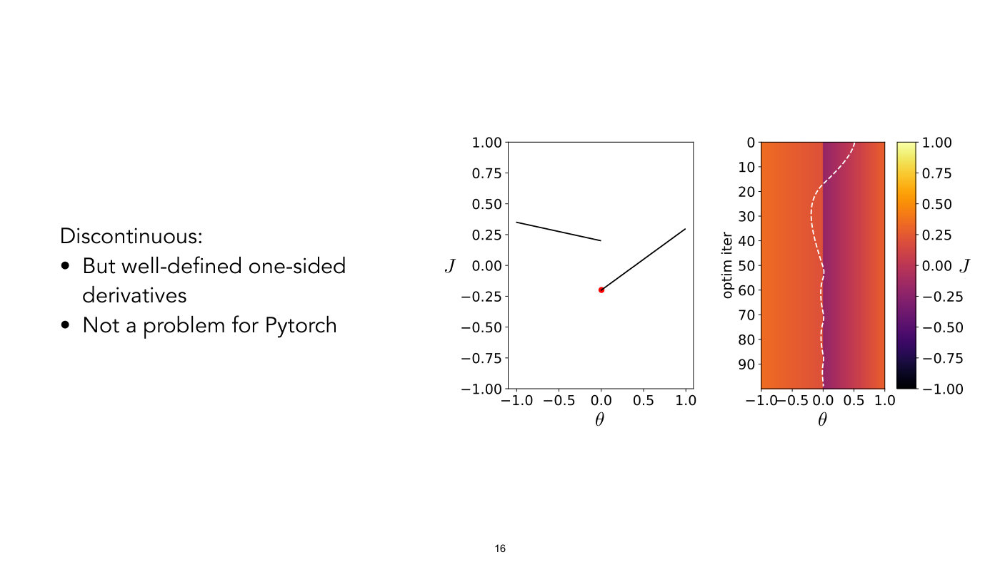

No slide title. Text on the left:

Discontinuous:
- But well-defined one-sided derivatives
- Not a problem for Pytorch

Two plots on the right (same layout as slide 15).

- Left plot: $J$ versus $\theta$ (both axes −1 to 1). Two black line segments with a jump at $\theta = 0$: the left segment slopes gently downward from $J\approx 0.35$ at $\theta=-1$ to $J \approx 0.2$ at $\theta=0$ (open end); the right segment starts at $J\approx -0.2$ at $\theta=0$ (a red dot) and rises to $J \approx 0.3$ at $\theta=1$.
- Right plot: heat map of optim iter versus $\theta$, with orange on the left half ($\theta \lt 0$), and a purple-to-red gradient on the right half ($\theta \gt 0$, darkest purple, about −0.25 at $\theta=0$). The white dashed path starts at $\theta\approx 0.5$, moves left to the discontinuity at $\theta \approx 0$ by iteration ≈ 20, slips slightly across to about −0.1 around iteration 30, and then hovers at $\theta\approx 0$ for the rest of the run. Colour bar for $J$ as before.

## Slide 17 — Vanishing gradient

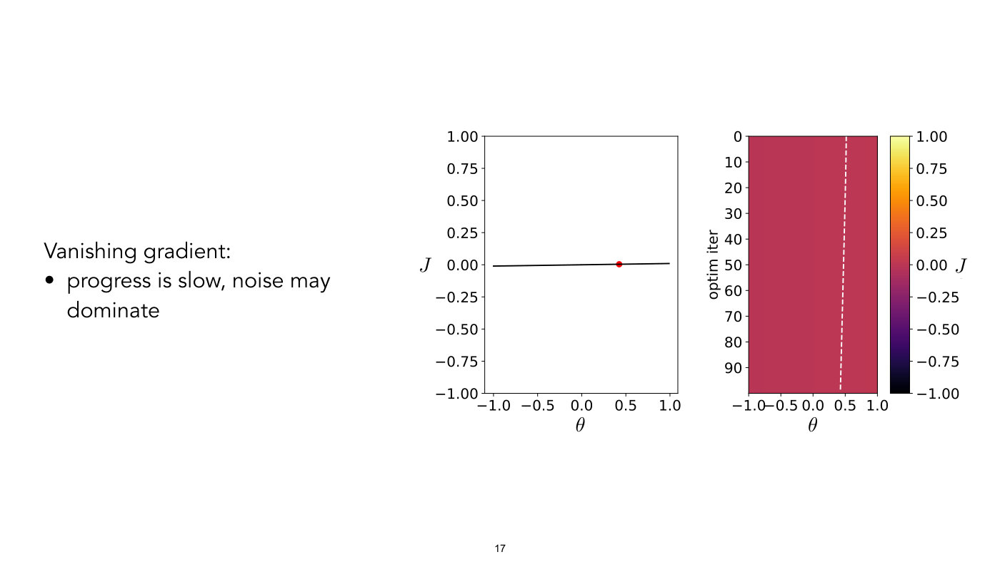

No slide title. Text on the left:

Vanishing gradient:
- progress is slow, noise may dominate

Two plots on the right.

- Left plot: $J$ versus $\theta$ (both −1 to 1). A single, almost-flat black line at $J\approx 0$, with a very slight upward slope from about −0.02 at $\theta=-1$ to about 0.01 at $\theta=1$. A red dot at $\theta \approx 0.45$.
- Right plot: heat map, optim iter versus $\theta$, uniform red-crimson colour (J ≈ 0) across the whole plot. The white dashed path stays at $\theta \approx 0.5$, barely moving (drifting to about 0.45 at iteration 99). Colour bar for $J$ as before.

## Slide 18 — Zero gradient

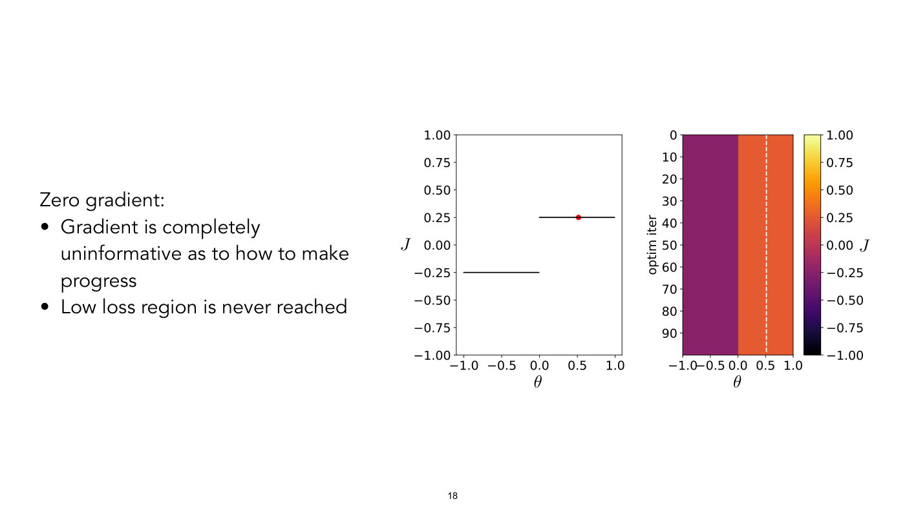

No slide title. Text on the left:

Zero gradient:
- Gradient is completely uninformative as to how to make progress
- Low loss region is never reached

Two plots on the right.

- Left plot: $J$ versus $\theta$ (both −1 to 1): a step function. For $\theta \lt 0$ a horizontal black line at $J=-0.25$; for $\theta \gt 0$ a horizontal black line at $J=0.25$ with a red dot at $\theta \approx 0.5$.
- Right plot: heat map, optim iter versus $\theta$: the left half ($\theta \lt 0$) is purple-magenta (J = −0.25) and the right half is orange-red (J = 0.25). The white dashed path is a straight vertical line at $\theta\approx 0.5$ for all iterations (no movement). Colour bar for $J$ as before.

## Slide 19 — Exploding gradient

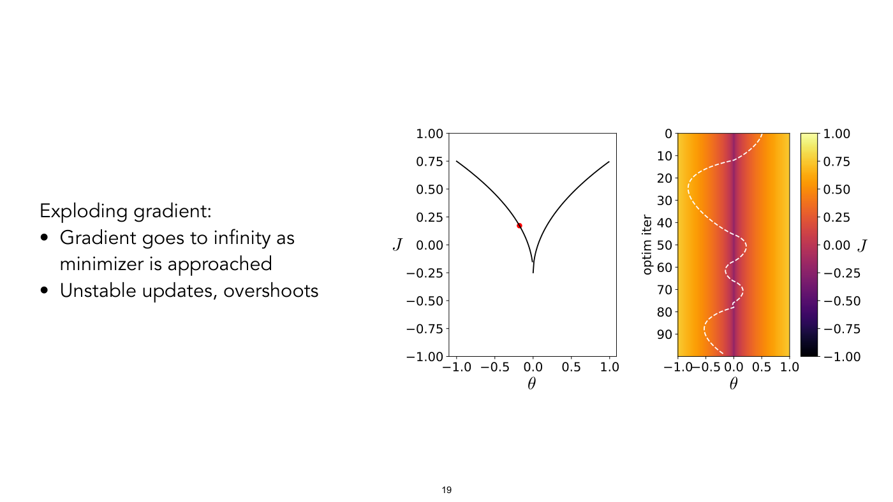

No slide title. Text on the left:

Exploding gradient:
- Gradient goes to infinity as minimizer is approached
- Unstable updates, overshoots

Two plots on the right.

- Left plot: $J$ versus $\theta$ (both −1 to 1): a cusp, not quite symmetric. The black curve falls from about 0.75 at $\theta=-1$ in a concave-down arc to about $J=-0.15$ at $\theta=0$; the right branch starts slightly lower, with a short near-vertical stub down to about $J=-0.25$ at its foot, and rises to about 0.75 at $\theta=1$. A red dot on the left branch at $\theta\approx -0.18$, $J\approx 0.17$.
- Right plot: heat map, optim iter versus $\theta$: orange-yellow (high J) at the edges, with a narrow dark purple vertical band at $\theta = 0$. The white dashed path starts at $\theta\approx 0.5$, then swings back and forth across 0 with large amplitude (to about −0.8 around iteration 25, +0.25 at iteration 50, about −0.2 at 62, +0.2 at 70, near 0 at about 78, out to about −0.55 near iteration 88, ending near −0.2 at iteration 99), i.e. it overshoots and never settles. Colour bar for $J$ as before.

## Slide 20 — Multiple local minima

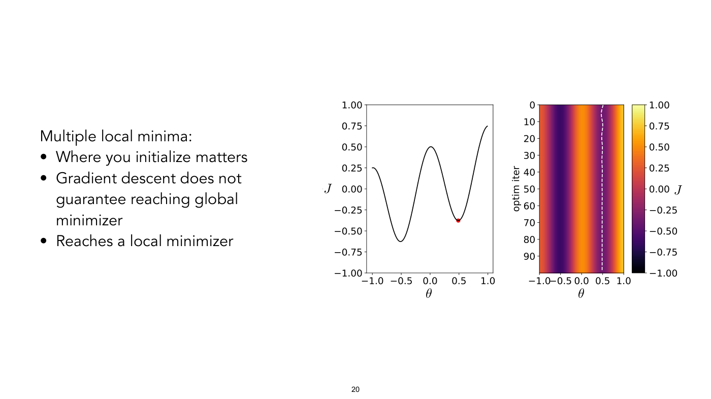

No slide title. Text on the left:

Multiple local minima:
- Where you initialize matters
- Gradient descent does not guarantee reaching global minimizer
- Reaches a local minimizer

Two plots on the right.

- Left plot: $J$ versus $\theta$ (both −1 to 1): a smooth black wavy curve with two minima and one interior maximum: starts at about 0.25 at $\theta=-1$, falls to a deeper minimum of about −0.62 at $\theta\approx -0.5$, rises to a peak of about 0.5 at $\theta=0$, falls to a shallower minimum of about −0.38 at $\theta\approx 0.5$ (red dot), then rises to about 0.75 at $\theta=1$.
- Right plot: heat map, optim iter versus $\theta$: vertical colour bands (dark purple band around $\theta \approx -0.5$, orange around 0, purple-red around 0.5, yellow-orange at 1). The white dashed path starts at $\theta\approx 0.5$ and stays there, nearly vertical, through iteration 99 (it settles in the shallower local minimum and never reaches the deeper one on the left). Colour bar for $J$ as before.

## Slide 21 — Evolution Strategies

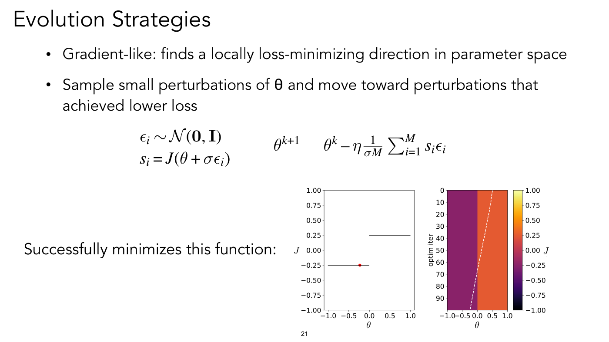

- Gradient-like: finds a locally loss-minimizing direction in parameter space
- Sample small perturbations of θ and move toward perturbations that achieved lower loss

$$\epsilon_i \sim \mathcal{N}(\mathbf{0}, \mathbf{I}) \qquad s_i = J(\theta + \sigma \epsilon_i)$$

$$\theta^{k+1} \qquad \theta^k - \eta \frac{1}{\sigma M} \sum_{i=1}^{M} s_i \epsilon_i$$

(On the slide the first pair of equations sits on the left, stacked, and the update rule sits to its right, with a gap and no equals or assignment symbol between $\theta^{k+1}$ and the right-hand side.)

"Successfully minimizes this function:" followed by two plots.

- Left plot: $J$ versus $\theta$ (both axes −1 to 1): a step function. A horizontal black line at $J=-0.25$ for $\theta \lt 0$ with a red dot at $\theta \approx -0.25$, and a horizontal black line at $J = 0.25$ for $\theta \gt 0$.
- Right plot: heat map of optim iter (0 at top to about 99) versus $\theta$: the left half ($\theta \lt 0$) is purple (J = −0.25), the right half is orange-red (J = 0.25). A white dashed path starts at $\theta \approx 0.5$ at iteration 0 and moves in a nearly straight diagonal line to the left, crossing $\theta = 0$ at about iteration 65 and ending at about $\theta \approx -0.3$ at iteration 99, i.e. it crosses the discontinuity into the low-loss region. Colour bar for $J$ from yellow (1.00) to black (−1.00), labelled $J$.

## Slide 22 — Gradient clipping

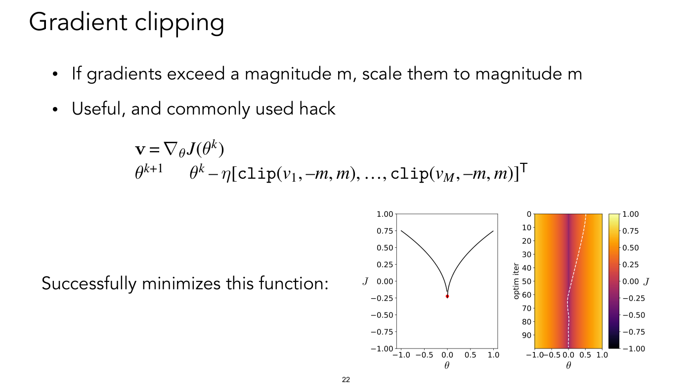

- If gradients exceed a magnitude m, scale them to magnitude m
- Useful, and commonly used hack

$$\mathbf{v} = \nabla_\theta J(\theta^k)$$

$$\theta^{k+1} \qquad \theta^k - \eta [\texttt{clip}(v_1, -m, m), \ldots, \texttt{clip}(v_M, -m, m)]^\mathsf{T}$$

(As printed, there is a gap with no equals or assignment symbol between $\theta^{k+1}$ and the right-hand side.)

"Successfully minimizes this function:" followed by two plots.

- Left plot: $J$ versus $\theta$ (both axes −1 to 1): the cusp function. A black curve from about 0.75 at $\theta=-1$, curving down steeply to a sharp point at about $J = -0.22$ at $\theta = 0$ (red dot), then rising symmetrically to about 0.75 at $\theta = 1$.
- Right plot: heat map of optim iter versus $\theta$: orange-yellow at the edges and a narrow dark purple band at $\theta=0$. The white dashed path starts at $\theta \approx 0.5$, moves smoothly left, reaches $\theta\approx 0$ at about iteration 60 (slightly overshooting to about −0.02), and then stays at $\theta \approx 0$ through iteration 99, with no large oscillation (in contrast to slide 19). Colour bar for $J$.

## Slide 23 — What is important in a loss function?

- Everywhere continuous
- Everywhere differentiable
- Everywhere smooth

## Slide 24 — What is important in a loss function?

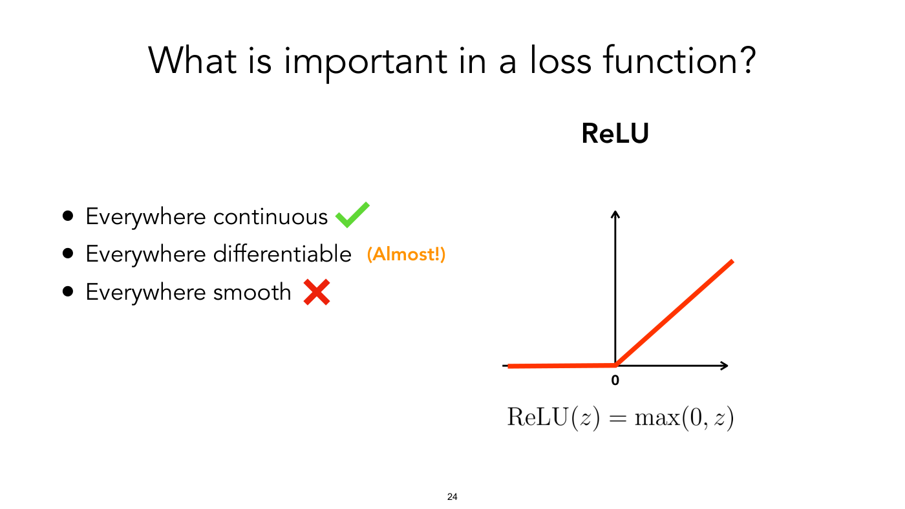

- Everywhere continuous (green check mark)
- Everywhere differentiable (orange text: "(Almost!)")
- Everywhere smooth (red X)

Right side: the heading "ReLU" above a plot with a vertical and a horizontal axis arrow crossing, with "0" labelled under the origin. A red-orange curve: flat along the horizontal axis for negative inputs and rising linearly at 45 degrees for positive inputs, with a sharp corner at 0. Below the plot:

$$\mathrm{ReLU}(z) = \max(0, z)$$

## Slide 25 — What is important in a loss function?

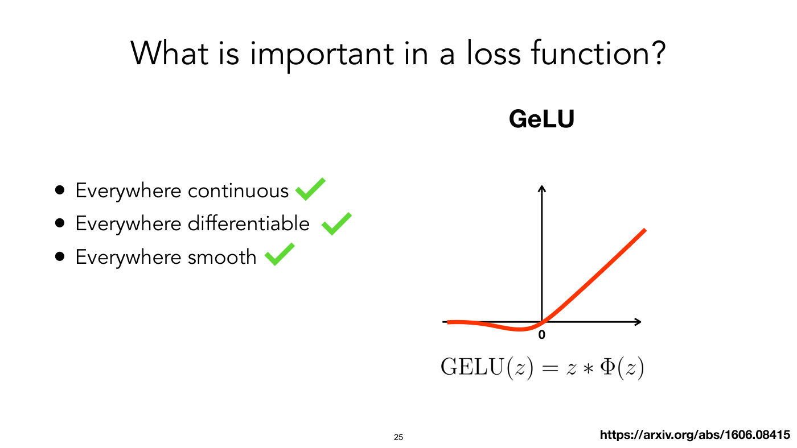

- Everywhere continuous (green check mark)
- Everywhere differentiable (green check mark)
- Everywhere smooth (green check mark)

Right side: the heading "GeLU" above a plot with the same axes as slide 24 ("0" under the origin). A red-orange smooth curve: nearly flat for negative inputs, dipping slightly below the horizontal axis (a shallow dip of small magnitude just left of 0), passing through the origin and rising smoothly, approaching a 45-degree line for positive inputs. Below the plot:

$$\mathrm{GELU}(z) = z \ast \Phi(z)$$

Bottom right: https://arxiv.org/abs/1606.08415 ($\Phi$ is not defined on the slide.)

Added relative to slide 24: the ReLU plot is replaced by the smooth GeLU plot, and all three checks are green.

## Slide 26 — Computation Graphs

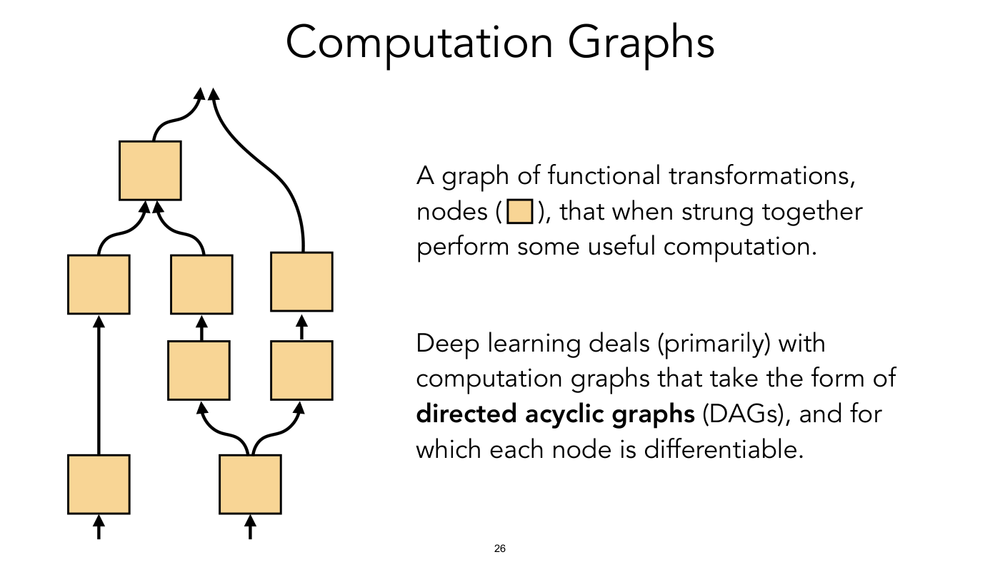

Left: a diagram of a directed acyclic graph of eight beige (pale orange) square nodes with black arrows pointing upward. Layout from bottom to top:

- Bottom row: two nodes, a left node A and a right node B. Each has an arrow entering from below (inputs).
- Node A (bottom left) has one arrow up to a node in the second-from-top row (left column, call it C).
- Node B (bottom centre) has two arrows leaving it, splitting up-left to a middle-row node D (centre) and up-right to a middle-row node E (right).
- D (centre, middle) has an arrow up to a node F (centre, upper).
- E (right, middle) has an arrow up to a node G (right, upper).
- Upper row: three nodes C (left), F (centre), G (right). C and F each have an arrow going up into the single top node H (top left).
- G (right) has a long curved arrow going up past the top node to an output arrowhead at the top.
- The top node H has a curved arrow going up to a second output arrowhead at the top. So there are two outputs at the top, one from H and one from G.

Right: "A graph of functional transformations, nodes (a small beige square icon), that when strung together perform some useful computation."

"Deep learning deals (primarily) with computation graphs that take the form of **directed acyclic graphs** (DAGs), and for which each node is differentiable."

## Slide 27 — Computation Graphs

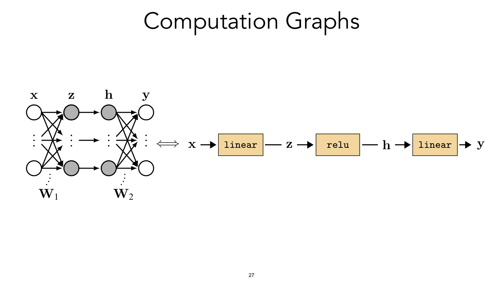

Left: a neural-network node diagram of an MLP with four columns of circles labelled above $\mathbf{x}$, $\mathbf{z}$, $\mathbf{h}$, $\mathbf{y}$. The $\mathbf{x}$ column has white (empty) circles at top and bottom with a vertical column of three dots between them; the $\mathbf{z}$ column has grey-filled circles at top and bottom with dots between; the $\mathbf{h}$ column has grey-filled circles with dots; the $\mathbf{y}$ column has white circles with dots. Dense crossing arrows connect every $\mathbf{x}$ circle to every $\mathbf{z}$ circle (labelled by a dotted line underneath as $\mathbf{W}_ 1$); a single one-to-one horizontal arrow connects each $\mathbf{z}$ circle to the corresponding $\mathbf{h}$ circle; dense crossing arrows connect every $\mathbf{h}$ circle to every $\mathbf{y}$ circle (labelled by a dotted line underneath as $\mathbf{W}_ 2$).

Then a double-headed arrow $\Longleftrightarrow$ (equivalent to) and the same network as a computation graph on the right, left to right: $\mathbf{x}$ → box "linear" — $\mathbf{z}$ → box "relu" — $\mathbf{h}$ → box "linear" → $\mathbf{y}$. The boxes are beige with monospace labels; the intermediate variables $\mathbf{z}$ and $\mathbf{h}$ are written on the connecting lines.

## Slide 28 — Forward pass

A single beige box labelled above in monospace "forward", containing $f(\mathbf{x}_ {\texttt{in}}, \theta)$. An arrow from the left labelled $\mathbf{x}_ {\texttt{in}}$ enters the box; a second arrow enters from beneath, coming up from the label $\theta$ (an L-shaped arrow). An arrow leaves the box on the right labelled $\mathbf{x}_ {\texttt{out}}$. Below:

$$\mathbf{x}_ {\texttt{out}} = f(\mathbf{x}_ {\texttt{in}}, \theta)$$

## Slide 29 — Forward pass — multiple layers

A left-to-right chain of boxes with data and parameter inputs:

- $\mathbf{x}_ 0$ → beige box $f_1$ ; a blue square $\theta_1$ feeds into $f_1$ from below (L-shaped arrow).
- $f_1$ — $\mathbf{x}_ 1$ → beige box $f_2$ ; blue square $\theta_2$ feeds into $f_2$.
- $f_2$ — "· · ·" → beige box $f_{L-1}$ ; blue square $\theta_{L-1}$ feeds into $f_{L-1}$.
- $f_{L-1}$ — $\mathbf{x}_ {L-1}$ → beige box $f_L$ ; blue square $\theta_L$ feeds into $f_L$.
- $f_L$ — $\mathbf{x}_ L$ → red (salmon) box $\mathcal{L}$ → $J$.

Text: "This computation graph could represent an MLP, for example"

## Slide 30 — Learning

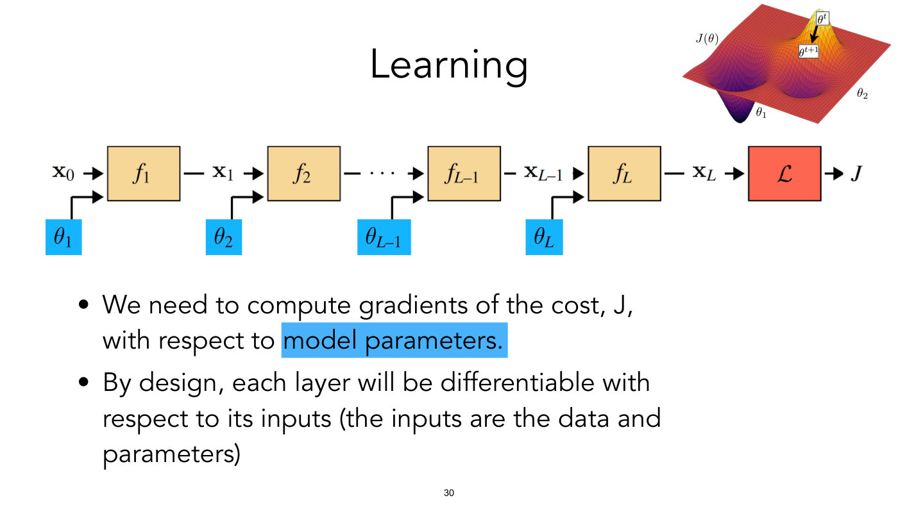

The same chain as slide 29 (shifted slightly lower on the slide): $\mathbf{x}_ 0$ → $f_1$ (with $\theta_1$ in a blue square), $\mathbf{x}_ 1$ → $f_2$ (with $\theta_2$), "· · ·" → $f_{L-1}$ (with $\theta_{L-1}$), $\mathbf{x}_ {L-1}$ → $f_L$ (with $\theta_L$), $\mathbf{x}_ L$ → red box $\mathcal{L}$ → $J$.

Top right, a small inset of the 3D loss-surface plot from slide 7: axes labelled $J(\theta)$, $\theta_1$, $\theta_2$; a tall yellow peak at the back right with a small boxed label $\theta^t$ at its top, and a short black arrow from there down the slope to a second boxed label $\theta^{t+1}$.

Text:
- We need to compute gradients of the cost, J, with respect to model parameters. ("model parameters." is highlighted with a blue background.)
- By design, each layer will be differentiable with respect to its inputs (the inputs are the data and parameters)

## Slide 31 — Opening parenthesis (build step)

No slide title. The page shows only a single large black opening parenthesis "(" in the centre of an otherwise blank white slide. (It appears to be a build frame: an animation step in a sequence with slides 32–34 and 35, which shows the matching closing parenthesis.)

## Slide 32 — Matrix calculus

- $\mathbf{x}$ column vector of size $[n \times 1]$:

$$\mathbf{x} = \begin{pmatrix} x_1 \cr x_2 \cr \vdots \cr x_n \end{pmatrix}$$

- We now define a function on vector $\mathbf{x}$: $\mathbf{y} = f(\mathbf{x})$
- If $y$ is a scalar, then

$$\frac{\partial y}{\partial \mathbf{x}} = \begin{pmatrix} \frac{\partial y}{\partial x_1} & \frac{\partial y}{\partial x_2} & \cdots & \frac{\partial y}{\partial x_n} \end{pmatrix}$$

The derivative of y is a row vector of size $[1 \times n]$

- If $\mathbf{y}$ is a vector $[m \times 1]$, then (*Jacobian formulation*):

$$\frac{\partial \mathbf{y}}{\partial \mathbf{x}} = \begin{pmatrix} \frac{\partial y_1}{\partial x_1} & \frac{\partial y_1}{\partial x_2} & \cdots & \frac{\partial y_1}{\partial x_n} \cr \vdots & \vdots & \vdots & \vdots \cr \frac{\partial y_m}{\partial x_1} & \frac{\partial y_m}{\partial x_2} & \cdots & \frac{\partial y_m}{\partial x_n} \end{pmatrix}$$

The derivative of y is a matrix of size $[m \times n]$ (m rows and n columns)

## Slide 33 — Matrix calculus

- If $y$ is a scalar and $\mathbf{X}$ is a matrix of size $[n \times m]$, then

$$\frac{\partial y}{\partial \mathbf{X}} = \begin{pmatrix} \frac{\partial y}{\partial x_{11}} & \frac{\partial y}{\partial x_{21}} & \cdots & \frac{\partial y}{\partial x_{n1}} \cr \vdots & \vdots & \vdots & \vdots \cr \frac{\partial y}{\partial x_{1m}} & \frac{\partial y}{\partial x_{2m}} & \cdots & \frac{\partial y}{\partial x_{nm}} \end{pmatrix}$$

The output is a matrix of size $[m \times n]$

Footer note (serif text): "Wikipedia: The three types of derivatives that have not been considered are those involving vectors-by-matrices, matrices-by-vectors, and matrices-by-matrices. These are not as widely considered and a notation is not widely agreed upon."

## Slide 34 — Matrix calculus

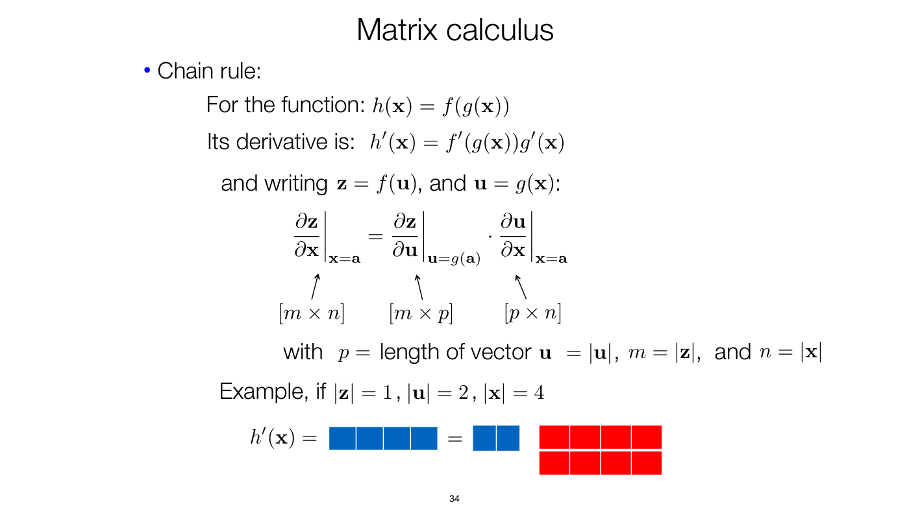

- Chain rule:
  - For the function: $h(\mathbf{x}) = f(g(\mathbf{x}))$
  - Its derivative is: $h'(\mathbf{x}) = f'(g(\mathbf{x})) g'(\mathbf{x})$
  - and writing $\mathbf{z} = f(\mathbf{u})$, and $\mathbf{u} = g(\mathbf{x})$:

$$\left.\frac{\partial \mathbf{z}}{\partial \mathbf{x}}\right|_ {\mathbf{x}=\mathbf{a}} = \left.\frac{\partial \mathbf{z}}{\partial \mathbf{u}}\right|_ {\mathbf{u}=g(\mathbf{a})} \cdot \left.\frac{\partial \mathbf{u}}{\partial \mathbf{x}}\right|_ {\mathbf{x}=\mathbf{a}}$$

Three small arrows point up at the three factors from below, labelled respectively $[m \times n]$ (left side, $\partial\mathbf{z}/\partial\mathbf{x}$), $[m \times p]$ (middle, $\partial\mathbf{z}/\partial\mathbf{u}$) and $[p \times n]$ (right, $\partial\mathbf{u}/\partial\mathbf{x}$).

  - with $p$ = length of vector $\mathbf{u}$ $= \lvert\mathbf{u}\rvert$, $m = \lvert\mathbf{z}\rvert$, and $n = \lvert\mathbf{x}\rvert$
  - Example, if $\lvert\mathbf{z}\rvert = 1$, $\lvert\mathbf{u}\rvert = 2$, $\lvert\mathbf{x}\rvert = 4$

The example is shown as a block picture: $h'(\mathbf{x}) =$ a blue row of 4 cells (the 1×4 result) $=$ a blue row of 2 cells (the 1×2 matrix $\partial\mathbf{z}/\partial\mathbf{u}$) times a red grid of 2 rows × 4 columns of cells (the 2×4 matrix $\partial\mathbf{u}/\partial\mathbf{x}$).

## Slide 35 — Closing parenthesis (build step)

No slide title. The page shows only a single large black closing parenthesis ")" in the centre of an otherwise blank white slide. (Matches the "(" on slide 31; the two pages bracket the matrix-calculus slides 32–34.)

## Slide 36 — The Trick of Backpropagation — Reuse of Computation

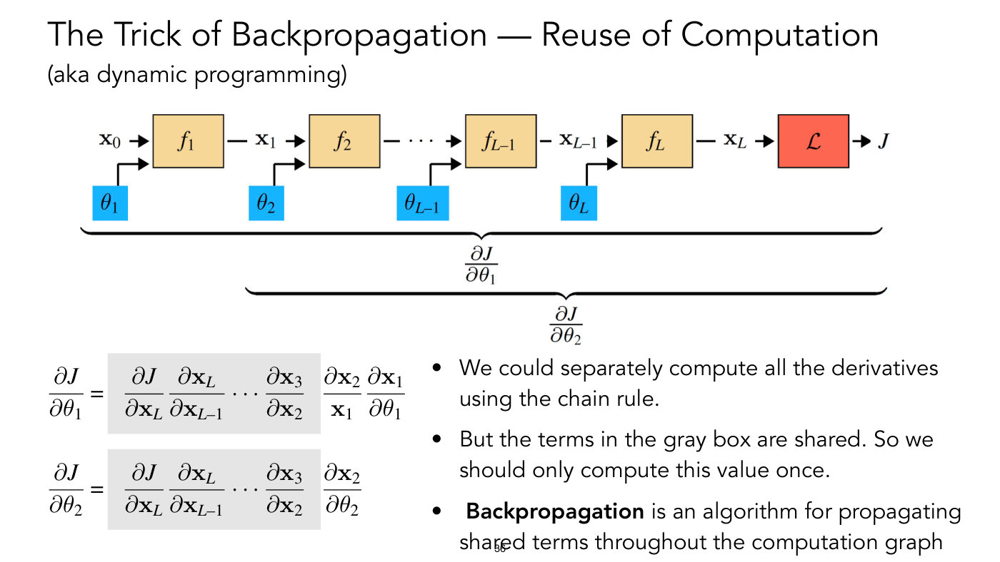

Subtitle: "(aka dynamic programming)"

Top: the forward chain of slide 29: $\mathbf{x}_ 0$ → $f_1$ (with blue $\theta_1$), $\mathbf{x}_ 1$ → $f_2$ (blue $\theta_2$), · · · → $f_{L-1}$ (blue $\theta_{L-1}$), $\mathbf{x}_ {L-1}$ → $f_L$ (blue $\theta_L$), $\mathbf{x}_ L$ → red $\mathcal{L}$ → $J$.

Two curly braces under the chain, spanning part of it:
- A long brace spanning from under $\theta_1$ / $f_1$ to the end (all the layers to $J$), labelled $\dfrac{\partial J}{\partial \theta_1}$.
- A shorter brace spanning from about $f_2$ to the end, labelled $\dfrac{\partial J}{\partial \theta_2}$.

Bottom left, two equations (as printed):

$$\frac{\partial J}{\partial \theta_1} = \left[\frac{\partial J}{\partial \mathbf{x}_ L} \frac{\partial \mathbf{x}_ L}{\partial \mathbf{x}_ {L-1}} \cdots \frac{\partial \mathbf{x}_ 3}{\partial \mathbf{x}_ 2}\right] \frac{\partial \mathbf{x}_ 2}{\mathbf{x}_ 1} \frac{\partial \mathbf{x}_ 1}{\partial \theta_1}$$

$$\frac{\partial J}{\partial \theta_2} = \left[\frac{\partial J}{\partial \mathbf{x}_ L} \frac{\partial \mathbf{x}_ L}{\partial \mathbf{x}_ {L-1}} \cdots \frac{\partial \mathbf{x}_ 3}{\partial \mathbf{x}_ 2}\right] \frac{\partial \mathbf{x}_ 2}{\partial \theta_2}$$

In both equations the bracketed product is drawn inside a shared light-grey box (shown here with square brackets). In the first equation the printed fourth factor has $\partial\mathbf{x}_ 2$ over $\mathbf{x}_ 1$ with no $\partial$ in the denominator; this is transcribed as printed.

Right-hand bullets:
- We could separately compute all the derivatives using the chain rule.
- But the terms in the gray box are shared. So we should only compute this value once.
- **Backpropagation** is an algorithm for propagating shared terms throughout the computation graph

## Slide 37 — Forward pass / Backward pass

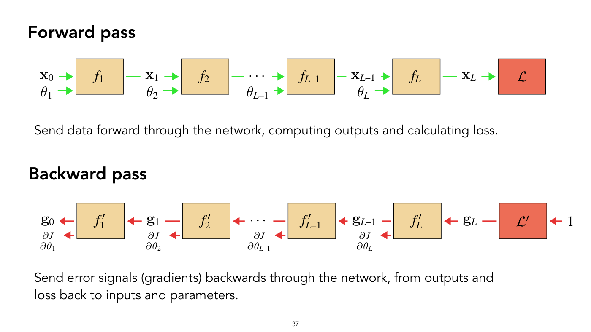

No single slide title; two headed sections.

**Forward pass** (bold heading). A chain of beige boxes $f_1, f_2, \ldots, f_{L-1}, f_L$ followed by a red box $\mathcal{L}$, left to right, with green arrows. $\mathbf{x}_ 0$ and $\theta_1$ feed into $f_1$ (green arrows); $f_1$ — $\mathbf{x}_ 1$ and $\theta_2$ feed into $f_2$; $f_2$ — "· · ·" — and $\theta_{L-1}$ feed into $f_{L-1}$; $f_{L-1}$ — $\mathbf{x}_ {L-1}$ and $\theta_L$ feed into $f_L$; $f_L$ — $\mathbf{x}_ L$ → red $\mathcal{L}$. Caption: "Send data forward through the network, computing outputs and calculating loss."

**Backward pass** (bold heading). The same chain mirrored with red arrows pointing right-to-left; the boxes are now labelled with derivative functions: $f_1', f_2', \ldots, f_{L-1}', f_L'$ and the red box $\mathcal{L}'$. Starting at the right: a "1" enters $\mathcal{L}'$ (red arrow pointing left); $\mathcal{L}'$ outputs $\mathbf{g}_ L$ into $f_L'$; $f_L'$ outputs $\mathbf{g}_ {L-1}$ (to $f_{L-1}'$) and, in a second lower arrow, $\dfrac{\partial J}{\partial \theta_L}$; $f_{L-1}'$ outputs "· · ·" onward and $\dfrac{\partial J}{\partial \theta_{L-1}}$; $f_2'$ outputs $\mathbf{g}_ 1$ (to $f_1'$) and $\dfrac{\partial J}{\partial \theta_2}$; $f_1'$ outputs $\mathbf{g}_ 0$ and $\dfrac{\partial J}{\partial \theta_1}$. Caption: "Send error signals (gradients) backwards through the network, from outputs and loss back to inputs and parameters."

## Slide 38 — Backward for a Generic Layer

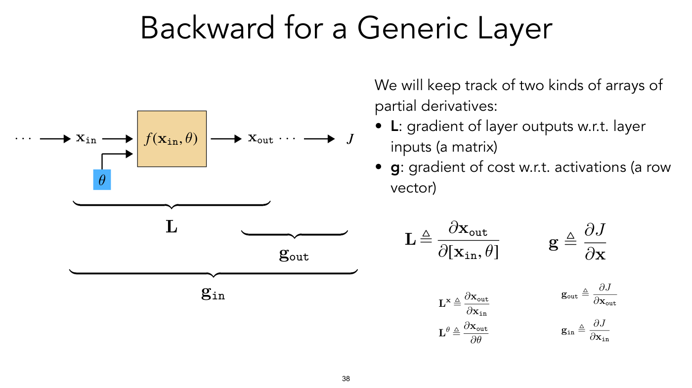

Left diagram: "· · ·" → $\mathbf{x}_ {\texttt{in}}$ → beige box $f(\mathbf{x}_ {\texttt{in}}, \theta)$ (with a blue square $\theta$ feeding in from below) → $\mathbf{x}_ {\texttt{out}}$ "· · ·" → $J$. Under the diagram, three curly braces: one under the box (spanning $\mathbf{x}_ {\texttt{in}}$ through the box) labelled $\mathbf{L}$; one under the right half (from $\mathbf{x}_ {\texttt{out}}$ to $J$) labelled $\mathbf{g}_ {\texttt{out}}$; and a long one underneath both (from $\mathbf{x}_ {\texttt{in}}$ to $J$) labelled $\mathbf{g}_ {\texttt{in}}$.

Right text: "We will keep track of two kinds of arrays of partial derivatives:"
- **L**: gradient of layer outputs w.r.t. layer inputs (a matrix)
- **g**: gradient of cost w.r.t. activations (a row vector)

$$\mathbf{L} \triangleq \frac{\partial \mathbf{x}_ {\texttt{out}}}{\partial [\mathbf{x}_ {\texttt{in}}, \theta]} \qquad \mathbf{g} \triangleq \frac{\partial J}{\partial \mathbf{x}}$$

and in smaller print:

$$\mathbf{L}^{\mathbf{x}} \triangleq \frac{\partial \mathbf{x}_ {\texttt{out}}}{\partial \mathbf{x}_ {\texttt{in}}} \qquad \mathbf{L}^{\theta} \triangleq \frac{\partial \mathbf{x}_ {\texttt{out}}}{\partial \theta}$$

$$\mathbf{g}_ {\texttt{out}} \triangleq \frac{\partial J}{\partial \mathbf{x}_ {\texttt{out}}} \qquad \mathbf{g}_ {\texttt{in}} \triangleq \frac{\partial J}{\partial \mathbf{x}_ {\texttt{in}}}$$

## Slide 39 — Backward for a Generic Layer

Same diagram as slide 38 (the layer $f(\mathbf{x}_ {\texttt{in}}, \theta)$ with the $\mathbf{L}$, $\mathbf{g}_ {\texttt{out}}$ and $\mathbf{g}_ {\texttt{in}}$ braces).

Right text: "The parameter update is easy if we know **L** and **g** for a layer:"

$$\frac{\partial J}{\partial \theta} = \underbrace{\frac{\partial J}{\partial \mathbf{x}_ {\texttt{out}}}}_ {\mathbf{g}_ {\texttt{out}}} \underbrace{\frac{\partial \mathbf{x}_ {\texttt{out}}}{\partial \theta}}_ {\mathbf{L}^{\theta}} = \mathbf{g}_ {\texttt{out}} \mathbf{L}^{\theta}$$

$$\theta^{i+1} \qquad \theta^i - \eta \left(\frac{\partial J}{\partial \theta}\right)^\mathsf{T}$$

(As printed, there is a gap with no equals or assignment symbol between $\theta^{i+1}$ and the right-hand side.)

Added relative to slide 38: the parameter-gradient formula and the update rule replace the definitions text.

## Slide 40 — Backward for a Generic Layer

Same diagram as slides 38–39.

Right text: "But how do we get **L** and **g** for each layer?"

"**L** comes from the derivative function, f′, of the layer (which we assume is provided):"

$$\mathbf{L} = f'(\mathbf{x}_ {\texttt{in}}, \theta)$$

"**g** can be computed iteratively via the following recurrence:"

$$\mathbf{g}_ {\texttt{in}} = \mathbf{g}_ {\texttt{out}} \mathbf{L}^{\mathbf{x}}$$

Bottom: the text "backpropagation of error signals" with a curved arrow pointing to the recurrence $\mathbf{g}_ {\texttt{in}} = \mathbf{g}_ {\texttt{out}} \mathbf{L}^{\mathbf{x}}$.

Added relative to slide 39: how $\mathbf{L}$ and $\mathbf{g}$ are obtained, with the recurrence.

## Slide 41 — Backward for a Generic Layer

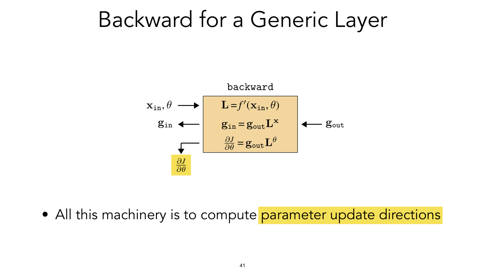

A single beige box labelled above in monospace "backward", containing three lines:

$$\mathbf{L} = f'(\mathbf{x}_ {\texttt{in}}, \theta)$$

$$\mathbf{g}_ {\texttt{in}} = \mathbf{g}_ {\texttt{out}} \mathbf{L}^{\mathbf{x}}$$

$$\frac{\partial J}{\partial \theta} = \mathbf{g}_ {\texttt{out}} \mathbf{L}^{\theta}$$

Arrows: from the left, an arrow labelled $\mathbf{x}_ {\texttt{in}}, \theta$ points into the box; an arrow labelled $\mathbf{g}_ {\texttt{in}}$ points out of the box to the left; from the right, an arrow labelled $\mathbf{g}_ {\texttt{out}}$ points into the box (pointing left). A black L-shaped arrow leaves the box at the lower left and points down to a yellow square containing $\dfrac{\partial J}{\partial \theta}$.

Text: "All this machinery is to compute" followed by the yellow-highlighted phrase "parameter update directions".

## Slide 42 — The Full Algorithm: Forward, Then Backward

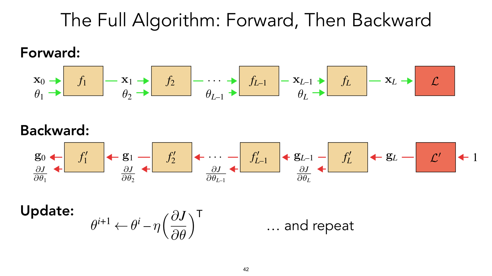

Three labelled sections.

**Forward:** the chain of slide 37's forward pass with green arrows: $\mathbf{x}_ 0$ and $\theta_1$ → $f_1$; $\mathbf{x}_ 1$ and $\theta_2$ → $f_2$; "· · ·" and $\theta_{L-1}$ → $f_{L-1}$; $\mathbf{x}_ {L-1}$ and $\theta_L$ → $f_L$; $\mathbf{x}_ L$ → red box $\mathcal{L}$. (Beige boxes $f_1, f_2, f_{L-1}, f_L$, with plain lines carrying $\mathbf{x}_ 1$ and so on between them.)

**Backward:** the mirrored chain with red arrows pointing left: 1 → red box $\mathcal{L}'$ ; $\mathbf{g}_ L$ → $f_L'$; $\mathbf{g}_ {L-1}$ → $f_{L-1}'$; "· · ·"; $\mathbf{g}_ 1$ → $f_1'$ with outputs $\mathbf{g}_ 0$ at the far left. Under each $f_l'$ box a second red arrow outputs $\dfrac{\partial J}{\partial \theta_l}$ (for $l = 1, 2, L-1, L$).

**Update:**

$$\theta^{i+1} \leftarrow \theta^i - \eta \left(\frac{\partial J}{\partial \theta}\right)^\mathsf{T}$$

followed by the text "... and repeat".

## Slide 43 — Backpropagation — Goal: to update parameters of layer l

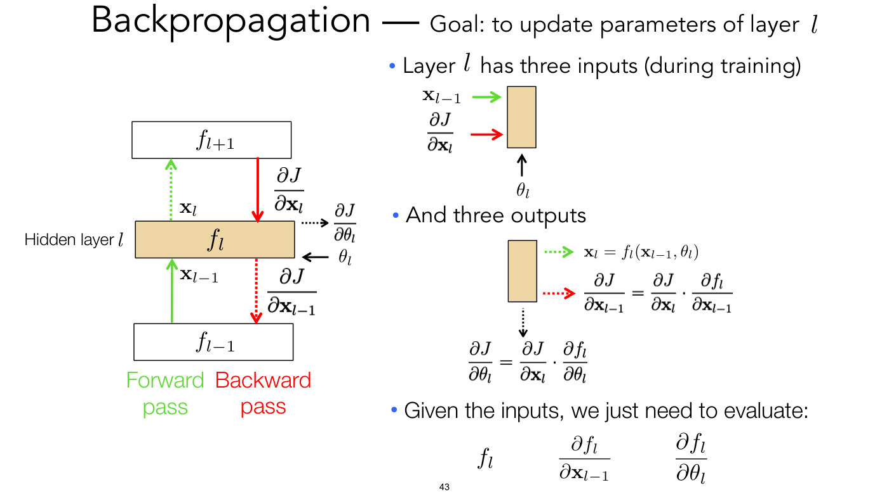

Title: "Backpropagation — Goal: to update parameters of layer" followed by the italic $l$.

Left diagram: three stacked boxes from bottom to top: $f_{l-1}$ (white box, bottom), $f_l$ (beige box, labelled on its left "Hidden layer" followed by $l$), $f_{l+1}$ (white box, top). Arrows between them:
- Forward pass (green): a solid green arrow up from $f_{l-1}$ to $f_l$ labelled $\mathbf{x}_ {l-1}$; a dotted green arrow up from $f_l$ to $f_{l+1}$ labelled $\mathbf{x}_ l$.
- Backward pass (red): a solid red arrow down from $f_{l+1}$ to $f_l$ labelled $\dfrac{\partial J}{\partial \mathbf{x}_ l}$; a dotted red arrow down from $f_l$ to $f_{l-1}$ labelled $\dfrac{\partial J}{\partial \mathbf{x}_ {l-1}}$.
- On the right side of $f_l$: a black arrow pointing left into $f_l$ labelled $\theta_l$, and a dotted black arrow pointing right out of $f_l$ labelled $\dfrac{\partial J}{\partial \theta_l}$.
- Beneath the stack, in green "Forward pass" and in red "Backward pass".

Right text:

- Layer $l$ has three inputs (during training). A small beige tall rectangle has three arrows entering it: a green arrow from the label $\mathbf{x}_ {l-1}$, a red arrow from the label $\dfrac{\partial J}{\partial \mathbf{x}_ l}$ (both from the left), and a black arrow from below from $\theta_l$.
- And three outputs. A beige rectangle with: a dotted green arrow to the right, with $\mathbf{x}_ l = f_l(\mathbf{x}_ {l-1}, \theta_l)$; a dotted red arrow to the right, with

$$\frac{\partial J}{\partial \mathbf{x}_ {l-1}} = \frac{\partial J}{\partial \mathbf{x}_ l} \cdot \frac{\partial f_l}{\partial \mathbf{x}_ {l-1}}$$

and a dotted black arrow down, with

$$\frac{\partial J}{\partial \theta_l} = \frac{\partial J}{\partial \mathbf{x}_ l} \cdot \frac{\partial f_l}{\partial \theta_l}$$

- Given the inputs, we just need to evaluate: $f_l$, $\dfrac{\partial f_l}{\partial \mathbf{x}_ {l-1}}$, $\dfrac{\partial f_l}{\partial \theta_l}$ (three expressions side by side).

## Slide 44 — Backpropagation Summary

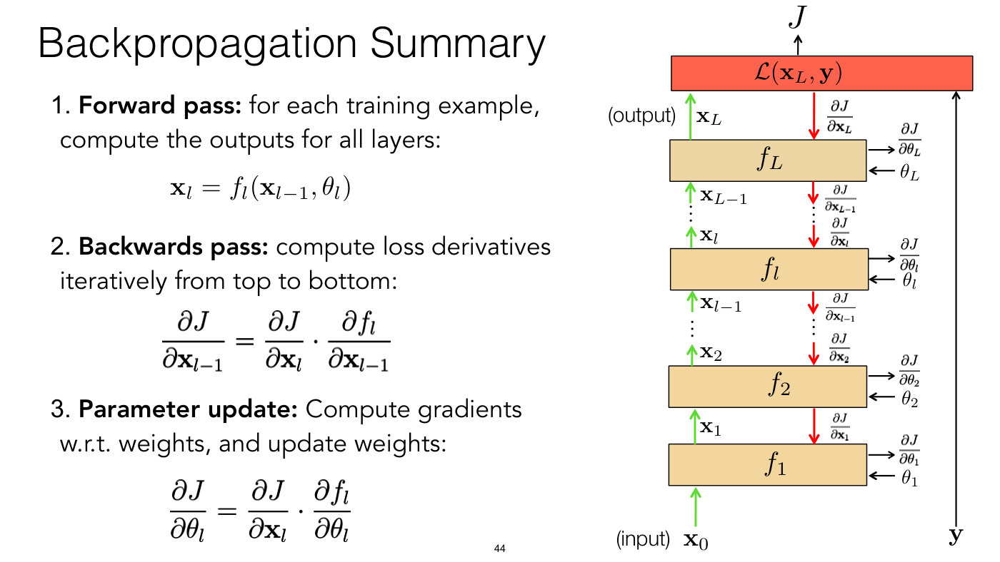

Left text:

1. **Forward pass:** for each training example, compute the outputs for all layers:

$$\mathbf{x}_ l = f_l(\mathbf{x}_ {l-1}, \theta_l)$$

2. **Backwards pass:** compute loss derivatives iteratively from top to bottom:

$$\frac{\partial J}{\partial \mathbf{x}_ {l-1}} = \frac{\partial J}{\partial \mathbf{x}_ l} \cdot \frac{\partial f_l}{\partial \mathbf{x}_ {l-1}}$$

3. **Parameter update:** Compute gradients w.r.t. weights, and update weights:

$$\frac{\partial J}{\partial \theta_l} = \frac{\partial J}{\partial \mathbf{x}_ l} \cdot \frac{\partial f_l}{\partial \theta_l}$$

Right diagram (a vertical stack of layers, input at the bottom, output at the top):

- Bottom: "(input)" $\mathbf{x}_ 0$ with a green arrow up into $f_1$. 
- Beige boxes from bottom to top: $f_1$, $f_2$, (dots), $f_l$, (dots), $f_L$. Between boxes, green up arrows carry the forward values $\mathbf{x}_ 1$ (between $f_1$ and $f_2$), $\mathbf{x}_ 2$ (leaving $f_2$), then, after dots, $\mathbf{x}_ {l-1}$ (into $f_l$), $\mathbf{x}_ l$ (out of $f_l$), then, after dots, $\mathbf{x}_ {L-1}$ (into $f_L$), and $\mathbf{x}_ L$ (out of $f_L$, labelled "(output)").
- Parallel red down arrows carry gradients: $\dfrac{\partial J}{\partial \mathbf{x}_ L}$ (into $f_L$), $\dfrac{\partial J}{\partial \mathbf{x}_ {L-1}}$ (out of $f_L$), $\dfrac{\partial J}{\partial \mathbf{x}_ l}$ (into $f_l$), $\dfrac{\partial J}{\partial \mathbf{x}_ {l-1}}$ (out of $f_l$), $\dfrac{\partial J}{\partial \mathbf{x}_ 2}$ (into $f_2$), $\dfrac{\partial J}{\partial \mathbf{x}_ 1}$ (out of $f_2$ into $f_1$). Dots mark the omitted layers.
- On the right of each beige box, a black arrow enters from the right labelled $\theta_L$, $\theta_l$, $\theta_2$, $\theta_1$ respectively, and a black arrow leaves to the right labelled $\dfrac{\partial J}{\partial \theta_L}$, $\dfrac{\partial J}{\partial \theta_l}$, $\dfrac{\partial J}{\partial \theta_2}$, $\dfrac{\partial J}{\partial \theta_1}$.
- At the top, a red box $\mathcal{L}(\mathbf{x}_ L, \mathbf{y})$ with a black arrow up to $J$. A long thin black arrow runs up along the far right from a label $\mathbf{y}$ at the bottom into the loss box (the target $\mathbf{y}$ feeding the loss).

## Slide 45 — Backpropagation Over Data Batches

"Typically we want to minimize the average cost over lots of datapoints:"

$$J = \frac{1}{N} \sum_{i=1}^{N} J_i(\mathbf{x}^i, \theta)$$

"Then the gradient of the total cost is just the average of all the gradients of all the per-datapoint costs:"

$$\frac{\partial J}{\partial \theta} = \frac{1}{N} \sum_{i=1}^{N} \frac{\partial J_i(\mathbf{x}^i, \theta)}{\partial \theta}$$

## Slide 46 — Linear layer

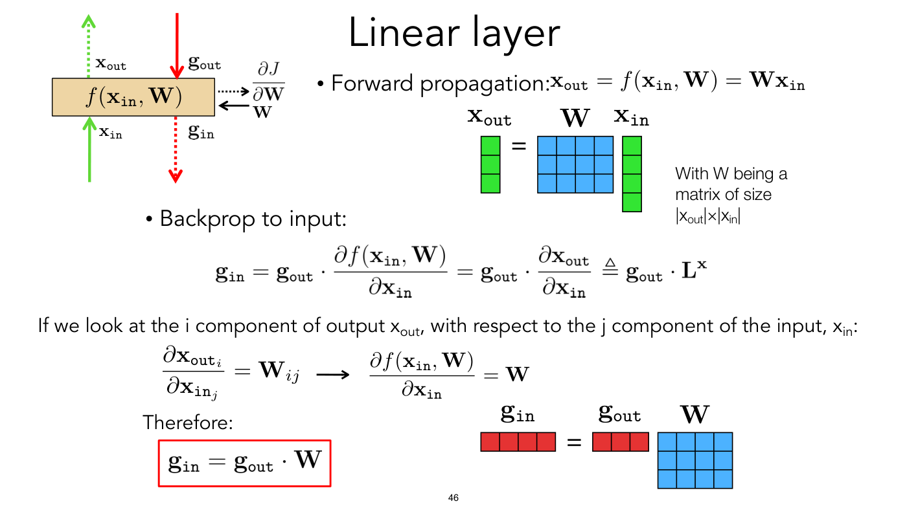

Top-left diagram: a beige box $f(\mathbf{x}_ {\texttt{in}}, \mathbf{W})$. A solid green arrow up from below labelled $\mathbf{x}_ {\texttt{in}}$ enters it; a dotted green arrow leaves upward labelled $\mathbf{x}_ {\texttt{out}}$; a solid red arrow comes down from above labelled $\mathbf{g}_ {\texttt{out}}$; a dotted red arrow leaves downward labelled $\mathbf{g}_ {\texttt{in}}$. On the right: a black arrow pointing left into the box from the label $\mathbf{W}$, and a dotted black arrow pointing right out of the box to $\dfrac{\partial J}{\partial \mathbf{W}}$.

- Forward propagation: $\mathbf{x}_ {\texttt{out}} = f(\mathbf{x}_ {\texttt{in}}, \mathbf{W}) = \mathbf{W} \mathbf{x}_ {\texttt{in}}$

A block picture: $\mathbf{x}_ {\texttt{out}}$ = a green column of 3 cells; "=" ; $\mathbf{W}$ = a blue grid of 3 rows × 4 columns; $\mathbf{x}_ {\texttt{in}}$ = a green column of 4 cells. Annotation: "With W being a matrix of size |x_out|×|x_in|" (written with subscripts on the slide).

- Backprop to input:

$$\mathbf{g}_ {\texttt{in}} = \mathbf{g}_ {\texttt{out}} \cdot \frac{\partial f(\mathbf{x}_ {\texttt{in}}, \mathbf{W})}{\partial \mathbf{x}_ {\texttt{in}}} = \mathbf{g}_ {\texttt{out}} \cdot \frac{\partial \mathbf{x}_ {\texttt{out}}}{\partial \mathbf{x}_ {\texttt{in}}} \triangleq \mathbf{g}_ {\texttt{out}} \cdot \mathbf{L}^{\mathbf{x}}$$

"If we look at the i component of output $x_{out}$, with respect to the j component of the input, $x_{in}$:"

$$\frac{\partial \mathbf{x}_ {\texttt{out}_ i}}{\partial \mathbf{x}_ {\texttt{in}_ j}} = \mathbf{W}_ {ij} \quad\longrightarrow\quad \frac{\partial f(\mathbf{x}_ {\texttt{in}}, \mathbf{W})}{\partial \mathbf{x}_ {\texttt{in}}} = \mathbf{W}$$

"Therefore:" in a red-outlined box:

$$\mathbf{g}_ {\texttt{in}} = \mathbf{g}_ {\texttt{out}} \cdot \mathbf{W}$$

Block picture at bottom right: $\mathbf{g}_ {\texttt{in}}$ = a red row of 4 cells; "="; $\mathbf{g}_ {\texttt{out}}$ = a red row of 3 cells; $\mathbf{W}$ = a blue grid of 3 rows × 4 columns (the same $\mathbf{W}$ as above).

## Slide 47 — Linear layer

Same top-left diagram as slide 46.

- Forward propagation: $\mathbf{x}_ {\texttt{out}} = f(\mathbf{x}_ {\texttt{in}}, \mathbf{W}) = \mathbf{W} \mathbf{x}_ {\texttt{in}}$
- Backprop to input: the result in a red-outlined box,

$$\mathbf{g}_ {\texttt{in}} = \mathbf{g}_ {\texttt{out}} \cdot \mathbf{W}$$

with the block picture: $\mathbf{g}_ {\texttt{in}}$ (red row of 4 cells) = $\mathbf{g}_ {\texttt{out}}$ (red row of 3 cells) times $\mathbf{W}$ (blue grid 3 rows × 4 columns).

Text: "Now let's see how we use the set of outputs to compute the weights update equation (backprop to the weights)."

Added relative to slide 46: this is a condensed version; the derivation of $\mathbf{g}_ {\texttt{in}}$ and the $\mathbf{W}\mathbf{x}$ block picture are removed, and the transition sentence about backprop to the weights is added.

## Slide 48 — Linear layer

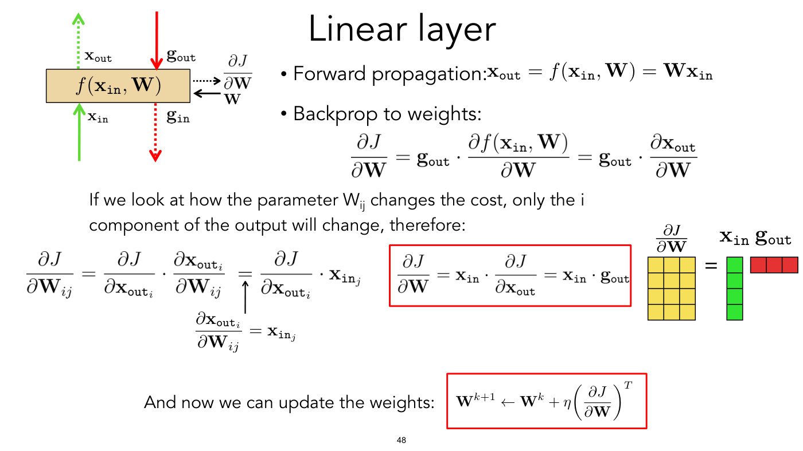

Same top-left diagram as slide 46.

- Forward propagation: $\mathbf{x}_ {\texttt{out}} = f(\mathbf{x}_ {\texttt{in}}, \mathbf{W}) = \mathbf{W} \mathbf{x}_ {\texttt{in}}$
- Backprop to weights:

$$\frac{\partial J}{\partial \mathbf{W}} = \mathbf{g}_ {\texttt{out}} \cdot \frac{\partial f(\mathbf{x}_ {\texttt{in}}, \mathbf{W})}{\partial \mathbf{W}} = \mathbf{g}_ {\texttt{out}} \cdot \frac{\partial \mathbf{x}_ {\texttt{out}}}{\partial \mathbf{W}}$$

"If we look at how the parameter $W_{ij}$ changes the cost, only the i component of the output will change, therefore:"

$$\frac{\partial J}{\partial \mathbf{W}_ {ij}} = \frac{\partial J}{\partial \mathbf{x}_ {\texttt{out}_ i}} \cdot \frac{\partial \mathbf{x}_ {\texttt{out}_ i}}{\partial \mathbf{W}_ {ij}} = \frac{\partial J}{\partial \mathbf{x}_ {\texttt{out}_ i}} \cdot \mathbf{x}_ {\texttt{in}_ j}$$

with an arrow pointing up at the middle "=" from the sub-equation

$$\frac{\partial \mathbf{x}_ {\texttt{out}_ i}}{\partial \mathbf{W}_ {ij}} = \mathbf{x}_ {\texttt{in}_ j}$$

In a red-outlined box:

$$\frac{\partial J}{\partial \mathbf{W}} = \mathbf{x}_ {\texttt{in}} \cdot \frac{\partial J}{\partial \mathbf{x}_ {\texttt{out}}} = \mathbf{x}_ {\texttt{in}} \cdot \mathbf{g}_ {\texttt{out}}$$

Block picture: $\dfrac{\partial J}{\partial \mathbf{W}}$ = a yellow grid of 4 rows × 3 columns; "="; $\mathbf{x}_ {\texttt{in}}$ = a green column of 4 cells; $\mathbf{g}_ {\texttt{out}}$ = a red row of 3 cells (so the product is an outer product).

"And now we can update the weights:" in a red-outlined box:

$$\mathbf{W}^{k+1} \leftarrow \mathbf{W}^k + \eta \left(\frac{\partial J}{\partial \mathbf{W}}\right)^T$$

(As printed, the update uses a plus sign.)

## Slide 49 — Linear layer

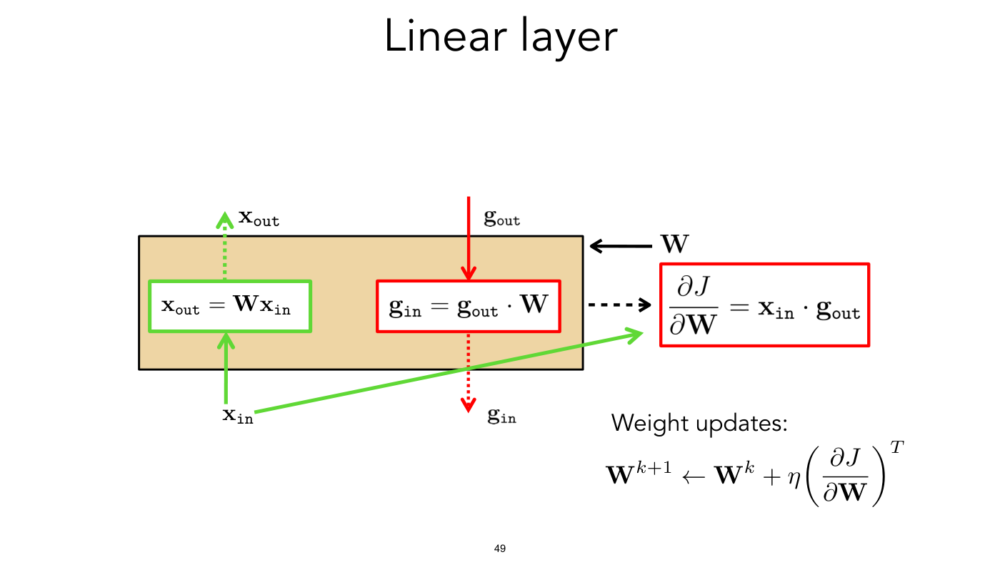

A summary diagram of the linear layer. A large beige rectangle contains two labelled boxes: a green-outlined box with $\mathbf{x}_ {\texttt{out}} = \mathbf{W}\mathbf{x}_ {\texttt{in}}$ and a red-outlined box with $\mathbf{g}_ {\texttt{in}} = \mathbf{g}_ {\texttt{out}} \cdot \mathbf{W}$.

- A dotted green arrow leaves the green box upward to the label $\mathbf{x}_ {\texttt{out}}$; a solid green arrow comes up from the label $\mathbf{x}_ {\texttt{in}}$ (below) into the green box.
- A solid red arrow comes down from the label $\mathbf{g}_ {\texttt{out}}$ into the red box; a dotted red arrow leaves the red box downward to the label $\mathbf{g}_ {\texttt{in}}$.
- A black arrow pointing left from the label $\mathbf{W}$ (right) into the beige rectangle.
- A dashed black arrow leaves the beige rectangle to the right into a separate red-outlined box containing $\dfrac{\partial J}{\partial \mathbf{W}} = \mathbf{x}_ {\texttt{in}} \cdot \mathbf{g}_ {\texttt{out}}$.
- A long green arrow runs from the label $\mathbf{x}_ {\texttt{in}}$ diagonally up and to the right, across the beige rectangle, into the $\dfrac{\partial J}{\partial \mathbf{W}}$ box (the input $\mathbf{x}_ {\texttt{in}}$ is also used in the weight gradient).

Bottom right: "Weight updates:"

$$\mathbf{W}^{k+1} \leftarrow \mathbf{W}^k + \eta \left(\frac{\partial J}{\partial \mathbf{W}}\right)^T$$

## Slide 50 — Now lets look at a whole MLP: Forward

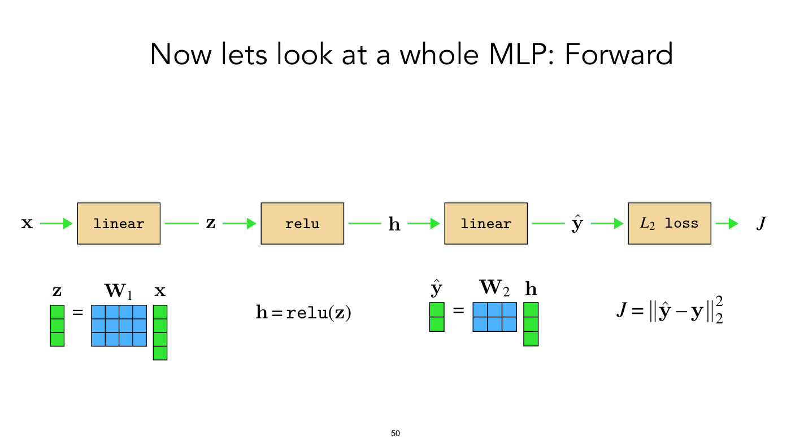

(Title printed as "Now lets look at a whole MLP: Forward".)

A forward computation graph with green arrows, left to right: $\mathbf{x}$ → beige box "linear" — $\mathbf{z}$ → beige box "relu" — $\mathbf{h}$ → beige box "linear" — $\hat{\mathbf{y}}$ → beige box "L2 loss" (L with subscript 2) → $J$.

Below each box, its operation as equations and block pictures:

- Under the first "linear": $\mathbf{z} = \mathbf{W}_ 1 \mathbf{x}$, drawn as $\mathbf{z}$ = a green column of 3 cells, $\mathbf{W}_ 1$ = a blue grid of 3 rows × 4 columns, $\mathbf{x}$ = a green column of 4 cells.
- Under "relu": $\mathbf{h} = \texttt{relu}(\mathbf{z})$.
- Under the second "linear": $\hat{\mathbf{y}} = \mathbf{W}_ 2 \mathbf{h}$, drawn as $\hat{\mathbf{y}}$ = a green column of 2 cells, $\mathbf{W}_ 2$ = a blue grid of 2 rows × 3 columns, $\mathbf{h}$ = a green column of 3 cells.
- Under "L2 loss" (L with subscript 2): 

$$J = \lVert \hat{\mathbf{y}} - \mathbf{y} \rVert_2^2$$

## Slide 51 — Now lets look at a whole MLP: Backward

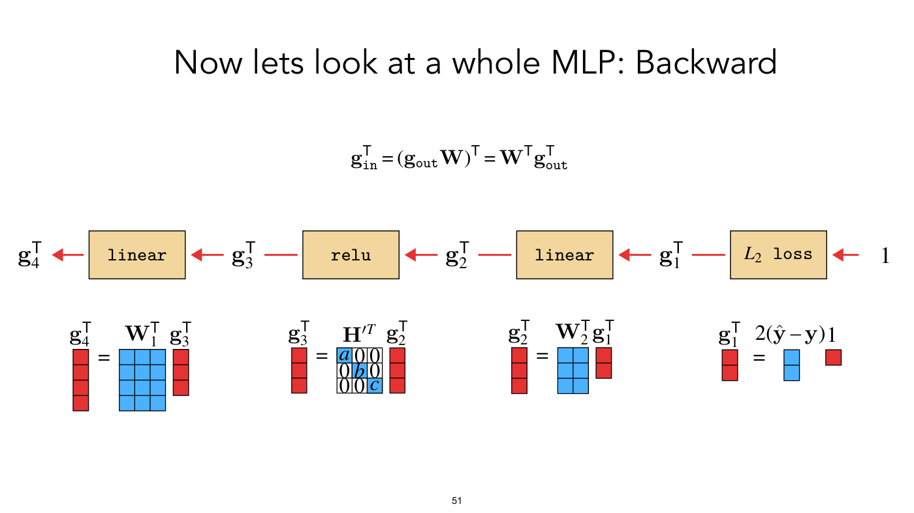

(Title printed as "Now lets look at a whole MLP: Backward".)

Top equation:

$$\mathbf{g}_ {\texttt{in}}^\mathsf{T} = (\mathbf{g}_ {\texttt{out}} \mathbf{W})^\mathsf{T} = \mathbf{W}^\mathsf{T} \mathbf{g}_ {\texttt{out}}^\mathsf{T}$$

A backward computation graph with red arrows pointing right to left: a "1" enters the beige box "L2 loss" (L with subscript 2); its output $\mathbf{g}_ 1^\mathsf{T}$ goes into the second "linear" box; its output $\mathbf{g}_ 2^\mathsf{T}$ goes into the "relu" box; its output $\mathbf{g}_ 3^\mathsf{T}$ goes into the first "linear" box; its output is $\mathbf{g}_ 4^\mathsf{T}$ at the far left.

Below each box, its operation as equations and block pictures:

- Under the (left) first "linear": $\mathbf{g}_ 4^\mathsf{T} = \mathbf{W}_ 1^\mathsf{T} \mathbf{g}_ 3^\mathsf{T}$, drawn as $\mathbf{g}_ 4^\mathsf{T}$ = a red column of 4 cells, $\mathbf{W}_ 1^\mathsf{T}$ = a blue grid of 4 rows × 3 columns, $\mathbf{g}_ 3^\mathsf{T}$ = a red column of 3 cells.
- Under "relu": $\mathbf{g}_ 3^\mathsf{T} = \mathbf{H}'^T \mathbf{g}_ 2^\mathsf{T}$, drawn as $\mathbf{g}_ 3^\mathsf{T}$ = a red column of 3 cells, $\mathbf{H}'^T$ = a $3 \times 3$ grid that is diagonal: the blue diagonal cells hold the letters $a$, $b$, $c$ and the off-diagonal cells hold 0, and $\mathbf{g}_ 2^\mathsf{T}$ = a red column of 3 cells.
- Under the second "linear": $\mathbf{g}_ 2^\mathsf{T} = \mathbf{W}_ 2^\mathsf{T} \mathbf{g}_ 1^\mathsf{T}$, drawn as $\mathbf{g}_ 2^\mathsf{T}$ = a red column of 3 cells, $\mathbf{W}_ 2^\mathsf{T}$ = a blue grid of 3 rows × 2 columns, $\mathbf{g}_ 1^\mathsf{T}$ = a red column of 2 cells.
- Under "L2 loss" (L with subscript 2): $\mathbf{g}_ 1^\mathsf{T} = 2(\hat{\mathbf{y}} - \mathbf{y}) 1$, drawn as $\mathbf{g}_ 1^\mathsf{T}$ = a red column of 2 cells, "=", a blue column of 2 cells (the term ${2(\hat{\mathbf{y}} - \mathbf{y})}$), and a single red cell (the "1").

## Slide 52 — Backpropagation (1 iteration)

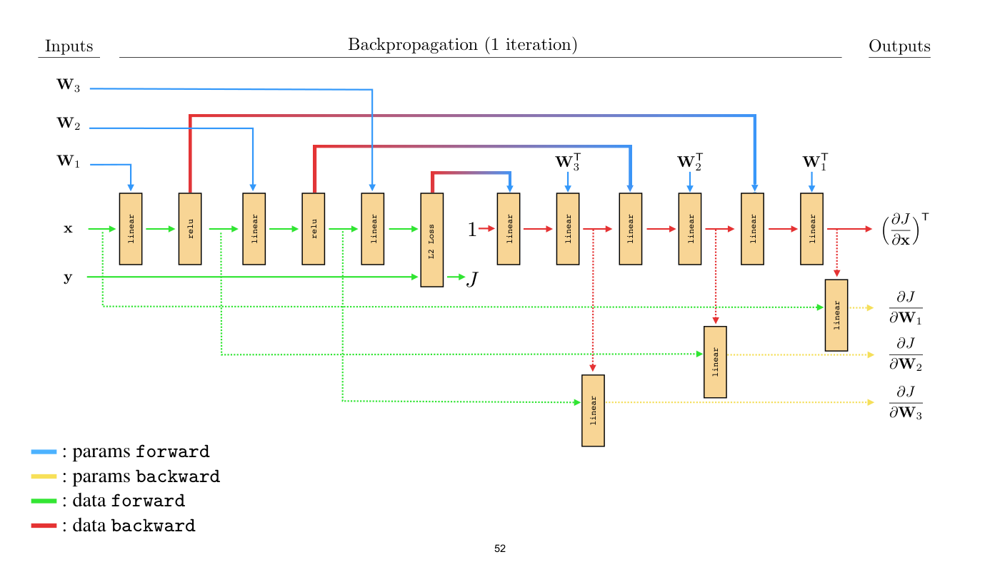

A large diagram with three column headings (underlined): "Inputs" (left), "Backpropagation (1 iteration)" (centre, over most of the width) and "Outputs" (right). A legend at the bottom left: blue line "params forward", yellow line "params backward", green line "data forward", red line "data backward".

Inputs (left column, top to bottom): $\mathbf{W}_ 3$, $\mathbf{W}_ 2$, $\mathbf{W}_ 1$ (each with a blue line to the right), then $\mathbf{x}$ and $\mathbf{y}$ (each with a green line to the right).

Forward chain (left half, a row of tall narrow beige boxes joined by green arrows, in order): linear, relu, linear, relu, linear, then a taller box "L2 Loss" (which also extends lower). $\mathbf{x}$ enters the first linear box. $\mathbf{W}_ 1$'s blue line turns down into the first linear box; $\mathbf{W}_ 2$'s into the second linear box (third box overall); $\mathbf{W}_ 3$'s into the third linear box (fifth box overall). The line from $\mathbf{y}$ runs right on a lower level into the L2 Loss box. An arrow from the L2 Loss box leads to the label $J$.

Backward chain (right half, a row of six tall narrow beige boxes all labelled "linear", joined by red arrows pointing right): it starts from a "1" on the left that feeds the first backward box and ends in an arrow to the right to $\left(\dfrac{\partial J}{\partial \mathbf{x}}\right)^\mathsf{T}$. Blue parameter arrows come down into the 2nd, 4th and 6th backward boxes from the labels $\mathbf{W}_ 3^\mathsf{T}$, $\mathbf{W}_ 2^\mathsf{T}$, $\mathbf{W}_ 1^\mathsf{T}$ respectively (above the boxes).

Thick lines from forward boxes to backward boxes (drawn red at the forward end and fading to blue at the backward end, i.e. forward values reused in the backward pass): from the top of the L2 Loss box up and across to the first backward box; from the top of the second relu box up and across to the third backward box; from the top of the first relu box up (highest line) and across to the fifth backward box. 

Weight-gradient computation (below the main row): three further beige "linear" boxes at staggered heights, each fed by a dotted red arrow dropping from the backward chain (after the 2nd backward box → lowest box; after the 4th → middle box; after the 6th, from the output line → highest of the three) and by a dotted green arrow coming from the forward chain (from the data line after the input $\mathbf{x}$ → highest box; from the data between the first relu and the second linear → middle box; from the data between the second relu and the third linear → lowest box). Each of these three boxes outputs a dotted yellow arrow to the right, to $\dfrac{\partial J}{\partial \mathbf{W}_ 1}$ (highest), $\dfrac{\partial J}{\partial \mathbf{W}_ 2}$ (middle) and $\dfrac{\partial J}{\partial \mathbf{W}_ 3}$ (lowest) in the "Outputs" column.

## Slide 53 — DAGs

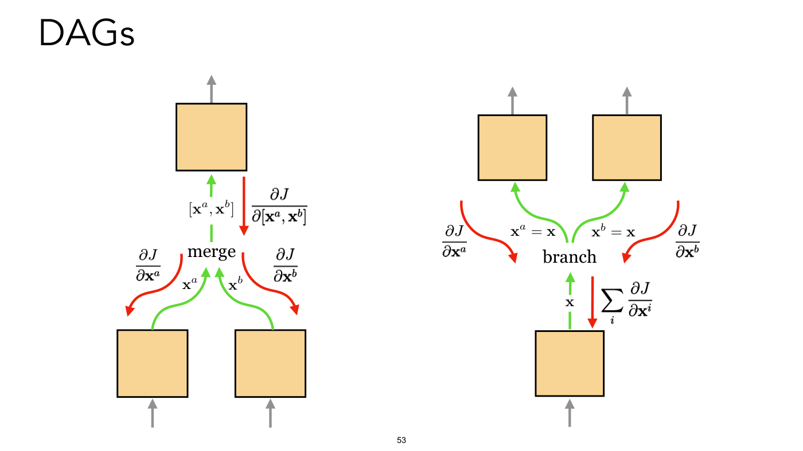

Two diagrams, "merge" (left) and "branch" (right). Beige square boxes; grey arrows are generic input and output edges; green arrows are forward values; red arrows are gradients.

Left, merge: two beige boxes at the bottom, each with a grey arrow entering from below. A green curved arrow from the left box labelled $\mathbf{x}^a$ and one from the right box labelled $\mathbf{x}^b$ come together at the word "merge". From "merge" a dashed green arrow labelled $[\mathbf{x}^a, \mathbf{x}^b]$ goes up into a beige box at the top, which has a grey arrow leaving upward. Red arrows: from the top box a red arrow labelled $\dfrac{\partial J}{\partial [\mathbf{x}^a, \mathbf{x}^b]}$ goes down to "merge"; from "merge" it splits into a red curved arrow labelled $\dfrac{\partial J}{\partial \mathbf{x}^a}$ going down-left to the left bottom box and one labelled $\dfrac{\partial J}{\partial \mathbf{x}^b}$ going down-right to the right bottom box.

Right, branch: one beige box at the bottom with a grey arrow entering from below. A green dashed arrow labelled $\mathbf{x}$ goes up to the word "branch". From "branch", two green curved arrows go up to two beige boxes at the top (each with a grey arrow leaving upward), labelled $\mathbf{x}^a = \mathbf{x}$ (to the left box) and $\mathbf{x}^b = \mathbf{x}$ (to the right box). Red curved arrows come down from the two top boxes into "branch": $\dfrac{\partial J}{\partial \mathbf{x}^a}$ from the left box and $\dfrac{\partial J}{\partial \mathbf{x}^b}$ from the right box. From "branch" a red arrow goes down to the bottom box, labelled $\displaystyle\sum_i \frac{\partial J}{\partial \mathbf{x}^i}$.

## Slide 54 — Parameter sharing

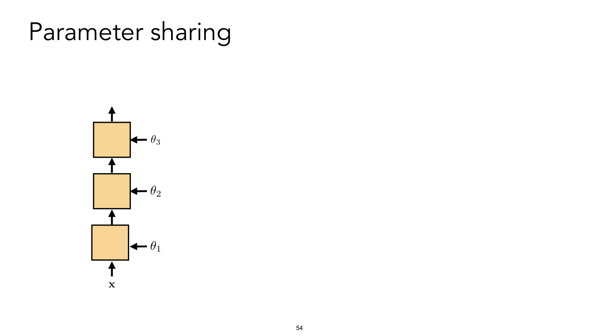

A vertical stack of three beige boxes with arrows pointing up: $\mathbf{x}$ enters the bottom box from below; an arrow goes from the bottom box up to the middle box and from the middle up to the top box; an arrow leaves the top box upward. A separate black arrow pointing left enters each box from the right, labelled $\theta_1$ (bottom box), $\theta_2$ (middle) and $\theta_3$ (top): each layer has its own parameters.

## Slide 55 — Parameter sharing

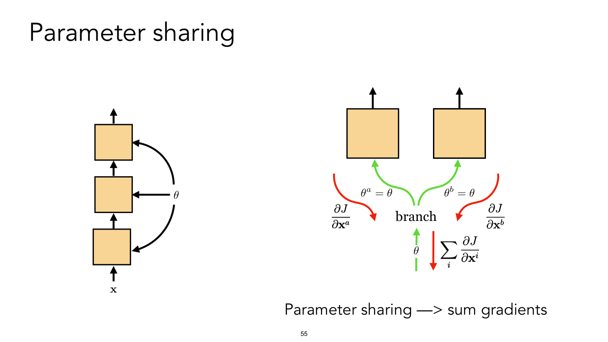

Left: the same three-box stack as slide 54 ($\mathbf{x}$ in at the bottom, arrow out at the top), but now the three boxes share one parameter: a single label $\theta$ at the right, with a straight black arrow to the middle box and curved black arrows (one up, one down) from it to the top and bottom boxes.

Right: a branch diagram. Two beige boxes at the top (each with an arrow leaving upward) and a "branch" node in the middle. A green up arrow labelled $\theta$ enters "branch" from below; from "branch" two green curved arrows go to the two boxes, labelled $\theta^a = \theta$ (left) and $\theta^b = \theta$ (right). Red curved arrows come in from the two top boxes: $\dfrac{\partial J}{\partial \mathbf{x}^a}$ (left) and $\dfrac{\partial J}{\partial \mathbf{x}^b}$ (right). A red down arrow leaves "branch", labelled $\displaystyle\sum_i \frac{\partial J}{\partial \mathbf{x}^i}$.

Text at the bottom: "Parameter sharing —> sum gradients"

## Slide 56 — Differentiable programming

Two boxes side by side connected by an arrow.

- Left box titled "Deep learning": a beige box $f(\mathbf{x}_ {\texttt{in}}, \mathbf{W})$ with a green up arrow in from $\mathbf{x}_ {\texttt{in}}$, a green up arrow out labelled $\mathbf{x}_ {\texttt{out}}$, a red down arrow in labelled $\mathbf{g}_ {\texttt{out}}$ and a red down arrow out labelled $\mathbf{g}_ {\texttt{in}}$.
- A black arrow to the right (to the next box).
- Right box titled "Differentiable programming": the same layout, but the beige box reads $f(\mathbf{x}_ {\texttt{in}}, \theta)$.

Right of that: two logos stacked: a purple "PyTorch" logo (with a red flame mark) and an orange "TensorFlow" logo (with "TM").

Below the left box: a small graph drawing: a grey filled node labelled $x$ on the left with arrows to two white nodes (one above, one below), and arrows from both to a grey filled node labelled $y$ on the right (a diamond-shaped DAG).

Below the right box: a screenshot of dark-background code with line numbers 1 to 9, which reads (as legible): "for i, data in enumerate(dataset):", "iter_start_time = time.time()", "if total_steps % opt.print_freq == 0:", "t_data = iter_start_time - iter_data_time", "visualizer.reset()", "total_steps += opt.batch_size", "epoch_iter += opt.batch_size", "model.set_input(data)", "model.optimize_parameters()".

## Slide 57 — Differentiable programming

Left text:

Deep nets are popular for a few reasons:
1. Easy to optimize (differentiable)
2. Compositional "block based programming"

An emerging term for general models with these properties is **differentiable programming**.

Right: two screenshots of social-media posts.

- A post by "Yann LeCun", dated "January 5": "OK, Deep Learning has outlived its usefulness as a buzz-phrase. Deep Learning est mort. Vive Differentiable Programming!"
- A tweet by "Thomas G. Dietterich" (@tdietterich), timestamp "8:02 AM - 4 Jan 2018", with "65 Retweets" and "194 Likes": "DL is essentially a new style of programming--"differentiable programming"--and the field is trying to work out the reusable constructs in this style. We have some: convolution, pooling, LSTM, GAN, VAE, memory units, routing units, etc. 8/"

*OCW notice: © Yann LeCun and Thomas Dietterich. All rights reserved — excluded from the CC license.*

## Slide 58 — Differentiable programming

A figure from "Neural Module Networks" (Andreas et al. 2017), a visual question answering pipeline.

- Input question box (white, italic text): "Where is the dog?". An arrow goes right to a grey box "LSTM", then along a long arrow to a circled plus symbol ($\oplus$), whose output goes to a rounded box "couch" (the answer).
- From the question box, an arrow goes down and right to a grey box "Parser", followed by a grey box "Layout", from which dashed lines (one blue dashed, one green dashed) lead into a pale grey panel of module boxes.
- The grey panel contains two rows of modules: top row "count" (pink, faded), "where" (blue, highlighted, with bold outline), "color" (light blue, faded), "..." (orange, faded); bottom row "dog" (green, highlighted), "cat" (faded green), "standing" (faded green), "..." (faded green). The blue dashed line from Layout selects "where"; the green dashed line selects "dog".
- At bottom left, a photograph of a living room (yellow walls, a person on a ladder, a plaid couch). An arrow goes from the photo to a grey trapezoid "CNN". From CNN, a line goes right with two branches: one up into "dog" and one up into "where". An arrow from "dog" goes up/right into "where", and an arrow from "where" goes up to the $\oplus$.

Caption: "[Figure from "Neural Module Networks", Andreas et al. 2017]"

*OCW notice: © Andreas, et al. All rights reserved — excluded from the CC license.*

## Slide 59 — Software 2.0

Subtitle: "[Andrej Karpathy: https://karpathy.medium.com/software-2-0-a64152b37c35]"

A large light-grey circle labelled "Program space" (top left, outside the circle edge). Inside the circle: a tiny red dot, with a red arrow from the red label "Software 1.0" pointing to it (a single point or tiny region of the space). A light-blue polygon blob in the lower half of the circle, with a blue arrow from the blue label "Software 2.0" pointing to it; inside the blob a small blue dot, and a blue zig-zag arrow path starting at the dot and zig-zagging down and to the right, labelled in blue "(optimization)" (a search path within the blob). A black dot near the blob's top and a long black arrow from it up and to the right toward the circle's edge, labelled "Program complexity".

*OCW notice: © Andrej Karpathy. All rights reserved — excluded from the CC license.*

## Slide 60 — Programmed by a human / programmed by backprop (no slide title)

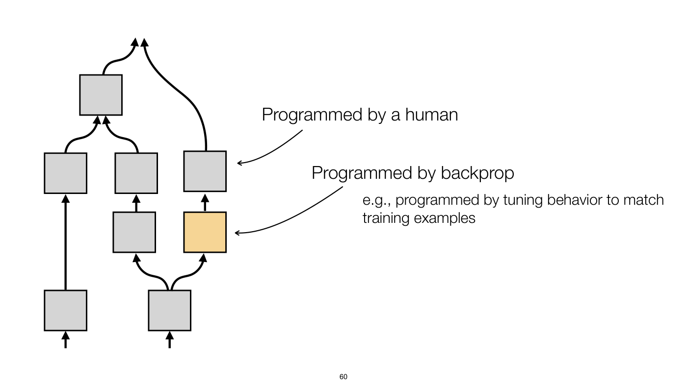

No slide title. The DAG of slide 26, now drawn with grey boxes: the same eight-node graph (two bottom nodes, middle nodes and top node, with two outputs at the top). Seven of the boxes are grey and one is beige: the beige box is the right-hand lower-middle node (the one in the right column, directly above the right bottom-branch node). 

Annotations on the right, each with a curved arrow: "Programmed by a human" points to the right-hand upper node (a grey box); "Programmed by backprop" points to the beige box, with the smaller text below: "e.g., programmed by tuning behavior to match training examples".

## Slide 61 — Backprop lets you optimize any node (function) or edge (variable) in your computation graph w.r.t. to any scalar cost

Title (two lines): "Backprop lets you optimize any node (function) or edge (variable) in your computation graph w.r.t. to any scalar cost".

A DAG drawn with grey square nodes and arrows pointing upward, with a red (salmon) node at the very top as the scalar cost. Layout, bottom to top: two grey nodes in the bottom row, each with an input arrow from below. The left bottom node has an arrow straight up to a grey node in the third row (left). The bottom-centre node splits into two arrows going up-left and up-right to two grey nodes in the second row (middle and right). Each of these has an arrow up to a node in the third row (middle and right). The third-row left and middle nodes both send arrows up into a single grey node in the fourth row (left, upper). That fourth-row node and the third-row right node (via a long curved arrow) both send arrows into the red node at the top.

## Slide 62 — Backprop lets you optimize any node (function) or edge (variable) in your computation graph w.r.t. to any scalar cost

Same title and graph as slide 61, except that the upper-left grey node (the fourth-row node) is now drawn beige with a yellow outline. On the right is the expression $\partial$ (red square) over $\partial$ (beige square with a yellow outline), a fraction whose numerator is the red cost node and denominator is the yellow-highlighted node, followed by the text: "How the cost changes when the weights of that function (yellow) change".

Added relative to slide 61: the highlighted yellow node and the derivative expression with its caption.

## Slide 63 — Backprop lets you optimize any node (function) or edge (variable) in your computation graph w.r.t. to any scalar cost

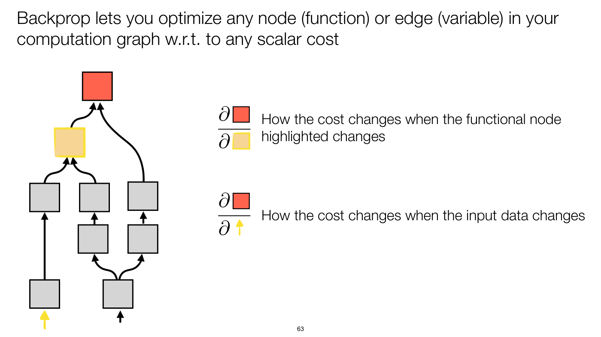

Same title and graph as slide 62, with the beige/yellow upper-left node, plus a yellow input arrow: the input arrow into the bottom-left node is coloured yellow. On the right are two derivative expressions with captions:

- $\partial$ (red square) over $\partial$ (beige square with yellow outline): "How the cost changes when the functional node highlighted changes" (the caption's wording differs from slide 62, which said "when the weights of that function (yellow) change").
- $\partial$ (red square) over $\partial$ (yellow up-arrow): "How the cost changes when the input data changes"

Added relative to slide 62: the yellow input edge and its derivative expression; the first caption is reworded as above.

## Slide 64 — Optimizing parameters versus optimizing inputs

A classifier diagram, left to right:

- Above the input image, the label $\mathbf{x}$. The image is a photograph of a green-blue-orange chameleon on a plant stem against a green background. Caption below it: "© source unknown. All rights reserved. This content is excluded from our Creative Commons license. For more information, see https://ocw.mit.edu/help/faq-fair-use/".
- Five tall, narrow, empty white rectangles in a row (layers). Yellow arrows connect the image to the first rectangle and each rectangle to the next, and the fifth rectangle to the output column.
- The output column, labelled $\mathbf{y}$ above, is a tall box of circles with class names to the right of each: dolphin (light grey), cat (white), grizzly bear (white), angel fish (light grey), chameleon (black, the highest score), clown fish (light grey), iguana (darker grey), elephant (white), then vertical dots for more classes. The grey levels indicate the output scores.
- A black arrow from the output column to $J$.

Below: $\dfrac{\partial J}{\partial \theta}$ with a left-pointing arrow, followed by the text "How much the total cost is increased or decreased by changing the parameters."

*OCW notice: © source unknown (chameleon photograph). All rights reserved — excluded from the CC license.*

## Slide 65 — Optimizing parameters versus optimizing inputs

Same diagram as slide 64 (same chameleon photo with the same copyright caption, same five rectangles and the same $\mathbf{y}$ output column), with these differences: the arrows are black instead of yellow, there is no arrow to $J$, and the input image is outlined with a yellow border. Below: $\dfrac{\partial y_j}{\partial \mathbf{x}}$ with a left-pointing arrow, followed by the text "How much the "chameleon" score is increased or decreased by changing the image pixels."

Added relative to slide 64: the focus changes from the gradient with respect to the parameters to the gradient of one output score with respect to the input pixels.

*OCW notice: © source unknown (chameleon photograph). All rights reserved — excluded from the CC license.*

## Slide 66 — Unit visualization

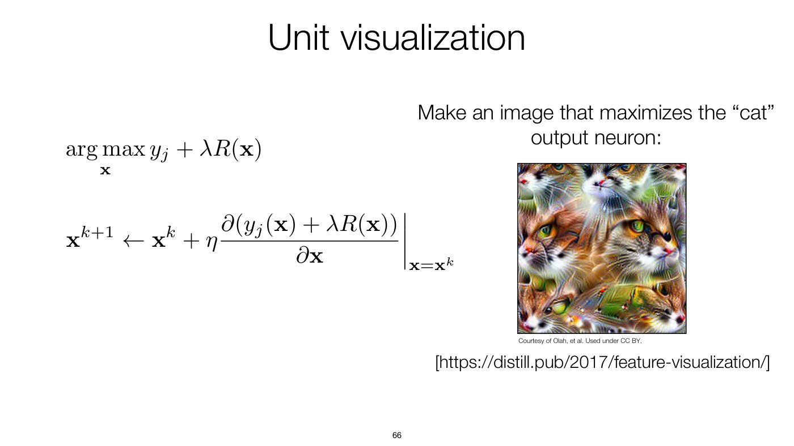

Left equations:

$$\arg\max_{\mathbf{x}} y_j + \lambda R(\mathbf{x})$$

$$\mathbf{x}^{k+1} \leftarrow \mathbf{x}^k + \eta \left.\frac{\partial (y_j(\mathbf{x}) + \lambda R(\mathbf{x}))}{\partial \mathbf{x}}\right|_ {\mathbf{x}=\mathbf{x}^k}$$

Right: the text "Make an image that maximizes the "cat" output neuron:" above a square synthetic image: a dense collage of cat faces and fur textures (orange-brown, white and green, with green eyes and whiskers) tiled at several scales. Credit: "Courtesy of Olah, et al. Used under CC BY." Below: "[https://distill.pub/2017/feature-visualization/]". ($R$ and $\lambda$ are not defined on the slide.)

## Slide 67 — Unit visualization

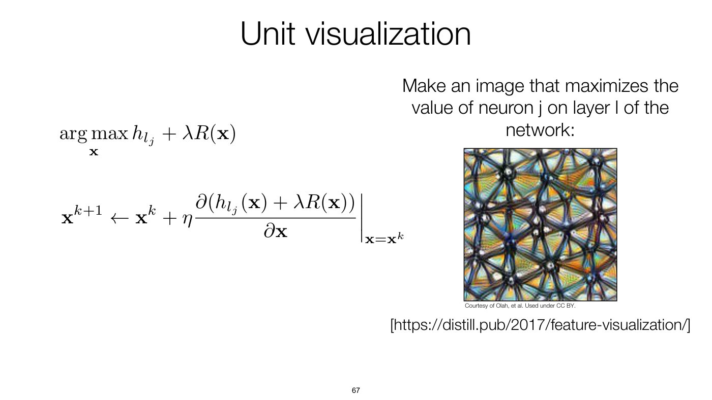

Left equations:

$$\arg\max_{\mathbf{x}} h_{l_ j} + \lambda R(\mathbf{x})$$

$$\mathbf{x}^{k+1} \leftarrow \mathbf{x}^k + \eta \left.\frac{\partial (h_{l_ j}(\mathbf{x}) + \lambda R(\mathbf{x}))}{\partial \mathbf{x}}\right|_ {\mathbf{x}=\mathbf{x}^k}$$

Right: the text "Make an image that maximizes the value of neuron j on layer l of the network:" above a square synthetic image: a repeating network-like texture of dark blue-black lines radiating from small white-grey nodes against orange, yellow, light blue and green triangular patches. Credit: "Courtesy of Olah, et al. Used under CC BY." Below: "[https://distill.pub/2017/feature-visualization/]".

Added relative to slide 66: the unit is a hidden neuron $h_{l_ j}$ rather than the "cat" output $y_j$, and the example image is of a hidden-layer unit.

## Slide 68 — "Deep dream"

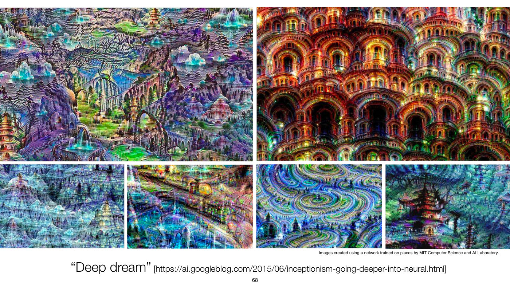

No slide title. Caption at the bottom: "Deep dream" followed by "[https://ai.googleblog.com/2015/06/inceptionism-going-deeper-into-neural.html]".

A collage of six psychedelic images with no frames, arranged as two large images on top and four smaller ones on the bottom. Top left: a fantastical landscape of purple-blue cliffs, green meadows, aqueducts, pagoda-like towers and turquoise fountains. Top right: tiers of ornate red-orange arches and windows, like a huge building made of repeating archways, with green and yellow light points. Bottom, left to right: (1) blue-teal mountains covered with pagoda-like and temple-like textures; (2) a train-like object and railway amid colourful, noisy, tiled textures and turquoise water; (3) concentric swirls of blue, green and yellow rings with small temple shapes; (4) a dark green-teal pagoda among trees and smaller pagodas.

Credit line (small): "Images created using a network trained on places by MIT Computer Science and AI Laboratory."

## Slide 69 — CLIP

Title "CLIP" (top left), with the heading "1. Contrastive pre-training" and a figure redrawn from the OpenAI CLIP blog.

- Top: a stack of blue cards with the text "pepper the aussie pup" → an arrow → a lavender trapezoid "Text Encoder". From the Text Encoder, a line runs right and branches with downward arrows to a row of lavender cells labelled $T_1$, $T_2$, $T_3$, "...", $T_N$.
- Bottom: a stack of photos with a puppy (a black, white and tan dog on green grass) → an arrow → a light-green trapezoid "Image Encoder". From it, a line runs right and branches with arrows to a column of light-green cells labelled $I_1$, $I_2$, $I_3$, vertical dots, $I_N$.
- To the right, an $N \times N$ grid of cells with the dot products: row $I_1$: $I_1 \cdot T_1$, $I_1 \cdot T_2$, $I_1 \cdot T_3$, ..., $I_1 \cdot T_N$; row $I_2$: $I_2 \cdot T_1$, $I_2 \cdot T_2$, $I_2 \cdot T_3$, ..., $I_2 \cdot T_N$; row $I_3$: $I_3 \cdot T_1$, $I_3 \cdot T_2$, $I_3 \cdot T_3$, ..., $I_3 \cdot T_N$; a row of vertical dots; row $I_N$: $I_N \cdot T_1$, $I_N \cdot T_2$, $I_N \cdot T_3$, ..., $I_N \cdot T_N$. The diagonal cells ($I_1 \cdot T_1$, $I_2 \cdot T_2$, $I_3 \cdot T_3$, the diagonal dots, $I_N \cdot T_N$) are highlighted in light blue; all other cells are light grey.

Bottom-left credit: "© Radford, et al. All rights reserved. This content is excluded from our Creative Commons license. For more information, see https://ocw.mit.edu/help/faq-fair-use/". Below it, "[https://openai.com/blog/clip/]".

*OCW notice: © Radford, et al. All rights reserved — excluded from the CC license.*

## Slide 70 — CLIP+GAN

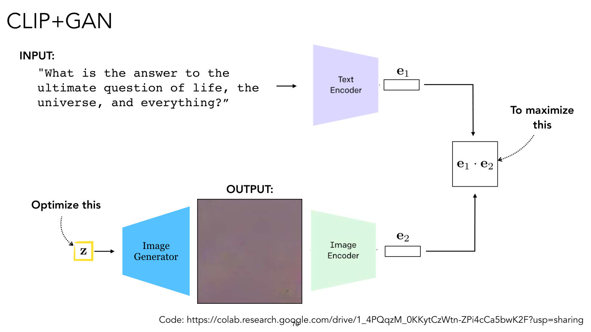

Title: "CLIP+GAN". Diagram:

- "INPUT:" with the monospace text ""What is the answer to the ultimate question of life, the universe, and everything?"". An arrow → a lavender trapezoid "Text Encoder" → a small empty rectangle labelled $\mathbf{e}_ 1$ (above it).
- At the bottom left, "Optimize this" with a dotted curved arrow pointing to a yellow-outlined square containing $\mathbf{z}$. An arrow from $\mathbf{z}$ → a blue trapezoid "Image Generator" → a square image labelled above "OUTPUT:" (a muted purple-grey-brown, nearly uniform texture, i.e. an early or noisy image with no recognizable content) → a light-green trapezoid "Image Encoder" → a small empty rectangle labelled $\mathbf{e}_ 2$ (above it).
- Lines from the $\mathbf{e}_ 1$ rectangle (right then down) and from the $\mathbf{e}_ 2$ rectangle (right then up) both lead to a square box containing $\mathbf{e}_ 1 \cdot \mathbf{e}_ 2$. A text "To maximize this" with a dotted curved arrow points at the box.

Bottom: "Code: https://colab.research.google.com/drive/1_4PQqzM_0KKytCzWtn-ZPi4cCa5bwK2F?usp=sharing"

## Slide 71 — 2. How to train a neural net

(Agenda / signpost slide; identical to slide 3.)

- Review of gradient descent, SGD
- Computation graphs
- Backprop through chains
- Backprop through MLPs
- Backprop through DAGs
- Differentiable programming

## Slide 72 — Backpropagation example

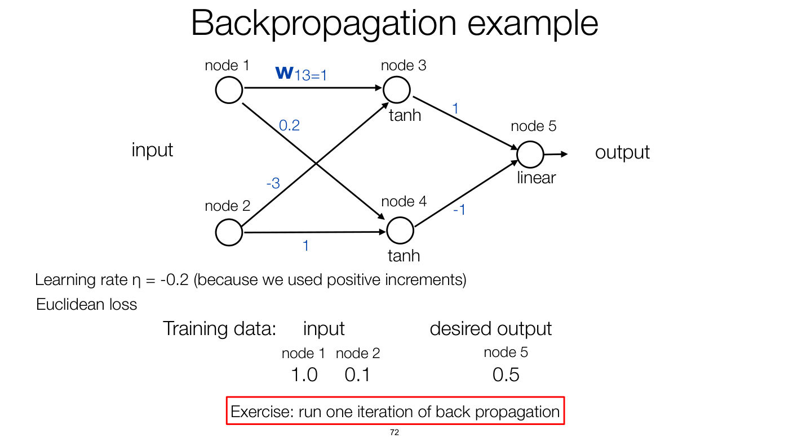

A small network diagram, with the labels "input" at left and "output" at right.

- Nodes (circles): node 1 (top left) and node 2 (bottom left), the inputs; node 3 (top right of centre, labelled "tanh" below it); node 4 (bottom right of centre, labelled "tanh" below it); node 5 (right, labelled "linear" below it) with an arrow to "output".
- Edges (arrows left to right) with weights in blue: node 1 → node 3 labelled $\mathbf{w}_ {13=1}$ (bold blue "w" with subscript "13=1"); node 1 → node 4 labelled 0.2; node 2 → node 3 labelled −3; node 2 → node 4 labelled 1; node 3 → node 5 labelled 1; node 4 → node 5 labelled −1.

Text below:
- "Learning rate η = -0.2 (because we used positive increments)"
- "Euclidean loss"
- "Training data:" with columns "input" (node 1: 1.0, node 2: 0.1) and "desired output" (node 5: 0.5).
- In a red-outlined box: "Exercise: run one iteration of back propagation"

## Slide 73 — Backpropagation example

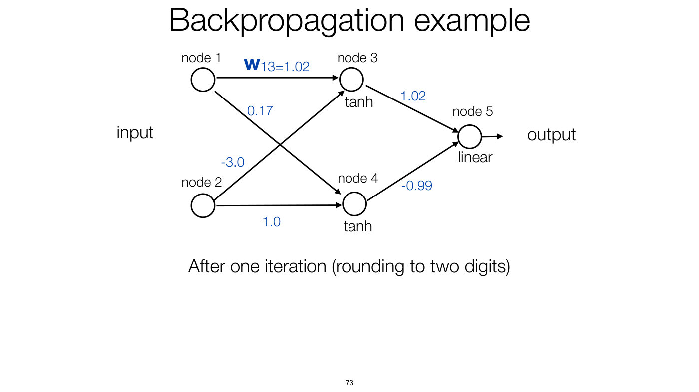

The same network as slide 72, with the weights after one iteration: node 1 → node 3 labelled $\mathbf{w}_ {13=1.02}$; node 1 → node 4: 0.17; node 2 → node 3: -3.0; node 2 → node 4: 1.0; node 3 → node 5: 1.02; node 4 → node 5: -0.99. Labels "input", "output", node names and "tanh", "tanh", "linear" as on slide 72. Text: "After one iteration (rounding to two digits)"

Added relative to slide 72: the updated weights replace the original ones; the learning rate, loss, training data and exercise text are removed.

## Slide 74 — Step by step solution

Centred text only: "Step by step solution" (a divider slide).

## Slide 75 — First, let's rewrite the network using the modular block notation

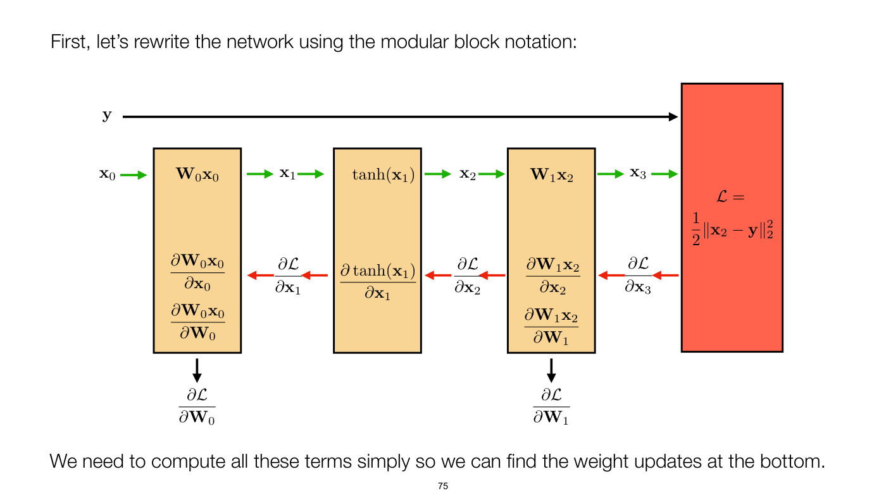

No slide title. Slide text (top): "First, let's rewrite the network using the modular block notation:". 

Diagram: a left-to-right chain of tall beige blocks with a tall red block at the right. Green arrows (forward) along the top and red arrows (backward) beneath.

- A long black arrow from the label $\mathbf{y}$ (top left) runs right into the red block.
- $\mathbf{x}_ 0$ → beige block 1 containing $\mathbf{W}_ 0\mathbf{x}_ 0$ (at the top) and, below it, $\dfrac{\partial \mathbf{W}_ 0\mathbf{x}_ 0}{\partial \mathbf{x}_ 0}$ and $\dfrac{\partial \mathbf{W}_ 0\mathbf{x}_ 0}{\partial \mathbf{W}_ 0}$. Output $\mathbf{x}_ 1$.
- $\mathbf{x}_ 1$ → beige block 2 containing $\tanh(\mathbf{x}_ 1)$ and $\dfrac{\partial \tanh(\mathbf{x}_ 1)}{\partial \mathbf{x}_ 1}$. Output $\mathbf{x}_ 2$.
- $\mathbf{x}_ 2$ → beige block 3 containing $\mathbf{W}_ 1\mathbf{x}_ 2$ and $\dfrac{\partial \mathbf{W}_ 1\mathbf{x}_ 2}{\partial \mathbf{x}_ 2}$ and $\dfrac{\partial \mathbf{W}_ 1\mathbf{x}_ 2}{\partial \mathbf{W}_ 1}$. Output $\mathbf{x}_ 3$.
- $\mathbf{x}_ 3$ → red block containing $\mathcal{L} = \dfrac{1}{2}\lVert \mathbf{x}_ 2 - \mathbf{y} \rVert_2^2$ (as printed, with $\mathbf{x}_ 2$ rather than $\mathbf{x}_ 3$ inside the norm).
- Red arrows pointing left carry $\dfrac{\partial \mathcal{L}}{\partial \mathbf{x}_ 3}$ (from the red block into block 3), $\dfrac{\partial \mathcal{L}}{\partial \mathbf{x}_ 2}$ (from block 3 into block 2) and $\dfrac{\partial \mathcal{L}}{\partial \mathbf{x}_ 1}$ (from block 2 into block 1).
- Black down arrows from block 1 and block 3 lead to $\dfrac{\partial \mathcal{L}}{\partial \mathbf{W}_ 0}$ and $\dfrac{\partial \mathcal{L}}{\partial \mathbf{W}_ 1}$ respectively.

Text at the bottom: "We need to compute all these terms simply so we can find the weight updates at the bottom."

## Slide 76 — Our goal is to perform the following two updates

No slide title. Slide text: "Our goal is to perform the following two updates:"

$$\mathbf{W}_ 0^{k+1} = \mathbf{W}_ 0^k + \eta \left(\frac{\partial \mathcal{L}}{\partial \mathbf{W}_ 0}\right)^T$$

$$\mathbf{W}_ 1^{k+1} = \mathbf{W}_ 1^k + \eta \left(\frac{\partial \mathcal{L}}{\partial \mathbf{W}_ 1}\right)^T$$

"where $W^k$ are the weights at some iteration k of gradient descent given by the first slide:"

$$\mathbf{W}_ 0^k = \begin{pmatrix} 1 & -3 \cr 0.2 & 1 \end{pmatrix} \qquad \mathbf{W}_ 1^k = \begin{pmatrix} 1 & -1 \end{pmatrix}$$

## Slide 77 — First we compute the derivative of the loss with respect to the output

No slide title. Slide text: "First we compute the derivative of the loss with respect to the output:"

$$\frac{\partial \mathcal{L}}{\partial \mathbf{x}_ 3} = \mathbf{x}_ 3 - \mathbf{y}$$

(the left side is boxed in blue.) "Now, by the chain rule, we can derive equations, working *backwards*, for each remaining term we need:"

$$\frac{\partial \mathcal{L}}{\partial \mathbf{x}_ 2} = \frac{\partial \mathcal{L}}{\partial \mathbf{x}_ 3} \frac{\partial \mathbf{x}_ 3}{\partial \mathbf{x}_ 2} = \frac{\partial \mathcal{L}}{\partial \mathbf{x}_ 3} \mathbf{W}_ 1$$

(the left side is boxed in green; the $\partial \mathcal{L} / \partial \mathbf{x}_ 3$ after the second equals sign is boxed in blue.)

$$\frac{\partial \mathcal{L}}{\partial \mathbf{x}_ 1} = \frac{\partial \mathcal{L}}{\partial \mathbf{x}_ 2} \frac{\partial \mathbf{x}_ 2}{\partial \mathbf{x}_ 1} = \frac{\partial \mathcal{L}}{\partial \mathbf{x}_ 2} \frac{\partial \tanh(\mathbf{x}_ 1)}{\partial \mathbf{x}_ 1} = \frac{\partial \mathcal{L}}{\partial \mathbf{x}_ 2} (1 - \tanh^2(\mathbf{x}_ 1))$$

(the left side is boxed in red; the last $\partial \mathcal{L} / \partial \mathbf{x}_ 2$ is boxed in green.)

"ending up with our two gradients needed for the weight update:"

$$\frac{\partial \mathcal{L}}{\partial \mathbf{W}_ 0} = \frac{\partial \mathcal{L}}{\partial \mathbf{x}_ 1} \frac{\partial \mathbf{x}_ 1}{\partial \mathbf{W}_ 0} = \mathbf{x}_ 0 \frac{\partial \mathcal{L}}{\partial \mathbf{x}_ 1}$$

(the last $\partial \mathcal{L} / \partial \mathbf{x}_ 1$ is boxed in red, and a black arrow points from the note on the right to it.)

$$\frac{\partial \mathcal{L}}{\partial \mathbf{W}_ 1} = \frac{\partial \mathcal{L}}{\partial \mathbf{x}_ 3} \frac{\partial \mathbf{x}_ 3}{\partial \mathbf{W}_ 1} = \mathbf{x}_ 2 \frac{\partial \mathcal{L}}{\partial \mathbf{x}_ 3}$$

(the last $\partial \mathcal{L} / \partial \mathbf{x}_ 3$ is boxed in blue.) Note on the right: "Notice the ordering of the two terms being multiplied here. The notation hides the details but you can write out all the indices to see that this is the correct ordering — or just check that the dimensions work out."

## Slide 78 — The values for input vector x₀ and target y are also given by the first slide

No slide title. Slide text: "The values for input vector $x_0$ and target y are also given by the first slide:"

$$\mathbf{x}_ 0 = \begin{pmatrix} 1.0 \cr 0.1 \end{pmatrix} \qquad \mathbf{y} = 0.5$$

"Finally, we simply plug these values into our equations and compute the numerical updates:"

Green heading "Forward pass:"

$$\mathbf{x}_ 1 = \mathbf{W}_ 0 \mathbf{x}_ 0 = \begin{pmatrix} 1 & -3 \cr 0.2 & 1 \end{pmatrix} \begin{pmatrix} 1 \cr 0.1 \end{pmatrix} = \begin{pmatrix} 0.7 \cr 0.3 \end{pmatrix}$$

$$\mathbf{x}_ 2 = \tanh(\mathbf{x}_ 1) = \begin{pmatrix} 0.604 \cr 0.291 \end{pmatrix}$$

$$\mathbf{x}_ 3 = \mathbf{W}_ 1 \mathbf{x}_ 2 = \begin{pmatrix} 1 & -1 \end{pmatrix} \begin{pmatrix} 0.604 \cr 0.291 \end{pmatrix} = 0.313$$

$$\mathcal{L} = \frac{1}{2} (\mathbf{x}_ 3 - \mathbf{y})^2 = 0.017$$

## Slide 79 — Backward pass

No slide title. Red heading "Backward pass:"

$$\frac{\partial \mathcal{L}}{\partial \mathbf{x}_ 3} = \mathbf{x}_ 3 - \mathbf{y} = -0.1869$$

$$\frac{\partial \mathcal{L}}{\partial \mathbf{x}_ 2} = \frac{\partial \mathcal{L}}{\partial \mathbf{x}_ 3} \mathbf{W}_ 1 = -0.1869 \begin{pmatrix} 1 & -1 \end{pmatrix} = \begin{pmatrix} -0.1869 & 0.1869 \end{pmatrix}$$

$$\frac{\partial \mathcal{L}}{\partial \mathbf{x}_ 1} = \frac{\partial \mathcal{L}}{\partial \mathbf{x}_ 2} (1 - \tanh^2(\mathbf{x}_ 1)) = \begin{pmatrix} -0.1869 & 0.1869 \end{pmatrix} \begin{pmatrix} 1 - \tanh^2(0.7) & 0 \cr 0 & 1 - \tanh^2(0.3) \end{pmatrix} = \begin{pmatrix} -0.1186 & 0.171 \end{pmatrix}$$

An annotation "diagonal matrix because tanh is a pointwise operation" with an arrow pointing at the $2 \times 2$ diagonal matrix.

$$\frac{\partial \mathcal{L}}{\partial \mathbf{W}_ 0} = \mathbf{x}_ 0 \frac{\partial \mathcal{L}}{\partial \mathbf{x}_ 1} = \begin{pmatrix} 1.0 \cr 0.1 \end{pmatrix} \begin{pmatrix} -0.1186 & 0.171 \end{pmatrix} = \begin{pmatrix} -0.1186 & 0.171 \cr -0.01186 & 0.0171 \end{pmatrix}$$

$$\frac{\partial \mathcal{L}}{\partial \mathbf{W}_ 1} = \mathbf{x}_ 2 \frac{\partial \mathcal{L}}{\partial \mathbf{x}_ 3} = \begin{pmatrix} 0.604 \cr 0.291 \end{pmatrix} \begin{pmatrix} -0.1186 \end{pmatrix} = \begin{pmatrix} -0.113 \cr -0.054 \end{pmatrix}$$

(As printed, the factor used in the last line is $-0.1186$ although $\partial \mathcal{L} / \partial \mathbf{x}_ 3$ was given as $-0.1869$ on the first line; the printed result $(-0.113, -0.054)$ is consistent with $-0.1869$ rather than $-0.1186$.)

## Slide 80 — Gradient updates

No slide title. Slide text: "Gradient updates:"

$$\mathbf{W}_ 0^{k+1} = \mathbf{W}_ 0^k + \eta \left(\frac{\partial \mathcal{L}}{\partial \mathbf{W}_ 0}\right)^T$$

$$= \begin{pmatrix} 1 & -3 \cr 0.2 & 1 \end{pmatrix} - 0.2 \begin{pmatrix} -0.1186 & 0.171 \cr -0.01186 & 0.0171 \end{pmatrix}$$

$$= \begin{pmatrix} 1.02 & -3.0 \cr 0.17 & 1.0 \end{pmatrix}$$

$$\mathbf{W}_ 1^{k+1} = \mathbf{W}_ 1^k + \eta \left(\frac{\partial \mathcal{L}}{\partial \mathbf{W}_ 1}\right)^T$$

$$= \begin{pmatrix} 1 & -1 \end{pmatrix} - 0.2 \begin{pmatrix} -0.113 & -0.054 \end{pmatrix}$$

$$= \begin{pmatrix} 1.02 & -0.989 \end{pmatrix}$$

(Here $\eta = -0.2$ as stated on slide 72, so the printed plus-eta term appears numerically as minus 0.2. The printed final matrices are consistent with applying the transpose to the gradient, though the middle line shows the gradient untransposed.)

## Slide 81 — MIT OpenCourseWare end page

Not part of the lecture deck. Text: "MIT OpenCourseWare", "https://ocw.mit.edu", "6.7960 Deep Learning", "Fall 2024", "For information about citing these materials or our Terms of Use, visit: https://ocw.mit.edu/terms". The page number 81 is printed at the bottom centre of this appended page.
