# Lecture 3 — Approximation Theory: slide-by-slide

A slide-by-slide transcription of all 43 pages of
[`mit6_7960_f24_lec3.pdf`](https://ocw.mit.edu/courses/6-7960-deep-learning-fall-2024/mit6_7960_f24_lec3.pdf),
the handwritten (iPad) deck by Jeremy Bernstein. Cite these as "slide N" — the printed number equals the PDF page number for slides 1–42; slide 43 is OCW's appended end page. The deck is handwritten prose, equations and hand-drawn diagrams on a dark background in several ink colours; all of it is read visually from the page images, and diagrams and plots are described in prose since the KB is read as text.

Companion pages: [wiki page for this lecture](../../wiki/03-approximation-theory.md) ·
[transcript](../transcripts/03-approximation-theory.md)

## Contents

| Slides | Section |
| ------ | ------- |
| 1 | Title |
| 2–4 | Width versus depth teaser; today's lecture; the machine learning puzzle (approximation, optimisation, generalisation) |
| 5–6 | Motivating problems: classifying a staircase data set; the Weierstrass function |
| 7–10 | Formalizing approximation; Lipschitz functions (1D and RMS norm); the theorem to be proved |
| 11–19 | Proof strategy; approximation with rectangles; higher dimensions; relu rectangles and hyperrectangles; comments and the training caveat |
| 20–21 | Further reading (Barron, Hornik et al.); is universal function approximation important? |
| 22–26 | Width versus depth; depth separations and the shape of such a result |
| 27–33 | Piecewise linear functions and kinks; effect of adding width and applying relu; the bound on kinks; the triangle-wave depth separation |
| 34–35 | What the result does not say; further reading (Telgarsky, Safran and Shamir, Lu et al.) |
| 36–39 | Practical considerations: the whole puzzle; scaling laws (Kaplan et al.); confounders (Chinchilla) |
| 40–42 | Wrapping up: summary; preview of inductive biases |
| 43 | MIT OpenCourseWare end page |

---

## Slide 1 — Approximation Theory

Title page on a pale pink background. Handwritten title (black ink) sitting on a thick black horizontal rule: "Approximation Theory". Below the rule, typed: "Jeremy Bernstein" and, in monospace, "jbernstein@mit.edub" (printed as such). A black MIT logo at right. At the bottom left, typed in monospace: "6.7960 :: Lecture" followed by a handwritten "3". Slide number 1 at bottom centre.

## Slide 2 — Would you rather...

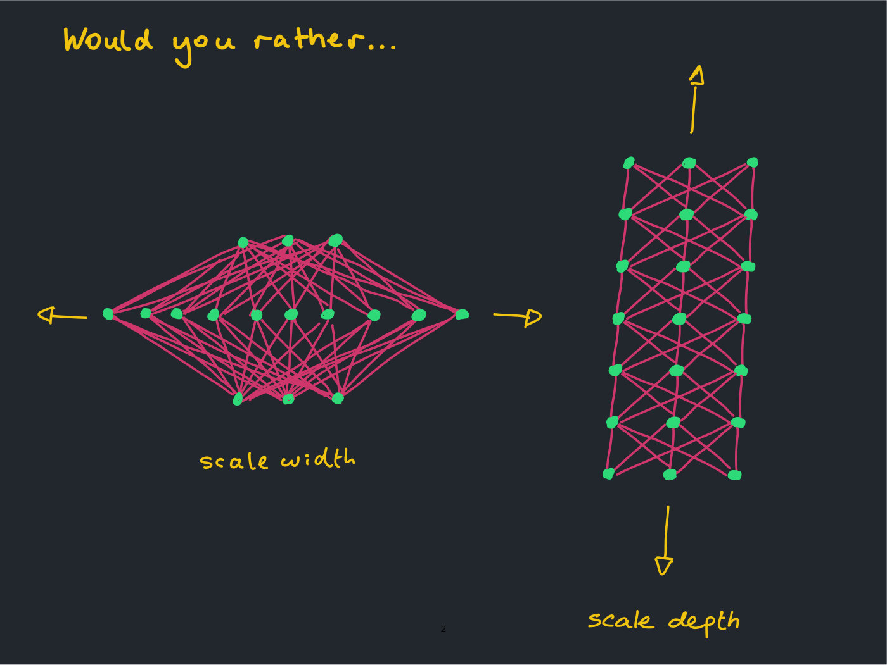

Handwritten yellow heading: "Would you rather...". Two hand-drawn neural-network diagrams, each with green dots (units) joined by pink/magenta lines (weights).

On the left, a wide, flat network: a lens-shaped fan of ten green nodes in a horizontal row across the middle, with a small cluster of three nodes above the middle and three below, all joined by dense crossing pink lines. A yellow arrow points left from its left end and a yellow arrow points right from its right end. Beneath it, yellow text: "scale width".

On the right, a tall, narrow network: seven rows of three green nodes, each row fully connected to the next by crossing pink lines. A yellow arrow points up from its top and a yellow arrow points down from its bottom. Beneath it, yellow text: "scale depth".

The slide poses the choice of scaling the network wider or deeper.

## Slide 3 — Today's lecture

Handwritten yellow heading: "Today's lecture". Text, in reading order (yellow unless stated):

- "What class of functions can a neural net express?"
- In pink, in quotation marks: "neural nets are universal function approximators"
- "Then what architecture should I use?"
- In pink, in quotation marks: "three layers are enough"
- In pink, in quotation marks: "stack more layers!!!"
- "....then what should I do in practice?"

## Slide 4 — The machine learning puzzle

Handwritten yellow heading: "The machine learning puzzle". Text:

"Three pieces to the puzzle:" (yellow)

1. Circled "1", yellow underlined "Approximation"; then, in green: "Does there exist a neural net in my model family that fits the training data?" (the word "exist" is underlined).
2. Circled "2", yellow underlined "Optimization"; then, in blue: "If it does exist, can I find it?" (the word "find" is underlined).
3. Circled "3", yellow underlined "Generalization"; then, in pink: "Does it work well on unseen data?" ("work well" and "unseen data" are underlined).

At the bottom, in yellow: "This lecture will focus mainly on the first question."

## Slide 5 — A motivating problem

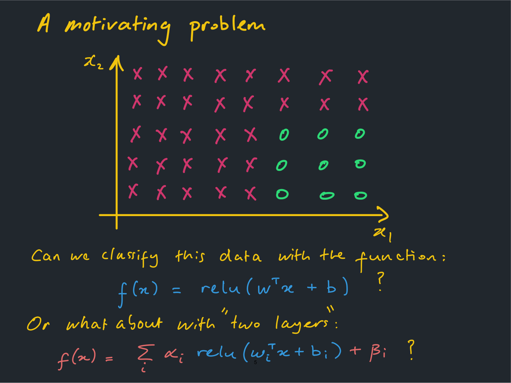

Handwritten yellow heading: "A motivating problem".

Figure: a hand-drawn 2D scatter plot with yellow axes. The vertical axis is labelled $x_2$ and the horizontal axis $x_1$ (both yellow, with arrowheads). The data points form a grid of five rows by eight columns. Pink crosses (x marks) fill the whole top two rows (all eight columns) and the left five columns of the bottom three rows. Green circles (o marks) fill the bottom-right block: the right three columns of the bottom three rows (nine circles). So the two classes are separated by a staircase-shaped boundary: crosses everywhere except the lower-right corner. In all, 31 crosses and 9 circles.

Text below the plot:

- Yellow: "Can we classify this data with the function:"
- Blue equation: $f(x) = \text{relu}(w^T x + b)$ followed by a yellow "?"
- Yellow: "Or what about with "two layers":"
- Pink equation: $f(x) = \sum_ i \alpha_ i \thinspace \text{relu}(w_ i^T x + b_ i) + \beta_ i$ followed by a yellow "?" (the sum's index $i$ is written beneath the sigma; the final $\beta_ i$ is written with subscript $i$ as written, and with no brackets, so whether it sits inside or outside the sum is ambiguous).

Note: as written; $\beta_ i$ carries an index $i$ inside the sum, while a single output bias $\beta$ may be intended. The ink colours in the equation are blue for the one-layer function and pink for the two-layer function, with the relu term in blue.

## Slide 6 — Another motivating problem

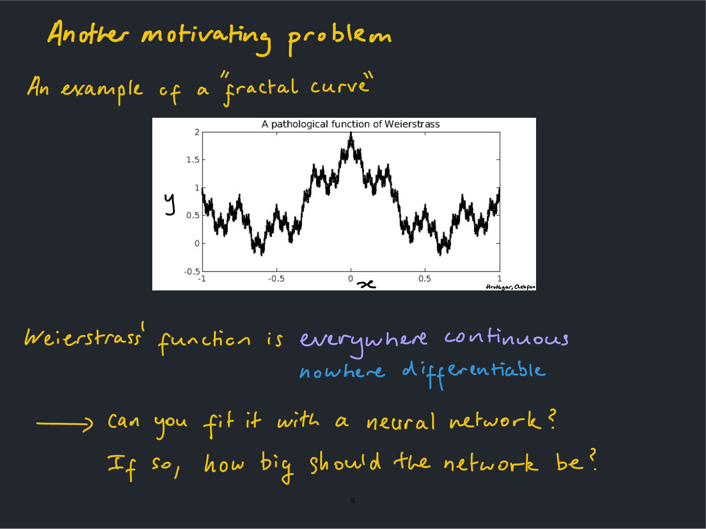

Handwritten yellow heading: "Another motivating problem". Yellow text: "An example of a "fractal curve"".

Figure: a pasted raster image with white background, a MATLAB-style line plot titled (printed, black) "A pathological function of Weierstrass". The x axis runs from −1 to 1 with tick labels −1, −0.5, 0, 0.5, 1; the y axis runs from −0.5 to 2 with tick labels −0.5, 0, 0.5, 1, 1.5, 2. The handwritten axis labels "y" (left) and "x" (below the plot, near 0) were added over the image in black ink. The plot has one series: a single black, extremely jagged, self-similar curve, symmetric about $x = 0$. It peaks at about 2 at $x = 0$, falls with fine-grained roughness through a shoulder of about 1.4 near $x = \pm 0.2$ to $\pm 0.25$ to minima of roughly −0.2 near $x = \pm 0.6$, rises to a smaller bump of about 0.85 near $x = \pm 0.75$, and ends at about 1 at $x = \pm 1$ (values approximate).

*Credit: "Hrothgar, Chebfun" (handwritten in black ink at the bottom right corner of the image, quoted as written).*

Text below, yellow: "Weierstrass' function is" then in purple "everywhere continuous" and, below it in blue, "nowhere differentiable".

Then, after an arrow: "Can you fit it with a neural network?" and "If so, how big should the network be?"

## Slide 7 — Formalizing the approximation problem

Handwritten yellow heading: "Formalizing the approximation problem". Text:

- "Given a family of curves $G$" (yellow, with a capital G written as a script letter). A pink line from $G$ goes to a pink annotation: "exclude pathological functions".
- "And a family of neural networks $F$" (yellow). A pink line from $F$ goes to a pink annotation: "e.g. 5 layer relu MLPs".
- "For any curve $g \in G$"
- "Does there exist a neural net $f \in F$"
- "Such that $\text{error}(f, g) \lt \epsilon$ ?" A pink line from the $\epsilon$ goes to a pink annotation: "think: small number". A second pink line runs from the word "error(f, g)" down to the two examples below.
- Pink examples at the bottom: "e.g. $\text{error}(f, g) \triangleq \max_ x |f(x) - g(x)|$" with the label, in quotation marks, $L_\infty$ error; and "or $\text{error}(f, g) \triangleq \int dx \thinspace |f(x) - g(x)|$" with the label $L_1$ error.

## Slide 8 — One nice family of curves G

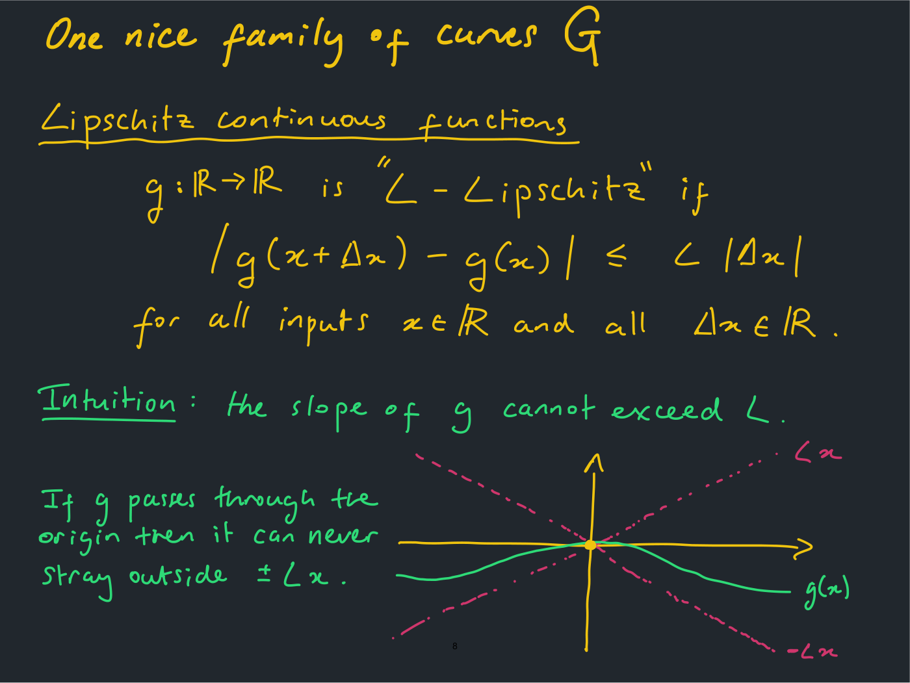

Handwritten yellow heading: "One nice family of curves $G$". Yellow underlined sub-heading: "Lipschitz continuous functions". Then:

$g: \mathbb{R} \to \mathbb{R}$ is "L-Lipschitz" if (with "L-Lipschitz" in quotation marks)

$$|g(x + \Delta x) - g(x)| \le L |\Delta x|$$

"for all inputs $x \in \mathbb{R}$ and all $\Delta x \in \mathbb{R}$."

Green: underlined "Intuition:" then "the slope of $g$ cannot exceed $L$."

Green text at left: "If $g$ passes through the origin then it can never stray outside $\pm Lx$."

Figure: yellow axes crossing at an orange dot at the origin. Two pink dashed straight lines pass through the origin with slopes $+L$ and $-L$, forming an X; the upper right end is labelled $Lx$ (pink) and the lower right end $-Lx$ (pink). A green smooth curve, labelled $g(x)$ at its right end, passes through the origin (marked with the orange dot) and stays inside the wedge between the two dashed lines, curving gently downward on both sides of the origin, flattening towards the right.

## Slide 9 — Extending to multi-dimensional inputs

Handwritten yellow heading: "Extending to multi-dimensional inputs". Yellow underlined sub-heading: "Lipschitz continuous functions". Then:

$g: \mathbb{R}^d \to \mathbb{R}$ is "L-Lipschitz" if (with "L-Lipschitz" in quotation marks)

$$|g(x + \Delta x) - g(x)| \le L \Vert \Delta x \Vert_{\text{RMS}}$$

"for all inputs $x \in \mathbb{R}^d$ and all $\Delta x \in \mathbb{R}^d$."

Green: 'Define the "RMS-norm"' (the word "RMS-norm" is underlined, in quotation marks), then

$$\Vert x \Vert_{\text{RMS}} \triangleq \sqrt{\frac{1}{d} \sum_{i=1}^{d} x_ i^2}$$

Green: $\hookrightarrow$ "it measures the average (root-mean-square) size of the entries of the vector."

## Slide 10 — In this lecture, we will prove...

Handwritten yellow heading: "In this lecture, we will prove...". A yellow arrow from the annotation "d-dimensional hypercube." (yellow) points to the exponent $d$ in $[0,1]^d$ below.

Underlined purple: "Theorem:". Then:

- Pink: "Let $g: [0,1]^d \to \mathbb{R}$ be any $L$-Lipschitz function."
- Green: "Then for any error $\epsilon \gt 0$"
- Blue: "There exists a 3-layer relu network"
- Yellow: "With $N = 4d(L/\epsilon)^d$ units"
- Orange: "such that"

$$\int_{[0,1]^d} |f(x) - g(x)| \thinspace dx \lt 2\epsilon$$

## Slide 11 — Strategy for proving the result

Handwritten yellow heading: "Strategy for proving the result". Three steps, each in its own ink colour:

- Purple underlined "Step one:" then "derive result for 1d inputs via approximation with "rectangular strips"". A purple curved arrow from the words "rectangular strips" points to a purple annotation at right: "ie ignore relu networks for now."
- Green underlined "Step two:" then "generalise to higher input dimension".
- Orange underlined "Step three:" then "show that relu networks can approximate rectangular strips".

## Slide 12 — Step One: Approximation with rectangles

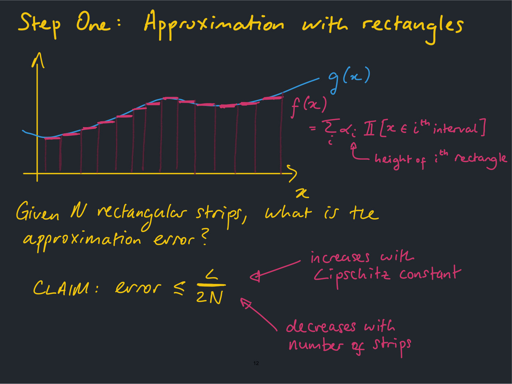

Handwritten yellow heading: "Step One: Approximation with rectangles".

Figure: yellow axes (vertical axis with an up arrowhead, horizontal axis labelled $x$ at its right end). A smooth blue curve labelled $g(x)$ at its upper right rises gently from the left, forms a gentle hill peaking near the middle, dips slightly, then rises again towards the right end. Underneath it, fourteen thin dark-red/maroon vertical lines, starting a little to the right of the vertical axis, divide the region between the axis and the curve into thirteen strips of visibly unequal width (the narrowest about half the widest), and on each strip there is a short pink horizontal segment (a flat rectangle top) starting at the curve's level at the strip's left edge, so that the pink tops form a staircase hugging the blue curve: slightly below it where it rises, and roughly on it after the peak. At the right of the curve, pink: $f(x)$ followed by $= \sum_ i \alpha_ i \thinspace \mathbb{I}[x \in i^{th} \text{ interval}]$, with a pink hooked arrow from the pink note "height of $i^{th}$ rectangle" below pointing up at $\alpha_ i$. (The indicator symbol is written as a double-struck I; the index $i$ is under the sigma.)

Text below, yellow: "Given $N$ rectangular strips, what is the approximation error?"

Then yellow: "CLAIM: error $\le \frac{L}{2N}$". Pink arrows from the pink notes "increases with Lipschitz constant" and "decreases with number of strips" point at the numerator $L$ and the denominator $2N$ respectively.

## Slide 13 — N strips ⟹ each strip has width 1/N (no heading)

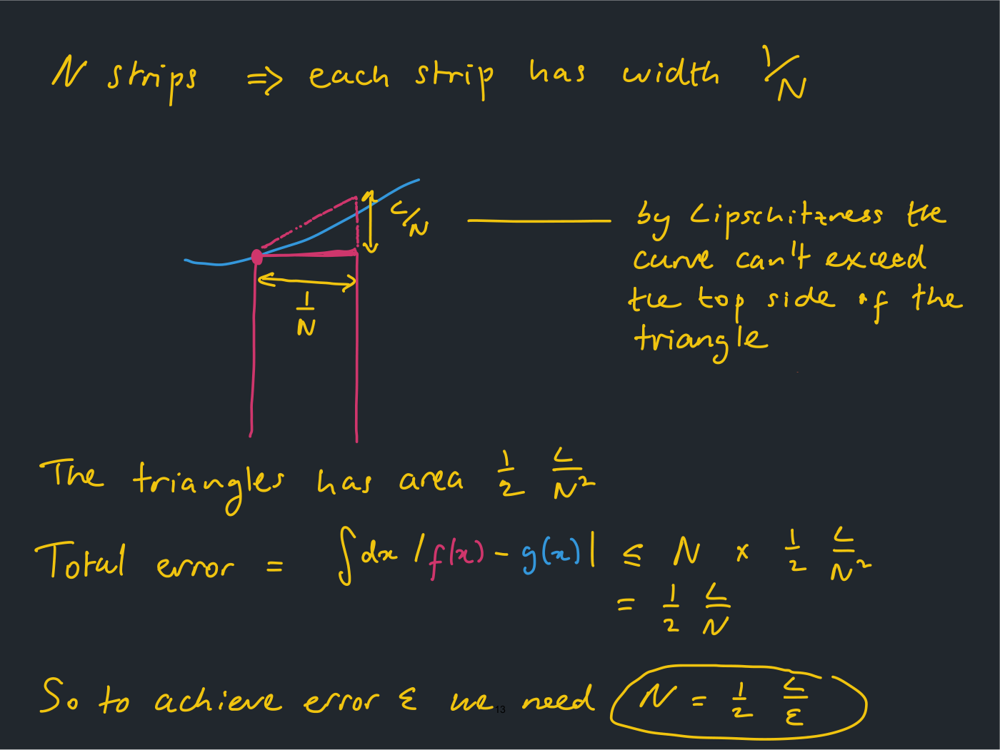

No separate heading; the first line serves as the title. Yellow: $N$ strips $\Rightarrow$ each strip has width $1/N$.

Figure: a close-up of one strip. A blue curve rises gently from left to right. A pink dot sits on the curve at the left edge of the strip, with a thick pink horizontal segment extending right from it (the rectangle top), and two pink vertical lines dropping down from the left and right edges (the sides of the strip). A pink dashed line rises from the dot to the right with a steeper slope, forming a thin triangle with the pink horizontal segment and the right vertical side; the part of the right side above the rectangle top is also drawn dashed. A yellow double-headed arrow below the horizontal segment is labelled $\frac{1}{N}$ (yellow) for its width; a yellow double-headed vertical arrow at the right edge, spanning the triangle's height, is labelled $\frac{L}{N}$. A yellow line from the figure leads to the annotation at right: "by Lipschitzness the curve can't exceed the top side of the triangle".

Text below, yellow:

- "The triangles has area $\frac{1}{2} \frac{L}{N^2}$" (as written, "triangles has")
- "Total error $= \int dx \thinspace |f(x) - g(x)| \le N \times \frac{1}{2} \frac{L}{N^2}$" (the $f(x)$ is written in pink and $g(x)$ in blue)
- $= \frac{1}{2} \frac{L}{N}$
- "So to achieve error $\epsilon$ we need" followed by a circled $N = \frac{1}{2} \frac{L}{\epsilon}$.

## Slide 14 — Step two: Higher input dimension

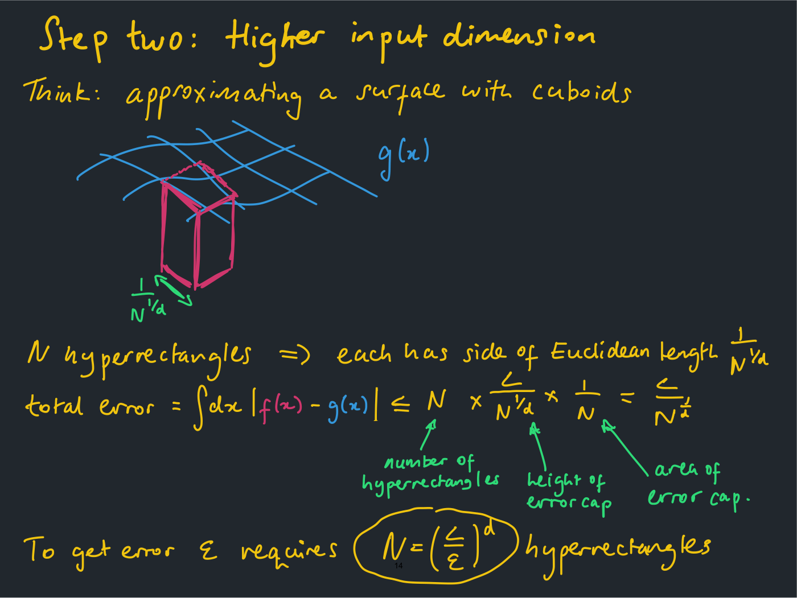

Handwritten yellow heading: "Step two: Higher input dimension". Yellow: "Think: approximating a surface with cuboids".

Figure: a blue wavy mesh surface (a perspective grid of curved blue lines) labelled $g(x)$ in blue at the upper right. Beneath the surface, in pink, a single tall cuboid (a rectangular column) hangs below one cell of the surface, with its top face (a pink dashed parallelogram) flush with the surface. A green double-headed arrow along the bottom edge of the column is labelled $\frac{1}{N^{1/d}}$ (green).

Text below, yellow:

- $N$ hyperrectangles $\Rightarrow$ each has side of Euclidean length $\frac{1}{N^{1/d}}$
- "total error $= \int dx \thinspace |f(x) - g(x)| \le N \times \frac{L}{N^{1/d}} \times \frac{1}{N} = \frac{L}{N^{1/d}}$" (the $f(x)$ is pink and $g(x)$ blue). Green arrows with notes: from the factor $N$, "number of hyperrectangles"; from the factor $\frac{L}{N^{1/d}}$, "height of error cap"; from the factor $\frac{1}{N}$, "area of error cap."
- "To get error $\epsilon$ requires" a circled $N = (\frac{L}{\epsilon})^d$ followed by "hyperrectangles".

## Slide 15 — Step Three: Relu networks can fit rectangles

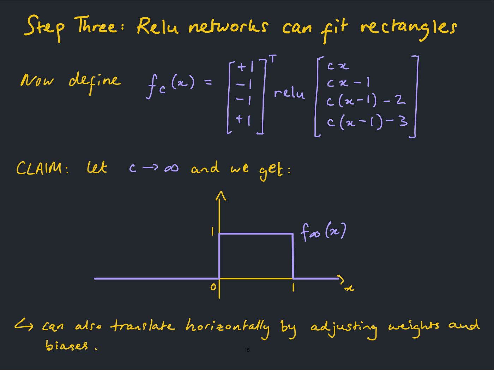

Handwritten yellow heading: "Step Three: Relu networks can fit rectangles". Yellow "Now define", then, with the matrices in purple:

$$f_c(x) = \begin{bmatrix} +1 \cr -1 \cr -1 \cr +1 \end{bmatrix}^T \text{relu} \begin{bmatrix} cx \cr cx - 1 \cr c(x-1) - 2 \cr c(x-1) - 3 \end{bmatrix}$$

Yellow: "CLAIM: let $c \to \infty$ and we get:" (the $c \to \infty$ in purple)

Figure: yellow axes; the vertical axis has a tick label "1" at height 1, the horizontal axis is labelled $x$ with tick labels "0" and "1". The plot has one purple curve $f_\infty(x)$, labelled in purple at the upper right: a rectangular pulse that is 0 for $x \lt 0$, jumps vertically at $x = 0$ to height 1, stays flat at 1 until $x = 1$, then drops vertically back to 0 and stays 0 beyond.

Bottom, yellow: $\hookrightarrow$ "can also translate horizontally by adjusting weights and biases."

## Slide 16 — But we need d-dimensional hyperrectangles...

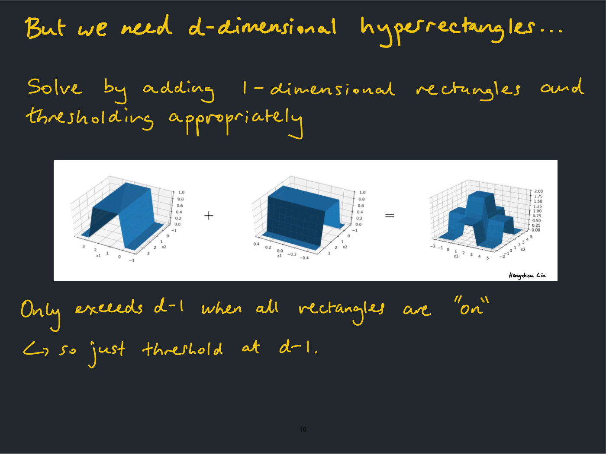

Handwritten yellow heading: "But we need d-dimensional hyperrectangles...". Yellow: "Solve by adding 1-dimensional rectangles and thresholding appropriately".

Figure: a pasted raster image on a white background with three 3D surface plots (blue, with grey grid), read left to right, joined by a plus sign and an equals sign. Left: a plot over axes $x1$ and $x2$ (vertical axis 0.0 to 1.0) showing a trapezoid-like ridge, a flat-topped wall of height 1.0 running across the $x2$ direction. Middle: a second plot (vertical axis 0.0 to 1.0) showing a similar flat-topped wall running along the other direction. Right: the sum (vertical axis 0.00 to 2.00 in steps of 0.25), a cross-shaped (plus-shaped) block where the two walls overlap, rising to height 2.00 in the overlap square and 1.0 on the arms. The left wall varies along $x1$ and runs parallel to $x2$; the middle one varies along $x2$ and runs parallel to $x1$. The three panels do not share axis ranges (the middle panel's $x1$ axis, for example, runs from −0.4 to 0.4).

*Credit: "Hongzhou Lin" (handwritten, black ink, at the bottom right corner of the image, quoted as written).*

Text below, yellow: "Only exceeds $d-1$ when all rectangles are "on"" and $\hookrightarrow$ "so just threshold at $d-1$."

## Slide 17 — Assembling the pieces

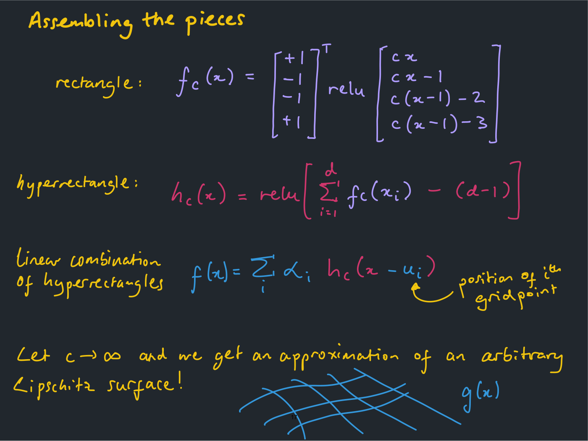

Handwritten yellow heading: "Assembling the pieces". Yellow labels at left, equations in colour:

- "rectangle:" with the purple equation from slide 15, written the same way:

$$f_c(x) = \begin{bmatrix} +1 \cr -1 \cr -1 \cr +1 \end{bmatrix}^T \text{relu} \begin{bmatrix} cx \cr cx - 1 \cr c(x-1) - 2 \cr c(x-1) - 3 \end{bmatrix}$$

- "hyperrectangle:" with the pink equation (the $f_c(x_ i)$ inside it in purple)

$$h_c(x) = \text{relu}\left[ \sum_{i=1}^{d} f_c(x_ i) - (d-1) \right]$$

- "Linear combination of hyperrectangles" with the blue equation $f(x) = \sum_ i \alpha_ i \thinspace h_c(x - u_ i)$ (the whole $h_c(x - u_ i)$ is pink). A yellow arrow from the yellow note "position of $i^{th}$ gridpoint" points at $u_ i$.
- Yellow: "Let $c \to \infty$ and we get an approximation of an arbitrary Lipschitz surface!" followed by a small blue sketch of a wavy perspective mesh surface labelled $g(x)$ in blue.

## Slide 18 — Some comments

Handwritten yellow heading: "Some comments". At the left edge is a tall, narrow vertical yellow scribble: a dense zig-zag oscillation running down the page (a jagged fractal-like line, not labelled).

Beside it, the theorem of slide 10 is repeated in the same colours: purple underlined "Theorem:"; pink "Let $g: [0,1]^d \to \mathbb{R}$ be any $L$-Lipschitz function."; green "Then for any error $\epsilon \gt 0$"; blue "There exists a 3-layer relu network"; yellow "With $N = 4d(L/\epsilon)^d$ units"; orange "such that $\int_{[0,1]^d} |f(x) - g(x)| dx \lt 2\epsilon$".

Yellow comments below:

- "General idea: approximate "bumps" then linearly combine"
- "Needs exponentially many neurons in dimension"
- "Taking $c \to \infty$ feels unrealistic"
- "Approximating rectangles feels like a trick"

## Slide 19 — Imagine training the rectangle representation

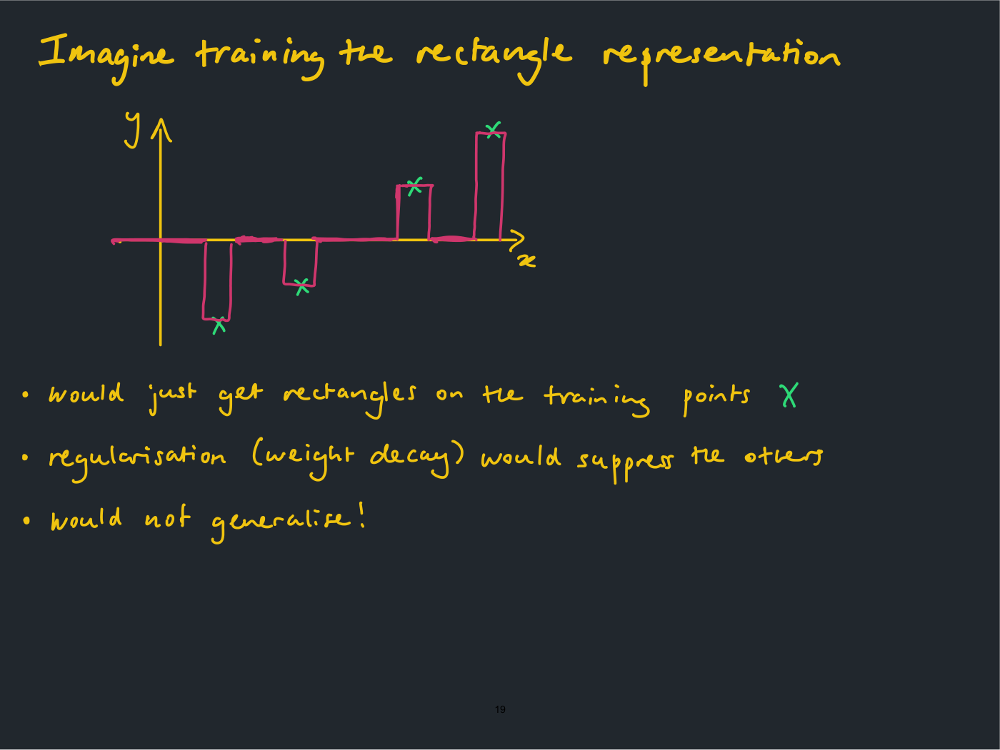

Handwritten yellow heading: "Imagine training the rectangle representation".

Figure: yellow axes labelled $y$ (vertical) and $x$ (horizontal). A pink piecewise-constant curve lies along the $x$ axis at $y = 0$ except for four rectangular pulses: from left to right, a deep negative pulse below the axis, a shallower negative pulse, a positive pulse of moderate height, and a taller positive pulse at the far right. Each pulse top (or bottom) touches a small green cross (training point), so there are four green crosses, one on each pulse's flat end.

Yellow bullets:

- "would just get rectangles on the training points" followed by a green "x"
- "regularisation (weight decay) would suppress the others"
- "would not generalise!"

## Slide 20 — Further reading

Handwritten yellow heading: "Further reading". Yellow: "More results on universal function approximation".

- Yellow bullet "Barron's theorem"; then in pink-red: "Smooth functions can be approximated with fewer neurons" (in quotation marks) and "leverages Fourier representation".
- Yellow bullet "2 layers are enough"; then in pink-red: "e.g. Hornik, Stinchcombe and White (1989)" and "uses" followed by, in blue underlined, "Stone-Weierstrass theorem".

## Slide 21 — Is universal function approximation important?

Handwritten yellow heading: "Is universal function approximation important?". Text:

- Yellow: "Is "UFA" sufficient for learning to work?"
- Pink: "No, there are many UFAs that we usually don't do ML with:"
- Pink: "Examples:" followed by a column of three items: "Fourier series", "polynomials", "the space of Python programs".
- Yellow: "Is "UFA" necessary for learning to work?"

## Slide 22 — Width versus depth (section divider)

A section divider on a pale blue background: handwritten black title "Width versus depth" sitting on a thick black horizontal rule. No other content.

## Slide 23 — Would you rather...

Handwritten yellow heading: "Would you rather...". The slide is identical to slide 2: a wide, flat network of green nodes with pink connections on the left (a yellow arrow pointing out from each end, label "scale width") and a tall, narrow network of seven rows of three green nodes on the right (yellow arrows pointing up from the top and down from the bottom, label "scale depth").

Build step: same content as slide 2 (repeated at the start of the "Width versus depth" section).

## Slide 24 — Width versus depth

Handwritten yellow heading: "Width versus depth". Yellow underlined sub-heading: "Advantages of scaling width". Bullets:

- "3 layer (or even 2 layer) NNs are" with, to the right, the annotation (in quotation marks) "universal function approximators"
- "width is inherently parallelisable, depth is sequential"
- "width is easier to train, depth leads to "compound problems""

At the bottom: "So, scaling width is obviously better!" (the word "obviously" is underlined).

## Slide 25 — Or is it?.... Depth separations

Handwritten yellow heading: "Or is it?.... Depth separations". Text:

- Yellow: "Universal function approximation results suggest needing exponentially many hidden units at small width"
- Blue: ""depth separation" results construct deep networks that require exponentially more units to fit with a shallow network."

## Slide 26 — The shape of a result

Handwritten yellow heading: "The shape of a result". Text:

"To prove a "depth separation"" (yellow), then three circled steps:

1. "pick a property of a function". A blue arrow from the note "e.g. "number of linear regions"" (blue, upper right) points to this step.
2. "construct a deep network that has this property"
3. "prove that a shallow network would need exponentially more units to also have this property"

## Slide 27 — Piecewise linear functions

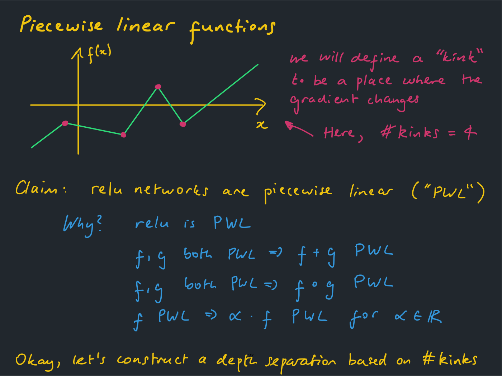

Handwritten yellow heading: "Piecewise linear functions".

Figure: yellow axes, the vertical axis labelled $f(x)$ and the horizontal axis labelled $x$. One green curve, the function $f(x)$, a piecewise-linear line that starts low at the far left, rises to a kink just left of the vertical axis (just below the horizontal axis), then falls gently to a kink below the horizontal axis (to the right of the vertical axis), then rises steeply to a peak above the axis, falls to a kink just below the axis, and then rises in a straight line to the upper right. There are four pink dots marking the kinks, in left-to-right order: the first just left of the vertical axis, the second the low point, the third the high peak, the fourth the low point after the peak. Pink text at the upper right: "we will define a "kink" to be a place where the gradient changes". A pink arrow from "Here, # kinks = 4" (pink) points down toward the right end of the $x$ axis.

Text below:

- Yellow: "Claim: relu networks are piecewise linear ("PWL")"
- Blue: "Why?" with the list "relu is PWL"; $f, g$ both PWL $\Rightarrow$ $f + g$ PWL; $f, g$ both PWL $\Rightarrow$ $f \circ g$ PWL; $f$ PWL $\Rightarrow$ $\alpha \cdot f$ PWL for $\alpha \in \mathbb{R}$.
- Yellow, at the bottom: "Okay, let's construct a depth separation based on # kinks"

## Slide 28 — Intuition: Effect of adding width

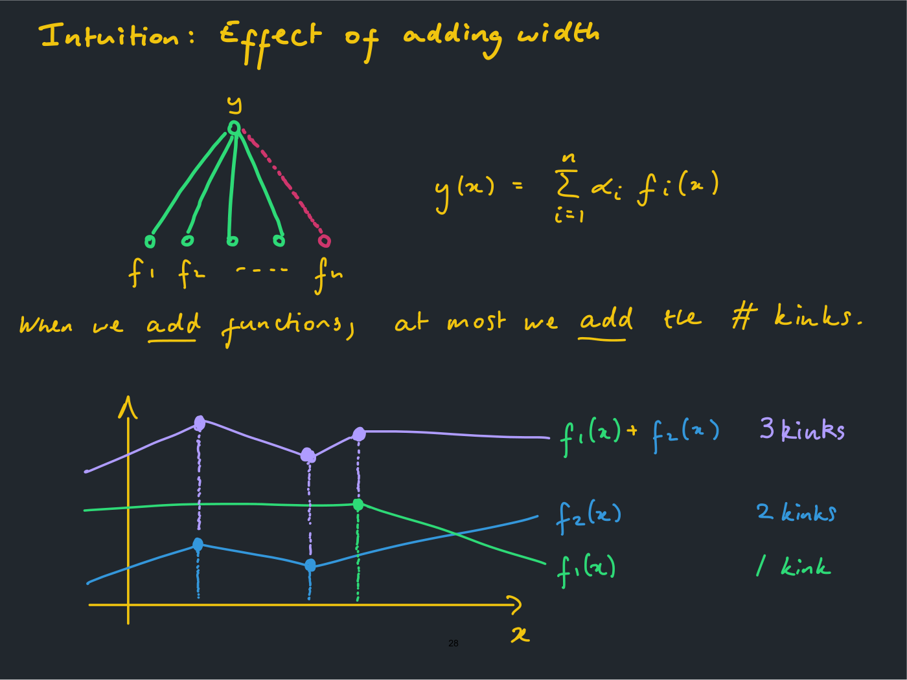

Handwritten yellow heading: "Intuition: Effect of adding width".

Figure (top): a small tree diagram. At the top, a green circle labelled $y$ (yellow). Five lines descend from it to five small circles in a row labelled below (yellow) $f_1$, $f_2$, "- - - -", $f_n$; the first four connecting lines and circles are green, the last line (to $f_n$) is a pink dash-dotted line and its circle is pink. To the right, the equation $y(x) = \sum_{i=1}^{n} \alpha_ i f_ i(x)$ (yellow).

Yellow text: "When we add functions, at most we add the # kinks." (the word "add" is underlined both times).

Figure (bottom): yellow axes with horizontal axis labelled $x$. Three piecewise-linear curves are drawn at different heights with dashed vertical lines marking their kinks:

- A blue curve labelled $f_2(x)$ (blue), with the label "2 kinks" in blue: a gently rising curve with two kinks (blue dots), the first a local peak and the second a local trough, then rising to the right.
- A green curve labelled $f_1(x)$ (green), with the label "1 kink" in green: a nearly flat line that has one kink (green dot) at the third dashed vertical line, after which it slopes downward to the right.
- A purple curve at the top labelled $f_1(x) + f_2(x)$ (the $f_1$ in green and $f_2$ in blue), with the label "3 kinks" in purple: a curve with three kinks (purple dots), one at each of the three dashed vertical lines (a peak, then a trough, then a corner after which the curve is nearly flat to the right).

The three dashed lines are drawn down from the purple kinks through the lower curves; the two blue kinks sit at the first two dashed lines and the green kink at the third.

## Slide 29 — Intuition: Effect of applying relu

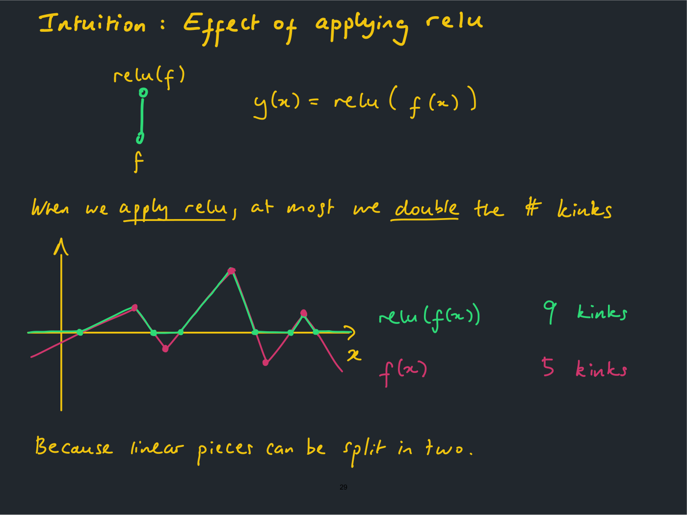

Handwritten yellow heading: "Intuition: Effect of applying relu".

Figure (top): a two-node diagram: a green circle labelled "relu(f)" above, joined by a green line to a green circle labelled $f$ below (both labels in yellow). To the right, yellow: $y(x) = \text{relu}(f(x))$.

Yellow text: "When we apply relu, at most we double the # kinks" ("apply relu" and "double" are underlined).

Figure (bottom): yellow axes with the horizontal axis labelled $x$ at the right end. There are two curves:

- A pink piecewise-linear curve labelled $f(x)$ (pink), with the label "5 kinks" (pink): it rises from below the horizontal axis at the left, crosses the axis, reaches a peak, drops below the axis to a trough, climbs to a high peak (the highest point), falls well below the axis to a deep trough, rises to a small peak just above the axis, then falls below the axis again. Pink dots mark its five kinks.
- A green piecewise-linear curve labelled $\text{relu}(f(x))$ (green ink), with the label "9 kinks" (green): it follows the pink curve wherever the pink curve is above the horizontal axis and lies flat along the axis wherever the pink curve is below the axis. Six green dots mark the axis crossings, where the new kinks are; the three kinks of $f$ that lie above the axis are shared and carry the pink dots of $f$. The nine is the label's count; six green dots plus three shared pink ones.

Yellow text at the bottom: "Because linear pieces can be split in two."

## Slide 30 — More formally

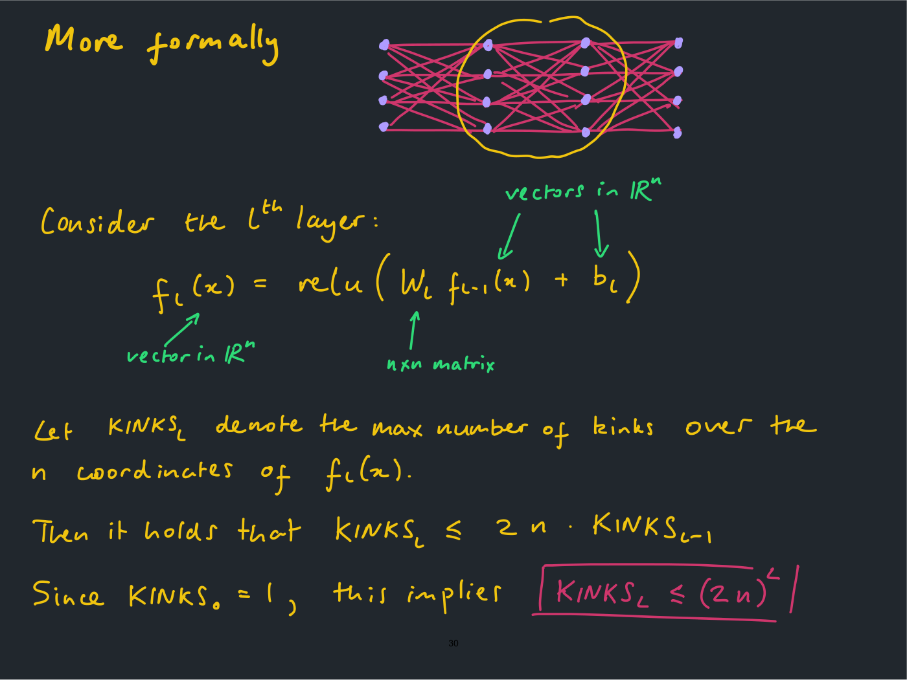

Handwritten yellow heading: "More formally".

Figure (top): a hand-drawn fully connected network with four purple nodes in each of four columns, joined by dense pink lines between adjacent columns. A yellow oval circles the middle two columns of nodes and the connections between them (the layer under discussion).

Text:

- Yellow: "Consider the $L^{th}$ layer:" (the layer index here and throughout slides 30–33 is the lecturer's handwritten capital L, a down-stroke ending in a rightward foot, the same glyph as in "Let" and "L-Lipschitz"; it is not a script $\ell$).
- Equation (yellow): $f_L(x) = \text{relu}(W_L f_{L-1}(x) + b_L)$. Green annotations, with arrows pointing from each note at its symbol: "vector in $\mathbb{R}^n$" at $f_L(x)$; $n \times n$ matrix at $W_L$; and "vectors in $\mathbb{R}^n$" at $f_{L-1}(x)$ and $b_L$ together.
- Yellow: "Let KINKS-L denote the max number of kinks over the $n$ coordinates of $f_L(x)$."
- Yellow: "Then it holds that KINKS-L ≤ 2n · KINKS-(L−1)", that is, $\text{KINKS}_ L \le 2n \cdot \text{KINKS}_ {L-1}$
- Yellow: "Since KINKS-0 = 1, this implies" ($\text{KINKS}_ 0 = 1$) followed by the boxed pink result: $\text{KINKS}_ L \le (2n)^L$.

## Slide 31 — Interpreting the result

Handwritten yellow heading: "Interpreting the result". Text:

- Yellow: "We showed that:" followed by the boxed pink result $\text{KINKS}_ L \le (2n)^L$.
- Yellow definitions, aligned on equals signs: $\text{KINKS}_ L$ = "# kinks in the function at layer L"; $n$ = "width"; $L$ = "depth".
- Yellow: $\hookrightarrow$ "upper bound grows at best polynomially in width but exponentially in depth" ("polynomially" and "exponentially" are underlined).
- Yellow: "Need to ask: is the bound ever attained?"

## Slide 32 — Short answer: Yes!

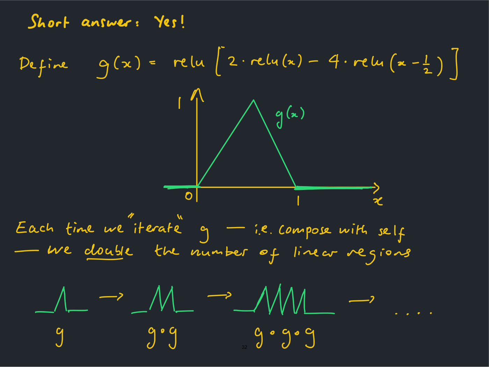

Handwritten yellow heading: "Short answer: Yes!". Yellow: "Define" followed by

$$g(x) = \text{relu}\left[ 2 \cdot \text{relu}(x) - 4 \cdot \text{relu}\left(x - \tfrac{1}{2}\right) \right]$$

Figure: yellow axes with a tick label "1" on the vertical axis, "0" and "1" on the horizontal axis (horizontal axis labelled $x$). One green curve, labelled $g(x)$: a triangular bump, flat at 0 for $x \lt 0$, rising in a straight line from $(0, 0)$ to a peak of height 1 (level with the vertical axis's "1" tick) at about $x = 0.55$ as drawn, $\frac{1}{2}$ by the formula (no tick marks $\frac{1}{2}$), falling in a straight line to $(1, 0)$, and flat at 0 for $x \gt 1$.

Yellow: "Each time we "iterate" $g$ — i.e. compose with self — we double the number of linear regions" ("double" underlined).

Figure (bottom): a row of three small green sketches joined by yellow arrows, followed by an arrow and dots "....". Under each is a yellow label: first a single triangular bump labelled $g$; second a bump pair shaped like an "M" (two peaks) labelled $g \circ g$; third a zig-zag of four peaks labelled $g \circ g \circ g$. Each sketch is flat to the left and right of the zig-zag.

## Slide 33 — ⟹ Depth separation (no separate heading)

Handwritten yellow heading: $\Rightarrow$ "Depth separation". Yellow bullets:

- $g \circ g \circ \ldots \circ g$ 500 times has $2^{500} - 1$ kinks
- "it has 1000 layers of width 2"
- "to get the same number of kinks with a 3-layer network we would need a width $n$ of"

Then the displayed working (yellow):

- $\text{KINKS} \le (2n)^L$
- $\Rightarrow n \ge \frac{1}{2} \cdot \text{KINKS}^{1/L}$ (the exponent written as a fraction $\frac{1}{L}$)
- $= \frac{1}{2} \cdot (2^{500} - 1)^{1/3}$
- $=$ a circled $7 \times 10^{49}$ units

## Slide 34 — What does this not say?

Handwritten yellow heading: "What does this not say?". Text:

- Yellow: "It does not mean that:"
- Bullet: "very deep networks are easy to train", with the blue capitalised word "OPTIMISATION" beneath at the right.
- Bullet: "very deep networks would generalise well", with the pink capitalised word "GENERALISATION" beneath at the right.
- Yellow: "In our machine learning puzzle, it only tells us something about" followed by the green capitalised word "APPROXIMATION!".

## Slide 35 — Further reading

Handwritten yellow heading: "Further reading". Bullets (names in yellow, descriptions in pink-red):

- "Telgarsky (2015, 2016)" — "our depth separation"
- "Safran and Shamir (2017)" — "a different depth separation"
- "Lu, Pu, Wang, Hu and Wang (2017)" — "results on "minimum width" needed to be a universal function approximator even at "large depth"" and — "relates to rank of the weight matrices"

## Slide 36 — Practical considerations (section divider)

A section divider on a pale green background: handwritten black title "Practical considerations" on a thick black horizontal rule. No other content.

## Slide 37 — Let's consider the whole puzzle

Handwritten yellow heading: "Let's consider the whole puzzle". Three words stacked, as a sum: green "APPROXIMATION", then yellow "+" with blue "OPTIMISATION", then yellow "+" with pink "GENERALISATION". Yellow bullets:

- "Pretend you work at an LLM startup"
- "You want to train the most efficient LLM possible"
- "You really care about the optimal width vs. depth"

## Slide 38 — Scaling laws

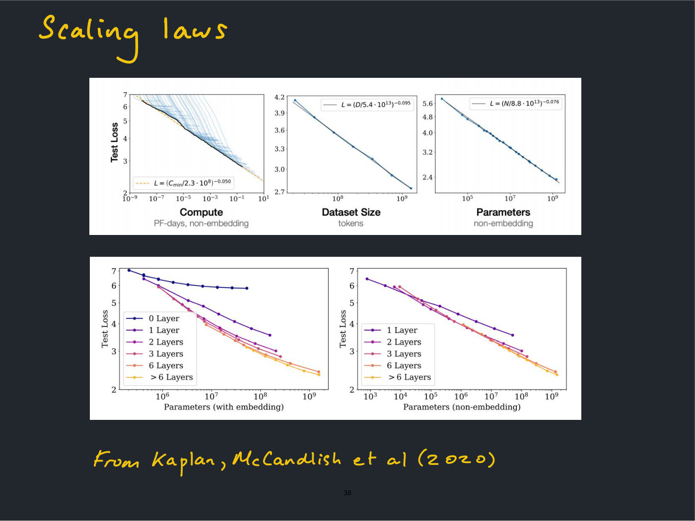

Handwritten yellow heading: "Scaling laws". Two pasted raster figures (white background), one above the other, then the handwritten yellow caption "From Kaplan, McCandlish et al (2020)".

*Credit: "From Kaplan, McCandlish et al (2020)" (handwritten caption, quoted as written).*

Upper figure: three side-by-side log-log panels sharing the y-axis label "Test Loss" (at the left of the first panel). Values below are approximate readings.

Panel 1, "Compute" (x-axis label "Compute", sub-label "PF-days, non-embedding"; x axis log scale from $10^{-9}$ to $10^{1}$ with tick labels $10^{-9}$, $10^{-7}$, $10^{-5}$, $10^{-3}$, $10^{-1}$, $10^{1}$; y axis log scale from 2 to 7, tick labels 2, 3, 4, 5, 6, 7). It has three kinds of line:

- Many light-blue curves (a family of individual training runs, not one series per curve): each starts high at the top left (loss 7) and falls steeply to the right, the family fanning out so that later-starting curves reach the same loss at larger compute, covering the region above the black line.
- One black curve (the lower envelope of the blue curves): from about loss 6.5 at about $10^{-8}$, falling roughly linearly on the log-log axes to about 2.8 at about $2.5 \times 10^{-1}$.
- One orange dashed line, the power-law fit, from the top left at about 7 near $10^{-9}$, falling to about 2.3 at $10^{1}$ (it runs just below the black curve). Its legend entry (a label, not a further series) reads $L = (C_{\min}/2.3 \cdot 10^8)^{-0.050}$.

Panel 2, "Dataset Size" (x-axis label "Dataset Size", sub-label "tokens"; x axis log scale with tick labels $10^8$ and $10^9$; y axis ticks 2.7, 3.0, 3.3, 3.6, 3.9, 4.2). It has two lines: one blue line with dots (measured), from about 4.1 at about $2 \times 10^7$ tokens, through about 3.8 at $4 \times 10^7$, 3.55 at $8 \times 10^7$, 3.3 at $1.7 \times 10^8$, 3.15 at $3.4 \times 10^8$, 2.9 at $7 \times 10^8$, to about 2.75 at $1.4 \times 10^9$; and one thin grey straight line (the fit) lying almost on top of it. The legend label (not a series) reads $L = (D/5.4 \cdot 10^{13})^{-0.095}$.

Panel 3, "Parameters" (x-axis label "Parameters", sub-label "non-embedding"; x axis log scale with tick labels $10^5$, $10^7$, $10^9$; y axis ticks 2.4, 3.2, 4.0, 4.8, 5.6). It has two lines: one blue line with about twenty-two dots, falling from about 5.9 at about $6 \times 10^3$ parameters (above the 5.6 tick) through about 4.7 at $10^5$, 4.0 near $10^6$ and 3.2 near $2 \times 10^7$, to about 2.35 at about $1.4 \times 10^9$; and one thin grey straight fit line almost on top of it. The legend label (not a series) reads $L = (N/8.8 \cdot 10^{13})^{-0.076}$.

Lower figure: two log-log panels, each with y-axis label "Test Loss" (ticks 2, 3, 4, 5, 6, 7) and a colour legend of layer counts running from dark navy/purple to yellow.

Left panel: x-axis label "Parameters (with embedding)", ticks $10^6$, $10^7$, $10^8$, $10^9$. It has six series, one per legend entry, each a line with dots:

- "0 Layer" (dark navy): about 7 at about $2 \times 10^5$ parameters, falling slowly to about 5.8 at about $5 \times 10^7$ (flattening out).
- "1 Layer" (dark purple): about 6.4 at about $4 \times 10^5$, 4.8 at $7 \times 10^6$, 4.1 at $3 \times 10^7$, to about 3.55 at about $1.6 \times 10^8$.
- "2 Layers" (purple): about 6.0 at $8 \times 10^5$, 4.2 at $7 \times 10^6$, 3.5 at $3 \times 10^7$, to about 3.0 at about $2 \times 10^8$.
- "3 Layers" (pink-red): about 5.9 at $8 \times 10^5$, 3.8 at $1.5 \times 10^7$, to about 2.8 at about $2.6 \times 10^8$.
- "6 Layers" (orange): from about 4.0 at about $8 \times 10^6$ (its first point) down to about 2.4 at about $1.6 \times 10^9$.
- "> 6 Layers" (yellow): lowest curve, from about 3.1 at about $5 \times 10^7$ (its first point) to about 2.35 at about $1.6 \times 10^9$.

Only the 0- to 3-layer series extend to small sizes (the 2- and 3-layer ones start together at about $8 \times 10^5$); the 6- and >6-layer series begin at larger sizes. Legend order matches the curves' top-to-bottom order at the large end, where the 0- and 1-layer curves are clearly higher than the rest.

Right panel: x-axis label "Parameters (non-embedding)", ticks $10^3$ through $10^9$ (every power: $10^3$, $10^4$, $10^5$, $10^6$, $10^7$, $10^8$, $10^9$). It has five series (the "0 Layer" series is absent): "1 Layer" (dark purple) from about 6.4 at about $8 \times 10^2$ down to about 3.55 at about $5 \times 10^7$; "2 Layers" (purple) from about 5.9 at about $6 \times 10^3$ to about 3.0 at about $10^8$; "3 Layers" (pink-red) from about 5.9 at about $9 \times 10^3$ to about 2.8 at about $1.5 \times 10^8$; "6 Layers" (orange) from about 4.0 at about $1.2 \times 10^6$ to about 2.4 at about $1.3 \times 10^9$; "> 6 Layers" (yellow) from about 3.1 at about $2.5 \times 10^7$ to about 2.35 at about $1.5 \times 10^9$. The 2-, 3-, 6- and >6-layer curves nearly collapse onto one common line. The 1-layer curve lies below the 2- and 3-layer curves under about $4 \times 10^4$ parameters, crosses them there, and ends clearly above the rest.

## Slide 39 — The importance of confounders

Handwritten yellow heading: "The importance of confounders". Text:

- Yellow underlined, in quotation marks: "Chinchilla scaling rules"
- Blue: "Hoffmann, Borgeau, Mensch et al (2020)" (spellings as written; the date is as written)
- Yellow bullets: "question some results in Kaplan et al"; "suggest a different learning rate schedule"; "changes certain scaling results"
- Green: $\longrightarrow$ "to really answer "what is the optimal width versus depth" need to obsess over "minor details" of the training pipeline"

## Slide 40 — Wrapping up (section divider)

A section divider on a pale peach background: handwritten black title "Wrapping up" on a thick black horizontal rule. No other content.

## Slide 41 — Summary

Handwritten yellow heading: "Summary". Bullets:

- "Very wide shallow neural nets are universal function approximators"
- "Deeper networks can fit certain kinds of function with many fewer neurons —— "depth separations""
- "Unclear how these results interact with training and generalisation"

## Slide 42 — Preview: Inductive biases

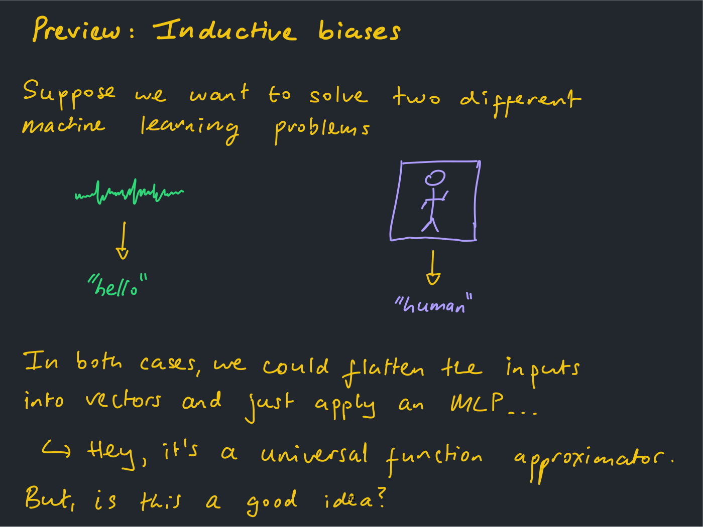

Handwritten yellow heading: "Preview: Inductive biases". Yellow: "Suppose we want to solve two different machine learning problems".

Figure: two small drawings, each with a downward arrow to a label. On the left, a green squiggly horizontal waveform (an audio-like signal) with a yellow arrow down to the green label "hello" (in quotation marks). On the right, a purple square frame containing a purple stick figure of a person, with a yellow arrow down to the purple label "human" (in quotation marks).

Yellow text below:

- "In both cases, we could flatten the inputs into vectors and just apply an MLP..."
- $\hookrightarrow$ "Hey, it's a universal function approximator."
- "But, is this a good idea?"

The slide title previews a later topic ("Inductive biases"); no lecture number is written.

## Slide 43 — MIT OpenCourseWare end page

OCW's appended end page (not lecture content), typed on a white background: "MIT OpenCourseWare", link "https://ocw.mit.edu", "6.7960 Deep Learning", "Fall 2024", and "For information about citing these materials or our Terms of Use, visit: https://ocw.mit.edu/terms". The page prints the number 43 at bottom centre.
