# Lecture 4 — Architectures for Grids: slide-by-slide

Text and figures of all 84 slides of
[`mit6_7960_f24_lec4.pdf`](https://ocw.mit.edu/courses/6-7960-deep-learning-fall-2024/mit6_7960_f24_lec4.pdf),
transcribed from the deck (speaker: Sara Beery). Cite these as "slide N" — the printed
number equals the PDF page number for slides 1–83; slide 84 is OCW's appended end page. Diagrams, plots and photographs are described in prose since the KB is read as text.

**Images.** 31 slides carry a whole-slide render under their heading: 3, 5–8, 10, 26–32, 34, 37, 39–42, 44, 48, 49, 56–60, 73–75 and 77. Not rendered: the 35 slides with an OCW "All rights reserved" notice (9, 12–25, 35, 43, 47, 53–55, 61–63, 66–72, 78–81); slides 50–52, which print no notice but reuse slide 25's excluded clown fish photograph; slide 36, a text slide whose two thumbnails repeat slide 25's filtered clown fish and slide 29's diagram; build steps superseded by a rendered slide (4, 33, 45); and the title, agenda, divider, text and end pages (1, 2, 11, 38, 46, 64, 65, 76, 82–84). Use an image path only if it appears in this file.

Companion pages: [wiki page for this lecture](../../wiki/04-architectures-grids.md) ·
[transcript](../transcripts/04-architectures-grids.md)

**Signposting slides you can skip.** Slides 2 and 83 (the agenda, identical to each other) and the divider slides 11 ("Convolutional Neural Networks"), 38 ("What if we have color?") and 65 ("Popular CNN Architectures") carry no technical content.

Many slides are **build steps** — the same slide re-shown with one more element revealed. They are transcribed individually so that a citation to any one of them resolves, each with a note of what it adds relative to the previous one.

## Contents

| Slides | Section |
| ------ | ------- |
| 1 | Title |
| 2 | Agenda (Architectures for grids) |
| 3 | Multilayer perceptron: pros and cons |
| 4–10 | Why use other architectures? Hypothesis space, effect of more data, ReLU net versus $y = ax + \sin(bx^2)$ net versus SIREN on 1D fits; preview of image fitting with different architectures |
| 11 | Divider: Convolutional Neural Networks |
| 12–23 | Classifying image patches: stork photo cut into patches, patch-label grid, overlapping patches, centre-pixel classification, semantic segmentation, translation equivariance |
| 24–25 | Weighted sum over a patch; convolution as linear shift-invariant filtering |
| 26–29 | Fully connected, locally connected and convolutional networks; weight sharing |
| 30–35 | Linear layer versus convolutional layer as matrices; Toeplitz matrix; arbitrary-sized inputs; filter responses |
| 36–37 | Five views on convolutional layers; stacking convolutional layers |
| 38–46 | Colour and multichannel inputs and outputs; general multi-input multi-output form; feature maps; parameter counting; filter sizes |
| 47 | Layer-by-layer filters and feature maps on RGB input |
| 48–53 | Pooling: max and mean pooling, pooling across space and across channels |
| 54–58 | Computation in a neural net; downsampling and strided operations |
| 59–60 | Strided operations (2D) and dilated filters |
| 61–63 | Receptive fields; feature maps at different depths of AlexNet, VGG16, ResNet18 |
| 64 | Implementing convolution (im2col, bmm, col2im) |
| 65–71 | Popular CNN architectures: encoder and decoder, image-to-image, U-net, ResNet (residual connections) |
| 72 | Image-to-image (repeat of slide 69) |
| 73–75 | Convolutions in time and over video volumes |
| 76–77 | What if you do not want shift invariance: positional encoding |
| 78–81 | Neural fields: coordinates to field, SIREN, NeRF; generated image by Yen-Chen Lin |
| 82 | Concluding remarks |
| 83 | Agenda recap (same as slide 2) |
| 84 | MIT OpenCourseWare end page |

---

## Slide 1 — Lecture 4: Architectures for Grids

Title: "Lecture 4: Architectures for Grids". Subtitle: "Speaker: Sara Beery".

Plain white background. Footer bar (grey): MIT logo, "6.7960 Deep Learning" (red), "https://phillipi.github.io/6.7960", right side "Fall 2024".

## Slide 2 — 4. Architectures for Grids

(Agenda / signpost slide.)

- Why build better architectures?
- Convolutional layers
- Pyramids
- Architecture zoo
- Neural fields and positional encodings

## Slide 3 — Multilayer Perceptron

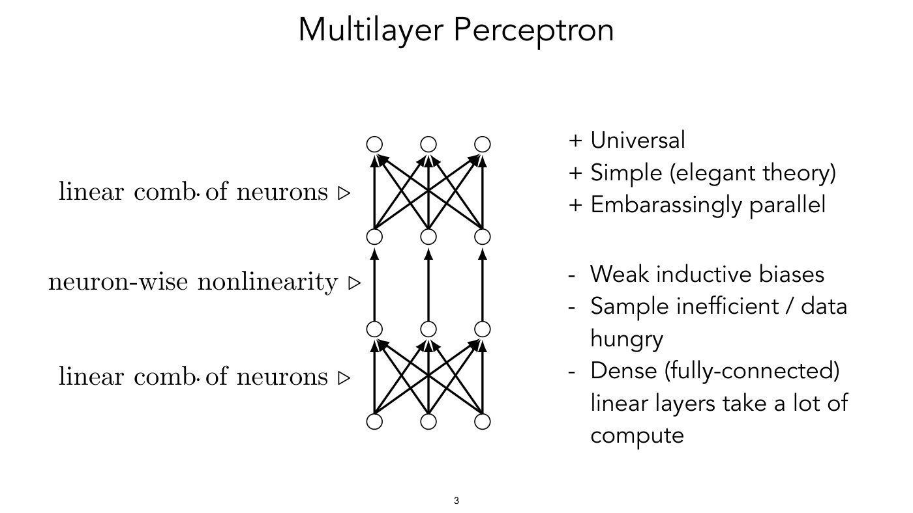

A diagram of a two-layer fully connected network drawn bottom to top as three rows of three empty circles (neurons). Between the bottom row and the second row, every bottom circle has an arrow to every circle in the second row (nine arrows, a dense crossing pattern); this is labelled on the left "linear comb. of neurons ▷" (printed "linear comb· of neurons"). Between the second row and the third row, three vertical arrows (one per neuron, no crossing) are labelled "neuron-wise nonlinearity ▷". Between the third and top rows, another dense nine-arrow pattern is labelled "linear comb. of neurons ▷".

Right-hand text, pros then cons:

- \+ Universal
- \+ Simple (elegant theory)
- \+ Embarassingly parallel (sic)
- \- Weak inductive biases
- \- Sample inefficient / data hungry
- \- Dense (fully-connected) linear layers take a lot of compute

## Slide 4 — Why use other architectures?

A square grey box labelled at top left "All mappings $\mathcal{X} \to \mathcal{Y}$". Inside it, near the bottom, a large green tilted ellipse (long axis running from upper left to lower right) labelled "Fits the data". Inside the ellipse are a green dot (the true solution), nearer the centre, and a blue cross (the learned solution), to its lower right. Legend at right: green dot "True solution", blue cross "Learned solution".

## Slide 5 — Why use other architectures?

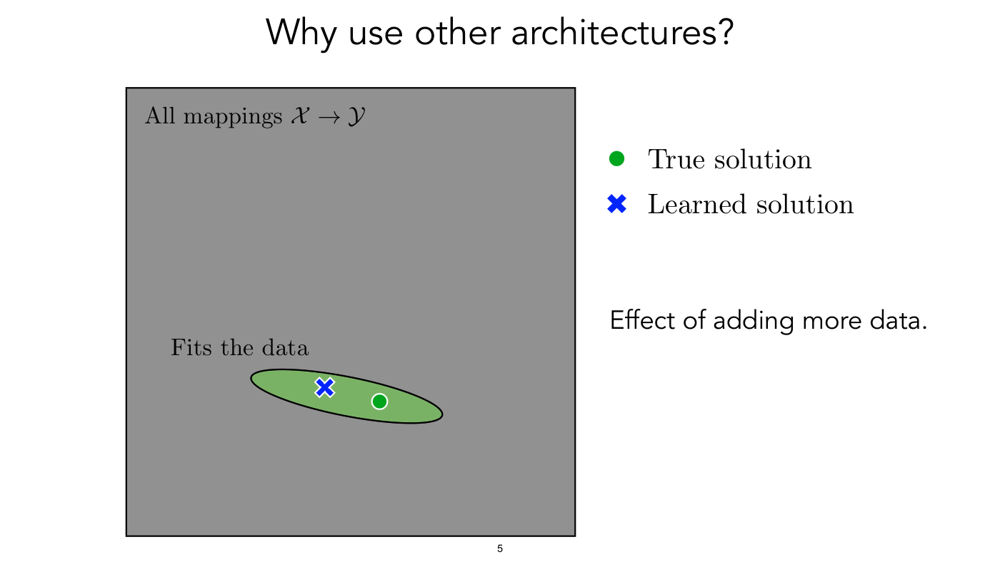

Build step: the same plot as slide 4 with more data. The green "Fits the data" ellipse is now much smaller and thinner (still tilted down to the right) and sits in the lower middle of the grey box; the green dot (true solution) and the blue cross (learned solution, now up and to the left of the dot) are both inside it, closer together than before. Legend as before, plus the text "Effect of adding more data."

## Slide 6 — Why use other architectures?

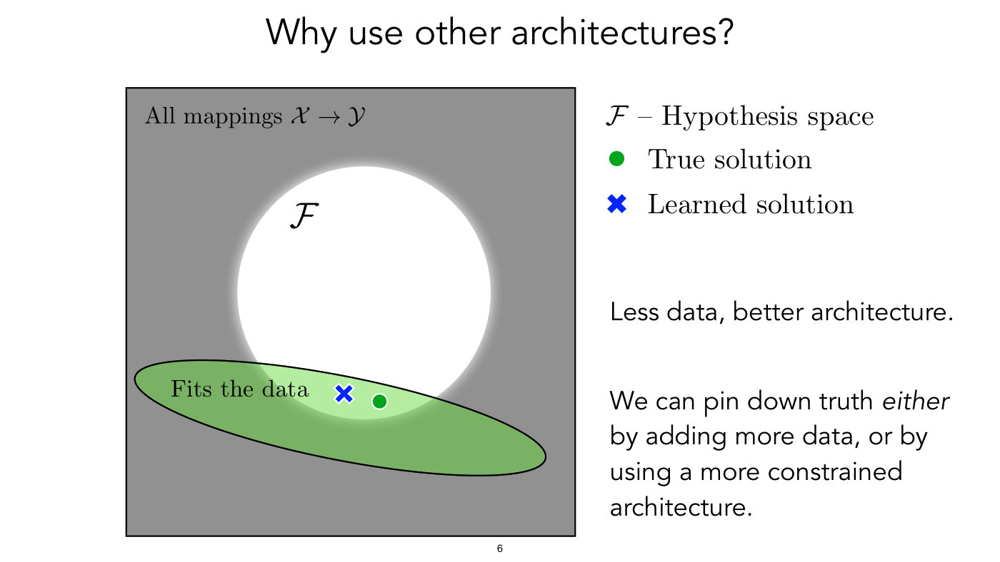

Build step: the large green "Fits the data" ellipse of slide 4 is back, and a large white-to-glowing circle is added in the upper-middle of the grey box, labelled $\mathcal{F}$. The circle overlaps the top of the green ellipse; the overlap region is a lighter green. The true-solution dot and the learned-solution cross both lie in that overlap, close together (cross at left of the dot). Right-hand text:

- $\mathcal{F}$ – Hypothesis space
- (green dot) True solution
- (blue cross) Learned solution
- "Less data, better architecture."
- "We can pin down truth *either* by adding more data, or by using a more constrained architecture."

## Slide 7 — $y = f(x)$, f: 5 layer ReLU-net

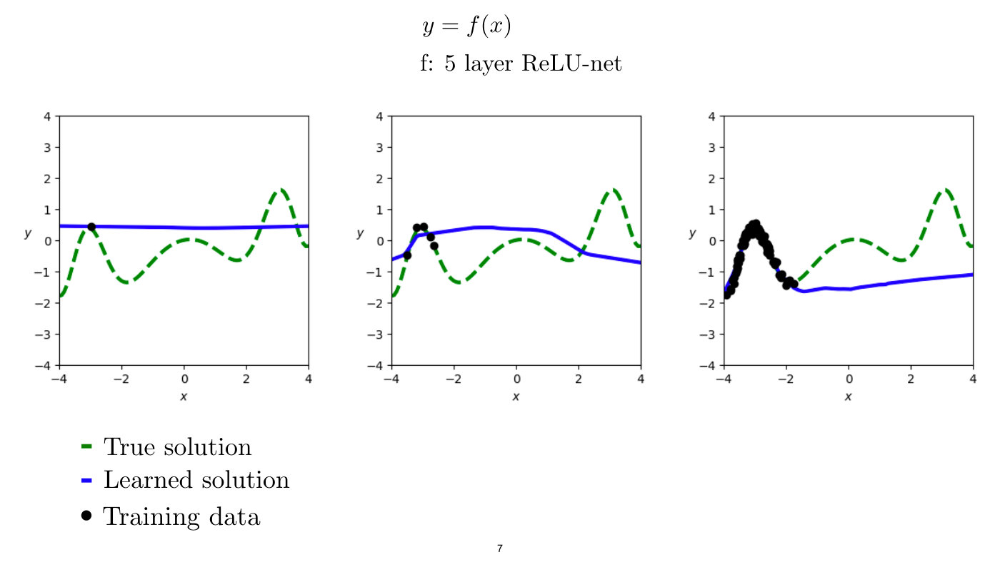

Title text: $y = f(x)$ and "f: 5 layer ReLU-net".

Three side-by-side line plots, identical axes: x from −4 to 4 (ticks −4, −2, 0, 2, 4), y from −4 to 4 (ticks −4 to 4). Each shows the same dashed green true function (a wiggly curve: starts near −1.8 at x = −4, rises to a peak of about 0.4 at x ≈ −3, falls to a trough of about −1.3 at x ≈ −2, rises to about 0 at x = 0, dips to about −0.6 at x ≈ 1.8, rises to a tall peak of about 1.6 at x ≈ 3.1, then drops to about −0.2 at x = 4). Three series per plot: dashed green "True solution", solid blue "Learned solution", black dots "Training data". The plots differ in the amount of training data:

- Left plot: one training point, at about (−3, 0.4). The blue learned curve is almost a flat line at about 0.4–0.5 across the whole range.
- Middle plot: five training points on and around the first peak, at about (−3.5, −0.47), (−3.2, 0.42), (−2.97, 0.45), (−2.76, 0.12) and (−2.64, −0.17). The blue curve starts at about −0.6 at x = −4 (where the green curve is at −1.8), meets the green curve only at the first point, reaches only about 0.15 near x = −3.2 and passes below the two peak points. It then climbs to a plateau of about 0.4 (x ≈ −1.3 to 0.8), drops to about −0.45 at x ≈ 2.2 and ends at about −0.7 at x = 4. It misses the later trough and the tall peak at x ≈ 3.
- Right plot: many (about thirty) training points densely covering the first peak and trough, from x = −4 to x ≈ −1.6. The blue curve follows the green one there, then flattens at about −1.6 near x = −1 and rises slowly and almost linearly to about −1.1 at x = 4; it misses the green curve's oscillations at x > −1.5 entirely.

Legend at bottom left: green dash "True solution", blue dash "Learned solution", black dot "Training data".

## Slide 8 — $y = ax + \sin(bx^2)$

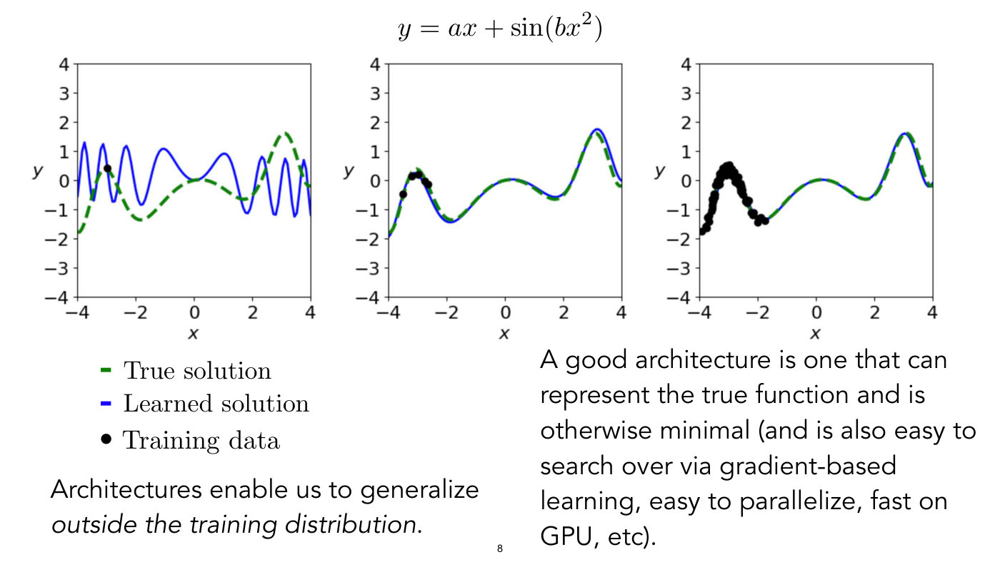

Title: $y = ax + \sin(bx^2)$.

Three side-by-side line plots with the same axes and true function (dashed green) as slide 7, now with the learned solution (solid blue) from a network whose form matches the true function.

- Left plot: one training point at about (−3, 0.4). The blue curve, which passes through the training point, is a chirp: slow near x = 0 (a shallow minimum of about 0 there) and fast toward both edges, with eight peaks, at x ≈ −3.8, −3.1, −2.3, −1.05, 1.05, 2.3, 3.1 and 3.8. Peak heights fall from about 1.3 at the left to about 0.7 at the right, and troughs deepen from about −0.7 to about −1.25. It does not follow the green curve.
- Middle plot: the same five training points as slide 7's middle plot (x ≈ −3.5 to −2.6). The blue curve now closely follows the dashed green curve over the whole range, including the tall peak (≈ 1.7) at x ≈ 3.1.
- Right plot: about thirty training points on the first peak and trough (x from −4 to −1.6). The blue and green curves are almost indistinguishable over the entire range.

Legend: green dash "True solution", blue dash "Learned solution", black dot "Training data".

Text at the bottom left: "Architectures enable us to generalize *outside the training distribution*."

Text at the bottom right: "A good architecture is one that can represent the true function and is otherwise minimal (and is also easy to search over via gradient-based learning, easy to parallelize, fast on GPU, etc)."

## Slide 9 — Preview: better architectures can approximate important function classes more efficiently.

Title: "Preview: better architectures can approximate important function classes more efficiently."

A row of six square greyscale images with column headings above each:

- "Goal: Fit this image (a function x,y —> l)" (the last character is a lowercase l, as on slides 78–79): a greyscale photograph of a man in a dark coat standing on grass behind a tripod-mounted camera, with buildings and sky behind (the standard "cameraman" test image).
- "ReLU-net": a very blurry, dark-to-mid-grey smear, black at the bottom left and lighter grey at top; no recognisable content.
- "TanH-net": an almost uniform light grey gradient, no content.
- "ReLU P.E.": a mostly black image with a grid-like pattern of white speckles and streaks; no recognisable content.
- "RBF ReLU": blotchy mid-grey cloud-like texture; no recognisable content.
- "SIREN": a nearly uniform mid-grey square; no recognisable content.

Only the first image is recognisable; the other five are the outputs of the named architectures, none of which reproduces the photograph in this frame.

Text: "(Note: this result may be due to improved approximation ability but it might also be due to improved optimization ability; these two effects are typically coupled in experiments)"

Credit: [Sitzmann\*, Martel\*, Bergman, Lindell, Wetzstein, NeurIPS 2020]

Notice printed at the bottom right: "© Sitzmann, et al. All rights reserved. This content is excluded from our Creative Commons license. For more information, see https://ocw.mit.edu/help/faq-fair-use/".

*OCW notice: © Sitzmann et al. (the image-fitting comparison figure from the SIREN paper). All rights reserved — excluded from the CC license.*

## Slide 10 — $y = f(x)$, f: 5 layer sin-net (SIREN)

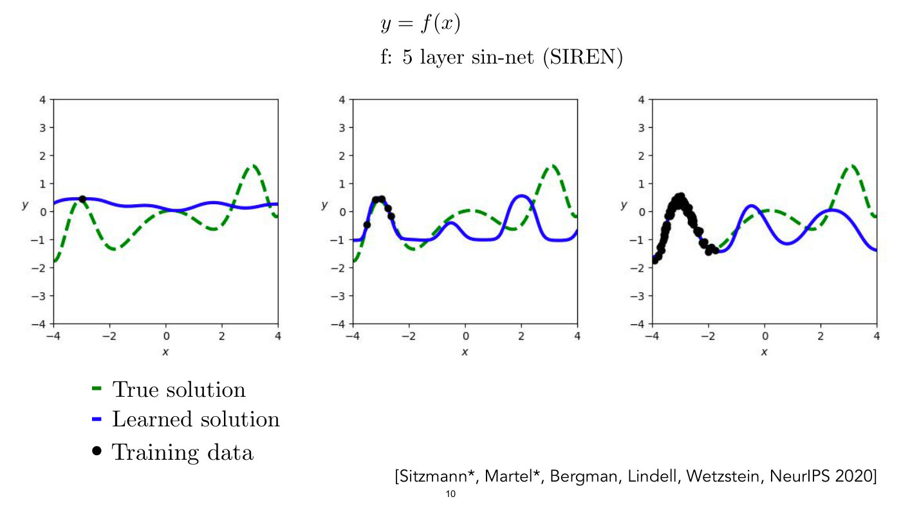

Title text: $y = f(x)$ and "f: 5 layer sin-net (SIREN)".

Same three-plot layout and the same dashed green true function as slides 7–8, x and y from −4 to 4. Series per plot: dashed green "True solution", solid blue "Learned solution", black dots "Training data".

- Left plot: one training point at about (−3, 0.4). The blue curve is a gentle low-amplitude wave staying between about 0 and 0.5 across the whole range.
- Middle plot: the same five training points as slide 7's middle plot, at x ≈ −3.5 to −2.6. The blue curve is flat at about −1 from x = −4 to −3.7, rises to fit the first peak, drops to a flat floor at about −1 (x from about −2.3 to −1.2), bumps to about −0.4 at x ≈ −0.5, returns to −1, then rises to a peak of about 0.5 at x ≈ 2 and falls back to −1 by x ≈ 3, ending near −0.7 at x = 4. It does not match the green curve beyond x ≈ −2.
- Right plot: about thirty training points at x from −4 to −1.6. The blue curve fits the training region, then wanders: peak ≈ 0.2 at x ≈ −0.5, trough ≈ −1.1 at x ≈ 0.8, a broad hump ≈ 0 at x ≈ 2.4, and falls to about −1.4 at x = 4. It does not reproduce the green curve's tall peak at x ≈ 3.1.

Legend: green dash "True solution", blue dash "Learned solution", black dot "Training data".

Credit: [Sitzmann\*, Martel\*, Bergman, Lindell, Wetzstein, NeurIPS 2020]

## Slide 11 — Convolutional Neural Networks

(Divider slide.) The slide text is only "Convolutional Neural Networks".

## Slide 12 — (photograph of birds in flight)

A full-slide photograph of eleven storks (white bodies, black wings, orange-yellow bills) flying against a clear pale blue sky. One stork is alone at the top right; a loose group of about six is at centre left, three overlapping in a clump at the far left, and three more are scattered in the lower right and bottom centre.

Credit line at bottom right: "© Fredo Durand. All rights reserved. This content is excluded from our Creative Commons license. For more information, see https://ocw.mit.edu/help/faq-fair-use/" and, below it, "Photo credit: Fredo Durand".

*OCW notice: © Fredo Durand (photograph of storks in flight). All rights reserved — excluded from the CC license.*

## Slide 13 — (image cut into patches)

The stork photograph of slide 12, shown smaller at upper left with a thick black border, overlaid by a grid of dotted lines dividing it into 8 columns by 5 rows of equal square patches (40 patches). A black scissors icon at the left edge, at the first horizontal cut line, indicates cutting. The rest of the slide is blank.

Notice below the image: "© Fredo Durand. All rights reserved. This content is excluded from our Creative Commons license. For more information, see https://ocw.mit.edu/help/faq-fair-use/".

*OCW notice: © Fredo Durand (photograph of storks, cut into a patch grid). All rights reserved — excluded from the CC license.*

## Slide 14 — (first patch cut out, to a classifier)

Build step: the same gridded stork photo as slide 13, now with the top-right patch (row 1, column 8, which contains the lone stork) outlined with a solid border as though cut out. At bottom right, a diagram: an arrow (with nothing at its tail) pointing right into a dark-grey box labelled "Classifier", then an arrow to a white box with the word "Bird" in monospace type.

Notice below the image: "© Fredo Durand. All rights reserved. This content is excluded from our Creative Commons license. For more information, see https://ocw.mit.edu/help/faq-fair-use/".

*OCW notice: © Fredo Durand (photograph of storks, cut into a patch grid). All rights reserved — excluded from the CC license.*

## Slide 15 — (patch fed to classifier; empty output grid)

Build step: the top-right patch has been removed from the photo, leaving a notch (the grid's top-right square is missing). At right, a new empty 8-by-5 grid of white cells (same shape as the patch grid). At bottom right the diagram now shows the cut-out patch (the lone stork) as a small square at the left, an arrow to the "Classifier" box, and an arrow to a "Bird" box.

Notice below the photo: "© Fredo Durand. All rights reserved. This content is excluded from our Creative Commons license. For more information, see https://ocw.mit.edu/help/faq-fair-use/".

*OCW notice: © Fredo Durand (photograph of storks, cut into a patch grid). All rights reserved — excluded from the CC license.*

## Slide 16 — (first label placed; next patch classified)

Build step: the output grid at right now has the word "Bird" (monospace) in its top-right cell (row 1, column 8). On the photo, the second patch (row 2, column 8) has been cut out (the notch is now two cells deep); the classifier diagram at bottom right now has no input image shown (just an arrow into "Classifier") and its output box reads "Sky".

Notice below the photo: "© Fredo Durand. All rights reserved. This content is excluded from our Creative Commons license. For more information, see https://ocw.mit.edu/help/faq-fair-use/".

*OCW notice: © Fredo Durand (photograph of storks, cut into a patch grid). All rights reserved — excluded from the CC license.*

## Slide 17 — (completed patch-label grid)

Build step: the photo with its 8-by-5 dotted grid is restored whole at left. At right the 8-by-5 grid of labels is complete (rows top to bottom, columns left to right):

| Row | c1 | c2 | c3 | c4 | c5 | c6 | c7 | c8 |
| --- | --- | --- | --- | --- | --- | --- | --- | --- |
| 1 | Sky | Sky | Sky | Sky | Sky | Sky | Sky | Bird |
| 2 | Sky | Sky | Sky | Sky | Sky | Sky | Sky | Sky |
| 3 | Sky | Sky | Sky | Sky | Sky | Sky | Sky | Sky |
| 4 | Bird | Bird | Bird | Sky | Bird | Sky | Sky | Sky |
| 5 | Sky | Sky | Sky | Bird | Sky | Sky | Sky | Sky |

Notice below the photo: "© Fredo Durand. All rights reserved. This content is excluded from our Creative Commons license. For more information, see https://ocw.mit.edu/help/faq-fair-use/".

*OCW notice: © Fredo Durand (photograph of storks, cut into a patch grid). All rights reserved — excluded from the CC license.*

## Slide 18 — Problem: what if objects don't fit neatly into these patches?

The gridded stork photo (8 by 5 dotted grid) at left, an arrow into a grey trapezoid labelled "CNN" (wider on the left, narrower on the right), and an arrow into a coloured 8-by-5 output grid. Cells labelled "sky" (monospace, lower case) have a blue-grey fill; cells labelled "bird" have a pale cream fill:

| Row | c1 | c2 | c3 | c4 | c5 | c6 | c7 | c8 |
| --- | --- | --- | --- | --- | --- | --- | --- | --- |
| 1 | sky | sky | sky | sky | sky | sky | sky | bird |
| 2 | sky | sky | sky | sky | sky | sky | sky | sky |
| 3 | sky | sky | sky | sky | sky | sky | sky | sky |
| 4 | bird | bird | bird | bird | sky | bird | sky | sky |
| 5 | sky | sky | sky | bird | bird | sky | sky | sky |

(This printed map differs slightly from slide 17's: in row 4 it has "bird" at columns 1–4 and 6 and "sky" at column 5, and in row 5 it has "bird" at columns 4 and 5.)

Text below:

**Problem:**

What if objects don't fit neatly into these patches?

How to increase the resolution of the output map?

Notice below the photo: "© Fredo Durand. All rights reserved. This content is excluded from our Creative Commons license. For more information, see https://ocw.mit.edu/help/faq-fair-use/".

*OCW notice: © Fredo Durand (photograph of storks, with CNN patch-label output). All rights reserved — excluded from the CC license.*

## Slide 19 — Smaller patches

The stork photo, now overlaid with a finer dotted grid (about 16 columns by 10 rows) of small patches. Text: "Smaller patches increase resolution, but not easy to recognize content in small each patch" (sic, as printed) and "Instead: we will use large but *overlapping* patches".

Notice below the photo: "© Fredo Durand. All rights reserved. This content is excluded from our Creative Commons license. For more information, see https://ocw.mit.edu/help/faq-fair-use/".

*OCW notice: © Fredo Durand (photograph of storks, finer patch grid). All rights reserved — excluded from the CC license.*

## Slide 20 — What's the object class of the center pixel?

The stork photo at left (no grid) with a small vertical stack of four overlapping horizontal bands marked on the lone stork at the top right (a column of box outlines of increasing offset, as if a window sliding down by one pixel at a time). Four black lines fan out from the right edge of that region to four small square crops at right, each a patch around the lone stork, shifted down by one step each time. In each crop a small red square marks the centre pixel, which moves down the stork's body and then off it. Each crop has a block arrow labelled $f$ to its right, and an output box: top crop "Bird", second "Bird", third "Sky", fourth "Sky". Heading text at upper right: "What's the object class of the center pixel?"

Notice below the photo: "© Fredo Durand. All rights reserved. This content is excluded from our Creative Commons license. For more information, see https://ocw.mit.edu/help/faq-fair-use/".

*OCW notice: © Fredo Durand (photograph of storks, sliding-window crops). All rights reserved — excluded from the CC license.*

## Slide 21 — What's the object class of the center pixel? (training data)

Build step on slide 20: the same sliding-window picture (stork photo at left with the stack of window outlines at the top right, four crops at right each with a red centre-pixel square, block arrow $f$, and outputs "Bird", "Bird", "Sky", "Sky"; heading "What's the object class of the center pixel?"). A white panel titled "*Training data*" is now overlaid on the lower left of the photo. Its column headings are $\mathbf{x}$ and $y$. Three rows are shown, each written as a pair in curly braces: (a crop of the lone stork, "Bird"), (a similar crop, "Bird"), (a crop with the stork higher up and the lower part blank sky, "Sky"), followed by a vertical ellipsis (⋮).

Notice at the bottom left: "© Fredo Durand. All rights reserved. This content is excluded from our Creative Commons license. For more information, see https://ocw.mit.edu/help/faq-fair-use/".

*OCW notice: © Fredo Durand (photograph of storks, sliding-window crops and training pairs). All rights reserved — excluded from the CC license.*

## Slide 22 — This problem is called semantic segmentation

The stork photo (left, with a small stack of dotted window outlines drawn at its top-left corner and a vertical ellipsis beneath them) goes by an arrow into a grey trapezoid labelled "CNN" (wide on the left, narrow on the right), then by an arrow into an output image of the same size. The output image is a flat blue-grey field with each stork's silhouette filled in cream white (eleven silhouettes in the same positions as the storks in the input). Caption under the output: "(Colors represent one-hot codes)". Text below: "This problem is called **semantic segmentation**".

Notice below the input photo: "© Fredo Durand. All rights reserved. This content is excluded from our Creative Commons license. For more information, see https://ocw.mit.edu/help/faq-fair-use/".

*OCW notice: © Fredo Durand (photograph of storks used as segmentation input). All rights reserved — excluded from the CC license.*

## Slide 23 — Translation invariance: process each patch in the same way.

Upper part as slide 20: the stork photo with window outlines at the top right, four centre-pixel crops, block arrows $f$, and outputs Bird, Bird, Sky, Sky, under the heading "What's the object class of the center pixel?". Added: at the bottom left, a small version of the whole stork photo, a block arrow labelled $f$, and a small output image with a bright cyan-blue background and the stork silhouettes in white. Text at the lower right: "Translation invariance: process each patch in the same way." Text at the bottom left: "An *equivariant* mapping:" followed by

$$f(\texttt{translate}(x)) = \texttt{translate}(f(x))$$

Notice below the large photo: "© Fredo Durand. All rights reserved. This content is excluded from our Creative Commons license. For more information, see https://ocw.mit.edu/help/faq-fair-use/".

*OCW notice: © Fredo Durand (photograph of storks, patch classification and equivariance sketch). All rights reserved — excluded from the CC license.*

## Slide 24 — W computes a weighted sum of all pixels in the patch

Title (top right), as printed: $\mathbf{W}$ computes a weighted sum of all pixels in the patch. At the top right, a small diagram: three empty circles stacked vertically at the left, lines from each into a square box labelled $\mathbf{w}$, and three lines from the box converging onto a single empty circle at the right. At the left, three square crops of the stork (each shifted slightly down from the previous one: the stork is high in the first, lower in the others, with more blank sky beneath it in the lower crops). Each crop has an arrow labelled $\mathbf{W}$ pointing right to a filled circle; the circles' greys are, top to bottom, dark grey, mid grey, light grey. On the right, as printed: $\mathbf{W}$ is a **convolutional kernel** applied to the full image!

Notice at the bottom left: "© Fredo Durand. All rights reserved. This content is excluded from our Creative Commons license. For more information, see https://ocw.mit.edu/help/faq-fair-use/".

*OCW notice: © Fredo Durand (photograph of a stork, three crops). All rights reserved — excluded from the CC license.*

## Slide 25 — Convolution

Title "Convolution"; subtitle "Linear, shift-invariant transformation".

At left, a photograph of a clown fish (orange body with white stripes, on a dark-blue background), with a small grey square image in its top-left corner showing the filter (a vertically elongated blurry dark-and-light blob, a vertical-edge detector). An arrow points right to the filtered output: a mid-grey image in which only the edges of the fish's stripes and fins appear as thin light and dark lines (a vertical-edge-filter response). Below, the word "filter" and a larger version of the filter image: a grey square with a dark vertical streak at the centre-left and a light vertical streak on its right, with faint side lobes. The filter therefore responds to edges that run vertically: in the output, the left and right edges of the three white stripes, the sides of the eye ring and the vertical fin edges are bright or dark, while the near-horizontal top and bottom outlines of the body are faint. (In the recording the lecturer calls these "horizontal edges between dark and light values", ≈23:05.) Equation (the subscripts "out" and "in" are set in typewriter type, here and on later slides):

$$x_{\text{out}}[n, m] = b + \sum_{k_1, k_2 = -K}^{K} w[k_1, k_2] \thinspace x_{\text{in}}[n + k_1, m + k_2]$$

Notice at the left: "© source unknown. All rights reserved. This content is excluded from our Creative Commons license. For more information, see https://ocw.mit.edu/help/faq-fair-use/".

*OCW notice: © source unknown (clown fish photograph). All rights reserved — excluded from the CC license.*

## Slide 26 — Fully-connected network

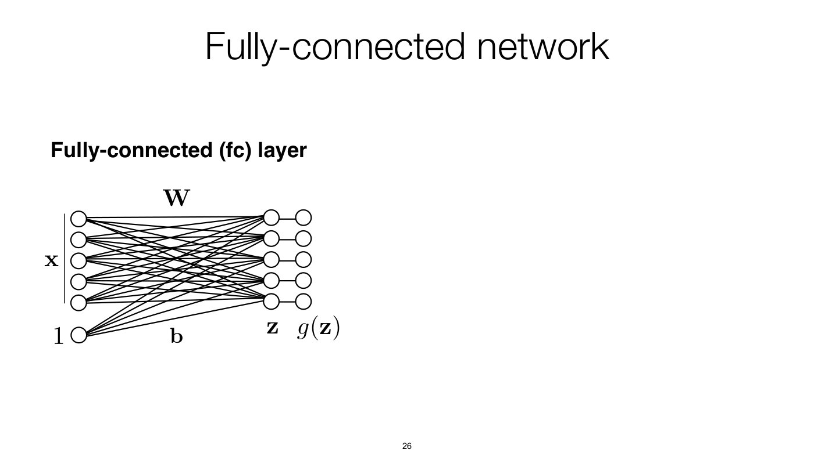

Subtitle: "Fully-connected (fc) layer". Diagram: a column of five empty circles at the left labelled $\mathbf{x}$ (with a vertical bar beside them), plus a sixth circle below them labelled "1" (the bias input). Every one of the five inputs, and the "1" circle, connects by lines to every one of five circles in a middle column labelled $\mathbf{z}$ (dense crossing lines; the weight lines are labelled $\mathbf{W}$ above and the lines from the "1" circle are labelled $\mathbf{b}$ below). Each $\mathbf{z}$ circle has a short horizontal line to a circle in a right-hand column, labelled $g(\mathbf{z})$.

## Slide 27 — Locally connected network

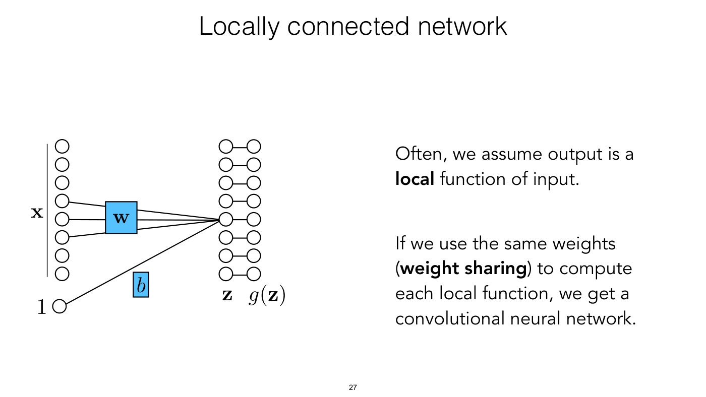

Diagram: a column of eight empty circles labelled $\mathbf{x}$ (vertical bar at the left), and below them a circle labelled "1". Beside it, a column of eight empty circles labelled $\mathbf{z}$, each joined by a short horizontal line to a circle in a further column labelled $g(\mathbf{z})$. Only one $\mathbf{z}$ circle (the fifth from the top) is connected to the input: lines from the fourth, fifth and sixth input circles pass through a blue square labelled $\mathbf{w}$ to the fifth $\mathbf{z}$ circle, and a line from the "1" circle passes through a small blue square labelled $b$ to it.

Text at right: "Often, we assume output is a **local** function of input." and "If we use the same weights (**weight sharing**) to compute each local function, we get a convolutional neural network."

## Slide 28 — Convolutional neural network

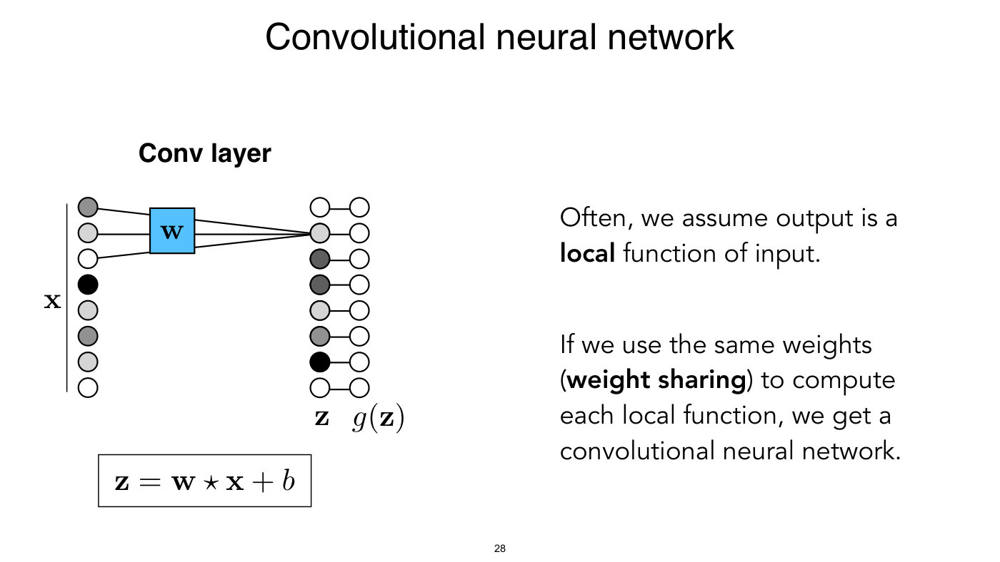

Subtitle: "Conv layer". Same column layout as slide 27, but now with filled circles showing example activations (greyscale shades). The eight inputs $\mathbf{x}$, top to bottom: mid grey, light grey, white, black, light grey, mid grey, light grey, white. The eight $\mathbf{z}$ circles, top to bottom: white, light grey, dark grey, dark grey, light grey, mid grey, black, white. The $g(\mathbf{z})$ column circles are all white (not yet computed). A blue box $\mathbf{w}$ connects the first three inputs to the second $\mathbf{z}$ circle. The bias circle is no longer shown. Boxed equation:

$$\mathbf{z} = \mathbf{w} \star \mathbf{x} + b$$

Text at right, as on slide 27: "Often, we assume output is a **local** function of input." and "If we use the same weights (**weight sharing**) to compute each local function, we get a convolutional neural network."

## Slide 29 — Weight sharing

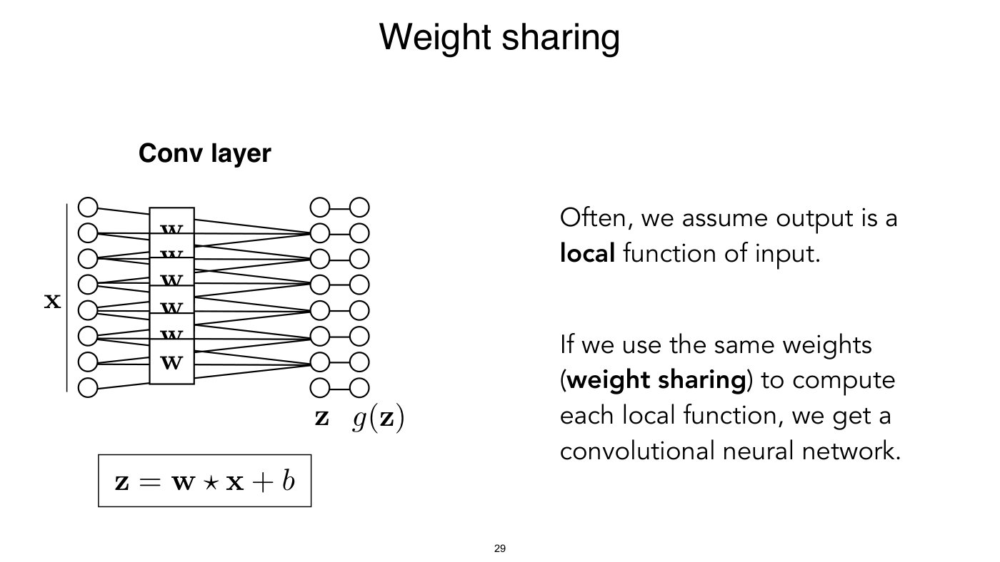

Subtitle: "Conv layer". Eight empty input circles $\mathbf{x}$ and eight empty $\mathbf{z}$ circles (each joined to a $g(\mathbf{z})$ circle), as on slide 28. Now every interior $\mathbf{z}$ circle is connected to the three neighbouring inputs by lines, drawn through a stack of overlapping blue-outlined boxes each labelled $\mathbf{w}$ (six boxes, offset downward and overlapping so only the last is fully visible), showing that the same $\mathbf{w}$ is reused at every position. Boxed equation:

$$\mathbf{z} = \mathbf{w} \star \mathbf{x} + b$$

Right-hand text as on slides 27–28.

## Slide 30 — (Fully-connected) linear layer

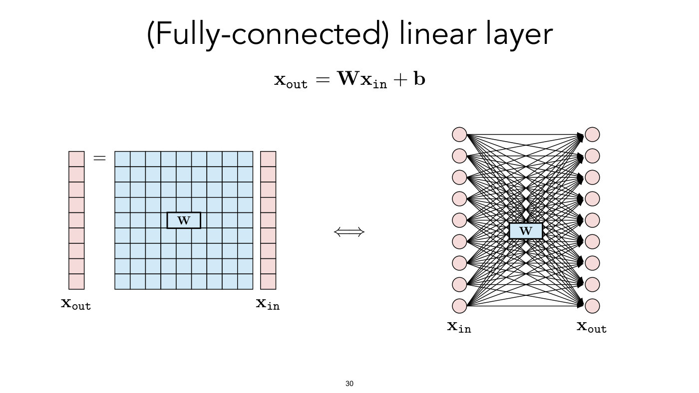

Equation: $\mathbf{x}_ {\text{out}} = \mathbf{W} \mathbf{x}_ {\text{in}} + \mathbf{b}$.

At left: a matrix-vector product drawn as boxes. A tall pink column $\mathbf{x}_ {\text{out}}$ (nine cells), an equals sign, a 9-by-9 grid of light-blue cells (all the same colour) with a box in the middle labelled $\mathbf{W}$, and a tall pink column $\mathbf{x}_ {\text{in}}$ (nine cells). A double-headed arrow ⟺ leads to the same layer drawn as a network on the right: nine pink circles $\mathbf{x}_ {\text{in}}$ at the left, nine pink circles $\mathbf{x}_ {\text{out}}$ at the right, every input connected to every output by arrows (a dense crossing bundle), with a box labelled $\mathbf{W}$ in the middle.

## Slide 31 — Convolutional layer

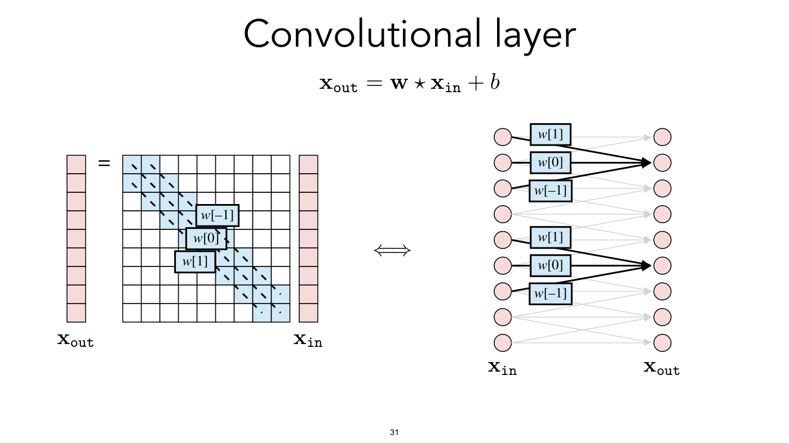

Equation: $\mathbf{x}_ {\text{out}} = \mathbf{w} \star \mathbf{x}_ {\text{in}} + b$.

At left: a pink column $\mathbf{x}_ {\text{out}}$ (nine cells), an equals sign, a 9-by-9 grid whose only coloured (light-blue) cells lie on the main diagonal and the two diagonals next to it (a tri-diagonal band, with dashed lines drawn along the three diagonals; the rest of the grid is white), and a pink column $\mathbf{x}_ {\text{in}}$. Three boxes label the band's diagonals near the centre: $w[-1]$ (the upper diagonal), $w[0]$ (the main diagonal) and $w[1]$ (the lower diagonal). A double-headed arrow ⟺ leads to the network view on the right: nine pink circles $\mathbf{x}_ {\text{in}}$ and nine pink circles $\mathbf{x}_ {\text{out}}$ connected only locally, each output joined to three neighbouring inputs. Two outputs (the second and the sixth from the top) are highlighted, with bold black arrows from their three input neighbours labelled with boxes $w[1]$ (top), $w[0]$ (middle), $w[-1]$ (bottom); all other connections are faint grey. This shows the same three weights used at both highlighted positions.

## Slide 32 — Toeplitz matrix

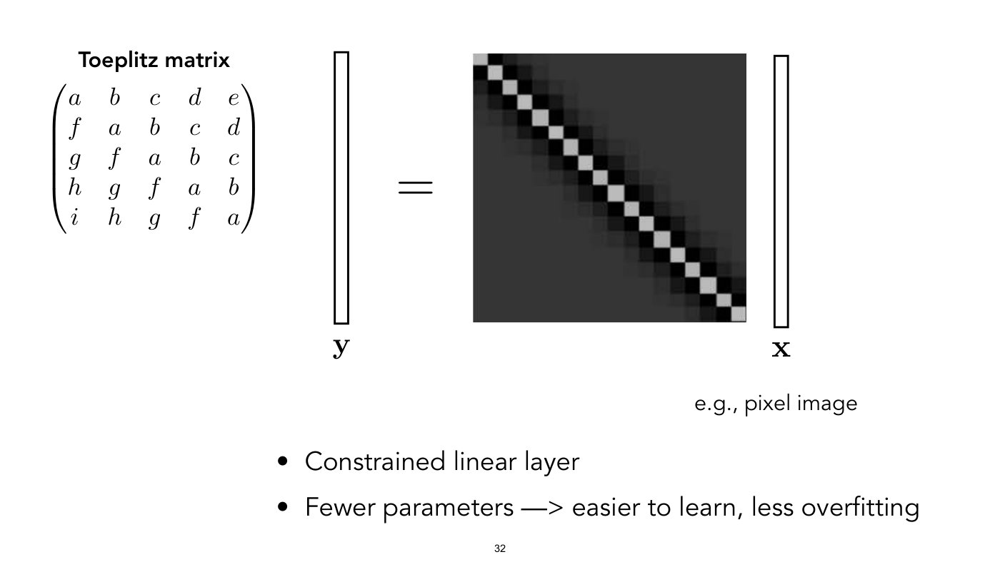

At the upper left, the heading "Toeplitz matrix" and a $5 \times 5$ matrix:

$$\begin{pmatrix} a & b & c & d & e \cr f & a & b & c & d \cr g & f & a & b & c \cr h & g & f & a & b \cr i & h & g & f & a \end{pmatrix}$$

At the right, a matrix-vector product drawn as pictures: a tall white column labelled $\mathbf{y}$, an equals sign, a square greyscale image of a large banded matrix, and a tall white column labelled $\mathbf{x}$ with the caption "e.g., pixel image". The matrix image is dark grey everywhere except a narrow diagonal band from top left to bottom right: the main diagonal is light grey, the cells beside it are black, and those fade back into the dark-grey background further from the diagonal (a centre-surround pattern). The matrix is drawn as 18 × 18 cells.

Bullets: "Constrained linear layer"; "Fewer parameters —> easier to learn, less overfitting".

## Slide 33 — (banded matrix, no text)

Build step: the same product picture as slide 32 without the Toeplitz matrix or the bullets: a tall white column labelled $\mathbf{y}$, an equals sign, the greyscale diagonal-band matrix image (light-grey main diagonal, black neighbouring diagonals, faint halo, dark-grey background) and a tall white column labelled $\mathbf{x}$.

## Slide 34 — Conv layers can be applied to arbitrarily-sized inputs

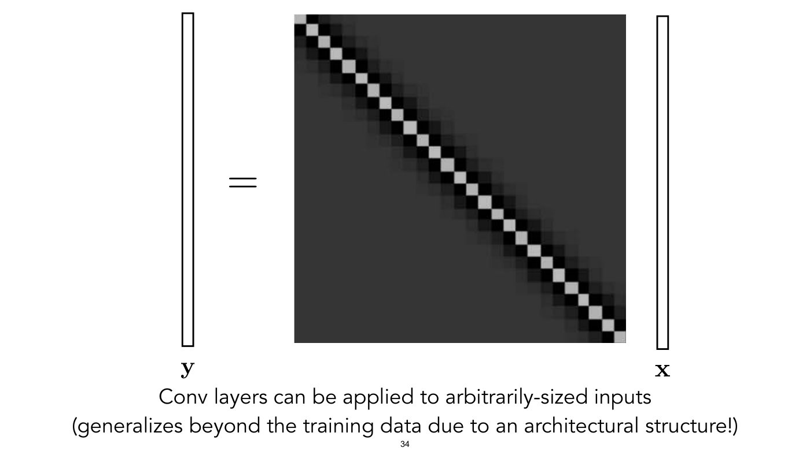

Build step: the same picture as slide 33, drawn larger and with a larger band matrix (more diagonal cells). Text at the bottom: "Conv layers can be applied to arbitrarily-sized inputs (generalizes beyond the training data due to an architectural structure!)".

## Slide 35 — (filter responses on three photos)

On the left, three colour photographs: a colourful (teal, orange and green) chameleon on a plant against a green background; a brown bear cub standing upright; and the clown fish photograph from slide 25 (cropped wider). An arrow points right to three greyscale filtered versions of the same images in the same layout: the chameleon, bear and clown fish each shown as a mid-grey image where only edge-like detail appears (outlines of scales, fur and stripes as thin light and dark lines).

Notice at the left: "Images © source unknown. All rights reserved. This content is excluded from our Creative Commons license. For more information, see https://ocw.mit.edu/help/faq-fair-use/".

*OCW notice: © source unknown (chameleon, bear and clown fish photographs and their filtered versions). All rights reserved — excluded from the CC license.*

## Slide 36 — Five views on convolutional layers

Numbered list:

1. Equivariant with translation — with the equation $f(\texttt{translate}(x)) = \texttt{translate}(f(x))$
2. Patch processing
3. Image filter — beside a small picture of the filtered clown fish (a grey edge-response image)
4. Parameter sharing — beside a small copy of the weight-sharing diagram of slide 29 (eight inputs, eight outputs, overlapping boxes labelled $\mathbf{w}$)
5. A way to process variable-sized tensors

## Slide 37 — What happens when you stack convolutional layers?

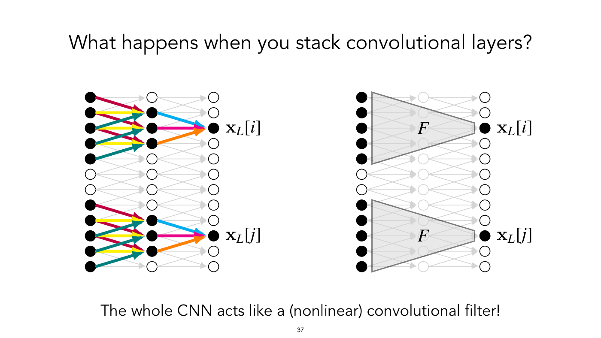

Title: "What happens when you stack convolutional layers?"

Two diagrams side by side, each with three columns of twelve circles (input, hidden, output layers). Left: the connections between layers are drawn as faint grey arrows (each node connects to its three neighbours in the next layer), with a coloured set highlighted for two output nodes. For the output node labelled $\mathbf{x}_ L[i]$ (third from the top, filled black), three hidden nodes feed it with a blue, a magenta and an orange arrow; those three hidden nodes are fed by five filled-black input nodes through red, yellow and teal arrows (so the output depends on a window of five input nodes). The same pattern repeats lower down for the output node labelled $\mathbf{x}_ L[j]$ (row 10 of 12, third from the bottom), fed by hidden nodes in rows 9–11, which are fed by the five black input nodes in rows 8–12. Right: the same network, with each highlighted region replaced by a light-grey trapezoid labelled $F$ (wide at the left covering the five input nodes, narrow at the right at the output node), once for $\mathbf{x}_ L[i]$ and once for $\mathbf{x}_ L[j]$, drawn over the faded network. Caption at the bottom: "The whole CNN acts like a (nonlinear) convolutional filter!"

## Slide 38 — What if we have color?

Text: "What if we have color?" and "(aka multiple input channels?)". (Divider-style slide.)

## Slide 39 — Multichannel inputs

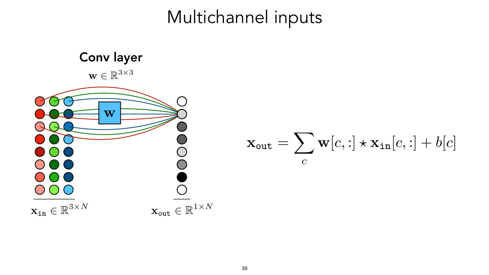

Subtitle "Conv layer"; above the diagram, $\mathbf{w} \in \mathbb{R}^{3 \times 3}$. At left, three columns of eight circles: a red column, a green column and a blue column (each circle a different shade of its colour), together labelled $\mathbf{x}_ {\text{in}} \in \mathbb{R}^{3 \times N}$. A blue box labelled $\mathbf{w}$ sits in the middle. Coloured curves (red, green, blue) from three adjacent circles in each of the red, green and blue columns converge on a single circle (only the three curves from the middle row of the triple pass through the box; the others arc over and under it), (the second from the top) in a single column of eight greyscale circles at the right, labelled $\mathbf{x}_ {\text{out}} \in \mathbb{R}^{1 \times N}$ (greys top to bottom: white, light grey, dark grey, dark grey, light grey, mid grey, black, white). Equation:

$$\mathbf{x}_ {\text{out}} = \sum_{c} \mathbf{w}[c, :] \star \mathbf{x}_ {\text{in}}[c, :] + b[c]$$

## Slide 40 — Multichannel outputs

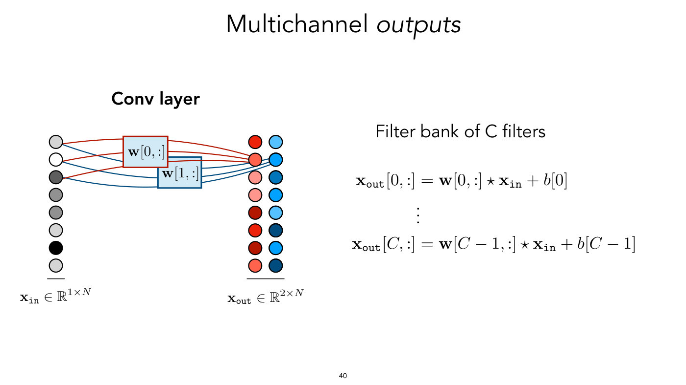

Title: "Multichannel *outputs*" (the word "outputs" in italics). Subtitle "Conv layer"; text "Filter bank of C filters". At left, a single column of eight greyscale circles, labelled $\mathbf{x}_ {\text{in}} \in \mathbb{R}^{1 \times N}$. A red-outlined box $\mathbf{w}[0, :]$ and a blue-outlined box $\mathbf{w}[1, :]$ sit in the middle. Red curves from three adjacent input circles pass through $\mathbf{w}[0, :]$ to one circle in a column of eight red-shaded circles, and blue curves through $\mathbf{w}[1, :]$ to one circle in a neighbouring column of eight blue-shaded circles (both fans end at the second circle of their column); the two columns together are labelled $\mathbf{x}_ {\text{out}} \in \mathbb{R}^{2 \times N}$. Equations:

$$\mathbf{x}_ {\text{out}}[0, :] = \mathbf{w}[0, :] \star \mathbf{x}_ {\text{in}} + b[0]$$

$$\vdots$$

$$\mathbf{x}_ {\text{out}}[C, :] = \mathbf{w}[C - 1, :] \star \mathbf{x}_ {\text{in}} + b[C - 1]$$

(the last line is printed with $\mathbf{x}_ {\text{out}}[C, :]$ on the left and $C - 1$ on the right, as shown.)

## Slide 41 — General Convolutional Layer Form: Multi-Input, Multi-Output

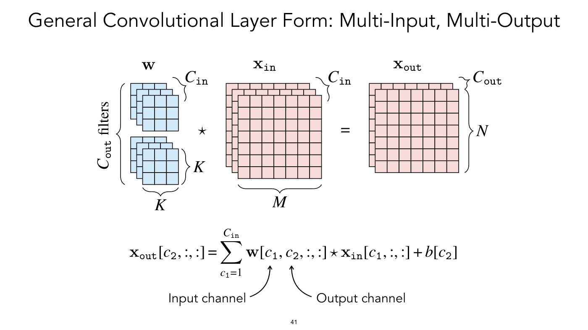

A tensor diagram of $\mathbf{w} \star \mathbf{x}_ {\text{in}} = \mathbf{x}_ {\text{out}}$ drawn with stacked grids. At left, the filter bank $\mathbf{w}$: two groups of three stacked light-blue $3 \times 3$ grids (the upper group's stack depth is labelled $C_{\text{in}}$ with a brace; the lower group's side is labelled $K$ along the bottom and right), and a large brace on the left spanning both groups, with the label $C_{\text{out}}$ filters printed rotated vertically beside it. A star $\star$ follows, then $\mathbf{x}_ {\text{in}}$: a stack of three pink grids (depth brace labelled $C_{\text{in}}$, width brace along the bottom labelled $M$), then an equals sign, then $\mathbf{x}_ {\text{out}}$: a stack of two pink grids (depth brace labelled $C_{\text{out}}$, height brace at the right labelled $N$).

Equation, with arrows labelling $c_1$ as "Input channel" and $c_2$ as "Output channel":

$$\mathbf{x}_ {\text{out}}[c_2, :, :] = \sum_{c_1 = 1}^{C_{\text{in}}} \mathbf{w}[c_1, c_2, :, :] \star \mathbf{x}_ {\text{in}}[c_1, :, :] + b[c_2]$$

## Slide 42 — (a bank of 2 filters producing 2 feature maps)

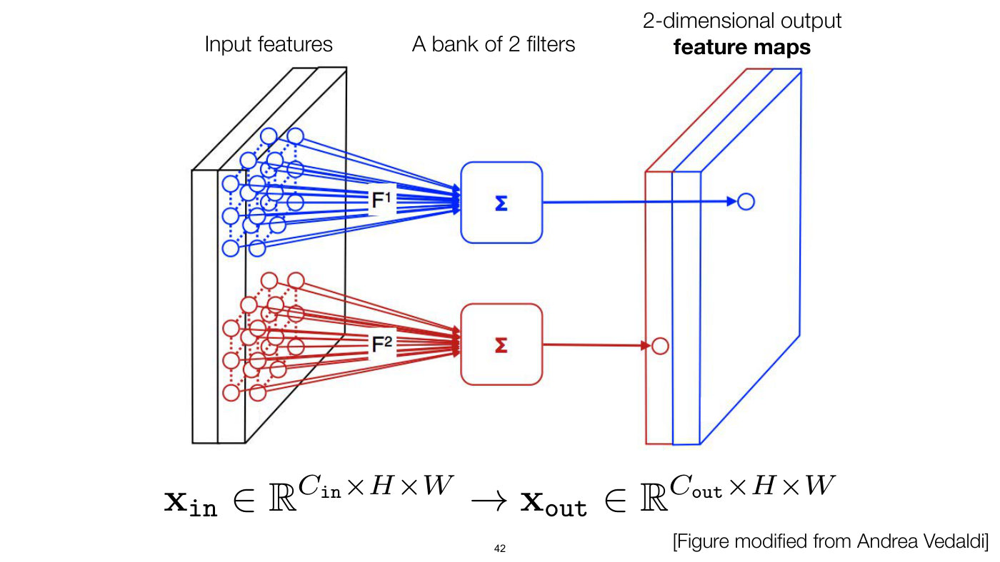

Column headings: "Input features", "A bank of 2 filters", and "2-dimensional output **feature maps**". At left, a thick slab (a stack of two feature-map sheets drawn in perspective, outlined in black). On the slab, two small groups of nodes are drawn: a blue group of about nine circles near the top (a $3 \times 3$ patch through both sheets, joined by dotted lines) and a red group of the same shape near the bottom. All of the blue circles send blue lines to a label "F¹" and on into a rounded blue box containing a blue sigma "Σ"; a single blue arrow leads from the box to one circle on the blue (back) sheet of the output slab at right. All of the red circles likewise go through "F²" into a rounded red box with a red "Σ", and a red arrow leads to one circle on the red (front) sheet of the output slab. The output is a slab of two sheets outlined in red and blue.

Equation under the figure:

$$\mathbf{x}_ {\text{in}} \in \mathbb{R}^{C_{\text{in}} \times H \times W} \to \mathbf{x}_ {\text{out}} \in \mathbb{R}^{C_{\text{out}} \times H \times W}$$

Credit at the bottom right: [Figure modified from Andrea Vedaldi]

## Slide 43 — Feature maps

At left, the label "Input" and a photograph of a grey heron-like bird with a spiky crest, bending forward and walking over dark ground with a blurred green background. Notice: "Image © Fredo Durand. All rights reserved. This content is excluded from our Creative Commons license. For more information, see https://ocw.mit.edu/help/faq-fair-use/".

At right, two mosaics of greyscale feature maps. The upper, headed "conv1 (after first conv layer)", is a grid of 4 rows by 16 columns (64 small black tiles). Most tiles are nearly black with thin bright edge traces of the bird or ground; a few tiles (for example row 1 column 9, row 2 column 6, row 3 columns 4, 6 and 9, row 4 column 6) show a clearer grey silhouette of the bird. The lower, headed "conv2 (after second conv layer)", is a grid of 6 rows by about 27 columns of smaller black tiles with scattered bright blobs and fragments; no tile shows a clear bird.

Bullets: "Each layer can be thought of as a set of C **feature maps** aka **channels**"; "Each feature map is an NxM image".

*OCW notice: © Fredo Durand (photograph of the heron). All rights reserved — excluded from the CC license.*

## Slide 44 — Multiple channels: Example

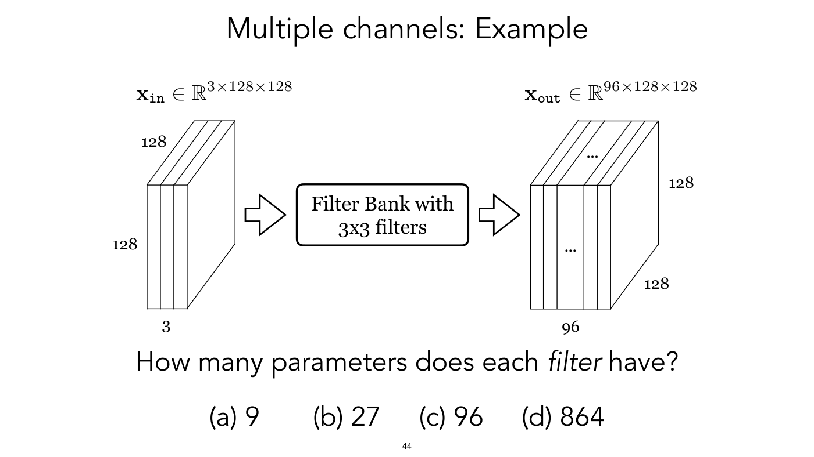

Two-part tensor picture. At left, a thin slab of three sheets, with side labels 128 (depth), 128 (height) and 3 (channels), captioned above as $\mathbf{x}_ {\text{in}} \in \mathbb{R}^{3 \times 128 \times 128}$. A block arrow leads to a rounded box "Filter Bank with 3x3 filters", then a block arrow to a thick slab of many sheets (with "..." marks) with side labels 128, 128 and 96, captioned $\mathbf{x}_ {\text{out}} \in \mathbb{R}^{96 \times 128 \times 128}$.

Question: "How many parameters does each *filter* have?" Choices: (a) 9  (b) 27  (c) 96  (d) 864.

## Slide 45 — Multiple channels: Example

Build step: the same figure and shapes as slide 44. The question is now "How many filters are in the bank?" Choices: (a) 3  (b) 27  (c) 96  (d) can't say.

## Slide 46 — Filter sizes

Text, with equations: "When mapping from"

$$\mathbf{x}_ l \in \mathbb{R}^{C_l \times N \times M} \to \mathbf{x}_ {(l+1)} \in \mathbb{R}^{C_{(l+1)} \times N \times M}$$

"using an filter of spatial extent $K_1 \times K_2$" (sic, "an filter" as printed).

"Number of parameters per filter: $K_1 \times K_2 \times C_l$"

"Number of filters: $C_{(l+1)}$"

## Slide 47 — (RGB input to layer 1 and layer 2 feature maps)

A three-stage diagram of a CNN's first two layers, left to right, on pink panels.

- Left panel, "Input image (RGB)" with shape $[H \times W \times 3]$: three stacked greyscale copies of the heron photograph, labelled R, G and B at the left edge and bracketed "3 channels", all inside an orange dashed outline.
- An arrow runs right to the middle panel, "Layer 1 feature maps" with shape $[H/4 \times W/4 \times C_1]$: a tall column of small black-and-white feature-map tiles bracketed with the label $C_1$ channels, with a green dotted outline around the whole column and an orange dashed outline around the second tile. Below the arrow, a brace points to a pale-blue box "Layer 1 filters (4x zoom)": three small greyscale filter patches stacked vertically, labelled R, G, B (bracketed "3 channels"), in several columns with "..." between them, the second column outlined in orange dashed, the last showing diagonal stripe patterns; the row of columns is bracketed with the label $C_1$ filters.
- A second arrow runs right to the right-hand panel, "Layer 2 feature maps" with shape $[H/8 \times W/8 \times C_2]$: a tall column of bright-on-black tiles bracketed with the label $C_2$ channels, one tile outlined in green dotted, and an arrow continuing right to "...". Below the second arrow, a brace points to a pale-blue box "Layer 2 filters (4x zoom)": columns of small filter patches, each column of $C_1$ patches (bracketed with the label $C_1$ channels), the third column outlined in green dotted, with "..." between columns and a bracket labelled $C_2$ filters bracket.

Notice at the bottom: "Image © Fredo Durand. All rights reserved. This content is excluded from our Creative Commons license. For more information, see https://ocw.mit.edu/help/faq-fair-use/".

*OCW notice: © Fredo Durand (heron photograph, shown as R, G, B channels and feature maps). All rights reserved — excluded from the CC license.*

## Slide 48 — Pooling

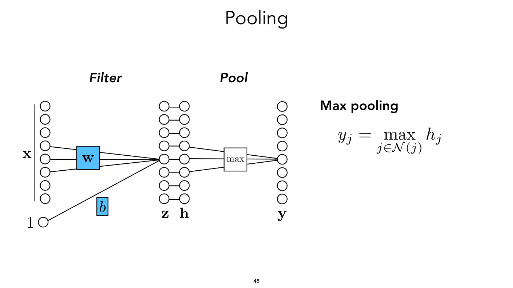

Diagram with headings "*Filter*" and "*Pool*". At left a column of eight empty circles $\mathbf{x}$ plus a "1" bias circle; a blue box $\mathbf{w}$ connects three adjacent inputs (rows 4–6) to the fifth circle of the $\mathbf{z}$ column (eight empty circles, each joined by a short horizontal line to a circle in the $\mathbf{h}$ column), and a small blue box $b$ marks the bias line from "1". From three adjacent circles of the $\mathbf{h}$ column (rows 4–6), lines go into a white box labelled "max" and then to the fifth circle of a final column $\mathbf{y}$ (eight empty circles).

At the right: "**Max pooling**"

$$y_j = \max_{j \in \mathcal{N}(j)} h_j$$

## Slide 49 — Pooling

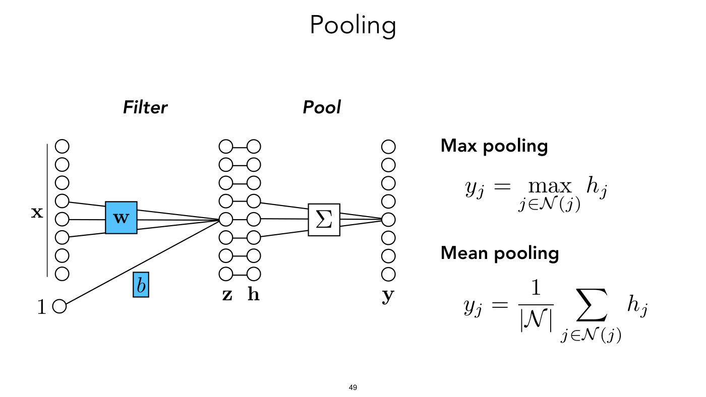

Build step: the same diagram as slide 48 but the white box now holds a large sigma "Σ" instead of "max". The right side now lists both: "**Max pooling**" with $y_j = \max_{j \in \mathcal{N}(j)} h_j$ (as on slide 48), and "**Mean pooling**"

$$y_j = \frac{1}{\lvert \mathcal{N} \rvert} \sum_{j \in \mathcal{N}(j)} h_j$$

(The slide prints $j$ both as the output index and as the summation/max index, as written here.)

## Slide 50 — Pooling — Why?

Text: "Pooling across spatial locations achieves stability w.r.t. small translations:". At left, a close-up photo crop of a diagonal edge between a deep orange-red region (left) and a pale lavender-white region (right), with a dark spot at the bottom-right corner. It is slide 25's clown fish photograph — the same embedded image, magnified about five times and clipped — showing where the orange body meets the left edge of the middle white stripe, the dark spot being the pectoral fin's black edge. An arrow leads to a grey image showing the filter response, likewise slide 25's filter output magnified: a mid-grey square with a bright diagonal stripe from the top right to the bottom left (the edge response). Over its right half is a $3 \times 3$ grid of nine circles, with black filled circles at (row 1, column 1), (row 2, columns 1 and 3) and (row 3, column 3), and white circles for the rest; lines from all nine go into a box labelled "max" and then to a single circle at the right, which is white (empty).

No OCW notice is printed on slides 50–52. Because their photo crop and response image are slide 25's clown fish material, which slide 25 marks "© source unknown. All rights reserved", this knowledge base treats slides 50–52 as excluded and does not render them.

## Slide 51 — Pooling — Why?

Build step: same text, photo crop and arrow. The edge-response image is shifted to the right (the window stays fixed) and the $3 \times 3$ grid of circles now has black circles in row 1 (all three), row 2 (columns 1 and 2) and row 3 (columns 1 and 2); white circles at row 2 column 3 and row 3 column 3. Lines go through the "max" box to a single circle at right (empty white). Added text at the right: "large response regardless of exact position of edge".

## Slide 52 — Pooling — Why?

Build step: same slide, with the edge-response image shifted right again, so that the bright stripe now runs entirely to the right of the $3 \times 3$ window, between it and the max box. All nine circles are filled black, and the single output circle after the "max" box is also filled black. No side text.

## Slide 53 — Pooling across channels — Why?

Title: "Pooling *across channels* — Why?". Text: "Pooling across feature channels (filter outputs) can achieve other kinds of invariances:". At left, a small photo of a dark grey beak or bill on a green background, running diagonally from top left to bottom right. Notice: "Image © Fredo Durand. All rights reserved. This content is excluded from our Creative Commons license. For more information, see https://ocw.mit.edu/help/faq-fair-use/". Four arrows fan out from the photo to four light-blue square filter icons stacked vertically: a vertical edge (white left, black right), a diagonal edge at about 45 degrees, a nearly horizontal edge tilted slightly, and a horizontal edge (white above, black below), followed by vertical dots. Arrows from each of the four icons converge on a white box labelled "max". Text at the right: "large response for any edge, regardless of its orientation".

*OCW notice: © Fredo Durand (photograph of a bird's bill). All rights reserved — excluded from the CC license.*

## Slide 54 — Computation in a neural net

At left, the heron photograph (grey bird with a spiky crest, bending forward) with notice "Image © Fredo Durand. All rights reserved. This content is excluded from our Creative Commons license. For more information, see https://ocw.mit.edu/help/faq-fair-use/". Three sets of three parallel arrows lead right through three identical blocks, each block made of three adjacent vertical bars: salmon-red, orange and pale yellow. Rotated labels above the first block, with dotted leader lines to the bars, read "Filter" (red bar), "ReLU" (orange bar) and "Pool" (yellow bar). Between blocks are arrow triplets; after the second block there is an ellipsis "…" and a third block. All three blocks are the same height. A fan of three arrows leads from the last block to the quoted word "heron" (monospace), with the rotated label "Classify" and a dotted leader line pointing to the arrows. Equation at the bottom:

$$f(\mathbf{x}) = f_L(\ldots f_2(f_1(\mathbf{x})))$$

*OCW notice: © Fredo Durand (heron photograph). All rights reserved — excluded from the CC license.*

## Slide 55 — Computation in a neural net

Build step: the same figure as slide 54, but the third bar is relabelled "Downsample" instead of "Pool", and the blocks now shrink: the first block is tall, the second is shorter, and the last is short and squat, showing that downsampling reduces the spatial size at each stage. Same arrows, ellipsis, "Classify", "heron" output, equation $f(\mathbf{x}) = f_L(\ldots f_2(f_1(\mathbf{x})))$ and heron photo with the same notice.

*OCW notice: © Fredo Durand (heron photograph). All rights reserved — excluded from the CC license.*

## Slide 56 — Downsampling

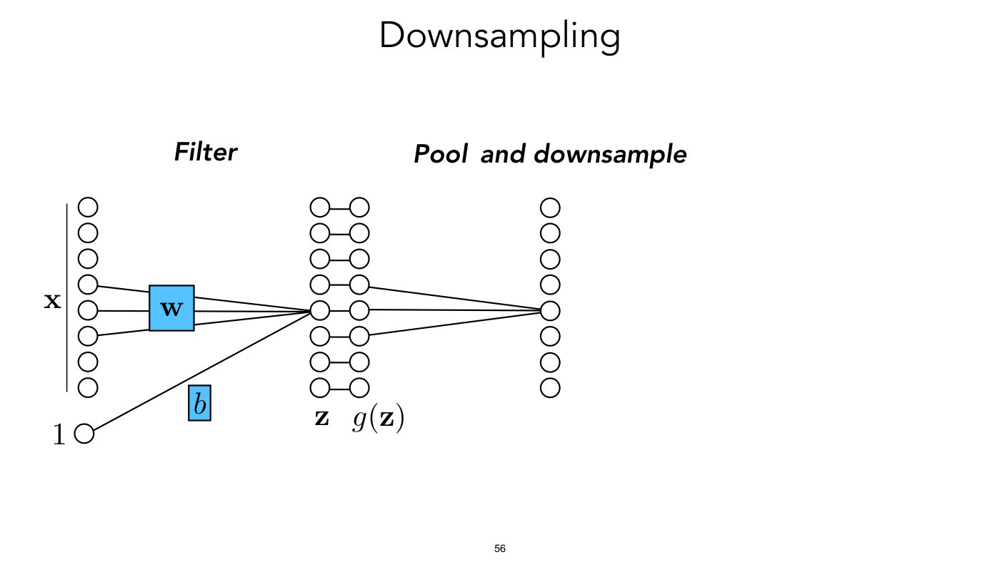

Headings "*Filter*" and "*Pool and downsample*". Same conv diagram as slide 48 (eight inputs $\mathbf{x}$ plus "1", blue box $\mathbf{w}$ and bias box $b$, $\mathbf{z}$ and $g(\mathbf{z})$ columns of eight circles). Three adjacent $g(\mathbf{z})$ circles (rows 4–6) connect by lines directly to the fifth circle of a final column of eight empty circles (no box).

## Slide 57 — Downsampling

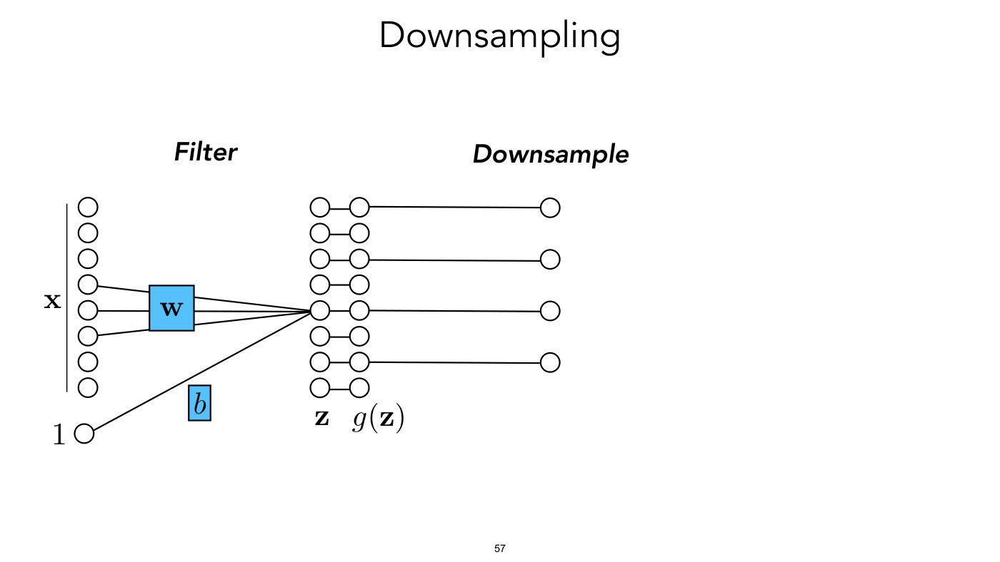

Headings "*Filter*" and "*Downsample*". Same left side as slide 56. The $g(\mathbf{z})$ circles in rows 1, 3, 5 and 7 each connect by a single horizontal line to a circle in a final column that now has only four circles, so every second position is kept and the output is half as long.

## Slide 58 — Strided operations

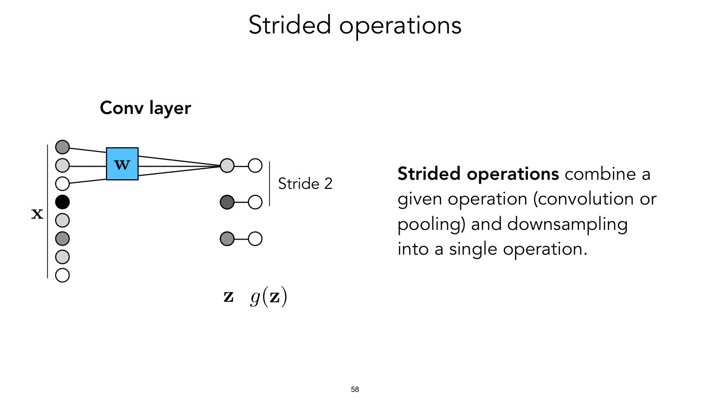

Subtitle "Conv layer". An input column $\mathbf{x}$ of eight circles with greyscale fills (top to bottom: mid grey, light grey, white, black, light grey, mid grey, light grey, white). A blue box $\mathbf{w}$ joins the first three inputs to the first $\mathbf{z}$ circle. There are only three $\mathbf{z}$ circles in total, level with input rows 2, 4 and 6 (light grey, dark grey and mid grey), each paired with a white $g(\mathbf{z})$ circle. A vertical bracket at the right, spanning the first two, is labelled "Stride 2". Text at the right: "**Strided operations** combine a given operation (convolution or pooling) and downsampling into a single operation."

## Slide 59 — Strided operations (2D)

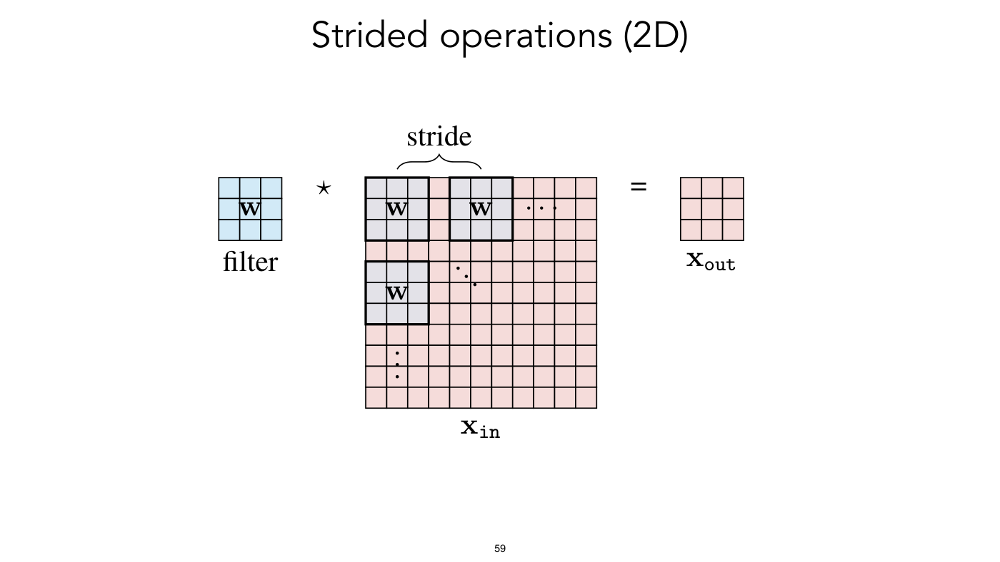

A 2D picture of the same idea. At left, a blue $3 \times 3$ filter grid labelled $\mathbf{w}$ ("filter"). A star $\star$ and a large pink grid $\mathbf{x}_ {\text{in}}$ (11 columns by 11 rows) follow. Three $3 \times 3$ windows labelled $\mathbf{w}$ are drawn on the grid with bold outlines: one at the top-left corner, a second to its right (offset by four cells, with a brace above the two labelled "stride"), and a third below the first. Dots mark that the pattern continues across and down the grid. An equals sign leads to $\mathbf{x}_ {\text{out}}$, a small pink $3 \times 3$ grid (captioned $\mathbf{x}_ {\text{out}}$).

## Slide 60 — Dilated filter

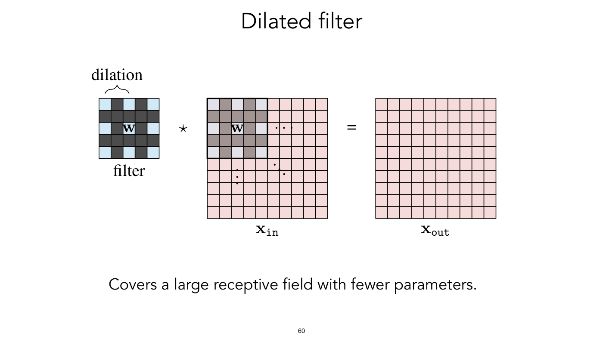

A diagram of a dilated filter. At left, a $5 \times 5$ grid labelled "filter" with "dilation" marked by a brace running from the centre of column 1 to the centre of column 3: the corner and alternate cells in rows 1, 3 and 5 are light blue, and the remaining cells (including all of rows 2 and 4 and the columns 2 and 4) are dark grey; $\mathbf{w}$ is written in the centre. A star $\star$ leads to a large pink grid $\mathbf{x}_ {\text{in}}$ (10 columns by 10 rows) with the same $5 \times 5$ pattern of window outlined at its top left, labelled $\mathbf{w}$ (the light-blue cells now appear pale lavender, the grey cells brownish), and dots indicating more positions. An equals sign leads to a pink grid $\mathbf{x}_ {\text{out}}$ (10 by 10). Text at the bottom: "Covers a large receptive field with fewer parameters."

## Slide 61 — Receptive fields

The stork photograph with a solid black $8 \times 5$ patch grid over it (eight columns, five rows of equal square-ish cells; the lone stork sits in the top-right cell, a group of three in the left of row 4 and two overlapping at the bottom left, two singles in the lower middle and lower right). Notice at the bottom left: "Image © Fredo Durand. All rights reserved. This content is excluded from our Creative Commons license. For more information, see https://ocw.mit.edu/help/faq-fair-use/".

*OCW notice: © Fredo Durand (photograph of storks, with patch grid). All rights reserved — excluded from the CC license.*

## Slide 62 — Receptive fields

Two side-by-side one-dimensional network diagrams, each with columns of seven circles labelled across the top "conv", "relu", "conv" (monospace); grey arrows show every connection and bold black arrows show the ones that matter. Left diagram: four columns of seven circles. A small stork crop sits at the far left. Column 1 (input): circles 2 to 6 are filled black. Column 2: circles 3 to 5 are filled black. Column 3: circles 3 to 5 are filled black. Column 4 (output): circle 4 is filled black and labelled $x_2[3]$. Bold arrows run from column-1 circles 2–6 into column-2 circles 3–5 (three inputs per output), straight across from column 2 to column 3, and from column-3 circles 3–5 into column-4 circle 4. Next to the output circle is a short stacked strip of four labelled cells: Sky, Sky, Bird, Sky (top to bottom), the third ("Bird") aligned with $x_2[3]$. Right diagram: same layout; only column 1 circles 5, 6, 7 and column 2 circle 6 are black, with bold arrows from those three inputs into column-2 circle 6, labelled $x_1[5]$.

Notice at the bottom left: "Image © Fredo Durand. All rights reserved. This content is excluded from our Creative Commons license. For more information, see https://ocw.mit.edu/help/faq-fair-use/".

*OCW notice: © Fredo Durand (stork crop in the receptive-field diagram). All rights reserved — excluded from the CC license.*

## Slide 63 — (feature maps at different depths of three CNNs)

A $3 \times 6$ grid of small square images, one row per network, with the network's name at the left in monospace and the layer name above each image.

- Row "alexnet": input image (a grey heron with a spiky crest, bending forward, on dark ground with green background), then conv1, conv2, conv3, conv4, conv5. conv1 is a false-colour edge map still showing the bird outline (a bright red-pink curve along the belly and legs). conv2 is dark, with a bright red spot near the bill and green patches. conv3, conv4 and conv5 are progressively blockier pixelated colour blobs (red, green, blue, magenta) with no visible bird shape.
- Row "vgg16": input image, then conv1, conv4, conv7, conv10, conv13. conv1 is a faint grey outline of the bird; conv4 a colourful edge outline; conv7 a darker outline of the bird's back and bill; conv10 a dark image with a bright orange-yellow spot on the bird's eye region; conv13 a coarse pixelated map with a red-orange blob at upper right.
- Row "resnet18": input image, then conv1, block2, block4, block6, block8. conv1 is a pink-tinted edge map; block2 a high-contrast multicolour noisy texture showing the bird outline; block4 a coarser pixelated colour map; block6 a pixelated map with a bright red-yellow blob at the upper right; block8 a very coarse $6 \times 8$-like grid of blue, green, red cells.

Notice at the bottom left: "Image © Fredo Durand. All rights reserved. This content is excluded from our Creative Commons license. For more information, see https://ocw.mit.edu/help/faq-fair-use/".

*OCW notice: © Fredo Durand (heron photograph and its feature-map visualisations). All rights reserved — excluded from the CC license.*

## Slide 64 — Implementing conv

Text:

Basic implementation:

1. `im2col`: NxMxC —> Npatches x (K x K x C)
2. `bmm`: batch `matmul` with kernel
3. `col2im`: Npatches x (K x K x C) —> NxMxC

or: fft signal processing stuff…

Useful library: timm: `https://github.com/rwightman/pytorch-image-models`

## Slide 65 — Popular CNN Architectures

(Divider slide.) The slide text is only "Popular CNN Architectures".

## Slide 66 — Computation in a neural net

The heron photograph at left (grey bird with a spiky crest, one foot raised, bending forward; notice "Image © Fredo Durand. All rights reserved. This content is excluded from our Creative Commons license. For more information, see https://ocw.mit.edu/help/faq-fair-use/"). Three blocks, each of three vertical bars (salmon-red, orange, pale yellow), connected by triplets of arrows, with "…" between the second and third. The first block is tall, the second shorter, and the third short and squat, as on slide 55. Rotated labels with dotted leader lines: "Filter" (red bar), "ReLU" (orange), "Downsample" (yellow), and "Classify" pointing at the final arrow fan, which leads to the quoted word "heron". Equation:

$$f(\mathbf{x}) = f_L(\ldots f_2(f_1(\mathbf{x})))$$

(This is the same figure as slide 55, with the photo placed a little differently.)

*OCW notice: © Fredo Durand (heron photograph). All rights reserved — excluded from the CC license.*

## Slide 67 — Encoder / Decoder

Two stacked diagrams. Top: the heron photograph (notice below it: "Image © Fredo Durand. All rights reserved. This content is excluded from our Creative Commons license. For more information, see https://ocw.mit.edu/help/faq-fair-use/") with an arrow into a large grey trapezoid labelled "Encoder" (wide at left, narrowing to the right). Inside are three blocks of three bars: the first block with bars labelled "Convolution" (salmon-red), "Nonlinearity" (orange), "Subsample" (pale yellow); a second, shorter block of the same three colours; and a third, small single salmon-red square. Triplets of arrows join them. An arrow leaves the trapezoid to the label $\mathbf{z}$. Bottom: $\mathbf{z}$ with an arrow into a grey trapezoid labelled "Decoder" (narrow at left, widening to the right), containing a small block of three bars (salmon-red, orange, pink), a taller block of three bars whose third (pink) bar is labelled "Upsample", and a tall single salmon-red bar; an arrow leads to a reconstructed heron photograph at the right.

*OCW notice: © Fredo Durand (heron photograph, input and reconstructed). All rights reserved — excluded from the CC license.*

## Slide 68 — Image-to-image

The heron photograph (notice at bottom left as on slide 67) leads by arrow triplets through a chain of blocks: a first tall block with bars labelled "Convolution", "Non-linearity", "Subsample"; a second, shorter block of three bars; "…"; a small block of three bars; a block of three bars like the second; then a tall single salmon-red bar; then arrow triplets to a flat segmentation image: a dark olive-green background with the bird's silhouette filled in grey-brown. A horizontal arrow labelled "Skip connection" runs from above the first block to above the last tall bar, and a second horizontal arrow runs from above the second block to above the fourth block (the one after the small block).

*OCW notice: © Fredo Durand (heron photograph). All rights reserved — excluded from the CC license.*

## Slide 69 — Image-to-image

Title "Image-to-image". On the left a slanted, faded image plane shows the stork photograph (storks visible in the lower left of the plane); on the right a slanted plane has a blue-to-white gradient with the stork silhouettes in pale yellow. Between them is a one-dimensional network diagram of five columns of nine squares, headed by monospace labels "conv", "relu", "conv", "softmax". Grey arrows show every connection. Bold blue arrows show one convolution: the first three squares of column 1 feed the second square of column 2, and likewise the first three squares of column 3 feed the second square of column 4. Straight black arrows join column 2 to column 3 (relu) and column 4 to column 5 (softmax).

Notice at the bottom left: "Image © Fredo Durand. All rights reserved. This content is excluded from our Creative Commons license. For more information, see https://ocw.mit.edu/help/faq-fair-use/".

*OCW notice: © Fredo Durand (stork photograph on the input plane). All rights reserved — excluded from the CC license.*

## Slide 70 — U-net

Title "U-net". The heron photograph at left (notice below it as on slide 67) leads by arrow triplets to five white rectangles with no labels, whose heights show the resolution: a tall rectangle, a shorter one, a small one at the bottom of the "U", then a taller rectangle with a second slightly offset rectangle behind it, and a tall rectangle again with an offset rectangle behind it. Arrow triplets continue to a segmentation image (olive-green background with the bird silhouette in grey-brown). Two curved arrows labelled "Skip connection" run from the first tall rectangle to the last offset pair and from the second rectangle to the fourth pair, below the diagram.

*OCW notice: © Fredo Durand (heron photograph). All rights reserved — excluded from the CC license.*

## Slide 71 — ResNet

Title "ResNet". The heron photograph (notice at its bottom left as on slide 67) leads by arrow triplets through five tall white rectangles in a row, then to a segmentation image (olive-green background, grey-brown bird silhouette). Beneath each pair of adjacent rectangles is a circled plus sign "+": four in total, each with a curved arrow from the left rectangle's bottom edge into the plus and from the plus up to the next rectangle. Text:

**Residual connection:** $\mathbf{x}_ {\text{out}} = F(\mathbf{x}_ {\text{in}}) + \mathbf{x}_ {\text{in}}$

Or, if you want to change dimensionality: $\mathbf{x}_ {\text{out}} = F(\mathbf{x}_ {\text{in}}) + \mathbf{W} \mathbf{x}_ {\text{in}}$

*OCW notice: © Fredo Durand (heron photograph). All rights reserved — excluded from the CC license.*

## Slide 72 — Image-to-image

Repeat of slide 69: the same figure with the faded stork photograph plane at the left, the blue-gradient output plane with pale-yellow stork silhouettes at the right, and the five-column network (conv, relu, conv, softmax) with the two bold blue convolution fans, with the same notice at the bottom left: "Image © Fredo Durand. All rights reserved. This content is excluded from our Creative Commons license. For more information, see https://ocw.mit.edu/help/faq-fair-use/". No visible change from slide 69.

*OCW notice: © Fredo Durand (stork photograph on the input plane). All rights reserved — excluded from the CC license.*

## Slide 73 — Convolutions in time

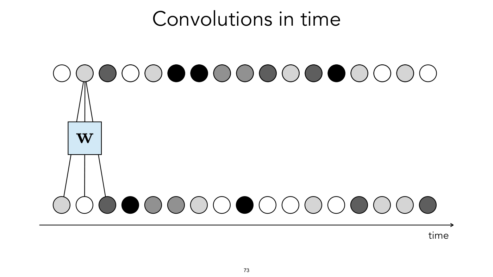

Title "Convolutions in time". Two rows of seventeen circles each, drawn with greyscale fills, with a horizontal arrow at the bottom labelled "time". Bottom row, left to right: light grey, white, dark grey, black, mid grey, mid grey, light grey, white, black, white, white, light grey, white, dark grey, light grey, light grey, dark grey. Top row, left to right: white, light grey, dark grey, white, light grey, black, black, mid grey, mid grey, dark grey, light grey, dark grey, black, light grey, white, light grey, white. A blue box labelled $\mathbf{w}$ sits at the lower left, joined by three lines to the first three circles of the bottom row and by three lines up to the second circle of the top row. This shows a filter sliding along a 1D time signal.

## Slide 74 — (video as a space-time volume)

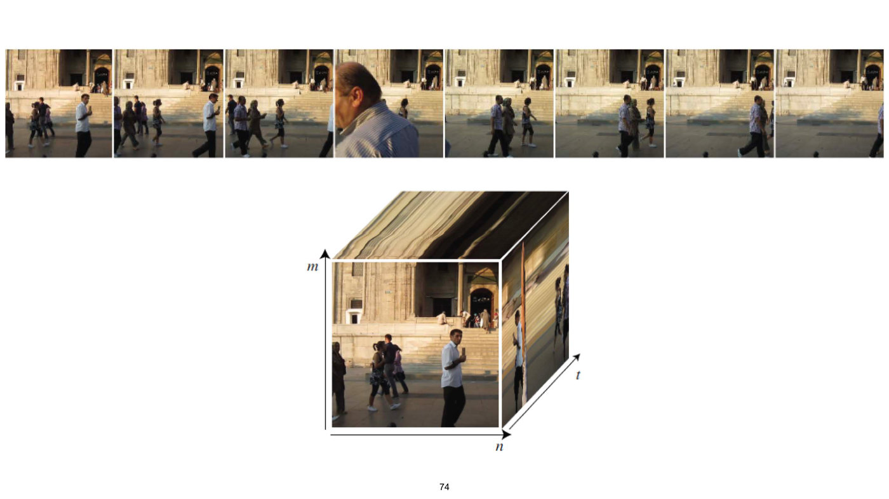

At the top, a strip of eight consecutive video frames of a sunlit stone building entrance with steps and people walking across the foreground in the late-day light; in the fourth frame a man's head and shirt fill the left half. Below, a cube drawn in perspective, made from the same video: the front face is one video frame (the building, steps and a man in a white shirt at right), the right face shows the $t$ direction as horizontal streaks of the people's motion, and the top face shows streaks of the building's edges. Axes: $m$ (vertical, up), $n$ (horizontal, along the bottom) and $t$ (depth, running into the page along the right edge). No credit or OCW notice is printed on this slide.

## Slide 75 — (3D convolution on the video volume)

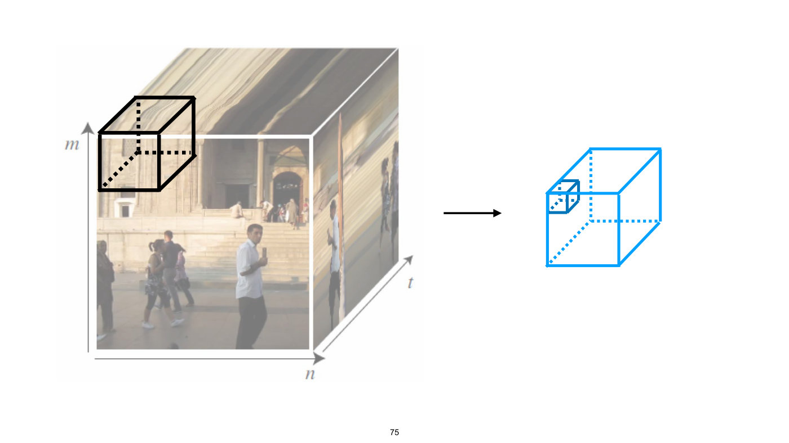

A faded version of the cube of slide 74 with its axes $m$, $n$ and $t$. A bold black wireframe cube (dotted at its hidden edges) is drawn over the top-left-front corner as a small 3D filter window. An arrow points right to a pale-blue wireframe cube (the output volume) with a small dark-blue cube at its top-left-front corner marking the corresponding output position. No credit or OCW notice is printed on this slide.

## Slide 76 — What if you don't want to be shift invariant?

Title: "What if you *don't* want to be shift invariant?" (the word "don't" in italics). Text:

1. Use an architecture that is not shift invariant (e.g., MLP)
2. Add location information to the *input* to the convolutional filters — this is called **positional encoding**

## Slide 77 — What if you don't want to be shift invariant?

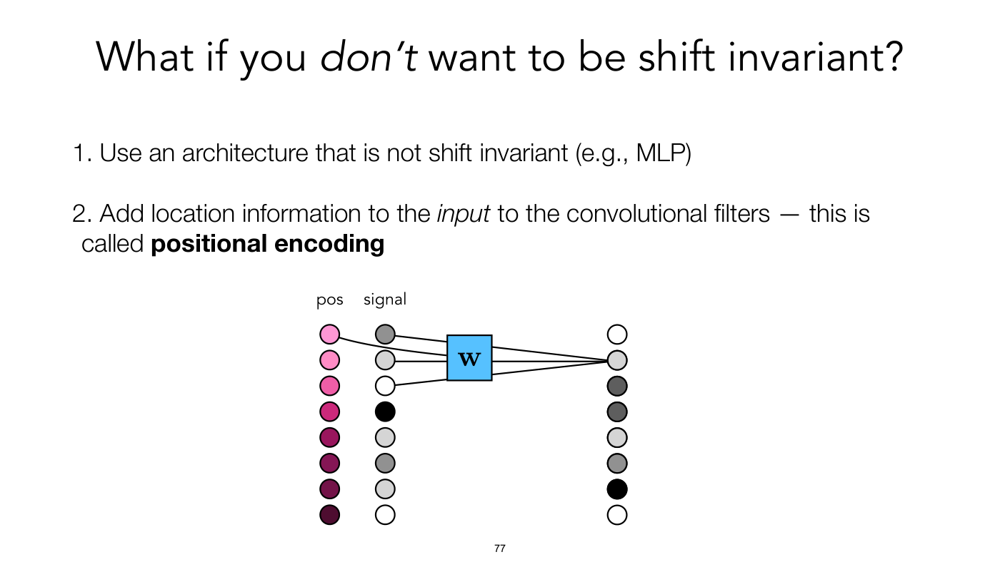

Build step: the same text as slide 76, plus a diagram below. Two input columns of eight circles are headed "pos" and "signal". The "pos" column is a gradient of pink to dark purple from the top to bottom (position encoded as colour). The "signal" column holds greyscale values (top to bottom: mid grey, light grey, white, black, light grey, mid grey, light grey, white). A blue box labelled $\mathbf{w}$ takes the first three entries of the signal column and also the first "pos" circle (a curve from the first pink circle goes into the box), producing the second circle of a single output column of eight (greys top to bottom: white, light grey, dark grey, dark grey, light grey, mid grey, black, white).

## Slide 78 — Neural Fields

Title "Neural Fields". Column headings "Coordinates" and "Field". At left, two overlapping coloured squares: a pink-to-dark-magenta vertical gradient (light pink at the top, dark maroon at the bottom) with the label $x$ in its top-right corner, and behind it a cyan-to-dark-blue horizontal gradient (dark blue at the left, cyan at the right) with the label $y$. An arrow labelled $\Phi : \mathbb{R}^2 \to \mathbb{R}$ points right to the greyscale cameraman photograph (a man in a dark coat looking through a tripod camera over a grassy field, with buildings behind), labelled with an italic "l" in its top-right corner. Below the photo:

$$l = \Phi(x, y)$$

(the printed symbol is an italic lowercase "l", presumably the image intensity.) Notice at the bottom right: "© Sitzmann, et al. All rights reserved. This content is excluded from our Creative Commons license. For more information, see https://ocw.mit.edu/help/faq-fair-use/".

*OCW notice: © Sitzmann et al. (cameraman image and coordinate-field figure from the SIREN paper). All rights reserved — excluded from the CC license.*

## Slide 79 — Neural Fields — SIREN

Title "Neural Fields — SIREN". Subtitle: "CNN applied *per-pixel* to map from a coordinate grid to a color" (as printed). Same coordinate squares at left and cameraman photo at right as slide 78, now with a small network drawn between them: input circles $x$ and $y$ on the left, a hidden layer of three circles, and one output circle on the right (labelled $l$, as printed), with arrows between all adjacent layers. A small black square with a white centre marks the top-left pixel in the coordinate image; a long curved arrow carries it to the network's input, and another curved arrow carries the output to the matching pixel position in the top-left of the photo. A bold arrow points from the network area toward the photo. Equation: $l = \Phi(x, y)$ (as printed). Italic text at the bottom left: "Can take continuous coordinates as input!". Credit: ["SIREN", Sitzmann, Martel et al. 2020]. Notice: "© Sitzmann, et al. All rights reserved. This content is excluded from our Creative Commons license. For more information, see https://ocw.mit.edu/help/faq-fair-use/".

*OCW notice: © Sitzmann et al. (SIREN figure with cameraman image). All rights reserved — excluded from the CC license.*

## Slide 80 — Neural Fields — NeRF

Title "Neural Fields — NeRF". Subtitle: "Conv net applied to map from 5-D coordinate grid to a color + volumetric density" (as printed). Two copies of a figure from the NeRF paper side by side. Left, headed "5D Input Position + Direction": a pale yellow toy bulldozer inside a dotted cube, with two photographs of it as image planes on either side; two red rays pass from camera view points (blue angle marks) through the planes and the scene, with black dots sampled along them. A blue curved arrow from one sample dot points to the label $(x, y, z, \theta, \phi)$, then a blue arrow into a box of three blue-outlined grey vertical bars labelled $F_\Theta$. Right, headed "Output Color + Density": the same scene with the dots now hollow circles coloured by the network output (yellow and orange along the rays, near the bulldozer), labelled "Ray 1" and "Ray 2"; an arrow from the box labelled $(RGB\sigma)$ points down at one of the coloured sample dots.

Credit: ["NeRF", Mildenhall, Srinivasan, Tancik et al., ECCV 2020]. Notice: "© Mildenhall, et al. All rights reserved. This content is excluded from our Creative Commons license. For more information, see https://ocw.mit.edu/help/faq-fair-use/".

*OCW notice: © Mildenhall et al. (NeRF figure with bulldozer scene). All rights reserved — excluded from the CC license.*

## Slide 81 — (generated image, "made by Yen-Chen Lin")

A large, blurry, abstract image filling most of the slide: a muted brown-grey-blue cloudy texture with no recognisable objects (a small pale smudge at the left-centre and a faint blue patch near the middle). Caption at the bottom right: "made by Yen-Chen Lin". Notice at the right edge: "© Yen-Chen Lin. All rights reserved. This content is excluded from our Creative Commons license. For more information, see https://ocw.mit.edu/help/faq-fair-use/". The slide gives no further explanation of what the image shows.

*OCW notice: © Yen-Chen Lin (the generated image). All rights reserved — excluded from the CC license.*

## Slide 82 — Concluding remarks

Text:

Convolution is a fundamental operation for image processing.

It just means: chop up the image into patches and apply the same function to each patch.

This concept appears in almost all modern architectures, such as CNNs, transformers, NeRFs, and more.

## Slide 83 — 4. Architectures for Grids

(Agenda / signpost slide, identical to slide 2.)

- Why build better architectures?
- Convolutional layers
- Pyramids
- Architecture zoo
- Neural fields and positional encodings

## Slide 84 — MIT OpenCourseWare end page

Not lecture content: OCW's appended end page (this page prints the number "84" at the bottom centre). Text: "MIT OpenCourseWare https://ocw.mit.edu"; "6.7960 Deep Learning, Fall 2024"; "For information about citing these materials or our Terms of Use, visit: https://ocw.mit.edu/terms".
