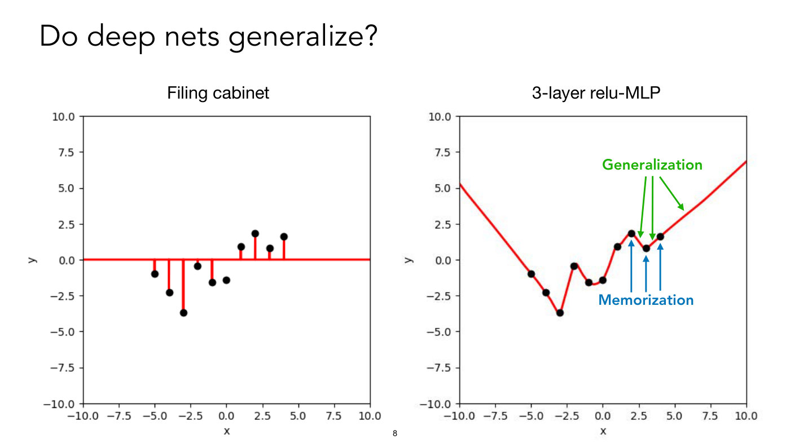

# Lecture 6 — NN Generalization: slide-by-slide

Text and figures of all 66 pages of
[`mit6_7960_f24_lec6.pdf`](https://ocw.mit.edu/courses/6-7960-deep-learning-fall-2024/mit6_7960_f24_lec6.pdf),
transcribed from the deck (speaker: Phillip Isola; the deck's title is "NN Generalization (or: why do neural networks generalize?)" and the recorded title is "Generalization Theory"). Cite these as "slide N" — the printed number equals the PDF page number for slides 1–65; page 66 is OCW's appended end page. Diagrams, plots and photographs are described in prose since the KB is read as text.

**Images.** 28 slides carry a whole-slide render under their heading: 8, 11, 14–19, 21, 25–28, 34, 37–39, 49–54 and 56–60. Not rendered: the 8 slides with an OCW "All rights reserved" notice (7, 12, 13, 23, 30, 31, 32, 63); slide 62, whose photograph is an excluded image from lecture 4's deck; build steps superseded by a rendered slide (29 by 28, 55 by 54); code, screenshots and tables this file reproduces exactly (6, 9, 10, 40, 42, 44); and the title, outline, divider, text and end pages (1–5, 20, 22, 24, 33, 35, 36, 41, 43, 45–48, 61, 64–66). Use an image path only if it appears in this file.

Companion pages: [wiki page for this lecture](../../wiki/06-generalization-theory.md) ·
[transcript](../transcripts/06-generalization-theory.md)

**Signposting slides you can skip.** Slide 2 is the outline; slides 4 and 20 are section dividers; slide 66 is the OCW end page.

Some slides are **build steps** — the same slide re-shown with more revealed: slides 15–18 (the pix2pix sketch of a cat face, with more eyes and a body added), 25–28 (polynomial fits of degree 1, 3, 20 and 1000 to the same 20 points), 36–39 (the Vapnik-Chervonenkis picture, with diagrams added), 41 and 43, 35 and 45 (functions the model can represent, with "No!" added), 24 and 33, and 22 and 64 (model complexity, with lines added), 52–55 (the low-rank bias figure) and 56–58 (the parameter-kernel map, with deeper stacks). They are transcribed individually, each with a note of what it adds.

## Contents

| Slides | Section |
| ------ | ------- |
| 1 | Title |
| 2 | Outline |
| 3 | Approximation versus generalization: empirical and population risk |
| 4–19 | Intuitive ideas about generalization: bad data, bad models (the filing cabinet, Paul the octopus), do deep nets generalize, a counting experiment with GPT-4o, pix2pix and edges2cats, inductive bias toward simple modular processing |
| 20 | Section divider: Generalization theory |
| 21–22 | Occam's razor; shortest program as the theory answer |
| 23–32 | Overfitting and the bias-variance tradeoff; polynomial fits of degree 1, 3, 20 and 1000; the simple plus spiky hypothesis; double descent; norm and random Fourier features |
| 33–35 | How to measure model complexity: parameters (no), parameter norm (maybe), two networks combined, distinct functions |
| 36–44 | Vapnik-Chervonenkis theory; dichotomies and the VC bound; NNs fit random labels; Zhang et al.'s CIFAR10 table |
| 45–47 | Distinct functions: no; open question; recap |
| 48–51 | Why do deep nets generalize: version space; simplicity bias in the parameter-function map |
| 52–60 | Low-rank bias of depth; parameter-kernel map; effective-rank distributions; the parameter landscape |
| 61–63 | Implicit regularization of optimizers; architectural symmetries; domain-specific constraints |
| 64–65 | Model complexity again; finite models, infinite data (a recalled conversation) |
| 66 | MIT OpenCourseWare end page |

---

## Slide 1 — Lecture 6: NN Generalization

Title: "Lecture 6: NN Generalization". Subtitle: "(or: why do neural networks generalize?)". Then: "Speaker: Phillip Isola".

Background: a faded plot crop fills the slide, with no axes or labels. Dozens of thin curves, shading from pale yellow-green through teal to purple, fall steeply at the far left, then flatten and run to the right edge. The purple and teal curves make a hump near the left (rising to a peak about a fifth of the way across, then sloping down) above a thick red dashed line that follows the lower envelope of all the curves, dipping to a minimum near the left and drifting down to the right. The pale yellow curves stay high and wavy across the upper right.

Footer bar (grey): MIT logo, "6.7960 Deep Learning" (red), "https://phillipi.github.io/6.7960", right side "Fall 2024".

## Slide 2 — Outline

- What is generalization
- Do deep nets generalize?
- Deep nets violate certain classical generalization theory
- Why do they generalize? → What are their inductive biases?

## Slide 3 — Approximation vs Generalization

- How well will our trained neural network do on new data?
- We minimize the empirical risk (the words "empirical risk" in blue italics):

$$\widehat{\mathcal{R}}(\theta) = \frac{1}{N} \sum_ {i=1}^{N} \mathcal{L}(f_ \theta(\mathbf{x}_ i), \mathbf{y}_ i)$$

- We actually want the population risk (test error) (in red italics) to be small:

$$\mathcal{R}(\theta) = \mathbb{E}_ {(\mathbf{x},\mathbf{y}) \sim \mathcal{P}} \thinspace \mathcal{L}(f_ \theta(\mathbf{x}), \mathbf{y})$$

A yellow box at the bottom, with a bold heading:

**Important questions:**

**Approximation**: what is the best $\mathcal{R}(\theta^\ast)$ we can achieve with our model?

**Optimization**: how well are we minimizing $\widehat{\mathcal{R}}(\theta)$?

**Generalization**: how different is $\widehat{\mathcal{R}}(\theta)$ from $\mathcal{R}(\theta)$?

(The words "Approximation", "Optimization" and "Generalization" are bold italic. The box sets its R in a fancier script face than the two formulas above, and its θ\* inline; this file writes both as $\mathcal{R}(\theta^\ast)$.)

## Slide 4 — Intuitive ideas about generalization

(Section divider; the title alone, centred.)

## Slide 5 — Bad data

Suppose we want to train a cats vs dogs classifier.

But our training data only contains cats.

Can we do it? ….. No

## Slide 6 — Bad models: the filing cabinet

Left half blank. Right: "Every time we see a new training point (x,y), we put it in the cabinet." Then a code snippet on a light-grey background, syntax-coloured:

```
def predict(x):
  if x in cabinet:
    return cabinet[x]
  else:
    return 0
```

Below: "What will the approximation error be?" and "What will the generalization error be?"

## Slide 7 — Bad models: Paul the octopus

Left: a photograph of an orange octopus on top of two clear plastic boxes in an aquarium tank. The left box carries a German flag (black, red, gold) and the right box a Spanish flag (red, yellow, red); the octopus's arms reach over both. A football is partly visible at the right edge.

Right: a screenshot of a news article page. Headline, in a condensed black bold face: "The Amazing Tale of Paul the Psychic Octopus: Germany's World Cup Soothsayer". Under it, a red tag "NEVER FORGET" with a rule extending right. Standfirst: "Sure, Germany is back in the World Cup final. But it'll have to beat Argentina without Paul, the cephalopod that correctly predicted the results of all eight (!) German matches last go-around." Byline: a round portrait, "Emily Shire", "Updated Apr. 14, 2017 3:21PM EDT", "Published Jul. 12, 2014 12:00AM EDT"; at right four small share icons (Facebook, Twitter, email, Reddit).

Notice, in small print under the article: "© The Daily Beast. All rights reserved. This content is excluded from our Creative Commons license. For more information, see https://ocw.mit.edu/help/faq-fair-use/".

Bottom centre: "Would you trust Paul?"

*OCW notice: © The Daily Beast (Paul the octopus article screenshot). All rights reserved — excluded from the CC license.*

## Slide 8 — Do deep nets generalize?



Two scatter-and-curve plots side by side, same axes: x from −10.0 to 10.0 (ticks every 2.5, labelled "x") and y from −10.0 to 10.0 (ticks every 2.5, labelled "y"). The same ten black training dots appear in both, at x = −5, −4, −3, −2, −1, 0, 1, 2, 3, 4, with y approximately −1.0, −2.3, −3.7, −0.4, −1.6, −1.4, +0.9, +1.8, +0.8, +1.6.

- Left plot, titled "Filing cabinet" (one red series): a red horizontal line along y = 0 across the whole x range, with a vertical red stem from y = 0 to nine of the ten dots; the dot at x = 0 (y ≈ −1.4) has no stem and sits alone below the line. Away from the dots the prediction is 0.
- Right plot, titled "3-layer relu-MLP" (one red series): a continuous piecewise-linear red curve that passes through all ten dots. Left of the data it falls in a nearly straight line from about y = 5.3 at x = −10 to the dot at x = −5 and on down to the minimum at (−3, −3.7); it then rises steeply in a straight line to a sharp local peak at the dot at x = −2 (y ≈ −0.4), falls to the dot at x = −1 (≈ −1.6), sags slightly (to about −1.7) between −1 and 0, climbs through the dots at 0 and 1 to the peak at x = 2, dips to the dot at x = 3, rises to the dot at x = 4, and continues as a nearly straight line rising to about y = 6.8 at x = 10.
- Annotations on the right plot: a green label "Generalization" with three green arrows pointing down at the curve between the dots — one at the falling segment between x = 2 and 3 (about x = 2.5), one at the rising segment between x = 3 and 4 (about x = 3.5), and one at the straight stretch beyond x = 4 (about x = 5.7). A blue label "Memorization" with three blue arrows pointing up, ending just below the dots at x = 2, 3 and 4.

## Slide 9 — Do deep nets generalize?

Top right: the filing-cabinet code snippet of slide 6 again (def predict(x): / if x in cabinet: / return cabinet[x] / else: / return 0).

"What about much big fancy modern nets?" (as printed)

1. Suppose an LLM is a filing cabinet (no generalization)
2. How big does the cabinet need to be?
3. Simple counting experiment:
   - Sample random sequences of **n** words from a vocab of size **m**
   - There are **m^n** such sequences
   - Input a set of such sequences into your favorite model that answers some question about a text input; estimate percent of time, **p**, that the output is correct (or at least "non-zero")
   - Filing cabinet (and training data) needs to be size **s** = **p\*m^n**

## Slide 10 — Vocab:

Top: a code cell on a light-grey background:

```
fruits = [
    'Apple', 'Banana', 'Orange', 'Grapes', 'Mango', 'Peach', 'Pear', 'Pineapple', 'Strawberry', 'Blueberry',
    'Raspberry', 'Watermelon', 'Cantaloupe', 'Cherry', 'Coconut', 'Fig', 'Guava', 'Kiwi', 'Lemon', 'Lime',
    'Lychee', 'Mandarin', 'Nectarine', 'Papaya', 'Passion Fruit', 'Plum', 'Pomegranate', 'Tangerine', 'Dragonfruit', 'Durian'
]
```

(30 fruit names; the strings are red.)

Left, large text:

**n** = 30, **m** = 10

**prompt:** "How many citrus fruits are in this list?"

My estimated **p** for GPT-4o: 1.0 (5/5)

**s** = 100 trillion

Right: a screenshot of a ChatGPT exchange. The user's grey bubble reads: "How many citrus fruits are in this list: Cantaloupe, Fig, Raspberry, Blueberry, Papaya, Lemon, Tangerine, Cherry, Grapes, Orange". The reply (beside the OpenAI logo) reads: "In the list you provided, the citrus fruits are:" followed by bullets "Lemon", "Tangerine", "Orange", then "So, there are **3 citrus fruits** in the list." Below, a row of small feedback icons (speaker, copy, thumbs up, thumbs down, regenerate with a drop-down chevron).

Credit at bottom centre: "Created with ChatGPT."

*As printed: the slide states n = 30 and m = 10, while the vocab above lists 30 fruits and the example prompt lists 10; the slide's n and m are printed this way.*

## Slide 11 — (untitled; the same experiment with image generation)


Left, large text:

**n** = 30, **m** = 10

**prompt:** Draw these fruits

My estimated **p** for GPT-4o: 0.125 (1/8)

**s** = 12.5 trillion

Right: a screenshot of a ChatGPT exchange. The user's grey bubble reads: "Draw these fruits: Blueberry, Mandarin, Kiwi, Cantaloupe, Peach, Dragonfruit, Coconut, Cherry, Passion Fruit, Lychee". The reply (beside the OpenAI logo) is a square rounded-corner image of a painterly, photo-real still life of fruit on a pale ground: a cluster of eight blueberries at upper left, three kiwi halves, two orange or mandarin pieces and an orange slice, a pink-fleshed cut melon or grapefruit half, a whole pineapple at the right edge, a striped green melon in the centre, two cut dragonfruit with pink skin, a halved coconut with pink husk at right, peach or apricot pieces, a whole orange at the left edge, mandarin segments, two bright red cherries on stems at bottom centre and four darker red cherries on long stems and a cut lychee at lower right.

Credit at bottom centre: "Created with ChatGPT." The slide has no title.

## Slide 12 — (untitled; pix2pix training data)

Left, in italics at top: "Training data". Column heads "x" and "y" (bold math letters). Three rows, each a pair drawn inside curly braces with a comma between: an edge-map line drawing of a cat (x) and a cut-out colour photo of the same cat (y). Row 1: an edge drawing of a long-haired cat lying down, and an orange long-haired cat lying down. Row 2: a line drawing of a standing cat, and a white-and-grey cat with a dark bushy tail. Row 3: a line drawing of a cat lying with head on paws, and a ginger tabby with blue eyes lying down. A bold vertical ellipsis below the third row. An arrow from below points up at the edge drawings, labelled "[HED: Xie & Tu, 2015]".

Middle and right: the drawing of a sitting kitten as a line drawing labelled $\mathbf{x}$ at its top; a horizontal arrow runs from it through three tall white rectangles (a small neural-net symbol) labelled $G$ above, and ends at a colour photo-like image of a tabby kitten sitting, labelled $G(\mathbf{x})$ above.

Bottom right, large: "[pix2pix: Isola, Zhu, Zhou, Efros, 2017]".

Notice above it: "© Saining Xie and Zhuowen Tu; and Isola, et al. All rights reserved. This content is excluded from our Creative Commons license. For more information, see https://ocw.mit.edu/help/faq-fair-use/".

*OCW notice: © Saining Xie and Zhuowen Tu; and Isola, et al. (edge-and-cat training pairs and pix2pix figure). All rights reserved — excluded from the CC license.*

## Slide 13 — edges2cats

Screenshot of the #edges2cats web demo (title "edges2cats" in grey at top left). Column labels: "TOOL" (left), "INPUT" (a large empty square canvas with a dark border and a mouse pointer inside), "OUTPUT" (a second empty square). Under TOOL: a toggle with "line" selected (filled black dot) and "eraser" (empty circle). Between the squares: a small white box labelled "pix2pix" with a pink button "process", and a thin arrow from the input square into the box and another from the box to the output square. Pink buttons under the input: "undo", "clear", "random"; under the output: "save".

Notice at lower right: "© Chris Hesse. All rights reserved. This content is excluded from our Creative Commons license. For more information, see https://ocw.mit.edu/help/faq-fair-use/". Below it, large: "[#edges2cats: Chris Hesse, 2017]".

*OCW notice: © Chris Hesse (edges2cats demo screenshot). All rights reserved — excluded from the CC license.*

## Slide 14 — (untitled; edges2cats creations)


Top: an INPUT / pix2pix "process" / OUTPUT panel as on slide 13. The input is a rough line drawing of a loaf of sliced bread seen from the front (a rounded top and two small square holes near the front face, drawn like eyes). The output is a photo-like loaf-shaped cat: grey-brown fur forming a bread shape with the "holes" as two yellow-orange cat eyes and a white furry face below them. Caption: "Ivy Tasi @ivymyt".

Bottom row: four images of cat fur and faces shaped like objects. Left to right: a triangular pyramid-shaped cat with two eyes at the base; a round black ring-shaped fluffy cat with yellow eyes; an X-shaped cat with eyes at the crossing; a cube or box-shaped cat with a face on the front. Caption: "Vitaly Vidmirov @vvid".

Small print bottom right: "Images created using pix2pix and edges2cats." (No OCW notice is printed on this slide.)

## Slide 15 — (untitled; pix2pix with a two-eyed face)


Build step: an INPUT square (left) → pix2pix "process" box (centre) → OUTPUT square (right). The input is a hand-drawn cat head outline with pointed ears at the upper right and upper left and two oval eyes. The output is a fuzzy photo-like cat face on white, grey-brown with two yellow eyes, with a few small green and dark specks above the right ear.

## Slide 16 — (untitled; a third eye)


Build step: slide 15's drawing with one more oval added, above and between the two eyes (three ovals in all). The output is a pale cat face with three yellow-orange eyes, the third one in the forehead, and a few faint specks at the upper right.

## Slide 17 — (untitled; eight eyes)


Build step: the same head outline with eight hand-drawn ovals — three across the top, two in the middle row, two in a lower row, and one low in the centre-right. The output is a pale cat face with eight eye-like shapes in matching positions; the ones in the lower half are smeared and darker.

## Slide 18 — (untitled; eight eyes and a body)


Build step: slide 17's eight-oval drawing, with a body added below the head: a rounded outline for shoulders and two paw shapes at the bottom. The output is the same eight-eyed cat face on top of a fluffy white-and-cream body with orange-tinted paws at the bottom.

## Slide 19 — Inductive bias toward simple modular processing


Left text: "When I see an oval, draw an eye." (in quotation marks). Upper right: an INPUT / pix2pix "process" / OUTPUT panel; the input canvas is empty apart from one tiny oval at the centre; the output is a blurry, pale, smudged cat-like image with a single yellow eye at the centre.

Below, "Why? Bias of convnets!" and a diagram. At left, a box holding three ovals (one upper centre, one lower left, one lower right). Three dotted arrows fan out from it to three rows. Each row has: a small box with one oval, a line into a symbol labelled $f$ (a small square with $f$ inside, framed by comb-like bars, drawn as a convnet), an arrow to a small picture of a yellow eye. The three eye pictures differ in shape to match the ovals (the first oval is rounder, the third is flatter). Dotted arrows from the three eyes converge on a box at right showing three eyes at the same positions as the three ovals.

## Slide 20 — Generalization theory

(Section divider; the title alone, centred.)

## Slide 21 — Occam's Razor


Left: "The simplest model that fits the data will generalize best." and, lower, in red: "How do we measure "simpler"?"

Right: a pen-and-ink sketch on yellowed parchment of a tonsured figure in a long hooded robe, shown from the waist up, head turned to look sideways; one arm hangs down at the lower left holding something. A tall decorated vertical stroke rises at the right, with a line of Gothic-style handwriting at the top right. Caption beneath: "Image is in the public domain."

## Slide 22 — How should we measure model complexity?

**Theory answer:**

The shortest program that fits the data is the one that will generalize best.

Intractable, but good to keep in mind…

Bottom right: "[Solomonoff 1964]".

## Slide 23 — Review: Overfitting and the bias-variance tradeoff

A line of text with two labelled terms below it: "test error = train error + (test error - training error)", where the words "bias" (bold italic) sit under "train error" and "variance" (bold italic) under "(test error - training error)".

Below, a framed figure (panel "A", a classical risk-versus-capacity plot, reproduced from a paper). Axes: vertical "Risk" (arrow up), horizontal "Capacity of $\mathcal{H}$" (arrow right); no numeric ticks. A vertical dotted line splits the plot: "under-fitting" is written to its left and "over-fitting" to its right. Two series:

- "Test risk" (solid black): a U-shaped curve, falling from the upper left, bottoming out exactly at the dotted line, then rising steeply to the upper right.
- "Training risk" (dashed black): decreases steadily from the upper left, crossing the dotted line well above the axis, and flattening onto the horizontal axis towards the right.

A label "sweet spot" at the lower left with an arrow to a small grey dot on the horizontal axis at the foot of the dotted line.

Notice, bottom right: "© Belkin, et al. All rights reserved. This content is excluded from our Creative Commons license. For more information, see https://ocw.mit.edu/help/faq-fair-use/". Credit below it, in italics: "image: Belkin et al, 2019".

*OCW notice: © Belkin, et al. (risk-versus-capacity figure). All rights reserved — excluded from the CC license.*

## Slide 24 — How should we measure model complexity?

Centred: "# parameters?"

## Slide 25 — d=1


Top left: "d=1". A scatter-and-curve plot with no axes or ticks. Legend (top right box): blue line "ground-truth", orange line "model", red dot "samples". Three series:

- "ground-truth" (blue curve): a cubic-looking S-shape: it rises from the left edge to a maximum about a fifth of the way across, falls through the middle, reaches a minimum about four fifths of the way across, and rises again at the right edge.
- "samples" (red dots): 20 dots at evenly spaced x positions. Sixteen lie on the blue curve; four lie visibly off it: one above the curve just right of the maximum, higher than the maximum itself (the 7th dot from the left); one well below the curve on its falling side, left of the middle (the 8th); one far below the curve between the middle and the minimum, lower than the minimum itself (the 13th); and one above the curve to the right of the minimum (the 17th).
- "model" (orange line): a straight line sloping downward from the upper left to the lower right, crossing the blue curve three times; it fits the S-shape poorly.

## Slide 26 — d=3


Build step: the same plot as slide 25 with the model fitted at degree d=3 (title text "d=3" at top left). The same legend and the same 20 red samples (four off the curve) are shown. The orange "model" curve now follows the blue ground-truth S-shape closely, running just slightly below the blue curve in the middle and to the right of the first maximum, and it ignores the four off-curve dots. At the far right the orange curve rises slightly above the blue one and ends a little above the last sample.

## Slide 27 — d=20


Build step: "d=20" at top left; the same data. The orange "model" now oscillates wildly: it passes through all 20 red samples (the legend sits at the bottom centre of this plot). At the far left it swings off the bottom of the frame between the 1st and 2nd samples, off the top between the 2nd and 3rd, and down to the bottom edge again between the 3rd and 4th, then shoots up through the 4th sample to its tallest peak, just below the top of the frame, between the 4th and 5th samples (just left of the ground-truth maximum). A second, smaller peak sits between the 6th and 7th samples, just left of the above-curve 7th sample; the curve falls through the 7th to a trough at the below-curve 8th sample. Through the middle and near the minimum it keeps swinging: a trough at the below-curve 13th sample, peaks above the blue curve between the 14th and 15th samples and at the 17th, and a dip below it between the 15th and 16th. At the far right it runs off the bottom between the 18th and 19th samples and off the top between the 19th and 20th, the upward lines passing behind the white callout box, which covers the plot's top right. The blue ground-truth S-curve is drawn through the middle.

A boxed callout at the top, with an arrow from its lower-left corner ending just up and to the right of the 7th sample, the one above the curve: "Overfitting to the noise! Function swings up wildly to fit the deviations from the d=3 ground truth."

## Slide 28 — d=1000


Build step: "d=1000" at top left; the same data and legend as slide 25. The orange "model" reaches the red samples, including three of the four off-curve ones, with narrow spikes, and between samples it stays close to the blue ground-truth curve. At the off-curve samples: a tall thin spike up to the 7th (above the curve just right of the maximum), a thin spike down to the 8th, and a deep spike down to the 13th (far below the curve). The 17th sample (above the curve right of the minimum) gets no spike: it sits just under the top of a broad arch between the 16th and 18th samples (whether the arch passes through the dot's centre is not clear at the plot's resolution). Around the maximum the model runs in small U-shaped scallops under the curve, reaching each sample (the 3rd to 7th, and the 9th) with a narrow upward cusp; near the minimum the pattern is inverted, with arches above the curve and narrow downward cusps to the 14th, 15th, 16th and 18th samples. The 11th and 12th samples lie on a stretch that follows the blue curve closely. At both the left and right ends it makes a straight near-vertical jump to the end sample.

## Slide 29 — The simple + spiky hypothesis

"How can deep nets perfectly fit noisy training data but also make good predictions on test data?"

Left: a smaller copy of the slide 28 plot (same legend: ground-truth, model, samples; blue S-curve, 20 red dots, orange spiky model).

Right: a grey box holding, in blue: "learned model = "simple" + "spiky"", with, in italics under "simple" the words "predictive component" and under "spiky" the words "overfitting component".

Below: "[Belkin, Rakhlin, Tsybakov 2018]". Then: "Visualization for an MLP:" and the underlined link https://www.youtube.com/watch?v=Kih-VPHL3gA.

## Slide 30 — Double descent

Two panels from a paper, labelled "A" (left) and "B" (right). In both, the vertical axis is "Risk" (arrow up) and the horizontal axis is "Capacity of $\mathcal{H}$" (arrow right); no numeric ticks.

- Panel A is the classical picture of slide 23: a vertical dotted line, "under-fitting" to its left and "over-fitting" to its right; a solid U-shaped curve "Test risk" with its minimum at the dotted line; a dashed curve "Training risk" decreasing to the axis; an arrow labelled "sweet spot" to the point on the axis under the minimum.
- Panel B: a vertical dotted line, thicker, with "under-parameterized" to its left and "over-parameterized" to its right. Two series. "Test risk" (solid black): falls from the upper left to a first minimum in the left region (labelled "classical" regime, written as "“classical” regime"), then rises to a sharp peak (a cusp) exactly at the dotted line, then falls again to the right, steeply at first and then flattening, ending lower than the first minimum (labelled "“modern” interpolating regime"). "Training risk" (dashed black): falls from the upper left, reaches zero (the horizontal axis) at about the dotted line, and stays at zero to the right. An arrow labelled "interpolation threshold" points at the foot of the dotted line on the axis.

Notice, bottom right: "© Belkin, et al. All rights reserved. This content is excluded from our Creative Commons license. For more information, see https://ocw.mit.edu/help/faq-fair-use/". Large credit below: "[Double-descent: Belkin, Hsu, Ma, Mandal, PNAS 2019]".

*OCW notice: © Belkin, et al. (double-descent figure panels A and B). All rights reserved — excluded from the CC license.*

## Slide 31 — Double descent

A chart titled "MNIST result". Vertical axis: "Squared loss", ticks 0.0, 0.2, 0.4, 0.6. Horizontal axis: "Number of parameters/weights (×10^3)" (printed with a superscript 3), ticks at 3, 10, 40, 100, 300, 800, on a logarithmic scale. A vertical dashed black line sits at 40. Legend (top right): blue line with diamond marker "Test", orange line with small square marker "Train". Two series:

- "Test" (blue, diamond markers): starts at about 0.62 at x ≈ 3.2, falls to about 0.54 at 4, about 0.37 near 6.4, and a minimum of about 0.28 near 9.5; it then rises gently to about 0.29 near 14, 0.33 near 19 and 0.34 near 22.5, and on up through a run of closely spaced markers (about 24 to 41) to about 0.48 and 0.52 just left of the dashed line, and peaks at about 0.55 just right of x = 40. It drops sharply to about 0.30 (near 43.5), then about 0.225 (near 47.6), bumps up to about 0.25 (near 55), falls to about 0.195 at about 80, and then stays flat at about 0.18 to 0.19 out to x = 800 (about 0.185 near 160, 0.19 near 240, 0.195 at 800).
- "Train" (orange, small square markers): starts at about 0.57 at x ≈ 3.2, falls steadily to about 0.47 at 4, about 0.27 near 6.4 and about 0.13 near 9.5, then declines gently (about 0.10 near 14, 0.07 near 19) to about 0.02 at 40, with a small bump to about 0.03 near 48, and continues down to about 0.02 at about 80, about 0.01 near 160 and about 0.00 at 800.

Notice, bottom right (overlapping the axis label): "© Belkin, et al. All rights reserved. This content is excluded from our Creative Commons license. For more information, see https://ocw.mit.edu/help/faq-fair-use/". Credit: "[Double-descent: Belkin, Hsu, Ma, Mandal, PNAS 2019]".

*OCW notice: © Belkin, et al. (MNIST double-descent chart). All rights reserved — excluded from the CC license.*

## Slide 32 — The more features, the lower norm the learned function

A small chart. Vertical axis: "Norm", ticks 7, 62, 447 on a logarithmic scale. Horizontal axis: "Number of Random Fourier Features (×10^3) (N)" (printed with a superscript 3), ticks 0, 10, 20, 30, 40, 50, 60. Legend (inside, lower right): blue line with diamond "RFF"; black line "Min. norm solution $h_ {n,\infty}$" (printed with subscripts n and ∞). Two series:

- "RFF" (blue, diamond markers): starts at about 7 at N = 0, climbs through a run of closely spaced markers (crossing the black line between N = 5 and 6) to a sharp peak of 447 at N = 10, drops quickly through about 210, 150 and 130 to about 115 at N = 14, then eases down to about 90 at 20, about 70 to 75 at 40 and about 67 at 60, where the last marker sits just above and touching the black line.
- "Min. norm solution" (black, horizontal line): flat at 62 across the whole range.

To the right of the chart, a black arrow pointing left towards the chart, and the text "More features —> smoother solutions".

Notice, bottom right: "© Belkin, et al. All rights reserved. This content is excluded from our Creative Commons license. For more information, see https://ocw.mit.edu/help/faq-fair-use/". Credit: "[Double-descent: Belkin, Hsu, Ma, Mandal, PNAS 2019]".

*OCW notice: © Belkin, et al. (random-Fourier-features norm chart). All rights reserved — excluded from the CC license.*

## Slide 33 — How should we measure model complexity?

Build step: slide 24's "# parameters?" with two more lines added below: in red, "No!", and then "Parameter norm? maybe".

## Slide 34 — (untitled; two networks)


Top: a dark-grey board with hand-drawn networks, green dots and pink-red edges, labels in blue handwriting. Left, a large network labelled $f(x)$ (handwritten) above its output node: one output node at the top; below it a layer of 5 nodes; below that four more layers of 5 nodes each (five layers of 5 in all); and at the bottom two nodes, which the layers above them feed through. Every node in one layer is joined to every node in the next (a dense tangle of edges). Right, a small network labelled $g(x)$: one output node at the top, three nodes below it, and two nodes at the bottom, fully connected layer to layer.

Below the board:

$$h(x) = 10^{-100} f(x) + (1 - 10^{-100}) g(x)$$

preceded by the word "Consider". Then: "How many parameters does it have? Does it matter?"

## Slide 35 — How should we measure model complexity?

Centred: "Number of distinct functions the model can represent?"

## Slide 36 — The classical picture: Vapnik-Chervonenkis theory

Remember: Generalization error = population error - training error

**IF** size of training set dwarfs number of functions in our function class.

**THEN** training error matches population error with high probability.

Intuition:

- "False positive" = function that fits training data but does not generalize
- Chance of a false positive is:
  - higher (word in green) if we have more candidate functions (one could get lucky)
  - lower (word in red) if we have more data (each additional datapoint rules out more candidate functions)
- Therefore, **if function class is small** and **training data is big**, chance of false positive is low

## Slide 37 — The classical picture: Vapnik-Chervonenkis theory


The IF/THEN statement of slide 36 repeats ("Remember: Generalization error = population error - training error", "**IF** size of training set dwarfs number of functions in our function class.", "**THEN** training error matches population error with high probability."). The intuition bullets are replaced by a diagram.

Diagram: a cluster of 16 circles. Ten are white, five are purple (violet) and one is green. The purple circles sit close together in the middle: two side by side in the middle band (centre and right of centre), two stacked to the left of centre (upper and lower), and one at the bottom; the green circle sits just below the centre purple one. Legend at right: white circle "Candidate function in our function class", purple circle "Fits the training data", green circle "True function".

Footnote: "(Assumptions: noise-free training data, true function is in function class, optimizer just picks one of the purple points at random)"

## Slide 38 — The classical picture: Vapnik-Chervonenkis theory


Build step: slide 37 with a heading "Increase training data" (bold italic) added above the diagram. The same 16 circles, but only three are purple now: the other two purple circles from slide 37 (the upper-left one and the one right of centre in the middle band) have turned white; the centre, lower-left and bottom purple circles remain. The green true-function circle is unchanged; 12 are white. Same legend and footnote.

## Slide 39 — The classical picture: Vapnik-Chervonenkis theory


Build step: slide 37's IF/THEN text with the heading "Reduce capacity" (bold italic) followed by "(i.e. decrease number of functions in our function class)" (italic) above the diagram. Slide 38's diagram with nine circles removed (seven white, and slide 38's lower-left and bottom purple ones), leaving seven in their original positions: five white, the centre purple one and the green true function just below it. Same legend and footnote.

## Slide 40 — The classical picture: Vapnik-Chervonenkis theory

*How to count number of functions in a function class (architecture)?* (italic)

It turns out you can just count the number of "dichotomies" (i.e. binary labelings) that your function class can realize on your data.

A table as printed (column headings "dichotomy 1", "dichotomy 2", "⋯", "dichotomy d"; vertical ellipses mark skipped rows and columns):

| | dichotomy 1 | dichotomy 2 | … | dichotomy d |
| --- | --- | --- | --- | --- |
| img_001.jpg | +1 | -1 | | -1 |
| img_002.jpg | +1 | -1 | | +1 |
| ⋮ | ⋮ | ⋮ | | ⋮ |
| img_999.jpg | -1 | -1 | | -1 |

## Slide 41 — The classical picture: Vapnik-Chervonenkis theory

**VC dimension (d):**

d = # dichotomies

n = # training points

**Generalization bound:**

Generalization error is bounded by

$$\sqrt{\frac{d}{n}}$$

## Slide 42 — Empirical observation: NNs can fit random labels

Given a dataset of cats and dogs:

| | |
| --- | --- |
| img_001.jpg | cat |
| img_002.jpg | cat |
| ⋮ | ⋮ |
| img_999.jpg | dog |

Assign each image a random label.

Often, the neural net can still fit the random labeling… they can fit noise!

## Slide 43 — The classical picture: Vapnik-Chervonenkis theory

Build step: slide 41 with three lines added at the bottom.

**VC dimension (d):**

d = # dichotomies

n = # training points

**Generalization bound:**

Generalization error is bounded by

$$\sqrt{\frac{d}{n}}$$

For neural nets, often we can fit any dichotomy!
There are d = 2^n dichotomies of n datapoints.
Therefore, generalization bound is extremely loose (in fact, vacuous).

(The words "d = 2^n" are plain text as printed.)

## Slide 44 — NNs empirically

Top right, in italics: "Zhang, et al., 2017 Understanding deep learning requires rethinking generalization."

Left: a screenshot of a table from that paper, framed with a drop shadow; the caption is cut off at the right edge ("...on the CIFAR10 dataset" and "The results o..." are clipped): "Table 1: The training and test accuracy (in percentage) of various models on the CIFAR10 dataset. Performance with and without data augmentation and weight decay are compared. The results o[f] fitting random labels are also included." The table (grey-shaded rows are the "fitting random labels" rows):

| model | # params | random crop | weight decay | train accuracy | test accuracy |
| --- | --- | --- | --- | --- | --- |
| Inception | 1,649,402 | yes | yes | 100.0 | 89.05 |
| | | yes | no | 100.0 | 89.31 |
| | | no | yes | 100.0 | 86.03 |
| | | no | no | 100.0 | 85.75 |
| (fitting random labels) | | no | no | 100.0 | 9.78 |
| Inception w/o BatchNorm | 1,649,402 | no | yes | 100.0 | 83.00 |
| | | no | no | 100.0 | 82.00 |
| (fitting random labels) | | no | no | 100.0 | 10.12 |
| Alexnet | 1,387,786 | yes | yes | 99.90 | 81.22 |
| | | yes | no | 99.82 | 79.66 |
| | | no | yes | 100.0 | 77.36 |
| | | no | no | 100.0 | 76.07 |
| (fitting random labels) | | no | no | 99.82 | 9.86 |
| MLP 3x512 | 1,735,178 | no | yes | 100.0 | 53.35 |
| | | no | no | 100.0 | 52.39 |
| (fitting random labels) | | no | no | 100.0 | 10.48 |
| MLP 1x512 | 1,209,866 | no | yes | 99.80 | 50.39 |
| | | no | no | 100.0 | 50.51 |
| (fitting random labels) | | no | no | 99.34 | 10.61 |

Right, bullets:

- NN "memorize"/ interpolate the data, even random labels
- can still generalize
- with and without explicit regularization

## Slide 45 — How should we measure model complexity?

Build step: slide 35's "Number of distinct functions the model can represent?" with, below it, in red: "No!"

## Slide 46 — How should we measure model complexity???

… for deep learning, it's still an open question!

## Slide 47 — Recap so far

**Deep nets generalize.** They can make reasonable predictions on inputs they have never seen during training.

Generalization requires *inductive biases*. Can't be explained by just fitting the training data (we have to rule out the filing cabinet!).

These inductive biases can't just be about classical notions of complexity (# parameters, VC-dimension, etc don't work).

**Therefore, deep learning must have some nice inductive biases** that control complexity in ways we don't fully know how to characterize!

Next: **what are they?**

## Slide 48 — Why do deep nets learn functions that generalize?

Why do deep nets learn functions that generalize?

Other than fitting the training data, what are the other pressures that affect the solution deep learning arrives at?

(The first line is the slide's title, set in the same large type as the body.)

## Slide 49 — If we fit the data, what's left to consider?


Left: a large grey square labelled "Hypothesis space" at its top left, containing a lilac (light purple) amoeba-like blob labelled "Version space" inside it. The blob is irregular: a rounded lobe rising at the top centre, a lobe at the right, a broad lower right lobe pointing down, and an arm stretching to the left.

Right: "**Version space:** set of all mappings that achieve zero training error."

## Slide 50 — Simplicity bias in the parameter-function map


"**Parameter-function map:**" followed by

$$\mathcal{M} : \Theta \rightarrow \mathcal{F}$$

Left: "Most random settings of the weights in biases in a neural net map to simple functions." (as printed: "weights in biases")

Right: a scatter plot. Vertical axis "Probability" on a log scale, ticks $10^{-1}$, $10^{-2}$, $10^{-3}$, $10^{-4}$, $10^{-5}$, $10^{-6}$, $10^{-7}$; horizontal axis "Lempel-Ziv complexity", ticks 0, 20, 40, 60, 80, 100. Two series: blue dots, and a straight red line.

- Blue dots: one isolated dot at the top left (complexity about 7, probability about $10^{-1}$); a few isolated dots near complexity 18 to 21, around $10^{-3}$ to $10^{-5}$; from about 21 onwards the dots form vertical columns, one every 3.5 or so complexity units, each column running from a bottom row at about $10^{-7.7}$ up to a top that falls as complexity rises: about $10^{-3.3}$ at 21 to 25, about $10^{-4}$ at 28 to 32, about $10^{-5}$ at 35 to 42, about $10^{-6}$ at 49 to 53, about $10^{-7.3}$ at 63 to 70; beyond about 77 the dots sit singly along the bottom row out to about 95.
- Red line: straight, falling from about (3, $10^{-1.3}$) at upper left to about (76, $10^{-7.8}$) on the bottom edge; it runs just above the column tops from 21 to about 52 and touches them from about 56 to 74.

Credit bottom right: "[Valle Pérez, Camargo, Louis, ICLR 2019]".

## Slide 51 — Simplicity bias in the parameter-function map


Diagram. Left: a large circle labelled "Parameter space" above it, with three small open circles inside it. Three black curved arrows leave the three small circles and sweep right to the lower-left of a large grey square labelled "Hypothesis space" (top left of the square). In the square, in the same place as on slide 49, is the lilac blob labelled "Version space" (only the square has moved, to the right half of the slide). At the square's lower-left corner a pale whitish rounded region (a soft-edged quarter-disc) is labelled "Simple functions"; it overlaps the lower-left edge of the Version space blob. The three black arrowheads land in that pale region. From beside the black arrowheads, three orange dashed arrows of unequal length (the top one shortest, the bottom one longest) run diagonally up and to the right into the lower-left arm of the Version space blob, ending in the part the pale region overlaps; the rotated orange label "learning" sits between the middle and bottom arrows.

Credit bottom right: "[Valle Pérez, Camargo, Louis, ICLR 2019]".

## Slide 52 — Low-rank bias of depth


Two stacks of boxes with scatter plots. Left stack (bottom to top, on an upward vertical arrow): box $W$, grey box $\sigma$, box $W$. A red curved arrow from the top of the stack points to a dotted circle containing a scatter plot of about a thousand small coloured dots in around ten colours (blue, orange, green, red, purple, brown, pink, grey, yellow); the colours overlap heavily, with the blue cluster at the top, brown at left, red at lower left, pink at right and the rest mixed in the middle.

Right stack (bottom to top): box $W$, grey box $\sigma$, box $W$, grey box $\sigma$, box $W$. A red curved arrow from its top points to a second dotted circle with a scatter plot of the same kind of dots, but the colours now form more separate clumps: orange at the top, brown upper right, red at the right, pink at the left, grey in the upper middle, blue and green in the centre left, purple at the bottom and yellow at the centre right.

Credit bottom right: "[Huh, Mobahi, Zhang, Cheung, Agrawal, Isola, TMLR 2023]".

## Slide 53 — Low-rank bias of depth


Build step: slide 52's two stacks with the scatter plots replaced by similarity matrices, and two lines of text added.

Title text above: "Similarity matrices between different inputs (aka **kernel**)". Left stack ($W$, $\sigma$, $W$) with a red arrow to a square heat map in blue shades: an even noisy texture of medium-blue pixels with a thin light diagonal running from the upper left to the lower right. Right stack ($W$, $\sigma$, $W$, $\sigma$, $W$) with a red arrow to a square heat map with a clear block pattern: bands of lighter and darker blue rectangles forming a plaid texture, with a lighter 2 by 2 block structure (light top-left region, dark top-right, dark bottom-left) and a light diagonal.

Bottom: "Common understanding: deeper nets have greater capacity to organize the data".

Credit bottom left: "Images courtesy of Huh, et al. Used under CC BY-NC-SA." Credit bottom right: "[Huh, Mobahi, Zhang, Cheung, Agrawal, Isola, TMLR 2023]".

## Slide 54 — Low-rank bias of depth


Build step: the same layout as slide 53 but for deep *linear* nets: the left stack is two boxes $W$, $W$ with no $\sigma$ between (a plain vertical line), the right stack is three boxes $W$, $W$, $W$. The left heat map is an even noisy medium-blue texture with a thin light diagonal; the right heat map has a strong block structure, with a light upper-left block, a dark upper-right block, a dark lower-left block and a lighter lower-right block, with finer rectangles inside.

Title text above: "Similarity matrices between different inputs (aka **kernel**)". Bottom: "Same phenomenon with deep *linear* nets" and "(depth does not increase modeling capacity in this case)".

Credits as on slide 53: "Images courtesy of Huh, et al. Used under CC BY-NC-SA." and "[Huh, Mobahi, Zhang, Cheung, Agrawal, Isola, TMLR 2023]".

## Slide 55 — Low-rank bias of depth

Build step: slide 54's figure with the bottom text replaced. Bottom: "Why? Products of matrices tend to be low rank."

Credits as on slide 53.

## Slide 56 — Parameter-kernel map


Top right text: "Sample a random set of network weights".

Left: a large circle with a script capital $\mathcal{W}$ beneath it and three small open circles inside. Three curved black arrows lead from the three small circles to the right, towards the letter $K$ (large italic capital, centre). Right: a small stack (bottom to top on an upward arrow): box $W$, grey box $\sigma$, box $W$.

Bottom: a number line labelled "low" at the left end and "full" at the right end, with the caption "effective rank" under it. Three orange dots, touching, sit near the right (full) end, at about four fifths of the way along.

Credit bottom right: "[Huh, Mobahi, Zhang, Cheung, Agrawal, Isola, TMLR 2023]".

## Slide 57 — Parameter-kernel map


Build step: slide 56 with a deeper stack at the right: $W$, $\sigma$, $W$, $\sigma$, $W$ (five boxes, bottom to top). The effective-rank line now also has three cyan dots to the left of the three orange ones, at about 0.5 to 0.65 of the way along: one on its own and two overlapping. Everything else is unchanged.

## Slide 58 — Parameter-kernel map


Build step: slide 57 with a still deeper stack at the right: $W$, $\sigma$, $W$, $\sigma$, $W$, $\sigma$, $W$ (seven boxes). The effective-rank line now has, further left, three blue dots (two overlapping and one separate, at about 0.2 to 0.4 of the way along), then the three cyan dots (one separate, two overlapping), then the three orange dots near the full end.

## Slide 59 — Deeper nets are *biased* toward lower-rank embeddings


Left: a line chart with grid. Vertical axis labelled unnormalized $P(\rho(K))$, ticks 0, 5, 10, 15, 20, 25, 30, 35. Horizontal axis "effective rank $\rho(K)$", ticks 1.0, 1.2, 1.4, 1.6, 1.8, 2.0, 2.2. Legend underneath, left to right: "depth 1" (dark navy), "depth 2" (purple), "depth 4" (magenta), "depth 8" (salmon-red), "depth 16" (orange). Five series, each a single bell-shaped bump, lying on the horizontal axis elsewhere:

- depth 1 (navy): a very narrow, tall spike centred at about 2.15, reaching about 35.
- depth 2 (purple): a narrow peak centred at about 2.07, reaching about 23.
- depth 4 (magenta): a peak centred at about 1.9, reaching about 10.5.
- depth 8 (salmon-red): a wider peak centred at about 1.68, reaching about 5.5.
- depth 16 (orange): a wide low hump centred at about 1.46, reaching about 3.3.

Right: "Deeper networks have a greater proportion of parameter space that maps the input data to lower-rank embeddings."

Credit bottom right: "[Huh, Mobahi, Zhang, Cheung, Agrawal, Isola, TMLR 2023]".

## Slide 60 — Visualizing how depth reshapes the parameter landscape


Two 3D surface plots. Both have the same axes: "magnitude of $u$" (ticks −2.0, −1.5, −1.0, −0.5, 0.0, 0.5, 1.0, 1.5, 2.0), "magnitude of $v$" (the same ticks) and vertical "effective rank $\rho(W_ e)$" (ticks 0.0 to 1.0 in steps of 0.2). The surfaces are shaded with a purple-to-green-to-yellow colour map and seen from above.

- Left, captioned "single-layer": a sheet that is bright yellow along the upper-left edge, turns green and teal across the middle and has a dark purple crease running diagonally from a notch in the lower-left edge up to the right-hand corner; on the near side of the crease the surface rises again, teal through green to yellow-green toward the bottom edge.
- Right, captioned "two-layer": a more complicated sheet with a dark purple basin at the centre, from which dark valleys run out to the thin left corner and down to a notch in the bottom edge. They separate a bright-yellow lobe at lower left from a teal-to-yellow-green lobe at lower right; the tall top corner is green-teal, and the upper-right part, out to the right corner, is a flatter blue.

Credits: "Images courtesy of Huh, et al. Used under CC BY-NC-SA." (bottom left) and "[Huh, Mobahi, Zhang, Cheung, Agrawal, Isola, TMLR 2023]" (bottom right).

## Slide 61 — Implicit regularization of optimizers

- **Weight decay** acts like an L2 regularizer on weights, shrinking them toward zero all else being equal.
- **Initialization** near zero biases solutions toward low norm. GD initialized near zero converges to minimum norm solution for linear models [Zhang et al. 2017, Gunasekar et al. 2017]
- **SGD**, and **GD** with finite step size, converge to "flat" minima; they will tend to overshoot or bounce out of minima that are too narrow. [see Vardi 2022 for a review]

## Slide 62 — Architectural symmetries

Three panels, each labelled in italics.

- **Equivariances** (upper left, label beneath): a graph drawing of 19 white, slightly oval nodes with dark outlines and soft grey drop shadows, joined by 24 thin dark edges. Two hubs, one near the top and one at the centre right, have seven edges each; they are not joined directly but share two neighbours. A blob with a dark-green outline and translucent light-green fill encloses five nodes: a node left of centre and all four of its neighbours, three of them at the left and the fourth the upper hub, reached by a narrow arm. No other labels.
- **Invariances** (upper right, label above): a small photograph, a mirrored close crop of a long, pointed, dark-grey bird's beak with a yellow edge along its underside, pointing down to the right, against a background blurred green above and dark grey below. Four black arrows fan out from it to four light-blue squares stacked in a column, each holding a white strip beside a black strip at a different angle; top to bottom: vertical (white left, black right); rising to the right at about 50° (white upper left, black lower right); nearly horizontal, rising about 14° (white above, black below); and horizontal (white above, black below). A vertical ellipsis (three dots) sits below the fourth. From each square an arrow goes into a white box labelled "max" at the right.
- **Compositionality** (lower, label at left): the oval-to-eye diagram of slide 19. A box with three hand-drawn ovals (one upper centre, one lower left, one lower right) has three dotted arrows fanning out to three rows; each row has a small box with one oval, a line into a symbol $f$ (a small square with $f$ inside, framed by comb-like bars), an arrow to a small picture of an eye (the oval shapes differ, as do the eyes). Dotted arrows from the three eyes converge on a box at right with three eyes at the same positions as the ovals.

No notice or credit is printed on this slide. But the photograph is the same embedded image, mirrored and clipped to the small frame, as the heron photograph that lecture 4's deck credits "Image © Fredo Durand. All rights reserved", so this slide is treated as excluded and not rendered. (The graph is the same raster as the background graph of lecture 5's title slide.)

## Slide 63 — Domain specific constraints

Left: a figure of a neural-radiance-field pipeline with serif labels. At the upper left: "5D Input" and "Position + Direction". Beneath them, a dotted wireframe box contains a faded 3D toy (LEGO-style) bulldozer. Two black-framed image planes outside it, one at each side, show photographs of it: the left a front view, the right a side view with the blade. Two red-orange rays each start at a blue eye-shaped camera icon (lower left, lower right), pass through an image plane and the box, and end in arrowheads; each ray carries seven black sample dots. A blue curved arrow runs from the uppermost black dot on the up-right ray to $(x, y, z, \theta, \phi)$, then a blue arrow into three adjacent grey vertical rectangles, each outlined in blue, with $F_ \Theta$ beneath them, then a blue arrow to $(RGB\sigma)$. At the upper right of this part: "Output" and "Color + Density", beneath which a second copy of the box has seven open circles along each ray, labelled "Ray 1" and "Ray 2" (two filled orange on Ray 1; one orange and one yellow on Ray 2), with a blue curved arrow from $(RGB\sigma)$ to the top circle on Ray 1.

Right: an architecture diagram of three stacked boxes feeding into one grey bar. Top box: a teal triangle "M" with a small striped (matrix-like) icon and an arrow to a dark square labelled $\mathbf{W}_ {r_ 1}^{(k)}$; a teal triangle "C" labelled $\mathbf{h}_ c^{(k)}$; from the dark square an arrow labelled $\mathbf{h}_ {\mathcal{N}_ {r_ 1}^c}^{(k)}$ runs to a black vertical bar, which also receives an arrow from the C triangle; caption "r₁  Gastrointestinal bleed effect" (the subscripted $r_ 1$ at the lower left). Middle box: teal triangles "S" and "D", each with a small striped icon and an arrow into a dark square labelled $\mathbf{W}_ {r_ 2}^{(k)}$; a teal triangle "C" labelled $\mathbf{h}_ c^{(k)}$; from the dark square an arrow labelled $\mathbf{h}_ {\mathcal{N}_ {r_ 2}^c}^{(k)}$ runs to a black bar, which also receives an arrow from the C triangle; caption "r₂  Bradycardia effect". Bottom box: four orange circles, each with a small striped icon and an arrow into a dark square labelled $\mathbf{W}_ t^{(k)}$; an arrow labelled $\mathbf{h}_ {\mathcal{N}_ t^c}^{(k)}$ to a black bar; caption "Drug target relation". The three black bars each send an arrow to a tall grey bar labelled $\phi$ above it, which then points to a teal triangle "C" labelled $\mathbf{h}_ c^{(k+1)}$.

Notice directly beneath the left (NeRF) figure, at its lower-left corner: "© sources unknown. All rights reserved. This content is excluded from our Creative Commons license. For more information, see https://ocw.mit.edu/help/faq-fair-use/". (The notice does not say which of the two figures it covers. The NeRF raster is the same image as one lecture 4's deck credits "© Mildenhall, et al.", and the right diagram carries the same labels as lecture 5's polypharmacy architecture, credited there "© Zitnik, et al.")

*OCW notice: © sources unknown (printed under the NeRF figure at left; the polypharmacy architecture diagram at right is also third-party, and the notice does not say which figure it refers to). All rights reserved — excluded from the CC license.*

## Slide 64 — How should we measure model complexity?

Build step: slide 22 with one more paragraph added.

**Theory answer:**

The shortest program that fits the data is the one that will generalize best.

Intractable, but good to keep in mind…

Or… do we actually have to optimize for shortest? How about just short enough?

Bottom right: "[Solomonoff 1964]".

## Slide 65 — Finite models, infinite data

"(rough memory of a conversation with Ilya Sutskever around 2018)"

- Ilya: Deep nets generalize because they find small circuits that fit the data.
- Me: *Small* circuits? But deep nets are big! Don't we need something else to bias toward small circuits?
- Ilya: No. Deep nets are finite; that is enough. Anything finite will look small once you have enough data.

## Slide 66 — MIT OpenCourseWare end page

(OCW's appended end page, a smaller page than the deck's slides; not lecture content.) Text: "MIT OpenCourseWare", "https://ocw.mit.edu", "6.7960 Deep Learning", "Fall 2024", "For information about citing these materials or our Terms of Use, visit: https://ocw.mit.edu/terms". Page number 66 is printed at the bottom centre.
