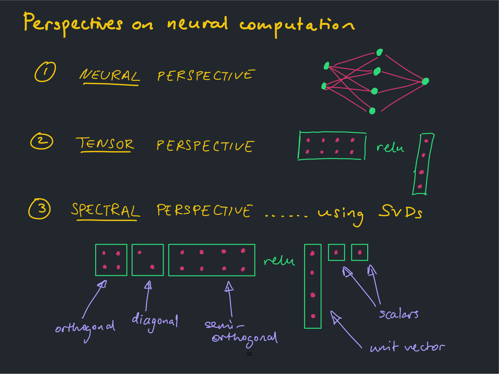

# Lecture 7 — Scaling Rules for Optimization: slide-by-slide

A slide-by-slide transcription of all 32 pages of
[`mit6_7960_f24_lec7.pdf`](https://ocw.mit.edu/courses/6-7960-deep-learning-fall-2024/mit6_7960_f24_lec7.pdf),
the handwritten (iPad) deck by Jeremy Bernstein. Cite these as "slide N" — the printed number equals the PDF page number for slides 1–31; slide 32 is OCW's appended end page. The deck is handwritten prose, equations and hand-drawn diagrams in several ink colours, mostly on a dark background; the title, the dividers and the references (slides 1, 8, 20, 27, 31), and slides 5 and 16–18, are white with a coloured or dark band at the right edge; all of it is read visually from the page images, and diagrams and plots are described in prose since the KB is read as text.

Companion pages: [wiki page for this lecture](../../wiki/07-scaling-rules-for-optimization.md) ·
[transcript](../transcripts/07-scaling-rules-for-optimization.md)

## Contents

| Slides | Section |
| ------ | ------- |
| 1–7 | Title; plan; the machine learning puzzle; the optimization problem; what makes it hard; scaling woes (width and depth plots) |
| 8–15 | Classical methods: survey; Taylor expansion of the loss; Newton's method and its problems; the Gauss-Newton decomposition, method and problems |
| 16–19 | First-order methods: steepest descent in a general model; $\ell_2$ (vanilla gradient descent); $\ell_\infty$ (sign gradient descent); general norm and the dual norm |
| 20–26 | Heuristics for scaling: how large should updates be; perspectives on neural computation; the spectral norm; the RMS-RMS operator norm; spectrally controlled updates (width); depth scaling |
| 27–30 | Building a theory: modularization; modules, atomic modules, combination rules |
| 31 | References |
| 32 | MIT OpenCourseWare end page |

---

## Slide 1 — Scaling Rules for Optimization

Title page: white, with a pale-pink vertical band at the right, as on the divider pages. Handwritten title (black ink) sitting on a thick black horizontal rule that runs the full width of the page: "Scaling Rules for Optimization". Below the rule, typed: "Jeremy Bernstein" (black) and, in dark grey monospace, "jbernstein@mit.edub" (printed as such [sic]). A black MIT logo at right, straddling the left edge of the pink band. At the bottom left, typed in dark grey monospace: "6.7960 :: Lecture" followed by a handwritten "7". Slide number 1 at bottom centre.

## Slide 2 — Plan for today

Handwritten yellow heading: "Plan for today". Four yellow lines: "introduce the optimization problem"; "cover some classical approaches"; "heuristic picture of scaling"; "modularizing the theory".

Beside "cover some classical approaches", three red-orange lines fan out from its right end to three red-orange labels: "Newton", "Gauss-Newton", "steepest descent". Beside "heuristic picture of scaling", two green lines run from the end of the phrase to two green labels: "width" and "depth".

## Slide 3 — The machine learning puzzle

Handwritten yellow heading: "The machine learning puzzle". Yellow line: "Three pieces to the puzzle:". Then three numbered items, each number circled in yellow, each name yellow and underlined, each followed by a question in its own colour:

1. "Approximation" — green: "Does there exist a neural net in my model family that fits the training data?" ("exist" underlined)
2. "Optimization" — blue: "If it does exist, can I find it?" ("find" underlined)
3. "Generalization" — pink: "Does it work well on unseen data?" ("work well" and "unseen" underlined)

At the bottom, yellow: "This lecture will focus mainly on the second question."

## Slide 4 — The optimization problem: formal statement

Handwritten yellow heading: "The optimization problem: formal statement". Rows, each a labelled item:

- Pink label "neural net", with red-pink $f(x, w)$ (the handwriting is plain lowercase $x$ and $w$).
- Green label "error measure", with green $\ell(\hat{y}, y)$ (a lowercase ℓ written without a loop, its foot hooked up to the right: the same glyph as slide 13's "error ℓ", and distinct from the looped script $\mathcal{L}$ of the loss and from the deck's capital L). Two yellow curved lines run from $\hat{y}$ to the yellow word "prediction" and from $y$ to the yellow word "target".
- Purple label "training data", with $(x^{(1)}, y^{(1)}), \ldots, (x^{(N)}, y^{(N)})$.
- Blue label "loss function", with

$$\mathcal{L}(w) = \frac{1}{N} \sum_{i=1}^{N} \ell\left(f(x^{(i)}, w), y^{(i)}\right)$$

  the loss $\mathcal{L}$ written as a script L, the per-example error as the same ℓ glyph as above; the whole row, ℓ included, is blue.
- Yellow, "GOAL" (underlined): "find $w$ that minimizes $\mathcal{L}(w)$".

## Slide 5 — The optimization problem: a picture

The page is white, with a dark band at the right edge. Handwritten yellow heading: "The optimization problem: a picture". Yellow axes: the vertical axis labelled $\mathcal{L}(w)$, ending in an open arrowhead at its top; the horizontal axis labelled $w$ (it starts slightly left of the vertical axis, crosses it low down and runs to a yellow arrowhead at right). A blue smooth convex-looking curve starts high at the upper left, descends steeply past the vertical axis, reaches a minimum a little right of it, then rises gently towards the upper right. Two magenta dots: one at the minimum, with magenta capitals "FIND THIS POINT" above it; one far up the right branch of the curve, with magenta capitals "START HERE" to its right.

Below, yellow: "roughly, we just iterate" and

$$w \longrightarrow w - \eta \frac{\partial \mathcal{L}}{\partial w}$$

A green arrow from the green words "learning rate" points at $\eta$; a green arrow from the green word "gradient" points at $\frac{\partial \mathcal{L}}{\partial w}$.

## Slide 6 — What makes optimization hard?

Handwritten yellow heading: "What makes optimization hard?". Yellow: "Some examples:" and three circled-number items: "① size: a lot of weights"; "② depth: a lot of layers"; "③ noise: a lot of data". Below ③, a small double arrow pointing down to "must use mini-batches".

At the bottom, in red-orange: "In this lecture, we will just study full-batch optimization..." then, indented, "... it's already interesting."

At right, a hand-drawn feed-forward network: green dots (units) joined by dense crossing magenta lines. From bottom to top the layers hold 3, 10, 7 and 4 dots, and a single output dot at the top (25 dots). A purple upward arrow below the bottom layer is labelled $x$; a purple upward arrow above the top dot is labelled $f(x; w)$ (written with a semicolon here, where slide 4 used a comma).

## Slide 7 — Scaling woes

*OCW notice: © @kellerjordan0 on X. All rights reserved. This content is excluded from our Creative Commons license.*

Handwritten yellow heading: "Scaling woes". At top centre, a hand-drawn network (green dots, dense magenta lines) shaped like a lens: a wide middle row of about ten dots, with three dots above and three below, joined by crossing lines. Four yellow arrows point away from it: up above, down below, left (from its left end) and right (from its right end). Yellow text "scale width" at lower left and "scale depth" at lower right.

Below, two white-background hand-drawn-style line plots (screenshots from a post by @kellerjordan0 on X, per the printed notice), side by side, each with a legend. Both plots have the vertical axis "training loss" and the horizontal axis "learning rate". Neither axis shows tick values, and no axis scale (log or linear) is stated; both are framed by a wobbly hand-drawn box.

Left plot, titled "optimal learning rate drifts": legend titled "width" with six series, 32, 64, 128, 256, 512, 1024, coloured from dark purple (32) through blue-purple (64), teal-blue (128), teal (256), green (512) to yellow (1024). Each series is a U-shaped curve of training loss against learning rate, rising steeply on the right.
- width 32 (dark purple): starts at the upper left of the cluster at a middling learning rate; its minimum is the right-most and highest of the minima, about half-way across the plot and in its lower third; it then rises to the top right corner, the highest end point of the plot.
- width 64 (blue-purple): minimum a little to the left of and lower than width 32's.
- width 128 (teal-blue): minimum further left and lower.
- width 256 (teal): further left and lower.
- width 512 (green): further left and lower.
- width 1024 (yellow): left-most and lowest minimum, near the bottom left of the box; its right branch ends lowest and left-most of the six.

The six minima thus step down and to the left as width grows. A thick red arrow runs from the minimum of the purple (width 32) curve down and left to the minimum of the yellow (width 1024) curve, marking the drift of the optimal learning rate with width. Low down, the right-hand branches of the wider networks' curves cross up through the region of the narrower ones' minima; above that the six right branches run as separate, near-parallel lines (none noticeably steeper) to six end points that step down and to the left from width 32's (top right corner) to width 1024's. Their left ends likewise step left and down from 32 to 1024.

Right plot, titled "deeper performs worse": legend titled "depth" with six series, 32, 64, 128, 256, 512, 1024, with the same colours (dark purple for 32 up to yellow for 1024). Each is a lopsided U running the full width of the plot, flat on the left and rising much more on the right, all with their minima at about the same learning rate (about 30% of the way across), stacked vertically with no crossings.
- depth 32 (dark purple): lowest curve.
- depth 64 (blue-purple): above 32.
- depth 128 (teal-blue): above 64.
- depth 256 (teal): above 128.
- depth 512 (green): above 256.
- depth 1024 (yellow): top curve.

Each curve sits above the previous one by roughly equal steps. A thick red arrow points straight up at that common learning rate, from the minimum of the purple curve to the minimum of the yellow one: deeper networks reach a higher training loss at their best learning rate, which does not move. [In the recording the lecturer says the depth curves increase in depth "as I go down" (≈10:04), the reverse of the plot and its legend, where the deeper networks' curves are higher; and he calls width 32's curve "the dark blue curve" (≈10:49), the darkest one.]

Along the bottom, typed in white: "© @kellerjordan0 on X. All rights reserved. This content is excluded from our Creative Commons license. For more information, see https://ocw.mit.edu/help/faq-fair-use/".

## Slide 8 — Classical 1st and 2nd Order Methods

Section divider on a white page with a pale-blue band at the right. Handwritten black title on a thick black rule: "Classical 1st and 2nd Order Methods" (the "st" and "nd" written as superscripts).

## Slide 9 — Let's survey some optimization methods

Handwritten yellow heading: "Let's survey some optimization methods". Yellow: "We will look at:". Two bullets:

- "first-order methods" — a line to "use 1st derivatives"; beneath, green: "gradient $g = \frac{\partial \mathcal{L}}{\partial w}$".
- "second-order methods" — a line to "use 2nd derivatives"; beneath, blue: "Hessian $H = \frac{\partial^2 \mathcal{L}}{\partial w^2}$".

At the bottom, red-orange: "Will try to highlight modelling assumptions and potential downsides of the different methods".

## Slide 10 — Taylor expanding the loss

Handwritten yellow heading: "Taylor expanding the loss". A small red-orange scribble sits to the left of an orange two-line remark: "Different classical approaches to optimization take this Taylor expansion as a starting point".

Displayed (yellow), with the written equation:

$$\mathcal{L}(w + \Delta w) = \mathcal{L}(w) + \frac{\partial \mathcal{L}}{\partial w}^{T} \Delta w + \frac{1}{2} \Delta w \frac{\partial^2 \mathcal{L}}{\partial w^2} \Delta w + \cdots$$

(the transpose $T$ is written as a superscript on the first derivative; on the second-order term no transpose is written on the first $\Delta w$, as printed). A purple brace under the first two terms (from $\mathcal{L}(w)$ through the linear term) is labelled "linearization" in quotation marks; a blue brace under the quadratic term is labelled "non-linear part" in quotation marks. The next line, yellow:

$$= \mathcal{L}(w) + g^{T} \Delta w + \frac{1}{2} \Delta w \thinspace H \thinspace \Delta w + \cdots$$

At the bottom: purple $g = \frac{\partial \mathcal{L}}{\partial w}$ with "gradient" in quotation marks, a line, and "vector in $\mathbb{R}^d$"; blue $H = \frac{\partial^2 \mathcal{L}}{\partial w^2}$ with "Hessian" in quotation marks, a line, and "matrix in $\mathbb{R}^{d \times d}$".

## Slide 11 — Second-order optimization: Newton's method

Handwritten yellow heading: "Second-order optimization: Newton's method". Pink: "Take the Taylor expansion to second-order:". Yellow equation:

$$\mathcal{L}(w + \Delta w) \approx \mathcal{L}(w) + g^{T} \Delta w + \frac{\lambda}{2} \Delta w^{T} H \Delta w$$

(the coefficient of the quadratic term is a $\lambda$ over a 2, where slide 10 had a 1 over 2; the recording confirms it: "lambda over 2 times 2, h delta w", ≈18:46). Pink: "and minimize the RHS with respect to $\Delta w$". Pink: "Take derivative and set to zero", then green $g + \lambda H \Delta w = 0$. Then a yellow $\Rightarrow$ and, in a green box to its right (top and bottom rules and side bars), $\Delta w = - H^{-1} g$, with green "Newton's method" beside it. At the bottom, pink in quotation marks: "pre-condition the gradient with the inverted Hessian". Note that the boxed result has no $\lambda$ in it, though the line above it does; the slide does not comment on this.

## Slide 12 — Second-order optimization: Problems w/ Newton

Handwritten yellow heading: "Second-order optimization: Problems w/ Newton". Top row repeats slide 11's result: green "Newton's method" beside the green-boxed $\Delta w = - H^{-1} g$, and pink "pre-condition the gradient with the inverted Hessian" in quotation marks. Blue underlined heading: "Problems with Newton's method". Blue bullets: "might converge to local max" with the sub-line "can fix with "cubic regularization""; $d$ "parameters $\Rightarrow$ Hessian is $d \times d$" with the sub-line "too expensive even for "small" networks".

At the bottom, two purple-outlined shapes with yellow dimension arrows. Left: $g =$ and a tall thin rectangle, a yellow double arrow beside it labelled $d$ (its height) and a small yellow double arrow below it labelled 1 (its width). Right: $H =$ (lavender, like $g =$ and both outlines) and a large square, a yellow double arrow at its right labelled $d$ (height) and one below it labelled $d$ (width). The picture contrasts the $d \times 1$ gradient with the $d \times d$ Hessian.

## Slide 13 — Composite optimization: the GN decomposition

Handwritten yellow heading: "Composite optimization: the GN decomposition". Two orange arrows run from orange labels "Gauss!" and "Newton!" up to the letters "G" and "N" of "GN". Purple: "Suppose we have a "composite" objective $\mathcal{L} = \ell \circ f$" and the second line "— e.g. error $\ell$ composed with neural net $f$" (the $\ell$ is a script-style ℓ; the lecturer's $\mathcal{L}$ is the script capital). Two blue equations, joined on the left by an orange brace-shaped stroke (a hook at the top, a small loop at mid-height) that ends in a downward arrowhead, running from the first equation to the second:

$$\frac{\partial \mathcal{L}}{\partial w} = \frac{\partial \ell}{\partial f} \cdot \frac{\partial f}{\partial w}$$

with an orange arrow pointing at its right end from the orange label "chain rule", and

$$\frac{\partial^2 \mathcal{L}}{\partial w^2} = \frac{\partial f}{\partial w} \cdot \frac{\partial^2 \ell}{\partial f^2} \cdot \frac{\partial f}{\partial w} + \frac{\partial \ell}{\partial f} \frac{\partial^2 f}{\partial w^2}$$

with an orange arrow pointing at its right end from the orange label "product rule + chain rule". No transpose is written on the first $\frac{\partial f}{\partial w}$ in this slide. Bottom, purple: "we call the second result the "Gauss-Newton" decomposition of the Hessian".

## Slide 14 — Composite optimization: the GN method

Handwritten yellow heading: "Composite optimization: the GN method". Purple: "Given composite loss function $\mathcal{L} = \ell \circ f$". Blue equation, as on slide 13:

$$\frac{\partial^2 \mathcal{L}}{\partial w^2} = \frac{\partial f}{\partial w} \cdot \frac{\partial^2 \ell}{\partial f^2} \cdot \frac{\partial f}{\partial w} + \frac{\partial \ell}{\partial f} \frac{\partial^2 f}{\partial w^2}$$

Orange labels with arrows beneath: "full Hessian H" under the left side, "curvature of error" under the middle term, "curvature of model" under the last term.

Lavender numbered items (circled numbers, in the same ink as "Given composite loss function"): "① for square loss, $\ell = \frac{1}{2}(f - y)^2$, we have $\frac{\partial^2 \ell}{\partial f^2} = 1$"; "② ignore the curvature of the model" followed by a small yellow upside-down smiley-face emoji (the 59×59 pixel image on this page). Purple: $\Rightarrow$ "Newton's method becomes", then in a green box

$$\Delta w = - \left[ \frac{\partial f}{\partial w} \frac{\partial f}{\partial w} \right]^{-1} g$$

with green "Gauss Newton method" beside it. The opening bracket's top bar is drawn as a separate short stroke with a curl at its left end; it is not a transpose. As written, the two factors are identical, with no transpose on either, and the matrix product only makes sense if the first is transposed (the lecturer reads it as "df by dw df by dw inverse g" and warns "you need to be careful about all the indexing", ≈25:54).

## Slide 15 — Composite optimization: Problems w/ GN method

Handwritten yellow heading: "Composite optimization: Problems w/ GN method". The green-boxed Gauss-Newton update of slide 14 is repeated at the top (same equation, with the same detached top bar on the opening bracket and no transpose, and the same green label "Gauss Newton method"). Yellow numbered items: "① requires computing extra derivatives $\frac{\partial f}{\partial w}$"; "② is it safe to ignore curvature of the model?".

At the bottom, the blue decomposition again:

$$\frac{\partial^2 \mathcal{L}}{\partial w^2} = \frac{\partial f}{\partial w} \cdot \frac{\partial^2 \ell}{\partial f^2} \cdot \frac{\partial f}{\partial w} + \frac{\partial \ell}{\partial f} \frac{\partial^2 f}{\partial w^2}$$

with a dark-red cross struck through the last term, and the orange labels "full Hessian H", "curvature of error" and "curvature of model" as on slide 14.

## Slide 16 — First-order optimization: Steepest descent

The page is white, with a dark band at the right edge; the trailing dots, the right end of the blue brace and the right end of the orange box run onto the band. Handwritten yellow heading: "First-order optimization: Steepest descent". Blue: "Take the Taylor expansion:". Yellow equation:

$$\mathcal{L}(w + \Delta w) = \mathcal{L}(w) + g^{T} \Delta w + \frac{1}{2} \Delta w^{T} H \Delta w + \cdots$$

A blue brace under the quadratic term and the dots is labelled blue "non-linear part"; beneath it, blue: $\hookrightarrow$ "model with $\frac{\lambda}{2} \lVert \Delta w \rVert^2$" (a hooked arrow at the start of the line, pointing right at "model with"). The brace's label carries no quotation marks on this slide. Then an orange-red box labelled "model" with a curly brace:

$$\mathcal{L}(w + \Delta w) \approx \mathcal{L}(w) + g^{T} \Delta w + \frac{\lambda}{2} \lVert \Delta w \rVert^2$$

The norm carries no subscript on this slide.

## Slide 17 — First-order optimization: $\ell_2$ steepest descent

The page is white, with a dark band at the right edge. Handwritten yellow heading: "First-order optimization: $\ell_2$ steepest descent" (written as the deck's hooked-foot ℓ with subscript 2). Orange-red boxed "model" equation:

$$\mathcal{L}(w + \Delta w) \approx \mathcal{L}(w) + g^{T} \Delta w + \frac{\lambda}{2} \lVert \Delta w \rVert_2^2$$

A pink brace under the norm is labelled pink "Euclidean norm". On the left, a sketch: yellow axes labelled $w_2$ (vertical) and $w_1$ (horizontal), with two concentric purple circles centred at the origin, the inner one about half the outer's radius. A pink curly brace to their right is labelled pink "Euclidean balls".

Yellow: "Minimize RHS of model wrt $\Delta w$", $\Rightarrow$ "differentiate and set derivative to zero", $\Rightarrow$ $g + \lambda \Delta w = 0$, and then a yellow $\Rightarrow$ and, in a green box to its right, $\Delta w = - \frac{1}{\lambda} g$, with green "vanilla gradient descent!" beside it.

## Slide 18 — First-order optimization: $\ell_\infty$ steepest descent

The page is white, with a dark band at the right edge. Handwritten yellow heading: "First-order optimization: $\ell_\infty$ steepest descent". Orange-red boxed "model" equation:

$$\mathcal{L}(w + \Delta w) \approx \mathcal{L}(w) + g^{T} \Delta w + \frac{\lambda}{2} \lVert \Delta w \rVert_\infty^2$$

A pink brace under the norm is labelled pink "infinity norm". On the left, a sketch: yellow axes $w_2$ (vertical) and $w_1$ (horizontal), with two concentric purple squares (axis-aligned) centred at the origin, the inner about half the width of the outer. A pink brace to their right is labelled pink "infinity balls".

Yellow: "Minimize RHS of model wrt $\Delta w$", then $\Rightarrow$ "<do homework>" (in angle brackets, as written). Then a yellow $\Rightarrow$ and, in a green box to its right,

$$\Delta w = - \frac{\lVert g \rVert_1}{\lambda} \operatorname{sign}(g)$$

with green "sign gradient descent!" beside it. The subscript on $\lVert g \rVert$ is a short vertical stroke, a 1; the recording confirms it: "the L1 norm of the gradient divided by lambda times the [sign] of the gradient" (≈39:07).

## Slide 19 — First-order optimization: General steepest descent

Handwritten yellow heading: "First-order optimization: General steepest descent". Orange-red boxed "model" equation with a curly brace:

$$\mathcal{L}(w + \Delta w) \approx \mathcal{L}(w) + g^{T} \Delta w + \frac{\lambda}{2} \lVert \Delta w \rVert^2$$

A pink brace under the norm is labelled pink "general norm". Yellow: "minimizing the right had side [sic] with respect to $\Delta w$ has a "dual formulation"" (the word is written "had", with no n). Then the displayed equation, with the left side in blue, the middle quantity in purple and the right part in orange:

$$\underset{\Delta w}{\operatorname{argmin}} \left[ g^{T} \Delta w + \frac{\lambda}{2} \lVert \Delta w \rVert^2 \right] \equiv \frac{\lVert g \rVert^{\dagger}}{\lambda} \underset{t : \lVert t \rVert = 1}{\operatorname{argmax}} \thinspace g^{T} t$$

A green $\equiv$ sits between the two sides (written as a three-line equivalence sign). The argmax term is a darker burnt orange than the red-orange brace and label beneath it. The superscript on $\lVert g \rVert$ is a small cross, a dagger $\dagger$, the same mark as in the bottom line's $\lVert \cdot \rVert^{\dagger}$. A purple arrow from the purple word "step size" points at $\frac{\lVert g \rVert^{\dagger}}{\lambda}$; an orange brace under the argmax term is labelled orange "step direction". Bottom, yellow: "where $\lVert \cdot \rVert^{\dagger}$ is the "dual norm" to $\lVert \cdot \rVert$".

## Slide 20 — Heuristics for Scaling

Section divider on a white page with a pale-green band at the right. Handwritten black title on a thick black rule: "Heuristics for Scaling".

## Slide 21 — How large should the weight updates be?

Handwritten yellow heading: "How large should the weight updates be?". Pink: "We want the "Goldilocks" update size..." and, indented, "... not too big, not too small". Yellow: "But always ask:" followed by a yellow-boxed "in which norm?". Blue underlined "observation", followed by blue: "a neural net is built out of weight matrices". Yellow: "perhaps we could try a matrix norm?". Green, with "e.g." to its left, a list: "Frobenius norm", "spectral norm", "nuclear norm", and a vertical column of dots (continuing the list).

## Slide 22 — Perspectives on neural computation

Handwritten yellow heading: "Perspectives on neural computation". Three circled-number items in yellow capitals, the first word of each underlined:

1. "NEURAL PERSPECTIVE" — at right, a small network: two green dots in a left column, four in a middle column and one at the right, with magenta lines from each left dot to the middle dots and from every middle dot to the output dot.
2. "TENSOR PERSPECTIVE" — at right, a green-outlined wide rectangle holding eight magenta dots (two rows of four), then the green word "relu", then a tall narrow green-outlined rectangle holding four magenta dots in a column. This shows a weight matrix, a relu, and a vector.
3. "SPECTRAL PERSPECTIVE ...... using SVDs" — below, a row of green-outlined boxes with magenta dots: a small square box with four dots (two by two), a square box with two dots on a diagonal, and a wide box with eight dots (two rows of four); then green "relu"; then a tall narrow box with four dots in a column, followed by two small square boxes each with one dot. Purple arrows and labels point at them: "orthogonal" at the first box, "diagonal" at the second, "semi-orthogonal" (broken across two lines) at the wide box, "unit vector" at the tall narrow box, and "scalars" at both small boxes (two arrows). This reads as an SVD-style factorization of the matrix in the tensor view into orthogonal, diagonal and semi-orthogonal factors, with the vector written as a scalar times a unit vector.

## Slide 23 — The spectral norm

Handwritten yellow heading: "The spectral norm". A cartoon: a green rectangle labelled green "Matrix $M$", with angry eyebrows, two dots for eyes and a jagged-toothed mouth, speaking a green speech bubble "Grrr..."; beside it a thin purple rectangle labelled purple "Vector $v$", with a smiling face, speaking a large purple speech bubble "What's the worst he can do?".

Yellow: "Spectral norm"

$$\lVert M \rVert_\ast = \max_{v \neq 0} \frac{\lVert M v \rVert_2}{\lVert v \rVert_2}$$

(the subscript on the left norm is a six-pointed star, $\ast$; every $M$ in the equation is green and every $v$ purple, including the $v$ of $v \neq 0$; the norm bars, subscripts and "max" are yellow). Yellow: "Answers question: how much can a matrix scale up the Euclidean norm of a vector?". Then "FACT" (underlined): "spectral norm $\equiv$ largest singular value".

## Slide 24 — The RMS-RMS operator norm

Handwritten yellow heading: "The RMS-RMS operator norm". The same cartoon as slide 23: green "Matrix $M$" saying "Grrr...", purple "Vector $v \in \mathbb{R}^d$" saying "What's the worst he can do?" (the label here adds $\in \mathbb{R}^d$).

Yellow: "Equip vectors in $\mathbb{R}^d$ with the RMS norm"

$$\lVert \cdot \rVert_{\text{RMS}} = \frac{1}{\sqrt{d}} \lVert \cdot \rVert_2$$

Yellow: "RMS-RMS operator norm"

$$\lVert M \rVert_{\text{RMS-RMS}} = \max_{v \neq 0} \frac{\lVert M v \rVert_{\text{RMS}}}{\lVert v \rVert_{\text{RMS}}}$$

Orange: "Interpretation" (underlined) $\lVert \cdot \rVert_{\text{RMS-RMS}}$ "constrains how much a matrix can change the RMS norm of its input". Blue: "Exercise" (underlined) "show that"

$$\lVert \cdot \rVert_{\text{RMS-RMS}} = \sqrt{\frac{d_{\text{in}}}{d_{\text{out}}}} \thinspace \lVert \cdot \rVert_\ast$$

with the same star subscript $\ast$ as on slide 23, $d_{\text{in}}$ in the numerator and $d_{\text{out}}$ in the denominator under one radical.

## Slide 25 — Spectrally controlled weight updates

*OCW notice: © @kellerjordan0 on X. All rights reserved. This content is excluded from our Creative Commons license.*

Handwritten yellow heading: "Spectrally controlled weight updates". Left, yellow: "recall our scaling woes", and under it a lens-shaped hand-drawn network (green dots, dense magenta lines: a wide middle row of about ten dots, three dots above and three below), with a yellow arrow pointing left from its left end and one pointing right from its right end (width scaling).

At upper right, a copy of slide 7's left plot (a screenshot from a post by @kellerjordan0 on X, per the notice printed beneath it), titled "optimal learning rate drifts". Vertical axis "training loss", horizontal axis "learning rate"; no tick values and no stated scale. Legend "width" with six series, 32, 64, 128, 256, 512 and 1024, coloured dark purple to yellow as on slide 7. It shows the same figure as on slide 7:
- width 32 (dark purple): the right-most, highest minimum, about half-way across and in the plot's lower third; its right branch climbs to the top right, the highest end point.
- width 64 (blue-purple), 128 (teal-blue), 256 (teal), 512 (green): four more U-shaped curves whose minima step down and to the left in that order, their right branches overlapping.
- width 1024 (yellow): the left-most and lowest minimum, near the bottom left; its right branch ends lowest and left-most. The right branches cross low down and then run as separate, near-parallel lines, as on slide 7. [The embedded image is a re-encoding of slide 7's left plot.]

A thick red arrow runs from the width-32 minimum down and to the left to the width-1024 minimum. The printed notice under the plot reads: "© @kellerjordan0 on X. All rights reserved. This content is excluded from our Creative Commons license. For more information, see https://ocw.mit.edu/help/faq-fair-use/".

Below, yellow: "claim" (underlined) ": to remove drift in optimal learning rate as width is varied, for all layers $\ell = 1, \ldots, L$, do:" (the layer index is the deck's hooked-foot ℓ, as in the subscripts of $W_\ell$ and $\Delta W_\ell$, with $L$ capital). Two circled-number items: "① initialize weights so that $\lVert W_\ell \rVert_{\text{RMS-RMS}} \sim 1$." and "② scale updates so that $\lVert \Delta W_\ell \rVert_{\text{RMS-RMS}} \sim 1$." (the symbol after the norm is a tilde, read as $\sim$). Last line, yellow: "See homework!".

## Slide 26 — Depth scaling

*OCW notice: © @kellerjordan0 on X. All rights reserved. This content is excluded from our Creative Commons license.*

Handwritten yellow heading: "Depth scaling". Left, the same lens-shaped network as on slide 25 with a yellow arrow pointing up above it and one pointing down below it (depth scaling).

At upper right, a copy of slide 7's right plot (a screenshot from a post by @kellerjordan0 on X, per the notice printed beneath it), titled "deeper performs worse". Vertical axis "training loss", horizontal axis "learning rate"; no tick values and no stated scale. Legend "depth" with six series, 32, 64, 128, 256, 512 and 1024, dark purple to yellow. As on slide 7 (the embedded image is a re-encoding of slide 7's right plot):
- depth 32 (dark purple): the lowest U-shaped curve.
- depth 64 (blue-purple), 128 (teal-blue), 256 (teal), 512 (green): four curves stacked in that order above it, with their minima at about the same learning rate and no crossings.
- depth 1024 (yellow): the top curve.

A thick red arrow points straight up through the common minimum, from the depth-32 curve to the depth-1024 curve. The printed notice under the plot reads: "© @kellerjordan0 on X. All rights reserved. This content is excluded from our Creative Commons license. For more information, see https://ocw.mit.edu/help/faq-fair-use/". A stray dot sits at the right edge of the slide beside the plot.

Below, yellow: "the trick seems to be to parameterize your residual block the "right" way". Orange: "recall that"

$$\lim_{L \to \infty} \left(1 + \frac{x}{L}\right)^{L} = \exp(x)$$

Yellow: "so build your residual block like", then purple

$$x \longrightarrow x + \frac{1}{L} \operatorname{layer}(x) \thinspace ?$$

with yellow "needs more research" (three lines) to its right; the "?" is yellow too.

## Slide 27 — Building a Theory: Modularization

Section divider on a white page with a pale-orange band at the right. Handwritten black title on a thick black rule: "Building a Theory: Modularization". A hand-drawn black arrow below the rule points up at the word "Modularization" from the handwritten words "my research, so be skeptical".

## Slide 28 — Building a modular theory

Handwritten yellow heading: "Building a modular theory". Yellow: "IDEA: if you want an optimization theory that handles complicated neural networks" and, indented, "... build the theory with the neural net". 

Diagram: a green box labelled green "Module". Two green arrows enter it from the left, labelled in purple $x \in \mathcal{X}$ (upper) and $w \in \mathcal{W}$ (lower); a pink arrow from the pink word "inputs" points at the upper one and a pink arrow from the pink word "weights" points at the lower one. One green arrow leaves it on the right, labelled purple $y \in \mathcal{Y}$, with a pink arrow from the pink word "outputs" pointing at it. The script letters are written as script $\mathcal{X}$, $\mathcal{W}$, $\mathcal{Y}$.

## Slide 29 — Write a library of "atomic modules"

Handwritten yellow heading: "Write a library of "atomic modules"". A green zigzag scribble at the left margin. Green: "Definition" (underlined) "module $M$". Three green method names, each with a pink type signature:

- "M.forward" — $\mathcal{W} \times \mathcal{X} \to \mathcal{Y}$
- "M.backward" — $\mathcal{Y} \times \mathcal{W} \times \mathcal{X} \to \mathcal{W} \times \mathcal{X}$
- "M.norm" — $\mathcal{W} \to \mathbb{R}$

Below, a yellow list "Linear", "Embedding", "Conv2D", "ReLU" with a yellow curly brace pointing to yellow: "all with hand-specified forward, backward and norms".

## Slide 30 — Write combination rules

Handwritten yellow heading: "Write combination rules". Yellow: "e.g. module composition $M = M_2 \circ M_1$". Below, three yellow method names in a column, "M.forward", "M.backward", "M.norm", each with a purple arrow pointing at it from a purple note:

- to "M.forward": "just compose $M_2$.forward with $M_1$.forward"
- to "M.backward": "do the chain rule"
- to "M.norm": "how should we combine $M_2$.norm and $M_1$.norm?"

## Slide 31 — References

A typed black heading "References" on a white page with a lilac band at the right and a lilac blob at lower left. Four entries, each beside a small book or notebook icon (six small book-icon images are embedded on this page; four are visible beside the entries: a red book, a yellow notebook, an orange notebook and a black-and-white composition notebook. The fifth and sixth, a green and a blue book, are drawn but fully covered by the opaque lilac blob at lower left). Each entry has a handwritten black title and a handwritten grey citation line:

- "Feature Learning in Infinite Width Neural Networks" — "Yang & Hu (2020)"
- "Infinite Limits of Multi-Head Transformer Dynamics" — "Bordelon, Chaudhury & Pehlevan (2024)"
- "Scalable Optimization in the Modular Norm" — "Large et al (2024)"
- "Universal Majorization-Minimization Algorithms" — "Streeter (2023)"

## Slide 32 — MIT OpenCourseWare end page

OCW's appended end page, typed on white and not part of the lecture: "MIT OpenCourseWare", the link https://ocw.mit.edu, "6.7960 Deep Learning", "Fall 2024", and "For information about citing these materials or our Terms of Use, visit: https://ocw.mit.edu/terms". A small "32" is visible at the bottom centre of the render.
