# Lecture 9 — Hacker's Guide to Deep Learning: slide-by-slide

Text and figures of all 72 pages of
[`mit6_7960_f24_lec9.pdf`](https://ocw.mit.edu/courses/6-7960-deep-learning-fall-2024/mit6_7960_f24_lec9.pdf),
transcribed from the deck (speaker: Phillip Isola; the deck's title slide reads "Lecture 9: Hacker's guide to DL" and its outline slide "9. Hacker's guide to DL"). Cite these as "slide N" — the printed number equals the PDF page number for slides 1–71; page 72 is OCW's appended end page. Diagrams, plots, screenshots and photographs are described in prose since the KB is read as text.

**Images.** 11 slides carry a whole-slide render under their heading: 10, 14, 15, 19–24, 34 and 57. Not rendered: the 21 slides with an OCW "All rights reserved" notice (3, 4, 7, 13, 16, 17, 18, 28, 30–33, 35–39, 58, 60, 61 and 71); text, equations and code this file reproduces exactly, including screenshots of code, text and a table (2, 5, 6, 8, 9, 11, 12, 25–27, 29, 40–56, 59 and 62–70; slide 68's small creature picture is a variant of slide 57's, and slides 46–47 add only logos and a code screenshot); and the title and end pages (1, 72). Slide 57 repeats slide 4's three output pictures without its excluded X-ray; it shares those image objects with slide 4, but slide 4's notice sits beside the X-ray, so slide 57 is rendered. Use an image path only if it appears in this file.

Companion pages: [wiki page for this lecture](../../wiki/09-hackers-guide-to-deep-learning.md) ·
[transcript](../transcripts/09-hackers-guide-to-deep-learning.md)

**Signposting slides you can skip.** Slide 1 is the title; slide 2 is the outline (Data, Model, Optimization, Evaluation/Experimentation/Debugging, Compute) with the lecture's disclaimer and acknowledgements; slide 72 is the OCW end page. The deck has no divider slides; each section is marked by a repeated slide title ("Data", "Model", "Optimization", "Evaluation", "Tuning", "Experimentation and debugging", "Common bugs", "Compute").

Some slides are **build steps** — the same slide re-shown with more revealed or one element changed: slides 19 and 20 (the fixed-data and fixed-learner diagrams), 30, 31 and 32 (colorization: training pairs, then the ab channels alone, then the colourised result), 35 and 36 (a six-layer network with the label rockfish, then yellow), 37, 38 and 39 (pixel classification: the title added, then a patch and one output pixel, then the full output), 46 and 47 (copilots), 4 and 57 (the same three output pictures). They are transcribed individually, each with a note of what it adds. Slides 3, 4, 14, 17, 18, 19, 20, 31, 32, 35, 36, 43, 58, 60 and 71 print no title; they are headed here with a description.

## Contents

| Slides | Section |
| ------ | ------- |
| 1–2 | Title and outline |
| 3–4 | Opening: hacking over theory; look at the input and the output |
| 5–25 | Data: looking at the data, inspecting tensors, standardizing, low dimensions, reshaping with einops, data augmentation and domain randomization, what a good training curve looks like, changing your data (fixed data versus fixed learner, adding information to X, big data) |
| 26–47 | Model: keep it simple, standard pretrained models, transforming a problem into a solved one (colorization to classification), softmax regression, default choices circa 2024, against batch norm, scaling, removing the nonessential, copilots |
| 48–55 | Optimization: one, few, many datapoints; sanity-checking the loss; learning rate and batch size; epochs; checkpoints; extreme settings; EMA; optimizers |
| 56–60 | Evaluation: evaluation mode, looking at the output, logging with WandB and Tensorboard |
| 61 | Tuning: the spice rack |
| 62–67 | Experimentation and debugging: scripting, pdb, common PyTorch bugs |
| 68–71 | Compute: parallelizing, saturating GPUs, cudnn benchmark, AMP, torch.compile, the Scale ML group |
| 72 | OCW end page |

---

## Slide 1 — Lecture 9: Hacker's guide to DL

Title: "Lecture 9: Hacker's guide to DL". Subtitle: "Speaker: Phillip Isola". The rest of the slide is blank.

Footer bar (grey): MIT logo, "6.7960 Deep Learning" (red), "https://phillipi.github.io/6.7960" (underlined), right side "Fall 2024". The printed slide number "1" sits just right of the URL.

## Slide 2 — 9. Hacker's guide to DL

Title as printed: "9. Hacker's guide to DL".

- Data
- Model
- Optimization
- Evaluation, Experimentation, and Debugging
- Compute

Right, in red: "Disclaimer:" (bold) and "This lecture is my personal opinions and anecdotes!"

Bottom, small print: "Acknowledgements:
Lots of slides adapted from Evan Shelhamer's "DIY Deep Learning: Advice on Weaving Nets." Builds on advice from Andrej Karpathy (http://karpathy.github.io/2019/04/25/recipe/), feedback from Isolab members and MIT community, slides from Dylan Hadfield-Menell, twitter feedback (https://twitter.com/phillip_isola/status/1576965425384263680?s=20&t=3eLg6JBYVSkacUtNlz83pA)". The URLs are underlined links.

## Slide 3 — (no title; "Part of the story of deep learning has been the (temporary) success of hacking over theory")

No separate title is printed; the single heading line reads "Part of the story of deep learning has been the (temporary) success of hacking over theory".

Two screenshots side by side.

- Left: the first page of a paper, in a serif typeface with small-caps title "Understanding Deep Learning Requires Re-thinking Generalization". Authors: Chiyuan Zhang* (Massachusetts Institute of Technology, chiyuan@mit.edu), Samy Bengio (Google Brain, bengio@google.com), Moritz Hardt (Google Brain, mrtz@google.com), Benjamin Recht† (University of California, Berkeley, brecht@berkeley.edu), Oriol Vinyals (Google DeepMind, vinyals@google.com). Then an "Abstract" whose text is legible and begins "Despite their massive size, successful deep artificial neural networks can exhibit a remarkably small difference between training and test performance." It goes on to say that conventional wisdom attributes small generalization error to properties of the model family or to regularization, that the experiments show state-of-the-art convolutional networks for image classification trained with stochastic gradient methods easily fit a random labeling of the training data, even random noise in place of the images, and that a theoretical construction shows depth-two networks have perfect finite-sample expressivity once the number of parameters exceeds the number of data points. It ends "We interpret our experimental findings by comparison with traditional models."
- Right: a screenshot of the fast.ai website header, a grey banner reading "fast.ai—Making neural nets uncool again", then five bullets with blue underlined links: "Courses: Practical Deep Learning for Coders; From Deep Learning Foundations to Stable Diffusion"; "Software: fastai for PyTorch; nbdev"; "Book: Practical Deep Learning for Coders with fastai and PyTorch"; "In the news: The Economist; The New York Times; MIT Tech Review"; "Corporate partner program: Get help with fast.ai technologies & courses from the partner program".

Small print at the lower right: "Left © Zhang, et al. Right © fast.ai. All rights reserved. This content is excluded from our Creative Commons license. For more information, see https://ocw.mit.edu/help/faq-fair-use/".

*OCW notice: © Zhang, et al. (paper first-page screenshot, left) and © fast.ai (website screenshot, right). All rights reserved — excluded from the CC license.*

## Slide 4 — (no title; "Look at the input" and "Look at the output")

No single title is printed; two large headings sit at the left, "Look at the input" (top) and "Look at the output" (lower).

Under "Look at the input", top centre: a greyscale frontal chest X-ray (lungs, heart shadow, ribs and shoulders visible) with a bright "R" marker at its upper left. Caption below it: "DeGrave, Janizek, Lee, 2020". To its right, small print: "© DeGrave, Janizek, and Lee. All rights reserved. This content is excluded from our Creative Commons license. For more information, see https://ocw.mit.edu/help/faq-fair-use/". One small dark arc sits just above the X-ray's top edge.

Under "Look at the output", three pictures side by side:

1. Left: a training-loss plot. The y-axis is labelled "Loss" (rotated) and the x-axis "epoch"; no tick values are printed. The plot has a light-grey background with a faint grid. One noisy orange curve (dots joined by a thin red-brown line through the scatter) descends from the left, but interrupted by six sharp upward spikes (counted on the embedded image), each followed by a decay again, and one isolated outlier dot that is not a spike; the largest two spikes are near the middle of the plot and reach the top, and the curve ends noisy near the bottom right.
2. Middle: a square image framed in black, filled by a regular 10 by 10 grid of dull purple-maroon tiles separated by light grey-pink lines; the tiles look like near-identical, textured, uniform patches (a grid of generated samples that all look alike).
3. Right: a square grey frame (dark black inner border, light grey outer border) with a radial grey gradient background, holding four small multi-limbed creatures (each a small body with four thin, two-segmented brown limbs): two near the top left close together, one near the centre (a little right of and above it), and one at the lower right. Two have a teal ball at the centre (upper left one and lower right one) and two have a pink-purple centre. No caption.

The notice is printed beside the top half of the X-ray, about 400 pt above the three output pictures, which sit on the other side of the "Look at the output" heading; it is taken to cover the X-ray only.

*OCW notice: © DeGrave, Janizek, and Lee (chest X-ray image). All rights reserved — excluded from the CC license.*

## Slide 5 — Data

Title "Data", with the bold heading "Look at the data!" beside it, centred.

Text: "inspect the distribution of inputs and targets"

- inspect random selection of inputs and targets to have a general sense
- histogram input dimensions to see range and variability
- histogram targets to see range and imbalance
- select, sort, and inspect by type of target or whatever else

Credit at the bottom right: "[slide adapted from Evan Shelhamer]".

## Slide 6 — Data

Title: "Data". Text: "Inspect the inliers, outliers, and neighbors:"

- visualize distribution and data, especially **outliers**, to uncover dataset issues
- look at **nearest neighbors**
- examples:
  - rare grayscale images in color dataset, huge images that should have been rescaled, corrupted class labels that had been cast to uint8

Credit: "[slide adapted from Evan Shelhamer]".

## Slide 7 — Data

Title: "Data". Text: "pre-processing: the data as it is loaded is not always the data as it is stored!"

- inspect the data as it is given to the model by `output = model(data)` (the code part in monospace)

Three photographs of the same subject in a row, a white cup of latte with a heart-shaped latte-art pattern on a white saucer, on a dark brown-brick background, a spoon handle at the lower right of the saucer. Each has a caption below.

- "original": the cup upright, brown coffee with a cream heart, handle on the right.
- "DeCAF": the same image flipped upside down (vertically mirrored), so the saucer and the cup's handle point up at the top right and the spoon at the top; the coffee heart is at the bottom.
- "Caffe": the same image with red and blue channels swapped, so the coffee looks blue and the cup is bluish-white against a dark blue-black background.

The point: the same file reaches different models differently (flipped, or with swapped colour channels) depending on the loading library.

Small print at the lower left: "Image © source unknown. All rights reserved. This content is excluded from our Creative Commons license. For more information, see https://ocw.mit.edu/help/faq-fair-use/". Credit at the bottom right: "[slide adapted from Evan Shelhamer]".

*OCW notice: © source unknown (three coffee-cup photographs: original, DeCAF, Caffe). All rights reserved — excluded from the CC license.*

## Slide 8 — Data

Title: "Data". Text: "Most important function in deep learning:". A grey-shaded code listing follows (the text layer confirms it character for character). Colour coding: `def` in blue, the parameter `X` in dark blue, `type` (the method) in teal, `print`, `format`, `min`, `max`, `mean`, `var` in olive-brown, string literals in dark red, the rest black.

```
def inspect_data(X):
  print('type:', X.type())
  print('shape:', X.shape)
  print('requires grad:', X.requires_grad)
  print('numerical range: [{:.2f}, {:.2f}]'.format(X.min(), X.max()))
  print('mean and var: {:.2f}, {:.2f}'.format(X.mean(), X.var()))
```

Below it: "A library that gives this kind of info by default: https://github.com/xl0/lovely-tensors".

## Slide 9 — Data

Title: "Data". Text: "pre-processing:"

- **standardize**:

$$x_k \leftarrow \frac{x_k - \mathbb{E}[x_k]}{\sqrt{\mathtt{Var}[x_k]}} \qquad \forall k$$

(Var is printed in a monospace typewriter font, as on the slide.)

- Squashes all your data dimensions into the same standard range
- This makes it so that, a priori, no one dimension is valued more than any other
- Important when different measurements have vastly different scales or units

## Slide 10 — Beware of low dimensions

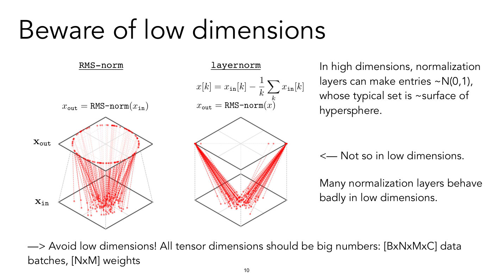

Title: "Beware of low dimensions". Two 3D diagrams side by side, each showing two stacked square planes (the lower plane labelled $x_{\text{in}}$ on the left diagram, the upper plane labelled $x_{\text{out}}$), with many red dots on the lower plane joined by thin dashed red vertical-ish lines to dots on the upper plane. Each plane is drawn in perspective as a diamond (rhombus) with faint grey axes. Dashed grey lines join the two planes: vertical box edges in the layernorm diagram, and in the RMS-norm diagram two lines slanting inward from the lower plane's side corners to the upper plane's lower edges.

- Left diagram, headed "RMS-norm" (monospace, underlined), with $x_{\texttt{out}} = \texttt{RMS-norm}(x_{\texttt{in}})$ printed above it. The red dots on the lower plane are concentrated in a blob near the centre-bottom; the dashed red lines fan upward and the dots on the upper plane form a ring, a circle drawn in perspective as an ellipse, inscribed well inside the upper plane (about 60% of its width) without touching its edges. Labels $\mathbf{x}_ {\texttt{out}}$ (upper plane, left) and $\mathbf{x}_ {\texttt{in}}$ (lower plane, left): a bold roman x with typewriter subscripts.
- Right diagram, headed "layernorm" (monospace, underlined), with the equations

$$x[k] = x_{\texttt{in}}[k] - \frac{1}{k} \sum_k x_{\texttt{in}}[k]$$

$$x_{\texttt{out}} = \texttt{RMS-norm}(x)$$

  printed above it. Here the lower plane's red dots are again concentrated near its centre, but the dashed lines run in a narrow "V" to just two points: the left corner and the right corner of the upper diamond (solid red dots at its two opposite corners; three faint dots lie on a faint dashed diagonal joining the corners, one just right of the left corner and two near the right corner). So in this low-dimensional case layernorm sends all points to two locations.

Right-hand text: "In high dimensions, normalization layers can make entries ~N(0,1), whose typical set is ~surface of hypersphere." Then, aligned with the layernorm diagram: "<— Not so in low dimensions." Then: "Many normalization layers behave badly in low dimensions."

Bottom: "—> Avoid low dimensions! All tensor dimensions should be big numbers: [BxNxMxC] data batches, [NxM] weights".

(The mean is written with $1/k$ in front of $\sum_k$, as printed.)

## Slide 11 — Data

Title: "Data". Text: "pre-processing:"

- **summary statistics**: check the min/max and mean/variance to catch mistakes like loading values in the range [0,255] when the model expects values in the range [0,1].
- **shape**: are you certain of each dimension and its size?
  - sanity check with dummy data of prime dimensions: there are no common factors, so mistaken reshaping/flattening/permuting will be more obvious. example: a 64x64x64x64 array can be permuted without knowing
- **type**: check for casting, especially to lower precision
  - what's -1 for a byte? how does standardization change integer data?

Credit: "[slide adapted from Evan Shelhamer]".

## Slide 12 — Data

Title: "Data".

- A lot of your code will just be reshaping tensors
- What does `reshape(X, (X.shape(0)*X.shape(1))` do? Is it column order or row order? (the code part in monospace; as printed, the parentheses do not balance: `reshape(X, (X.shape(0)*X.shape(1))`)
- Tools like **einops** can make it much easier to avoid mistakes
  - https://github.com/arogozhnikov/einops/tree/master/docs

Below, a screenshot of a grey-shaded code cell with a teal italic comment and one line of code:

```
# or compose a new dimension of batch and width
rearrange(ims, 'b h w c -> h (b w) c')
```

(The string is in dark red, the rest black.) Under it, the einops logo: the word "einops" in large black bold letters, one letter per pastel-coloured rectangle, in order pale pink (e), pale green (i), pale lavender (n), pale cyan (o), pale magenta (p), pale yellow (s).

## Slide 13 — Data augmentation

Title: "Data", with the heading "Data augmentation" beside it. Left, headed "*Training data*" (italics) with column labels $\mathbf{x}$ and $y$: three pairs, each drawn as a pair of braces around an image and a label with a comma after the image:

1. a clownfish (orange with white stripes) on a deep-blue background, label "Fish"
2. a grizzly bear standing upright with a raised paw on a brown-green background, label "Grizzly"
3. a colourful (blue, orange, green) chameleon on a green background, label "Chameleon"

then a vertical ellipsis. The first pair is joined by two dotted lines fanning out to four augmented pairs on the right, each drawn in braces with the label "Fish" and a name at the far right with a closing brace:

1. a larger clownfish, "Fish", "Mirror" (flipped left-right relative to the original, so its head is at the lower left where the original's is at the lower right)
2. a crop of the fish that cuts its head off at the right edge, "Fish", "Crop"
3. a crop of the same size, shifted right so that the whole head and eye are in view and the tail is cut off at the left, "Fish", "Crop"
4. the fish darkened, with a dull brown-red body on a very dark navy background, "Fish", "Darken"

The point: one training example is turned into several by label-preserving transformations (mirror, crops, darkening).

Small print at the lower left: "Image © source unknown. All rights reserved. This content is excluded from our Creative Commons license. For more information, see https://ocw.mit.edu/help/faq-fair-use/".

*OCW notice: © source unknown (clownfish, grizzly and chameleon photographs and the augmented fish images). All rights reserved — excluded from the CC license.*

## Slide 14 — (no title; "Idea: Train on randomly perturbed data, so that test set just looks like another random perturbation")

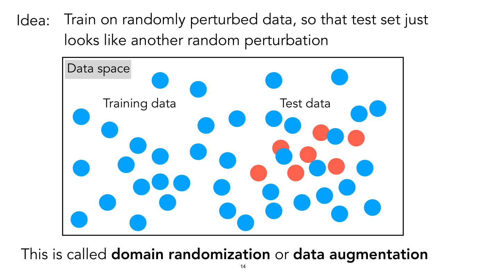

Heading text: "Idea: Train on randomly perturbed data, so that test set just looks like another random perturbation".

A wide black-bordered rectangle, with a grey label "Data space" at its upper left, contains scattered filled circles of two colours: 39 blue circles spread over the entire rectangle, and 7 red-orange circles, all clustered in the right-centre. The text "Training data" sits in the left-centre of the rectangle and "Test data" in the right-centre above the red cluster. The blue circles cover the whole space, including the region around the red circles (three blue circles overlap red ones), while the red circles are only in the "Test data" region. The counts are from the PDF's vector data.

Bottom: "This is called **domain randomization** or **data augmentation**".

Related to slide 13: it gives the idea behind augmentation.

## Slide 15 — What does a good training curve look like?

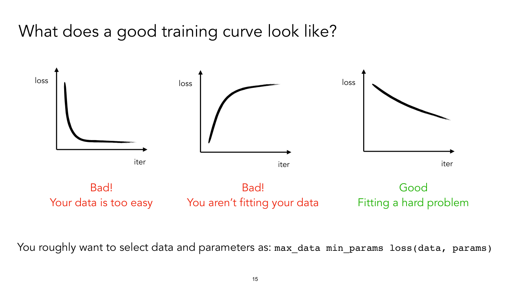

Title: "What does a good training curve look like?" Three small hand-drawn-style plots side by side, each with a vertical axis labelled "loss" and a horizontal axis labelled "iter" (no tick values), one thick black curve each.

1. Left: loss starts high at the left and drops very steeply to near zero, then runs flat along near the x-axis to the right. Caption in red: "Bad!" and "Your data is too easy".
2. Middle: loss starts near zero at the left and rises quickly, then flattens out at a high value (a concave rising curve). Caption in red: "Bad!" and "You aren't fitting your data".
3. Right: loss starts fairly high and decreases slowly and smoothly across the whole width, ending at about mid-height, without flattening. Caption in green: "Good" and "Fitting a hard problem".

Bottom: "You roughly want to select data and parameters as: `max_data min_params loss(data, params)`" (the code part in monospace).

## Slide 16 — Domain randomization

Title: "Domain randomization". The slide is divided by a vertical dotted line. Left, a grey label "Training data"; right, a grey label "Test data".

- Left: a rendered, simulated robot-scene image with flat, unrealistic colours: a periwinkle-blue background on the left and mint-green on the right, a purple floor plane, a large hot-pink box (a table) in perspective with a dark maroon front face, a small dark green cylinder on top at the left, and a dark teal block above with part of a grey arm shape (robot) at the top centre; two small black marks at the top left edge.
- Right: a real photograph of a small tan wooden table seen from above at an angle on a grey carpet, with coloured wooden geometric blocks on it: a blue cube, a blue cylinder, a yellow hexagonal prism, two red cubes (one at the back, one in the middle beside the blue cylinder), three green pyramids (left, back centre and right), red triangular pieces at the right (one or two; not resolvable at this resolution), a yellow triangular prism at the back right, a yellow half-sphere and a smaller yellow sphere half hidden at the back; a black object and a grey cart frame stand behind the table, and cables lie on the carpet.

Bottom right: "[Sadeghi & Levine 2016]" and below it "Above example is from [Tobin, Fong, Ray et al. 2017]". (The slide number "16" overprints the word "Above".) Small print at the lower left: "© Tobin, et al. All rights reserved. This content is excluded from our Creative Commons license. For more information, see https://ocw.mit.edu/help/faq-fair-use/".

*OCW notice: © Tobin, et al. (simulated training image and real test photograph). All rights reserved — excluded from the CC license. It sits directly below the left (training) image; the right photograph has no notice beneath it, and the notice is taken to cover both.*

## Slide 17 — (no title; "Domain gap between p_source and p_target will cause us to fail to generalize.")

Heading: "**Domain gap** between $p_{\text{source}}$ and $p_{\text{target}}$ will cause us to fail to generalize." Above $p_{\text{source}}$, in italics, "source domain" with an arrow pointing down-right to it; above $p_{\text{target}}$, in italics, "target domain" with "(where we actual use our model)" beneath it (as printed, "actual") and an arrow pointing down-left to it.

Below, a large black-bordered rectangle with a grey label "Space of images" at its upper left, containing two pictures and a double-headed arrow between them:

- Lower left, labelled "Source data" above: a rendered image on an orange-yellow background of a purple cylindrical robot arm holding a colourful lettered cube (letters such as A, E, P visible) in a gripping robotic hand, the hand angled down to the lower right.
- Right, labelled "Target data" below: a real photograph of a black-and-silver robotic hand with visible wires and tendons (teal and red parts behind it), palm up, holding a blue-and-red lettered cube (letters "A", "O" visible) with a green top face.
- A double-headed black arrow between the two, rising from lower left to upper right.

Small print at the lower right inside the box: "© OpenAI, Tobin, et al. All rights reserved. This content is excluded from our Creative Commons license. For more information, see https://ocw.mit.edu/help/faq-fair-use/".

*OCW notice: © OpenAI, Tobin, et al. (source and target robot-hand images). All rights reserved — excluded from the CC license.*

## Slide 18 — (no title; domain randomization results, OpenAI Learning Dexterity)

No title is printed. Three parts.

1. Top left, a table captioned "Table 1: Ranges of physics parameter randomizations." with columns "Parameter", "Scaling factor range", "Additive term range":

| Parameter | Scaling factor range | Additive term range |
| --- | --- | --- |
| object dimensions | uniform([0.95, 1.05]) | |
| object and robot link masses | uniform([0.5, 1.5]) | |
| surface friction coefficients | uniform([0.7, 1.3]) | |
| robot joint damping coefficients | loguniform([0.3, 3.0]) | |
| actuator force gains (P term) | loguniform([0.75, 1.5]) | |
| joint limits | | $\mathcal{N}(0, 0.15)$ rad |
| gravity vector (each coordinate) | | $\mathcal{N}(0, 0.4) \thinspace \text{m/s}^2$ |

(The header row is bold. A horizontal rule separates the first five rows from the last two.)

2. Top right, a grid of 18 rendered images, 6 columns by 3 rows, of a robotic hand holding a lettered cube from above, each with a different background colour (green, yellow, white, dark grey, teal, magenta, by column) and different colouring of the hand and cube: the same randomized simulation seen under different visual randomizations.

3. Lower left, a line chart. The y-axis is labelled "Consecutive Goals Achieved" with ticks 0, 10, 20, 30, 40, 50. The x-axis is labelled "Years of Experience", log-scaled, with labelled ticks 1, 10 and 100; the axis starts at 0.5, with minor ticks at 0.6–0.9 before 1. Two series, each a line with a lighter shaded band around it, and a legend at the bottom: a blue dot "All Randomizations" and a green dot "No Randomizations".
   - Green ("No Randomizations"): near 0 until about 1 year, then rises steeply between about 1 and 3 years, reaches roughly 48–50 at about 4 years and stays at about 50 out to 100 years; the band is wide during the rise.
   - Blue ("All Randomizations"): stays near 0 until about 3 years, then rises more slowly and noisily, passing 30 at about 17–18 years, about 33 at 20 years and about 40–43 at 100 years, still rising slowly; its band is wide and noisy at the right.

Right of the chart, two bullets: "High train accuracy can mean problem is too easy" and "Add more data to make problem harder". Below: "[https://openai.com/blog/learning-dexterity/]" (underlined link). Small print: "© OpenAI, Tobin, et al. All rights reserved. This content is excluded from our Creative Commons license. For more information, see https://ocw.mit.edu/help/faq-fair-use/".

*OCW notice: © OpenAI, Tobin, et al. (parameter table, randomized robot-hand images and chart). All rights reserved — excluded from the CC license.*

## Slide 19 — (no title; "In the academy we typically take data as fixed, and design models that learn from it")

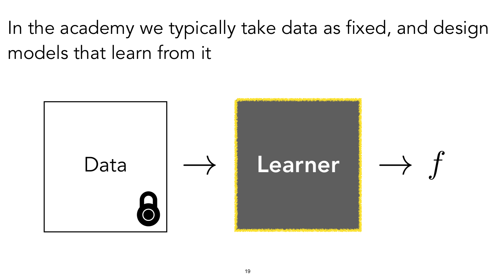

Heading text: "In the academy we typically take data as fixed, and design models that learn from it".

Diagram, left to right: a white square with a thick black border labelled "Data", with a black padlock icon at its lower right corner (data is locked, fixed); a right-pointing arrow; a dark-grey square labelled "Learner" in white bold letters, with a rough yellow highlighter-style outline around it (the part being designed); a second right-pointing arrow; the symbol $f$.

## Slide 20 — (no title; "In industry, it's usually then other way around. We use a standard learning algorithm, and get to collect data to instruct it")

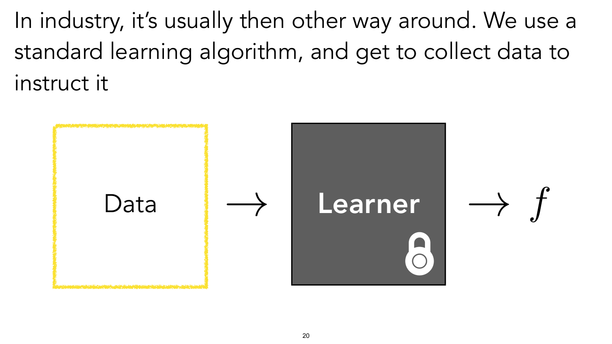

Heading text: "In industry, it's usually then other way around. We use a standard learning algorithm, and get to collect data to instruct it" (as printed, "then other way around").

The same diagram as slide 19 with the highlighting and lock swapped: "Data" (white square) now has the rough yellow outline and no lock; the dark-grey "Learner" square has a white padlock icon at its lower right corner; arrows to $f$ as before.

Build step of slide 19: same layout, with the lock moved from Data to Learner and the yellow highlight moved from Learner to Data. The black frame swaps too: on slide 20 the Data square has only the yellow outline, and the Learner square has a black border.

## Slide 21 — Which is the hardest prediction problem?

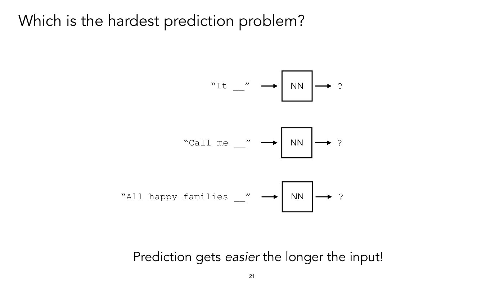

Title: "Which is the hardest prediction problem?" Three rows, each a text prompt in monospace, a right arrow, a square box labelled "NN", a right arrow and a question mark:

- "It __" (the prompt printed as `"It __"` with a blank underscore) → NN → ?
- "Call me __" → NN → ?
- "All happy families __" → NN → ?

Bottom: "Prediction gets *easier* the longer the input!" (the word easier in italics).

## Slide 22 — You can change your data to make the learning work better!

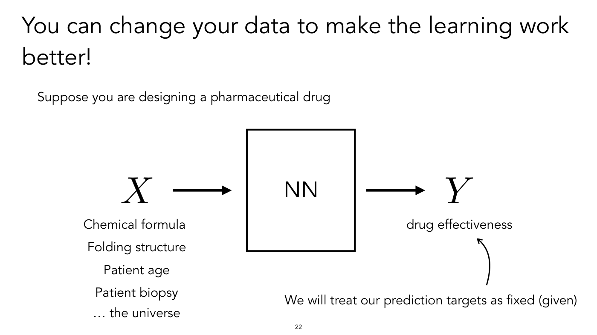

Title: "You can change your data to make the learning work better!" Text: "Suppose you are designing a pharmaceutical drug".

Diagram: the italic capital $X$, then a right arrow, then a large square labelled "NN", then a right arrow, then the italic capital $Y$. Under $X$, a list of five lines: "Chemical formula", "Folding structure", "Patient age", "Patient biopsy", "… the universe". Under $Y$: "drug effectiveness". At the lower right: "We will treat our prediction targets as fixed (given)", with a curved arrow from that text up to "drug effectiveness".

## Slide 23 — Adding info to X reduces uncertainty over Y

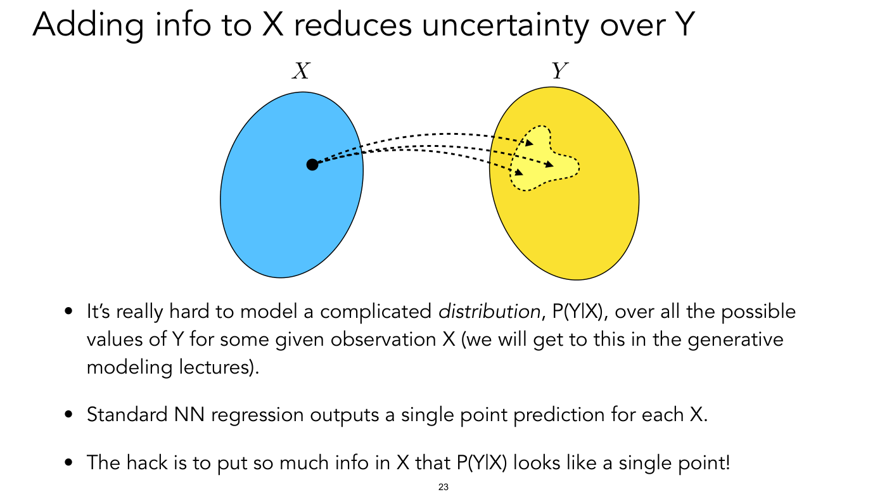

Title: "Adding info to X reduces uncertainty over Y". Diagram: two ovals. The left one is blue, labelled italic $X$ above it, with one black dot near its centre. The right one is yellow, labelled italic $Y$, with a smaller pale-yellow blob with a dotted outline (an irregular shape, like a rounded triangle with a lobe to the right) in its upper left part. Three dashed black arrows leave the dot, arching over to the right, and end inside the pale-yellow blob at three different points (upper, middle and lower).

The point: for one observation $X$ the possible values of $Y$ form a distribution, drawn as the blob.

- It's really hard to model a complicated *distribution*, P(Y|X), over all the possible values of Y for some given observation X (we will get to this in the generative modeling lectures).
- Standard NN regression outputs a single point prediction for each X.
- The hack is to put so much info in X that P(Y|X) looks like a single point!

(The word distribution is in italics on the slide.)

## Slide 24 — Evolution of image generation

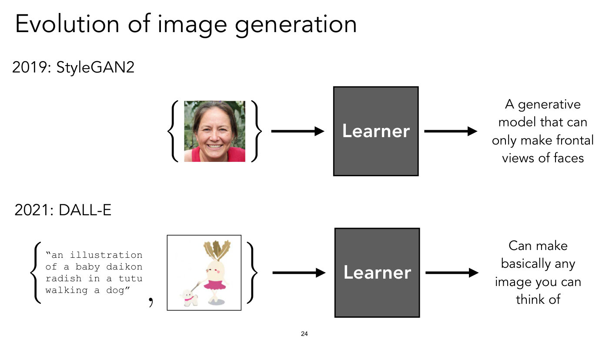

Title: "Evolution of image generation". Two rows.

- "2019: StyleGAN2". Diagram: a set drawn with braces round one photograph, a smiling middle-aged woman with brown hair pulled back, in a red top, against green foliage (a face image only, no label); a right arrow; a dark-grey square labelled "Learner"; a right arrow; the text "A generative model that can only make frontal views of faces".
- "2021: DALL-E". Diagram: a set drawn with braces round a pair (text, image), separated by a comma: the text in monospace `"an illustration of a baby daikon radish in a tutu walking a dog"` (printed as four lines) and an illustration of a cartoon white radish with brown leaves on top, wearing a pink tutu, walking a small white dog on a lead; a right arrow; a dark-grey square labelled "Learner"; a right arrow; the text "Can make basically any image you can think of".

## Slide 25 — You can change your data to make the learning work better!

Title: "You can change your data to make the learning work better!"

- Use **big** data (the word "big" is larger and bold)
  - Big as in lots of {x,y} training pairs
  - Big as in x is a big object, replete with information (+ high-dimensional)
  - (Big as in y is a big object too)

Same title as slide 22.

## Slide 26 — Model

Title: "Model", with the bold heading "Keep it as simple as possible!" beside it.

Text: "do your first experiment with the simplest possible model w/ and w/o your idea"

"Why keep it simple?"

- easy to build, debug, share
- tractable to understand, make robust, build theories around
- *simple models also work better* (Occam's razor, Solomonoff Induction) (the first part in italics)
- if you focus on simplicity you will have an unfair advantage

## Slide 27 — Model

Title: "Model".

- start with a standard and popular model (popularity matters more than performance) (the parenthetical in smaller type)
- if you have an image classification problem, you might try:

```
model = torch.hub.load('pytorch/vision:v0.9.0', 'resnet18')
```

(grey-shaded box; the string arguments in red, the rest black) with a small arrow from the link "https://pytorch.org/hub/pytorch_vision_resnet/" pointing up to this line, and the PyTorch flame logo (an orange-red open circle with a spark at the top right) to the right of the link.

- if you have text problem, you might try: (as printed, "if you have text problem")

```
>>> from transformers import pipeline, set_seed
>>> generator = pipeline('text-generation', model='gpt2')
```

(grey-shaded box; the `>>>` prompts in blue, `from` and `import` in purple, strings in green, the rest dark grey), with an arrow pointing left from "https://huggingface.co/" toward the code, and the Hugging Face smiling emoji logo (a yellow face with open hands) to the right of the link.

- find popular models and code here: https://paperswithcode.com/

(The text layer confirms the first code line character for character; the second box is an image in the PDF, read from the page.)

## Slide 28 — Model

Title: "Model". Left, three lines: "stand on the shoulders of giants", "use pretrained models", "(but be aware of their flaws and limitations)".

Right, two screenshots stacked.

- Top: a web page headed "Stable Diffusion". Text in italics: "Stable Diffusion was made possible thanks to a collaboration with Stability AI and Runway and builds upon our previous work:" ("Stability AI" and "Runway" are blue links). Then a bold blue link "High-Resolution Image Synthesis with Latent Diffusion Models", the authors "Robin Rombach*, Andreas Blattmann*, Dominik Lorenz, Patrick Esser, Björn Ommer", and the links "CVPR '22 Oral | GitHub | arXiv | Project page". Below, a strip of five generated images side by side: a person in a Darth Vader-style black costume riding a bicycle on a forest trail; an astronaut playing a piano with a planet behind; a white unicorn galloping across a dark moorland; an otter dressed in a hat and a brown leather jacket (in a steampunk style); and a brown bear standing in a small spacesuit-like vest against a desert sky with a large moon.
- Bottom: a README.md panel for AlphaFold: a banner of a twisting, ribbon-like surface in rainbow gradient colours (red, orange, pink, green) on a purple background, then the heading "AlphaFold" and the text "This package provides an implementation of the inference pipeline of AlphaFold v2.0. This is a completely new model that was entered in CASP14 and published in Nature. For simplicity, we refer to this model as AlphaFold throughout the rest of this document."

Small print at the lower left of the screenshots: "Top © Robin Rombach and Patrick Esser and contributors. Bottom © DeepMind Technologies Limited. All rights reserved. This content is excluded from our Creative Commons license. For more information, see https://ocw.mit.edu/help/faq-fair-use/".

*OCW notice: © Robin Rombach and Patrick Esser and contributors (top, the Stable Diffusion page and its generated images) and © DeepMind Technologies Limited (bottom, the AlphaFold README and banner). All rights reserved — excluded from the CC license.*

## Slide 29 — Model

Title: "Model". **Transform your problem into a "solved" problem** (bold)

- Case study: transforming image *colorization* to image *classification* (the two key words in italics)

Bottom right: "[c.f. the strategy of "polynomial-time reduction"]".

## Slide 30 — Image colorization

Title: "Image colorization". The slide shows a set of training pairs, one input image, a function arrow and an output image, with a formula.

- Left, a white framed box (drop shadow) headed "*Training data*" with column labels $\mathbf{x}$ and $\mathbf{y}$ (the box overlaps the lower left of the input image). It holds three pairs, each in braces with a comma between the two images, then a vertical ellipsis:
  1. a greyscale and a colour picture of a lionfish (spiky fins) on a reef, the colour version with teal water and orange-red fins;
  2. a greyscale and a colour picture of white blossoms with a thin translucent-winged insect above them and a blurred vertical stalk to the left (the colour version has yellow-orange flowers and a teal-green stalk);
  3. a greyscale and a colour picture of a slice of chocolate cake with a scoop of vanilla ice cream, red berry sauce and a chocolate swirl on a white plate (the colour version has a red tablecloth with a green-and-yellow strawberry print across the top).
- Centre top: "Input" with bold $\mathbf{x}$, above a greyscale photograph of a large angelfish seen at an angle on a coral reef: its front and head are pale, its body (about two thirds) is dark and scaly, running down-left to the edge of the training-data box, which hides the pale tail fin on this slide.
- Centre: a large outlined right arrow labelled $f$.
- Right: "Output" with bold $\mathbf{y}$ above the colour version of the same photograph: the angelfish's front and head are bright yellow, the rear body dark navy blue, the tail fin yellow, the reef in browns and teal.
- Bottom, a formula (the text layer reads it with one closing parenthesis fewer than opening ones, matching the image):

$$\arg\min_{f \in \mathcal{F}} \sum_{i=1}^{N} \mathcal{L}(f(\mathbf{x}^{(i)}, \mathbf{y}^{(i)})$$

(as printed, the parentheses are unbalanced: the formula writes $\mathcal{L}(f(\mathbf{x}^{(i)}, \mathbf{y}^{(i)})$ with two opening and one closing).

Small print at the lower right: "Original image © source unknown. Colorized image © Zhang, Isola, and Efros. All rights reserved. This content is excluded from our Creative Commons license. For more information, see https://ocw.mit.edu/help/faq-fair-use/". Credit: "[Zhang, Isola, Efros, ECCV 2016]".

*OCW notice: © source unknown (original photographs) and © Zhang, Isola, and Efros (colorized images, including the colorized angelfish). All rights reserved — excluded from the CC license.*

## Slide 31 — (no title; grayscale L channel to colour ab channels)

No title is printed. Left: the greyscale angelfish photograph of slide 30, larger. Between the images, an outlined right arrow labelled $f$. Right: an image of the same size filled with flat, blurry colour (the ab channels shown alone, without lightness): a mostly lilac-grey field, with an olive-yellow crescent where the fish's head and front are, a smaller olive-yellow patch lower left where the tail fin is, pinkish-orange smudges at the top left and middle left, and teal-green patches at the lower right and upper right.

Captions: under the left image, "Grayscale image: **L channel**" and

$$\mathbf{x} \in \mathbb{R}^{H \times W \times 1}$$

under the right image, "Color information: **ab channels**" and

$$\mathbf{y} \in \mathbb{R}^{H \times W \times 2}$$

Small print: "Original image © source unknown. Colorized image © Zhang, Isola, and Efros. All rights reserved. This content is excluded from our Creative Commons license. For more information, see https://ocw.mit.edu/help/faq-fair-use/". Credit: "[Zhang, Isola, Efros, ECCV 2016]".

*OCW notice: © source unknown (original photograph) and © Zhang, Isola, and Efros (colour-channel image). All rights reserved — excluded from the CC license.*

## Slide 32 — (no title; grayscale L channel to colorized image)

No title is printed. Same layout as slide 31 (greyscale image at left, arrow $f$, image at right, the same captions and formulas $\mathbf{x} \in \mathbb{R}^{H \times W \times 1}$ and $\mathbf{y} \in \mathbb{R}^{H \times W \times 2}$), but the right image is the fully colourised photograph (yellow head and front, navy rear body, yellow tail, brown-teal reef), that is the lightness and the colour channels combined.

Build step of slide 31: the right image changes from the flat ab-channel colour map to the final colourised photograph.

Small print and credit as on slide 31: "Original image © source unknown. Colorized image © Zhang, Isola, and Efros. All rights reserved. This content is excluded from our Creative Commons license. For more information, see https://ocw.mit.edu/help/faq-fair-use/" and "[Zhang, Isola, Efros, ECCV 2016]".

*OCW notice: © source unknown (original photograph) and © Zhang, Isola, and Efros (colorized image). All rights reserved — excluded from the CC license.*

## Slide 33 — Colorization → Classification

Title: "Colorization → Classification". Left: the greyscale angelfish photograph. Centre: an outlined right arrow labelled $f$. Right: a plain empty rectangle (the same size as a photo) with the single monospace word "yellow" in its middle, i.e. the output is now a class label, not an image.

Small print at the lower right: "Original image © source unknown. Colorized image © Zhang, Isola, and Efros. All rights reserved. This content is excluded from our Creative Commons license. For more information, see https://ocw.mit.edu/help/faq-fair-use/".

*OCW notice: © source unknown (greyscale photograph) and © Zhang, Isola, and Efros. All rights reserved — excluded from the CC license.*

## Slide 34 — Colors → Classes

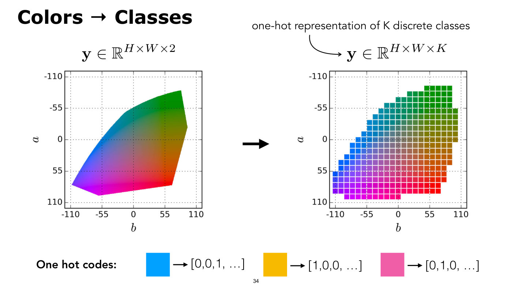

Title: "Colors → Classes". Two plots of the (a, b) colour plane with a thick black arrow between them.

- Left, headed with $\mathbf{y} \in \mathbb{R}^{H \times W \times 2}$: a square plot. The vertical axis is labelled $a$ with ticks -110 (top), -55, 0, 55, 110 (bottom); the horizontal axis is labelled $b$ with ticks -110, -55, 0, 55, 110. A dotted grid. Filling part of the plot, a smooth, continuous-colour region shaped like a lopsided polygon (the gamut of colours): blue-violet at the lower left corner (about b = -110, a = 75), magenta along the bottom, red at the lower right, olive-brown at the right, green at the top right (about b = 80, a = -90), teal-blue along the upper left edge, and a muted grey-mauve in the centre.
- Right, headed with $\mathbf{y} \in \mathbb{R}^{H \times W \times K}$ and, above it, the words "one-hot representation of K discrete classes" with a curved arrow pointing at this expression: the same axes and the same colour region, now cut into a grid of small coloured squares with white gaps (a quantized version: each square is one colour class), covering the same shape.
- Bottom, "**One hot codes:**" and three examples, each a coloured square with an arrow to a vector: a blue square → [0,0,1, …]; an orange-yellow square → [1,0,0, …]; a pink square → [0,1,0, …].

## Slide 35 — (no title; greyscale photograph through a six-layer network to "rockfish")

No title is printed. Left, the greyscale angelfish photograph (cropped at the left edge of the slide). Then an arrow to a row of six tall, narrow, empty rectangles drawn left to right (a network of six layers), each pair joined by a short right arrow, then an arrow to the monospace word "rockfish" (a class label that an ImageNet-style classifier outputs).

Small print at the lower right: "Original image © source unknown. Colorized image © Zhang, Isola, and Efros. All rights reserved. This content is excluded from our Creative Commons license. For more information, see https://ocw.mit.edu/help/faq-fair-use/".

*OCW notice: © source unknown (greyscale photograph) and © Zhang, Isola, and Efros. All rights reserved — excluded from the CC license.*

## Slide 36 — (no title; greyscale photograph through a six-layer network to "yellow")

No title is printed. The same as slide 35 (photograph, arrow, six narrow rectangles joined by arrows, arrow), but the output at the right is a large empty square-ish box with the monospace word "yellow" in it, in place of the word "rockfish".

Build step of slide 35: the output changes from the label rockfish to the colour label yellow, to make the point that the same network now predicts a colour class.

Small print as on slide 35: "Original image © source unknown. Colorized image © Zhang, Isola, and Efros. All rights reserved. This content is excluded from our Creative Commons license. For more information, see https://ocw.mit.edu/help/faq-fair-use/".

*OCW notice: © source unknown (greyscale photograph) and © Zhang, Isola, and Efros. All rights reserved — excluded from the CC license.*

## Slide 37 — Image classification → Pixel classification

Title: "Image classification → Pixel classification". Same picture as slide 36: the greyscale angelfish photograph (cropped at the left edge), an arrow, six tall narrow empty rectangles joined by arrows, an arrow, and a large empty box containing the monospace word "yellow".

Small print: "Original image © source unknown. Colorized image © Zhang, Isola, and Efros. All rights reserved. This content is excluded from our Creative Commons license. For more information, see https://ocw.mit.edu/help/faq-fair-use/".

Same figure as slide 36, with a title added.

*OCW notice: © source unknown (greyscale photograph) and © Zhang, Isola, and Efros. All rights reserved — excluded from the CC license.*

## Slide 38 — Image classification → Pixel classification

Title: "Image classification → Pixel classification". Same diagram as slide 37 with a green overlay added. On the input photograph, a fine green grid of 15 columns by 15 rows (counted from the vector data) covers a square over the fish's pale head and the front edge of its dark body, with its centre cell (column 8, row 8) filled solid green. In the output box at the right, a green-outlined square sits at the right of the box; inside it a small yellow square (one pixel) sits above the monospace word "yellow". The picture shows that a patch around one input pixel is used to predict the class of that one output pixel.

Small print as on slide 37: "Original image © source unknown. Colorized image © Zhang, Isola, and Efros. All rights reserved. This content is excluded from our Creative Commons license. For more information, see https://ocw.mit.edu/help/faq-fair-use/".

Build step of slide 37: adds the green input patch and the one-pixel output.

*OCW notice: © source unknown (greyscale photograph) and © Zhang, Isola, and Efros. All rights reserved — excluded from the CC license.*

## Slide 39 — Image classification → Pixel classification

Title: "Image classification → Pixel classification". Same six-layer diagram, but the output at the right is now the full colourised angelfish image (yellow head and front, navy rear body, yellow tail, brown and teal reef), cut off by the right edge of the slide. On the input photograph, the green grid patch (the same 15 by 15 cells) now sits flush with the upper left corner of the image, mostly over dark reef, its lower right corner overlapping the upper edge of the fish's dark body, with its centre cell solid green.

The slide's meaning: sliding the patch over every pixel gives a class (colour) for every output pixel, which builds the colourised image.

Small print as on slide 37: "Original image © source unknown. Colorized image © Zhang, Isola, and Efros. All rights reserved. This content is excluded from our Creative Commons license. For more information, see https://ocw.mit.edu/help/faq-fair-use/".

Build step of slide 38: the patch moves to the top left corner and the single-pixel output becomes the whole colourised image.

*OCW notice: © source unknown (greyscale photograph) and © Zhang, Isola, and Efros (colorized image). All rights reserved — excluded from the CC license.*

## Slide 40 — Model

Title: "Model".

- Formulate your problem as **softmax regression** (a.k.a. classification)
  - cross-entropy loss, 1-hot labels
  - Why?
    1. No restriction on shape of predictive distribution [up to quantization] (this is *not* the case for least-squares regression, which assumes Gaussian predictions)
    2. Discrete classes are easy to label
    3. All labels are equidistant under 1-hot representation

(The parenthetical in point 1 is in smaller type, with "not" in italics.)

## Slide 41 — Model

Title: "Model", with the magenta text "good default choices ca 2024" at the upper right. Text: "Recipe for deep learning in a new domain". Numbered, with the parenthesised parts in magenta:

1. Transform your data into numbers (one-hot vectors)
2. Transform your goal into an numerical measure (cross-entropy loss) (as printed, "an numerical")
3. Use a generic optimizer (Adam) and an standard architecture (transformer) to solve the learning problem (as printed, "an standard")

## Slide 42 — Model

Title: "Model", with the magenta "good default choices ca 2024" at the upper right. Text: "Don't use batch norm"

- Introduces a strong dependency on batch size (now batch size becomes an even more critical hyperparameter)
- Different behavior at train and test time
- Makes distributed computing hard — requires communication between all elements in a batch
- Use layer norm instead (the words "layer norm" in magenta)

## Slide 43 — (no title; "Longer rant I wrote a few years ago:")

The only large text is the heading "Longer rant I wrote a few years ago:". Below is a screenshot of a block of small sans-serif text, transcribed here (links are blue; "z − z = 0" is set in bold math):

(Disclaimer that this is my personal opinion)

Batchnorm *can* be a useful tool, but in my experience it's usually more trouble than it's worth. Below are some things that make working with batchnorm a headache. You can work around all these issues… or you can just not use batchnorm (a smiling emoji).

1. Behavior at train time and test time is different. Forgot to set model.eval()? You will have a bug. More generally, differences in train vs test behavior make it harder to anticipate test behavior from training behavior. You might be in for surprises.
2. It only works if batch size is sufficiently big. Suppose your batch size is 1. Then if you have an activation vector $\mathbf{z}$ and subtract the mean over the batch, you get $\mathbf{z} - \mathbf{z} = 0$. The model just zeroed out the activation vector and your net won't work. Worse, the variance is undefined for batch size 1 and that could cause bugs too. For small batch size the variance could be a very poor estimate of the true variance of the activations and cause numerical and optimization issues. [I had this bug in the original version of the pix2pix paper, and it made the baseline work worse than it should have (which might not have been a bad thing for making the paper popular…). See change log in appendix here: https://arxiv.org/abs/1611.07004]
3. Suppose your batch size is large, but all activations in a batch happen to have the same value. Again the variance is undefined and the activations get zeroed out by subtracting the mean. [This was the "bug" that the SPADE paper tried to fix: https://arxiv.org/abs/1903.07291]
4. Want to train a really big model in parallel across many machines? With SGD and no batchnorm you can run forward and back propagation independently on subbatches distributed across the machines, then only communicate between them once to aggregate the gradients. With batchnorm, the activations for one subbatch will depend on the activations for another subbatch – you need to communicate all these activations between the machines. Naively you need to do this *after each layer of your network*, to compute the inputs to the next layer, which is a huge communication overhead, but in practice people use various (bug-prone) speedups.
5. More generally, batchnorm introduces a dependency between different elements of your batch. Different training examples are not processed iid. This not only gives implementation headaches but also makes the theoretical analysis harder. This might be one reason why the theory of why batchnorm works is still not really resolved.
6. There are lots of tricks and hacks to fix the above issues – these tricks add more potential bugs and complexity. Sometimes the fix is worse than the original problem. In distributed training sometimes people run batchnorm independently on each machine. That fixes the communication problem, but now you have a maybe worse problem: your results change dramatically depending on how many machines are in your cluster (since the number of machines determines the size of the subbatches when you distribute across machines and subbatch size has a big effect on how well batchnorm works).

Feel free to add to this list if anyone has more – I think the list could go on and on.

(The text was read from crops at 130 dpi; a tiny clipped mark sits at the upper right of the screenshot.)

## Slide 44 — Model

Title: "Model". Text: "Remember that often the easiest way to get better performance is:"

1) **Scale** your data: more (diverse) training examples
2) **Scale** your model: more layers, more channels
3) **Scale** your compute: train for longer

"In the current era, I would say these are the top three factors that determine success"

"… but working at small scale forces efficiency, and *then* when you do scale up, you get more bang for your buck" (the word "then" in italics)

## Slide 45 — Model

Title: "Model". Text: "Once you get your system working, you are only halfway done" and "Second half is to remove everything nonessential".

Quotation, in a serif face: "Perfection is finally attained not when there is no longer anything to add, but when there is no longer anything to take away" — Antoine de Saint Exupéry

## Slide 46 — Copilots

Title: "Copilots". At the upper right, three logos: "GitHub Copilot" (a cartoon helmeted, goggled robot head in blue and green beside the words "GitHub Copilot"), the OpenAI/ChatGPT knot logo in white on a teal-green rounded square, and a grey face icon with the words "Colab AI".

- Good for boilerplate code, visualization, getting syntax right. Ever improving.
- Don't use it for your psets but you can use it for your final projects. You *should* learn how to use these tools effectively. (the word should in italics)
- Think first, then ask an LLM for help.
- Don't trust the code without verification.

## Slide 47 — Copilots

Title: "Copilots", with the same three logos at the upper right as slide 46. Left: "General advice: the more documentation you provide, the better the completion will be."

Below it, a dark-grey chat-style screenshot of a user prompt, with a small "PH" avatar tile at the left:

```
def backward_D_basic(self, netD, real, fake):
    """Calculate GAN loss for the discriminator

    Parameters:
        netD (network)      -- the discriminator D
        real (tensor array) -- real images
        fake (tensor array) -- images generated by a generator

    Return the discriminator loss.
    We also call loss_D.backward() to calculate the gradients.
    """
```

(Read from the page image at a proportional font; the exact spacing of the columns is approximate.) A right-pointing arrow leads to a second, black-background code screenshot headed "python" with a "Copy code" button at its top right (a chat-assistant style window), whose code, in monospace, reads:

```
import torch

def backward_D_basic(netD, real, fake):
    # Calculate the discriminator's predictions for real and fake images
    real_pred = netD(real)
    fake_pred = netD(fake)

    # Create labels for real and fake images (1 for real, 0 for fake)
    real_labels = torch.ones_like(real_pred)
    fake_labels = torch.zeros_like(fake_pred)

    # Calculate the binary cross-entropy loss for real and fake images
    criterion = torch.nn.BCELoss()

    real_loss = criterion(real_pred, real_labels)
    fake_loss = criterion(fake_pred, fake_labels)

    # Calculate the total discriminator loss
    loss_D = real_loss + fake_loss

    # Backpropagate to compute gradients
    loss_D.backward()

    return loss_D
```

Colour coding: comments in grey, `import`, `def`, `return` in blue, the function name in red. The bottom right corner of the screenshot is clipped by a partial "Regenerat…" button (the word is cut off at the right edge). The code is an image in the PDF, so it is read from the page, not the text layer.

## Slide 48 — Optimization

Title: "Optimization". Text: "figure out optimization on **one/few/many datapoints**, in that order"

- overfit to a data point
- then fit a batch
- and finally try fitting the dataset (or a miniature version of it) (as printed, "miniature")

"first make sure you can fit train set, then consider generalization to test set"

Credit: "[slide adapted from Evan Shelhamer]".

## Slide 49 — Optimization

Title: "Optimization". Text: "**sanity check the loss** against a suitable reference value"

- classification with cross-entropy loss: uniform distribution
  - get to know log loss numbers:
    - **-0.69** = ln(0.5) [chance on binary classification]
    - **-2.3** = ln(0.1) [chance on 10-way classification]
- regression with squared loss: mean of targets (or even just zero)

"and if your loss is constant, double check for zero initialization of the weights"

Credit: "[slide adapted from Evan Shelhamer]". (The slide prints the negative logs, -0.69 and -2.3, as the reference values.)

## Slide 50 — Optimization

Title: "Optimization". Text: "Most important hyperparameters: **learning rate** and **batch size**"

- first, **use a constant rate;** don't schedule until everything else is figured out
- schedule according to number of iterations of SGD, not epochs
- use biggest batch size that will fit in memory
- always retune lr when *anything* changes in your model (most changes to model change scale of gradients, which changes the **effective lr**)

Two side notes with dotted leader lines. "Until Jeremy solves lr-free optimization", at the right: its dotted line runs from under the word "solves" down-left to just above the word "model" in the fourth bullet's "changes in your model". At the bottom, "may look like your model is training much faster, but really you just scaled the effective lr": its dotted line runs up-right from above "the" to just under the word "effective" of the fourth bullet's "effective lr". The slide number "50" overlaps this bottom line between "faster," and "but". (Both leader lines' ends were located from the PDF's vector data.)

## Slide 51 — Optimization

Title: "Optimization". Heading text: "Be careful with the concept of "epochs"".

- There are no epochs in the wild
- Trend toward single-epoch training in LLMs
- Don't tie lr schedule to epochs
  - makes it hard to compare learning curves between experiments
  - be careful with cosine lr (looks like it is converging when it is not)

At the right, a table screenshot (serif type), credited "[Tian, Sun, Poole, et al., 2020]". Columns: Method, Architecture, Param., Head, Epochs, Top-1, Top-5. The green numbers in square brackets are reference citations (shown here in brackets).

| Method | Architecture | Param. | Head | Epochs | Top-1 | Top-5 |
| --- | --- | --- | --- | --- | --- | --- |
| InstDis [73] | ResNet-50 | 24 | Linear | 200 | 56.5 | - |
| Local Agg. [83] | ResNet-50 | 24 | Linear | 200 | 58.8 | - |
| CMC [66] | ResNet-50* | 12 | Linear | 240 | 60.0 | 82.3 |
| MoCo [28] | ResNet-50 | 24 | Linear | 200 | 60.6 | - |
| PIRL [49] | ResNet-50 | 24 | Linear | 800 | 63.6 | - |
| CPC v2 [31] | ResNet-50 | 24 | - | - | 63.8 | 85.3 |
| SimCLR [10] | ResNet-50 | 24 | MLP | 1000 | 69.3 | 89.0 |
| InfoMin Aug. (Ours) | ResNet-50 | 24 | MLP | 200 | 70.1 | 89.4 |
| InfoMin Aug. (Ours) | ResNet-50 | 24 | MLP | 800 | **73.0** | **91.1** |

(A horizontal rule separates the first seven rows from the two InfoMin rows; the last row's Top-1 and Top-5 are in bold.)

## Slide 52 — Optimization

Title: "Optimization". Text: "**checkpoint** features + gradients to trade space for time and fit large models"

- can then accumulate gradients across checkpoints
- can resume training if your computer crashes
- have a "paper trail" to debug later

Credit: "[slide adapted from Evan Shelhamer]".

## Slide 53 — Optimization

Title: "Optimization". Text: "live on the edge and try extreme settings (but just a little bit)"

- If optimization never diverges, your learning rate is too low

"in the style of *Umeshism*"

- If you've never missed a flight, you're spending too much time in airports

Credit: "[slide adapted from Evan Shelhamer]".

## Slide 54 — Optimization

Title: "Optimization". Text: "Use exponentially moving averages (EMA)", followed on the same line by the update rule, in which the assignment sign between the two sides is blank (as printed, nothing sits between them, as on several slides in lecture 2's deck):

$$\theta_{\texttt{EMA}}^{t} \quad \quad \beta \theta_{\texttt{EMA}}^{t-1} + (1 - \beta)\theta^{t-1}$$

(Read as an update of the EMA copy of the parameters. Note the superscripts: the new value has $t$ on the left, and the right side has $t-1$ on both terms.)

- Replace a quantity with a weighted average of its previous values, with weight exponentially decaying over time
- Time averages (EMA) can achieve a similar effect as "space" averages (e.g., average gradients over batch)
- Useful for many quantities in deep learning, including gradients (where it is known as momentum), weights, data, activations, targets, etc.
  - (Basically for any variable in DL, try replacing it with its EMA version and it may be better)

## Slide 55 — Optimization

Title: "Optimization". Text: "optimizers:"

- Adam (or AdamW) is good for prototyping (generally just works)
- SGD may be slightly better for performance (but requires more tuning of hyperparameters)
- Clip gradients to improve stability

## Slide 56 — Evaluation

Title: "Evaluation". Text: "switch to **evaluation mode** by model.eval() (PyTorch)", "no, really", "and check the mode by model.training".

Credit: "[slide adapted from Evan Shelhamer]".

## Slide 57 — Evaluation

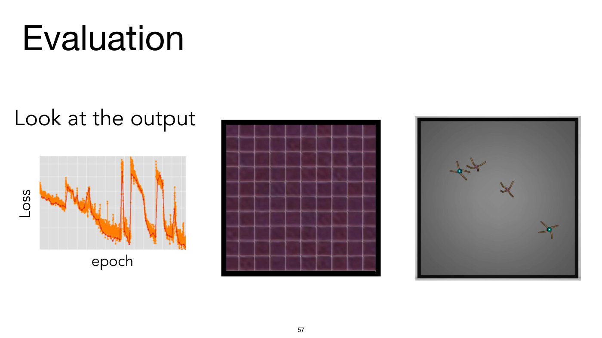

Title: "Evaluation", with the sub-heading "Look at the output". Three pictures side by side, the same three as the lower row of slide 4, without the chest X-ray:

1. Left, a training-loss plot: y-axis "Loss" (rotated), x-axis "epoch", no tick values; light-grey background with a faint grid; a noisy orange curve (dots joined by a thin red-brown line) that trends downward but is repeatedly interrupted by six sharp upward spikes (the same image object as slide 4's), the two largest near the middle of the plot reaching the top, and ends noisy near the bottom right.
2. Middle, a black-framed square image filled by a 10 by 10 grid of dull purple-maroon tiles with light grey-pink gridlines, all looking nearly identical.
3. Right, a grey square with a radial gradient and a black and light-grey frame, holding four small creatures, each with four two-segmented limbs: two near the upper left (one with a teal ball centre, one with a pink-purple centre), one near the centre (a little right of and above it) with a pink-purple centre, and one at the lower right with a teal ball centre.

No credit or notice is printed on this slide.

Related to slide 4: the lower half of slide 4 repeated on its own.

## Slide 58 — (no title; table of image-to-image results, labels to buildings)

No title is printed. A full-slide grid of images with 4 rows and 7 columns, with column headings in a serif face along the top: "Image#" (the row-number column; rows numbered 1 to 4 at the left), "Input", "Ground Truth", "Ll", "Olayers", "llayers", "3layers", "61ayers". These are live text and print exactly so: "Ll" is a capital L and a lowercase l, "Olayers" begins with a capital letter O, "llayers" with two lowercase ells, and "61ayers" has a digit 1 in place of the l, character substitutions apparently carried over from text recognition of the source figure. Read as intended they are most likely L1, 0layers, 1layers, 3layers and 6layers, but that is a gloss.

- Input column: four colour-coded building-facade label maps (flat blocks of blue, orange, red, light green, yellow and cyan standing for wall, windows, balconies, doors and so on).
- Ground Truth column: four real photographs of building facades: (1) a two-storey brown stone facade with rectangular, stone-framed windows, a wall lantern at the left and a wooden double door at the bottom centre; (2) a street-level tall grey and cream apartment block with ads reading "LÖWENBRÄU ZÜRICH" and "CAMPARI" at the roofline; (3) a large stone apartment building with many balconies and an arched doorway; (4) a pink house with green shuttered windows and two parked cars (one red, one silver) in front.
- The remaining five columns (printed Ll, Olayers, llayers, 3layers, 61ayers) hold, for each row, a generated facade image: the Ll and Olayers columns are blurry, low-contrast, brownish versions; the llayers, 3layers and 61ayers columns are progressively sharper and more detailed, with windows and balconies of increasing crispness, though with some artefacts (smeared edges, speckles) in 1layers and 6layers.

Small print at the lower right, in white, starting halfway across row 4's "3layers" image and running into the "61ayers" image: "© IEEE, All rights reserved. This content is excluded from our Creative Commons license. For more information, see https://ocw.mit.edu/help/faq-fair-use/". The slide number "58" sits over the bottom of row 4's "Olayers" image only. No source paper is named on the slide.

*OCW notice: © IEEE (the grid of facade label maps, ground-truth photographs and generated images). All rights reserved — excluded from the CC license.*

## Slide 59 — Evaluation

Title: "Evaluation". Text: "**WandB** and **Tensorboard** can be your friends (?). Or roll your own logs/viz."

- When in doubt, log it
- If you're logging it, make it easy to see the results

Credit: "[slide adapted from Dylan Hadfield-Menell]".

## Slide 60 — (no title; Weights & Biases web page)

No title is printed. A full-slide screenshot of the Weights & Biases web page, dark background. Top bar: the Weights & Biases logo (a column of yellow dots, then the name), menu items "Products", "Resources", "Company" (each with a down arrow), "Docs", "Pricing", "Enterprise", then "Login" with a padlock and "Sign Up". Left, large white text "The developer-first" and in yellow-orange "MLOps platform", then "Build better models faster with experiment tracking, dataset versioning, and model management", and two buttons, an orange "SIGN UP" and a white "REQUEST DEMO".

At the right, a screenshot of the product dashboard: a sidebar list of about 19 runs with coloured dots and names such as "lucky-sweep-5 0.981", "northern-sw… 0.9804", "atomic-swe… 0.9795", "drawn-swee… 0.9793", and so on down to "ruby-sweep 0.9733"; a parallel-coordinates plot headed "Results of Hyperparameter Sweep" with axes n_params, activation, batch_size, shape and val-full/accuracy, drawn with many crossing lines coloured from purple to orange; a "Parameter importance with respect to val-full…" panel with bars for n_params, budget, parameter_budget, Runtime, lr, batch_size and the activation and shape parameters (blue importance bars, green or red correlation bars); a line chart "loss/val-batch" with many noisy coloured curves that decay quickly and then stay low, with x ticks 0, 100, 200, 300; and a "Best Model by Val Acc" tile reading "lucky-sweep-5" and "0.981". A blue circular play button with a white triangle sits over the centre of the screenshot.

Bottom: small print "© Weights & Biases. All rights reserved. This content is excluded from our Creative Commons license. For more information, see https://ocw.mit.edu/help/faq-fair-use/" and, at the right, the bold link "https://wandb.ai/site". The slide number "60" overprints the small print.

*OCW notice: © Weights & Biases (screenshot of the Weights & Biases web page). All rights reserved — excluded from the CC license.*

## Slide 61 — Tuning

Title: "Tuning". A photograph of a two-shelf metal spice rack on a yellow-orange background, six glass jars per shelf with silver lids. White label boxes with black text are pasted over six of the top-shelf jars: "dropout" (a jar of dark red chilli flakes, left), "attention" (the second jar, with an orange-red powder labelled Smoked Paprika), "weight decay" (the third, with green dried herbs), "skip connections" (the fourth, with yellow mustard seeds), "momentum" (the fifth, with black seeds), "relu" (the sixth, with orange turmeric). The bottom shelf is unlabelled: jars of green parsley, pink Kosher Salt, Onion Powder, red crushed pepper, nutmegs, and Bay Leaves.

Below: "Cayenne pepper is all you need?" and "No! Each spice has its use. But combination matters. And don't over spice."

Small print: "© source unknown. All rights reserved. This content is excluded from our Creative Commons license. For more information, see https://ocw.mit.edu/help/faq-fair-use/".

*OCW notice: © source unknown (spice-rack photograph). All rights reserved — excluded from the CC license.*

## Slide 62 — Experimentation and debugging

Title: "Experimentation and debugging".

- **don't be finger-bound!** script the optimization + evaluation of your models
- every character you type is a chance to make a mistake
- also scripting makes the work reproducible!
- use config files (e.g., yaml) to manage experiments; log all arguments

Credit: "[slide adapted from Evan Shelhamer]".

## Slide 63 — Experimentation and debugging

Title: "Experimentation and debugging". Text: "debug with the default python debugger: **pdb**". Then, in monospace (the text layer confirms it):

```
import pdb; pdb.set_trace()
```

A blue underlined link: "https://www.digitalocean.com/community/tutorials/how-to-use-the-python-debugger". Then "For finding nans during debugging:" and, in monospace:

```
torch.autograd.set_detect_anomaly(True)
```

Credit: "[slide adapted from Evan Shelhamer]".

## Slide 64 — Common bugs

Title: "Common bugs". An error message in monospace, with "RuntimeError" in red: "RuntimeError: a view of a leaf Variable that requires grad is being used in an in-place operation." Then a code listing on a pale-grey background (comments in green, numbers in teal-green, `True` in blue; the text layer confirms the code):

```
x = torch.ones(2,2, requires_grad=True)

# fails
x += 1

# works
x = x + 1

# fails
x[0,0] = 1

# works (but what should the gradient be?)
y = x.clone()
y[0,0] = 1
```

At the right: "A leaf variable is one that you directly create, that is not the result of any differentiable operation." and "These are the leaves, the inputs, to the computation graph."

## Slide 65 — Common bugs

Title: "Common bugs". In red monospace: "Out of memory". Then "At inference time, don't store gradients:" and code (`with` in purple):

```
with torch.no_grad():
  Y = model.forward(X)
```

Then "Clear memory where appropriate:" and code (`del` in purple):

```
torch.cuda.empty_cache()
del variable_name
```

## Slide 66 — Common bugs

Title: "Common bugs". In red monospace: "Timing your code". Then "GPU calls may run asynchronously, so if you want to time an operation, make sure to synchronize first:" and code:

```
torch.cuda.synchronize()

timer.start()
Y = model.forward(X)
timer.stop()
```

## Slide 67 — Common bugs

Title: "Common bugs". An error message in monospace, "RuntimeError" in red: "RuntimeError: Trying to backward through the graph a second time, but the buffers have already been freed. Specify retain_graph=True when calling backward the first time." Code (comments in green, numbers teal-green, `True` in blue; confirmed by the text layer):

```
x = torch.randn(1, requires_grad=True)
y = x ** 2

# First backward pass
y.backward(retain_graph=True)

# Second backward pass (this works now)
y.backward()
```

At the right: "PyTorch frees computational graph after calling backward()." "If you see this error it's likely you are doing something you don't want to be doing." "But sometimes you do want to call backward twice on same computation graph, or subparts of it, in which case just set retain_graph=True."

## Slide 68 — Compute

Title: "Compute". Text: "**more hardware, more problems** don't parallelize immediately"

- make your model work on a single device first
- attempt to parallelize on a single machine
- only then go to a multi machine set
- and check that iterations/time actually improves

At the right, a small picture: a grey square with a radial gradient and a black and light-grey frame holding four small multi-limbed creatures (one at left with a teal centre, one in the middle with a pink centre, one at the lower middle with a pink centre, one at the right with a teal centre), like the creatures on slides 4 and 57 but arranged differently. No caption or credit.

Bottom: "see Accurate, Large Minibatch SGD: Training ImageNet in 1 Hour for good advice" (the title of the paper is a blue underlined link).

## Slide 69 — Compute

Title: "Compute". Text: "Saturate your GPUs"

- Check GPU utilization (memory and flops): `nvtop` `nvidia-smi` (two small grey-boxed commands in red monospace)
- Increase batch size until ~100% utilization

## Slide 70 — Compute

Title: "Compute". Text: "Include this at the top of your scripts:" and code:

```
torch.cudnn.benchmark = True
```

(as printed, `torch.cudnn.benchmark`; the text layer confirms it.) "Try AMP (https://developer.nvidia.com/automatic-mixed-precision)" and a code block in red-crimson monospace on a pale pink background (confirmed by the text layer):

```
scaler = GradScaler()
with autocast():
    output = model(input)
    loss = loss_fn(output, target)
scaler.scale(loss).backward()
scaler.step(optimizer)
scaler.update()
```

"Try torch.compile (https://pytorch.org/tutorials/intermediate/torch_compile_tutorial.html)".

## Slide 71 — (no title; Scale ML web page)

No title is printed. Left, large text: "MIT group with presentations / tutorials on cutting edge practice of training big models", and at the lower left the large link "https://scale-ml.org/". Small print: "© scale-ml.org. All rights reserved. This content is excluded from our Creative Commons license. For more information, see https://ocw.mit.edu/help/faq-fair-use/".

Right, a light-grey screenshot of the Scale ML web page. Heading "Scale ML" with an orange feather icon. Bullets: "We are a cross-lab MIT AI graduate student collective focusing on **Algorithms That Learn and Scale**."; "The group is open to all with an academic email - however if you are still interested shoot us an email or message us via Twitter. We currently host bi-weekly seminars and will have hands on sessions and research socials in the future."; "Our snacks (a cake-slice emoji) are currently funded by generous donations from Pulkit Agrawal and Yoon Kim."; "Please contact the organizers for inquires" (as printed, "inquires"); "Join our next seminar on Zoom or in-person:" and a link "Click here to join the mailing list". Then a heading "Discussion Schedule" and a list (date, title, speaker):

| Date | Title | Speaker |
| --- | --- | --- |
| 10/30 | u-µP: The Unit-Scaled Maximal Update Parametrization | Charlie Blake (Graphcore) |
| 10/16 | Transformers and Turing Machines | Eran Malach (Harvard) |
| 09/04 | A New Perspective on Shampoo's Preconditioner | Nikhil Vyas (Harvard) |
| 08/22 | 1B parameter model training. (hands on session) | Aniruddha Nrusimha (MIT) |
| 08/12 | How to scale models with Modula in NumPy. (hands on session) | Jeremy Bernstein (MIT) |
| 07/24 | FineWeb: Creating a large dataset for pretraining LLMse | Guilherme Penedo (Hugging Face) |
| 07/17 | Hardware-aware Algorithms for Language Modeling | Tri Dao (Princeton) |

(as printed, "LLMse"). All seven rows are complete; the slide number "71" sits just below the last row's "07/17" date, overlapping no text.

*OCW notice: © scale-ml.org (screenshot of the Scale ML web page). All rights reserved — excluded from the CC license.*

## Slide 72 — MIT OpenCourseWare end page

OCW's appended end page (a smaller page, 792 by 612). Text: "MIT OpenCourseWare", "https://ocw.mit.edu", "6.7960 Deep Learning", "Fall 2024", "For information about citing these materials or our Terms of Use, visit: https://ocw.mit.edu/terms". The page prints "72" at the bottom centre.
