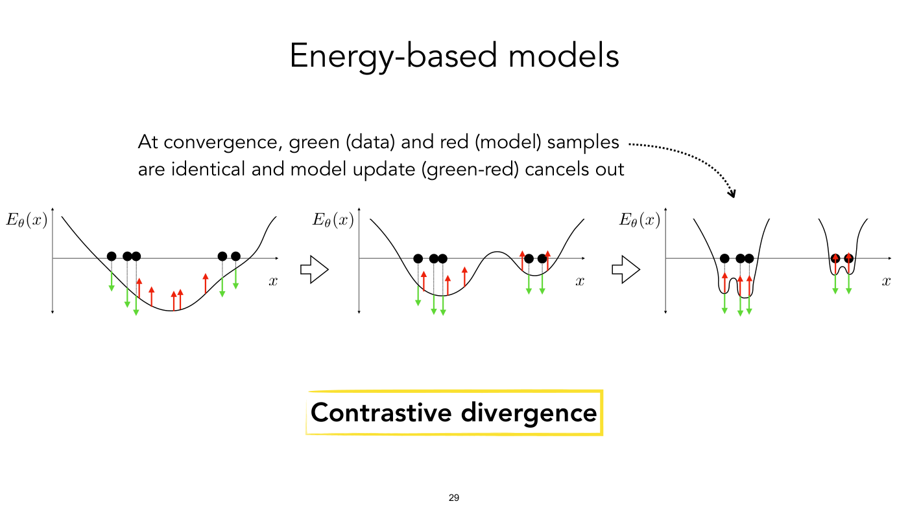

# Lecture 14 — Deep Generative Models I: slide-by-slide

Text and figures of all 60 pages of
[`mit6_7960_f24_lec14.pdf`](https://ocw.mit.edu/courses/6-7960-deep-learning-fall-2024/mit6_7960_f24_lec14.pdf),
transcribed from the deck (speaker: Phillip Isola; the title slide reads "Lecture 14: Deep Generative Models I", and the
recording's title is "Generative Models: Basics"). Cite these as "slide N" — the printed number equals the PDF page number
for slides 1–59; page 60 is OCW's appended end page and prints 60. Diagrams, plots, screenshots and photographs are described
in prose since the KB is read as text. Equations are typeset images in the deck (LaTeXiT), so they were read from the page,
never from the text layer.

**Images.** 28 slides carry a whole-slide render under their heading: 2, 5, 10, 12, 13, 14, 15, 16, 18, 19, 22, 23, 24, 26, 29, 36, 38, 39, 40, 41, 42, 43, 45, 46, 47, 48, 52 and 53. Not rendered: the 7 slides with an OCW exclusion notice (6 and 54 to 59); slides 49 and 50, whose chain figure is Homework 5's excluded diffusion diagram; build steps or repeats that a rendered slide supersedes (11, by 12; 21, by 22; 33, which repeats 29; 44, by 45); text, equation and code slides this file reproduces (4, 7, 8, 9, 17, 20, 25, 27, 28, 30, 31, 32, 34, 35, 37 and 51); and the title, outline and end page (1, 3 and 60). See `AGENTS.md`.

Companion pages: [wiki page for this lecture](../../wiki/14-generative-models-basics.md) · [transcript](../transcripts/14-generative-models-basics.md)

**Signposting slides you can skip.** Slide 1 is the title; slide 2 lists the three generative-modeling lectures ("Lecture 14:
fundamentals, a tour of popular models", "Lecture 15: generative modeling meets representation learning", "Lecture 16:
conditional models, data prediction"), the only lecture numbers the deck prints, all matching the recorded schedule; slide 3 is
the outline; slide 60 is the OCW end page. There is no summary slide: the lecture ends on the GAN slides.

Some slides are **build steps** or repeats, transcribed individually with a note of what they add: slides 10 to 14 (a
classifier, then a generator, then dice, the questions the dice answer, and a knob); slides 21 to 24 (training points, a
one-hump density, a two-hump density, then the update and the KL derivation); slides 29 and 33 (the same three-panel
contrastive-divergence figure, before and after the derivation of slides 30 to 32); slides 36 and 41 (training and sampling of
a word predictor, then of a pixel predictor); slides 43 to 48 (noise to images, images to noise, the noising filmstrip,
denoising, training pairs, three dice rolls); slides 49 and 50 (the Gaussian diffusion chain, as updates and then as
distributions); slides 52 and 53 (diffusion beside a reverse autoregressive sequence, then both as generative processes); and
slides 54 to 58 (the GAN diagram, then the discriminator's objective, the generator's, the min-max game and training). Three
slides print a pale-yellow "Concept" box: slide 16 ("Concept #1: noise is latent variables"), slide 34 ("Concept #2: you can
represent the data generating process directly or indirectly") and slide 53 ("Concept #3: A common strategy is to turn
generative modeling into a sequence of supervised learning problems"). Slides with no printed title are headed here with a
description: 5, 6, 8 to 16, 34, 36, 40 to 42, 53 to 57 and 59.

Printed slips and oddities, kept as printed: slide 5 credits "Created with DallE."; slide 6's notice prints "Corse" where the
citation prints "Corso"; slide 8 writes the density of a realization as $p(x) \in \mathcal{X}$, where a real number is meant,
and the codomain of the mass and density functions as a script $\mathcal{R}$ where slide 9 uses $\mathbb{R}$; slide 27 labels
the test log-likelihood, which is higher for a better model, "generalization error"; slide 31's first line has no minus sign
on its right-hand side, and its fourth line prints a minus sign between $\frac{1}{Z(\theta)}$ and the integral where a product
is meant (the lecturer: "this is a times negative 1 … that's not subtraction", ≈58:11); slide 32's third line prints the
energy's argument inside its subscript, $E_{\theta(\mathbf{x})}$; slide 35's output reads "taime", a letter "a" printed over
the "i" of "time"; slide 37's first factor sets its subscripts $\mathbf{n}$ and $\mathbf{1}$ bold; slide 51's line 10 closes
one parenthesis more than it opens; slide 54's second line reads "g tries to identify the fakes", which the lecturer calls a
typo for d (≈1:18:26), and slide 58 prints "d"; and slide 59 labels the discriminator's outputs "synthetic (0.9)" and "real
(0.1)", the reverse of slide 55's "fake (0.1)" and "real (0.9)". Hidden under the drawings, not visible on the page: slides 43
and 44 keep a "Classifier" label and a white "c" in the text layer, and slides 49 and 50's chain is Ho, Jain and Abbeel's
original raster, whose photographs of a face are covered by the deck's pixel-art birds.

**OCW licence notices** are on slides 6 (the DiffDock and MRI-to-CT figures: "Above © Corse, et al. Below © Wolterink, et al.
All rights reserved. …") and 54 to 59 (the flamingo images of the GAN slides: "© source unknown. All rights reserved. …"),
all in the text layer; a scan for notices drawn as glyph outlines found none. Each is transcribed as an `*OCW notice: …*` line
with the figure it sits beside. Slides 49 and 50 carry no notice, but their chain figure is the same image (by a coarse pixel
hash, settled by the grey difference) as the diffusion diagram that **Homework 5** prints as its Figure 3 under "© Jonathan Ho,
Ajay Jain, and Pieter Abbeel. All rights reserved. This content is excluded from our Creative Commons license."; slide 5's
DALL-E 2 images and slide 42's WaveNet figure carry no notice.

## Contents

| Slides | Section |
| ------ | ------- |
| 1–3 | Title, the three generative-modeling lectures, outline |
| 4–6 | What is a generative model?; DALL-E 2, DiffDock and MRI-to-CT examples |
| 7–9 | Math background: networks that output distributions; random variables, mass and density functions; the notation handout |
| 10–16 | Generators: classifier and generator, dice, knobs, a procedural river; Concept #1, noise is latent variables |
| 17–19 | Learning data generators: the direct and the indirect approach |
| 20–27 | The goal of generative modeling; density models; KL divergence and maximum likelihood; the filing cabinet and test likelihood |
| 28–33 | Energy-based models: the Boltzmann form, relative probabilities, contrastive divergence and its derivation |
| 34 | Density, energy and generator; Concept #2 |
| 35–42 | Autoregressive models: words, the chain rule, the next-word classifier, pixels, the log-likelihood loss, WaveNet |
| 43–51 | Diffusion models: adding noise, learning to denoise, Gaussian diffusion, a training algorithm and its Colab |
| 52–53 | Autoregressive models against diffusion models; Concept #3 |
| 54–59 | Generative adversarial networks: the discriminator's and generator's objectives, the min-max game, training |
| 60 | OCW end page |

---

## Slide 1 — Lecture 14: Deep Generative Models I

Title: "Lecture 14: Deep Generative Models I". Subtitle: "Speaker: Phillip Isola".

At the right (about the right half of the slide), a square illustration on a dark navy background: a network-like graph of filled circles joined by straight lines, in sky-blue, mid-blue, pale cream and peach tones. The circles on the left are irregularly placed and joined by light-blue lines; towards the right they settle into a regular grid of about six rows and several columns, with vertical cream and blue bars rising above some columns, and the rightmost column a vertical line of six blue circles. It looks like an AI-generated image of a neural network. A small strip of coloured squares (yellow, cyan, green, orange, blue) sits in the top right corner of the picture: DALL-E's signature strip, at the top because the picture is drawn upside down on the slide.

Footer bar (grey): MIT logo, "6.7960 Deep Learning" (red), "https://phillipi.github.io/6.7960" (underlined), right side "Fall 2024". The printed slide number "1" sits just below the end of the URL.

## Slide 2 — Deep generative models


Title: "Deep generative models".

Left, three bullets:

- Lecture 14: fundamentals, a tour of popular models
- Lecture 15: generative modeling meets representation learning
- Lecture 16: conditional models, data prediction

Right, the same figure as lecture 11's slides on the two directions through a network: a tall isometric 3D box (outline only) labelled "Embedding" above its top and "Data" below its bottom, with three light-grey translucent diamond-shaped sheets stacked inside it and five thin dotted curved lines, each starting at a dot near the bottom and ending in an arrowhead near the top. A black vertical arrow on the left of the box points up, with the rotated label "Representation learning". A black vertical arrow on the right of the box points down, with the rotated label "Generative modeling"; a yellow hand-drawn rectangle highlights this right-hand arrow and its label (the highlight is what this slide adds to the earlier figure).

## Slide 3 — Deep generative models I

Title: "Deep generative models I". Six bullets:

- Math background
- Fundamentals of generative modeling
- Density functions, energy functions, and samplers
- Autoregressive models
- Diffusion models
- Generative adversarial networks

## Slide 4 — What is a generative model?

Title: "What is a generative model?" (bold). Two numbered statements:

1. An algorithm that generates data
2. A statistical model of the joint distribution of some data, $p(x, y, \ldots)$

A yellow hand-drawn rectangle surrounds statement 1.

## Slide 5 — (no title; DALL-E images of robots building the Stata Center)


A caption in typewriter type across the top: "A photo of a group of robots building the Stata Center". At the top right: "https://openai.com/dall-e-2/" and below it, smaller, "Created with DallE." (sic: printed "DallE").

Below, a 4 × 2 grid of eight generated images (four across, two down), each a colourful photograph-like picture of robots or robot arms working on a building in the style of the Stata Center (angular, tilted, orange, red-brick and silver-metal facades). Each image carries DALL-E's small strip of coloured squares at its lower right corner. Top row, left to right: (1) tilted blue-grey and red-brick blocks with windows, grey robot arms in the lower left and lower middle; (2) several yellow robot arms with black joints on tracked bases inside a glass-walled orange building; (3) a large grey-brown robot arm and other arms against a blue sky, over angular dark-grey boxes and an orange surface; (4) an orange wood-grained wall and silver angular boxes with a dark figure climbing the wall and white robot arms at the lower right. Bottom row, left to right: (5) an orange faceted wall with windows and silver cylindrical robot arms in the lower half; (6) an orange wall with a diamond lattice pattern and black dots, robots (red, black, silver) below it and a red-brick facade with columns of windows, seen in steep perspective, below that; (7) a white and orange facade with square tilted windows, silver and yellow robots on a ledge; (8) a view from above into a steel-framed construction hall with red and yellow cranes and machines, and one small person standing on the grey floor. The slide number "5" overlaps the lower edge of image 6.

## Slide 6 — (no title; DiffDock and MRI-to-CT examples)

*OCW notice: Above © Corse, et al. Below © Wolterink, et al. All rights reserved. This content is excluded from our Creative Commons license. For more information, see https://ocw.mit.edu/help/faq-fair-use/ (sits at the lower left, beside the DiffDock figure above it and the MRI/CT figure below it). (sic: the notice prints "Corse" while the citation on the slide prints "Corso".)*

Two figures stacked.

Upper figure, a pipeline diagram. At the top, left to right: the text "ligand & protein", a thin black arrow pointing right, the name "DiffDock" in small capitals, a second thin black arrow pointing right, and the text "ranked poses & confidence score". Under "ligand & protein": a small chemical structure drawing (a piperidine ring joined to a pyridazinone ring with a methyl group, joined to a pyridine ring; nitrogen atoms in blue, oxygen in red) and below it a white-grey blob-like 3D surface of a protein. A vertical black line separates this from the middle panel. The middle panel is headed "reverse diffusion over translations, rotations and torsions" with the label "t=T" at its left end, "t=0" at its right end, and a dashed black arrow pointing right between them. Under it are three renderings of the same white protein surface with small coloured stick-drawn ligand molecules (red-brown, orange, magenta, green, cyan, blue, yellow): at t=T the ligands are scattered at different places around the protein; in the middle picture they are bunched towards the centre of the protein; at t=0 most of them (blue, yellow, green, magenta and others) sit overlapping in one pocket at the right, with one red-brown ligand apart on the left. A second vertical black line separates the right panel: two close-up crops of the protein surface, numbered in rounded boxes, "1" above a green ligand in a pocket and "2" below a magenta ligand in a pocket. Below the figure, the citation "[Corso\*, Stark\*, Jing\*, Barzilay, Jaakkola, 2022]".

Lower figure: the heading "MRI" above a black-and-white sagittal MRI slice of a human head in profile (facing right), a thick black arrow pointing right, and the heading "CT" above a sagittal CT slice of a head in profile, with a bright white skull outline. Below it the citation "[Wolterink, Dinkla, Savenije et al., 2017]". (The slide shows an MRI turned into the corresponding CT.)

## Slide 7 — Math background

Title: "Math background". Bullets, with sub-bullets:

- So far we have mostly thought of neural nets as mappings $f_{\theta} : \mathcal{X} \to \mathcal{Y}$, where $\mathcal{Y}$ is some space of possible outputs.
  - e.g., image classifier into $d$ classes: $f_{\theta} : \mathbb{R}^{N \times M \times C} \to \lbrace 1, \ldots, d \rbrace$
- Now, we will instead consider neural nets as mappings $f_{\theta} : \mathcal{X} \to \mathcal{P}(\mathcal{Y})$, where $\mathcal{P}(\mathcal{Y})$ is the space of probability distributions over $\mathcal{Y}$.
  - e.g., softmax regression to model $P(\text{class} \mid X = \mathbf{x})$: $f_{\theta} : \mathbb{R}^{N \times M \times C} \to \Delta^{d-1}$
  - Main perspective: the outputs of our neural nets are, implicitly or explicitly, distributions (printed in italics)

## Slide 8 — (no title; random variables, realizations, mass and density functions)

No title is printed. Four lines:

- Random variable: $X$, $\quad p(X) \in \mathcal{P}(\mathcal{X})$ is the probability density/mass function
- Realization: $x \sim p(X)$, $\quad p(x) \in \mathcal{X}$ is the probability mass/density of $x$ (sic: printed with the script $\mathcal{X}$ as the target set, where a real number is meant; slide 9's notation excerpt uses $\mathbb{R}$ there, and the two lines below print a script $\mathcal{R}$)
- Probability mass function: $p : \mathcal{X} \to \mathcal{R}, \quad 0 \leq p(x) \leq 1, \quad \displaystyle\sum_{x \in \mathcal{X}} p(x) = 1$
- Probability density function: $p : \mathcal{X} \to \mathcal{R}, \quad p(x) \geq 0, \quad \displaystyle\int_{x \in \mathcal{X}} p(x) \thinspace dx = 1$

(The codomain of $p$ in the last two lines is printed as a script $\mathcal{R}$, not the blackboard-bold $\mathbb{R}$ used on slide 9.)

## Slide 9 — (no title; excerpt of the Math Notation handout on probabilities)

No title is printed. A boxed excerpt, in the serif type of the course's Math Notation handout, headed "Probabilities" (bold). Its text:

"We will typically not distinguish between random variables and realizations of those variables; which we mean should be clear from context. When it is important to make a distinction, we will use non-bold capital letters to refer to random variables and lowercase to refer to realizations."

"Suppose $X, Y$ are discrete random variables and $\mathbf{x}, \mathbf{y}$ are realizations of those variables. $X$ and $Y$ may take on values in the sets $\mathcal{X}$ and $\mathcal{Y}$ respectively."

- $a = p(X = \mathbf{x} \mid \ldots)$ is the probability of the realization $X = \mathbf{x}$, possibly conditioned on some observations ($a$ is a scalar).
- $f = p(X \mid \ldots)$ is the probability distribution over $X$, possibly conditioned on some observations ($f$ is a function: $f : \mathcal{X} \to \mathbb{R}$). If $\mathcal{X}$ is discrete, $f$ is the probability mass function (italic). If $\mathcal{X}$ is continuous, $f$ is the probability density function (italic).
- $p(\mathbf{x} \mid \ldots)$ is shorthand for $p(X = \mathbf{x} \mid \ldots)$.
- and so forth, following these patterns.
- Suppose we have defined a named distribution, e.g., $p_{\theta}$; then referring to $p_{\theta}$ on its own is shorthand for $p_{\theta}(X)$

Below the box: "https://phillipi.github.io/6.7960/materials/notation.pdf" (the slide number "9" overlaps this line).

## Slide 10 — (no title; a classifier maps a bird picture to the label Bird)


A flat diagram, left to right: a cartoon drawing of a robin-like bird in profile facing right (dark head, yellow beak, grey back and tail, orange breast, brown legs and claws); a black arrow pointing right; a grey trapezoid (tall at the left, narrower at the right) labelled "Classifier"; a second black arrow pointing right; the word "Bird" in typewriter type.

## Slide 11 — (no title; a generator maps the label Bird to a bird picture)

A flat diagram, left to right: the word "Bird" in typewriter type; a black arrow pointing right; a grey trapezoid (narrow at the left, tall at the right) labelled "Generator"; a second black arrow pointing right; the same cartoon robin as on slide 10 (dark head, yellow beak, grey back, orange breast), now at the right. Relative to slide 10, the roles are reversed: the label is the input, the trapezoid is a generator (wide end at the output side), and the picture is the output.

## Slide 12 — (no title; the generator also takes random dice as input and outputs several different birds)


Same layout as slide 11, moved left and with two additions. Left: "Bird" in typewriter type, a black arrow right into the grey "Generator" trapezoid, a black arrow right out of it. New: a black arrow pointing up into the underside of the generator from a group of three black dice (one small at the top, two larger below, forming a triangle). Instead of one bird, the output is three different cartoon birds at the right: a tall red, blue and yellow macaw-like parrot on the left of the group, the grey-and-orange robin at the upper right, and a small blue bird with a yellow beak at the lower right.

## Slide 13 — (no title; questions the dice stand for)


Left, three rows of text, each followed by a black die to its right:

- which color?
- what angle?
- what size?

Below them, a vertical ellipsis (three dots) in the text column and another under the dice column. At the right, one large cartoon bird, red with a yellow beak, a brown wing patch and dark-brown wing tips, tilted forward, perched on one grey-brown leg. (The dice stand for the random choices left open by the label "Bird".)

## Slide 14 — (no title; one random knob controls the colour)


Left to right: the text "which color?"; a round dark-grey dial with a ring of tick segments round its rim and a white-outlined black pointer pointing straight up, drawn in place of a die; a black arrow pointing right; the grey "Generator" trapezoid (narrow at left, tall at right); a black arrow pointing right; a cartoon blue bird with a yellow beak and darker blue wing, perched, facing left.

## Slide 15 — (no title; a hand-written random generator of squiggly lines)


Top, pseudocode in typewriter and math type:

$\mathbf{z} \sim \texttt{Bernoulli}(0.5)$

```
for i = 1, ..., N do
    extend line 1 unit in current heading direction
    if z_i == 1 then
        rotate heading 10° to the right
    else
        rotate heading 10° to the left
```

(Printed with a vertical bar for the loop body and short corner brackets for the two branches; the keywords "for", "do", "if", "then", "else" are bold, and $i = 1, \ldots, N$, $z_i == 1$ and $10^{\circ}$ are in math type. The code block above is only a layout of the printed lines.)

Bottom, a diagram: the text $\mathbf{z} \sim \texttt{Bernoulli}(0.5)$, a thick black arrow right, a grey "Generator" trapezoid (narrow at left, tall at right), a thick black arrow right, and three boxes of different sizes at the right, each holding one wavy black curve: a small wide box (upper left of the group) with a gently wavy mostly horizontal line; a tall box (below it) with a curve running from the top left down to the bottom right with an S-shaped bend; and a wide box (right) with a curve rising from the lower left to a peak then sloping down to the right.

## Slide 16 — (no title; Concept #1: noise is latent variables)


Left, three lines of random-variable specifications in typewriter and math type, each with a parenthetical in serif type, and a vertical ellipsis under them:

- $\mathbf{z}_ 1 \sim \texttt{Bernoulli}(0.5)$ (River turns)
- $\mathbf{z}_ 2 \sim \texttt{Normal}(\mu_1, \boldsymbol{\Sigma}_ 1)$ (Grass color; the $\boldsymbol{\Sigma}$ is bold, the $\mu$ is not)
- $\mathbf{z}_ 3 \sim \texttt{Unif}(0, 10)$ (Number trees)

Above them, the word "noise" in quotation marks with a dotted arrow pointing down at the $\mathbf{z}$ column, and the words "latent variables" in quotation marks with a dotted arrow pointing down at the parenthetical column. A black arrow points right into a grey "Generator" trapezoid (narrow at left, tall at right), and another black arrow points right to a 3 × 3 grid of nine small top-down landscape pictures: green grass in several shades, a blue river in every tile, each with a different course (in the top-middle and top-right tiles only a short stretch along the lower edge; in the centre, bottom-left and bottom-middle tiles a river running down the tile; a winding S in the middle-left tile; an L-shaped bend in the top-left tile; a U-bend at the lower right of the bottom-right tile), and small clusters of trees in yellow, orange and light green. The nine tiles are the top-left nine of the sixteen training tiles shown on slide 18 (the same embedded image, clipped).

At the bottom, a pale-yellow box with grey outline: "Concept #1: **noise is latent variables**" (the last three words bold).

## Slide 17 — Learning data generators

Title: "Learning data generators". Text:

"Two approaches:" and, to its right, a small note with a dotted curved arrow pointing at the first item: "confusingly, sometimes called an "implicit generative model"".

1. **Direct approach**: learn a function that generates data directly. At the right: $G : \mathcal{Z} \to \mathcal{X}$
2. **Indirect approach**: learn a function that scores data; generate data by finding points that score highly under this function. At the right: $E : \mathcal{X} \to \mathbb{R}$

## Slide 18 — Direct Approach


Title: "Direct Approach", at the top. A figure in two bands separated by a dotted horizontal line, each band marked by a grey rotated tab at the left: "Training" (upper) and "Sampling" (lower).

Training band, left to right: the word "Data" above a 4 × 4 grid of sixteen small green landscape tiles (grass with blue river segments and tree clusters, like those on slide 16); a thin arrow right; a white square box labelled "Learner"; a thin arrow right; the symbol $\theta$.

Sampling band: a dashed black vertical arrow runs down from $\theta$ in the training band to the top of a white trapezoid (narrow at left, tall at right, like the Generator trapezoids of slides 11 to 16) with $g_{\theta}$ in italic inside it. At its left are three black dice, then the bold $\mathbf{z}$ and a thin arrow into $g_{\theta}$. A thin arrow runs right from $g_{\theta}$ to the word "Samples" above a 4 × 4 grid of sixteen blurrier green tiles, most with a blurred blue river line, a few with blurred ring or loop shapes. (The generated tiles are visibly blurrier than the training tiles.)

## Slide 19 — Indirect approach


Title: "Indirect approach". At the upper right, a note with a dotted curved arrow pointing down-left to the "Scoring function" heading: "e.g., likelihood, energy, "score function"". Two bands separated by a thin black horizontal line, with grey rotated tabs at the left: "Training" (upper) and "Sampling" (lower).

Training band, left to right: the heading "Data" with $\lbrace \mathbf{x}^{(i)} \rbrace_ {i=1}^{N}$ beneath it, over a number line with arrowheads at both ends carrying seven black dots (two of them touching), clustered in a left group of four and a right group of three, with a gap between; a thin arrow right; a white square box labelled "Learner"; a thin arrow right; the heading "Scoring function" over a plot with a vertical and a horizontal axis (arrowheads on both) and a grey-filled curve with two bumps, a taller one at the left and a shorter one at the right, with a dip between them. The same seven black dots sit on the horizontal axis under the curve, beneath the two bumps (four under the left bump and three under the right).

Sampling band: two dotted lines run from the ends of the dots on the training plot's axis down to the top corners of a large white rectangle at the bottom centre, which holds a copy of the same two-bump plot (without dots). To its left, the text "Sampling algorithm (e.g., MCMC)" and a circular arrow (a loop with an arrowhead) pointing at the box. A thin arrow runs right from the box to the heading "Samples" with $\lbrace \hat{\mathbf{x}}^{(i)} \rbrace_ {i=1}^{N}$ beneath it, over a number line with arrowheads at both ends carrying eight black dots: a group of four at the left (the third and fourth touching), one more dot just right of them, and a group of three at the right (the first two touching), not at the same positions as the data.

## Slide 20 — What's the goal of generative modeling?

Title: "What's the goal of generative modeling?" Three lines of text:

- Make synthetic data that "looks like" real data.
- How to measure "looks like"?
- The main answer in deep generative models is: "has high probability under a density model fit to real data."

## Slide 21 — Density models

Title: "Density models". Top left: $p_{\theta} : \mathcal{X} \to [0, \infty)$.

Below, a plot: vertical axis (arrowhead at the top) labelled $p_{\theta}(x)$, horizontal axis (arrowhead at the right) labelled $x$. Five black dots sit on the horizontal axis in the middle of the plot, in a left group of three (the second and third touching) and a right group of two with a wide gap between the groups. A curly brace above them spans the dots, with the label "Training data" and $\lbrace x^{(i)} \rbrace_ {i=1}^{N}$ above the brace. No curve is drawn yet.

## Slide 22 — Density models


Title: "Density models". Same equation $p_{\theta} : \mathcal{X} \to [0, \infty)$ and same axes and five dots as slide 21 (brace and "Training data" label removed). New on this slide: a light-grey filled curve over the axis, a single smooth bell-shaped hump extending beyond the data on both sides (peak roughly above the middle between the two dot groups), and a green upward arrow standing on each of the five dots, inside the grey area. A grey box at the upper right reads "Constant mass". (The green arrows show the data pushing the density up where there are data points.)

## Slide 23 — Density models


Title: "Density models". Same as slide 22 (equation, axes, five dots with green up arrows, grey box "Constant mass") except that the grey filled curve is now a two-bump shape: a taller bump over the left group of three dots, a dip in between, and a lower bump over the right group of two dots. Compared with slide 22 it shows that the same constant total area can be redistributed so that the density is higher where the data lie.

## Slide 24 — Density models


Title: "Density models". Upper left plot: axes labelled $p_{\theta}(x)$ (vertical) and $x$ (horizontal); a grey-filled two-bump curve, taller bump at the left and lower bump at the right with a dip between. Five black dots on the horizontal axis (three under the left bump, two under the right bump), each with a dotted black vertical line rising from the dot up to the curve, and a green arrow continuing upward from the curve (three green arrows above the left bump, two above the right bump). A hollow outlined right arrow points to the upper right plot, which has the same axes labels: a grey-filled two-bump curve (solid outline) overlaid with a dotted-outline curve that is slightly higher over the two peaks (the extra sliver is shaded light green) and slightly lower in the dip and on the outer slopes (the sliver there is shaded light red). Lower left, the derivation:

$$p^{\ast}_ {\theta} = \underset{p_{\theta}}{\arg\min} \thinspace \texttt{KL}(p_{\texttt{data}}, p_{\theta})$$

$$= \underset{p_{\theta}}{\arg\min} \thinspace \mathbb{E}_ {\mathbf{x} \sim p_{\texttt{data}}} \left[ -\log \frac{p_{\theta}(\mathbf{x})}{p_{\texttt{data}}(\mathbf{x})} \right]$$

$$= \underset{p_{\theta}}{\arg\max} \thinspace \mathbb{E}_ {\mathbf{x} \sim p_{\texttt{data}}} \left[ \log p_{\theta}(\mathbf{x}) \right] - \mathbb{E}_ {\mathbf{x} \sim p_{\texttt{data}}} \left[ \log p_{\texttt{data}}(\mathbf{x}) \right]$$

$$= \underset{p_{\theta}}{\arg\max} \thinspace \mathbb{E}_ {\mathbf{x} \sim p_{\texttt{data}}} \left[ \log p_{\theta}(\mathbf{x}) \right]$$

with a small left-pointing triangle after the fourth line and the note "dropped second term since no dependence on $p_{\theta}$" (printed as one line).

$$\approx \underset{p_{\theta}}{\arg\max} \thinspace \frac{1}{N} \sum_{i=1}^{N} \log p_{\theta}(\mathbf{x}^{(i)})$$

At the right, a yellow hand-drawn rectangle around the bold words "max likelihood".

## Slide 25 — Is the filing cabinet a good generative model?

Title: "Is the filing cabinet a good generative model?" (left-aligned). The left half of the slide is empty. At the right, text: "Every time we see a new training point (x), we put it in the cabinet." Then a code panel (light-grey background, syntax-coloured Python):

```python
def train(X):
  for x in X:
    cabinet.append(x)

def generate():
  return cabinet[np.random.randint(len(cabinet))]
```

Then the text "Sample by picking a drawer at random."

## Slide 26 — What is the pdf the filing cabinet is sampling from?


Title: "What is the pdf the filing cabinet is sampling from?" (left-aligned). A plot: vertical axis labelled $p_{\theta}(x)$, horizontal axis labelled $x$ (arrowheads at the top and right). A dotted-outline two-bump curve (taller left bump, dip, lower right bump) with no fill is drawn over the axis, and is the true density labelled at the upper right: a dotted rectangle holding $p_{\texttt{data}}(x)$, with a dotted curved line from the words "true *data generating process*" (the words "data generating process" in italics) pointing to it. From the dotted rectangle, a black line runs down and splits into two right-pointing arrows: "Training data" (blue text) with a blue dot, and "Test data" (orange text) with an orange dot.

On the horizontal axis, five blue dots (training data: three at the left, two at the right) each carry a tall black upward arrow standing on it (delta functions); a dotted curved line from the words "delta function" points to the leftmost arrow. Six orange dots (test data) lie on the axis too, interleaved with the blue ones, at the left of the first blue dot, between the first and second blue dots, just right of the third blue dot, in the middle of the gap between the groups, between the two right-hand blue dots, and just right of the last blue dot. (The black arrows show that the filing cabinet's distribution puts all its mass on the training points.)

## Slide 27 — What's the goal of generative modeling?

Title: "What's the goal of generative modeling?" Text:

"The goal is not to replicate the training data but to make *new* data that is *realistic* (captures the essential properties of real data)" ("new" and "realistic" bold italic).

"One way to quantify this is: likelihood of the *test data* under the model." ("test data" bold italic) followed, in smaller type, by "(A model that memorizes the training data is overfit in exactly the same sense as a classifier can be overfit.)"

Equations, centred:

$$\lbrace x_{\texttt{test}}^{(i)} \rbrace_ {i=1}^{N}, \quad x_{\texttt{test}}^{(i)} \sim p_{\texttt{data}}$$

$$\text{generalization error} = \sum_{i} \log p_{\theta}(x_{\texttt{test}}^{(i)})$$

## Slide 28 — Energy-based models

Title: "Energy-based models", with a note at the right and a dotted arrow pointing to the title: "i.e. unnormalized probability models". Equations:

$$\int_{\mathbf{x}} p_{\theta}(\mathbf{x}) \thinspace d\mathbf{x} = 1$$

$$p_{\theta} = \frac{e^{-E_{\theta}}}{Z(\theta)} \qquad Z(\theta) = \int_{\mathbf{x}} e^{-E_{\theta}(\mathbf{x})} \thinspace d\mathbf{x}$$

$$\frac{p_{\theta}(\mathbf{x}_ 1)}{p_{\theta}(\mathbf{x}_ 2)} = \frac{e^{-E_{\theta}(\mathbf{x}_ 1)} / Z(\theta)}{e^{-E_{\theta}(\mathbf{x}_ 2)} / Z(\theta)} = \frac{e^{-E_{\theta}(\mathbf{x}_ 1)}}{e^{-E_{\theta}(\mathbf{x}_ 2)}}$$

At the right of the last line: "<— Relative probabilities are often all you need (e.g., for sampling)" (printed as "<—" followed by the text).

## Slide 29 — Energy-based models



Title: "Energy-based models". Top: the text "At convergence, green (data) and red (model) samples are identical and model update (green-red) cancels out", with a dotted curved arrow from its right end pointing down to the third plot.

Three plots in a row, joined by two hollow right arrows. Each plot has a vertical axis labelled $E_{\theta}(x)$ (arrowheads at both ends) and a horizontal axis labelled $x$ drawn through the middle of the plot; a black curve is the energy; five black dots sit on the horizontal axis (three close together at the left, two at the right), each with a dotted vertical line going down to the curve, and a green downward arrow at the curve under each dot (data samples push energy down). Red upward arrows (model samples push energy up) stand on the curve at several places.

- Left plot: the energy is one broad smooth bowl, lowest at about the middle of the plot, rising steeply at both sides. Five green down arrows under the dots; five red up arrows between the two dot groups: two to the right of the left dots, a close pair at the bottom of the bowl, and one on the right slope, left of the right-hand dots.
- Middle plot: the energy now has two wells, a deeper wide left well under the three left dots and a shallower right well under the two right dots, with a bump between them. Five green down arrows under the dots; five red up arrows: three in the left well (one between the first and second dots, one just right of the third, one further up the well's right slope) and two in the right well, one on each side of the dot pair.
- Right plot: the energy has become two narrow deep wells, each with a small internal bump (a double dip): the left one under the three left dots and the shallower right one under the two right dots. The walls of both wells run off the top of the plot, so no curve is drawn between them. Green down arrows under each dot (five) and red up arrows at the same positions as the dots (five), so the red and green arrows are aligned at the same points.

Bottom, a yellow hand-drawn rectangle around the bold words "Contrastive divergence".

## Slide 30 — Energy-based models — learning model parameters

Title: "Energy-based models — learning model parameters". Equations:

$$\nabla_{\theta} \mathbb{E}_ {\mathbf{x} \sim p_{\texttt{data}}} [ \log p_{\theta}(\mathbf{x}) ] = \nabla_{\theta} \mathbb{E}_ {\mathbf{x} \sim p_{\texttt{data}}} [ \log \frac{e^{-E_{\theta}(\mathbf{x})}}{Z(\theta)} ]$$

$$= -\mathbb{E}_ {\mathbf{x} \sim p_{\texttt{data}}} \left[ \nabla_{\theta} E_{\theta}(\mathbf{x}) \right] - \nabla_{\theta} \log Z(\theta)$$

The first term of the second line, $-\mathbb{E}_ {\mathbf{x} \sim p_{\texttt{data}}} [\nabla_{\theta} E_{\theta}(\mathbf{x})]$, is enclosed in a green rectangle; the last term $\nabla_{\theta} \log Z(\theta)$ is enclosed in a red rectangle, with a curly brace under it and the text "How to measure this?".

## Slide 31 — Energy-based models — learning model parameters

Title: "Energy-based models — learning model parameters". A derivation, one step per line, with the justification of each step at the right after a small left-pointing triangle. A red rectangle outlines the left-hand side $-\nabla_{\theta} \log Z(\theta)$ on the first line.

$$
\begin{aligned}
-\nabla_{\theta} \log Z(\theta) &= \frac{1}{Z(\theta)} \nabla_{\theta} Z(\theta) \cr
&= \frac{1}{Z(\theta)} \nabla_{\theta} \int_{x} e^{-E_{\theta}(\mathbf{x})} d\mathbf{x} \cr
&= \frac{1}{Z(\theta)} \int_{x} \nabla_{\theta} e^{-E_{\theta}(\mathbf{x})} d\mathbf{x} \cr
&= \frac{1}{Z(\theta)} - \int_{x} e^{-E_{\theta}(\mathbf{x})} \nabla_{\theta} E_{\theta}(\mathbf{x}) d\mathbf{x} \cr
&= - \int_{x} \frac{e^{-E_{\theta}(\mathbf{x})}}{Z(\theta)} \nabla_{\theta} E_{\theta}(\mathbf{x}) d\mathbf{x} \cr
&= - \int_{x} p_{\theta}(\mathbf{x}) \nabla_{\theta} E_{\theta}(\mathbf{x}) d\mathbf{x} \cr
&= - \mathbb{E}_ {\mathbf{x} \sim p_{\theta}} [\nabla_{\theta} E_{\theta}(\mathbf{x})]
\end{aligned}
$$

Justifications printed at the right, by line: line 1, $\nabla_{x} \log f(x) = \frac{1}{f(x)} \nabla_{x} f(x)$; line 2, "definition of $Z$"; line 3, "exchange sum and grad"; lines 4 and 5, none; line 6, "definition of $p_{\theta}$"; line 7, "definition of expectation".

(sic) The first line is printed $-\nabla_{\theta} \log Z(\theta) = \frac{1}{Z(\theta)} \nabla_{\theta} Z(\theta)$, with no minus sign on the right although the left side has one; the minus sign first appears on line 4. Also, line 4 is printed as $\frac{1}{Z(\theta)} - \int_{x} e^{-E_{\theta}(\mathbf{x})} \nabla_{\theta} E_{\theta}(\mathbf{x}) d\mathbf{x}$, with the minus sign between the fraction and the integral, while line 5 has the $\frac{1}{Z(\theta)}$ inside the integral, as a product would give. Transcribed as printed.

## Slide 32 — Energy-based models — learning model parameters

Title: "Energy-based models — learning model parameters". Four lines of equations; the terms of lines 2 to 4 are in boxes, a green box round the term with $p_{\texttt{data}}$ and a red box round the term with $Z$ or $p_{\theta}$.

Line 1:

$$\nabla_{\theta} \mathbb{E}_ {\mathbf{x} \sim p_{\texttt{data}}} [\log p_{\theta}(\mathbf{x})] = \nabla_{\theta} \mathbb{E}_ {\mathbf{x} \sim p_{\texttt{data}}} \left[ \log \frac{e^{-E_{\theta}(\mathbf{x})}}{Z(\theta)} \right]$$

Line 2: $=$ [green box] $-\mathbb{E}_ {\mathbf{x} \sim p_{\texttt{data}}} [\nabla_{\theta} E_{\theta}(\mathbf{x})]$ [end green box] $-$ [red box] $\nabla_{\theta} \log Z(\theta)$ [end red box].

Line 3: $=$ [green box] $-\mathbb{E}_ {\mathbf{x} \sim p_{\texttt{data}}} [\nabla_{\theta} E_{\theta(\mathbf{x})}]$ [end green box] $+$ [red box] $\mathbb{E}_ {\mathbf{x} \sim p_{\theta}} [\nabla_{\theta} E_{\theta}(\mathbf{x})]$ [end red box].

(sic) In the green box of line 3 the subscript is printed $E_{\theta(\mathbf{x})}$, with $(\mathbf{x})$ inside the subscript, where line 2 has $E_{\theta}(\mathbf{x})$. Transcribed as printed.

Line 4: $\approx$ [green box] $-\frac{1}{N} \sum_{i=1}^{N} \nabla_{\theta} E_{\theta}(\mathbf{x}^{(i)})$ [end green box] $+$ [red box] $\frac{1}{N} \sum_{i=1}^{N} \nabla_{\theta} E_{\theta}(\hat{\mathbf{x}}^{(i)})$ [end red box].

Under the green box: $\mathbf{x}^{(i)} \sim p_{\texttt{data}}$. Under the red box: $\hat{\mathbf{x}}^{(i)} \sim p_{\theta}$.

This slide uses the result of slide 31 (the red-boxed term there is the red-boxed term of line 2 here).

## Slide 33 — Energy-based models

Title: "Energy-based models". Above the figure, text: "At convergence, green (data) and red (model) samples are identical and model update (green-red) cancels out", with a dotted curved black arrow from the end of the text pointing down to the third (right-hand) panel.

Figure: three panels in a row, joined by two hollow right-pointing block arrows. Each panel has a vertical axis with arrowheads at both ends labelled $E_{\theta}(x)$ and a horizontal axis pointing right labelled $x$, drawn at the height of the zero level; the energy curve is a single black line. In every panel five black dots (the data samples) sit on the horizontal axis, grouped as three close together at the left and two at the right, and from each dot a thin dotted vertical line drops to the energy curve. A green downward arrow at each dot's position runs from the curve to below it (the green arrows are the data term, pushing energy down at data), and red upward arrows (the model samples' term, pushing energy up) sit at the model samples' positions on or below the curve. Each panel has five green arrows and five red arrows.

- Left panel: the curve is a single smooth broad bowl (one minimum near the middle, below the axis, rising steeply at both ends, with the right end bending). The five green arrows point down from the dots, at the dots' positions. There are five red upward arrows (the model samples), standing on the bowl's floor, mostly in the middle between and beyond the dots (two just right of the left dots, two close together at the bottom of the bowl, one at the right), none directly under the dots. So the model puts its samples in the middle, where the data are not.
- Middle panel: the curve has two dips, a deeper wide one at the left under the three left dots and a shallower one at the right under the two right dots, with a hump between them rising a little above the axis. Green arrows point down at the five dots. Five red upward arrows now sit closer to the dots (three near the left dots, two at the right dots, a little off them).
- Right panel (the one the dotted arrow points to): the curve is two narrow wells, a wider, deep one at the left under the three dots (with a small bump between the first dot and the other two, so it has a double bottom) and a narrower, shallow one at the right under the two dots (its floor about half as far below the axis, also with a small bump in it). Each dot has a red upward arrow directly beneath it, and a green downward arrow beneath that, of equal length, so the red and green arrows at each dot match.

Bottom: a phrase "Contrastive divergence" in bold black type inside a hand-drawn-style yellow rectangle outline.

## Slide 34 — (no title; generative modeling takes data and gives a density, an energy or a generator)

No title is printed. Top: a flow diagram. At the left, the label "Data" above $\lbrace x^{(i)} \rbrace_ {i=1}^{N}$, then a right arrow into a grey box set in a white frame with a single thin black outline, labelled "Generative modeling" in bold serif type, then a right arrow to three outputs at the right, each a label above a function type:

- "Density function": $p_{\theta} : \mathcal{X} \rightarrow [0, \infty)$
- "Energy function": $E_{\theta} : \mathcal{X} \rightarrow \mathbb{R}$
- "Generator": $G_{\theta} : \mathcal{Z} \rightarrow \mathcal{X}$

(the density and energy functions are side by side at the top, the generator is below the density function).

Bottom: a pale-yellow box with a grey outline holding the text "Concept #2: **you can represent the data generating process directly or indirectly**" (the words after "Concept #2:" are in bold).

## Slide 35 — Autoregressive models

Title: "Autoregressive models". Two rows, each a text-to-text prediction through a grey box labelled "Predictor" in a white frame with a single thin black outline, with a thick black arrow into the box and another out of it, in typewriter type for the words:

- Top row: "Once upon ___" $\rightarrow$ Predictor $\rightarrow$ "time" (the output reads "taime": a separate letter "a" is printed over the "i" of "time"; in the recording the predictor first outputs "a" and then, repeated, "time" (≈59:43), so the page appears to show both outputs of an animation at once).
- Bottom row: "Once ___ a time" $\rightarrow$ Predictor $\rightarrow$ "Upon".

(The top row predicts the next word, the bottom row a word missing from the middle.)

## Slide 36 — (no title; training and sampling of a next-word predictor)


No title is printed. Two halves separated by a thin horizontal black line. Each half has a grey rotated label at the left: "Training" (top) and "Sampling" (bottom).

Top half (Training): a large curly-brace set of four example pairs, in typewriter type, with the label $\mathbf{x}_ {1}, \ldots, \mathbf{x}_ {n-1}$ above a horizontal rule over the first column and $\mathbf{x}_ {n}$ above a rule over the second column:

- "Once upon a" , "time"
- "There and back" , "again"
- "The slow brown" , "fox"
- "To be or not to" , "be"
- then vertical dots under both columns

An arrow from the set points to a large empty rectangle labelled "Learner", then an arrow to the word "Predictor". Two dotted black lines run from the word "Predictor" down and to the left and right, widening, to the top corners of the large rectangle in the bottom half.

Bottom half (Sampling): the text "Colorless green ideas sleep" with the label $\mathbf{x}_ {1}, \ldots, \mathbf{x}_ {n-1}$ above a horizontal rule over it, an arrow into a tall rectangle labelled "Predictor" (the box the dotted lines widen to), and an arrow out to the text "furiously" with the label $\hat{\mathbf{x}}_ {n}$ above a rule over it. Under the Predictor box is a small free-standing circular arrow, clockwise, its head at the upper left, standing for the output being fed back in.

## Slide 37 — Autoregressive probability model

Title: "Autoregressive probability model". Two equations at the top:

$$p(\mathbf{X}) = p(\mathbf{x_n} | \mathbf{x_1}, \ldots, \mathbf{x}_ {n-1}) p(\mathbf{x}_ {n-1} | \mathbf{x}_ {1}, \ldots, \mathbf{x}_ {n-2}) \quad \ldots \quad p(\mathbf{x}_ {2} | \mathbf{x}_ {1}) p(\mathbf{x}_ {1})$$

$$p(\mathbf{X}) = \prod_{i=1}^{n} p(\mathbf{x}_ {i} | \mathbf{x}_ {1}, \ldots, \mathbf{x}_ {i-1})$$

(In the first equation the first factor's bold subscripts $\mathbf{n}$ and $\mathbf{1}$ are bold, unlike the others, as printed.)

Below, at the lower middle, a worked example: $p(\texttt{Once upon a time})$ with the phrase in typewriter type, and curly braces under and over its parts, each labelled with the factor it stands for:

- the brace under "Once": $p(\texttt{Once})$
- the brace under "upon" (a second, lower brace spanning from "Once" to "upon"): $p(\texttt{upon} | \texttt{Once})$
- the brace above "Once upon" (spanning to "a"): $p(\texttt{a} | \texttt{Once, upon})$
- the brace above the whole phrase "Once upon a time": $p(\texttt{time} | \texttt{Once, upon, a})$

## Slide 38 — Modeling a sequence of words


Title: "Modeling a sequence of words". Text: "How to model $p(\texttt{time} | \texttt{Once, upon, a})$ ?" and, below, "Just treat it as a next word classifier!".

Figure across the lower part of the slide: the typewriter text "Once upon a" at the left, a hollow block arrow labelled $f$ pointing right to a horizontal bar chart. The chart has a vertical axis at the left with category labels in typewriter type, from top to bottom: "year", "time" (bold), "day", "elephant", then vertical dots; a horizontal axis with ticks "0" and "1" only (the axis runs from 0 to 1, a probability). One black bar per category (4 bars, one series):

- year: short, about 0.05 (the bar is drawn detached a little to the right of the axis)
- time: longest, about 0.5
- day: about 0.08
- elephant: about 0.04
- the vertical dots stand for further words, with no bars drawn.

## Slide 39 — Autoregressive model of pixels


Title: "Autoregressive model of pixels". Top left: a pixel image, a grid of 16 columns by 16 rows, of a small pixel-art bird (a robin-like bird in profile: dark grey and black head at the upper right with a yellow-ochre beak pixel at the top right, a grey back and wing running to the lower left, an orange breast, on a white background), drawn in rows 1 to 9 and the first 9 pixels of row 10; the rest of the grid is solid black, meaning not yet generated. A red square outlines a window of 5 by 5 pixels over rows 6 to 10 and columns 8 to 12, with a dotted green square on the pixel in the middle of the window's bottom row, the first black pixel to predict (a white arrowhead with a dotted black line goes up to it from below). A dotted red curved arrow runs from the red window to a copy of that window at the same size (a 5 by 5 grid with a red border and the green dotted pixel in the middle of its bottom row).

Middle: a large hollow block arrow labelled $f_{\theta}$ pointing right, to a bar chart of pixel colours: a column of coloured squares at the left (top to bottom: white, light grey, dark grey, near-black, orange, yellow-ochre, then vertical dots, then turquoise, blue) with a black horizontal bar for each: white short, light grey a little longer, dark grey long, near-black medium, orange the longest, yellow-ochre short, turquoise very short, blue the shortest (so the distribution over colours peaks on orange). A line from the chart goes to a rounded box labelled "sample" (typewriter type), then an arrow to a single orange square at the far right. A black dotted line from that orange square runs down, left across the slide (the label "Iterate" in serif type sits below this line, at the centre) and up to the green dotted pixel in the big image, with a white arrowhead, showing that the sampled pixel is written back into the image.

Bottom: a filmstrip of the iteration, a row of six pixel images separated by seven hollow arrows labelled $f_{\theta}$ (with "..." between some): first image all black with one white pixel at the top left; second the same with two white pixels; (arrow, "...", arrow); third, the state of the big grid (row 10 drawn up to the pixel being predicted); fourth, the same with that pixel filled orange; (arrow, "...", arrow); fifth, the bird drawn down to the bottom row, with a diagonal tail of dark pixels towards the lower left and legs below the body, only the last two pixels (bottom right) still black; sixth, the same with only the last pixel black. Two dotted curved lines join the third and fourth images to the "Iterate" loop above (the third image to the big grid's green pixel, the fourth to the sampled orange square).

## Slide 40 — (no title; the predicted distribution, the ground-truth label and their elementwise scores)


No title is printed. At the left, the label $\mathbf{x}_ {1}, \ldots, \mathbf{x}_ {n-1}$ above a 5 by 5 pixel image with a red border (the window of slide 39: top rows white and grey, middle rows greys, an orange pixel at the right of the fourth row, and in the bottom row grey, grey, a dotted green pixel and black pixels) and a hollow block arrow labelled $f_{\theta}$ pointing to three bar charts. The first two share the same column of coloured squares at their left (top to bottom: white, light grey, dark grey, near-black, orange, yellow-ochre, vertical dots, turquoise, blue); the third has no colour squares, its single bar standing at the height of the orange row.

- First chart, headed "Prediction" (underlined) with $\hat{\mathbf{x}}_ {n}$ under it: horizontal black bars; the horizontal axis runs from $-\infty$ at the left through "log prob" in the middle to "0" at the right. Bars (log probability, so longer is nearer 0): white short, light grey a little longer, dark grey long, near-black medium, orange longest, yellow-ochre short-medium, turquoise short, blue shortest.
- A circled dot $\odot$ (elementwise product) between the first and second chart, at the height of the orange row.
- Second chart, headed "Ground truth label" (underlined) with $\mathbf{x}_ {n}$ under it: the horizontal axis runs from "0" at the left through "Prob" to "1" at the right; a single black bar, on the orange row only, reaching to 1 (the one-hot label); every other row is empty.
- Third chart, headed "Elementwise scores" (underlined) with $\mathbf{x}_ {n} \odot \log \hat{\mathbf{x}}_ {n}$ under it: the horizontal axis runs from $-\infty$ at the left to "0" at the right; a single black bar on the orange row only, with the same length as the first chart's orange bar (the log probability the model gave the true colour); every other row is empty.

## Slide 41 — (no title; training and sampling of a pixel predictor on bird images)


No title is printed. The layout of slide 36 (Training above, Sampling below, a thin horizontal line between, grey rotated labels "Training" and "Sampling"), now with pixel data instead of words. This slide adds the bird images to slide 36's scheme.

Top half (Training): at the left, two flat cartoon bird illustrations, one above the other: a robin (grey back, orange breast, dark head, yellow beak) and a blue bunting-like bird (blue body, darker wing, yellow beak). A red dashed arrow runs from each bird to its own training pair (robin to pair 1, blue bird to pair 2) inside a large curly-brace set, with the labels $\mathbf{x}_ {1}, \ldots, \mathbf{x}_ {n-1}$ (over the left column) and $\mathbf{x}_ {n}$ (over the right column), each above a horizontal rule:

- Pair 1: a 5 by 5 pixel image (white top-left, greys, a dark-grey pixel top, dark grey rows below, an orange pixel at the right of the fourth row, and a dotted green square on the bottom-row pixel to predict, with black pixels to its right), a comma, then a single orange square.
- Pair 2: a 5 by 5 pixel image (white at the left, a grey pixel, blue pixels in the middle, black pixels, a dotted green square on the bottom row followed by black pixels), a comma, then a single blue square.
- Vertical dots under the left column.

An arrow from the set goes to a large empty rectangle labelled "Learner", then an arrow to the word "Predictor". Two dotted lines run from "Predictor" down-left and down-right to the top corners of the large rectangle in the bottom half.

Bottom half (Sampling): the label $\mathbf{x}_ {1}, \ldots, \mathbf{x}_ {n-1}$ (underlined) above a 5 by 5 pixel image (row 1 all white; row 2 white, grey, lilac, pale blue, white; row 3 white, red, red, black, white; row 4 red, red, red, white, white; row 5 yellow, blue, the dotted green square on the pixel to predict, black, black), an arrow into a tall rectangle labelled "Predictor" (with a circular arrow under it, as on slide 36), an arrow out to a second 5 by 5 image, the same as the input but with the dotted pixel filled in red, labelled $\hat{\mathbf{x}}_ {n}$ below it, under a short rule, and a green dashed arrow from it to a cartoon scarlet macaw (red, blue and yellow, perched, with a long red tail) at the far right.

## Slide 42 — (no title; WaveNet's dilated convolution network of nodes)


No title is printed. A node diagram of five rows of circles, labelled at the left (top to bottom): "Output" (15 orange circles), "Hidden Layer" (15 light-grey circles), "Hidden Layer" (15 light-grey circles), "Hidden Layer" (15 light-grey circles), "Input" (16 light-blue circles; the bottom row has one more circle at the right than the rows above). The circles in each row are evenly spaced and lined up in columns; no lines or arrows join them on this slide.

Bottom: the citation "[**Wavenet**, https://deepmind.com/blog/wavenet-generative-model-raw-audio/]" (the word "Wavenet" in bold).

## Slide 43 — Diffusion models


Title: "Diffusion models". A flow diagram: above the left, the label "Noise" over three black dice (one small at the top, one larger at the lower left, one at the lower right, each a die with pips); a right arrow into a grey trapezoid labelled "Generator" in serif type (the trapezoid is narrow on the left and wider on the right, left edge about half the height of the right edge); a right arrow to the label "Images" above three cartoon birds (a scarlet macaw with a long tail at the left, a robin at the upper right, a blue bunting at the lower right).

## Slide 44 — Diffusion models

Title: "Diffusion models". The reverse of slide 43. At the left, the label "Images" over the same three cartoon birds (macaw, robin, blue bird); a right arrow into a grey trapezoid labelled "Diffusion" (wide on the left, narrow on the right); a right arrow to the label "Noise" over the three black dice.

## Slide 45 — Diffusion models


Title: "Diffusion models". The diagram of slide 44 at a smaller size and in the upper half: the three birds at the left, a long arrow to the grey trapezoid labelled "Diffusion", a long arrow to the three dice at the far right. This slide adds, below, a filmstrip of one pixel-art image going from clean to noisy: a row of nine square panels side by side (each about 16 by 16 pixels), left to right: the pixel-art robin on a white grid; the same with a little pale colour noise; then increasing coloured noise in each panel, the bird fading, until the last panel is pure random coloured pixels (the last two panels are almost all noise). Under it, a long left-to-right arrow with the text "Diffusion: Just add noise" breaking the line in the middle.

## Slide 46 — Diffusion models


Title: "Diffusion models". At the top, a long left-to-right arrow broken by the word "Denoising". Under it, the nine-panel filmstrip of slide 45 reversed: pure coloured noise at the left, noise thinning panel by panel until the clean pixel-art robin on a white grid at the right. The label $\mathbf{z} \sim \mathcal{N}(0, 1)$ sits under the first (noise) panel and the bold $\mathbf{x}$ under the last (clean) panel.

Lower right: two enlarged panels joined by a hollow block arrow labelled $f$: $\mathbf{x}_ {t}$ (a noisy bird image, labelled below) $\Rightarrow$ $\mathbf{x}_ {t-1}$ (a slightly less noisy one, labelled below). Four dotted curves tie the enlarged panels to the filmstrip: $\mathbf{x}_ {t}$ is the 7th panel (its upper corners join the 6th/7th and 7th/8th panel boundaries) and $\mathbf{x}_ {t-1}$ the 8th (its upper corners join the 7th/8th and 8th/9th boundaries).

Lower left, text: "Use *supervised learning* to reverse the process of adding noise" (the words "supervised learning" in italics).

## Slide 47 — Diffusion models


Title: "Diffusion models". Top: the nine-panel denoising filmstrip of slide 46, with $\mathbf{z} \sim \mathcal{N}(0, 1)$ above its left end and the bold $\mathbf{x}$ above its right end, and the "Denoising" arrow below it (the arrow runs under the filmstrip, partly hidden by a box).

Lower left, a white box with a grey shadow headed "Training data" (italic), with the column labels $\mathbf{x}_ {t}$ and $\mathbf{x}_ {t-1}$ over two columns of images. Two pairs inside curly braces, each a pair of images separated by a comma:

- Pair 1: a noisy pixel-art blue bird, then the same bird with a little less noise.
- Pair 2: a noisy pixel-art macaw (red, blue, yellow), then the clean macaw on a white background with a thin black outline.
- Vertical dots below.

Lower right, the equation

$$\arg\min_{f \in \mathcal{F}} \sum_{i=1}^{N} \mathcal{L}(f(\mathbf{x}_ {t}), \mathbf{x}_ {t-1})$$

and the text "Converts generative modeling into a bunch of supervised prediction problems".

## Slide 48 — Diffusion models


Title: "Diffusion models". Text: "Different noise samples (dice rolls) result in different images". Three rows, each with the same cluster of three black dice at the left (the dice do not differ from row to row) and then a row of nine square panels in a thick black frame, going from pure coloured noise at the left to a clean pixel-art bird at the right:

- Row 1: ends in the pixel-art robin (orange breast, grey back, dark head).
- Row 2: ends in the pixel-art blue bird.
- Row 3: ends in the pixel-art macaw (red, blue and yellow, upright).

In each row the bird's outline emerges gradually from the noise over the nine panels.

## Slide 49 — Gaussian diffusion models

Title: "Gaussian diffusion models". At the top a chain of circles joined by right arrows: a grey filled circle $\mathbf{x}_ {T}$ at the left, an arrow, an ellipsis "...", an arrow, a grey circle $\mathbf{x}_ {t}$, an arrow, a grey circle $\mathbf{x}_ {t-1}$, an arrow, an ellipsis, an arrow, and a white (unfilled) circle $\mathbf{x}_ {0}$ at the right. Under $\mathbf{x}_ {T}$ a coloured-noise pixel image; under $\mathbf{x}_ {t-1}$ a lightly noised pixel-art robin; under $\mathbf{x}_ {0}$ the clean pixel-art robin on a white grid. Above the arrow from $\mathbf{x}_ {t}$ to $\mathbf{x}_ {t-1}$ a yellow-outlined box holding $f_{\theta}(\mathbf{x}_ {t}, t)$, with a dotted curve to the words "learn this". A dashed curved arrow runs from $\mathbf{x}_ {t-1}$ back to $\mathbf{x}_ {t}$ (below the chain), with $\mathbf{x}_ {t} = \sqrt{(1 - \beta_{t})} \mathbf{x}_ {t-1} + \sqrt{\beta_{t}} \epsilon_{t}$ under it and a dotted curve from the equation to the words "which inverts this". The chain is one embedded raster, Ho, Jain and Abbeel's own diagram, with the deck's pixel-art images laid over its photographs and white boxes over its labels; Homework 5 prints the same diagram as its Figure 3 under an OCW exclusion notice ("© Jonathan Ho, Ajay Jain, and Pieter Abbeel. All rights reserved.").

Below, at the left:

- "Forward process:" with $\epsilon_{t} \sim \mathcal{N}(\mathbf{0}, \mathbf{I})$ and $\mathbf{x}_ {t} = \sqrt{(1 - \beta_{t})} \mathbf{x}_ {t-1} + \sqrt{\beta_{t}} \epsilon_{t}$.
- "Reverse process:" with $\mu = f_{\theta}(\mathbf{x}_ {t}, t)$ and $\mathbf{x}_ {t-1} \sim \mathcal{N}(\mu, \sigma^{2})$.

At the right, text: "The variances, beta and sigma, are modeling choices. See Ho, Jain, and Abbeel for details." At the bottom right: "[Fig adapted from Ho, Jain, Abbeel, 2020]".

## Slide 50 — Gaussian diffusion models

Title: "Gaussian diffusion models". The same chain figure as slide 49, with the equation under the dashed arrow replaced by $q(\mathbf{x}_ {t} | \mathbf{x}_ {t-1})$ and the yellow box now holding $p_{\theta}(\mathbf{x}_ {t-1} | \mathbf{x}_ {t})$ (both the original figure's own labels, uncovered by removing slide 49's white boxes) (still with "learn this" and "which inverts this"). The lower equations are written as distributions instead of updates:

- "Forward process:" $q(\mathbf{x}_ {t} | \mathbf{x}_ {t-1}) = \mathcal{N}(\sqrt{1 - \beta_{t}} \mathbf{x}_ {t-1}, \beta_{t})$
- "Reverse process:" $p_{\theta}(\mathbf{x}_ {t-1} | \mathbf{x}_ {t}) = \mathcal{N}(f_{\theta}(\mathbf{x}_ {t}, t), \sigma^{2})$

The same note "The variances, beta and sigma, are modeling choices. See Ho, Jain, and Abbeel for details." and "[Fig adapted from Ho, Jain, Abbeel, 2020]" as slide 49.

## Slide 51 — Stripped down training algorithm

Title: "Stripped down training algorithm". Left, a typeset algorithm box (a rule above and below its caption line and one at the bottom, line numbers 1 to 11 at the left):

**Algorithm 1.2**: Training a diffusion model.

1. **Input:** training data $\lbrace \mathbf{x}^{(i)} \rbrace_ {i=1}^{N}$
2. **Output:** trained model $f_{\theta}$
3. **Generate training sequences via diffusion:**
4. **for** $i = 1, \ldots, N$ **do**
5. (indented) **for** $t = 1, \ldots, T$ **do**
6. (indented twice) $\epsilon_{t} \sim \mathcal{N}(\mathbf{0}, \mathbf{I})$
7. (indented twice) $\mathbf{x}_ {t}^{(i)} \leftarrow \sqrt{(1 - \beta_{t})} \mathbf{x}_ {t-1}^{(i)} + \sqrt{\beta_{t}} \epsilon_{t}$
8. (blank line)
9. **Train denoiser $f_{\theta}$ to reverse these sequences:**
10. $\theta^{\ast} = \arg\min_{\theta} \sum_{i=1}^{N} \sum_{t=1}^{T} \mathcal{L}(f_{\theta}(\mathbf{x}_ {t}^{(i)}, t), \mathbf{x}_ {t-1}^{(i)}))$
11. **Return:** $f_{\theta^{\ast}}$

Vertical bars at the left of lines 5 to 7 show the loop nesting (the outer bar spans lines 5 to 7, the inner bar lines 6 and 7).

(sic) Line 10 is printed with one closing parenthesis more than it opens: the printed text ends with $\ldots, \mathbf{x}_ {t-1}^{(i)}))$. Transcribed as printed.

Right, text: "Colab:" and the URL https://colab.research.google.com/drive/1YUFwGs0z0lEaBUpSdJIEZtCATe44TUjw?usp=sharing (printed over three lines; the "?" ends the second line).

## Slide 52 — Autoregressive models vs diffusion models


Title: "Autoregressive models vs diffusion models". Two filmstrips, each headed by a long right arrow broken by a label.

- Top, "Forward diffusion process": nine square panels side by side, left to right: the clean pixel-art robin on a white grid, then the same with more and more coloured noise, until the last panels are pure noise (as on slide 45).
- Bottom, "Reverse autoregressive sequence": a row of images of the pixel-art robin, each 16 by 16 pixels, with three groups separated by "..." (two ellipses): first group, three images of the complete bird, the first with one black pixel at the top-left corner, the second with two, the third with three (the black region grows from the top-left corner in raster order, row by row); second group, three images in which the top seven rows are black and the eighth row is blacked out one pixel further in each (7, 8, then 9 pixels from the left), the lower half still showing the robin's lower body and tail; third group, three all-black images that run together into one black block, with only the last three, two and then one pixel of the bottom row still white (at each image's bottom-right corner). On this slide the robin faces right; slides 46 to 49 and 53 draw the images mirrored, so it faces left there.

This reverses the order of the autoregressive generation of slide 39: here the bird is erased pixel by pixel instead of drawn.

## Slide 53 — (no title; diffusion and autoregressive models side by side, Concept #3)


No title is printed. Two filmstrips, each headed by a long right arrow broken by a bold label:

- Top, "Diffusion model": nine square panels, from pure coloured noise at the left to the clean pixel-art robin on a white grid at the right (noise thinning from panel to panel).
- Bottom, "Autoregressive model": a row of 16 by 16 pixel images with two ellipses between three groups: first group, three all-black images that run together into one black block, with one, then two, then three white pixels at the bottom-left corner of each; second group, three images with the top seven rows black and the eighth row black for its last 9, 8 and then 7 pixels, the lower half showing part of the robin; third group, three images of the complete robin with a black bar at the top-right corner that shrinks from three pixels to two to one. (These are slide 52's images mirrored left to right.)

Bottom, a pale-yellow box with a grey outline containing the text "Concept #3: **A common strategy is to turn generative modeling into a sequence of supervised learning problems**" (the words after "Concept #3:" are in bold).

## Slide 54 — (no title; Generative Adversarial Networks (GANs))

No title is printed at the top; the heading text "Generative Adversarial Networks (GANs)" is in the lower part. Top: a left-to-right diagram. A line from the bold $\mathbf{z}$ at the left runs through a generator drawn as three white rectangles of increasing height (left to right), labelled $g_{\theta}$ above and "Generator" below, and ends in an arrow at a square image labelled $g_{\theta}(\mathbf{z})$ above it, a generated, distorted picture of pink flamingos standing in water in front of dark green foliage; a line from the image runs through a discriminator drawn as three rectangles of decreasing height, labelled $d_{\phi}$ above and "Discriminator" below, and ends in an arrow at the text "real or fake?".

Middle, the heading "Generative Adversarial Networks (GANs)" and two lines of text (no bullet marks on the page):

- g tries to synthesize fake images that fool d
- g tries to identify the fakes

(sic) The second line is printed with "g" where the discriminator "d" is meant (slide 58 prints "d tries to identify the fakes"). Transcribed as printed.

Bottom right: "[Goodfellow et al., 2014]".

*OCW notice: © source unknown. All rights reserved. This content is excluded from our Creative Commons license. For more information, see https://ocw.mit.edu/help/faq-fair-use/ (at the lower left, under the two lines of text; it covers the slide's only image, the generated flamingo picture).*

## Slide 55 — (no title; the discriminator on a fake and a real image, and its objective)

No title is printed. The top half repeats the diagram of slide 54 (bold $\mathbf{z}$, the generator $g_{\theta}$, the generated flamingo image $g_{\theta}(\mathbf{z})$, the discriminator $d_{\phi}$), but the output text is now "**fake** (0.1)" with the word "fake" in red and "(0.1)" in black. This slide changes slide 54's output text and adds the real-image path and the objective below.

A thick dashed black horizontal line divides the slide. The bottom half has: the bold $\mathbf{x}$ above a square real photograph of pink flamingos standing on a rocky ground by a pond; an arrow-less line from it to a second discriminator (three rectangles, tall to small) labelled $d_{\phi}$, and an arrow to the text "**real** (0.9)" with "real" in green and "(0.9)" in black.

At the bottom, the equation, with a green box around the first expectation and a red box around the second:

$$d^{\ast}_ {\phi} = \arg\max \thinspace \boxed{\mathbb{E}_ {\mathbf{x} \sim p_{\texttt{data}}} [\log d_{\phi}(\mathbf{x})]} + \boxed{\mathbb{E}_ {\mathbf{z} \sim p_{\mathbf{z}}} [\log (1 - d_{\phi}(g_{\theta}(\mathbf{z})))]}$$

(green box: first term; red box: second term). The $\phi$ of the $\arg\max$ is printed low, under the gap between "arg" and "max", where it overlaps "reserved." at the end of the notice's first line (it reads $\arg\max_{\phi}$).

Bottom right: "[Goodfellow et al., 2014]".

*OCW notice: © source unknown. All rights reserved. This content is excluded from our Creative Commons license. For more information, see https://ocw.mit.edu/help/faq-fair-use/ (at the lower left, under the start of the equation, its first line overlapped by the arg max's subscript phi; the slide's images are the generated flamingo picture and the real flamingo photograph).*

## Slide 56 — (no title; the generator's objective against a fixed discriminator)

No title is printed. The diagram of slide 54 with the photograph in the centre now the real flamingo photograph (the same image as on slide 55's lower half, labelled $g_{\theta}(\mathbf{z})$ above it), $\mathbf{z}$ at the left, the generator $g_{\theta}$, the discriminator $d_{\phi}$ and the text "real or fake?" at the right. This slide adds an orange dotted arrow running right to left under the diagram, from the right end of the discriminator back through the image and through the generator to an arrowhead at the left near $\mathbf{z}$ (the path of the learning signal back to the generator), and the text and equation below.

Text: "g tries to synthesize fake images that *fool* d:" (the word "fool" in orange italics). Equation, with an orange box round "arg min" and its subscript $\theta$:

$$\boxed{\arg\min_{\theta}} \thinspace \mathbb{E}_ {\mathbf{z} \sim p_{\mathbf{z}}} [\log (1 - d^{\ast}_ {\phi}(g_{\theta}(\mathbf{z})))]$$

Bottom right: "[Goodfellow et al., 2014]".

*OCW notice: © source unknown. All rights reserved. This content is excluded from our Creative Commons license. For more information, see https://ocw.mit.edu/help/faq-fair-use/ (at the lower left, under the equation's boxed arg min; the slide's visible image is the flamingo photograph, drawn over the generated flamingo picture, which is fully covered).*

## Slide 57 — (no title; the min-max GAN objective)

No title is printed. The same diagram as slide 56 (the real flamingo photograph labelled $g_{\theta}(\mathbf{z})$ in the middle, $\mathbf{z}$, $g_{\theta}$, $d_{\phi}$ and "real or fake?"), without the orange dotted arrow. Text: "g tries to synthesize fake images that *fool* the *best* d:" (the word "fool" in orange italics, "best" in blue italics). Equation, with an orange box round "min" with $\theta$ below it and a blue box round "max" with $\phi$ below it:

$$\arg \boxed{\min_{\theta}} \thinspace \boxed{\max_{\phi}} \thinspace \mathbb{E}_ {\mathbf{x} \sim p_{\texttt{data}}} [\log d_{\phi}(\mathbf{x})] + \mathbb{E}_ {\mathbf{z} \sim p_{\mathbf{z}}} [\log (1 - d_{\phi}(g_{\theta}(\mathbf{z})))]$$

Bottom right: "[Goodfellow et al., 2014]".

*OCW notice: © source unknown. All rights reserved. This content is excluded from our Creative Commons license. For more information, see https://ocw.mit.edu/help/faq-fair-use/ (at the lower left, under the start of the equation; the slide's visible image is the flamingo photograph).*

## Slide 58 — GANs — Training

Title: "GANs — Training". The diagram of slide 54 at a lower position (bold $\mathbf{z}$, the generator $g_{\theta}$, the real flamingo photograph labelled $g_{\theta}(\mathbf{z})$, the discriminator $d_{\phi}$, "real or fake?"). Below, text:

g tries to synthesize fake images that fool d

d tries to identify the fakes

- Training: iterate between training d and g with backprop.
- Global optimum when g reproduces data distribution.

Bottom right: "[Goodfellow et al., 2014]".

*OCW notice: © source unknown. All rights reserved. This content is excluded from our Creative Commons license. For more information, see https://ocw.mit.edu/help/faq-fair-use/ (at the lower left, under the last bullet; it covers the slide's only image, the flamingo photograph at the top centre).*

## Slide 59 — (no title; GAN training with synthetic and real data)

No title is printed. A diagram in two halves separated by a horizontal dashed black line. At the far left, two vertical lines, one for each half, each carrying a rotated label box: "Synthetic data" (top) and "Real data" (bottom). A rotated label box on a vertical line at the far right: "Discriminator's task", spanning both halves.

Top half (Synthetic data): the bold $\mathbf{z}$ at the left, a line to a grey trapezoid (narrow at the left, wide at the right) labelled $g_{\theta}$, an arrow to a square image labelled $g_{\theta}(\mathbf{z})$ above it (the generated, distorted flamingo picture of slide 54), a line to a second grey trapezoid (wide at the left, narrow at the right) labelled $d_{\phi}$, and an arrow to the text "synthetic" (red) with "(0.9)" below it in black.

Bottom half (Real data): the label "Training data" above a curly-brace set of three flamingo photographs (three flamingos at a pond, the front one standing in rippled water, at the upper left, a group of flamingos on a rocky shore at the upper right, a single orange flamingo on grass in front of a fence below) and vertical dots (the upper-right photograph is the same picture as the large $\mathbf{x}$, which is slides 55 to 58's real flamingo photograph); an arrow from the set to a large square image labelled with bold $\mathbf{x}$ above it (the group of flamingos on rock by a pond), a line to a grey trapezoid labelled $d_{\phi}$ (wide at the left), and an arrow to the text "real" (green) with "(0.1)" below it in black.

(Mismatch between slides: this slide's "synthetic (0.9)" and "real (0.1)" are the opposite of slide 55's "fake (0.1)" and "real (0.9)". The slide gives no explanation; it is transcribed as printed and flagged as a mismatch between the two slides.)

*OCW notice: © source unknown. All rights reserved. This content is excluded from our Creative Commons license. For more information, see https://ocw.mit.edu/help/faq-fair-use/ (sits at the lower left, under the "Training data" set of flamingo photographs).*

## Slide 60 — (OCW end page)

OCW's appended end page (a smaller page), not lecture content. Text: "MIT OpenCourseWare", "https://ocw.mit.edu", "6.7960 Deep Learning", "Fall 2024", "For information about citing these materials or our Terms of Use, visit: https://ocw.mit.edu/terms". The page prints "60" at bottom centre.
