# Lecture 5 — Architectures: Graphs

**Lecturer:** Phillip Isola ·
**Video:** [youtube.com/watch?v=0niIwb37nF0](https://www.youtube.com/watch?v=0niIwb37nF0) (81 min) ·
**Slides:** [`mit6_7960_f24_lec5.pdf`](https://ocw.mit.edu/courses/6-7960-deep-learning-fall-2024/mit6_7960_f24_lec5.pdf)
(47 pages; the deck is titled "Graph Neural Networks"; transcribed slide by slide in [`raw/slides/05-architectures-graphs.md`](../raw/slides/05-architectures-graphs.md)) ·
**Transcript:** [`raw/transcripts/05-architectures-graphs.md`](../raw/transcripts/05-architectures-graphs.md)

## What this lecture establishes

This is the second architecture lecture, and it builds the **graph neural network** (GNN, or "graph
net") for data that lives on a graph: social networks, molecules, road maps, interacting particles.
The central requirement is a symmetry. A graph's nodes can be numbered in any order, so a network
that predicts something about the whole graph should be **permutation invariant**, and one that
predicts something about every node should be **permutation equivariant**. Feeding the adjacency
matrix to an MLP gives neither. A GNN gets both by **message passing**: in each layer every node
*aggregates* the vectors of its neighbours with a function that ignores their order, such as a sum,
a mean or a max, and then *updates* its own vector from the result. Stacking layers widens each
node's view of the graph one hop at a time, and a final *readout* pools the nodes into one vector
for the graph.

The lecture keeps connecting this to what the course has already built. A ConvNet is a GNN on a
grid graph, an MLP is a GNN on a single node, and unrolled message passing looks like an MLP whose
neurons are vectors; it is trained by backpropagation like any other network. Transformers, the
lecturer says, are graph nets whose aggregation is attention. The last third asks what GNNs can
approximate. They cannot tell apart two graphs whose nodes see the same neighbourhood trees, so
they are at best as discriminating as the 1-dimensional Weisfeiler-Leman graph-isomorphism test,
and with a sum-of-MLPs aggregation they reach that bound. A training-accuracy plot shows the
choice of aggregation mattering in practice (mean fails where sum succeeds), and positional
encodings, such as eigenvectors of the graph Laplacian, buy back discriminating power at the cost
of permutation invariance.

The lecturer's framing at the start: "graph nets are not universal in the same way that MLPs are.
And in fact, that's where the power comes from" (≈2:20). Architecture design is partly about
hardware and parallelism, "but another big part of architecture design is adding constraints. So
making a function approximator that actually can't fit certain types of functions because we want
to rule those types of functions out … So universality is actually not what we're after in
architecture design" (≈2:20–3:52). See [inductive bias](inductive-bias.md).

**Notation on this page** follows the slides. A graph $G$ (written $\mathcal{G}$ on some slides)
has $n$ nodes; $\mathbf{A} \in \mathbb{R}^{n \times n}$ is its adjacency matrix and
$\mathbf{X} \in \mathbb{R}^{n \times d}$ stacks one $d$-dimensional attribute vector per node.
$\mathcal{N}(v)$ is the set of neighbours of node $v$. $\mathbf{h}_ v^{(k)}$ is node $v$'s vector
after $k$ rounds (layers) of message passing, with $\mathbf{h}_ v^{(0)}$ its input attributes, and
$\mathbf{m}_ {\mathcal{N}(v)}^{(k)}$ is the message aggregated from its neighbours in round $k$.
The deck's title slide prints the course's earlier number, "6.S898".

**What is in the deck but not in the picture here.** OCW excludes 14 of the deck's slides from its
licence: the application examples (Pinterest, molecules, drug interactions, Google Maps traffic,
learned physics simulation), the drug–protein network, J. Leskovec's tree-view illustrations of
message passing, the two example architectures, and the positional-encoding results. Those are
described in prose below and in the slide file but have no image in this knowledge base.

## Where graphs sit in the architecture sequence

The lecturer introduces himself as "the third instructor for this course", and places the lecture
in a sequence of four on architectures: lecture 4's convolutional networks, "graph nets that are a
generalization of ConvNets, along with a lot of other architectures", then "transformers, which are
a special kind of graph net", and recurrent and memory-based architectures (≈0:48–1:35). The
[course map](course-map.md) puts transformers at lecture 8 and memory at lecture 10. The roadmap
(slide 2) has three parts: learning tasks with graphs, message passing GNNs, and approximation
power. The last part continues lecture 3's approximation theory, "looking at, what types of
functions can graph nets approximate? To what degree are they universal?" (≈1:35–2:20).

## Learning tasks with graphs

Graph nets "are going to be appropriate for problems that naturally can be specified with a graph
or data types that exist on a graph" (≈3:52). Asked for examples, the class offered social
networks, hidden Markov models (which the lecturer files under probabilistic graphical models),
gene interactions, and hyperlinks between websites, the graph behind PageRank (≈3:52–5:26). "If you
have studied physics or chemistry or computer science, I'm sure that you have seen a million
graphs" (≈5:26).

A question can be asked about one node, one edge, or the whole graph. Classifying a social-network
user as someone who likes jazz is **node classification**; the average number of friends in the
network is a property of the whole graph (≈5:26–6:13). Slide 3 pairs a node-classification picture
(a graph with one node marked "?") with **link prediction** between Pinterest users' pins and
boards, "often used in recommender systems" (≈6:13–7:00). The remaining examples:

- **Molecules** (slide 4). "There are atoms and bonds between the atoms", and properties such as
  solubility, toxicity or drug efficacy are questions about the whole graph (≈7:00–7:47).
- **Polypharmacy side effects** (slide 5): two drugs that are each fine can be harmful together.
  The graph has drug–drug edges, drug–protein edges and protein–protein edges, so "different types
  of edges and different types of nodes can exist in a graph", and the task is to predict the
  interaction type of a pair of drugs (≈7:47–8:33).
- **Traffic times in Google Maps** (slide 6). The road network is "a huge, huge graph", too slow
  for classical algorithms like Dijkstra's once extra constraints are added, so a graph neural
  network is used "to find heuristics and approximate graph search algorithms" (≈8:33–10:07).
- **Learning to simulate physics** (slides 7–8). Particles of a fluid are nodes, and "the edges
  between them are going to learn to push apart those nodes" (≈10:07–11:40); the slide's figure
  goes from a collection of particles to a new state in three steps, "Construct graph", "Compute
  representation" and "Extract dynamics info".
- **Combinatorial optimization** (slide 9): "replace full algorithm or learn steps (e.g. branching
  decision)". A weighted shortest-path problem ("Neural Algorithmic Reasoning") sits beside a mixed
  integer linear program, $\min_x c^\top x$ subject to $Ax \le b$, $l \le x \le u$ and
  $x \in \mathbb{Z}^p \times \mathbb{R}^{n-p}$, drawn as a bipartite graph between constraints and
  variables (≈11:40–12:26).

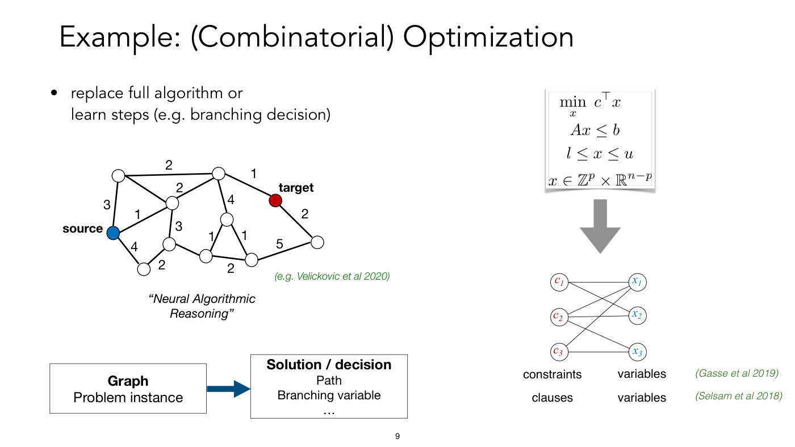

*Slide 9 — combinatorial optimization on graphs: a shortest-path instance, and a linear program as a graph of constraints and variables.*

Why learn something that a classical algorithm already solves exactly? "These classical algorithms
can be slow." A graph net can learn heuristics that "work really well on the data distribution we
train it on", solving those problems faster, "but it won't be guaranteed to find the right answer
on other data distributions" (≈12:26–13:59).

## Two goals: node embeddings and graph embeddings

The input is a graph plus an attribute vector for each node, that is, an adjacency matrix
$\mathbf{A} \in \mathbb{R}^{n \times n}$ and a feature matrix $\mathbf{X} \in \mathbb{R}^{n \times d}$.
For a molecule a node's attributes might say which atom it is (≈13:59). The output is one of two
things. **Node embeddings** give a vector per node "that tells us something important about that
node", in the way an image patch can be embedded into a vector (≈14:45). **A graph embedding** is one
vector for the whole graph, for instance "is this molecule toxic or not?" The lecturer calls these
"node to vec" and "graph to vec" (≈14:45–15:30). Slide 10 draws both, and sums up: "GNNs: learn a
function from graph/neighborhood + node/edge attributes to vector" (≈15:30). Asked how the two relate, the lecturer said you can learn either or both, and that "in
general, we might learn a set of node embeddings and then sum them up at the end to get a graph
embedding" (≈16:17–17:05). Asked whether a large, densely connected adjacency matrix becomes
intractable: that is "the property of the data", and "we don't usually try to simplify the input
graph. We're going to take the input graph as given" (≈17:05–17:51).

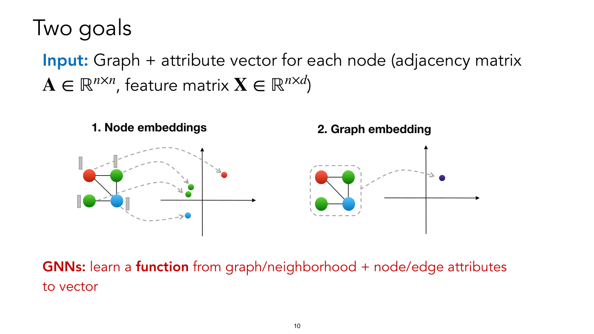

*Slide 10 — the two goals: one vector per node, or one vector for the whole graph.*

## Why not an MLP? Permutation invariance and equivariance

"Idea 1" is to serialize the adjacency matrix and the node attributes into one long vector and
feed it to an MLP (≈17:51–20:12). The example adjacency matrix is

$$\mathbf{A} = \begin{pmatrix} 0 & 1 & 0 & 1 \cr 1 & 0 & 0 & 1 \cr 0 & 0 & 0 & 1 \cr 1 & 1 & 1 & 0 \end{pmatrix}$$

where a 1 in row $i$, column $j$ means an edge between nodes $i$ and $j$ (slide 11). Its fourth row
has three 1s, so it belongs to the only node with three edges, the blue node of slide 10's four-node
graph (≈18:37–19:22).

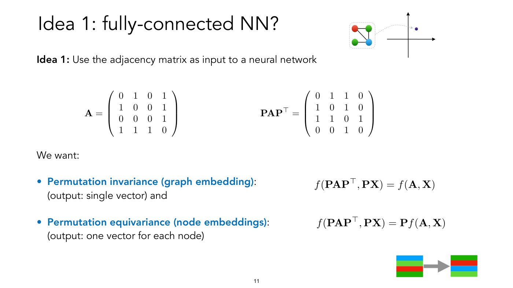

*Slide 11 — renumbering the nodes permutes the adjacency matrix; a graph-level output should not change, and per-node outputs should be permuted the same way.*

What is wrong with the MLP? One student pointed out that adjacency matrices hold only 0s and 1s;
another gave the answer the lecturer had in mind: "It depends on the index you put on the nodes. So
if you permute, it's not going to work" (≈20:12). The numbering is arbitrary ("why didn't I say that
index 3 is the blue node?"), and "the structure of a molecule in many types of graph data don't
really depend on the ordering of the nodes" (≈20:59). Renumbering the nodes by a permutation matrix
$\mathbf{P}$ turns $\mathbf{A}$ into $\mathbf{P}\mathbf{A}\mathbf{P}^\top$ ("the first matrix, P,
permutes the rows, and the P transpose permute the columns") and the $4 \times d$ attribute matrix
into $\mathbf{P}\mathbf{X}$, and describes the same graph (≈21:45–22:31). Slide 11 asks for:

- **Permutation invariance**, for a graph embedding (output: a single vector):
  $f(\mathbf{P}\mathbf{A}\mathbf{P}^\top, \mathbf{P}\mathbf{X}) = f(\mathbf{A}, \mathbf{X})$.
- **Permutation equivariance**, for node embeddings (output: one vector for each node):
  $f(\mathbf{P}\mathbf{A}\mathbf{P}^\top, \mathbf{P}\mathbf{X}) = \mathbf{P} f(\mathbf{A}, \mathbf{X})$.
  "If I shuffle my nodes, then I should end up shuffling my predictions" (≈23:16).

This is the graph counterpart of lecture 4: "Where convolutional networks are invariant or
equivariant to translation, graph nets are going to be invariant or equivariant to permutations of
the inputs" (≈22:31). It is "the kind of fundamental symmetry that we're going to be exploiting
with graph neural networks", appropriate when "the problem of interest is actually
permutation-equivariant or invariant" (≈24:04).

Three questions followed. When would you *not* want invariance? If molecules always came in one
canonical orientation, you would want to use it; the lecturer promised a fuller example later
(≈24:51), and gave one at ≈41:08: in image processing "the top of the image is more likely to be
sky than the bottom", so a patch should know where it is, and "translation invariance is one type
of permutation invariance, but permutation invariance is a more general version of that." Must an
invariant output be a single vector? No: it "could be any dimensionality"; invariance only means
the same output for every permutation (≈25:37). And how do you know a problem calls for it? "Any
problem where the ordering of inputs doesn't change … the prediction you want to make", which
depends on the domain; shortest paths are one (≈40:21).

## Graphs and grids

"So ConvNets are graph nets applied on a grid" (≈26:24). An image is a grid of pixels or patches,
which is "just a graph of nodes, and the edges between the nodes are the weights of the
convolutional filter"; a graph net is "the same idea, except generalized to non-grid topologies"
(≈26:24–27:10). The class named the differences (≈27:10–28:41):

- **The neighbourhood is not the same shape everywhere.** A node may have any number of
  neighbours, "not … always, like, a 3 by 3 patch", which also has hardware implications.
- **The neighbourhood has no structure.** In a ConvNet "left and right have a different meaning
  than up and down"; in a graph net the update does not depend on where the neighbours lie, and
  all are treated equally.

And slide 12's commonalities: **local operations** (each node takes input only from its
neighbours); **globalize through depth** ("every time I repeat it, I will hop one more neighbor
away, and eventually, I'll cover the entire graph"); **weight sharing** (the same parameters update
every local region); and **input can have varying size**, unlike an MLP's fixed-dimensional input
(≈28:41–30:16). Weights *can* also be shared across depth, but need not be (≈30:16; see
[sharing across layers](#gnns-unrolled-an-mlp-whose-neurons-are-vectors) below).

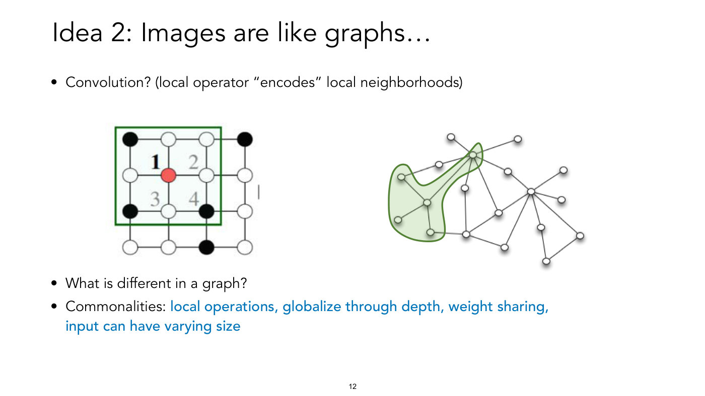

*Slide 12 — a convolution's window on a grid, and a node's neighbourhood on a general graph: local operations, depth, weight sharing, any input size.*

Slide 13 makes the correspondence exact: "A CNN is a GNN over a grid graph", with "GNN's attribute
vector per node == CNN's column of channels at each index in a feature map." Its 6-by-6 grid of
nodes is wired as four separate 3-by-3 stars, each centre node joined to its eight neighbours. The
review questions: the kernel size is 3 by 3, and the stride is 3, "because I didn't draw edges
between" the stars: the template moves "over by 3 to get the next filter's application"
(≈31:01–32:32). See [convolution](convolution.md).

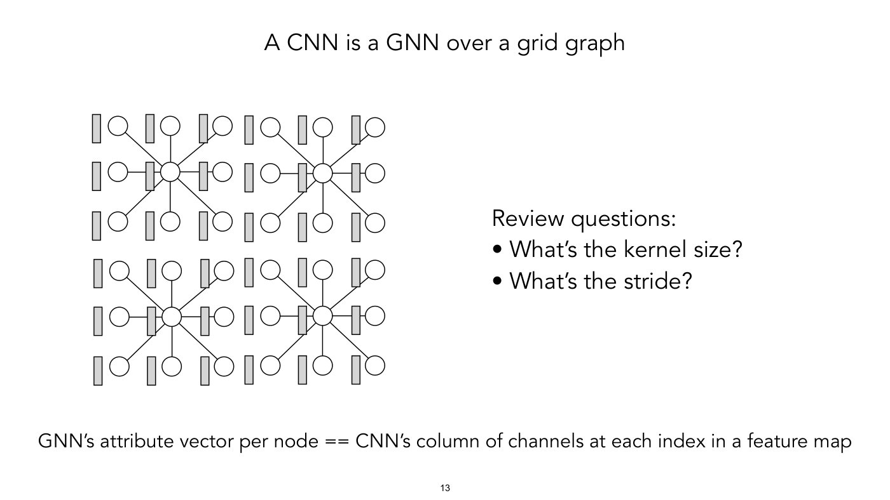

*Slide 13 — a CNN is a GNN over a grid graph: 3-by-3 neighbourhoods applied with stride 3.*

## Message passing

Slide 15 gives the plan in a box: "1. Encode each node (based on message passing between nodes). 2.
Aggregate *set* of node embeddings into a graph embedding." Its picture colours two neighbourhoods
of a graph, each feeding one vector of a stack of node embeddings.

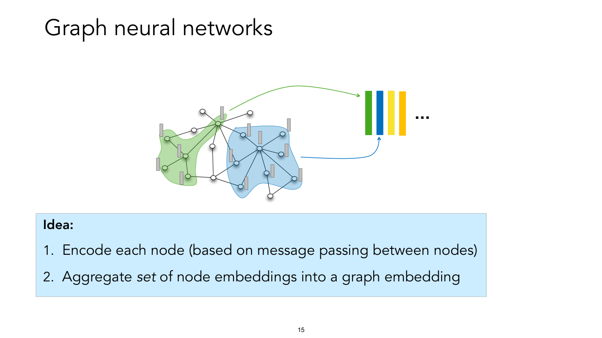

*Slide 15 — the plan: encode each node by message passing, then aggregate the set of node embeddings into a graph embedding.*

A GNN layer has two steps: "we're going to pass messages from each node to its neighbors. And the
next step is we're going to aggregate all of those messages to update the representation of each
node" (≈32:32). In the general form (≈33:17–34:53), each round $k$ first **aggregates** information
from the neighbours:

$$\mathbf{m}_ {\mathcal{N}(v)}^{(k)} = \text{AGGREGATE}^{(k)} \left( \lbrace \mathbf{h}_ u^{(k-1)} : u \in \mathcal{N}(v) \rbrace \right)$$

where $\mathbf{h}_ u^{(k-1)}$ is the "feature description of node u in round k-1". Then **update**
the node's own representation with the message:

$$\mathbf{h}_ v^{(k)} = \text{UPDATE}^{(k)} \left( \mathbf{h}_ v^{(k-1)}, \mathbf{m}_ {\mathcal{N}(v)}^{(k)} \right)$$

"Importantly, aggregate is going to be a function that is permutation-invariant. So if I reindex
into my neighbors, then I shouldn't get any different output message" (≈34:08). In words: "My
neighbors told me something about what they know about the graph and about the world. And I'll
combine that information with what I know about myself to update my own representation"
(≈34:53).

These are slide 16's two equations. Repeating the two steps $k$ times "is like going in depth in a
neural network", and each round increases a node's receptive field by one hop: in the slide's picture the red node hears from the
green nodes, two hops away, only on the second round, with the message passed "from the green
node to the blue node, now to the red node" (≈34:53–35:39). The lecturer notes that this is one
perspective among several, familiar from message-passing algorithms on hidden Markov chains
(≈35:39). Slide 16's footer lists the literature behind the general form, from Merkwirth and
Lengauer (2005) and Scarselli et al. (2009) to Kipf and Welling (2017), Gilmer et al. (2017) and
Velickovic et al. (2018).

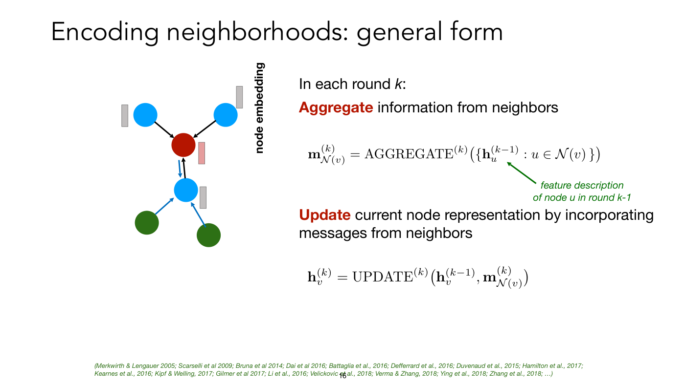

*Slide 16 — one round of message passing: aggregate the neighbours' vectors, then update the node; a second round reaches two hops.*

Slide 17 writes the aggregation in a common factored form: a function $\psi^{(k)}$ applied to each
neighbour's vector together with the node's own, combined by a permutation-invariant operator
$\bigoplus$:

$$\mathbf{m}_ {\mathcal{N}(v)}^{(k)} = \bigoplus_{u \in \mathcal{N}(v)} \psi^{(k)} \left( \mathbf{h}_ u^{(k-1)}, \mathbf{h}_ v^{(k-1)} \right)$$

with the neighbourhood $\mathcal{N}(v) = \lbrace u \mid \exists (u, v) \in E(\mathcal{G}) \rbrace$, the
nodes joined to $v$ by an edge.

## Aggregation functions

"The aggregate function is going to be any set function. That means it takes as input a set of
items where the ordering doesn't matter" and produces a vector. Technically it is a **multiset**
function, because the neighbours' vectors may contain duplicates (slide 18, ≈35:39–36:26). Slide
18's examples (≈36:26–37:59):

- **Sum**, $\mathbf{m}_ {\mathcal{N}(v)} = \sum_{u \in \mathcal{N}(v)} \mathbf{h}_ u$, takes a set of
  any size to a vector and ignores order. The slide prints the same formula with a faded
  $\frac{1}{|\mathcal{N}(v)|}$ in front: with it, the aggregate is the **average**, which "has
  interesting different properties. We'll get into that in a bit."
- A **symmetric normalization**,
  $\mathbf{m}_ {\mathcal{N}(v)} = \sum_{u \in \mathcal{N}(v)} \mathbf{h}_ u / \sqrt{|\mathcal{N}(v)||\mathcal{N}(u)|}$
  (Kipf and Welling; Hamilton et al.), normalizes by the neighbour counts of both the receiving and
  the sending node.
- **Max or min**, coordinate-wise, $\mathbf{m}_ {\mathcal{N}(v)} = \max \lbrace \mathbf{h}_ u^{(k-1)} : u \in \mathcal{N}(v) \rbrace$,
  "a lot like the pooling operations in convolutional networks" (the slide omits the closing brace).

"The key property is that aggregate is not a universal function, and it can't represent everything.
Aggregate is constrained" (≈37:12).

### Shortest paths with min-aggregation

A min-aggregation can implement a classical algorithm: Bellman-Ford shortest paths (slide 18,
≈37:59–39:34). Each node holds a scalar $d_v$, its estimate of the cost of the shortest path to the
target, initialized to 0 at the target and infinity everywhere else, and the recurrence

$$d_v^{(k)} = \min_{u \in \mathcal{N}(v)} d_u^{(k-1)} + \text{cost}(u, v)$$

is run until it converges. The distances spread outward from the target, 1 for its neighbours if
each hop costs 1, and so on. Slide 19 sets Bellman-Ford's loop beside a GNN's: where Bellman-Ford
computes `d[k][u] = min_v d[k-1][v] + cost(v, u)`, the GNN computes
$\mathbf{h}_ u^{(k)} = \sum_v \text{MLP}(\mathbf{h}_ v^{(k-1)}, \mathbf{h}_ u^{(k-1)})$, with "sum or max
pooling" in place of the sum. In the lecturer's words, "Bellman-Ford can be implemented just as a
GNN that only does aggregate, and the update is trivial in this case"; "the aggregate is going to be
a min for Bellman-Ford rather than the sum", and the neighbour's distance plus the edge cost "could
be represented as an MLP" (≈41:54–42:40). The problem set works through this construction.

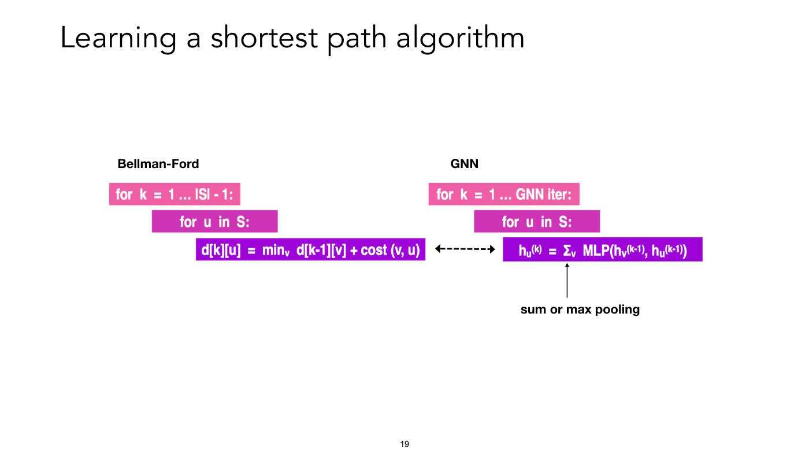

*Slide 19 — Bellman-Ford's shortest-path loop beside a GNN's: the min over neighbours becomes a sum or max of MLP messages.*

### A universal aggregator for multisets

"Is there a family of aggregation functions that are universal in the sense that any multiset
permutation invariant mapping can be represented in that family? And the answer is that, yes"
(≈42:40). The general form is a **learned aggregation function** (Zaheer et al. 2017, Qi et al.
2017, Xu et al. 2019):

$$\mathbf{m}_ {\mathcal{N}(v)} = \text{MLP}_ 2 \left( \sum_{u \in \mathcal{N}(v)} \text{MLP}_ 1 (\mathbf{h}_ u, \mathbf{h}_ v) \right)$$

Pass each neighbour's vector and your own through an MLP, sum over the neighbours, and pass the
sum through another MLP (slide 20, ≈43:27). This raised the obvious objection — aren't MLPs already universal
approximators? They are, as the width goes to infinity, "but here we're not trying to approximate
all functions … we want to have an approximator that can't fit functions that are not multiset
functions." The sum is what keeps the family inside the multiset functions: "it is a universal
approximator to the family of multiset functions, but it can't represent other functions. So that's
good. It's a constrained family" (≈43:27–44:13). Asked what the aggregate's output is, the lecturer
said a $D$-dimensional column vector (≈41:54).

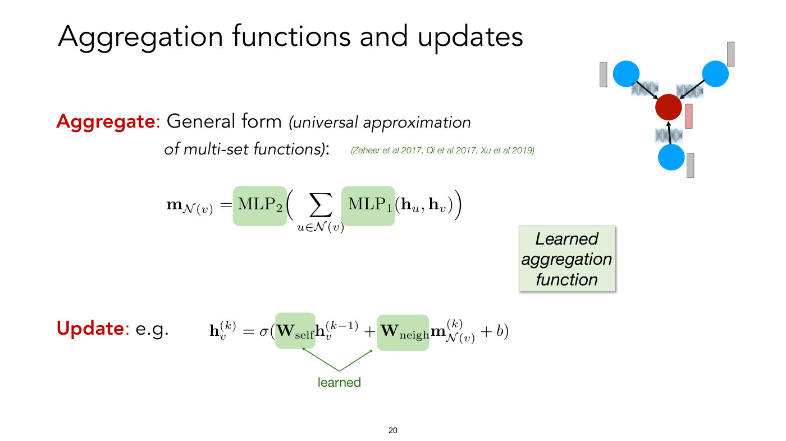

*Slide 20 — a learned aggregation (an MLP of a sum of MLPs) and a one-layer update; the green boxes are what is learned.*

### The update

The **update** combines the message with the node's current vector. The slide's example is "just a
tiny, one-layer MLP" (≈44:59):

$$\mathbf{h}_ v^{(k)} = \sigma \left( \mathbf{W}_ {\text{self}} \mathbf{h}_ v^{(k-1)} + \mathbf{W}_ {\text{neigh}} \mathbf{m}_ {\mathcal{N}(v)}^{(k)} + b \right)$$

a linear map of the node itself plus a linear map of the message plus a bias, through a pointwise
non-linearity $\sigma$ such as a ReLU; $\mathbf{W}_ {\text{self}}$ and $\mathbf{W}_ {\text{neigh}}$
are learned. Why two weight matrices? "You could always just concatenate h, your node embedding,
with the message from the neighbors, with m, and then have one big W … It's just separated here for
notational clarity" (≈51:58–52:44).

## Graph embeddings: the readout

Node embeddings are already a prediction about each node. To predict something about the whole
graph, "I just do one more step … I aggregate the node embeddings into a final prediction," called
the **readout** (≈45:45):

$$\mathbf{h}_ {\mathcal{G}} = \text{READOUT} \left( \lbrace \mathbf{h}_ v^{(K)} : v \in \mathcal{G} \rbrace \right)$$

over the node vectors after the last round $K$ (slide 21). It is a "pooling operation (just like AGGREGATE)":
another multiset function, "but it's over all nodes in the graph, as opposed to the neighbors of a
node" (≈45:45–46:31). Slide 21 repeats slide 15's box with the second step, the graph embedding,
in bold, and draws the stack of node embeddings pooled into one vector. The lecturer adds that this split into aggregate, update and readout is one convention among several,
"one that makes some of the analysis simple and clean" (≈45:45).

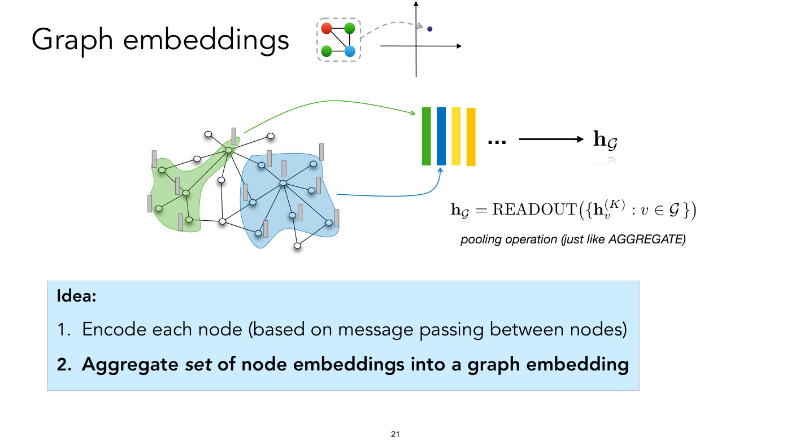

*Slide 21 — the readout pools all the node embeddings into one vector for the graph.*

## GNNs unrolled: an MLP whose neurons are vectors

The lecturer's preferred view, "which will connect very intimately to what we'll see soon, which is
transformers", unrolls the iterations as layers (≈46:31–49:42). Each layer takes the set of node
vectors (the input layer is the observed data: an atom, a drug, a user profile) and produces a new
set. In slide 22's four-node graph the red node's neighbours are the teal, blue and yellow nodes, so
AGGREGATE combines their three vectors into one $D$-dimensional message, and UPDATE combines it with
the red node's own vector (≈48:07).

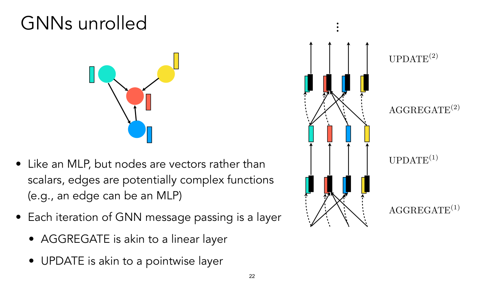

*Slide 22 — message passing unrolled: each round is a layer, AGGREGATE mixes along the graph's edges and UPDATE acts on each node separately.*

Unrolled, this "looks a lot like a neural network MLP", in the words of the slide's bullets:

- "Like an MLP, but nodes are vectors rather than scalars, edges are potentially complex functions
  (e.g., an edge can be an MLP)."
- "Each iteration of GNN message passing is a layer": AGGREGATE is akin to a linear layer, and
  UPDATE is akin to a pointwise layer, a vector-to-vector map applied to every node (≈48:53–49:42).

Several questions followed (≈49:42–53:31):

- *How is this different from an attention head?* "Transformers are a special kind of graph net …
  Attention is just a special aggregation operator."
- *Is the update always non-linear?* You need some non-linearity; it can sit in the aggregate,
  the update or both, and typically both are non-linear. The lecturer guessed that universal
  approximation might be provable with only one non-linear, adding "I have to think about that a
  little bit more."
- *How many rounds?* The number of rounds $k$ is like depth, and parameters can be shared across rounds or not. With
  a separate $\text{AGGREGATE}^{(k)}$ per round you "pick a fixed depth, k, that we're going to
  unroll to and train for that depth"; with one shared set "you can just run this as long as you
  want", and might then want guarantees that it converges if run forever.
- *What about edge information, such as distances?* Here edges only say who sends messages to
  whom, but "you can also have edge attribute vectors" that the aggregate and update take into
  account.

**Training is ordinary backpropagation.** Message passing is not an optimization algorithm: "the
message passing in this propagation — that's the forward pass through the network … So how would
you train that? You just backpropagate through this computation graph. Nothing different"
(≈53:31–54:20). See [backpropagation](backpropagation.md).

**An MLP is a GNN over a single node** (slide 23, ≈54:20–55:51). A node's vector has the generality
of an MLP's input vector; with no neighbours the aggregate is trivial, "it can be identity", and the
update reduces to $\sigma(\mathbf{W}_ {\text{self}} \mathbf{h}_ v)$, a linear layer and a pointwise
non-linearity, repeated. "So an MLP is just a graph net that's a single node. ConvNet is a graph net
that is a grid." The lecturer's general point: "when you first learn about deep learning … it'll
seem like everything is different, but really, everything is the same" (≈55:51). See
[multilayer perceptrons](multilayer-perceptron.md).

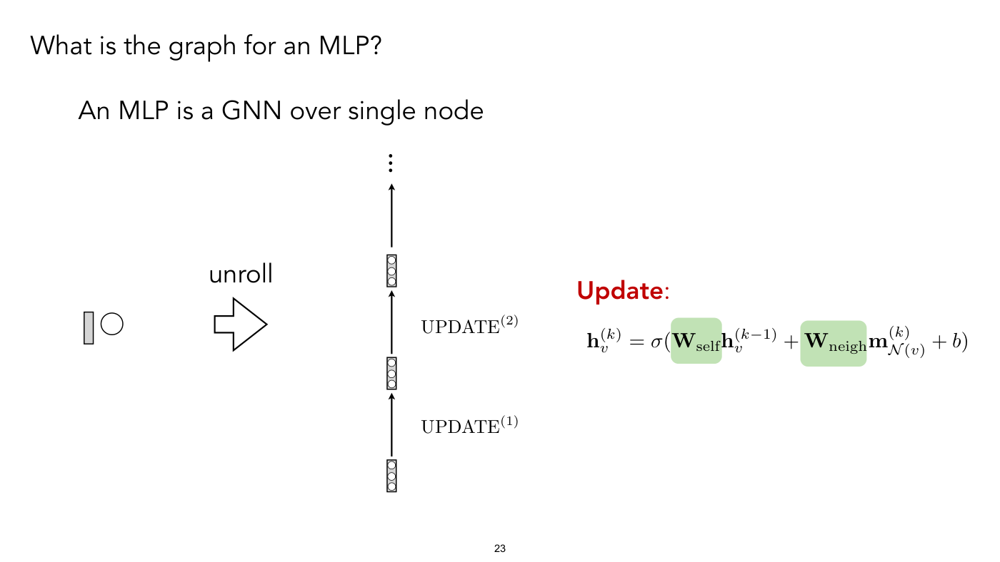

*Slide 23 — an MLP is a GNN over a single node: with no neighbours, every update is just a layer.*

## Generalizations

Slide 24 lists variations, mostly left to the reading (≈55:51–57:24):

- **Edge attributes** in the aggregation:
  $\mathbf{m}_ {\mathcal{N}(v)} = \sum_{u \in \mathcal{N}(v)} \text{MLP}^{(k)}(\mathbf{h}_ u^{(k-1)}, \mathbf{h}_ v^{(k-1)}, \mathbf{w}_ {uv})$.
- **Multi-relational** graphs: multiple "channels", with different aggregations for different
  types of edges, like "n different message-passing algorithms in parallel that are passing
  different types of messages".
- **Attention** (Velickovic et al. 2018):
  $\mathbf{m}_ {\mathcal{N}(v)} = \sum_{u \in \mathcal{N}(v)} \alpha_{v,u} \mathbf{h}_ u$, "like a
  summation that's dependent on the value of your node embeddings … the name for that system is
  called a transformer. So transformers are graph nets with attention as the aggregation operator."
- **Janossy pooling** (Murphy et al. 2018): a permutation-sensitive function averaged over
  permutations.

The assigned reading was "a chapter on graph nets", from a longer manuscript that the lecturer
recommends reading beyond the assigned part (≈57:24).

## The tree view and weight sharing

For the theory, the lecturer gives one more picture: what a node sees (slides 25–27,
≈57:24–1:00:33). Node A has neighbours B, C and D. One round of message passing feeds A a message
from a learned aggregation (a grey box) over B, C and D; a second round feeds each of B, C and D its
own aggregated message from *its* neighbours, which include A again. "Suppose you're standing on
the graph at node A. This is who's talking to you, and this is the funnel of information coming
into you," a tree whose depth grows by one with each round: the layer-2 representation of A is
built from layer-1 representations of its neighbours, which are built from the layer-0 inputs.

Asked whether a GNN starts from a fully connected graph and prunes it, the lecturer said that "the
vanilla answer for GNNs is … the data tells you the connectivity". A molecule's graph is given, not
optimized; learning the graph structure is "another problem, but we're not going to get to that
today" (≈59:00–1:00:33).

All the aggregation boxes within a layer share their weights (slide 27's "shared weights";
≈1:00:33). Slide 28 spells out what that buys: "We use the same aggregation functions for all
nodes. So we can generate encodings for previously unseen nodes & graphs too! (dynamic graphs,
different molecules, …)" Just as a ConvNet trained on small images can run on big ones, a graph
net trained on graphs of one size can run on graphs of another. The lecturer's caveat: functionally
it can process any size, but "statistically, they might only generalize to graphs of a slightly
different size because they'll have maybe overfit to the training data which came in a certain
size" (≈1:01:19–1:02:04).

## Training a GNN

Slide 29 asks three questions (≈1:02:04–1:04:24). **What is a data point?** For a node-level task,
{node, label} pairs: a graph with a ground-truth label for every node, plus its adjacency structure,
"because that's going to be used in the algorithm, too", such as a social network with each
person's favourite music. For a graph-level task, {graph, label} pairs, such as a molecule and
whether it is toxic. **What to specify?** The aggregate, update and readout functions, and a loss
on the prediction, for example a cross-entropy between each node's prediction and its label.
**Train** with backpropagation and stochastic gradient descent. (Asked about the blue shading on
slide 29's graphs, the lecturer said it only isolates one node and its neighbours: "don't read too
much into the visualization", ≈1:04:24–1:05:10.)

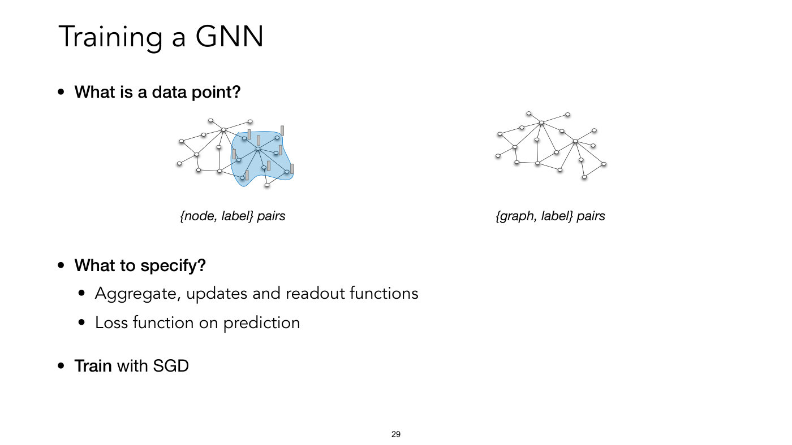

*Slide 29 — training: a data point is a graph with a label per node, or with one label for the whole graph.*

The two example architectures on slides 30 and 31 were skipped in the lecture, "you can read that
more if you're interested" (≈1:05:10–1:05:56). Slide 30 is the polypharmacy network of Zitnik,
Agrawal and Leskovec: a separate aggregation per edge type $r$ (two side-effect relations between
drugs and a drug–target relation to proteins), then summed,

$$\mathbf{h}_ v^{(k+1)} = \text{ReLU} \left( \sum_r \sum_{u \in \mathcal{N}_ r(v)} c^{vu} \mathbf{W}_ r^{(k)} \mathbf{h}_ u^{(k)} + c_r^v \mathbf{h}_ v^{(k)} \right)$$

as printed (the first normalizing constant carries no $r$, the second does). Slide 31 is Google
Maps' ETA model (Derrow-Pinion et al., CIKM 2021): road segments of 50–100 m grouped into
supersegments of about 20 segments, with historical travel times, road type and current traffic as
inputs; three aggregation and update operations, for segments, edges and supersegments; a
combination of pooling operations; and a loss summed over several time horizons. Slide 32 lists
connections to graph signal processing, inference in graphical models ("neural message passing"),
distributed algorithms, random walks (oversmoothing, skip connections) and graph isomorphism
testing (≈1:05:56).

## Approximation power: which graphs can a GNN tell apart?

"The key question here is going to be, which graphs can a GNN … distinguish? And we'll see that they
actually can't distinguish all possible graphs from each other" (slide 34, ≈1:05:56). If a GNN
computes the same output $f(G) = f(G')$ for two different graphs, it cannot approximate any
function that gives them different values. So the analysis looks for the **equivalence classes**
of graphs that GNNs cannot separate (≈1:06:42–1:07:28).

The link can be made precise. Two graphs are equivalent under a function class $\mathcal{F}$ when
every function in it agrees on them,

$$(G, G') \in \rho(\mathcal{F}) \iff \forall F \in \mathcal{F}, \thinspace F(G) = F(G')$$

and "distinction implies function approximation for node and graph predictions" (slide 35; a
symmetric Stone–Weierstrass theorem; Azizian and Lelarge, Chen–Villar–Chen–Bruna, Keriven and Peyré,
Maron–Fetaya–Segol–Lipman). The theorem: "If function $H$ on a compact domain does not assign
different labels to graphs in one equivalence class, then it can be approximated by message passing
GNNs":

$$\forall \epsilon \gt 0, \thinspace \exists F \in \mathcal{F}^{\text{GNN}} : \sup_{G \in K} \lVert H(G) - F(G) \rVert \le \epsilon$$

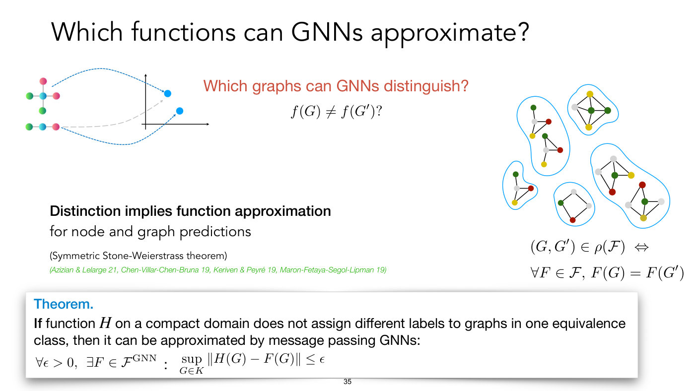

*Slide 35 — graphs a function class cannot separate form equivalence classes; anything that respects those classes can be approximated by message-passing GNNs.*

The lecturer stated the other direction aloud: if a graph net cannot distinguish two graphs in an
equivalence class, "then clearly, it must incur an approximation error if the function I'm trying
to approximate does distinguish between those two graphs" (≈1:07:28). Together: what GNNs can
approximate is exactly what respects their equivalence classes. See
[representational power](representational-power.md).

### Equivalence through neighbourhood trees

What does a graph net see? The trees of the previous section. Each node's view is its neighbourhood
tree, so "from the perspective of a graph net, these trees are the entire characterization of that
graph … So if two graphs have the same tree structures for all the nodes, then those two graphs are
equivalent according to the graph net" (slide 36, ≈1:07:28–1:09:00).

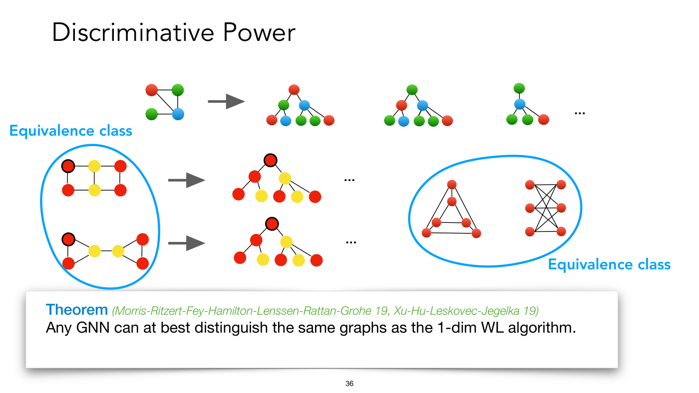

*Slide 36 — each node sees only its neighbourhood tree, so the different graphs inside each oval look the same to every GNN.*

Two different graphs can have the same trees. Slide 36's first example is a pair of six-node
graphs, each with four red nodes and two yellow: "One has these two closed planar regions, and the
other has two regions, but there are triangles." They are structurally different, yet the
top-left red node has the same tree in both — a yellow and a red neighbour, the yellow one having
red, yellow and red neighbours, and so on all the way down (≈1:09:00–1:09:47). "That means that if
one of these molecules is toxic and the other is not … a graph net will have to assign the same
label to them." The second pair, a triangular prism and the complete bipartite graph
$K_{3,3}$ (each with six nodes and nine edges, every node of degree 3), is "a bit harder to see"
(≈1:10:32). The problem set asks for more examples.

A student proposed giving each node a one-hot encoding of its index. That breaks the symmetry, the
lecturer agreed, "but the power of graph nets is that you want to be invariant to the ordering of
the nodes. And so by breaking that symmetry, you break the permutation invariance. So it's a
trade-off" (≈1:09:47–1:10:32). He returned to it at the end of the lecture.

### The Weisfeiler-Leman test

This connects to "deep and old theory in graphs, graph isomorphism", going back to the 1960s
(≈1:11:17). The **Weisfeiler-Leman** algorithm, or **color refinement** (Morgan 1965; Weisfeiler and
Leman 1968), decides whether two graphs might be the same. "Roughly, … you assign colors to the
nodes in the graph, and then you do some kind of propagation, and you'd decide if two graphs are
the same if they result in the same coloring" (≈1:12:03); the lecturer did not go through the
details. Slide 37 writes it out. A coloring $c^{(t)} : V(G) \to \Sigma$ is refined by hashing
each node's colour together with its neighbours' colours,

$$c^{(t)}(v) = \text{Hash} \left( c^{(t-1)}(v), c^{(t-1)}(u) \mid u \in \mathcal{N}(v) \right)$$

and the isomorphism test asks whether the two graphs' final colour multisets differ:

$$\lbrace c^{(t_\infty)}(v) \vert v \in V(G) \rbrace \neq \lbrace c^{(t_\infty)}(v') \vert v' \in V(G') \rbrace \thinspace ?$$

Slide 38 sets the GNN beside it, $\mathbf{h}_ v^{(t)} = f_{\text{Update}} \left( \mathbf{h}_ v^{(t-1)}, f_{\text{Agg}} ( \lbrace \mathbf{h}_ u^{(t-1)} \mid u \in \mathcal{N}(v) \rbrace ) \right)$:
the same shape, with the hash replaced by learned aggregate and update functions.

The theorem (slides 36 and 39; Morris, Ritzert, Fey, Hamilton, Lenssen, Rattan and Grohe 2019; Xu,
Hu, Leskovec and Jegelka 2019): "Any GNN can at best distinguish the same graphs as the 1-dim WL
algorithm. For any $n$, there exists a GNN such that for any $t$, $c^{(t)} \equiv h^{(t)}$." The
second sentence is the surprising half: "it's not only, can best. It's actually, you can achieve
this … So we have universal approximation within this family" of graphs that the
Weisfeiler-Leman test can tell apart (≈1:12:03–1:12:48).

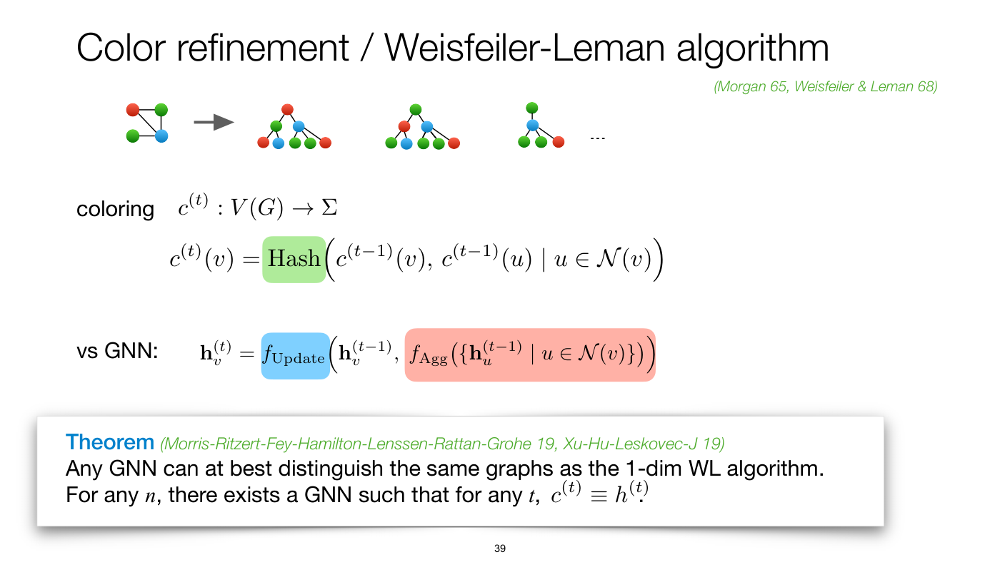

*Slide 39 — color refinement beside a GNN layer: a GNN can match the 1-dim Weisfeiler-Leman test, but not beat it.*

### Injective aggregation

The gist of why the bound is reachable is a two-part argument (slide 40, ≈1:12:48–1:13:36). "Any
(multi-)set function can be represented with nonlinear functions $g_1, g_2$ as"

$$f_{\text{Agg}}(S) = g_1 \left( \sum_{\mathbf{h} \in S} g_2(\mathbf{h}) \right)$$

(the slide drops the opening bracket after $g_1$), and "we can universally approximate $g_1$ and
$g_2$ by MLPs!" That gives slide 20's aggregation again,
$\mathbf{m}_ {\mathcal{N}(v)}^{(k)} = \text{MLP}_ 2 \sum_{u \in \mathcal{N}(v)} \text{MLP}_ 1 ( \mathbf{h}_ u^{(k-1)} )$:
an aggregation of this form can be made injective on multisets, and so can separate exactly what
the Weisfeiler-Leman test separates.

How common are indistinguishable graphs in practice? "I think that last year, I said, oh, it's an
edge case … And then I realized I don't actually know." It is a worst case, "like an adversarial"
one, and whether a benign and a toxic molecule could ever collide this way "would be really
interesting to know … I imagine that for health and safety-critical applications, this is important
to understand" (≈1:13:36–1:14:23).

### Does it matter in practice?

Slide 41 says it does (≈1:14:23–1:18:15). It plots training accuracy against epochs on the PROTEINS
data set for different choices of $g$ and of the pooling operation. This is "just about
approximation, not about generalization. Can I fit the training data?"

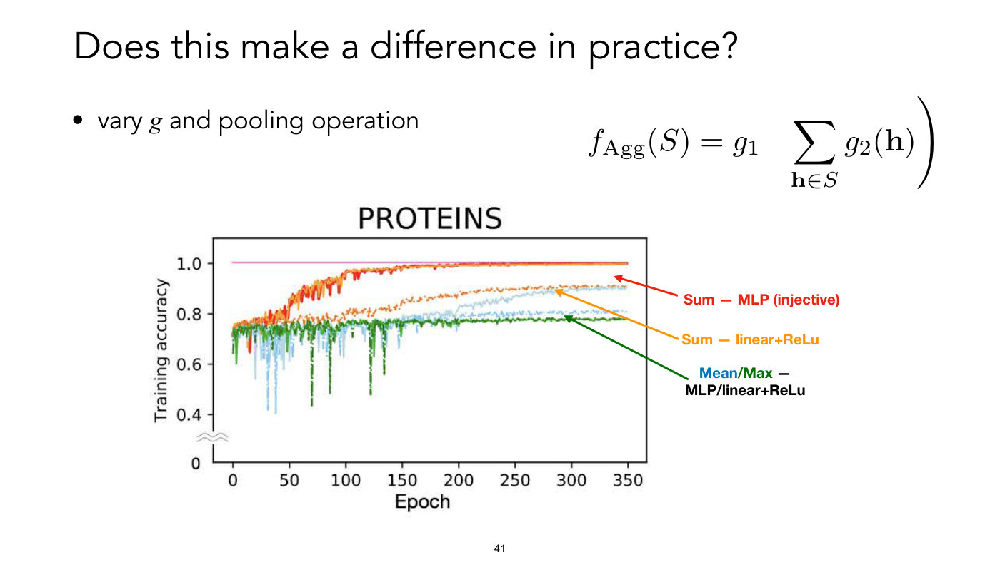

*Slide 41 — training accuracy on PROTEINS: only sum with an MLP fits the training data.*

- **Sum with an MLP** (the red curve, labelled "Sum — MLP (injective)"), the universal multiset
  approximator, reaches 100% training accuracy.
- **Sum with a single linear layer and ReLU** ("Sum — linear+ReLu") plateaus lower. "Linear ReLU is
  not a full MLP. It's not a universal approximator … So let's say I just decided, I'm going to save
  some computation. I'm going to skip that line in PyTorch. Well, that's not a universal
  approximator," and it cannot fit the data.
- **Mean or max** ("Mean/Max — MLP/linear+ReLu") do worse still. Replacing the sum by the mean, which
  you might do because it seems "more numerically stable", makes the thing "fail completely". Why?
  A student answered: the mean cannot tell how many neighbours there are. "Taking the sum knows
  something about the total number of neighbors, because it gets bigger with more neighbors. Taking
  the mean divides by the number of neighbors, so it loses information," and this problem needs it.

The plot has eight curves but labels only these three groups, with arrows. Read off the slide, the
curves the "Sum — MLP" arrow points at reach 1.0, those the "Sum — linear+ReLu" arrow points at end
near 0.9, and those the "Mean/Max" arrow points at end near 0.78–0.81, with deep dips along the way.
The lecturer called the mean "the blue curve" (≈1:16:44); on the slide "Mean" is printed in blue and
"/Max" in green.

"So the theory actually is meaningful here … if you use something that does not have the capacity
to approximate the family you care about, you can just be fundamentally limited" (≈1:16:44). "These
tiny little details can actually make a big difference" (≈1:18:15).

### What message passing cannot compute

Slide 42 asks whether GNNs can compute "the length of the shortest / longest cycle", the "diameter
of the graph" or "the number of occurrences of a motif", and answers with a lemma (Garg et al. 2020,
Chen et al. 2020): "No! Message Passing GNNs (as discussed here) cannot compute these in general."
The reason is the same: "you can construct two graphs that are isomorphic according to the GNN, two
graphs that have the same neighborhood structure but different diameters", so no amount of training
data helps, and the error can be arbitrarily large (≈1:18:15–1:19:02).

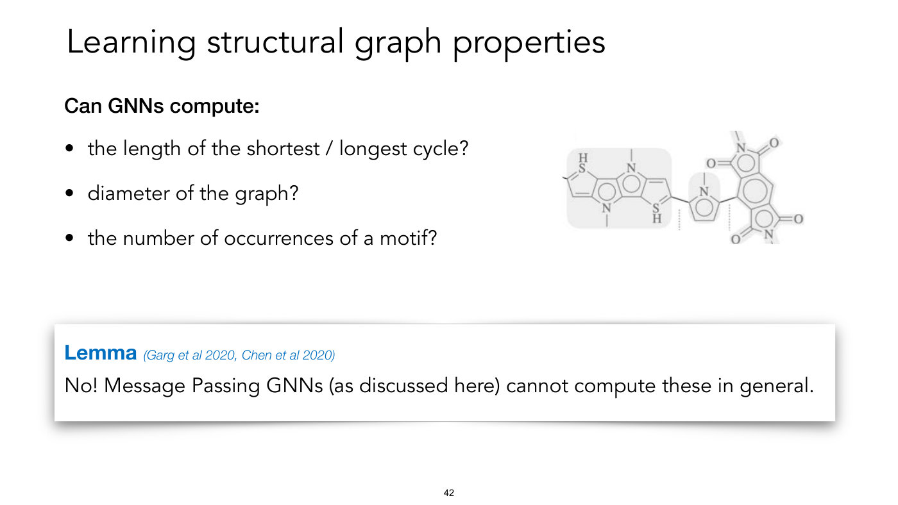

*Slide 42 — cycle lengths, diameter and motif counts are beyond plain message passing.*

## Positional encodings: buying discrimination back

The way around these limits is the one the student suggested: "So more generally, positional
encodings" (≈1:19:02). As a ConvNet can be made not translation-equivariant by telling each
location where it is, a graph net can be made not permutation-invariant by giving each node an
input that says where it sits in the graph, which breaks the symmetries that made two graphs
equivalent (slide 43). The lecturer recalls lecture 4's sinusoidal positional encoding for images; "in a graph, we can get a
kind of generalized version of where you are in the graph using the eigenvectors of the graph
Laplacian … a generalized coordinate system for your location of a node within a graph"
(≈1:19:50).

Slide 43: "Add node input features that encode 'position' in the graph. For instance: eigenvectors
of the graph Laplacian (or its normalized versions)", $\mathbf{L} = \mathbf{D} - \mathbf{A}$, where
$\mathbf{D}$ is the diagonal matrix of node degrees and $\mathbf{A}$ the adjacency matrix. This
"adds global structural information", with a "challenge: ambiguities (sign flips, eigenvalue
multiplicities)". The slide shows a molecule's nodes coloured by several Laplacian eigenvectors
(Kreuzer et al. 2021), and a bar chart on molecule regression (ZINC) in which Laplacian positional
encodings lower the test error relative to the "standard" model (Lim et al. 2022). The appendix,
slide 46, defines the Laplacian: $\mathbf{L} = \mathbf{D} - \mathbf{A}$ with
$\mathbf{D}_ {ii} = \deg(v_i)$ (or the sum of the edge weights at $v_i$) and zero off the diagonal,
and its normalized forms $\mathbf{I} - \mathbf{D}^{-1} \mathbf{A}$ and
$\mathbf{I} - \mathbf{D}^{-1/2} \mathbf{A} \mathbf{D}^{-1/2}$. The lecture did not go into it.

"And that can be good or bad because now you might not generalize to new permutations, but you will
be able to discriminate things you couldn't discriminate before. So it's a trade-off. So yeah,
that's just like positional encoding in CNNs, which we saw on the previous day" (≈1:19:50–1:20:36).
Slide 44 repeats lecture 4's answer to "What if you *don't* want to be shift invariant?": use an
architecture that is not shift invariant, such as an MLP, or add location information to the
input, a positional encoding. See
[neural fields and positional encoding](neural-fields-and-positional-encoding.md).

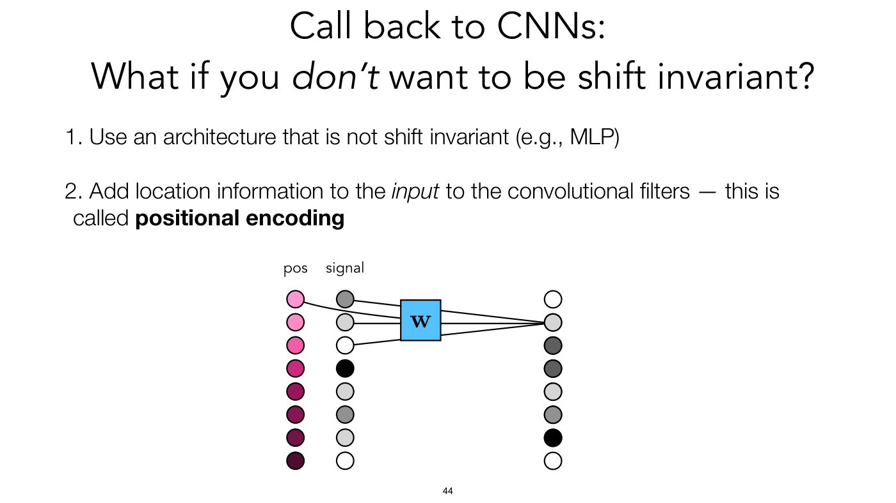

*Slide 44 — lecture 4's positional encoding, recalled: the filter sees a position input beside the signal.*

## Summary

Slide 45 sums up GNNs: they encode graph structure and node and edge attributes; "Important:
permutation invariance/equivariance"; the main idea is **message passing** and **aggregations**; they
**can take graphs of varying size and structure**, like CNNs; they connect to graph signal
processing, graphical models, distributed computing and isomorphism testing; and their
representational enhancements include higher-order methods and node IDs or augmentation. The
lecturer's closing words: "We saw that graph nets are appropriate for processing graph-structured
data. It turns out that a special case of the graph net is called the transformer, and that's just
the dominant architecture these days. And we're going to hear a lot more about that in a week or
so" (≈1:20:36).

## See also

- [Graph neural networks](graph-neural-networks.md) — the concept page: permutation symmetry,
  message passing, aggregation, readout, the Weisfeiler-Leman bound and positional encodings.
- [Inductive bias](inductive-bias.md) — architectures as constraints; permutation symmetry beside
  lecture 4's translation symmetry.
- [Convolution](convolution.md) — the grid case: a ConvNet is a GNN on a grid graph.
- [Representational power](representational-power.md) — what networks can approximate, now
  including what GNNs cannot distinguish.
- [Neural fields and positional encoding](neural-fields-and-positional-encoding.md) — positional
  encodings on grids, and the graph Laplacian's eigenvectors as their graph counterpart.
- [Multilayer perceptrons](multilayer-perceptron.md) — an MLP is a GNN over a single node.
- [Lecture 4 — Architectures: Grids](04-architectures-grids.md), the previous architecture lecture.
