# Lecture 6 — Generalization Theory

**Lecturer:** Phillip Isola ·
**Video:** [youtube.com/watch?v=EiO8BBa-xdc](https://www.youtube.com/watch?v=EiO8BBa-xdc) (80 min) ·
**Slides:** [`mit6_7960_f24_lec6.pdf`](https://ocw.mit.edu/courses/6-7960-deep-learning-fall-2024/mit6_7960_f24_lec6.pdf)
(66 pages; the deck is titled "NN Generalization (or: why do neural networks generalize?)"; transcribed slide by slide in [`raw/slides/06-generalization-theory.md`](../raw/slides/06-generalization-theory.md)) ·
**Transcript:** [`raw/transcripts/06-generalization-theory.md`](../raw/transcripts/06-generalization-theory.md)

## What this lecture establishes

The course so far has been about **approximation**: whether a network can fit its training data.
This lecture asks whether what it fits carries over to new data, which is **generalization**, and
why deep networks manage it. It answers the first question with a qualified yes. A deep net and a
"filing cabinet" that memorizes its training set can both fit the data perfectly; they differ in
what they do *between* the training points, and there the deep net behaves far better than a lookup
table. A counting experiment with a large language model, and a sketch-to-cat network that copes with
drawings unlike anything it was trained on, make the same point at scale.

The second question, why, is where classical theory breaks down. Every classical measure of how
complex a model is fails for deep nets. Counting parameters fails because of **double descent**:
past the point where a model can memorize its data, adding parameters makes test error fall again.
The Vapnik-Chervonenkis bound fails because a neural net can fit even randomly shuffled labels, which
makes the bound vacuous, and yet the same net generalizes when the labels are real. "For deep
learning, it's still an open question!" The last part of the lecture surveys candidate
**inductive biases** that could explain it: most random weight settings map to simple functions
(the parameter-function map), deeper networks are biased toward low-rank representations,
optimizers prefer low-norm solutions and flat minima, and, most important in the lecturer's view,
architectures build in symmetries and compositional structure. It ends where generalization theory
begins, with the shortest program that fits the data, and a remembered remark of Ilya Sutskever's:
"Anything finite will look small once you have enough data."

The lecturer is candid that this is unsettled science: "the material in this lecture is not really
textbook material", and the question is "maybe kind of the biggest, or one of the biggest open sets
of questions of topics of inquiry in the field of deep learning" (≈1:34–2:19). "They seem to work a
lot better than we would have expected from classical theory. So why? We don't actually know"
(≈2:19).

**Notation on this page** follows the slides. A model $f_ \theta$ with parameters $\theta$ maps an
input $\mathbf{x}$ to a prediction of the target $\mathbf{y}$; $\mathcal{L}$ is the loss;
$\mathcal{P}$ is the data-generating distribution; $N$ is the number of training points on slide 3,
and $n$ is the same count in the VC theory section. $\widehat{\mathcal{R}}$ is the empirical risk and
$\mathcal{R}$ the population risk, defined below. Later sections define $d$ (a count of dichotomies),
the parameter-function map $\mathcal{M}$, and the effective rank $\rho$ of a kernel $K$.

## Approximation, optimization and generalization

Slide 3 sets up the lecture's three questions with two risks. Training minimizes the **empirical
risk**, the average loss over the $N$ training pairs:

$$\widehat{\mathcal{R}}(\theta) = \frac{1}{N} \sum_ {i=1}^{N} \mathcal{L}(f_ \theta(\mathbf{x}_ i), \mathbf{y}_ i)$$

What we actually want small is the **population risk**, or test error, the expected loss on new
samples from the data-generating process $\mathcal{P}$:

$$\mathcal{R}(\theta) = \mathbb{E}_ {(\mathbf{x},\mathbf{y}) \sim \mathcal{P}} \thinspace \mathcal{L}(f_ \theta(\mathbf{x}), \mathbf{y})$$

Slide 3's box splits the subject into three questions. **Approximation**: what is the best
$\mathcal{R}(\theta^\ast)$ we can achieve with our model? **Optimization**: how well are we
minimizing $\widehat{\mathcal{R}}(\theta)$? **Generalization**: how different is
$\widehat{\mathcal{R}}(\theta)$ from $\mathcal{R}(\theta)$? The lecturer places the course so far
on this map (≈3:04–5:24). Earlier lectures showed that a family of functions can drive the empirical
risk toward zero "with sufficient capacity, with sufficient width or depth"
([lecture 3](03-approximation-theory.md)); backpropagation ([lecture 2](02-how-to-train-a-neural-net.md))
and Thursday's lecture, lecture 7, cover optimization; this lecture asks about the gap
between training error and test error, "and that's all we actually care about because we want to do
well when we deploy the system in the world and we see new observations" (≈5:24). He also mentions
an empirical *test* risk, the same average over a held-out sample such as "a sample of 10,000
images" (≈3:50).

A student asked whether the $\mathcal{R}$ in the approximation question should carry a hat. The
lecturer agreed it typically would, approximation usually meaning "can I minimize the empirical risk
on the training data?", but added that one can also ask whether the best function in the hypothesis
space achieves low risk on the population, and "both of those are questions of approximation"
(≈5:24–6:12).

## Bad data and bad models

The lecture warms up with intuitions (slides 4–7). **Bad data** first (slide 5): to train a cats
versus dogs classifier on a dataset of only cats, "Can we do it? ….. No". Asked what better data
would look like, the class said you need dogs, and the lecturer added diversity and coverage: one
cat and one dog copied many times would not do. "You can't really understand generalization without
understanding the data distribution that you're training on … So data is critical to
generalization" (≈6:58).

The rest of the lecture is about the model, and its foil is the **filing cabinet** (slide 6). Every
training pair $(x, y)$ goes into a dictionary, and prediction looks the input up:

```python
def predict(x):
  if x in cabinet:
    return cabinet[x]
  else:
    return 0
```

This is pure memorization. Its approximation error is zero, since every training point is retrieved
exactly. Its generalization error is, in the class's answer, "bad": the cabinet predicts 0 for
everything it has not seen, so it generalizes well only if the true function happens to be "0 almost
everywhere, which would be a very strange function" (≈8:30). "One of the questions is, are deep nets
like filing cabinets or something else?" (≈9:16).

A second bad model is **Paul the octopus** (slide 7), who picked the winners of football matches by
choosing between two tanks marked with the countries' flags. The lecturer says Paul got "6 out of 6
correct predictions" (≈9:16); the news article on the slide says he "correctly predicted the results
of all eight (!) German matches". Would you trust Paul next year? No: Paul is not a filing cabinet,
he makes a decision, but "it's like some random function that happened to fit the training data, but
you'd never expect it to actually have a true model of soccer" (≈10:03). Fitting the training data
can be luck.

## Do deep nets generalize? Memorization versus generalization

Slide 8 fits the same scalar data two ways. The filing cabinet's prediction is zero everywhere except
for a spike to the training points. A 3-layer ReLU MLP fits the same points with a continuous
piecewise-linear curve that runs smoothly between them and carries on in straight lines beyond them.


*Slide 8 — both models fit every training point; the difference is what they do between and beyond them.*

"Both of these achieve 0 approximation error … But if that were all that mattered, then we would have
to say these are equally good. But that's not all that matters. It also matters how you interpolate
and extrapolate from the training data" (≈11:34). The slide's labels name the two halves:
**memorization** is "what do I predict on the training data points?", which both models can do, and
**generalization** is "what do I do on the points where I didn't have training data?" The MLP's kind
of interpolation is the better bet "because most functions in the world are going to be smooth as
opposed to spiky. You could imagine an adversarial world where that's not the case, but our world
looks more like this on the right" (≈12:21).

## How big would the filing cabinet have to be?

Could a big modern network be a filing cabinet that has simply memorized nearly everything? The
lecturer proposes a counting experiment, one he ran himself "this weekend" and suggests as a final
project (slide 9, ≈12:21–19:16). Suppose a large language model is a filing cabinet, which returns
nothing useful for any input it has not seen. Sample random sequences of $n$ words from a vocabulary
of $m$ words; there are $m^n$ such sequences. Ask the model a question about each and estimate the
fraction $p$ of answers that are correct, or at least "non-zero". Then a cabinet that does as well
would need $s = p \thinspace m^n$ files, and the training data the same number of examples, since a
cabinet only files what it has seen. If $s$ is larger than any plausible training set, the model
cannot be memorizing.

His run used a list of 30 fruit names and sequences of 10 fruits (slide 10). GPT-4o, asked "How many
citrus fruits are in this list?", was right 5 times out of 5, so $p = 1.0$, and slide 10 gives
$s =$ 100 trillion. "We think that ChatGPT and things like this are trained on more like tens of
trillions", so the cabinet would already have to exceed that, and a longer list could push it to "a
quadrillion" (≈16:57–17:44).

The slide's numbers do not quite reconcile, and the lecture does not say how $s$ was computed. Slide
10 prints "n = 30, m = 10", the reverse of slide 9's definitions for a 30-fruit vocabulary and 10-fruit
lists, and the lecturer says "10 to the 30th possible input sequences" (≈16:11), which is $m^n$ with
the slide's printed values. But at $p = 1$, $s =$ 100 trillion is neither $10^{30}$ nor
$30^{10} \approx 5.9 \times 10^{14}$. It is close to $30 \times 29 \times \cdots \times 21 \approx 1.09 \times 10^{14}$,
the number of ordered lists of ten different fruits (the lists shown have no repeats), though the
lecturer describes sampling each word independently (≈14:39). The point of the experiment survives
any of these counts: the number of distinct inputs dwarfs the training data.

The same test with image generation (slide 11): asked to "Draw these fruits" for a random list of 10,
the model drew all ten in 1 of 8 attempts, so $p = 0.125$ and $s =$ 12.5 trillion. The class judged
the example on the slide wrong — the lecturer thought a passion fruit was missing, and students
pointed to the cantaloupe and the coconut (≈17:44–18:30).

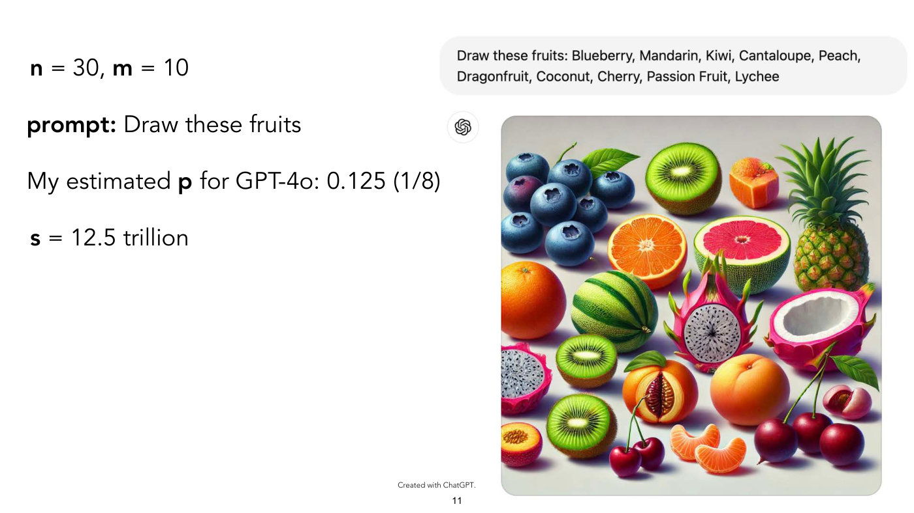

*Slide 11 — the counting experiment with image generation; the drawing shown was judged incorrect.*

"I think you can pretty quickly convince yourself that the way that modern deep nets are working is
not like a filing cabinet. It has some properties in common with the filing cabinet. We'll come back
to that, but that doesn't fully explain what they're doing" (≈18:30–19:16).

## Generalizing to drawings it never saw: pix2pix and edges2cats

The lecturer's own example of generalization that surprised him is pix2pix (slide 12, Isola, Zhu,
Zhou and Efros, 2017): a network $G$ trained to map an input $\mathbf{x}$ to an output
$G(\mathbf{x})$, here sketches to photographs of cats (≈19:16–20:50). Human sketches were expensive,
so the training inputs were edge maps from an edge detector, HED (Xie and Tu, 2015), "a proxy for
what a human might have drawn, but it doesn't quite match what a human would really draw". Classical
learning theory would expect it to work on new edge maps from the same distribution. "But the really
interesting thing is it also worked when you give it hand-drawn cats which it had never been trained
on. So these are inputs that are actually out of distribution — systematically different than what
it was trained on" (≈20:50). Chris Hesse's online demo, edges2cats (slide 13), let anyone try,
and "people had a lot of fun".

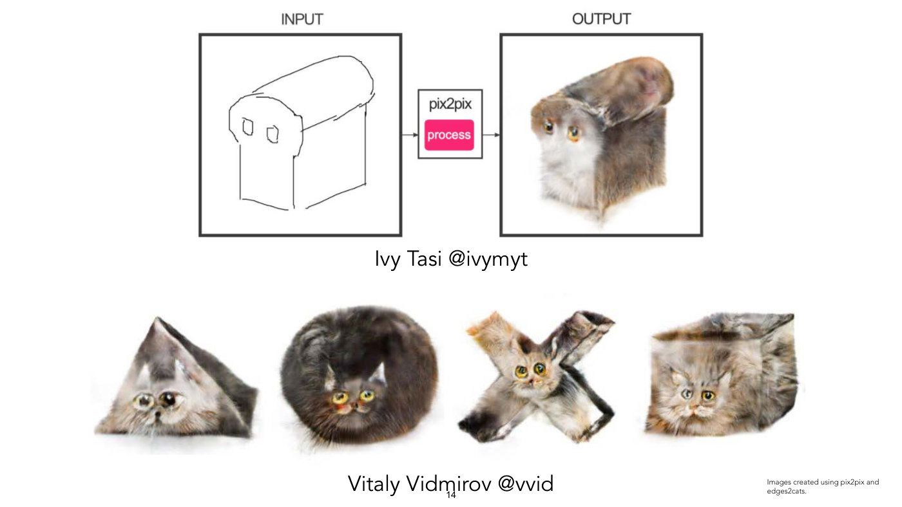

*Slide 14 — edges2cats creations from users of the demo, credited on the slide to their authors.*

Then the lecturer's own probe of what the network does (≈21:37). Draw a cat's head with two eyes
(slide 15), and the output is a cat face.

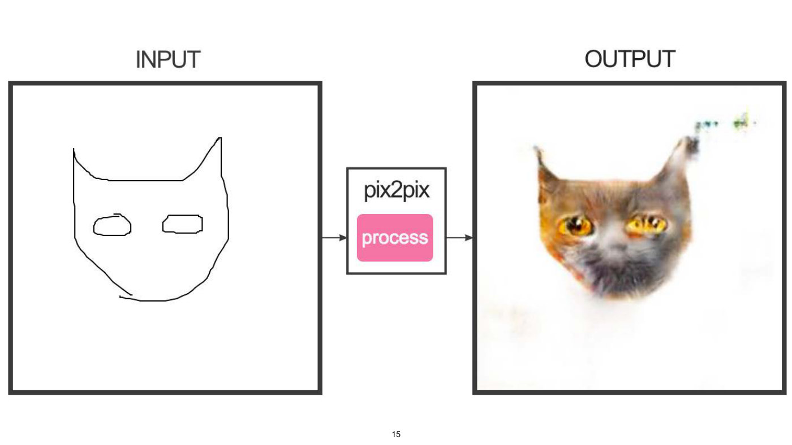

*Slide 15 — two eyes in, a cat face out.*

Add a third eye (slide 16): "It's never seen a photo of a cat with three eyes. How would it know what
to do? But it works. It just puts that eye where that eye was drawn."

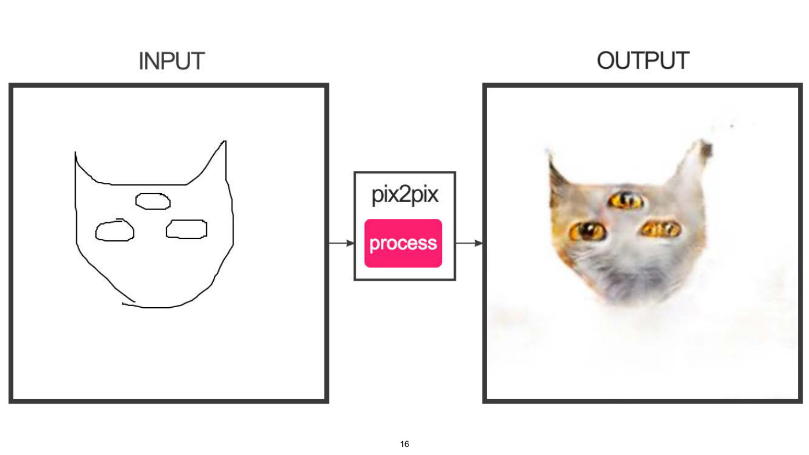

*Slide 16 — a third eye, placed where it was drawn.*

Eight eyes work too (slide 17), and so does adding a body (slide 18). "How is it generalizing to more
eyes than it ever saw at training time?" (≈22:23).

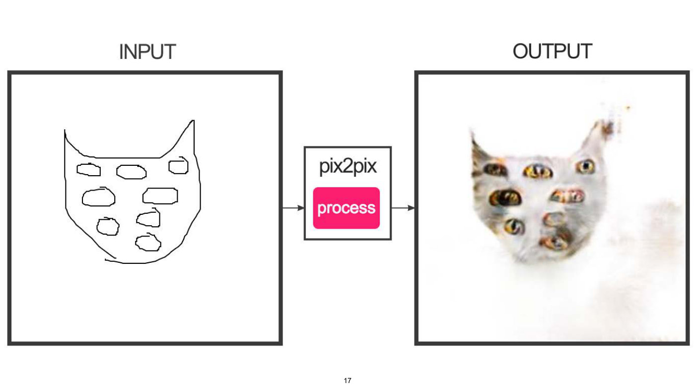

*Slide 17 — eight eyes, more than any training cat had.*

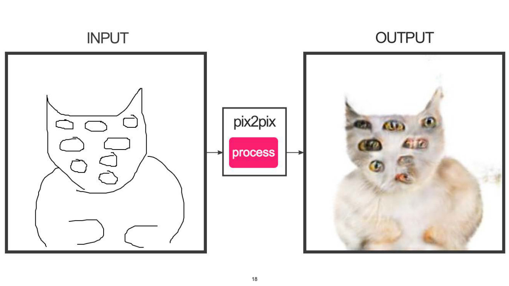

*Slide 18 — and a body.*

## Inductive bias toward simple modular processing

His explanation is "the inductive biases of convolutional nets" (slide 19, ≈22:23–23:57). The network
was a ConvNet, and a ConvNet chops the input into patches and processes "every patch" independently
and identically, "factorizing the problem into a lot of independent decisions". The slide's rule is
"When I see an oval, draw an eye." Each oval is handled by the same patch function $f$, and the
outputs are stitched back together in place. That gives **compositionality**: "you can take a new
composition of things and factor them into these independent components … it only ever has to
imitate the training data on these patches. And then the combination of patches is just the rule of
stitch them together." Within each patch the task is ordinary in-distribution generalization, since
the network has seen many ovals become eyes; more eyes is a new arrangement of familiar parts.

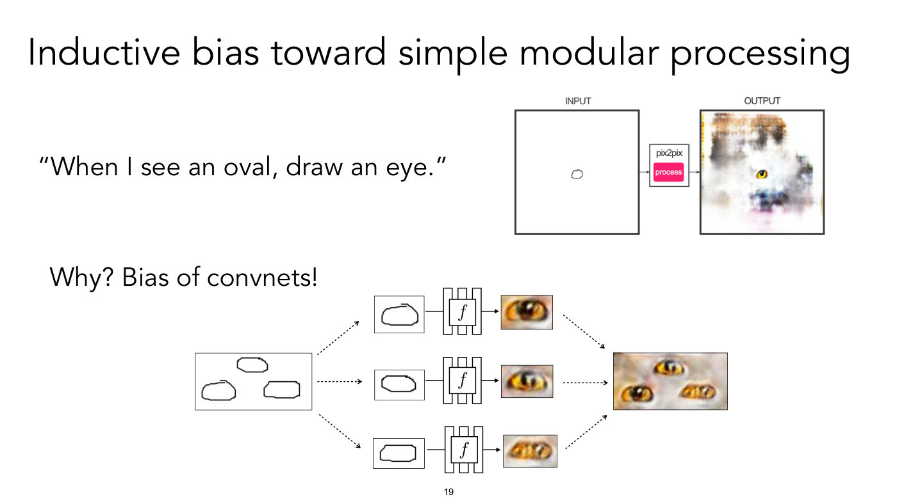

*Slide 19 — "Why? Bias of convnets!": one patch function, applied everywhere, composes new arrangements.*

Graph nets ([lecture 5](05-architectures-graphs.md)) do the same for permutations: "I don't have to
have seen every permutation … That's baked into the architecture. It's not something you have to learn
from the data. So architecture is one of the main levers we have for these feats of generalization
that violate just statistical learning theory, or that go beyond just naive statistical learning
theory" (≈23:57). See [inductive bias](inductive-bias.md).

## Generalization theory: Occam's razor and the shortest program

"Most of generalization theory comes from … the Occam's razor idea. It's all variations on Occam's
razor in some sense" (slides 20–21, ≈23:57–24:42). Slide 21: "The simplest model that fits the data
will generalize best", followed by the question the rest of the lecture keeps asking, "How do we
measure 'simpler'?"

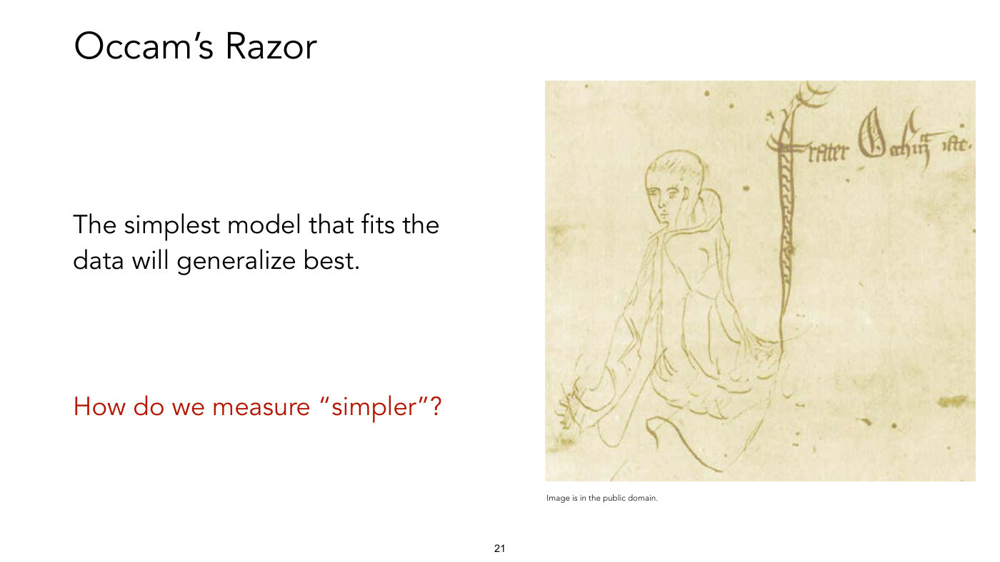

*Slide 21 — Occam's razor, the root of most generalization theory.*

The lecturer stresses the clause people drop: "it's not true the simplest model is most likely to be
true, or it's most likely to generalize best. It's the simplest model that fits the data … otherwise
you get these absurd statements like, oh, well, I should use a linear model. But no, it doesn't fit
the data" (≈24:42–25:27). Asked about "all models are wrong, but some are useful", he answered that
Occam's razor compares only models that fit the data equally well, "so it's a slightly different
setting" (≈25:27–26:15). Asked whether the principle is proven or a heuristic: "In this form, it's a
heuristic because how do we measure simplest? How do we measure generalization?" (≈26:15–27:01).

The rigorous version he favours is slide 22's "**Theory answer:** The shortest program that fits the
data is the one that will generalize best" (cited "[Solomonoff 1964]"). An equivalent statement is
"that the most compressed representation of your data is the best model of your data" (≈27:01). The
catch, on the slide, is "Intractable, but good to keep in mind…": finding the shortest program means
"searching over the space of all possible programs … And deep learning doesn't search over the space
of all possible programs. It just searches over the space of all weights and biases of a particular
model architecture" (≈27:47). So the lecture looks for workable measures of simplicity instead.

## Overfitting and the bias-variance trade-off

The classical picture (slide 23, ≈28:33–30:10) splits test error into two terms,

$$\text{test error} = \text{train error} + (\text{test error} - \text{training error})$$

which the slide labels **bias** (the training error) and **variance** (the gap). As the capacity of
the hypothesis space grows, "as I make bigger and bigger and bigger deep nets with more and more and
more parameters", training risk falls, but test risk eventually rises, because the fit starts
capturing "properties of the data that don't actually generalize, like noise, or the fact that I got
this particular batch of samples". The slide's figure, a classical U-shaped test-risk curve with its
"sweet spot" between under-fitting and over-fitting (from Belkin et al., 2019), is excluded from
OCW's licence and has no image here; [generalization and double
descent](generalization-and-double-descent.md) describes it.

The classical way to measure capacity is the **number of parameters** (slide 24, "# parameters?"):
"If I have too many parameters, it will overfit" (≈30:10).

## Polynomial fits: d = 1, 3, 20 and 1000

Slides 25 to 28 test that rule on a regression problem. Twenty noisy samples (red dots) come from a
smooth ground-truth curve (blue), and a model (orange) is fit as a weighted sum of a family of simple
functions up to degree $d$ — "I think it's not quite polynomials. It's a particular family of
polynomials … like Legendre polynomials, I think, in this case. But it doesn't matter too much"
(≈30:10). The ground truth "happened to have order 3".

At $d = 1$ (slide 25) the fit is a straight line and underfits.

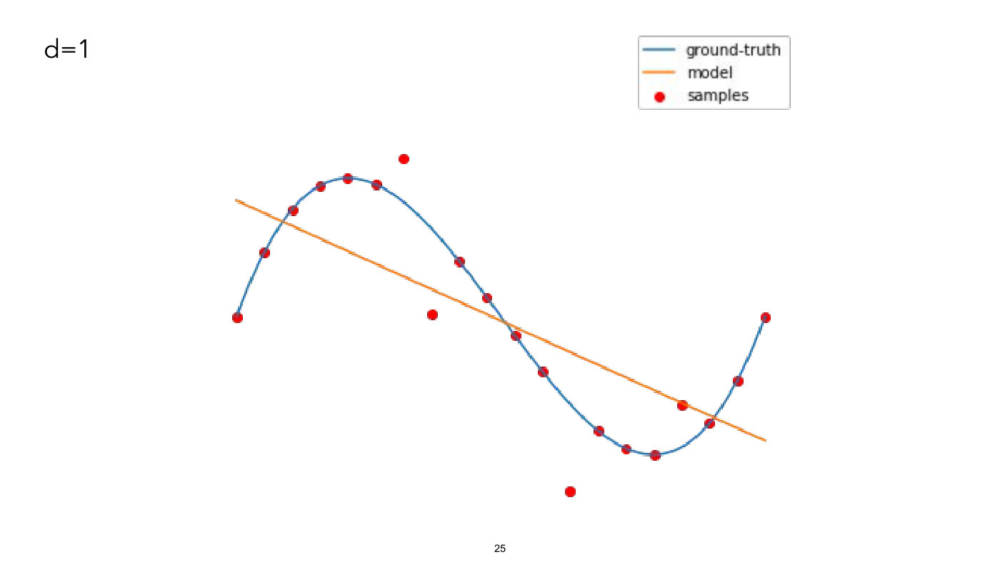

*Slide 25 — degree 1: underfitting.*

At $d = 3$ (slide 26) the model follows the true curve closely.

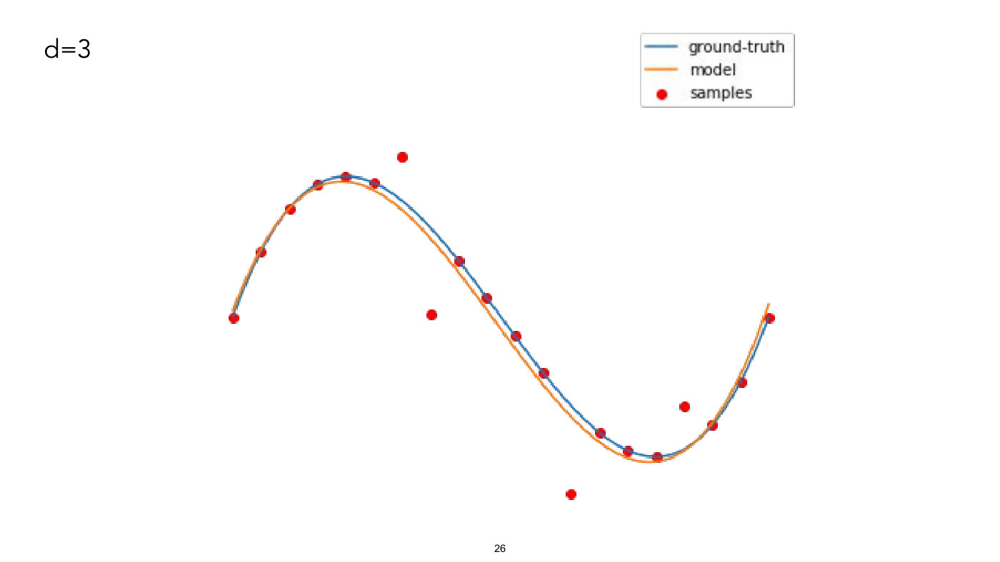

*Slide 26 — degree 3, the true order: a good fit.*

At $d = 20$ (slide 27) it overfits: "I can actually not only recover the true data, but I'm also
fitting to the noise … the model is wildly deviating in order to capture that aspect that doesn't
actually generalize" (≈31:42). The slide's callout reads "Overfitting to the noise! Function swings up
wildly to fit the deviations from the d=3 ground truth."

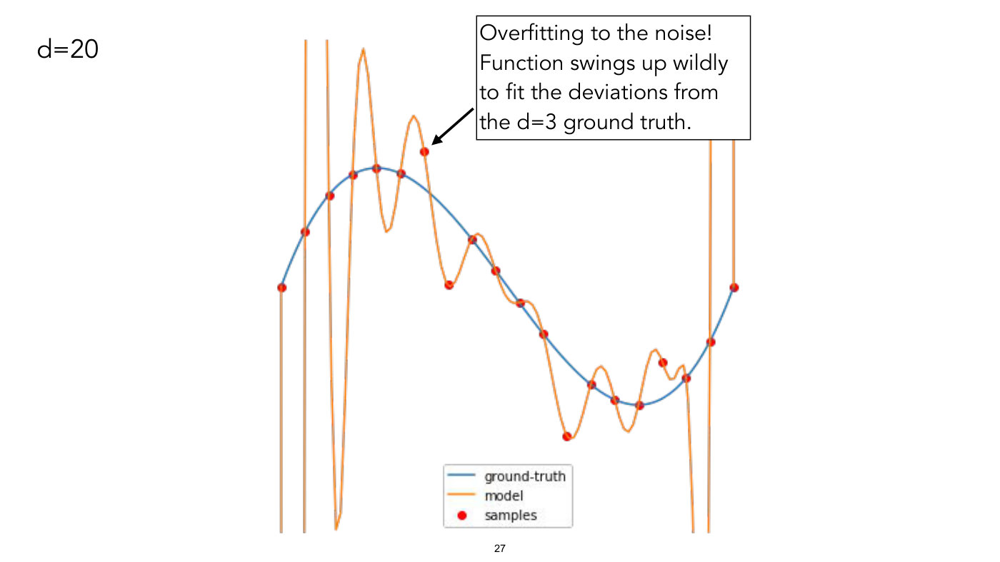

*Slide 27 — degree 20: classical overfitting.*

Then the surprise. Go to $d = 1000$, a far more expressive family: does it overfit even worse? A
student gave what the lecturer called "a quite sophisticated answer": there should be "a large
manifold of fits that all fit perfectly … some of them could be good, some of them could be bad".
"But which one will you arrive at? Well, it's going to depend on other factors … how you're searching
over that space, or what optimizer are you using?" (≈32:27). What happens is slide 28: the degree-1000
model fits the samples, the noisy ones included, but between samples it stays close to the true curve,
reaching the noisy points with narrow spikes. "When d equals 1,000, you actually are able to fit this really spiky
function, but it adheres much more closely to the true smooth solution" (≈33:14).

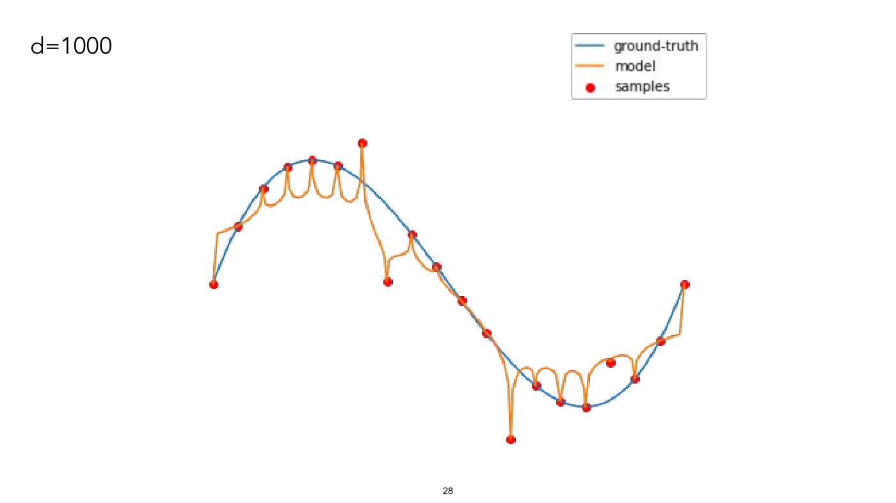

*Slide 28 — degree 1000: a smooth fit plus narrow spikes to the noisy points. Compare degree 20.*

## The simple + spiky hypothesis

Slide 29 names the pattern: "learned model = 'simple' + 'spiky'", a predictive component plus an
overfitting component ([Belkin, Rakhlin, Tsybakov 2018]). "With enough capacity, it will find a
simple fit to the data. And then it will also use little spikes of capacity to fit the outliers …
Spikiness is like memorization … So it's memorization plus generalization" (≈34:01–34:47). It answers
the slide's question, "How can deep nets perfectly fit noisy training data but also make good
predictions on test data?" The decomposition "is provable for certain simple systems, but it's not
really provable for deep nets". The slide links a visualization of the same thing for an MLP, which
looks similar "but not quite as spiky. So deep nets always are a little bit messier than more
classical models" (≈34:47).

A student asked how this can hold for a network trained by a stochastic process, when polynomial
regression has a closed-form solution. The solution a network reaches depends on the random
initialization and the random mini-batches, so "it's much harder to make clean statements about what
solution you'll arrive at". Instead one makes empirical statements ("if we run this neural network
over and over again with the Adam optimizer, or the SGD optimizer, here's what we observe") or
probabilistic theoretical ones, that solutions "will be smooth and spiky with high probability"
(≈35:34–36:20).

## Double descent

Slide 30 (Belkin, Hsu, Ma and Mandal, PNAS 2019) sets the classical U-curve beside **double
descent**. Test risk follows the U up to a peak at the **interpolation threshold**, "the point at
which I can perfectly memorize all the training data", and then falls again as capacity grows,
eventually below the classical minimum, while training risk stays at zero (≈37:07–37:53). The left
side is the under-parameterized "classical" regime, the right the over-parameterized "modern"
interpolating regime. The figure is excluded from OCW's licence, so it is described here and in the
slide file only.

The lecturer's intuition (≈37:53–38:39): to fit the data at the threshold "you have to learn a
really crazy function to memorize it. But then once you add more capacity, where now there are a lot
of solutions that equally well memorize the data … then you can select within all of those set of
solutions that fit the data the one that is the smoothest or has other nice properties. And the
pressures that select within the set of things that fit the data the one that is the smoothest are
sometimes called regularizers, or implicit regularizers, or inductive biases." That sentence is the
agenda for the end of the lecture.

**In practice.** Slide 31 is the MNIST result from the same paper: training loss falls steadily as
the number of parameters grows, while test loss falls, climbs to a peak at the dashed line where the
training loss reaches about zero, and then drops and stays low (≈40:58). The lecturer warns that
"this stuff is a little finicky to actually observe in practice. So I actually tried to make my own
example of this, and I couldn't get it to work." It shows up only in certain regimes, and momentum,
weight decay and other aspects of optimization "can make this disappear … So don't worry if you
don't see it in your graphs" (≈40:58–41:43). Asked about momentum, he said "all the tricks that we use
in practice are just getting rid of that spike and pushing us more out to the right. So it's not like
we're losing that benefit" (≈41:43–42:28).

**When to stop training.** Asked whether to stop at the first minimum or keep going, he said it
depends on the capacity you can afford, "because this is costly to move out in the x-axis. Capacity
can be measured in parameters, but it could also be measured in flops. So there's kind of double
descent also in compute time … But generally, in deep learning, we're out in this regime. We're past
the first peak, and we're in the part where you just train longer, and longer, and longer, and it
smoothly will get better" (≈39:25–40:10). Earlier: "in this neural net era, it tends to be just train
forever" (≈37:07). See [gradient descent](gradient-descent.md) on when to stop.

**Polynomials and deep nets.** Asked how polynomial regression relates to deep nets: "you can think
of the last layer of an MLP as a linear combination of some basis functions, of some features … those
features could be like polynomial functions of a scalar input, and that would be polynomial
regression. Or they could be Fourier … And in deep learning, they'll be learned functions"
(≈40:10–40:58).

## More features, lower norm

Slide 32, again from Belkin et al., regresses on random Fourier features ("random sines and cosines,
random periodic functions") and plots the norm of the learned weight vector against the number of
features. The norm peaks where the model first has to use every feature to fit the data, and then
falls as features are added, toward the minimum-norm solution: "more features means lower norm
parameter solutions, so in some sense kind of smoother in a particular sense. And so this is just
saying that counting number of parameters is not the right thing to do. It might be that the
parameter norm or some other property of the parameters is what is the more meaningful measure"
(≈42:28–44:03). Asked whether the peak lines up with the interpolation threshold: "Yes, it's exactly
at the interpolation threshold. And you can show these things for linear models, and it's all
provable. But for deep nets, it's just empirical" (≈44:03).

## Parameter count is not complexity

So "# parameters? … No!" and "Parameter norm? maybe" (slide 33, ≈44:03–44:51). Slide 34 makes the
first point with two networks: a large one, $f$, with many weights, and a small one, $g$. Consider

$$h(x) = 10^{-100} f(x) + (1 - 10^{-100}) g(x)$$

How many parameters does $h$ have, and does it matter? Fitting $h$ with $g$ alone uses only a few
parameters and is within $10^{-100}$ of the right answer, so "the count of parameters is not what
matters. Something about the size has to also be what matters" (slide 34, ≈44:51–45:36).

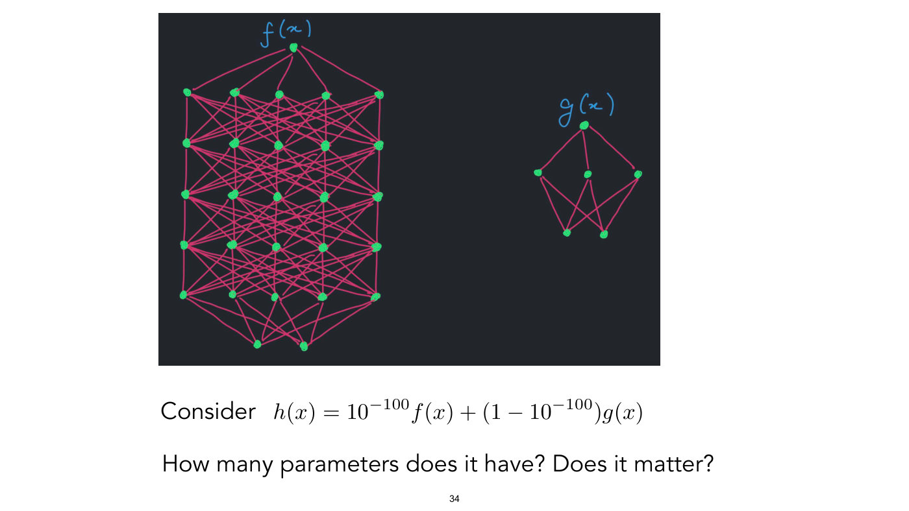

*Slide 34 — h is almost entirely g: what counts is the size of the parameters, not their number.*

"So parameter norm, size of the parameters matters more than count. But parameter norm is also not
everything" (≈46:27).

## Vapnik-Chervonenkis theory

The next classical candidate is the **number of distinct functions** the model can represent
(slide 35), the idea behind Vapnik-Chervonenkis (VC) theory (≈46:27). Slide 36 states its logic.
Generalization error is population error minus training error. "**IF** size of training set dwarfs
number of functions in our function class. **THEN** training error matches population error with high
probability." The intuition is about **false positives**, functions "that fit the training data but
do not generalize", functions that "just get lucky". The chance of a false positive is higher with
more candidate functions, since "one could get lucky", and lower with more data, since "every
additional data point rules out certain candidate functions from being able to fit the data"
(≈47:14–48:49).

The circles picture makes it concrete (≈48:49–51:06). Each circle on slide 37 is a candidate function
in the class; purple ones fit the training data, and green is the true function. The assumptions are
in the footnote: noise-free data, the true function in the class, and an optimizer that "just picks
one of the purple points at random". With six circles fitting the data, the chance of picking the
true function is 1 in 6.

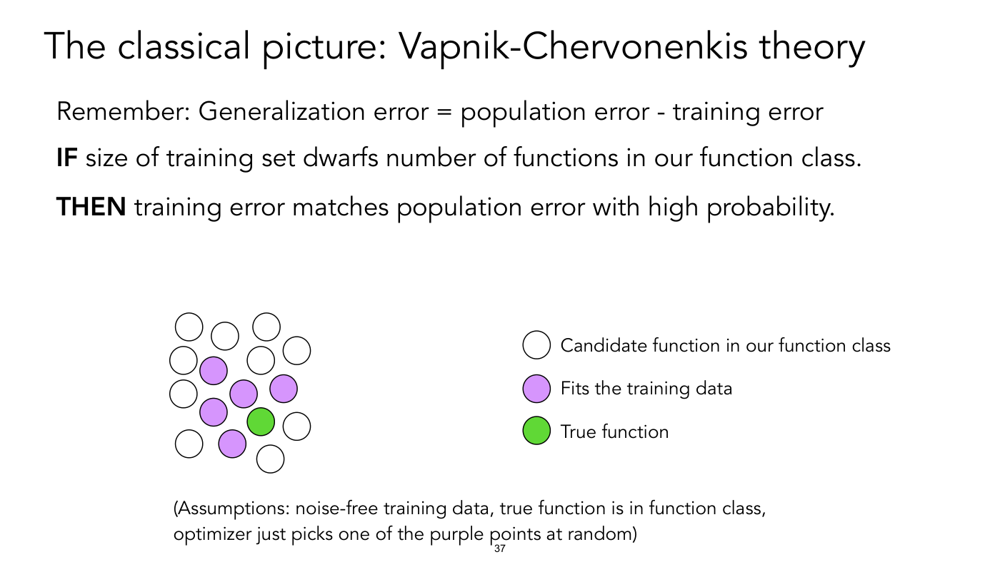

*Slide 37 — the function class; purple circles fit the data, the green one is the truth.*

**Increase training data** (slide 38): new data points rule out some fits, so two purple circles turn
white, and the chance becomes 1 in 4.

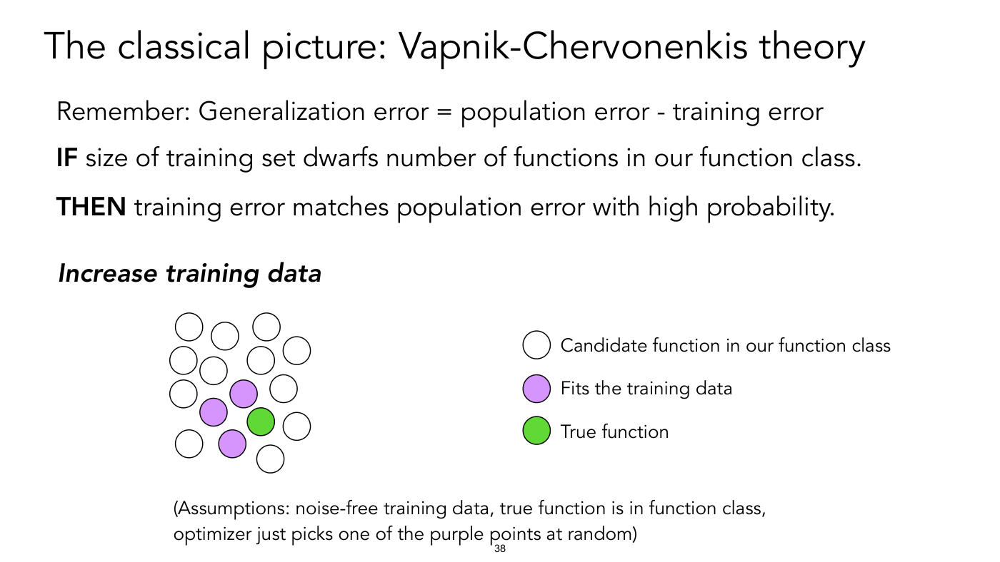

*Slide 38 — more data rules out spurious fits.*

**Reduce capacity**, "i.e. decrease number of functions in our function class" (slide 39): removing
circles at random, while keeping the true function, removes spurious fits too. "It's not necessarily
how you would normally reduce capacity, but this is one model of reducing capacity." Both levers
raise the chance of landing on the function that generalizes.

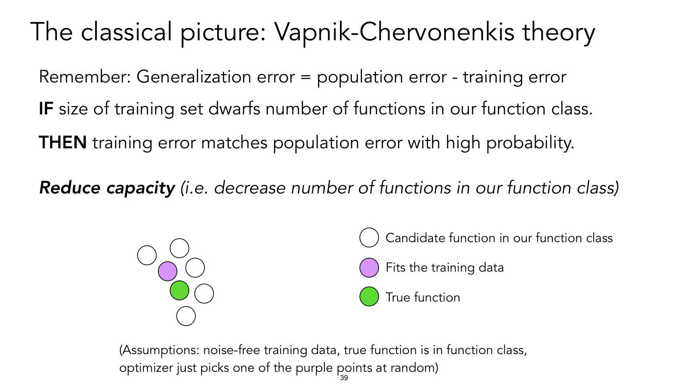

*Slide 39 — fewer candidate functions also leaves fewer ways to get lucky.*

**Counting functions.** A neural network's function class is continuous, but for VC theory "it
suffices" to count the **dichotomies**: the distinct binary labelings, $+1$ or $-1$ for each training
example, that the class can realize on the data (slide 40, ≈51:06–52:40). Slide 41 then defines the
VC dimension $d$ as the number of dichotomies, with $n$ the number of training points, and gives the
generalization bound: generalization error is bounded by

$$\sqrt{\frac{d}{n}}$$

so a class that can label the training data in more ways gets a looser bound, and more data tightens
it (≈52:40–53:27). *(A note outside the course material: textbook statements of VC theory define the
VC dimension as a number of points rather than a number of labelings. This page follows the slide's
definition, which is the one the lecture's argument uses.)*

## Neural nets can fit random labels

"Here's the interesting thing. Neural nets can basically fit any dichotomy over regular data sets"
(≈53:27). Take a dataset of cats and dogs and give each image a random label: "Often, the neural net
can still fit the random labeling… they can fit noise!" (slide 42, ≈54:13). Fitting any dichotomy
means the class realizes all $2^n$ labelings of $n$ points, so in the slide's terms $d = 2^n$ and the
bound becomes $\sqrt{2^n / n}$, exponential in the size of the training set. Slide 43: "Therefore,
generalization bound is extremely loose (in fact, vacuous)." In the lecturer's words, it says "my
population error will be greater than 100% if this is a classifier, or my population error is less
than 10 billion percent or something like this … It tells us nothing about how well the system will
generalize" (≈55:02–55:48).

The evidence is the paper "Understanding Deep Learning Requires Rethinking Generalization" (Zhang et
al., 2017, one of the lecture's optional readings), whose Table 1 slide 44 reproduces (≈56:34). On
CIFAR10, Inception, AlexNet and MLPs all reach 100% or nearly 100% training accuracy whether the
labels are real or random. With real labels Inception's test accuracy is 85.75–89.31% depending on
data augmentation and weight decay; with random labels every model's test accuracy falls to about
10% (9.78–10.61%): "there's no ability to generalize at all" (≈56:34). The slide's summary: NNs "memorize"/interpolate the
data, even random labels; can still generalize; with and without explicit regularization.

So VC theory "has the right, I think, paradigm of thinking about the size of the hypothesis space, the
number of constraints … But the assumptions it makes are violated" (≈55:48). The biggest one: "in
deep learning, we're not just picking a random hypothesis that fits the data. We're using gradient
descent, and that's going to pick certain hypotheses and prefer certain hypotheses over others"
(≈55:48–56:34). "Neural nets can fit random labels, yet when they're trained on real labels, they
generalize. This is the violation of classical theory" (≈57:20).

## An open question

So the number of distinct functions is "No!" too (slide 45). "How should we measure model
complexity??? … for deep learning, it's still an open question!" (slide 46). "Unfortunately, I have to
say that for deep learning, we really don't know what it is … a lot of the classical tools aren't
working in this era. And it's a great thing for us to try to make progress on" (≈58:07–58:53).

Slide 47's recap is the lecture's argument in four steps. Deep nets generalize: "They can make
reasonable predictions on inputs they have never seen during training." Generalization requires
**inductive biases**, since fitting the training data cannot explain it: "we have to rule out the
filing cabinet!" Those biases "can't just be about classical notions of complexity (# parameters,
VC-dimension, etc don't work)." "Therefore, deep learning must have some nice inductive biases that
control complexity in ways we don't fully know how to characterize!" (≈58:53–1:00:28).

## Why do deep nets learn functions that generalize?

The last part asks: "Other than fitting the training data, what are the other pressures that affect
the solution deep learning arrives at?" (slide 48). The ideas that follow "are out there but are not
yet completely standard or proven. But I think that they're fun to think about" (≈1:02:01–1:02:47).

The picture is the **version space** (slide 49), "set of all mappings that achieve zero training
error", a region inside the hypothesis space. For an MLP it is "the set of all settings of the
parameters, the weights and the biases, that perfectly interpolate", and "some points in this set are
bad and don't generalize, and some are good and do generalize. Why do deep nets find the ones that are
good?" (≈1:01:15–1:02:01).

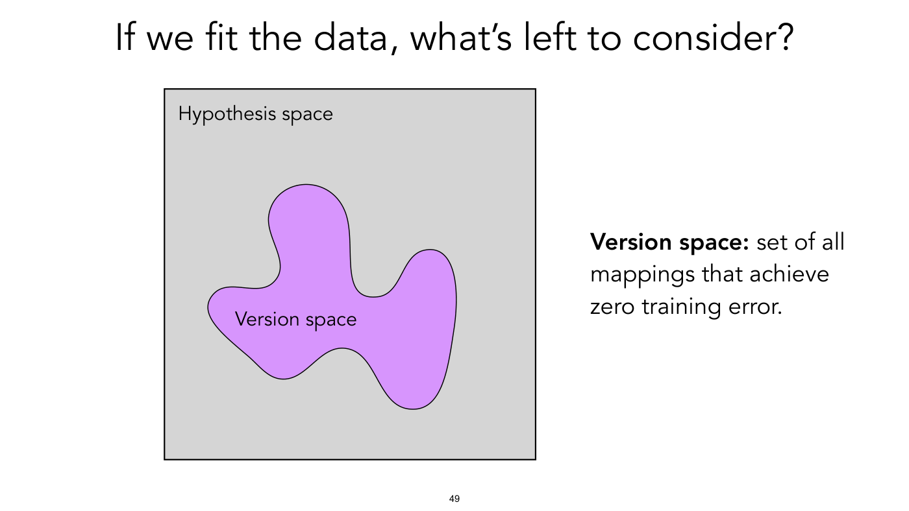

*Slide 49 — the version space: every hypothesis that fits the training data perfectly.*

### Simplicity bias in the parameter-function map

The **parameter-function map** $\mathcal{M} : \Theta \rightarrow \mathcal{F}$ sends each setting of
the parameters to the function it computes (slide 50). It is many-to-one: a network that adds a bias
of 1 on one layer and subtracts 1 on the next computes the same function as one that adds 0 twice
(≈1:02:47–1:03:34). The observation of Valle Pérez, Camargo and Louis (ICLR 2019), made empirically:
"Most random settings of the weights in biases in a neural net map to simple functions" (slide 50;
"weights in biases" as printed). Simplicity here is **Lempel-Ziv complexity**, a compression measure,
"if I run that function f on some data, how well can I compress it with this algorithm?" The slide's
plot puts probability on a log scale against Lempel-Ziv complexity: simple functions are far more
likely under random parameters than complex ones. The lecturer calls it "a little hard to interpret",
but "most random settings will be down here", at low complexity and high probability (≈1:04:21).

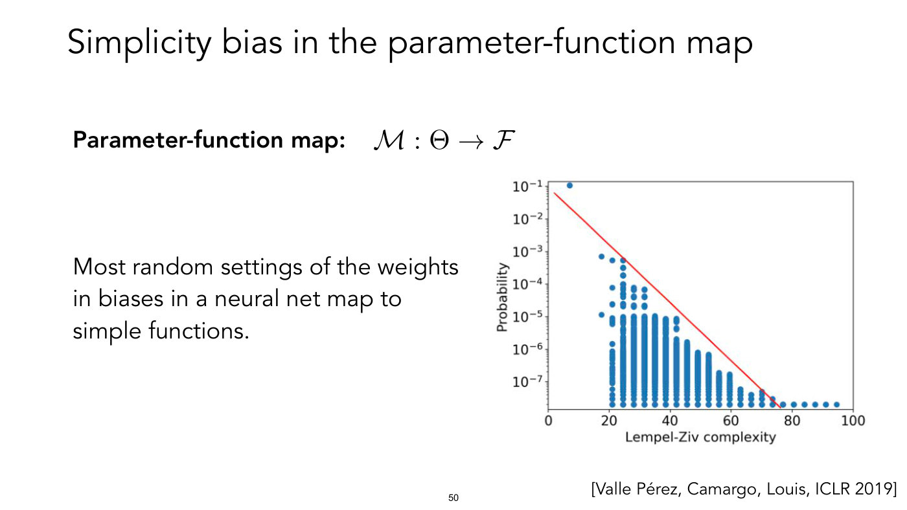

*Slide 50 — random weights mostly give simple functions: probability falls steeply with Lempel-Ziv complexity.*

Slide 51 turns this into a picture of learning (≈1:05:07–1:05:53). Random points in parameter space
map mostly into the simple corner of the hypothesis space. "Learning just moves our parameters and,
therefore, moves the functions they map to toward the version space." So training ends "at the corner
of the version space where we have simple functions just by chance, because most random
initializations of my parameters map to simple functions. And most of the volume, as I walk through
parameter space, will also map to simple functions."

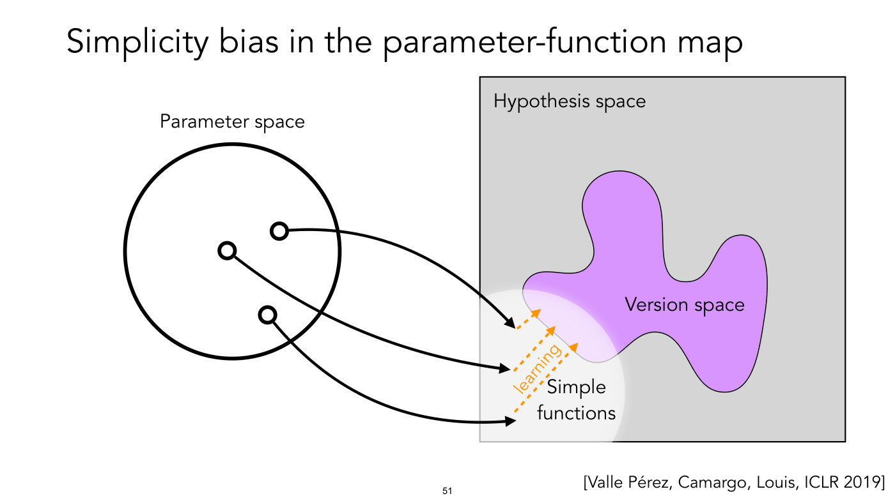

*Slide 51 — random parameters land among simple functions, and learning moves them to the nearby edge of the version space.*

### Low-rank bias of depth

A paper the lecturer was involved in (Huh, Mobahi, Zhang, Cheung, Agrawal and Isola, TMLR 2023) looks
at a different measure of simplicity, the rank of a kernel (slides 52–60, ≈1:05:53–1:12:56). The
classical story, which returns in the representation learning lectures, is that a deeper net "with
more parameters" has "more capacity to organize the data" (slide 52): to classify ten classes, it maps
them to a space where they are linearly separable, and a deeper MLP separates the colour-coded classes
better.

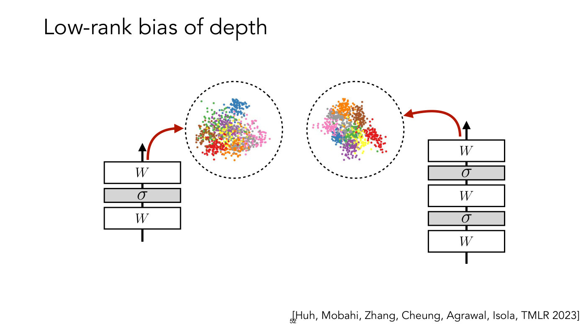

*Slide 52 — deeper nets separate the classes better at their output.*

Characterize the output representation by its **kernel**, the similarity matrix between every pair of
inputs (slide 53): "every row is a data point and the column is another data point", and each entry
is the similarity of the two output vectors. A block-structured kernel means the data have been
clustered, "all the red points have grouped together into one block". The deeper network's kernel is
the blockier one, the "common understanding" being that "deeper nets have greater capacity to
organize the data" (≈1:07:32–1:08:18).

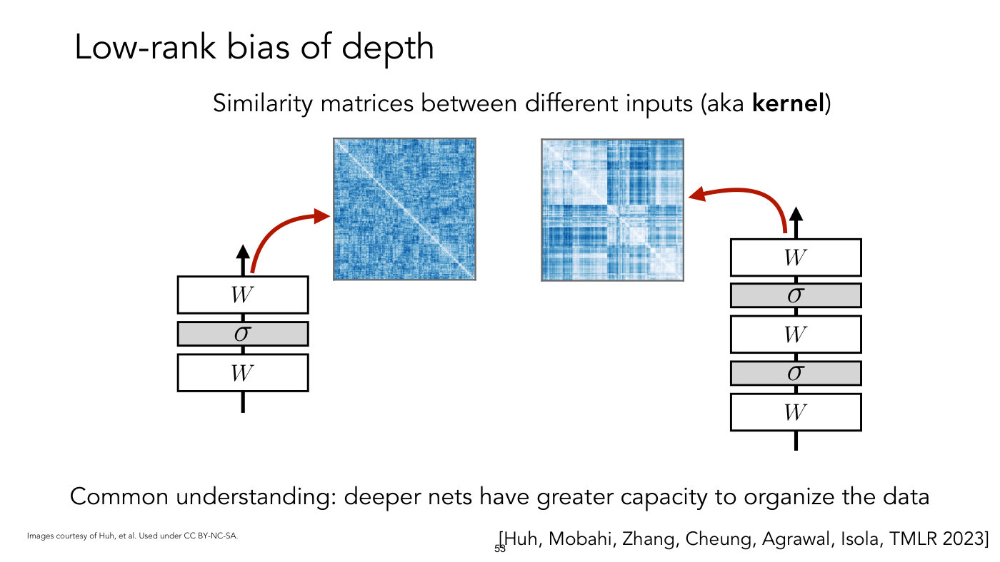

*Slide 53 — the deeper network's kernel is block-structured: it has clustered the data.*

"But the interesting thing is if you get rid of the nonlinearities, you actually get the same effect"
(slide 54, ≈1:08:18). A deep *linear* network also gives a blockier kernel, even though a stack of
linear layers is equivalent to one linear map, so "depth does not increase modeling capacity in this
case". Capacity cannot be the explanation. Measured by rank, "blockier matrices have lower rank", and
lower rank means the data have been organized into "a simpler format" (≈1:09:04).

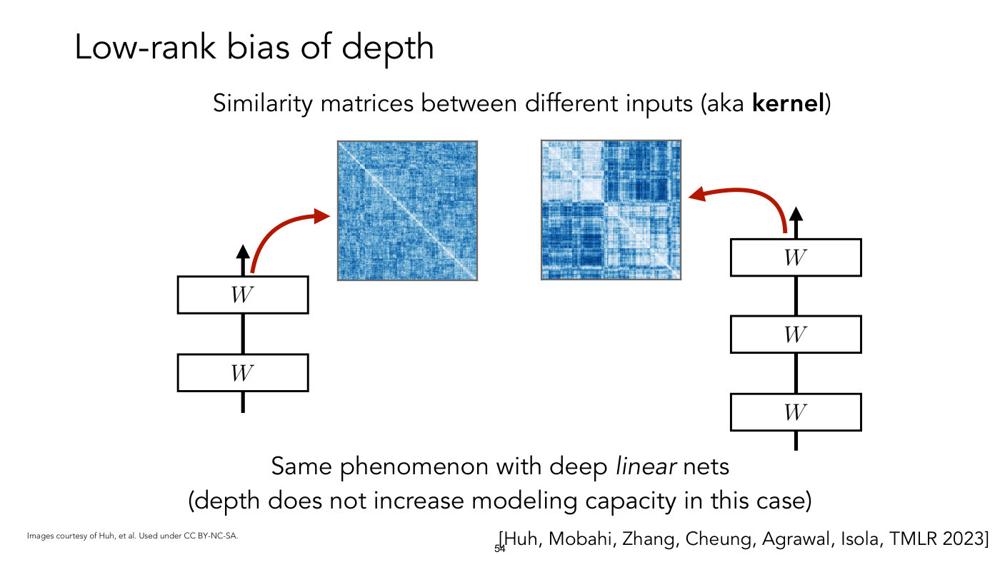

*Slide 54 — the same effect with no nonlinearity, where depth adds no capacity.*

The paper's answer is on slide 55: "Products of matrices tend to be low rank." It is again a
parameter-function argument, here a **parameter-kernel map** (slides 56–58): sample a random set of
network weights from the weight space $\mathcal{W}$, compute the kernel $K$ of the outputs, and
record its **effective rank** ("kind of like the rank of the matrix, but a slightly different version
of it", ≈1:10:39). A shallow network's random weights give kernels near full rank (slide 56).

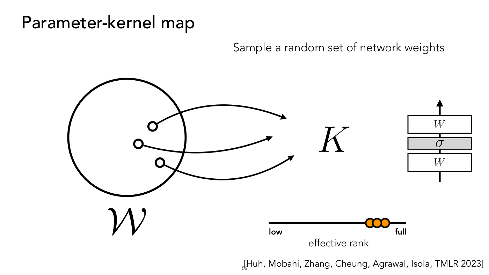

*Slide 56 — random weights of a shallow network give near full-rank kernels.*

A deeper stack moves the samples toward low rank (slide 57), and a deeper one still moves them further
(slide 58). "If I have a shallow network, then most random points will be full rank. If I have a
deeper network, whether it's a linear net or a nonlinear net, I will tend to map to lower rank
solutions just by chance" (≈1:09:50).

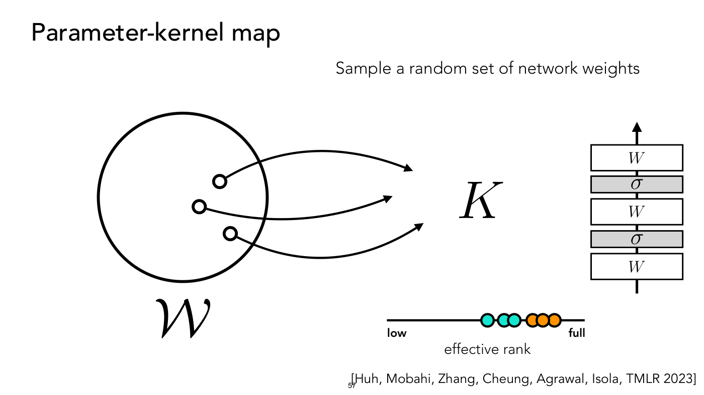

*Slide 57 — more depth, lower effective rank.*

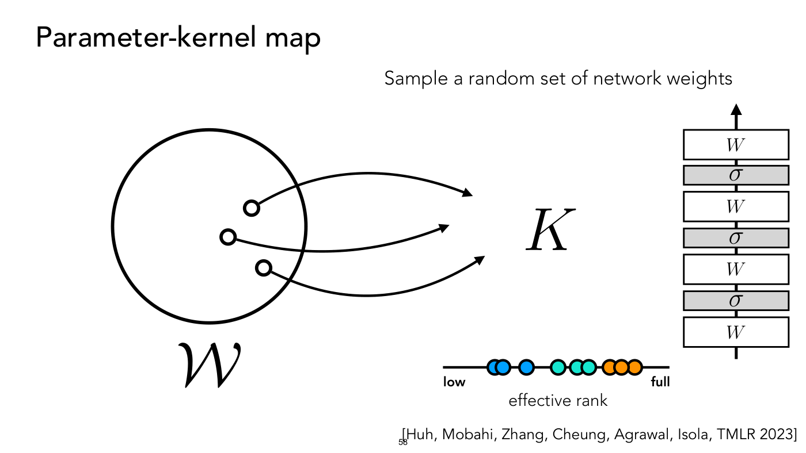

*Slide 58 — deeper still, lower still.*

"Now, optimization will pick out which of the parameter vectors actually is in the version space …
But because most of the volume of parameter space is mapping to low rank solutions … when the network
is deep, there'll be this kind of bias" (≈1:10:39). Slide 59 measures it in real networks: empirical
probability densities of the effective rank $\rho(K)$ for random parameters of networks of depth 1,
2, 4, 8 and 16. Each density is a single bump, and the bumps move to lower rank, and spread out, as
depth grows. "Deeper networks have a greater proportion of parameter space that maps the input data to
lower-rank embeddings" (≈1:11:24).

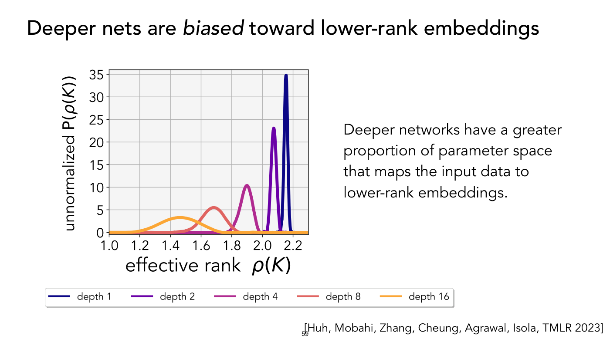

*Slide 59 — deeper nets are biased toward lower-rank embeddings: the distribution of effective rank slides left with depth.*

Slide 60 visualizes the same thing in two dimensions of parameter space, plotting effective rank as
height and colour while walking along two directions $u$ and $v$ (≈1:12:10–1:12:56). "With a single
layer model, I will have this kind of narrow ridge of low rank functions as I navigate my parameter
space. But a two-layer model, I'll pull that ridge apart. And so more volume of the parameter space
will map to low rank functions."

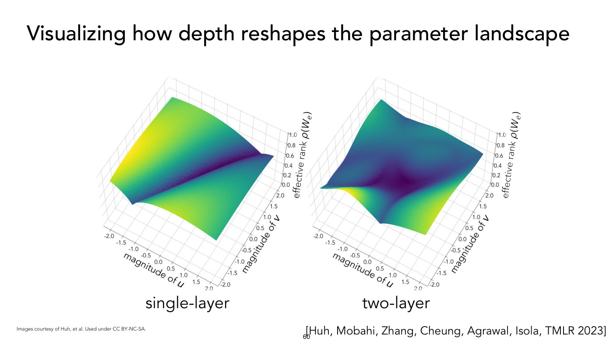

*Slide 60 — adding a layer widens the low-rank region of parameter space.*

### Implicit regularization of optimizers

The second family of explanations is the optimizer, since "I'm not just picking a random solution in my
version space. I'm actually using an optimizer, which will prefer some solutions over other solutions"
(slide 61, ≈1:12:56–1:15:19). Slide 61 lists three effects:

- **Weight decay** "acts like an L2 regularizer on weights, shrinking them toward zero all else being
  equal". Weights that are not used go to zero, so the learned weights have lower norm "and are simple
  in that sense".
- **Initialization** near zero "biases solutions toward low norm. GD initialized near zero converges
  to minimum norm solution for linear models [Zhang et al. 2017, Gunasekar et al. 2017]".
- **SGD, and GD with finite step size**, "converge to 'flat' minima; they will tend to overshoot or
  bounce out of minima that are too narrow [see Vardi 2022 for a review]". "Gradient descent can't go
  into a really sharp well if I'm using fixed step sizes. It'll just jump right over it." Flat minima,
  basins of low loss "over kind of a large region of the parameter space", "can be argued to generalize
  better than these narrow minima. The narrow minima might be more like just a weird solution that got
  lucky" (≈1:14:30–1:15:19).

See [loss landscapes](loss-landscapes.md) and [gradient descent](gradient-descent.md).

### Architectural symmetries

"But I think all of what I've said so far is not actually the most important. I think the most
important is the following two slides — is the architectural symmetries. And we saw these in ConvNets
and graph nets, and we'll see these in transformers and other models too" (≈1:15:19). Slide 62 names
three:

- **Invariances.** Max pooling over channels makes a layer invariant along the dimension it maxes
  over: with edge-detector filters of several orientations, "I'll fire regardless of what the
  orientation of that bird's beak is" (≈1:16:06). This is lecture 4's pooling across channels.
- **Equivariances.** "If I permute the labeling of the nodes, then I will permute the predictions" in
  a graph net; in a ConvNet, "if I shift the image by some amount, I'll shift my predictions by that
  same amount". These symmetries "cause them to exhibit out-of-sample generalization, because I know if
  I just shift my image, it will respond in the way it was trained to respond on the unshifted image"
  (≈1:16:06–1:16:55).
- **Compositionality**, slide 19's oval-to-eye picture again. The architecture chops the input into
  components and learns something about each, "but then the conjunction of components is just given by
  something that's defined by the architecture. It's not learned" (≈1:16:55–1:17:40).

The Invariances panel reuses a heron photograph that lecture 4's deck marks as excluded from OCW's
licence, so slide 62 has no image here. The lecturer ties the last point to language models: "I think
this is where really the real power and the real explanation of why things like ChatGPT, why they
actually do these feats of generalization … it factorizes the world. It carves the world at its
joints. It factors its world into parcels, which are words, and sentences, and paragraphs. And then
compositions of these things will be arrived at not from learning, but from just how the architecture
is built" (≈1:17:40). See [inductive bias](inductive-bias.md).

### Domain-specific constraints

Slide 63 adds structure from domain knowledge, with two examples whose figures are excluded from OCW's
licence (≈1:17:40–1:18:26). NeRF, which Sara Beery presented in [lecture 4](04-architectures-grids.md),
"uses equations of perspective projection, and it uses equations of light transport … so it will
generalize to new viewpoints because it's using structures. It's not just fitting to data. It's data
plus structure, data plus constraints." The other is a drug-interaction prediction network, the
polypharmacy architecture of [lecture 5](05-architectures-graphs.md), "where they've baked in
structure. They know about how drugs are supposed to interact with each other." "The conjunction of
fitting to data under structural constraints is what can allow you to generalize."

## Short enough programs: finite models, infinite data

The lecture ends back at the theory answer (slide 64): finding the shortest program that fits the data
is intractable, but "Or… do we actually have to optimize for shortest? How about just short enough?"
(≈1:18:26–1:19:12).

Slide 65 is "(rough memory of a conversation with Ilya Sutskever around 2018)":

- Ilya: "Deep nets generalize because they find small circuits that fit the data."
- Me: "*Small* circuits? But deep nets are big! Don't we need something else to bias toward small
  circuits?"
- Ilya: "No. Deep nets are finite; that is enough. Anything finite will look small once you have
  enough data."

"At the time, I didn't quite get it … Don't we need all of these inductive biases, and regularizers,
and simplicity biases? … And he said, 'no, no, no, it's OK. Deep nets are finite. That's enough.
Finite is small. Anything finite will look small if you have enough data.' And I think that was a deep
insight" (≈1:19:12–1:19:58). The spoken version is the lecturer's paraphrase, "not a direct quote".

## Pointers to other lectures

The deck prints no lecture numbers other than its own title, "Lecture 6", which matches the
recording (lecture 1's deck had pointed to generalization theory as "Lecture 7"; see the [course
map](course-map.md#the-decks-lecture-pointers)). The recording points ahead without numbers: more on
optimization "on Thursday's lecture" (≈4:37), which is lecture 7, and the class is advised to look at
the first question of problem set 2 beforehand (≈0:46); generative and image-to-image models "a
little bit later in the course" (≈20:02), lectures 14–16; language models and prompting "later"
(≈16:11), lecture 21; kernels and representations "in the representation learning lectures"
(≈1:06:45), lectures 11–13; and architectural symmetries "in transformers" (≈1:15:19), lecture 8.
Out-of-distribution generalization, which the pix2pix example touches, is lecture 17's subject.

## See also

- [Generalization and double descent](generalization-and-double-descent.md) — the concept page:
  memorization versus generalization, double descent, the measures of complexity that fail, and the
  candidate inductive biases.
- [Inductive bias](inductive-bias.md) — architectural symmetries and compositionality as the
  lecturer's favoured explanation of generalization.
- [Representational power](representational-power.md) — approximation, the question this lecture
  sets beside generalization.
- [Loss landscapes](loss-landscapes.md) — flat minima and why fixed-step gradient descent finds them.
- [Gradient descent](gradient-descent.md) — weight decay, initialization and when to stop.
- [Convolution](convolution.md) — the patch-wise processing behind the eight-eyed cat.
- [Lecture 3 — Approximation Theory](03-approximation-theory.md), which split the subject into
  approximation, optimization and generalization; [lecture 5 — Architectures:
  Graphs](05-architectures-graphs.md), the previous lecture.
