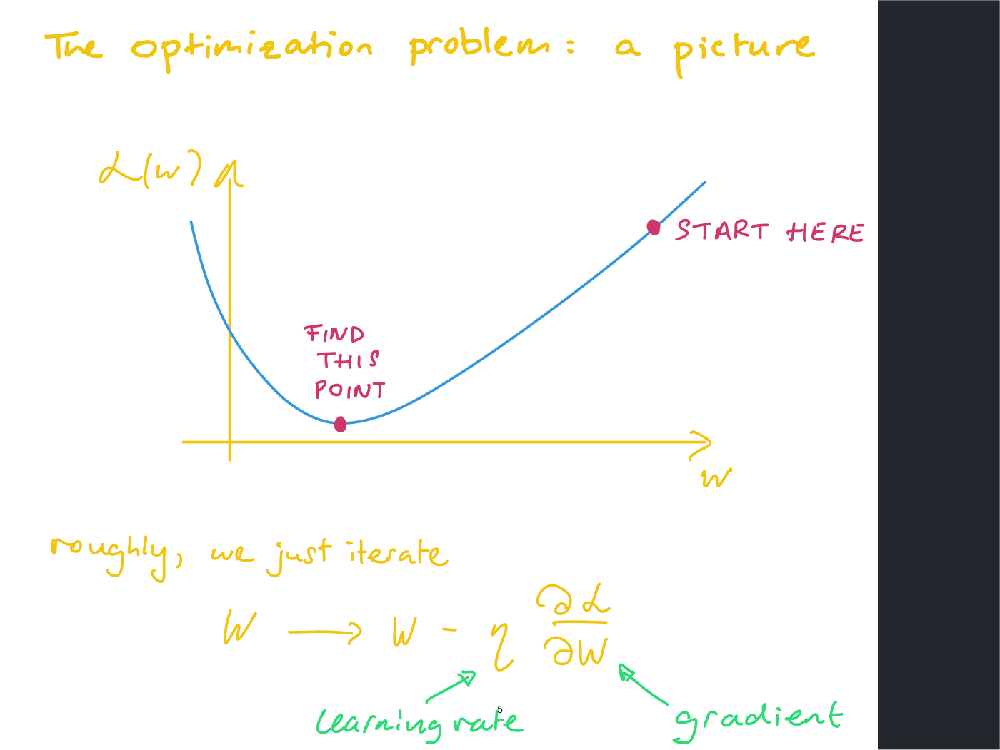
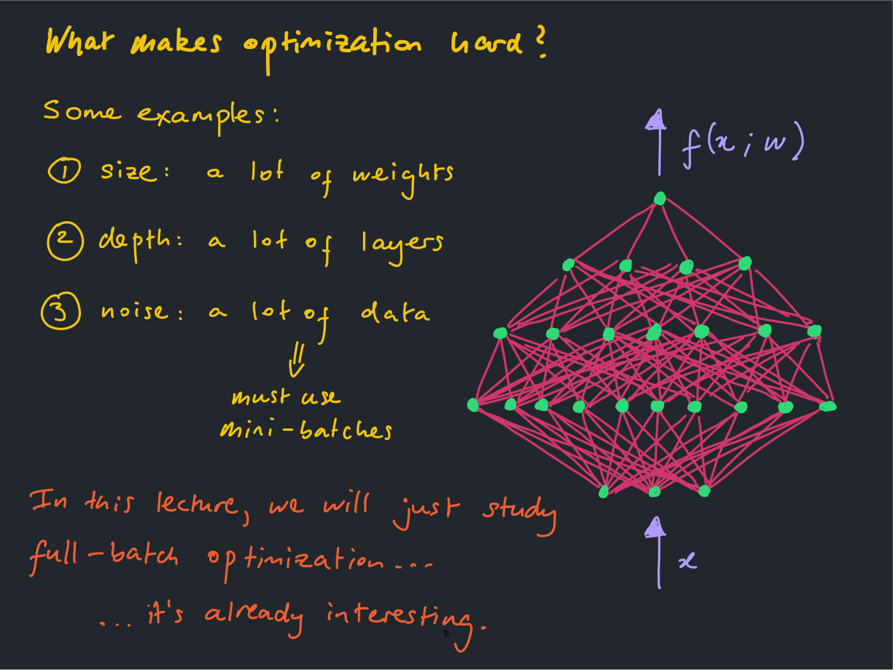
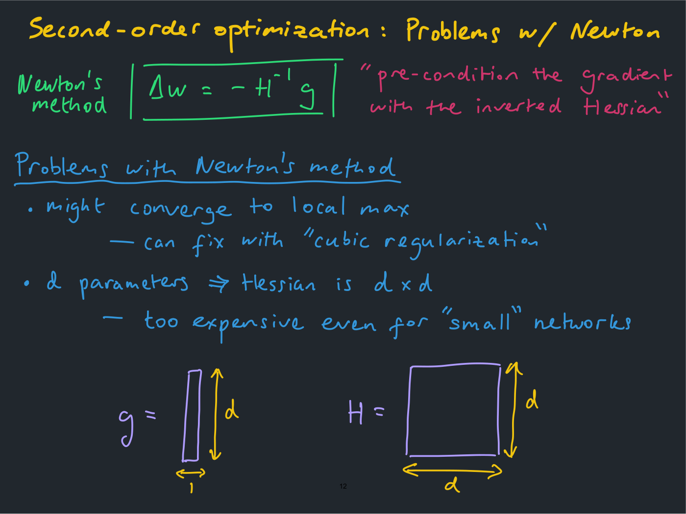
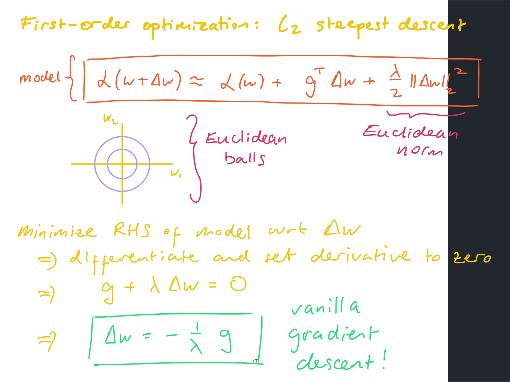
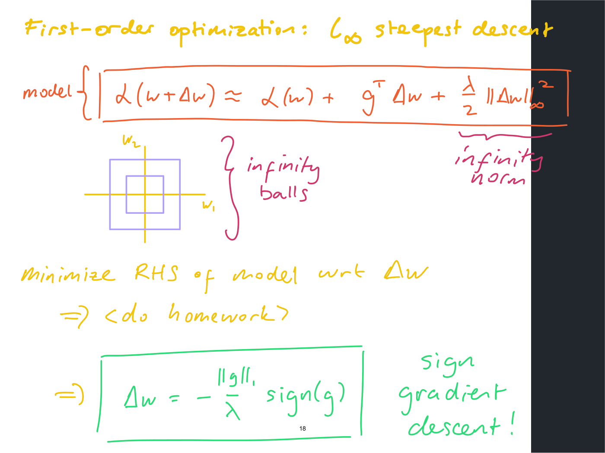
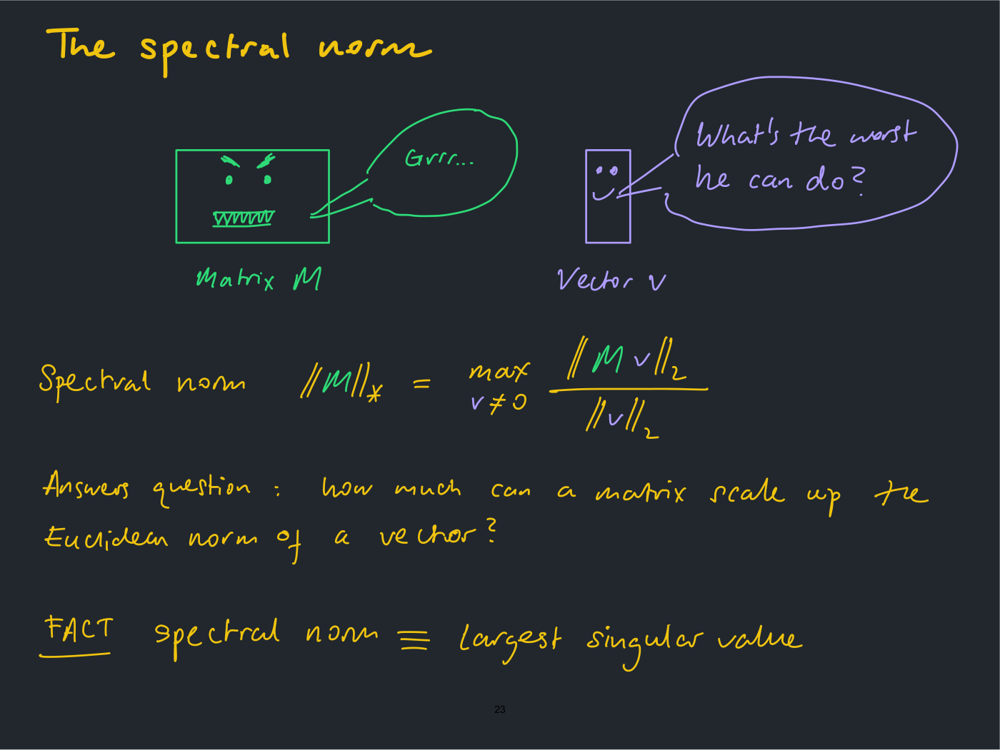
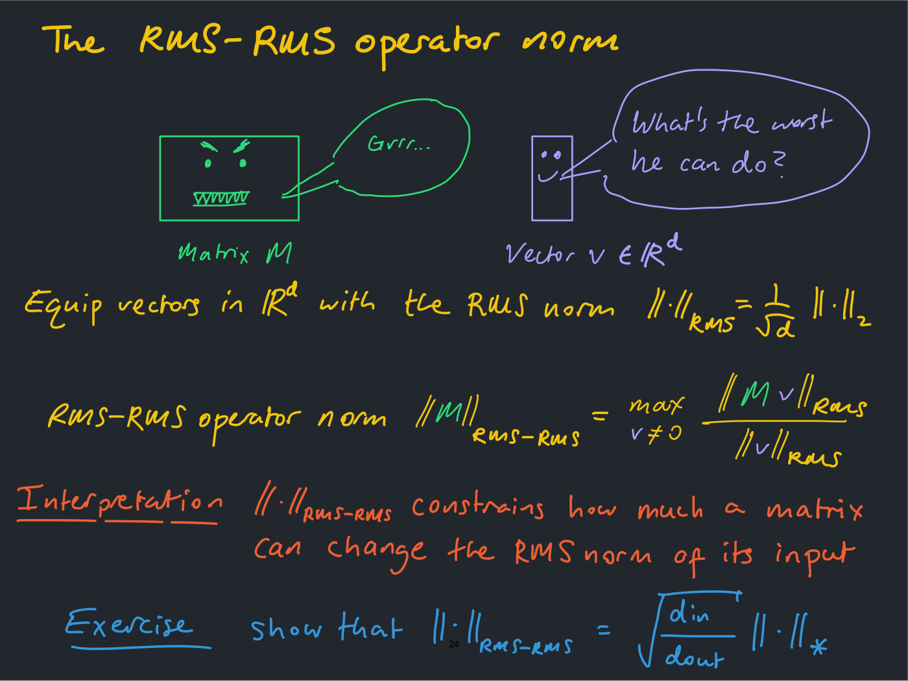
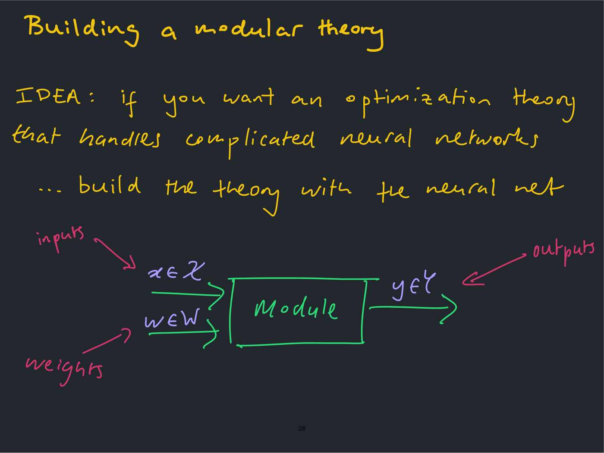

# Lecture 7 — Scaling Rules for Optimization

**Lecturer:** Jeremy Bernstein ·
**Video:** [youtube.com/watch?v=VcGPE4s_oNw](https://www.youtube.com/watch?v=VcGPE4s_oNw) (81 min) ·
**Slides:** [`mit6_7960_f24_lec7.pdf`](https://ocw.mit.edu/courses/6-7960-deep-learning-fall-2024/mit6_7960_f24_lec7.pdf)
(32 pages, handwritten; transcribed slide by slide in [`raw/slides/07-scaling-rules-for-optimization.md`](../raw/slides/07-scaling-rules-for-optimization.md)) ·
**Transcript:** [`raw/transcripts/07-scaling-rules-for-optimization.md`](../raw/transcripts/07-scaling-rules-for-optimization.md)

## What this lecture establishes

Of the three pieces of the machine learning puzzle (approximation, optimization and
generalization), this lecture takes the second: once a network that fits the data exists, how do
you find it? It first surveys three classical methods, all of which start by Taylor expanding the
loss and differ only in what they assume about the part of the expansion they cannot handle.
**Newton's method** keeps the second-order term and inverts the Hessian. **Gauss-Newton** splits
the Hessian into a curvature of the error and a curvature of the model, and drops the second.
**Steepest descent** throws away everything beyond the linear term and replaces it with a squared
norm penalty, so that the choice of norm decides the algorithm: the Euclidean norm gives ordinary
gradient descent and the infinity norm gives sign gradient descent. Each method comes with its
reasons for not being used in practice, where "we just use Adam to train neural networks"
(≈21:05).

The second half turns to what happens when a network is made wider or deeper. Trained naively, a
wider network needs a different learning rate, and a deeper one trains worse. The lecture's
heuristic answer is that the size of a weight update only means something once you say *in which
norm* it is measured. Since a network is built out of matrices, the norm should be a matrix norm,
and the one the lecture argues for is the **RMS-to-RMS operator norm**, a rescaled spectral norm.
The claim is that if every layer is initialized with this norm around 1, and every update is scaled
to have this norm around 1, the best learning rate stops drifting with width. For depth it
suggests, more tentatively, dividing each residual block by the number of blocks, by analogy with
$(1 + x/L)^L \to e^x$. The last part is the lecturer's own research: a **modular** theory in which
every layer type carries a norm and the norm of a whole network is built from its parts as the
network is composed. He introduces it with "my research, so be skeptical" (slide 27).

The deck is handwritten, in several ink colours mostly on a dark background, like the lecturer's
[lecture 3](03-approximation-theory.md). Three of its slides reproduce plots from a post by
@kellerjordan0 on X that OCW excludes from its licence, so those plots are described in prose and
not shown.

**Notation on this page** follows the slides, with vectors and matrices bolded as in the
[course notation](notation.md) (the handwritten slides write them unbolded). The network is
$f(\mathbf{x}, \mathbf{w})$, with input $\mathbf{x}$ and weights $\mathbf{w}$. The **error
measure** $\ell(\hat{y}, y)$ compares a prediction $\hat{y}$ with a target $y$, and the **loss**
$\mathcal{L}(\mathbf{w})$ is its average over the training set. In the handout's terms
$\mathcal{L}$ is the total cost $J$, $\ell$ the per-example loss $L$, and $\mathbf{w}$ the
parameters $\theta$. $\mathbf{g}$ is the gradient and $\mathbf{H}$ the Hessian of $\mathcal{L}$,
$\Delta \mathbf{w}$ a weight update, $\eta$ a learning rate, $\lambda$ a positive number that sets
how strongly a model penalizes large steps, and $d$ the number of weights. In the depth section $L$
is the number of residual blocks, not a loss. Later sections define the norms they use.

## The machine learning puzzle, and why optimization

Slide 3 repeats lecture 3's puzzle: **approximation** ("Does there exist a neural net in my model
family that fits the training data?"), **optimization** ("If it does exist, can I find it?") and
**generalization** ("Does it work well on unseen data?"), with "This lecture will focus mainly on
the second question." The first and third had been the subjects of [lecture
3](03-approximation-theory.md) and [lecture 6](06-generalization-theory.md) (≈1:31).

To motivate the choice the lecturer offers, "just for the sake of argument", a caricature of a
current view: approximation is solved "because you just use a transformer for everything — really
big transformer", and generalization is solved "because you just get so much data that everything
generalizes. If you have the whole universe of training data, you'll never overfit". On that view
"the thing that we can improve upon is optimization. And this is the mindset if you're at a deep
learning startup", where you make optimization as efficient as possible and "throw the big neural
network at the problem and collect lots of data". He calls both positions "slightly too extreme"
(≈2:18–3:06).

## The optimization problem

Slide 4 states the problem formally. A neural net $f(\mathbf{x}, \mathbf{w})$; an error measure
$\ell(\hat{y}, y)$ between a prediction and a target, which "you think of … as cross-entropy or
square error"; training data $(\mathbf{x}^{(1)}, y^{(1)}), \ldots, (\mathbf{x}^{(N)}, y^{(N)})$, $N$
pairs of inputs and targets; and the loss function

$$\mathcal{L}(\mathbf{w}) = \frac{1}{N} \sum_{i=1}^{N} \ell\left(f(\mathbf{x}^{(i)}, \mathbf{w}), y^{(i)}\right).$$

The goal is to find the $\mathbf{w}$ that minimizes $\mathcal{L}(\mathbf{w})$. "These days, we pick
$f$ to be a really big transformer. $N$, we make it really, really large" (≈4:38). The lecturer
points out two features that matter later. The loss is **compositional**, an error measure glued to
a neural network, and it is an **average over the training set** (≈4:38–5:23).

Slide 5 is the picture: a loss curve over $\mathbf{w}$, a point marked "START HERE" high on one side
and the minimum marked "FIND THIS POINT". "Roughly, we just iterate"

$$\mathbf{w} \longrightarrow \mathbf{w} - \eta \frac{\partial \mathcal{L}}{\partial \mathbf{w}},$$

with $\eta$ the learning rate and $\partial \mathcal{L} / \partial \mathbf{w}$ the gradient (≈5:23–6:11).
See [gradient descent](gradient-descent.md).

*Slide 5 — start high on the loss curve and iterate the gradient step down to the minimum.*

### What makes it hard

"In a sense, it's not hard, because we do it all the time" (≈6:11). Slide 6 lists three
difficulties. **Size**: a lot of weights, "really high-dimensional optimization". **Depth**: a lot of
layers; "for a while, we couldn't train really, really deep neural networks. But with some advances,
now we can". **Noise**: a lot of data, so you must use mini-batches, computing each gradient "on a
handful of data points", which gives "noisy estimates of the full gradient" (≈6:11–7:45). The
lecture sets the third aside: "In this lecture, we will just study full-batch optimization … it's
already interesting." That is, it assumes the true gradient of the whole loss on all the data can be
evaluated at every step (≈7:45).

*Slide 6 — what makes optimization hard: size, depth and noise.*

## Scaling woes: a teaser

Slide 7 previews the problem the second half solves. A network can be scaled in **width** (made
wider) or **depth** (made deeper), and "we kind of run into two nuisances when we do this if you do
it naively" (≈8:30). Its two plots, screenshots from a post by @kellerjordan0 on X, are excluded
from OCW's licence. Both plot training loss against learning rate, one curve per network size, for
sizes 32, 64, 128, 256, 512 and 1024; neither shows tick values.

- **"Optimal learning rate drifts"** (width). Wider networks reach a lower loss, "which is good.
  That's why people want to scale their network". But the learning rate that gets the best loss
  moves: the minima step down and to the left as width grows, and a red arrow on the slide runs from
  the width-32 minimum to the width-1024 one. "As I scale my model, the best learning rate changes"
  (≈8:30–10:04). In practice you do not run a full sweep at every size, so "you try to scale your
  model, and you try to run the training again. And you find, oh, my training isn't working …
  you have to retune the learning rate at the large scale" (≈9:17–10:04).
- **"Deeper performs worse"** (depth). The curves for greater depth sit higher, with their minima at
  about the same learning rate. Done naively, "performance gets worse as I make my model deeper"
  (≈10:04). (The lecturer says depth increases "as I go down" the curves, the reverse of the plot and
  its legend.)

A student suggested the curves keep the same shape, so the optimum is unchanged. The lecturer
compared two points: at width 32 the best loss is at one learning rate, and at width 1,024 "it just
corresponds to a different learning rate. So it's the fact that the minima occur at different points
on the x-axis" (≈10:49). Why it changes is the subject of the end of the lecture.

Another student asked why anyone uses deep networks if deeper is worse. "This is basically pre,
let's say, 2015. The max depth people went to was, let's say, 16 or something. And then people
figured out techniques. And now, you can train a network with thousands of layers." The fix for depth
"is use a residual architecture and set up the residual blocks in a good way"; set them up badly, or
set up the interaction between the optimizer and the blocks badly, and the problem returns. "If you
solve all the problems, then you can fix it in a really nice way where … the optimal learning rate
always transfers across scale" (≈11:36–12:21). For the width plot, "even with all the latest fixes
prior to 2021, it had that drift. But then if you know all the literature from 2021 until now, then
you can fix it for sure" (≈13:07).

Why it matters: "if you're trying to scale massive transformers, you may not even have the resources
to tune all the hyperparameters of a really big model", so "you can only tune things at small scale
and then try to transfer them" (≈13:07). See [scaling rules](scaling-rules.md).

## Classical methods start from a Taylor expansion

Slide 9 sorts methods by what they use. **First-order methods** use first derivatives, the gradient
$\mathbf{g} = \partial \mathcal{L} / \partial \mathbf{w}$, which "is kind of what we do in deep
learning": it is "the thing that you get by doing back propagation". **Second-order methods** also
use the Hessian $\mathbf{H} = \partial^2 \mathcal{L} / \partial \mathbf{w}^2$, "a big matrix of second
derivatives" (≈13:55–15:32). The aim is "to explain the modeling assumptions that different
approaches make and then also think about potential shortcomings of those modeling assumptions. So
you should always ask … why don't we actually do this in practice?" (≈14:43–15:32).

"All of these different methods, I would argue, start by Taylor expanding the loss function"
(≈15:32). Slide 10 writes the expansion around the current weights $\mathbf{w}$ for an update
$\Delta \mathbf{w}$:

$$\mathcal{L}(\mathbf{w} + \Delta \mathbf{w}) = \mathcal{L}(\mathbf{w}) + \mathbf{g}^{T} \Delta \mathbf{w} + \frac{1}{2} \Delta \mathbf{w}^{T} \mathbf{H} \thinspace \Delta \mathbf{w} + \cdots$$

(The slide's first line writes no transpose on the first $\Delta \mathbf{w}$ of the quadratic term;
slides 11 and 16 do.) The first two terms are the **linearization** of the loss, and everything after
them the **non-linear part**. If the network has $d$ weights, $\mathbf{g}$ is a vector in
$\mathbb{R}^d$ and $\mathbf{H}$ a matrix in $\mathbb{R}^{d \times d}$ (≈16:19–17:59). See
[second-order methods](second-order-methods.md) and [steepest descent](steepest-descent.md).

## Newton's method

Slide 11 takes the expansion to second order and minimizes the right-hand side with respect to
$\Delta \mathbf{w}$, with the quadratic term written with a $\lambda$:

$$\mathcal{L}(\mathbf{w} + \Delta \mathbf{w}) \approx \mathcal{L}(\mathbf{w}) + \mathbf{g}^{T} \Delta \mathbf{w} + \frac{\lambda}{2} \Delta \mathbf{w}^{T} \mathbf{H} \thinspace \Delta \mathbf{w}.$$

(In the recording the lecturer says "take the Taylor expansion up to first order" here, ≈17:59; the
slide says second order, and the term kept is the second-order one.) Taking the derivative and
setting it to zero gives $\mathbf{g} + \lambda \mathbf{H} \Delta \mathbf{w} = 0$, and the boxed result
is **Newton's method**:

$$\Delta \mathbf{w} = -\mathbf{H}^{-1} \mathbf{g}.$$

The box carries no $\lambda$; solving the line above it gives
$-\frac{1}{\lambda} \mathbf{H}^{-1} \mathbf{g}$, so the box is the $\lambda = 1$ case, as in slide 10's
expansion. The slide does not comment on this. People describe the step as "pre-condition the
gradient with the inverted Hessian": "you take the Hessian, you invert it, and then you multiply it
with the gradient" (≈18:46–19:33).

Why not use it? Slide 12 gives two problems, and the lecture adds a third remark.

- **Size.** With $d$ parameters the Hessian is $d \times d$, "too expensive even for 'small'
  networks". The slide draws the gradient as a tall $d \times 1$ rectangle beside the Hessian as a
  $d \times d$ square. "d may be billions in a large neural network, so you can't even store such a
  large matrix" (≈20:20).

*Slide 12 — the gradient is a d-by-1 vector, the Hessian a d-by-d matrix.*

- **It might converge to a local maximum.** Setting the derivative to zero "is just finding a critical
  point of the quadratic form. If it's close to a max, it could find a maximum. So it's not even
  necessarily doing gradient descent. It could be doing gradient ascent." The slide's fix is "cubic
  regularization", which "adds a cubic penalty to the quadratic form. But people don't use that"
  (≈20:20–21:05).
- **Practice.** "Any time we present a method, there's always like attempts to make it practical …
  But then in practice, we just use Adam to train neural networks" (≈21:05).

## The Gauss-Newton decomposition and method

Gauss-Newton exploits the compositional structure of the loss (slide 13, ≈21:54–24:18). Write the
objective as a composite, $\mathcal{L} = \ell \circ f$, an error composed with a neural net. The
chain rule gives the gradient,

$$\frac{\partial \mathcal{L}}{\partial \mathbf{w}} = \frac{\partial \ell}{\partial f} \cdot \frac{\partial f}{\partial \mathbf{w}},$$

and differentiating again, by the product rule and the chain rule, gives the Hessian:

$$\frac{\partial^2 \mathcal{L}}{\partial \mathbf{w}^2} = \frac{\partial f}{\partial \mathbf{w}} \cdot \frac{\partial^2 \ell}{\partial f^2} \cdot \frac{\partial f}{\partial \mathbf{w}} + \frac{\partial \ell}{\partial f} \frac{\partial^2 f}{\partial \mathbf{w}^2}.$$

This is the **Gauss-Newton decomposition** of the Hessian. Slide 14 labels its pieces: the left side
is the full Hessian $\mathbf{H}$, the first term the **curvature of the error**, the second the
**curvature of the model**. "It's like decomposing curvature into one piece from the error and one
piece from the model" (≈24:18).

The **Gauss-Newton method** (slide 14, ≈24:18–26:41) makes two assumptions. First, for the square
loss $\ell = \frac{1}{2}(f - y)^2$, the curvature of the error is $\partial^2 \ell / \partial f^2 = 1$.
Second, "ignore the curvature of the model", which the slide follows with an upside-down smiley:
"It's just an assumption that people make. They say, hey, I don't really know how to deal with this
term, so let's just ignore it." The Hessian becomes a product of two model derivatives, and Newton's
method becomes

$$\Delta \mathbf{w} = - \left[ \frac{\partial f}{\partial \mathbf{w}} \frac{\partial f}{\partial \mathbf{w}} \right]^{-1} \mathbf{g}.$$

As written on slides 13–15 the two factors look identical, with no transpose on either; "all of these
things are tensors and you need to be careful about all the indexing. But that's something to just
check" (≈25:54). The derivatives in the bracket are those "of the model with respect to the weights.
So it's not the same thing as the regular gradient that you usually think about" (≈26:41).

Slide 15's problems: it "requires computing extra derivatives $\partial f / \partial \mathbf{w}$",
and "is it safe to ignore curvature of the model?" (the slide strikes that term out with a red
cross). A student added that the matrix may be low rank and so not invertible; "oftentimes, people
… will add a little bit of identity matrix to it to give it better conditioning, and then they'll
just invert that" (≈26:41–27:26). Forming an extra matrix, inverting it and computing extra
derivatives are what count against it: "people are not going to want to do that in practice unless
they're really convinced that there's a really big improvement … And basically, nobody's convinced
them of that, so they just don't use it. … But there's a lot of research trying to make this type of
thing practical" (≈27:26–28:12).

### Why backpropagation never gives you $\partial f / \partial \mathbf{w}$

A student asked why these derivatives are extra work, since backpropagation passes through the
network anyway. "Because you do the gradient by backpropagation, you never explicitly form
$df/dw$ … you start from the end of the network and work backwards." Forward-mode automatic
differentiation would give both, "but it's much more expensive" (≈28:59). Later (≈32:04–32:49) he
spelled out the sizes: $\mathbf{g}$ is the derivative of the loss, "a single number", with respect to
all the weights, while the network may output a tensor, and $\partial f / \partial \mathbf{w}$ holds
the derivative of every component of that tensor with respect to all the weights. "So it's just a
bigger tensor than the gradient. And you really want to avoid explicitly forming that. And
backpropagation allows you to do that, because you only ever track derivatives with respect to the
loss, which is a single number." He recommends implementing backprop yourself as an exercise:
"you can actually have a whole career without ever implementing backprop", but it forces you to
think about what gradients look like (≈32:49). See [backpropagation](backpropagation.md).

### How expensive is inverting a matrix?

Asked for an intuition (≈29:45–31:17), the lecturer was careful: "I'm not an expert on all these."
He thinks the cost of inverting a matrix "is basically equivalent to computing a singular value
decomposition", and those "are much more expensive than computing a forward pass or a backward
pass", which are "somehow linear in the number of layers". He would not give a complexity ("I'm not
going to give you the answer because I don't have it"), but added a practical factor: GPUs "are
basically designed to do forwards on layers and to do backwards on layers, but they're not designed to
invert matrices or do singular value decomposition." Trying the algorithms in a Colab notebook gives
a quick sense of how they compare.

## Steepest descent

Steepest descent starts from the same Taylor expansion and throws away the whole non-linear part,
replacing it with a squared norm of the step (slide 16, ≈33:37):

$$\mathcal{L}(\mathbf{w} + \Delta \mathbf{w}) \approx \mathcal{L}(\mathbf{w}) + \mathbf{g}^{T} \Delta \mathbf{w} + \frac{\lambda}{2} \Vert \Delta \mathbf{w} \Vert^2.$$

$\lambda$ "is a number. It could be 5", and the norm is "our favorite norm". "I don't even know what
that nonlinear part is. Let me just replace it with something which I know very well. And actually,
a lot of optimization methods actually have that flavor" (≈33:37–34:22). The class's favourite norms
included Euclidean, Frobenius, max (infinity) and $\ell_p$; a student also offered the KL divergence,
which "is actually not a norm … It's not symmetric", though it is a measure of distance. "There's a
lot of steepest descent methods because there's a lot of norms" (≈35:15–36:03). Each step then
minimizes the right-hand side of this model with respect to $\Delta \mathbf{w}$.

**The Euclidean norm gives gradient descent** (slide 17, ≈36:49–38:22). With
$\Vert \Delta \mathbf{w} \Vert_ 2^2$ as the penalty, whose balls are circles, setting the derivative to
zero gives $\mathbf{g} + \lambda \Delta \mathbf{w} = 0$, so

$$\Delta \mathbf{w} = -\frac{1}{\lambda} \mathbf{g},$$

"vanilla gradient descent!" with step size $1/\lambda$. "I make the penalty larger by increasing
lambda, and my step size gets smaller. So … there's some connection between regular old gradient
descent and L2 geometry on your optimization space."

*Slide 17 — with the Euclidean norm as the penalty, steepest descent is ordinary gradient descent.*

**The infinity norm gives sign gradient descent** (slide 18, ≈38:22–39:53). The infinity norm
measures the largest absolute coordinate, $\Vert \Delta \mathbf{w} \Vert_ \infty = \max_i |\Delta w_i|$,
and its unit ball "is not really looking like a ball anymore. It's more of a kind of square." The
minimization is left to the homework ("not quite as simple as just differentiating", because of the
max), and the answer is

$$\Delta \mathbf{w} = -\frac{\Vert \mathbf{g} \Vert_ 1}{\lambda} \operatorname{sign}(\mathbf{g}),$$

"the L1 norm of the gradient divided by lambda times the sign of the gradient, where the sign is plus
or minus 1", applied coordinate by coordinate: **sign gradient descent**. Asked whether every weight
then moves by the same amount, the lecturer said yes: "the sign of a vector maps a vector to another
vector, where all the components have the same magnitude" (≈45:18–46:05).

*Slide 18 — change the norm to the infinity norm and the same recipe gives sign gradient descent.*

**Any norm** (slide 19, ≈40:40–41:27). For a general norm the minimization has a "dual formulation":

$$\underset{\Delta \mathbf{w}}{\operatorname{argmin}} \left[ \mathbf{g}^{T} \Delta \mathbf{w} + \frac{\lambda}{2} \Vert \Delta \mathbf{w} \Vert^2 \right] \equiv \frac{\Vert \mathbf{g} \Vert^{\dagger}}{\lambda} \thinspace \underset{\mathbf{t} : \Vert \mathbf{t} \Vert = 1}{\operatorname{argmax}} \thinspace \mathbf{g}^{T} \mathbf{t},$$

where $\Vert \cdot \Vert^{\dagger}$ is the **dual norm** of $\Vert \cdot \Vert$. The slide labels the
fraction the **step size** and the argmax, over unit vectors $\mathbf{t}$, the **step direction**:
"we can separate the solution of the steepest descent problem into two pieces." Proving it "is on the
homework". As printed, the slide's right side carries no minus sign; problem set 2's statement of the
same identity has one (see [below](#problem-set-2)).

### Does the model hold?

A student pointed out that nothing guarantees the approximation still holds at the
$\Delta \mathbf{w}$ it produces. "Yes, there is no guarantee … I said take your loss function, throw away the
nonlinear part, and just replace it with your favorite norm. So that doesn't sound like the kind of
thing that's going to give you a guarantee. It sounds kind of random. But it's a framework for
thinking about deriving different optimization algorithms" (≈42:14). A larger $\lambda$ keeps steps
small, and an infinite one means "you never move anywhere, so you're always within the linear
region … But … you wouldn't know how big you need to make lambda to be for that to work" (≈43:00).

The way to earn a guarantee (≈43:46–45:18): if the loss is analytic, the Taylor expansion really
holds, and if one could produce a $\lambda$ and a norm such that the linear term plus
$\frac{\lambda}{2} \Vert \Delta \mathbf{w} \Vert^2$ is a genuine **upper bound** on the loss, then
minimizing the model would be safe. The homework's bonus question does this "for the case of a
linear model … and the square loss", and the hope is that you then ask, "What if I have a two-layer
neural net? … What if I had a five-layer neural net? … that's essentially what I'm trying to do in my
research at the moment."

### Why a norm other than the Euclidean?

A student asked why one would ever constrain the step in another norm, when the gradient direction
seems natural (≈46:05–47:38). The lecturer's answer: "implicitly, when you say the best direction is
the gradient direction, I'm trying to say that you're thinking Euclidean." His picture is a map of
the US squeezed in Photoshop, so that "taking a step of 1 centimeter East-West would correspond to
moving like … 2,000 miles, whereas taking one centimeter step North-South might correspond to going
10 miles". Going straight along the gradient assumes "a very isotropic map", and in deep learning,
"because of the architecture of the network and so on", directions in weight space may not be equal:
it "may be a very non-isotropic space" (≈47:38–48:25).

A student suggested this amounts to a preconditioner scaling each coordinate differently. "That's one
example": a Euclidean norm with a positive constant on each coordinate gives a steepest descent that
reshapes the gradient, and the infinity and Frobenius norms are others, all "ways of … saying that
different coordinate directions or different directions more generally have different weightings"
(≈49:12–49:58). A second intuition: the linear term is only valid for some distance, "and it may break
down at a different rate going in different directions. So the idea of building a norm is to capture
at what rate does the linear piece break down if I move in this direction or this direction"
(≈49:58). See [steepest descent](steepest-descent.md) and [norms](norms.md).

## How large should the weight updates be?

The second half is introduced as "a purely heuristic and purely intuitive level" (≈45:18). Slide 21
asks how large a weight update should be. "We want the 'Goldilocks' update size … not too big, not
too small": too big and "you're going to break your neural network", too small and "you're not going
to be training very efficiently" (≈50:45). "But always ask: in which norm?" — "if anyone ever says
that something is big or small, you should always ask, what's the scale that you're measuring it on?
And for tensors, the notion of scale is what's the norm" (≈51:32–52:20). The lecturer compares it to
the scale bar on a map.

The slide's observation is that "a neural net is built out of weight matrices", not one big vector,
"so perhaps we could try a matrix norm?" The slide lists the Frobenius, spectral and nuclear norms,
and the lecture adds the general family of Schatten $p$-norms: "there's actually a lot of ways to
measure how big a matrix is, which kind of makes sense because it's got a lot of different
coordinates". The spectral norm, the largest singular value, came from a student; "I think I pretty
much knew just the Frobenius norm until maybe three years ago" (≈53:06–53:51).

### Three perspectives on a network

Slide 22 sets out "Perspectives on neural computation" (≈53:51–56:58). The **neural perspective** sees
nodes connected by edges. The **tensor perspective** recognizes a weight matrix, followed by a ReLU,
acting on a vector, and describes the network as matrix multiplications. The **spectral perspective**
writes every weight matrix through its singular value decomposition, drawn as an orthogonal, a
diagonal and a semi-orthogonal factor, and the vector as a unit vector beside two scalars. The
SVD is "like a generalized eigenvalue decomposition. Not every matrix has eigenvalue decomposition, but
every matrix has a singular value decomposition."

*Slide 22 — the neural, tensor and spectral views of the same layer.*

The point is not to train in the spectral representation: "I'm just saying that mentally, you can
always do that." The lecturer's picture of stable training is the singular values of every weight
matrix changing by a moderate amount each step: "probably the singular values should not change too
drastically from step to step. That would be bad. But if they change too little from step to step,
that would be also bad because I would be training too slow" (≈55:26–56:11). See [multilayer
perceptrons](multilayer-perceptron.md).

## The spectral norm and the RMS-RMS operator norm

Slide 23 introduces the **spectral norm** with a cartoon: a scowling "Matrix $\mathbf{M}$" saying
"Grrr…" and a smiling "Vector $\mathbf{v}$" asking "What's the worst he can do?" The spectral norm
answers "how much can a matrix scale up the Euclidean norm of a vector?":

$$\Vert \mathbf{M} \Vert_ \ast = \max_{\mathbf{v} \neq 0} \frac{\Vert \mathbf{M} \mathbf{v} \Vert_ 2}{\Vert \mathbf{v} \Vert_ 2}.$$

"I feed in a unit vector to the matrix, and I get out a vector. How large can that vector possibly
be?" Because training is "putting vectors into matrices", this norm is "descriptive of what's actually
happening during training". The slide states as a fact, not proved, that the spectral norm equals the
largest singular value (≈57:00–58:32).

*Slide 23 — the spectral norm is the most a matrix can stretch a vector, measured in the Euclidean norm.*

What is arbitrary here is the choice of the Euclidean norm on the input and on the output. Any norm on
each can be used, and the result is an **induced operator norm** on the matrix: "we call this inducing
a norm on a matrix given a norm on the input space and a norm on the output space" (≈58:32–59:18).
"Maybe I don't care about the L2 norm of my activations."

Slide 24 equips vectors in $\mathbb{R}^d$ with the **RMS norm** from [lecture
3](03-approximation-theory.md),

$$\Vert \cdot \Vert_{\text{RMS}} = \frac{1}{\sqrt{d}} \Vert \cdot \Vert_ 2,$$

"just a rescaled Euclidean norm" (≈1:00:05). It is the norm that transformers already enforce: "we
often make a big effort to normalize all of the activations of the layer in the RMS norm. And this is
referred to either as RMS normalization, or layer normalization, or layer norm." A unit RMS norm means
each coordinate is around 1, "which is kind of nice for neural networks. It means that the feature
vectors or the activation vectors are all well-behaved" (≈1:00:51–1:01:37). Inducing from the RMS norm
on both sides gives the **RMS-RMS operator norm**:

$$\Vert \mathbf{M} \Vert_{\text{RMS-RMS}} = \max_{\mathbf{v} \neq 0} \frac{\Vert \mathbf{M} \mathbf{v} \Vert_{\text{RMS}}}{\Vert \mathbf{v} \Vert_{\text{RMS}}}.$$

It "constrains how much a matrix can change the RMS norm of its input". The slide's exercise is to show
that it is a rescaled spectral norm, for a matrix from a $d_{\text{in}}$-dimensional space to a
$d_{\text{out}}$-dimensional one:

$$\Vert \cdot \Vert_{\text{RMS-RMS}} = \sqrt{\frac{d_{\text{in}}}{d_{\text{out}}}} \thinspace \Vert \cdot \Vert_ \ast.$$

This, he says, is also used in the second part of the homework: "You just need to be able to normalize
something in that norm" (≈1:02:24).

*Slide 24 — the RMS-RMS operator norm: how much a matrix can change the RMS norm of its input.*

## Width scaling: spectrally controlled weight updates

"What is the payoff? … defining that particular norm is the thing that solves the width scaling
problem" (≈1:02:24). Slide 25 states the claim: to remove drift in the optimal learning rate as width
is varied, for all layers $\ell = 1, \ldots, L$,

1. initialize weights so that $\Vert \mathbf{W}_ \ell \Vert_{\text{RMS-RMS}} \sim 1$;
2. scale updates so that $\Vert \Delta \mathbf{W}_ \ell \Vert_{\text{RMS-RMS}} \sim 1$.

The slide reproduces slide 7's width plot beside the claim, and ends "See homework!" The intuition for
each half (≈1:04:01–1:04:46): with the initial matrix normalized in this norm, "if I pass in features
that are coordinate wise 1 or on average 1, I can only get out features that are at most coordinate
wise 1", so it "controls RMS norms as you move through the network". Normalizing the updates controls
"the amount that the activation vectors can change from step to step … in precisely the same way. …
We call it feature learning."

The students' questions draw out what the claim does and does not say.

- **Does this limit expressivity?** "We're only controlling the property at initialization, and then
  between consecutive steps. But over many steps, things can change much more. So I think that that's
  probably why it doesn't harm the expressivity" (≈1:04:46–1:05:34).
- **Is it empirical or theoretical?** Both. The homework's second problem tests it empirically. On the
  theory side, the operator norm's definition tells you "things have to behave in a good way in a
  certain sense, but only in terms of an upper-bound. It says that the features of the particular layer
  cannot change more than by this amount … But it doesn't tell you the features definitely will change
  by this amount." There is theory for that too, "but it usually makes infinite width limits". It is
  "an active topic at the moment … But it's still a not fully resolved kind of question" (≈1:05:34–1:06:19).
- **Why does it stop the drift?** "In some sense, it's a non-dimensional norm. My system is behaving
  well when the norm is 1. That would mean that all my activations are around 1." The alternative is
  that the size of each activation grows or shrinks with dimension, "bad scaling". Controlling
  Euclidean norms would make individual coordinates grow or shrink with width; the RMS norm "keeps the
  size of the individual coordinates actually invariant to the width, or the amount that the
  coordinates are changing is also invariant to the width" (≈1:07:07–1:07:54).
- **Why constrain the update, when it is multiplied by a learning rate anyway?** "The optimal learning
  rate should be independent of width. So we're trying to package all the dimension dependence in the
  right way into the norm", so that after normalizing the update, "the learning rate, I don't need to
  change it with width anymore. … If you don't normalize the updates in a particular norm, then the
  learning rate itself needs to account for the dimension dependence" (≈1:08:40). The homework compares
  gradient descent with and without the normalization.

See [scaling rules](scaling-rules.md).

## Depth scaling

"I kind of wimped out a little bit. And also it's like an open research topic, so it's OK"
(≈1:09:26). Slide 26 says "the trick seems to be to parameterize your residual block the 'right' way",
and recalls

$$\lim_{L \to \infty} \left(1 + \frac{x}{L}\right)^{L} = \exp(x).$$

The analogy (≈1:10:13–1:11:47): this is "a compound system. It's a big product of many, many, many
things", scaled so that "even when I take the number of terms in the product to infinity, the thing
doesn't blow up, and it doesn't go to 0 … that kind of well-scaled depth limit." Dividing $x$ by the
number of terms $L$ is what makes it converge. The lecturer adds that with $L^2$ in its place the limit
"would get 0" and with $\sqrt{L}$ "it would blow up". (A note outside the course material: with
$L^2$ in place of $L$ the limit is in fact 1, so $x$ drops out entirely rather than the product
vanishing. The point that only the factor $L$ keeps the limit non-trivial stands.) "That's the same … consideration
you need to have if you want to train a residual network, and you don't want the dynamics to either
blow up or go to 0 as you take the depth infinity."

So, with $L$ the number of blocks, "build your residual block like"

$$\mathbf{x} \longrightarrow \mathbf{x} + \frac{1}{L} \operatorname{layer}(\mathbf{x}) \thinspace ?$$

with the question mark and "needs more research" on the slide. A block "could be like a little MLP, or
it could be an attention layer", and the network is roughly that block "raised to the power $L$", which
"really means composing it with itself $L$ times. And you really want to be very careful about the
block multiplier" (≈1:11:47–1:12:34). The caveat is there "because … there's different papers saying
different things".

The lecturer adds that "a standard transformer block actually doesn't put a 1 over L multiplier. The
standard thing is actually to put 1 over square root L". The argument for $1/\sqrt{L}$ is that the
blocks are "incoherent and random with respect to each other at initialization", so adding them up "is
a bit like doing a random walk. And a random walk moves a distance like square root number of time
steps". "It's unclear whether that's the right thing to do or whether just to divide by L is the right
thing to do" (≈1:13:20–1:14:05). See [skip connections](skip-connections.md).

## A modular theory

The last section is the lecturer's research, "so again, you can be very skeptical and feel free to not
believe me" (slide 27, ≈1:14:52). The problem: "there's such a zoo of architectures … how can you build
an optimization theory that covers all of them? Because someone can always produce a new
architecture." The idea, on slide 28: "if you want an optimization theory that handles complicated
neural networks … build the theory with the neural net", baking the construction of the theory into
the process of building the architecture (≈1:15:37).

A **module** (slide 28) takes inputs $\mathbf{x} \in \mathcal{X}$ and weights
$\mathbf{w} \in \mathcal{W}$ and produces outputs $\mathbf{y} \in \mathcal{Y}$. "PyTorch already has modules", and the
abstraction covers a single layer or a whole network: a ReLU is a module with an empty weight space, and
"a full transformer is also a module" (≈1:15:37–1:16:23).

*Slide 28 — a module: inputs and weights in, outputs out.*

Slide 29 defines a module $M$ by three methods: `M.forward`, of type
$\mathcal{W} \times \mathcal{X} \to \mathcal{Y}$; `M.backward`, of type
$\mathcal{Y} \times \mathcal{W} \times \mathcal{X} \to \mathcal{W} \times \mathcal{X}$; and `M.norm`,
of type $\mathcal{W} \to \mathbb{R}$. A library of **atomic modules**, Linear, Embedding, Conv2D and
ReLU, is written "with hand-specified forward, backward and norms". The forward is "the function the
thing expresses, and the backward is its derivatives basically", as the homework had students write by
hand; the new ingredient is the norm. "For a linear layer, the good norm is this RMS to RMS operator
norm. ReLU actually doesn't have weight, so it doesn't need a norm" (≈1:17:09–1:17:55).

Slide 30 adds **combination rules**, for example composition $M = M_2 \circ M_1$. The forward is just
the composition of the forwards, and the backward is the chain rule. "How should we combine
$M_2$.norm and $M_1$.norm?" is left as the open question (≈1:18:42–1:19:28). It connects back to
steepest descent: "the big question is, how do you pick a norm that's a good match for your loss
function? And it seems horrendous for deep learning because you can have any architecture … But what
if there was an automatic way? What if there was a way to assign norms to the basic things in the
library? And then when people compose them, it automatically gives them a norm on the composed thing.
It would solve the problem in a way. So that's what we're trying to do" (≈1:19:28). See
[differentiable programming](differentiable-programming.md).

## References

Slide 31 lists four papers, and the lecturer explains how they relate (≈1:20:14). The first two study
"how things behave as the network becomes infinitely big and … try to keep it stable in that limit":

- "Feature Learning in Infinite Width Neural Networks", Yang & Hu (2020).
- "Infinite Limits of Multi-Head Transformer Dynamics", Bordelon, Chaudhury & Pehlevan (2024).

The third is "the paper from my collaborators — also with Phillip — where we're not trying to do those
limits":

- "Scalable Optimization in the Modular Norm", Large et al (2024).

And the fourth is "a really interesting paper as well":

- "Universal Majorization-Minimization Algorithms", Streeter (2023).

## Problem set 2

The lecture refers to "the homework" throughout. On OCW that is **Homework 2**
([`mit6_7960_f24_hw2.pdf`](https://ocw.mit.edu/courses/6-7960-deep-learning-fall-2024/mit6_7960_f24_hw2.pdf)),
which went out at [lecture 6](06-generalization-theory.md); lecture 6 had recommended reading its first
question before this lecture. Two of its parts follow this lecture, and this page records what they ask,
not their answers.

- **Steepest descent** (9 points) poses the problem as
  $\underset{\Delta \mathbf{w}}{\operatorname{argmin}} \left[ \mathbf{g}^{\top} \Delta \mathbf{w} + \frac{\lambda}{2} \Vert \Delta \mathbf{w} \Vert^2 \right]$
  for an arbitrary norm. It asks for the dual norms of the Euclidean and infinity norms, a proof of the
  dual formulation, written there as $-\frac{\Vert \mathbf{g} \Vert^{\dagger}}{\lambda} \cdot \underset{\Vert \mathbf{t} \Vert = 1}{\operatorname{argmax}} \thinspace \mathbf{g}^{\top} \mathbf{t}$,
  and the explicit steepest-descent steps under the Euclidean and infinity norms (slides 17–18). An
  optional part relates the infinity-norm direction to Adam with $\beta_1 = \beta_2 = \epsilon = 0$. It
  then moves to matrices, with the Frobenius inner product $\operatorname{trace}(\mathbf{G}^{\top} \Delta \mathbf{W})$,
  and asks for steepest descent under the spectral norm, which it writes $\Vert \cdot \Vert_ \ast$, in
  terms of the gradient's SVD. A bonus question derives an upper bound of the form the lecture describes,
  for the square loss of a linear predictor.
- **Hyperparameter transfer** (6 points) is set in a story about training a large language model without
  enough cloud credits to tune it, and promises to show "how to initialise and update the weights of a
  neural network in a way that scales well as we increase the network width". It asks for the scaling of
  the spectral norm of Gaussian and orthogonal random matrices, uses power iteration to estimate a
  spectral norm, and then, "We saw in lecture 7 that the learning rate did not transfer well across
  architectures of different width", has students fix that for sign gradient descent. Its recipe
  initializes each layer as a random semi-orthogonal matrix scaled by $\sqrt{d_k / d_{k-1}}$, and
  updates by sign gradient descent divided by the spectral norm of the sign matrix and multiplied by the
  same factor. A question on what weight decay does to the singular values follows.

## Pointers to other lectures

The deck's title slide reads "6.7960 :: Lecture 7", which matches the recording and settles lecture
1's banner "Lecture 6: Scaling Rules for Optimization" (see the [course
map](course-map.md#the-decks-lecture-pointers)). The deck prints no other lecture number. The recording
points back to the puzzle's other two pieces, approximation and generalization (lectures 3 and 6,
≈1:31), and to the RMS norm "from my other lecture" (≈59:18–1:00:05), lecture 3. It points ahead
without numbers: "if you actually implement a transformer — I think at some point you'll do this —
you'll probably use layer norm" (≈1:00:51), and "if you look at a transformer code base, which I think
later in the class we actually do" (≈1:13:20). Transformers are lecture 8 on the schedule. Nothing in
the recording says whether the lecturer's later lecture, 23, "Metrized Deep Learning", continues the
modular theory.

## See also

- [Steepest descent](steepest-descent.md) — the model, the Euclidean, infinity and general cases, the
  dual norm, and why a norm other than the Euclidean.
- [Second-order methods](second-order-methods.md) — the Taylor expansion, Newton's method and the
  Gauss-Newton decomposition and method, with their problems.
- [Norms](norms.md) — "in which norm?": vector norms, matrix norms, induced operator norms and the
  RMS-RMS operator norm.
- [Scaling rules](scaling-rules.md) — learning-rate drift with width, the RMS-RMS recipe, residual
  block multipliers for depth, and the modular theory.
- [Gradient descent](gradient-descent.md) — the update rule this lecture derives as Euclidean steepest
  descent.
- [Lecture 3 — Approximation Theory](03-approximation-theory.md), the same lecturer's lecture that
  introduced the puzzle and the RMS norm; [lecture 6 — Generalization
  Theory](06-generalization-theory.md), the previous lecture.
