# Lecture 8 — Architectures: Transformers

**Lecturer:** Phillip Isola ·
**Video:** [youtube.com/watch?v=Q1HOKrNeh2M](https://www.youtube.com/watch?v=Q1HOKrNeh2M) (75 min) ·
**Slides:** [`mit6_7960_f24_lec8.pdf`](https://ocw.mit.edu/courses/6-7960-deep-learning-fall-2024/mit6_7960_f24_lec8.pdf)
(55 pages; the deck is titled "Lecture 8: Transformers"; transcribed slide by slide in [`raw/slides/08-architectures-transformers.md`](../raw/slides/08-architectures-transformers.md)) ·
**Transcript:** [`raw/transcripts/08-architectures-transformers.md`](../raw/transcripts/08-architectures-transformers.md)

## What this lecture establishes

This is the third architecture lecture, and it builds the **transformer**, which the lecturer
introduces as "the architecture that you should use today" (≈0:00). He presents it as three ideas.
**Tokens**: the data is cut into chunks, each chunk is turned into a vector, and the network operates
on a set of these vectors rather than on individual neurons. **Attention**: a linear combination of
tokens whose weights are not learned parameters but are computed from the data, so that each output
can draw on whichever inputs matter, however far apart they are. **Positional encoding**: since
attention ignores the order of its inputs, where each token came from is added to the token itself.
Only attention is genuinely new: "Everything else will actually be just new names for old ideas"
(≈0:45).

The lecture keeps tying this to what the course has built. A network over tokens alternates linear
combinations of tokens with a nonlinearity applied to each token separately, which is the MLP's
pattern with vectors in place of scalars, and it is the unrolled graph net of lecture 5, run on a
fully connected graph. The attention matrix is one more member of the family of linear layers
(fully connected, convolutional, attention). The full layer is query-key-value self-attention,
$\mathbf{A} = \text{softmax}(\mathbf{Q}_ {\text{in}} \mathbf{K}_ {\text{in}}^{\mathsf{T}} / \sqrt{m})$,
followed by a token-wise MLP, with residual connections and a per-token normalization ("token norm",
usually called layer norm) around both. The last part turns to language. An autoregressive model
predicts the next word, and GPT trains a transformer to do it by **causal masking**, which lets each
position attend only to earlier ones. **Cross-attention** lets a text decoder attend to the tokens of
an image, which makes an image-captioning model.

It is "a little bit more of a practical lecture" than the one on graph nets. Where that lecture
covered the general class of functions a graph net can represent, "with transformers, we're just
going to say there's one concrete instantiation that works" (≈0:00–0:45). The lecturer adds that the
lecture "follows the chapter almost exactly", the book chapter assigned as the reading (≈1:10:38).

**Notation on this page** follows the slides. A token $\mathbf{t}_ i \in \mathbb{R}^d$ is a vector of
$d$ neurons. A set of $N$ tokens is stacked as the rows of a matrix
$\mathbf{T} \in \mathbb{R}^{N \times d}$ ($N$ tokens, $d$ channels), with $\mathbf{T}_ {\text{in}}$ and
$\mathbf{T}_ {\text{out}}$ a layer's input and output, as the course's notation handout prescribes for
transformers ([notation](notation.md)). A token emits a query $\mathbf{q} = \mathbf{W}_ q \mathbf{t}$, a key
$\mathbf{k} = \mathbf{W}_ k \mathbf{t}$ and a value $\mathbf{v} = \mathbf{W}_ v \mathbf{t}$, where
$\mathbf{W}_ q, \mathbf{W}_ k, \mathbf{W}_ v$ are learned matrices. Stacking every token's query, key and
value as rows gives $\mathbf{Q}_ {\text{in}}, \mathbf{K}_ {\text{in}}, \mathbf{V}_ {\text{in}}$, and
$\mathbf{A} \in \mathbb{R}^{N \times N}$ is the attention matrix. On the slides' diagrams, blue marks
learned parameters and red marks quantities computed from the data.

**Numbering.** The title slide reads "Lecture 8: Transformers", matching the recording, but the
outline on slide 2 is headed "9. Transformers", the number lecture 1's deck gives transformers. See
the [course map](course-map.md#the-decks-lecture-pointers).

**What is in the deck but not in the picture here.** OCW excludes 7 of the deck's slides from its
licence: the bird photograph used to motivate attention (slides 4, 6, 7 and 8, © Fredo Durand; it
is the same image as lecture 4's excluded stork photograph), the DINO attention maps (slide 31,
© AI at Meta), the ScaleMAE figure (slide 45, © Reed et al.) and the original transformer figure
from "Attention Is All You Need" (slide 53, © Vaswani et al.). Those are described in prose below
and in the slide file but have no image in this knowledge base.

## Everything old is new again

The lecturer opens by saying the architecture will not last: "Next year, there'll be a new
architecture. Don't worry, things will change. But this is the one that will get you the jobs
today" (≈0:00). Slide 2 is the outline: the three key ideas, then examples of architectures and
applications. "There's so many architectures, but right now there's just one to rule them all.
This is the one-ring architecture" (≈0:45).

Slide 3 prints only "*Don Quixote* by Pierre Menard". The lecturer explains it with Borges's short
story "Pierre Menard, Author of the Quixote", about a man who rewrites *Don Quixote* "word for word,
exactly the same words, but with entirely new meaning", because the context is different (≈1:30–2:17).
He makes it the theme of the lecture and of the course: "We'll keep on telling you the same things,
maybe word for word the same things. But because you have new knowledge and new connections you can
make, it'll have new meaning … So, everything old is new again" (≈2:17).

## A limitation of CNNs

The motivation starts from convolutional networks ([lecture 4](04-architectures-grids.md)). Slide 4
shows a photograph of a flock of birds cut into a grid of patches, with two questions: "How many birds
are in this image?" and "Is the top right bird the same species as the bottom left bird?". A CNN can
count the birds by processing patches with filters and aggregating the results. It can also, in
principle, answer the second question "if it's deep enough, if the receptive fields are big enough …
But it might not be the best way of doing that. Because, remember, the CNN filters are all local"
(≈3:02). The slide's conclusion: "CNNs are built around the idea of locality, and are not well-suited
to modeling long distance relationships." Locality is usually a good bias: "If I want to understand
something about the population in this room, I don't need to go and look at Mars … There's a
smoothness to the world. But that's not always a good idea" (≈3:51).

Slide 5 makes this concrete with a small one-dimensional convolutional network, inputs $x_1$ to
$x_7$ and a filter of length 3, so that each unit sees itself and its two neighbours in the layer
below. Hatching traces which units depend on $x_1$ and which on $x_7$. Each layer widens that set by
one unit on each side. The lecturer describes it as dye dropped on an input that "bleeds out over the
edges of this graph" (≈5:25). After two layers the two sets still have not met: "no neuron in the
output has gotten dye from both $x_1$ and $x_7$. So it's impossible for this architecture to have made
a decision that depends on the joint configuration of $x_1$ and $x_7$. So I can always make a deeper
CNN, but this dye just bleeds out slowly in convolutional networks" (≈5:25–6:11). The slide's caption:
"Far apart image patches do not interact." See [convolution](convolution.md).

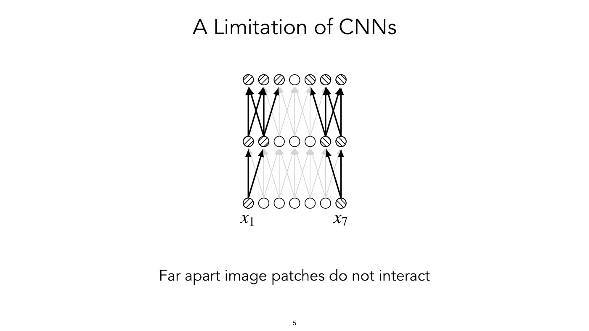

*Slide 5 — A two-layer convolutional network with length-3 filters: the hatched units depend on x1 (left) or x7 (right), and no output unit depends on both. [Deck](https://ocw.mit.edu/courses/6-7960-deep-learning-fall-2024/mit6_7960_f24_lec8.pdf)*

A fully connected layer has the opposite property, as a student points out: every output neuron sees
every input, so information is aggregated globally at once. But a map from $\mathbb{R}^n$ to
$\mathbb{R}^n$ then has $n^2$ edges and $n^2$ parameters, "too compute heavy, too many parameters,
too much to learn" (≈6:11–6:57). Attention takes a middle road: "we'll look globally, but we'll look
sparsely globally. So when you get a new question, you'll just attend to the parts of the input signal
that matter" (≈6:57). Slides 6, 7 and 8 show it on the bird photograph. The image is faded except for
the regions attended to, and those change with the question: every bird for "How many birds are in
this image?" (slide 6), just the two birds being compared for the species question (slide 7), and a
patch of empty sky for "What's the color of the sky?" (slide 8). "It's exactly coming from the idea of
attention in the human brain … If your problem changes, you'll attend to different things"
(≈6:57–7:43).

## New idea 1: tokens

Slide 9 lists the three "key architectural innovations": tokens, attention and positional codes.
Tokens are "not really new, but sort of new". They are "a new name for what we actually saw in the
GNN lecture" (≈7:43).

### A token is a vector of neurons

Slide 11 defines it: "A **token** is just a vector of neurons." In the graph-net lecture these were
called "node attributes" or node "feature descriptors". What the new name adds is a connotation: "a
token is an encapsulated bundle of information; with transformers we will operate over tokens rather
than over neurons." The lecturer calls a token "a little encapsulated factor in my computational
graph … a little bundle of information that will all be processed in a modular fashion" (≈8:32). An
MLP operates on an array of neurons; "in transformers, we should always be thinking about the basic
data structure as an array of tokens" (≈9:18).

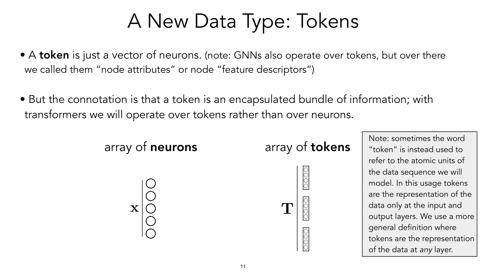

*Slide 11 — A New Data Type: Tokens. [Deck](https://ocw.mit.edu/courses/6-7960-deep-learning-fall-2024/mit6_7960_f24_lec8.pdf)*

He flags that this use of the word is not the standard one everywhere (slide 11's note box, ≈9:18–10:04).
In natural language processing, a token usually means a discrete unit of the vocabulary being modelled,
such as a letter or a word, and so exists only at a network's input and output. The course uses the
more general sense, common in computer vision, in which tokens are "the representation of the data at
*any* layer": "I prefer to think of the tokens as the chunks of information that you are factorizing
your problem into" (≈10:04).

Slides 11, 12 and 13 put an array of neurons beside an array of tokens: a column of each on slide 11,
a two-dimensional grid of each on slide 12, and on slide 13 an unordered *set* of each. Just as a
ConvNet runs over an array of neurons, a convolution could run over an array of tokens ("that would
just be like multi-channel convolution"), but "in transformer land, the main thing we operate over is
actually sets, as opposed to arrays" (≈10:50–11:35).

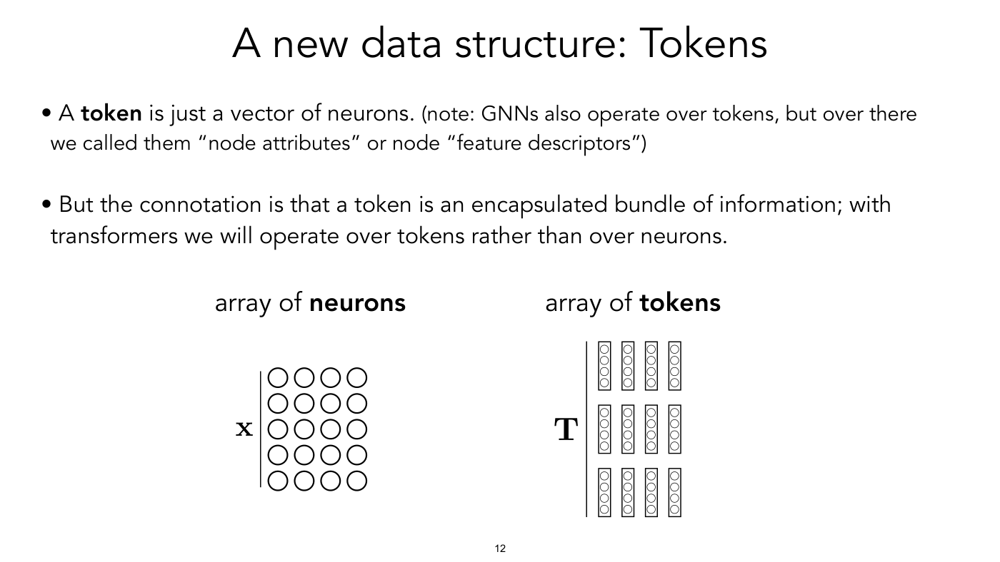

*Slide 12 — A new data structure: Tokens. [Deck](https://ocw.mit.edu/courses/6-7960-deep-learning-fall-2024/mit6_7960_f24_lec8.pdf)*

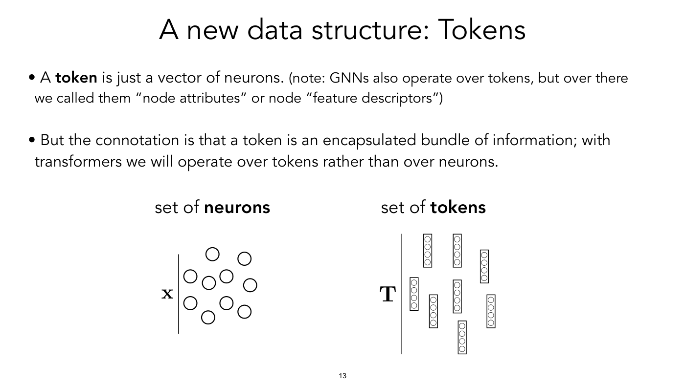

*Slide 13 — A new data structure: Tokens. [Deck](https://ocw.mit.edu/courses/6-7960-deep-learning-fall-2024/mit6_7960_f24_lec8.pdf)*

### Tokenizing the data

The recipe has two steps: "First, the domain expert turns data into tokens, and then generic
transformer processes tokens" (≈12:22). This is offered as a reason transformers are so widespread:
"they're very agnostic to the domain … In basically all domains where deep learning is applied that I
know of, I think transformers are currently the most popular way of doing it, or at least the most
performant way of doing it" (≈11:35).

For an image (slide 14), the standard way is to break the image into patches and turn each patch into
a token by flattening its pixel values into one long vector and multiplying it by a matrix
$\mathbf{W}_ {\text{tokenize}}$ to get a token $\mathbf{t} \in \mathbb{R}^d$. The matrix "could be a
learned matrix, or it could be somehow hard-coded" (≈12:22–13:08). The slide's two bullets contrast
the views. Over *neurons*, the input is an array of scalar-valued measurements such as pixels; over
*tokens*, it is an array of vector-valued measurements.

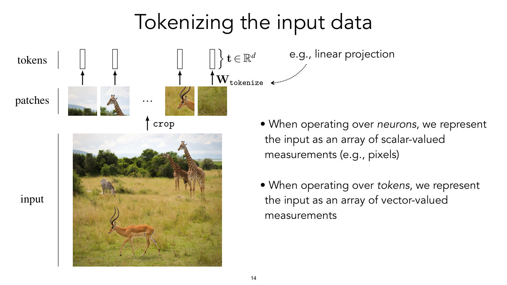

*Slide 14 — Tokenizing the input data. [Deck](https://ocw.mit.edu/courses/6-7960-deep-learning-fall-2024/mit6_7960_f24_lec8.pdf)*

Three student questions follow. Tokens generally all have the same size. Variable-size tokens "could be
really interesting" as a project, though they would be harder to map onto the hardware, and "another
idea of transformers is that they just match really, really well to the GPU hardware and the software
that we use" (≈13:08–13:56). Image patches in standard architectures do not overlap, though they could,
with a stride as in a ConvNet (≈13:56–14:42). And the patches are just pixels: "you flatten the patch
into just a list of numbers … And then you project that into a whatever dimensionality you want"
(≈14:42).

Slide 15: "You can tokenize anything. General strategy: chop the input up into chunks, project each
chunk to a vector." It shows the image diagram again beside text and audio. The chunks should "make
sense as the units of your domain. So usually that means local chunks, because locality is a very good
inductive bias" (≈14:42–15:29). Images are cut into non-overlapping patches. Language is cut into **byte
pairs**, short snippets of words learned for the language (the slide's example splits "Three
guineafowl." into chunks such as "[Th][re]"), and there might be "a byte pair that represents T-H, and
there might be a byte pair that represents I-N-G" (≈15:29–16:14). Sound is chopped into snippets, much
as an image is. "Once you have done that, then everything else is domain agnostic. So this is the only
part where you have to actually consider your input domain", apart from the loss function and other
formulation choices (≈16:14).

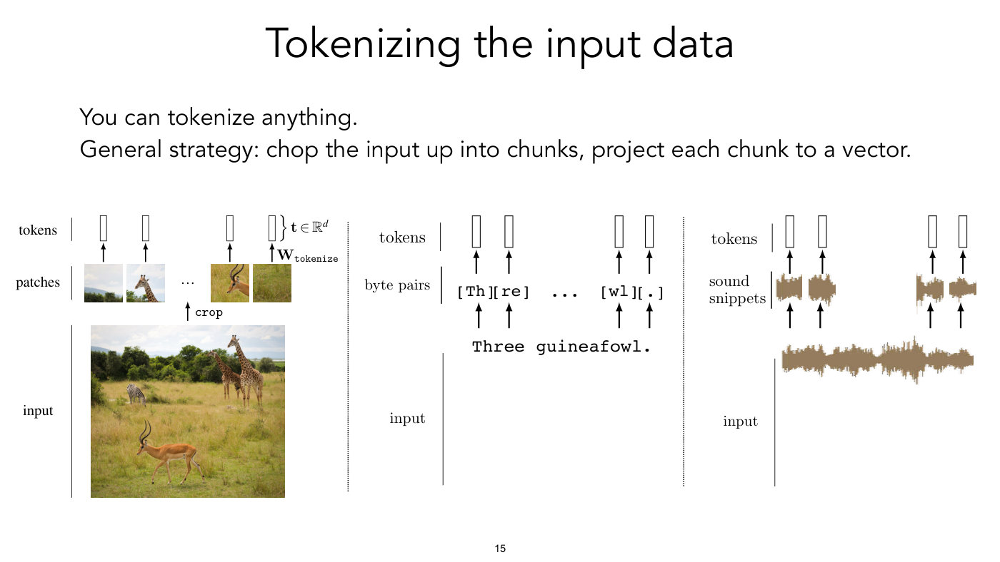

*Slide 15 — Tokenizing the input data. [Deck](https://ocw.mit.edu/courses/6-7960-deep-learning-fall-2024/mit6_7960_f24_lec8.pdf)*

### Notation

Slide 16 fixes the notation. Each token $\mathbf{t}_ i$ is a column vector; transposing the tokens and
stacking them as rows gives the matrix $\mathbf{T}$, with $N$ tokens down the side and $d$ channels
across. "It will turn out that actually the ordering is going to not matter", so a set of tokens can
be written as this matrix too, and "that will simplify a lot of the math" (≈16:14–16:59). All tokens
have the same dimension $d$; with different dimensions "the notation will become more complex. And
you'd have to do some more bookkeeping" (≈16:59).

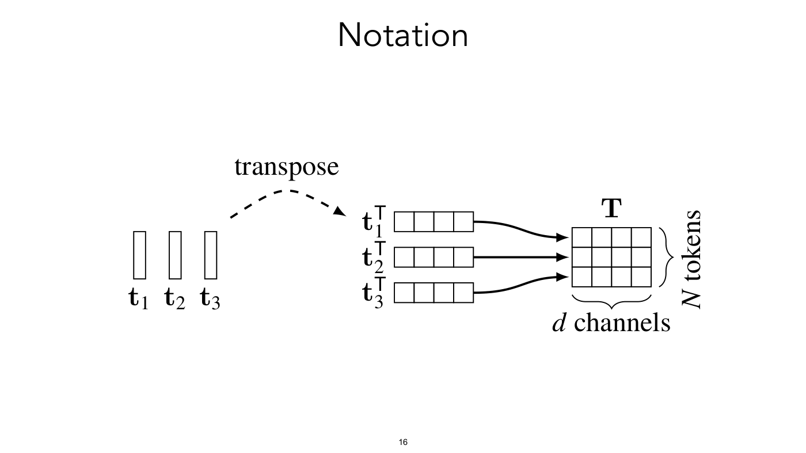

*Slide 16 — Notation. [Deck](https://ocw.mit.edu/courses/6-7960-deep-learning-fall-2024/mit6_7960_f24_lec8.pdf)*

## Token nets

Networks built from tokens have "two basic operations", just as MLPs do: a linear combination and a
unit-wise nonlinearity (≈16:59–17:47).

### Linear combination of tokens

Slide 17 sets the two linear combinations side by side. Over neurons, the output is a weighted sum of
scalars:

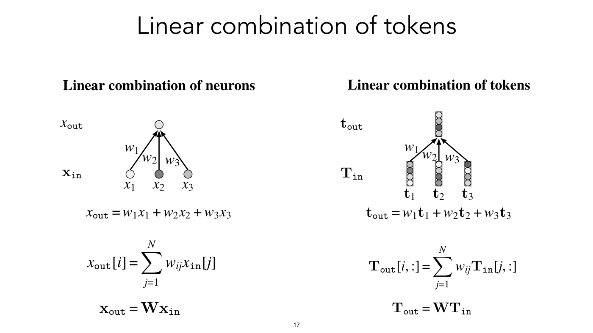

*Slide 17 — Linear combination of tokens. [Deck](https://ocw.mit.edu/courses/6-7960-deep-learning-fall-2024/mit6_7960_f24_lec8.pdf)*

$$x_{\text{out}} = w_1 x_1 + w_2 x_2 + w_3 x_3, \qquad \mathbf{x}_ {\text{out}} = \mathbf{W} \mathbf{x}_ {\text{in}}.$$

Over tokens, it is a weighted sum of whole vectors, each scaled by a single weight:

$$\mathbf{t}_ {\text{out}} = w_1 \mathbf{t}_ 1 + w_2 \mathbf{t}_ 2 + w_3 \mathbf{t}_ 3, \qquad \mathbf{T}_ {\text{out}}[i, :] = \sum_ {j=1}^{N} w_{ij} \mathbf{T}_ {\text{in}}[j, :], \qquad \mathbf{T}_ {\text{out}} = \mathbf{W} \mathbf{T}_ {\text{in}}.$$

Multiplying $\mathbf{T}$ on the left by $\mathbf{W}$ takes linear combinations of its rows (≈17:47–18:34).
This is less expressive than a linear combination of all the neurons inside the tokens. With three
tokens of four neurons each there are only three weights, where "you normally would have 12 weights if it
were just a linear combination of neurons". It is "a low rank transformation over the neurons" (≈19:20).

### Token-wise nonlinearity

The counterpart of the ReLU is a nonlinearity that "operates on each token independently and
identically" (slide 18, ≈20:06). An MLP's pointwise nonlinearity applies a ReLU to each entry; a
token-wise nonlinearity applies one function $F_\theta$ to each token, the same function every time:

$$\mathbf{x}_ {\text{out}} = \begin{bmatrix} \text{relu}(x_{\text{in}}[0]) \cr \vdots \cr \text{relu}(x_{\text{in}}[N-1]) \end{bmatrix}, \qquad \mathbf{T}_ {\text{out}} = \begin{bmatrix} F_\theta(\mathbf{T}_ {\text{in}}[0, :]) \cr \vdots \cr F_\theta(\mathbf{T}_ {\text{in}}[N-1, :]) \end{bmatrix}.$$

(Slide 18 indexes from 0 here.) "F is typically an MLP", so "transformers are like a meta architecture.
Like, the units of the architecture are other neural networks" (≈20:06–20:52). The slide adds that this
is "Equivalent to a CNN with 1x1 kernels run over token sequence", and slide 19 draws it: one block
$F_\theta$ applied to each token in a row (≈20:52–21:37). See
[multilayer perceptrons](multilayer-perceptron.md).

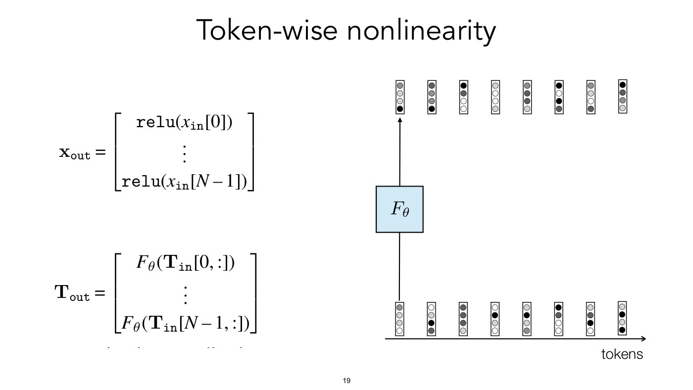

*Slide 19 — Token-wise nonlinearity. [Deck](https://ocw.mit.edu/courses/6-7960-deep-learning-fall-2024/mit6_7960_f24_lec8.pdf)*

### Token nets, MLPs and graph nets

Putting the two operations together gives what the lecturer calls **token nets**: "Another name for
this would be graph nets. But I'm going to call it token nets for now, which is almost identical
looking to a MLP" (≈21:37). Slide 21 draws the two side by side. A neural net alternates "linear comb
of neurons" with "neuron-wise nonlinearity"; a token net alternates "linear comb of tokens" with
"token-wise nonlinearity", and each arrow of the token-wise layer "is itself parameterized by an MLP".
"The motif is the same. It's just over these more complicated units" (≈21:37–22:24).

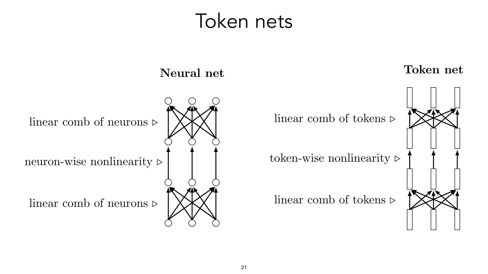

*Slide 21 — Token nets. [Deck](https://ocw.mit.edu/courses/6-7960-deep-learning-fall-2024/mit6_7960_f24_lec8.pdf)*

Slide 22 then places a GNN beside the token net. It is the same wiring, with AGGREGATE where the token
net has its linear combination and COMBINE (the update) where it has its token-wise nonlinearity. One
difference is weight sharing across depth. GNNs often share weights across layers ("may be shared
weights", the slide notes), while transformers typically do not, "but you can" (≈22:24–23:09). Slide
23 recalls the unrolled GNN from [lecture 5](05-architectures-graphs.md).

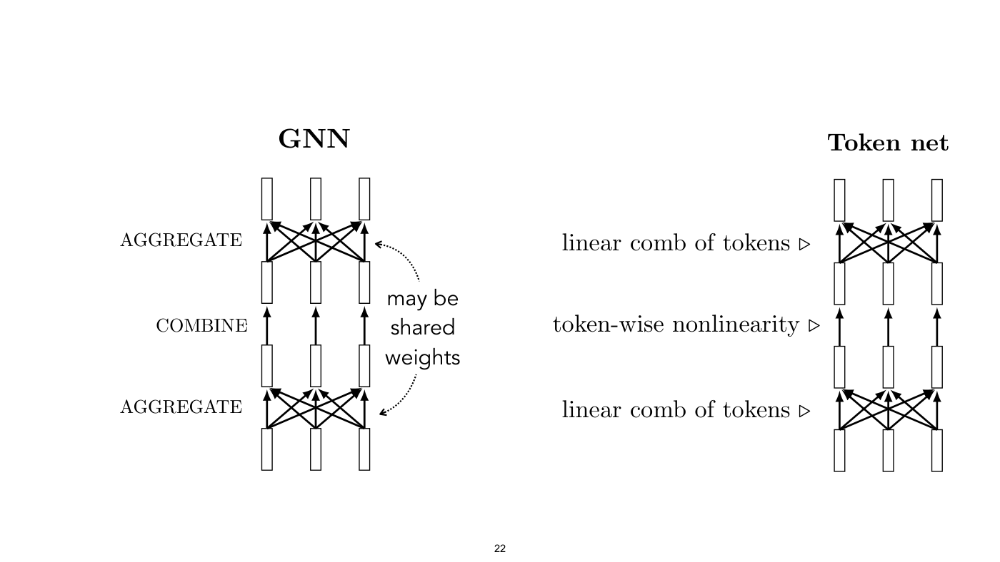

*Slide 22 — A GNN beside the token net: the same wiring, with AGGREGATE and COMBINE where the token net has linear combinations and a token-wise nonlinearity. [Deck](https://ocw.mit.edu/courses/6-7960-deep-learning-fall-2024/mit6_7960_f24_lec8.pdf)*

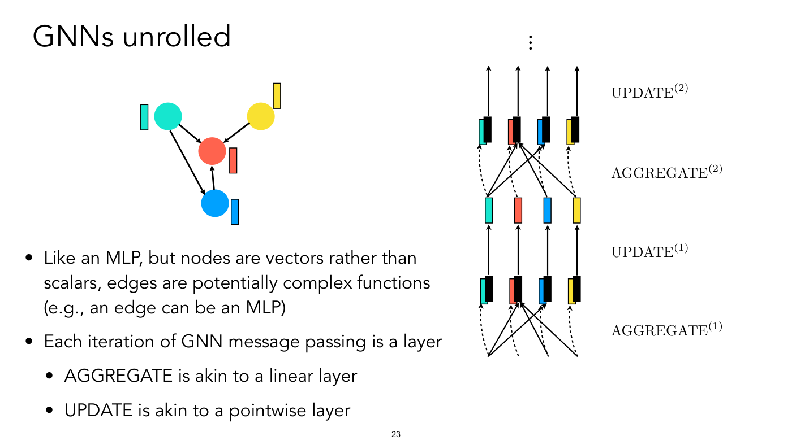

*Slide 23 — GNNs unrolled. [Deck](https://ocw.mit.edu/courses/6-7960-deep-learning-fall-2024/mit6_7960_f24_lec8.pdf)*

The critical difference is how the aggregation is decided. "In the GNN, how we aggregate is determined
by the graph connectivity. It's the adjacency matrix of the graph that tells us … where the arrows are
in that linear combination." A GNN's aggregate can also be nonlinear (≈23:09–23:55). A transformer has
all the arrows at every aggregation layer: slide 24, "Transformers may be viewed as Graph Neural
Networks over fully-connected graphs", draws a dense graph of eleven nodes, meant to read as fully connected. "I'll tell
you how those arrows' values get determined, which is going to be called attention. But you can think
of it as a graph net over a fully connected graph, typically without weight-sharing in depth"
(≈23:55). See [graph neural networks](graph-neural-networks.md).

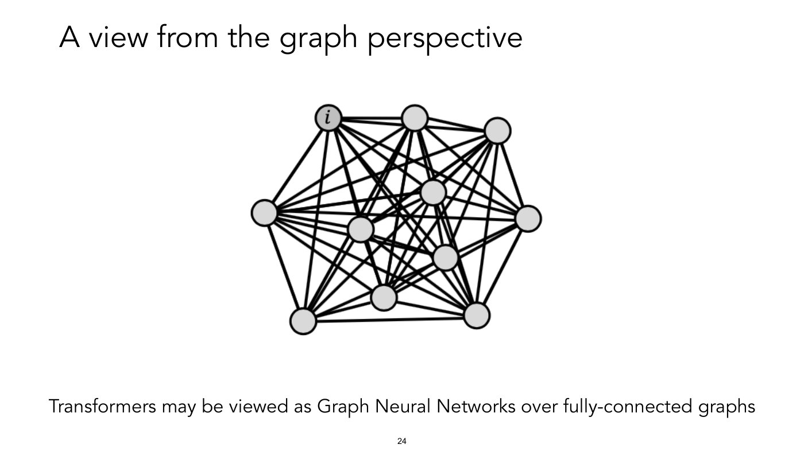

*Slide 24 — A transformer seen as a graph net on a fully connected graph, drawn as a dense graph of eleven nodes. [Deck](https://ocw.mit.edu/courses/6-7960-deep-learning-fall-2024/mit6_7960_f24_lec8.pdf)*

Students asked about the token-wise MLP. Its parameters are learned by backpropagation, and it has
pointwise nonlinearities of its own inside: "it's like this network of subnetworks" (≈24:42). In an
MLP the pointwise nonlinearity "is not learned, typically. But in a transformer, it typically is
learned. It's a parameterized MLP", as a graph net's update function typically is (≈25:28). And on
the names: "it doesn't matter if you call something a graph net or a transformer. You should
understand the concepts and how there's these particular building blocks that can be combined in
different ways … the names are just something that is secondary to that" (≈26:16).

## New idea 2: attention

Attention answers "how do we take the linear combination exactly between tokens?" (≈26:16). Slide 26
compares two layers that map input tokens $\mathbf{t}_ {\text{in}}$ to an output token. In a
fully connected (`fc`) layer, the weights $\mathbf{W}$ of the combination are free parameters, drawn
in blue, learned by backpropagation like an MLP's. In an attention (`attn`) layer, they are an
attention matrix $\mathbf{A}$, drawn in red, "our color for activations": the weights "are going to be
coming from activations elsewhere in the network" (≈27:02–27:49). In the slide's words, "W is free
parameters. A is a function of some input data. The data tells us which tokens to attend to (assign
high weight in weighted sum)":

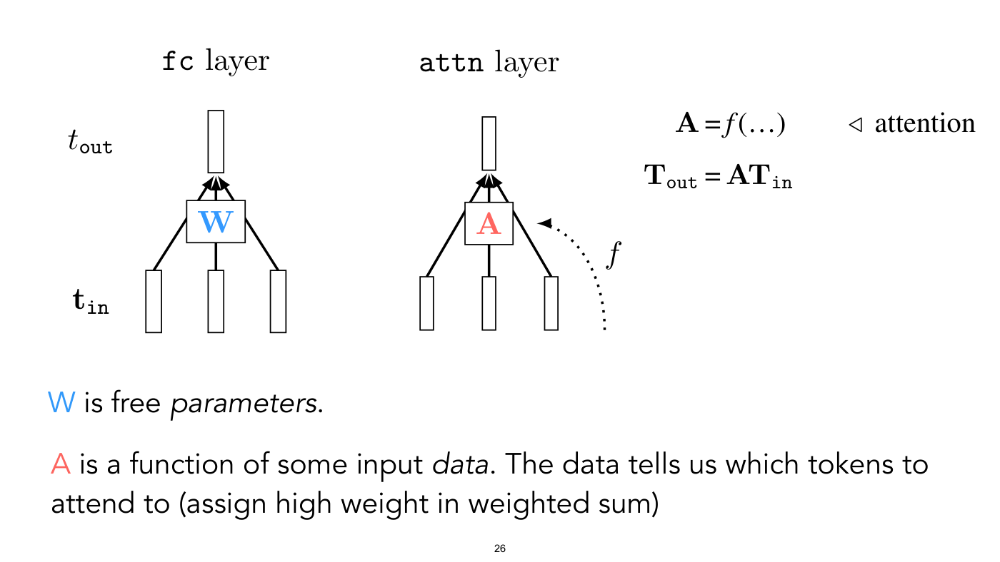

*Slide 26 — An fc layer's weights W are free parameters (blue); an attention layer's A is computed from the data by a function f (red). [Deck](https://ocw.mit.edu/courses/6-7960-deep-learning-fall-2024/mit6_7960_f24_lec8.pdf)*

$$\mathbf{A} = f(\ldots), \qquad \mathbf{T}_ {\text{out}} = \mathbf{A} \mathbf{T}_ {\text{in}}.$$

### Two questions about one photograph

Slide 27 poses a question about a savannah photograph with two giraffes, a zebra and an impala, cut
into patches that are the tokens (≈28:34), and slide 28 answers two questions by attention. For the query "How many animals are in the photo?", the
model should attend to every patch containing an animal. Suppose one entry of each token is an
indicator of whether the patch contains an animal's head ("because each animal has one head"). If
attention puts a weight of 1 on each head patch and 0 elsewhere, the weighted sum is a token whose
entry for that indicator is 4, the answer (≈29:20–30:08). The lecturer adds that the summed entry
"could be a 1 no matter what's in the photo, because the attention already only selected to look at
the animal heads" (≈30:08). For "What is the color of the impala?", the model attends to the impala's
patches and averages a colour entry of their tokens, "a good ensembled response" (≈30:08–30:56). "This
is just the intuition, but hand constructing how these operations could actually answer queries of
interest." Asked about the output, he explains that here it is a single token answering the question;
in general it is an array $\mathbf{T}$ of tokens (≈30:56–31:43).

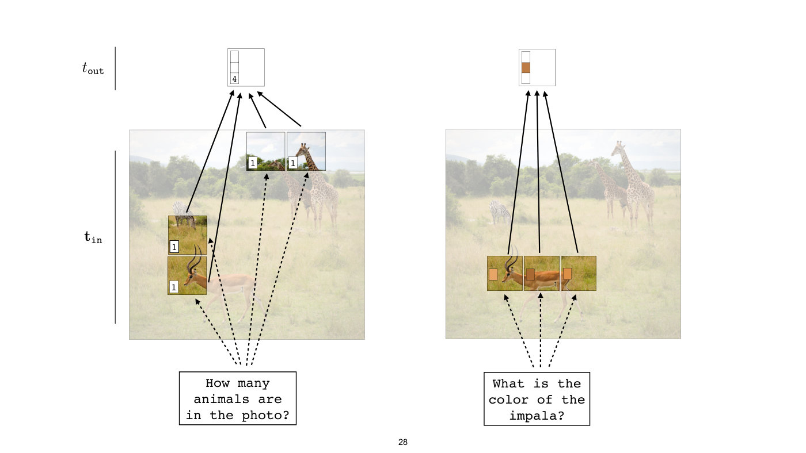

*Slide 28 — One photo attended two ways: four animal patches summed to count 4, and the impala's patches combined to read out its colour. [Deck](https://ocw.mit.edu/courses/6-7960-deep-learning-fall-2024/mit6_7960_f24_lec8.pdf)*

### Query-key-value attention

Slide 29 gives "the most common kind of attention", **query-key-value attention** (≈31:43). The input
is a set of tokens, here image patches, and the question is a token too. Each is turned into three
vectors by learned linear maps:

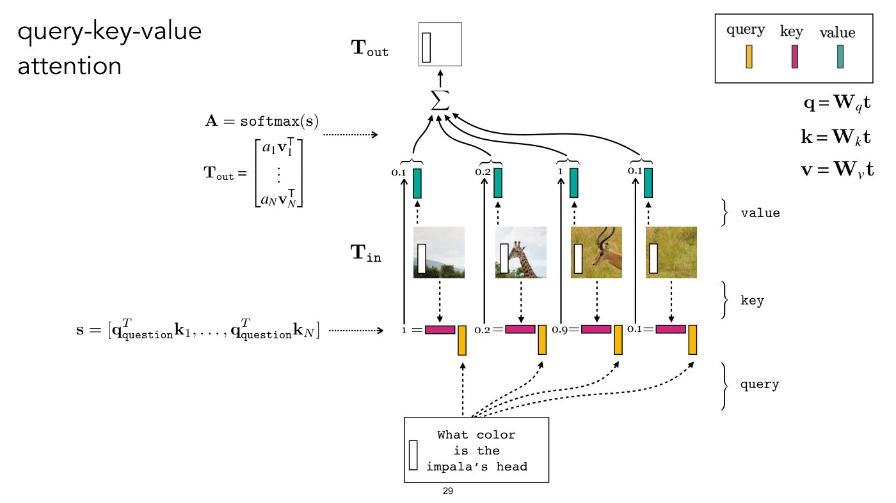

*Slide 29 — Query-key-value attention: the question's query is dotted with each patch's key, the softmaxed scores weight the values, and their sum is the output token. [Deck](https://ocw.mit.edu/courses/6-7960-deep-learning-fall-2024/mit6_7960_f24_lec8.pdf)*

$$\mathbf{q} = \mathbf{W}_ q \mathbf{t}, \qquad \mathbf{k} = \mathbf{W}_ k \mathbf{t}, \qquad \mathbf{v} = \mathbf{W}_ v \mathbf{t}.$$

The question's **query** says what to look for. Each token's **key** is "something that the query is
meant to try to match against", and whether a query matches a key is checked with a dot product, "like
the matrix product of the 1 by D vector times the D by 1 vector" (≈32:30–33:17). For "What color is
the impala's head", a key matches better on an animal head, and best on the impala's head (≈34:03). The
dot products make a score vector

$$\mathbf{s} = [\mathbf{q}_ {\text{question}}^{T} \mathbf{k}_ 1, \ldots, \mathbf{q}_ {\text{question}}^{T} \mathbf{k}_ N],$$

and a softmax normalizes it "so it sums to 1", giving the attention weights $a_1, \ldots, a_N$
(≈35:36):

$$\mathbf{A} = \text{softmax}(\mathbf{s}), \qquad \mathbf{T}_ {\text{out}} = \begin{bmatrix} a_1 \mathbf{v}_ 1^{\mathsf{T}} \cr \vdots \cr a_N \mathbf{v}_ N^{\mathsf{T}} \end{bmatrix}.$$

The output is "a weighted combination of the value vectors of each token" (≈35:36): each token's
**value** is "what I'm going to report to the next layer of my network" (≈34:50). The names come from
databases. "Each bin in my big database … can say, here's the key, here's the relevant information I
contain. And then when the query matches the key, you open that part of the database, that bin in the
filing cabinet, and you pull out the values" (≈34:50). The slide shows the summation $\Sigma$ of the
weighted values producing $\mathbf{T}_ {\text{out}}$. (Its stacked $a_i \mathbf{v}_ i^{\mathsf{T}}$ are
what that sum adds up.) The learnable parameters of an attention layer are just the three projections
(≈36:22, ≈37:55).

The slide's numbers are illustrative, and one of them is a typo. Its four key-query scores read 1, 0.2,
0.9 and 0.1 (the 1 under the sky patch, the 0.9 under the impala), and the weights printed above the values
read 0.1, 0.2, 1 and 0.1, which do not sum to 1. When a student asked
whether the first score of 1 meant a perfect match, the lecturer said "That looks like a typo. Sorry.
So it's 0.1 up here. And I think I forgot to make it 0.1 down there" (≈39:27), so the first score
should be 0.1.

The questions on this slide (≈36:22–40:15) brought out several points. Text and images have separate
tokenizers; the attention layer works on whatever tokens come out of them. If the query comes from a
daytime image and the keys from a night-time one, learning has to bridge the gap. The dot product
between key and query measures "how relevant is this key to this query", and a trained system arrives
at projections that make an impala-head query similar to impala-head keys. And the query function is
"just a learnable matrix, $\mathbf{W}_ Q$. But it could be other functions … It could be an MLP"; the
linear projection is simply the standard choice in transformers.

### Self-attention

In **self-attention** the queries come from the signal itself, not from an external question: "every
single token in the set of tokens I'm processing can emit queries to the other tokens" (≈41:01). Slide
30 shows one impala patch, $\mathbf{t}_ 2$, attending to three patches that include itself and summing
them into a new $\mathbf{t}_ 2$. The intuition: a patch unsure whether it is "an impala or … a gazelle"
can attend to things that look like it and update its representation "by aggregating information from
the other things that are similar" (≈41:01–41:48). In general it "might be learning very complicated
ways of processing information in the signal".

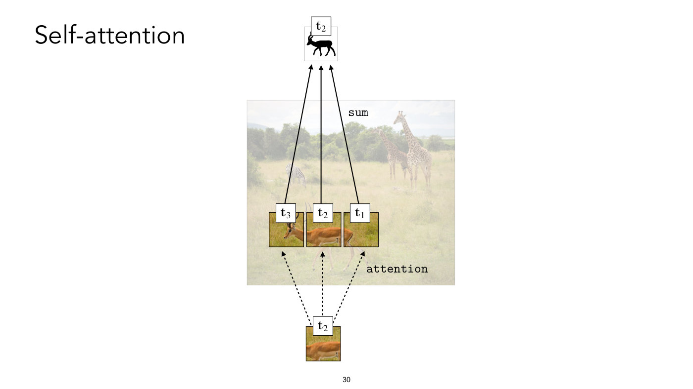

*Slide 30 — Self-attention. [Deck](https://ocw.mit.edu/courses/6-7960-deep-learning-fall-2024/mit6_7960_f24_lec8.pdf)*

Slide 31, "Attention maps in a trained transformer", shows four video frames from DINO (Caron et al.,
2021): a ship at sea, a mountain biker, a bulldog and a horse. In the lecture it was a video of each
token's self-attention to every other token: "the horse token attends to the horse patches. So it's
solving the segmentation problem … I shouldn't cross object boundaries" (≈41:48–42:36). The figure is
excluded from OCW's licence, and the PDF has only the plain frames, a single image with no attention
overlay drawn on it; the recording is the record of what was shown.

How does attention know what to attend to? "That's just machine learning. That's just backpropagation
to minimize your objective." The solution it finds "often has an intuitive interpretation like I'm
giving you, but it doesn't have to"; recognition could instead attend to the background and infer the
context (≈43:22). Asked whether this behaviour always happens or can be forced, the lecturer called it
"more empirical science … it's not provable. It's a property of the data and the statistics of the
world in combination with the optimization and the transformer architecture". Interpretability research
asks what transformers learn and what their circuits are like. The other lens is ML theory, which asks
how gradient descent on high-capacity networks reaches good solutions without caring about the
internal structure (≈44:09–44:55).

### The self-attention layer

Slide 32 redraws the comparison for a whole layer, an `fc` layer with blue weights $\mathbf{W}$
between all input and output tokens, and slide 33 a `self attn` layer in which the red $\mathbf{A}$ is computed
by a function $f$ of the input tokens $\mathbf{T}_ {\text{in}}$ themselves (≈44:55). Slide 34 expands it.
Every input token emits a query, a key and a value, "via $\mathbf{W}_ Q$, which is a projection from
its token vector into a query vector", and likewise for keys and values. Stacking them as rows gives

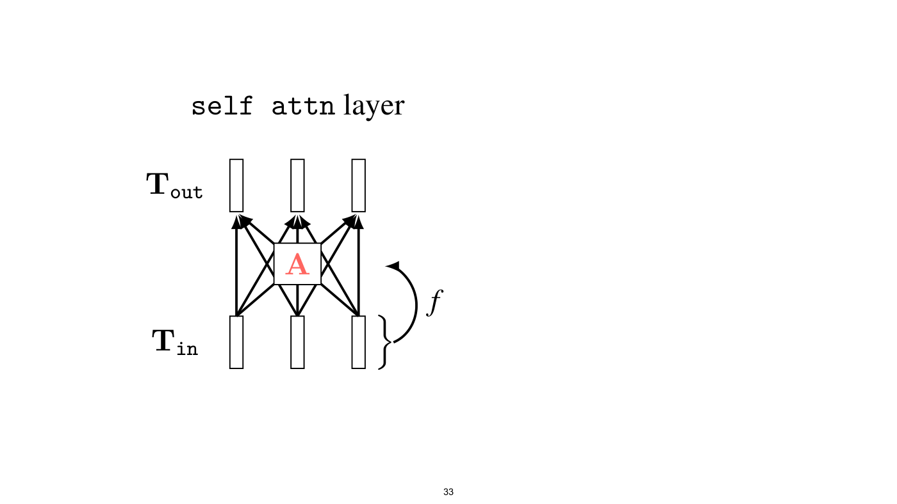

*Slide 33 — The self-attention layer: the attention matrix A is computed by f from the input tokens themselves. [Deck](https://ocw.mit.edu/courses/6-7960-deep-learning-fall-2024/mit6_7960_f24_lec8.pdf)*

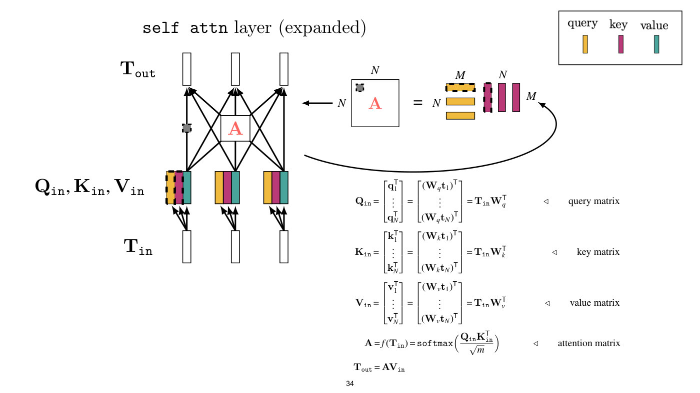

*Slide 34 — The self-attention layer expanded: every token emits a query, a key and a value, and each entry of A comes from one query and one key. [Deck](https://ocw.mit.edu/courses/6-7960-deep-learning-fall-2024/mit6_7960_f24_lec8.pdf)*

$$\mathbf{Q}_ {\text{in}} = \begin{bmatrix} \mathbf{q}_ 1^{\mathsf{T}} \cr \vdots \cr \mathbf{q}_ N^{\mathsf{T}} \end{bmatrix} = \begin{bmatrix} (\mathbf{W}_ q \mathbf{t}_ 1)^{\mathsf{T}} \cr \vdots \cr (\mathbf{W}_ q \mathbf{t}_ N)^{\mathsf{T}} \end{bmatrix} = \mathbf{T}_ {\text{in}} \mathbf{W}_ q^{\mathsf{T}},$$

and $\mathbf{K}_ {\text{in}} = \mathbf{T}_ {\text{in}} \mathbf{W}_ k^{\mathsf{T}}$,
$\mathbf{V}_ {\text{in}} = \mathbf{T}_ {\text{in}} \mathbf{W}_ v^{\mathsf{T}}$ in the same way (≈45:45–46:32).
"This is another nice thing about the design of transformers is everything just becomes these matrix
multiplies in a very simple, notational form" (≈46:32). The weight with which output token $i$ draws on
input token $j$ is the dot product of query $i$ with key $j$, so all of them together are the matrix
product of the queries with the transposed keys, an $N \times N$ matrix: "I'll have n input tokens to n
output tokens" (≈47:18–48:05). The slide's diagram highlights one entry of $\mathbf{A}$ and the query
and key it comes from. Then comes "the famous attention equation":

$$\mathbf{A} = f(\mathbf{T}_ {\text{in}}) = \text{softmax}\left( \frac{\mathbf{Q}_ {\text{in}} \mathbf{K}_ {\text{in}}^{\mathsf{T}}}{\sqrt{m}} \right), \qquad \mathbf{T}_ {\text{out}} = \mathbf{A} \mathbf{V}_ {\text{in}}.$$

The scores are divided "by the square root of the dimensionality of the vectors", where the queries,
keys and values have a dimension of their own that need not equal the tokens' $d$. The softmax ensures
"everything sums to 1. So that has some nice normalization and numerical advantages" (≈48:05–48:51).
"So it's a lot of little nitty-gritty linear algebra to work out. But it comes to a very simple equation
in the end." The slide's formula writes the dimension as a lowercase $m$, while its diagram labels the
query and key matrices $N \times M$.

**Why not learn $\mathbf{A}$ directly?** A student asked why queries and keys are learned separately
rather than the attention matrix itself (≈48:51–49:39). The lecturer's first answer is empirical: "the
transformer recipe … just seems to work the best at so many different things", and he did not know of
a direct comparison. His second is a parameter count. Learning $\mathbf{A}$ directly would mean $n^2$
parameters for $n$ tokens, dependent on the sequence length, while $\mathbf{W}_ Q$, $\mathbf{W}_ K$ and
$\mathbf{W}_ V$ depend only on the token dimension. Modern language models process "maybe like length
million sequences of tokens … So n is usually very large, and D is much smaller. So there's actually
fewer learnable parameters. That's just one perspective" (≈50:25–51:13).

A related question asked whether language and vision should not be processed differently (≈51:13).
Specialization is of interest, he said, but "the power of the transformer and the transformer paradigm
is only put in domain knowledge into the first step, plus a few other places, like in positional
encoding". Everything else is a generic framework, so that "everything runs on the same commodity
hardware. The code bases are all the same. The lessons are transferable between different modalities
… It's just a trade-off" (≈51:59).

## A family of linear layers

"The attention layer is, at the end of the day, just a linear combination" (≈52:45), so slide 35 sets
it beside the other linear layers the course has met, each as a wiring graph, a matrix (colours mark
the distinct values) and its properties.

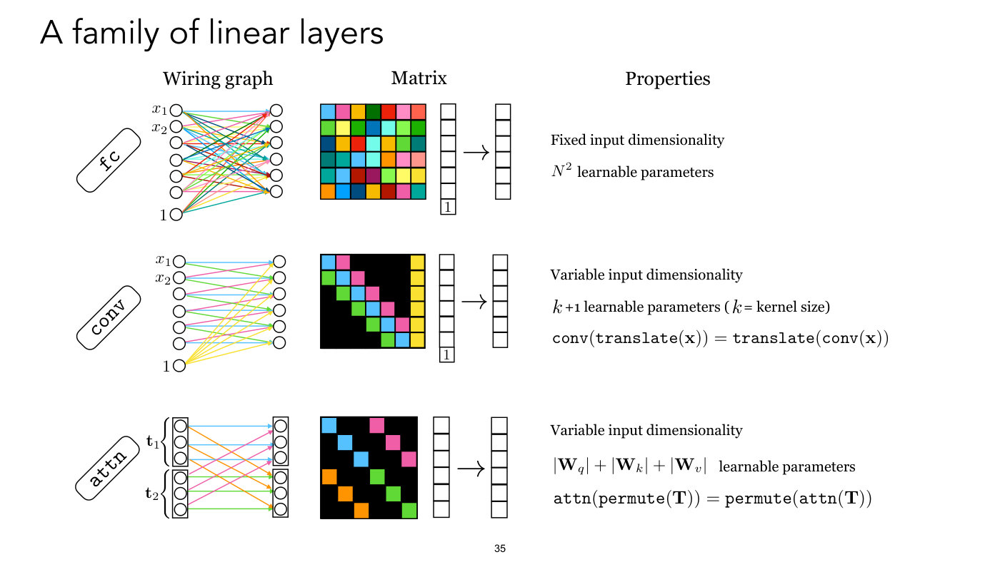

*Slide 35 — Fully connected, convolutional and attention layers as wiring graphs and matrices, with colours marking the distinct weights. [Deck](https://ocw.mit.edu/courses/6-7960-deep-learning-fall-2024/mit6_7960_f24_lec8.pdf)*

- **fc** (fully connected): every edge is a learned parameter, so the matrix has no repeated values;
  "Fixed input dimensionality" and $N^2$ learnable parameters. The lecturer counts $n^2$ weights plus
  $n$ biases for a map from $\mathbb{R}^n$ to $\mathbb{R}^n$ (≈52:45).
- **conv**: the matrix is Toeplitz, with "the diagonals all share the same value", so a kernel of size 3
  has "only four learnable parameters if we include the bias" (≈52:45–53:31). The slide gives "Variable input
  dimensionality", $k + 1$ learnable parameters for a kernel of size $k$, and translation equivariance,
  conv(translate(x)) = translate(conv(x)), which "comes because of this weight sharing" (≈53:31).
- **attn**: two tokens of three neurons each. Because a linear combination of tokens uses one weight for
  every element of a token, the matrix is made of diagonal blocks: "using the same set of weights for
  each element of the token vector" (≈55:04). The slide gives "Variable input dimensionality",
  $\lvert \mathbf{W}_ q \rvert + \lvert \mathbf{W}_ k \rvert + \lvert \mathbf{W}_ v \rvert$ learnable
  parameters, and permutation equivariance, attn(permute($\mathbf{T}$)) = permute(attn($\mathbf{T}$)).

Before revealing the attention row, the lecturer asked what it would look like. A student guessed "not
going to necessarily look sparse, but it should be low rank"; he answered "it will be low rank … I
think it does look sparse", and "it's not like you were wrong" (≈54:18). His summary: "it's just like
this low-rank sparse transformation. It has fewer … learnable parameters, which is advantageous in some
ways", and its weights are supplied by "another mechanism on the side", the queries and keys
(≈55:04–55:49). See [convolution](convolution.md) for the Toeplitz view.

## The transformer

Slide 36 puts the MLP beside the "vanilla" transformer. The MLP alternates `linear` and neuron-wise
`relu`; the transformer alternates `self attn` and a token-wise `MLP`. "This is roughly the standard
architecture we use in computer vision. The architecture we use in language processing has one small
difference", which comes at the end of the lecture (≈55:49).

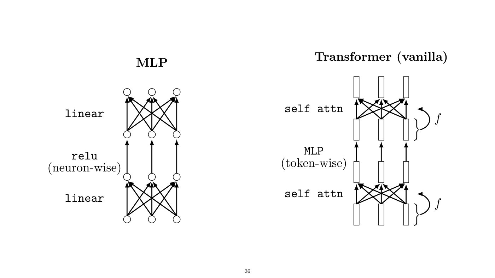

*Slide 36 — An MLP beside the vanilla transformer: self-attention where the MLP has linear layers, a token-wise MLP where it has the ReLU. [Deck](https://ocw.mit.edu/courses/6-7960-deep-learning-fall-2024/mit6_7960_f24_lec8.pdf)*

**Multihead self-attention** (slide 37) gets only a mention: "I think I won't talk about multi-headed
self-attention. It's in the reading" (≈55:49). Its idea: "Rather than having just one way of attending,
why not have k? Each gets its own parameterized query(), key(), value() functions. Run them all in
parallel", and "one can learn to attend to shapes and one can learn to attend to textures, for example"
(≈56:35). The slide's equations run $k$ attention layers, place their outputs side by side, and multiply
by a matrix that maps back to $d$ channels:

$$\mathbf{T}_ {\text{out}}^{i} = \text{attn}^{i}(\mathbf{T}_ {\text{in}}) \quad \text{for } i \in \lbrace 1, \ldots, k \rbrace, \qquad \mathbf{T}_ {\text{out}} = \bar{\mathbf{T}}_ {\text{out}} \mathbf{W}_ {\text{MSA}},$$

where row $n$ of $\bar{\mathbf{T}}_ {\text{out}} \in \mathbb{R}^{N \times kv}$ places the $k$ heads'
row $n$ side by side, and $\mathbf{W}_ {\text{MSA}} \in \mathbb{R}^{kv \times d}$ (the dimension $kv$ is
printed without a definition of $v$).

### The vision transformer block

Slide 38 is "the complete vision transformer architecture … the standard way of processing spatial
signals", for images and also for audio (≈56:35). One block, repeated $L$ times, applies a **token
norm**, multihead self-attention (MSA), another token norm and a token-wise MLP, with a **residual
connection** around each of the two halves (the circled pluses). The learnable parameters, in blue, are
the queries, keys and values and the token-wise MLP; "Everything else is not" (≈56:35–57:23). The
residual connections recall ResNets from the CNN lecture, "an identity pass around all this processing"
([skip connections](skip-connections.md)).

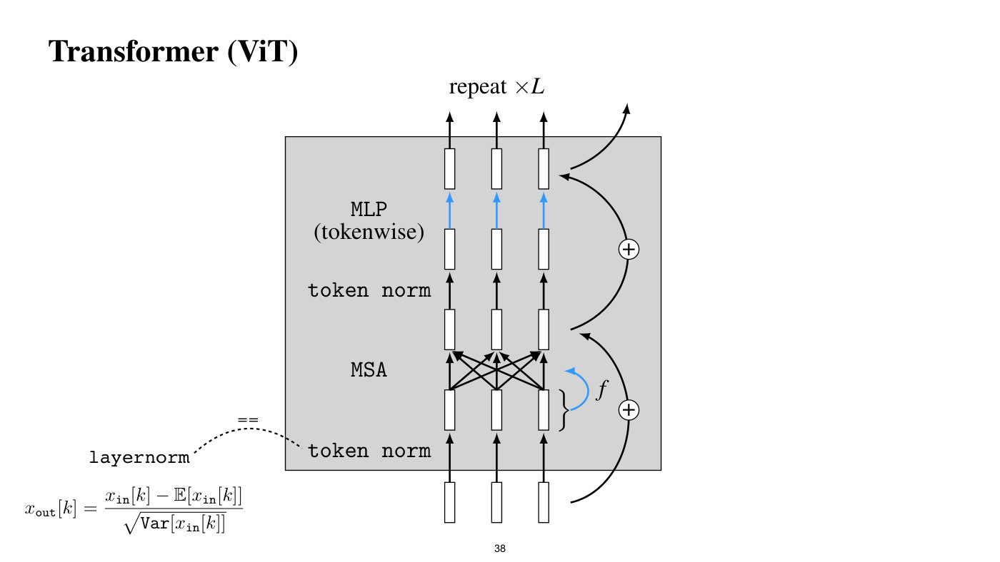

*Slide 38 — The vision transformer block, repeated L times: token norm, multihead self-attention, token norm and a token-wise MLP, with a residual connection around each half. [Deck](https://ocw.mit.edu/courses/6-7960-deep-learning-fall-2024/mit6_7960_f24_lec8.pdf)*

The token norm "is often more commonly called in the literature LayerNorm". It normalizes each token
vector "to have zero mean and unit variance" (≈57:23). The slide writes it for the entries of a token as

$$x_{\text{out}}[k] = \frac{x_{\text{in}}[k] - \mathbb{E}[x_{\text{in}}[k]]}{\sqrt{\text{Var}[x_{\text{in}}[k]]}}.$$

(The lecturer says "dividing by the variance"; the formula divides by its square root.) He connects it
to [lecture 7](07-scaling-rules-for-optimization.md): "it's good to normalize activations and weight
updates in your network for a lot of reasons … for stability of optimization and taking the steepest
descent direction, you need to think about the norms". Layer norm normalizes activations rather than
updates, "but you can understand that normalizing activations will have a consequence on changing the
size of the weight updates", because backpropagating through the normalization makes the weight update
"a function of the scale of the activations" (≈58:09–58:56). "Exactly what those are is basically open science. And it's not quite clear why
LayerNorm is right thing to do, but it's what people do" (≈58:56). See [norms](norms.md) and
[scaling rules](scaling-rules.md).

### The code

Slide 39 is pseudocode for the whole vision transformer, "just to show you how simple these things are.
They're so easy to implement" (≈58:56):

```python
# tokenize input image
T = tokenize(x,K) # 3 x H x W image --> N x d array of token code vectors

# run tokens through all L layers
for l in range(L):

    # attention layer
    Q, K, V = nn.matmul(nn.layernorm(T),[W_q_T[l], W_k_T[l], W_v_T[l]])
    # nn.matmul does matrix multiplication
    A = nn.softmax(nn.matmul(Q,K.transpose()), dim=0)/sqrt(d)
    T = nn.matmul(A,V) + T # note residual connection

    # tokenwise mlp
    T = mlp[l](nn.layernorm(T)) + T # note residual connection
```

Its comments define `x` as the RGB image, `K` as the tokenization patch size, `d` as the
token/query/key/value dimensionality ("setting these all as the same"), `L` as the number of layers,
`W_q_T`, `W_k_T`, `W_v_T` as the transposed projection matrices and `mlp` as the token-wise MLPs. "For
each layer, we're just going to run the same operation. We might have different weights per layer, but
otherwise the same operation … So everything is just matmuls and a few other simple operators. And this
maps wonderfully onto modern compute that loves matrix multiplies" (≈59:41–1:00:29). Two things in the
listing are as printed: `K` names both the patch size and the key matrix, and the division by `sqrt(d)`
sits outside the softmax call, where slide 34's formula has it inside. The problem set implements the
real thing (below).

## New idea 3: positional encoding

Positional encodings are "not a new idea … but it was one of the key things that made transformers
stand out" (≈1:00:29).

### Transformers are permutation equivariant

Slide 41 shows why they are needed. Permuting the input tokens permutes the outputs in the same way:
"So transformers are essentially a set-to-set mapping. An unordered set maps to an unordered set. The
ordering of the tokens doesn't matter" (≈1:01:16). The slide labels it "Set2Set":

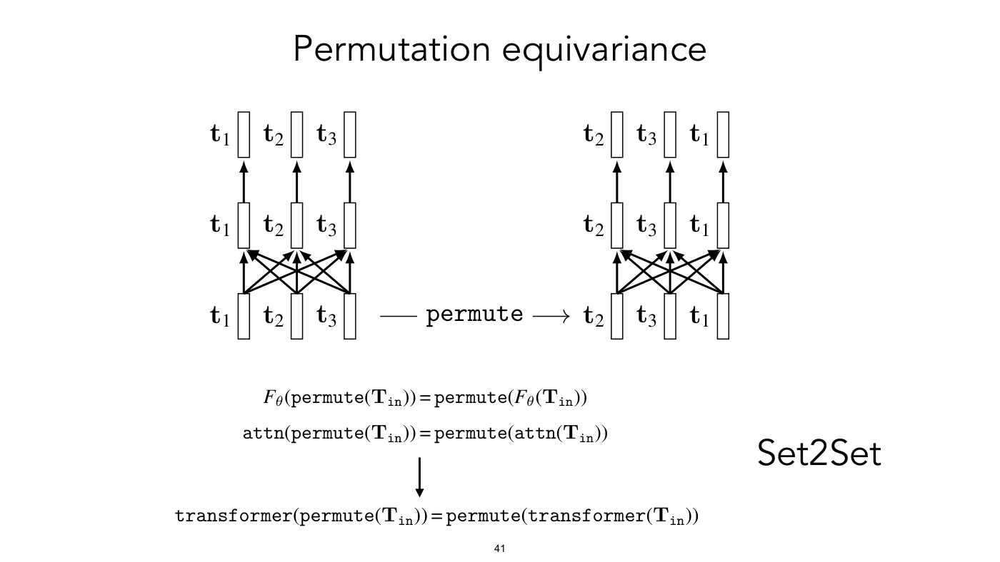

*Slide 41 — Permuting the input tokens permutes the outputs in the same way: a transformer is a set-to-set map. [Deck](https://ocw.mit.edu/courses/6-7960-deep-learning-fall-2024/mit6_7960_f24_lec8.pdf)*

$$F_\theta(\text{permute}(\mathbf{T}_ {\text{in}})) = \text{permute}(F_\theta(\mathbf{T}_ {\text{in}})),$$

$$\text{attn}(\text{permute}(\mathbf{T}_ {\text{in}})) = \text{permute}(\text{attn}(\mathbf{T}_ {\text{in}})),$$

and so the same holds for the whole transformer. The token-wise nonlinearity treats each token
independently and identically, and in attention "how much they attend to each other will just be
determined based on the values in the token vectors, not the order" (≈1:01:16–1:02:02). (The lecturer
says "attention is permutation invariant" here; the slide, and his next sentence about the whole
transformer, say equivariant.) This is the same symmetry as graph nets'
([graph neural networks](graph-neural-networks.md)).

### Telling each token where it came from

Often the order matters. "If I'm processing a sentence … the earlier words in the sentence are causally
determining the next words, but there's not quite the anti-causal direction. The statistics are
different" (≈1:02:48). The fix is the one lecture 4 used to stop a ConvNet being translation
equivariant: tell the filter where it is. Slide 42 recalls it for a filter ("What if you *don't* want to
be shift invariant?": use an architecture that is not shift invariant, such as an MLP, or "Add location
information to the *input* to the convolutional filters — this is called **positional encoding**").
Slide 43 does the same for tokens: use an architecture that is not permutation invariant, or "Add
location information to the token code vectors". Each token is concatenated with a code for "What
position was it in the input sentence? What location was it in the input image?" (≈1:02:02–1:02:48). See
[neural fields and positional encoding](neural-fields-and-positional-encoding.md).

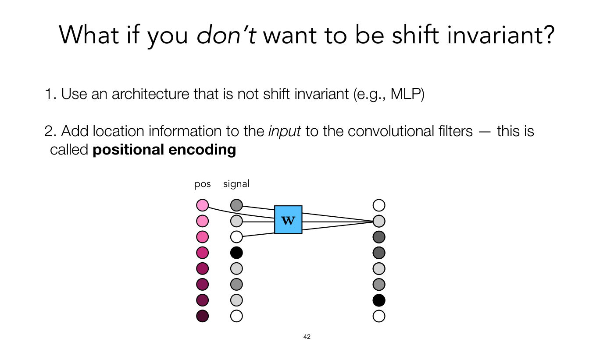

*Slide 42 — Lecture 4's positional encoding recalled: the filter sees a position input beside the signal. [Deck](https://ocw.mit.edu/courses/6-7960-deep-learning-fall-2024/mit6_7960_f24_lec8.pdf)*

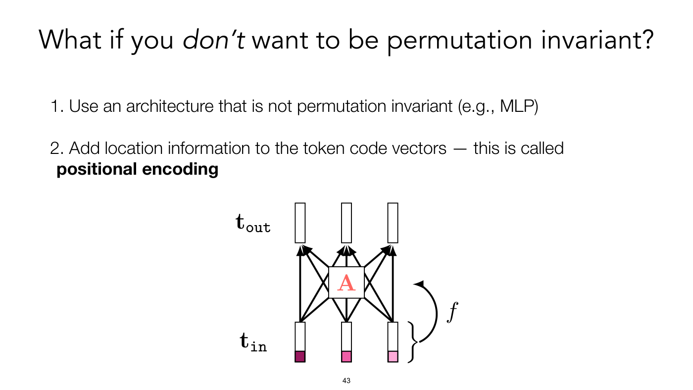

*Slide 43 — The same for tokens: a position code added to each token before self-attention. [Deck](https://ocw.mit.edu/courses/6-7960-deep-learning-fall-2024/mit6_7960_f24_lec8.pdf)*

**Fourier positional codes** (slide 44) are "the vanilla way of doing that. There's a lot of more
advanced ways of doing it" (≈1:02:48). Rather than give a patch its Cartesian $x, y$ coordinates, the
code records the value of sines of different frequencies at that location, $\sin(x)$, $\sin(x/B)$,
$\sin(x/B^2)$, $\sin(x/B^3)$, $\sin(x/B^4)$ and the same in $y$, collected into a vector $\mathbf{p}$
(≈1:03:33). "The book chapter goes into some intuition about why Fourier positional encoding is
advantageous over other types. But this is also an open science question. This one works pretty well"
(≈1:03:33–1:04:18).

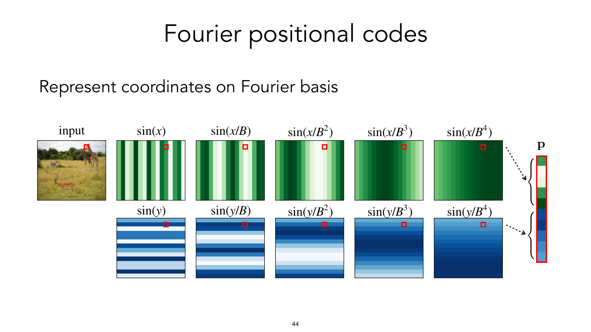

*Slide 44 — Fourier positional codes: sines of decreasing frequency in x (green) and y (blue), read at one location into the vector p. [Deck](https://ocw.mit.edu/courses/6-7960-deep-learning-fall-2024/mit6_7960_f24_lec8.pdf)*

### Positional encodings carry the domain knowledge

The positional encoding is where a domain expert says "what it means to be local for your domain. You
give it the inductive bias of what locality actually represents" (≈1:04:18). The deck shows three
examples:

- **Scale** (slide 45): ScaleMAE "uses ground sample distance positional encoding to train an MAE across
  spatial scales of remote sensing data". Its figure compares satellite images at 10 m and 0.3 m ground
  sample distance; the ground-sample-distance encoding varies with absolute scale, an ordinary one only
  with pixel resolution. The figure is excluded from OCW's licence.
- **The globe** (slide 46): "for processing data on a globe, I can do positional encoding that's like
  latitude and longitude, but maybe on some kind of Fourier basis over spherical harmonics, over
  sinusoids on the sphere" (≈1:04:18). The slide is Rußwurm et al.'s geographic location encoding with
  spherical harmonics and sinusoidal representation networks.
- **Graphs** (slide 47): "one of the typical positional encodings is onto the eigenbasis of the graph
  Laplacian", as lecture 5 mentioned (≈1:04:18–1:05:05). The slide colours two molecules by Laplacian
  eigenvectors (Kreuzer et al.). "The first eigenvector … is really smooth. It's like, where am I
  globally? And then other eigenvectors are, like, high frequency, almost like a Fourier basis" (≈1:05:05).

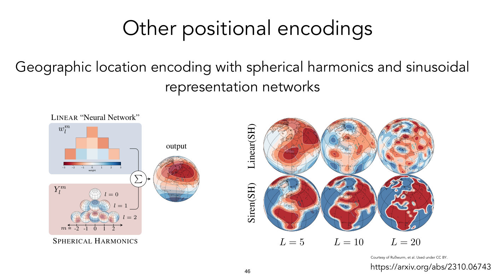

*Slide 46 — Positions on the globe encoded with spherical harmonics (Rußwurm et al.). [Deck](https://ocw.mit.edu/courses/6-7960-deep-learning-fall-2024/mit6_7960_f24_lec8.pdf)*

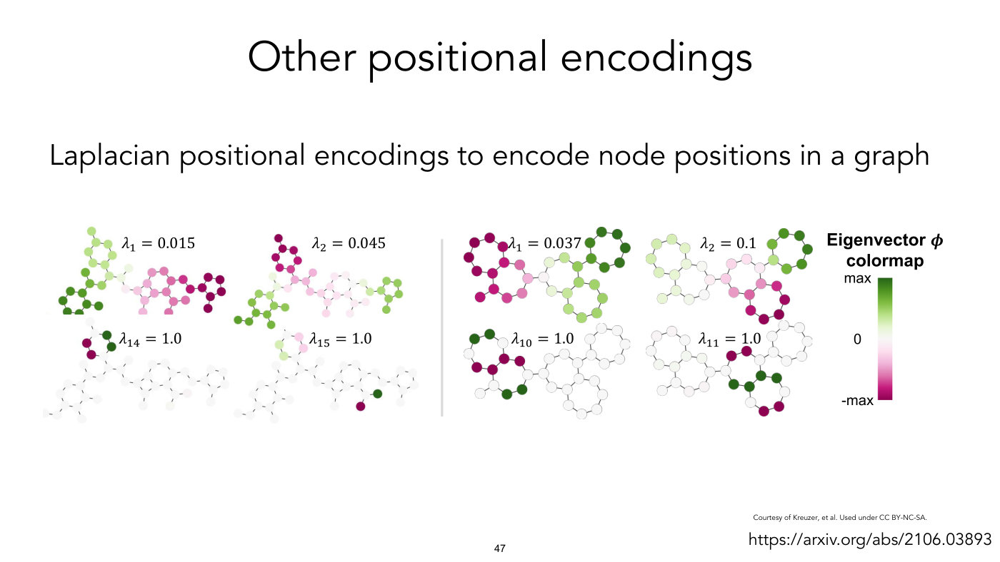

*Slide 47 — Two molecules coloured by eigenvectors of the graph Laplacian, used as positional encodings (Kreuzer et al.). [Deck](https://ocw.mit.edu/courses/6-7960-deep-learning-fall-2024/mit6_7960_f24_lec8.pdf)*

"This is all domain knowledge. It's not stuff that you need to know intimately, unless you're working on
that domain. But this is just to say you can introduce a lot of domain knowledge into positional
encodings" (≈1:05:51). See [inductive bias](inductive-bias.md).

## Transformers for language: autoregression and causal attention

The last idea is what makes a transformer a language model: **causal attention** (≈1:05:51).
Autoregressive and generative models come back later in the course; this is the brief version.

**Autoregressive models** (slide 48): "You take a sequence of words and you simply try to predict what
is the next word in that sequence", then append the prediction to the input and repeat, "Now predict the
next word and the next word … This is how ChatGPT works" (≈1:06:38). The slide's predictor fills
"Once upon ___" with "time", and also "Once ___ a time" with "Upon": "you don't have to do
autoregression in time's arrow order. You can do it in any order you want. But that's just a detail"
(≈1:07:25). Slide 49 sets out training and sampling. The training set is sequences and their next
words ("Once upon a" → "time", "To be or not to" → "be"), which "is just text online for language
models", and a learner uses supervised learning "to classify what is the next word in a vocabulary of
possible words". At test time the trained predictor continues "Colorless green ideas sleep", perhaps
with "furiously", "a quote from Noam Chomsky" (≈1:07:25).

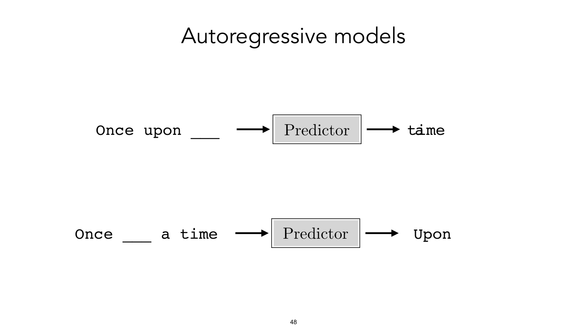

*Slide 48 — Autoregressive models. [Deck](https://ocw.mit.edu/courses/6-7960-deep-learning-fall-2024/mit6_7960_f24_lec8.pdf)*

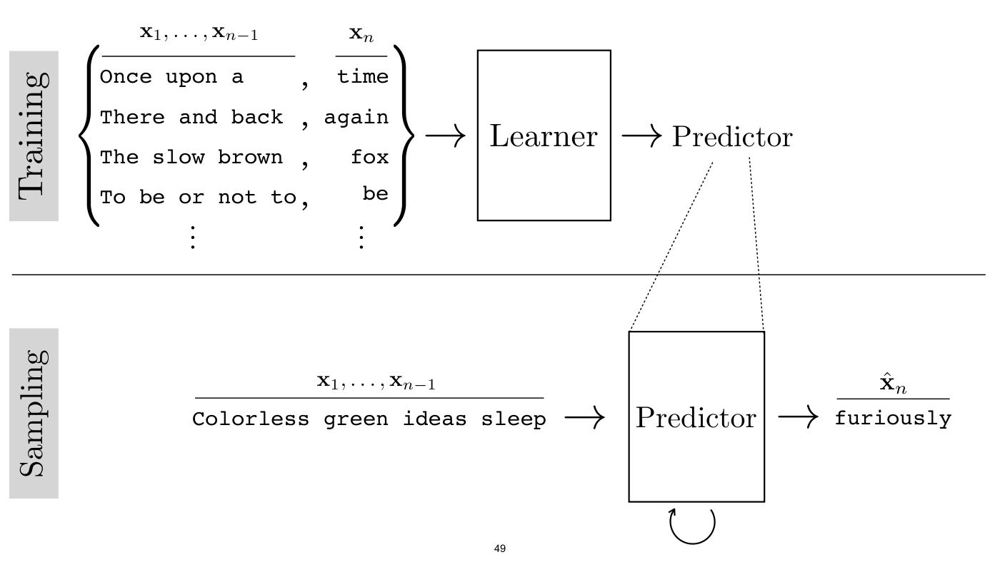

*Slide 49 — Training on pairs of a sequence and its next word, then sampling by feeding each prediction back in. [Deck](https://ocw.mit.edu/courses/6-7960-deep-learning-fall-2024/mit6_7960_f24_lec8.pdf)*

**GPT** (slide 50) "is Generative Pre-trained Transformer. So it's a transformer. And it's an
autoregressive transformer" (≈1:08:17). The input tokens attend to one another, update their
representations, and at the end produce a prediction for the next item; to continue, shift the input
over by one and run it again.

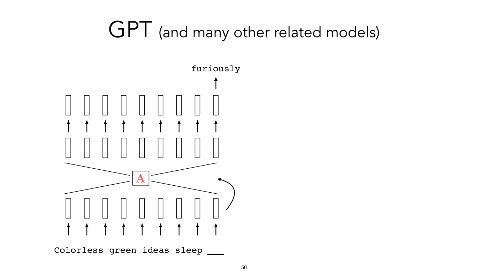

*Slide 50 — GPT (and many other related models). [Deck](https://ocw.mit.edu/courses/6-7960-deep-learning-fall-2024/mit6_7960_f24_lec8.pdf)*

**Causal masking** (slide 51). Trained this way, the network could cheat: if the input contains the word
"furiously", "it could just learn an identity connection to say, oh, I'm predicting 'furiously'". The
prediction for a word may depend only on the words before it: "I can't look into the future if I want to
be able to write a sentence in time's order" (≈1:09:03). So the attention matrix is masked: "every
output token can only attend to earlier tokens in the sequence. So the order does matter. This is no
longer permutation equivariant" (≈1:09:03–1:09:49). Masked entries are set to zero, so "some of the
arrows are not allowed"; the slide's time-index diagram (each output sees only earlier inputs) matches
the masked matrix drawn beside it (≈1:09:49).

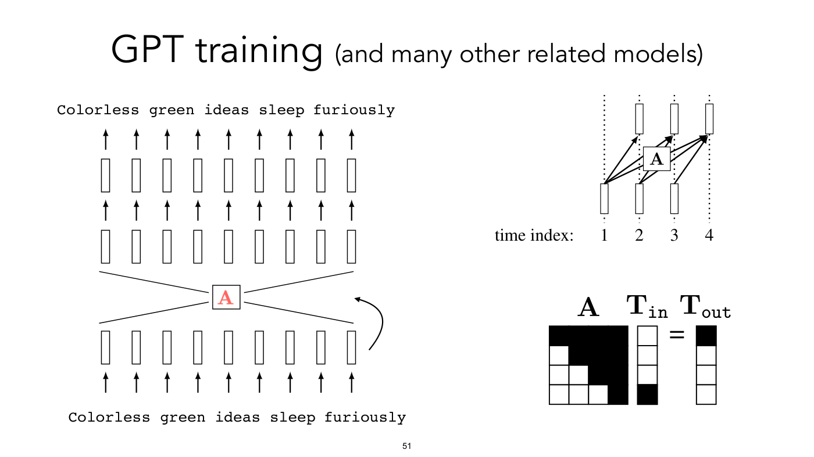

*Slide 51 — GPT training with a causal mask: each output may attend only to earlier inputs, as the masked attention matrix shows. [Deck](https://ocw.mit.edu/courses/6-7960-deep-learning-fall-2024/mit6_7960_f24_lec8.pdf)*

Slide 52 stacks two such layers. "On the first layer, I am trying to predict the fourth item in the
sequence given the previous three. So I will not observe the fourth item, because otherwise I would be
cheating", and after the first layer "every token attends to itself and all the previous tokens"
(≈1:09:49–1:10:38). The receptive field of each output then covers only earlier words, so the whole
output sequence can be supervised at once, each word depending only on the words before it: "this is an
efficient way of training such a system" (≈1:10:38).

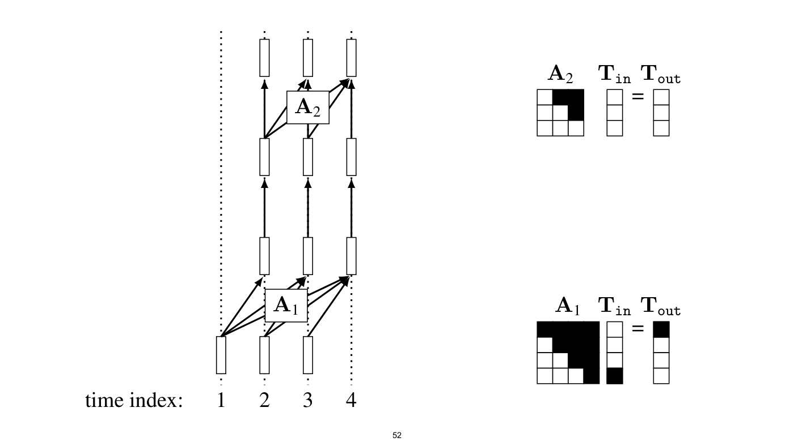

*Slide 52 — Causal attention over two layers, with the two masked attention matrices. [Deck](https://ocw.mit.edu/courses/6-7960-deep-learning-fall-2024/mit6_7960_f24_lec8.pdf)*

## "Attention Is All You Need"

Slide 53 shows the first page of Vaswani et al.'s "Attention Is All You Need" and its architecture
figure. "This is just probably the worst diagram in all of science, but it's also the best paper in all
of science. So it's like they balance each other out" (≈1:11:27). It is "the one that defined the
transformer architecture. Again, it's not new ideas — it's just a particular recipe that is novel in its
details, but works incredibly well, and a few new ideas here and there". The lecturer maps its parts onto
the lecture's (≈1:11:27–1:12:15). The "Feed Forward" box is the token-wise nonlinearity, annotated on
the slide "token-wise MLP (a.k.a. 1x1 conv)". The masked attention over "Outputs (shifted right)", greyed
out on the slide as "specific to autoregressive modeling", "has nothing to do with really transformers.
That's more about autoregressive modeling", combined with them in that first paper. "Positional Encoding"
is "meant to be like a sinusoid positional encoding", and of the "Add & Norm" boxes, "that's just the
residual connection". "I definitely prefer
this diagram instead", he says of slide 38's (≈1:12:15). For language, "I would just shift the input to
the left and do causal attention" (≈1:13:02). The figure is excluded from OCW's licence.

## Image-to-text: cross-attention

Slide 54 combines the pieces into an image-captioning model, "Image-to-text architecture
(autoregressive)" (≈1:13:02). An **image encoder** tokenizes patches of a photograph and processes them
with self-attention, "all generic processing of tokens now". A **text decoder** then writes the caption
autoregressively. Each step attends causally to the words written so far ("A yellow bird" predicting
"yellow bird sitting") and, through **cross-attention**, to the image tokens. "Cross-attention is just
referring to when you are having these tokens attend to these tokens, which are not themselves. They're
like a different set of tokens. So you can have all different types of attention-masking strategies. And
this one is popular for image-to-text captioning" (≈1:13:49). The lecture ends there: "We'll come back to
generative models and autoregressive models a little bit later."

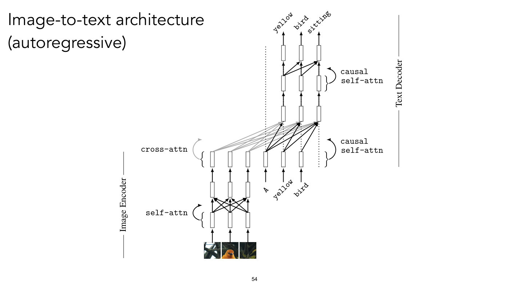

*Slide 54 — Image to text: the decoder attends causally to its own words and, through cross-attention, to the image tokens. [Deck](https://ocw.mit.edu/courses/6-7960-deep-learning-fall-2024/mit6_7960_f24_lec8.pdf)*

## The problem set

"The problem set coming out next week, you're going to implement a bunch of transformers and all the
variations. It'll implement GPT … It's a little bit more of a practical problem set" (≈40:15). On OCW
that is **Homework 3**, whose problems are "RNNs versus transformers" (8 points), "Implementing a
Transformer" (11 points), "Vision Transformers" (6 points) and "DialogueGPT" (10 points), a small language
model with a causal attention mask; see [sources](../sources.md).

## See also

- [Transformers](transformers.md) — the concept page: tokens, attention, self-attention, the transformer
  block, positional encodings, causal masking and cross-attention.
- [Graph neural networks](graph-neural-networks.md) — a transformer is a graph net over a fully connected
  graph, with attention as its aggregation.
- [Convolution](convolution.md) — locality and its limit, the 1x1 convolution, and the Toeplitz matrix in
  the family of linear layers.
- [Neural fields and positional encoding](neural-fields-and-positional-encoding.md) — positional encodings
  on grids, on graphs and now on tokens.
- [Inductive bias](inductive-bias.md) — locality, permutation equivariance, and the positional encoding as
  the place for domain knowledge.
- [Skip connections](skip-connections.md) — the residual connections of the transformer block.
- [Multilayer perceptrons](multilayer-perceptron.md) — the token net as an MLP over vectors, and the
  token-wise MLP inside each block.
- [Lecture 5 — Architectures: Graphs](05-architectures-graphs.md), the previous architecture lecture.
