# Lecture 10 — Architectures: Memory

**Lecturer:** Sara Beery ·
**Video:** [youtube.com/watch?v=IiHknRHA-Gk](https://www.youtube.com/watch?v=IiHknRHA-Gk) (73 min) ·
**Slides:** [`mit6_7960_f24_lec10.pdf`](https://ocw.mit.edu/courses/6-7960-deep-learning-fall-2024/mit6_7960_f24_lec10.pdf)
(69 pages; the deck is titled "Lecture 10: Memory and sequence modeling"; transcribed slide by slide in [`raw/slides/10-architectures-memory.md`](../raw/slides/10-architectures-memory.md)) ·
**Transcript:** [`raw/transcripts/10-architectures-memory.md`](../raw/transcripts/10-architectures-memory.md)

## What this lecture establishes

This is the last of the course's "mini series" of architecture lectures, after CNNs, graph nets and
transformers, and it is about **memory and sequence modeling** (≈0:00). It starts from why a single
frame of video is not enough, and from the way a convolution over time forgets whatever falls outside
its window. The **recurrent neural network** (RNN) fixes that by carrying a hidden state forward from
step to step. Its recurrence $\mathbf{h}_ t = f(\mathbf{h}_ {t-1}, \mathbf{x}_ {\texttt{in}}[t])$ puts a
cycle in the computation graph, which is trained by unrolling it over a fixed window,
**backpropagation through time**. Unrolled, the same weight matrix is applied again and again, so
signals from far back are multiplied by its powers and **vanish or explode**. The **LSTM** is built to
avoid forgetting: a cell state that is passed on by default and changed only through learned,
multiplicative gates. The last part turns to **sequence models**: autoregressive prediction, the
factorization of a sequence's probability into next-token classifiers, a molecule-to-text model
trained with teacher forcing and decoded with beam search, and the alternatives to recurrence for long
memory (convolution and attention). It ends with how far back attention can reach, whether benchmarks
even need long context, and parameters and activations seen as slow and fast memory.

The lecturer calls the RNN "the first class of architectures that we talk about that's actually, quote,
unquote, Turing complete" and "the most general framework of the architectures that we're going to be
introducing" (≈0:46).

**Notation on this page** follows the slides. In the RNN part the input at time $t$ is
$\mathbf{x}_ {\texttt{in}}[t]$, the hidden state $\mathbf{h}_ t$ and the output $\mathbf{x}_ {\texttt{out}}[t]$.
$\mathbf{W}$ maps the previous hidden state to the next, $\mathbf{U}$ maps the input to the hidden
state, and $\mathbf{V}$ maps the hidden state to the output; $\mathbf{b}$ and $\mathbf{c}$ are biases
and $\sigma_1$, $\sigma_2$ nonlinearities. The LSTM part is derived from Chris Olah's blog post and uses
its plain notation instead: input $x_t$, hidden state $h_t$, cell state $C_t$, gates
$f_t$, $i_t$, $o_t$, weights $W_f, W_i, W_C, W_o$ and biases $b_f, b_i, b_C, b_o$.

The deck is titled "Lecture 10", matching the recording, but its outline slide is headed "11. Memory
and sequence modeling" (slide 2), as is the repeat of it at the end (slide 67), and the very last outline
is headed "9. Memory and sequence modeling" (slide 68). See the [course map](course-map.md#the-decks-lecture-pointers).

The lecture's outline is CNNs for sequences, RNNs, LSTMs, and sequence models and long memory
(slide 2).

## Why sequences

The lecture opens on one frame of a video, a classroom of small children (slide 3). From a single frame,
computer vision can already say a lot: it looks like "a kindergarten classroom" (slide 4); detectors can
find the objects in it, "television, person, chair" (slide 5); and a model can answer questions about
their attributes, "What color is the chair?" — "red" (slides 6–7). "But so far, none of the things that
we've talked about have really explicitly tried to understand, for example, relationships between things
and how we might predict into the future" (≈2:20). "What will the girl do next?" (slide 8) cannot be
answered from the frame, "because we also rely on temporal signal" (≈2:20).

Played as a video, the clip shows a chair being pulled out from under a girl as she sits down. At some
point "we're pretty sure that the kind of likely thing, which is that the girl sits in the chair, is not
going to happen because the guys moved the chair" (≈3:06). Predicting that she will fall, that she
believes the chair is there, and why, is "very complex and nuanced understanding about the scenes, the
objects, and things like intent". Whether sequence models really get at intent is arguable, "but they do
start to try to get at this sense of what is going to happen next" (≈3:54).

Sequences come in many forms (slide 9): video, "pictures from an Italian city square over time"; language,
"An evening stroll through a city square" as a sequence of words; and audio, the same phrase spoken
(≈3:54–4:41). Every photograph in this part of the deck (slides 3–12 and 14–19) is excluded from OCW's
licence and is described in the slide file only.

## CNNs for sequences

### The space–time cube

The convolutional networks of [lecture 4](04-architectures-grids.md) extend to video by stacking frames
into a space–time cube (slide 10), with axes $m$ and $n$ for the image and $t$ for time. It is drawn in
three dimensions "for simplicity. But actually, it's really four dimensions", because each pixel has red,
green and blue values: "time just becomes another spatial dimension in that tensor", which is now 4D
rather than 2D (≈4:41–5:27).

Slicing the cube shows temporal structure directly. A horizontal slice, one row of pixels through every
frame (slide 11), turns the walkers into diagonal stripes: "people walking, and walking at different
angles to the camera or with different trajectories or different speeds" (≈5:27). A vertical slice
(slide 12) shows "for a given position horizontally or vertically in the frame, who is going through that
position first". The lecturer notes that images of this kind were made long ago for Olympic finishes:
make the finish line a single pixel column over time, "and that represents the person who won the race"
(≈6:13).

### Convolution in time

In the simplest, scalar version, a convolution in time learns a weight over a fixed window, three
elements on slide 13, and slides it along the sequence, so it is "a sequence-to-sequence model". Unlike an
image, the sequence does not constrain it: "You can take any arbitrary length sequence and you can
generate an arbitrary length sequence", and a static camera filming a classroom could feed it forever
(≈6:59–7:46). With more dimensions (RGB video, MRI volumes over time, "hyperspectral satellite images that
can have something like 384 different bands") the same idea holds, "but now where time is potentially
this infinitely long dimension" (≈7:46–8:33). Slide 14 draws the 3D version, a small filter cube on the
space–time cube producing one entry of an output volume.

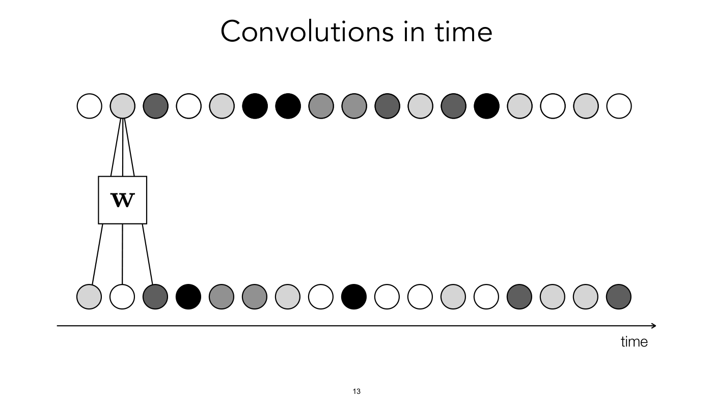

*Slide 13 — Convolution in time: one filter w computes each output from three neighbouring inputs. [Deck](https://ocw.mit.edu/courses/6-7960-deep-learning-fall-2024/mit6_7960_f24_lec10.pdf)*

### Why a convolution forgets

As the sequence grows, "it's hard for our memories of what happened at the beginning of the sequence to
persist" (≈8:33). Slides 15–18 make this concrete with the lecturer's cat, Frank, "who is the cutest cat in
the world". Walking around her house with a camera, the filter sees Frank early on (slide 15). Later, it is
"that same weight matrix", but "I don't really have, from this fixed time window, any inputs coming from
the beginning", so on an orange cat outdoors in the leaves it predicts "tiger, because it's orange and it's
outside, and cats are usually indoors" (slide 16, ≈9:20). A **memory unit** would give it context (slide
17): "Since I'm walking around my house, it's unlikely I'm going to see a tiger. But I did see Frank before,
so it's maybe still Frank" (slide 18, ≈10:05). Using what was seen earlier in the same sequence "is really
the intuition or the motivation behind the development of what we call recurrent neural networks"
(≈10:05).

## Recurrent neural networks

### The hidden state

"Transformers, CNNs, everything so far mostly had of fixed window in time." A transformer's context window
is getting very large, "but it's still fixed. But a recurrent neural network makes that infinite"
(≈10:51). It does so with a **hidden unit**: the model computes a value, learns to predict the output from
it, "But you also take that hidden unit, and you send it forward in time to the next time step". As it
moves through time, each step takes in "both that new temporal input and your memory from the past"
(slide 19, ≈10:51–11:37). On slide 19 the hidden circles change colour from step to step as the state is
updated.

Slides 20–21 draw the network as three rows (inputs, hidden, outputs) over time, with arrows up from each
input to its hidden unit, up from each hidden unit to its output, and across from each hidden unit to the
next. Its two equations are

$$\mathbf{h}_ t = f(\mathbf{h}_ {t-1}, \mathbf{x}_ {\texttt{in}}[t])$$

$$\mathbf{x}_ {\texttt{out}}[t] = g(\mathbf{h}_ t)$$

The next hidden state is "some function f that will depend on the previous hidden state and the current
input", and "that function, that's shared over time ... that's something that gets learned. And it's
independent of time what that function is". Likewise $g$, from the hidden state to the output, "is also
going to be shared over time" (≈12:23–13:09). The lecturer's running scalar example is a temperature
series: "predicting temperature in Boston tomorrow" (≈11:37).

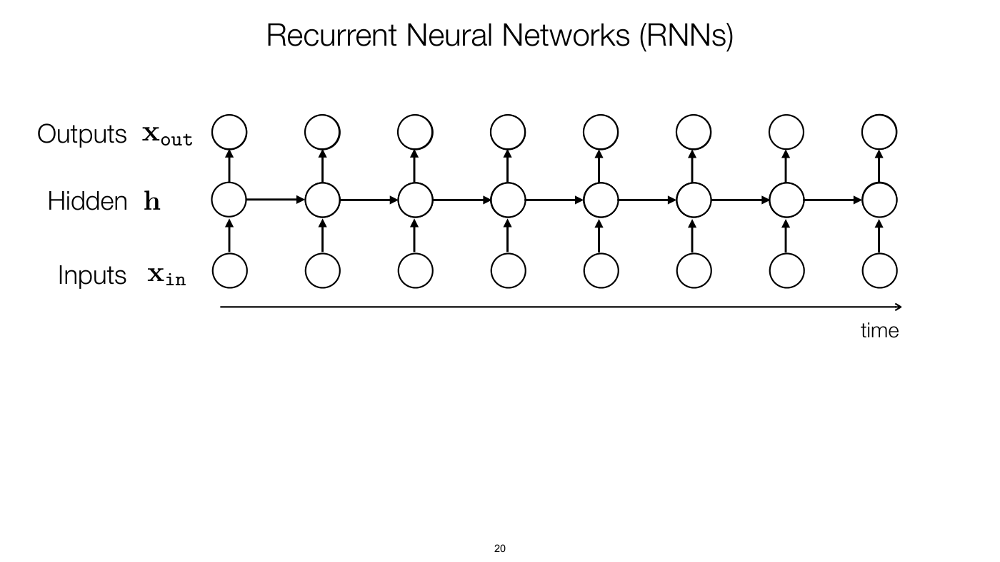

*Slide 20 — An RNN unrolled over time: inputs, hidden states and outputs, each hidden state passed to the next. [Deck](https://ocw.mit.edu/courses/6-7960-deep-learning-fall-2024/mit6_7960_f24_lec10.pdf)*

### A cycle in the graph

"This is the first time we're not seeing a DAG. This is not a Directed Acyclic Graph. We have a loop. We
have a cycle", because the hidden state feeds itself (slide 22, "Recurrent!"). The computation is easier to
read unrolled, "because then, actually, for any given time point, it's still a directed graph" (≈13:09).

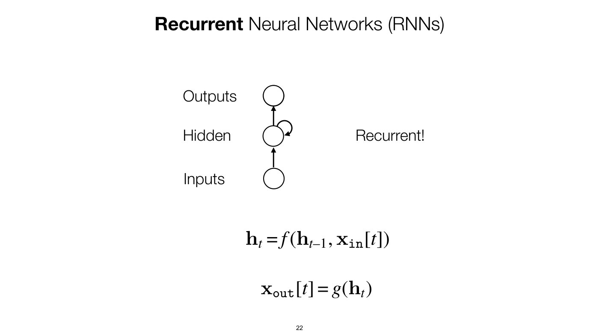

*Slide 22 — The recurrence drawn as a loop: the hidden state feeds itself. [Deck](https://ocw.mit.edu/courses/6-7960-deep-learning-fall-2024/mit6_7960_f24_lec10.pdf)*

### The simplest RNN

When $f$ and $g$ are linear layers followed by nonlinearities (slide 23):

$$\mathbf{h}_ t = \sigma_1(\mathbf{W}\mathbf{h}_ {t-1} + \mathbf{U}\mathbf{x}_ {\texttt{in}}[t] + \mathbf{b})$$

$$\mathbf{x}_ {\texttt{out}}[t] = \sigma_2(\mathbf{V}\mathbf{h}_ t + \mathbf{c})$$

Here $\mathbf{U}$ maps the input in, $\mathbf{W}$ carries the previous hidden state forward, and
$\mathbf{V}$ maps the hidden state to the output (≈13:56–14:44; the captions have "v" for the
hidden-to-hidden weights at ≈13:56, where the slide has $\mathbf{W}$). Remove $\mathbf{W}$, the recurrence,
and the mapping from input to output "starts looking a little bit like that multi-layer perceptron that
we're very familiar with" ([multilayer perceptron](multilayer-perceptron.md)). "So the only difference here
is that recurrence", and the point is that "the hidden state is intended to capture the most relevant
historical information. And what we're learning in W is how do we actually understand what is relevant?
What do we need to keep?" (≈14:44–15:30).

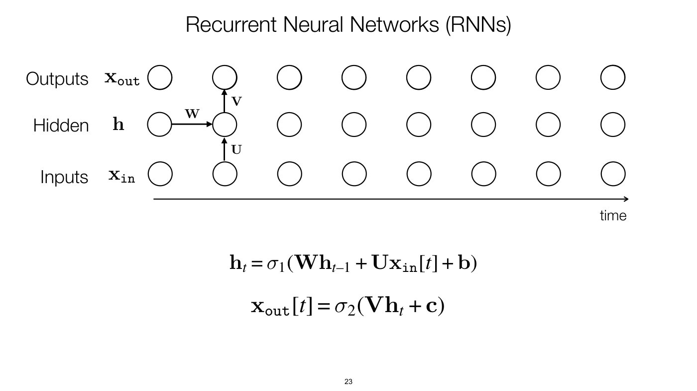

*Slide 23 — The simplest RNN: W carries the hidden state forward, U maps the input in, V maps the hidden state out. [Deck](https://ocw.mit.edu/courses/6-7960-deep-learning-fall-2024/mit6_7960_f24_lec10.pdf)*

RNNs can be made **deep** (slide 24) by stacking hidden layers $\mathbf{h}_ 1, \ldots, \mathbf{h}_ L$, each
with its own recurrent weights $\mathbf{W}_ 1, \ldots, \mathbf{W}_ L$ and with
$\mathbf{U}_ 1, \ldots, \mathbf{U}_ L$ feeding each layer from the one below; "there are many, many, many works that have looked at
different ways to structure these deep recurrent neural networks" (≈15:30).

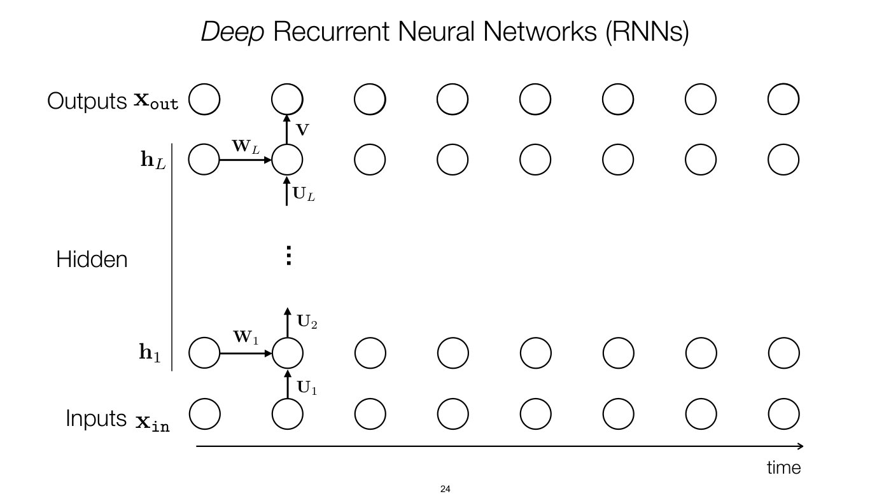

*Slide 24 — A deep RNN: stacked hidden layers, each with its own recurrent weights. [Deck](https://ocw.mit.edu/courses/6-7960-deep-learning-fall-2024/mit6_7960_f24_lec10.pdf)*

### When does it stop, and how far back does it remember?

Asked how many steps the network runs, the lecturer answers "To infinity and beyond": as structured, it
"doesn't have a sense of stop ... when you stop putting in input data, I guess that's when it stops"
(≈16:16). In practice that depends on the problem: a video or audio clip has an end, while a model fed
temperature every day "is going to go until the world ends" (≈17:03).

Another student objected that the network looks like a Markov chain, depending only on the previous state.
It is recurrent, so "this state only depends on the previous state. But the previous state depended on the
state before that ... So you are capturing in every single hidden unit as far back as you have". Even
though that is "theoretically true", this construction "actually makes it really difficult to learn things
across very, very long time horizons, mostly because you have some limited capacity there", and it has
mathematical limits too (≈17:50–18:36).

## Backpropagation through time

Backpropagation is defined on a DAG, and "historically, this was something that really tripped people
up". "But the hack is you just decide when you're training what your fixed time window that you're going
to propagate back through is. And now, you unroll it through that time window" (≈18:36). Unrolled, the
network is a directed acyclic graph again (slide 25), and the influence of an early input on a later output
is the chain rule along it:

$$\frac{\partial \mathbf{x}_ {\texttt{out}}[t]}{\partial \mathbf{x}_ {\texttt{in}}[0]} = \frac{\partial \mathbf{x}_ {\texttt{out}}[t]}{\partial \mathbf{h}_ T} \frac{\partial \mathbf{h}_ T}{\partial \mathbf{h}_ {T-1}} \cdots \frac{\partial \mathbf{h}_ 1}{\partial \mathbf{h}_ 0} \frac{\partial \mathbf{h}_ 0}{\partial \mathbf{x}_ {\texttt{in}}[0]}$$

How far to unroll is "a parameter that you would select or tune" (≈19:22). It may limit how far back the
model learns to look: at inference the earlier information is still passed along, "But if you only trained
the model to send signal back to a given fixed time window, you could see how intuitively it might teach
you to only capture some of limited temporal window of information" (≈20:08).

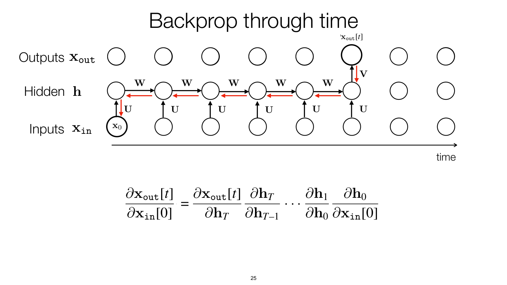

*Slide 25 — Backpropagation through time: unrolled over a window, the gradient runs back through every hidden state (red). [Deck](https://ocw.mit.edu/courses/6-7960-deep-learning-fall-2024/mit6_7960_f24_lec10.pdf)*

Students pressed on the window. A model trained with a window of 20 is not obviously hurt by a test
sequence of three, because training takes gradients from every step inside the window, "not just going
back to the farthest point", and the more recent gradients may be the more helpful ones (≈20:56–21:43).
The window then slides along: with six steps unrolled, the next point's gradients go back only to
$x_1$, the one after to $x_2$ (≈22:30). Is the truncated window an approximation of an infinite one? "Maybe
a bit of both": with this formulation, "the longer time window you have, the harder it is for information
to actually make it that far with these weights", so beyond some point extending it is "probably, by
construction here, not super beneficial" (≈23:16). It is a hyperparameter that papers ablate, and one where
domain knowledge can help (≈23:16–24:04).

### Shared parameters: sum the gradients

The loss over a sequence is the sum of the losses at each step (slide 26), so training asks how to change
$\mathbf{W}$, $\mathbf{U}$ and $\mathbf{V}$ to minimize the sum over the window (≈24:04–24:52):

$$\frac{\partial J}{\partial [\mathbf{W}, \mathbf{U}, \mathbf{V}]} = \sum_{t=0}^{T} \frac{\partial \mathcal{L}(\mathbf{x}_ {\texttt{out}}[t], \mathbf{y}_ t)}{\partial [\mathbf{W}, \mathbf{U}, \mathbf{V}]}$$

where $\mathcal{L}$ is the loss at one step, $\mathbf{y}_ t$ the target and $J$ the total. The same
$\mathbf{W}$ appears at every step, and the class has met this before, in
[lecture 2](02-how-to-train-a-neural-net.md): "It's been a couple of weeks" (≈25:39). Shared parameters are
the same as a branch in a DAG, and the gradient for a shared parameter is the sum of its gradients at each
place it occurs (slide 27, "Parameter sharing —> sum gradients"); for the RNN (slide 28),

$$\frac{\partial \mathcal{L}_ t}{\partial \mathbf{W}} = \sum_i \frac{\partial \mathcal{L}_ t}{\partial \mathbf{W}^{i}}$$

with $\mathbf{W}^{i}$ the copy of $\mathbf{W}$ at step $i$ (≈25:39–26:25; see
[backpropagation](backpropagation.md)). In PyTorch, autograd does the summing "as long as you don't do deep
copies, as long as you're pointing to the actual by reference that actual variable" (≈26:25). Each loss
sums only over the inputs before it, "because that's only going in one direction" (≈27:10).

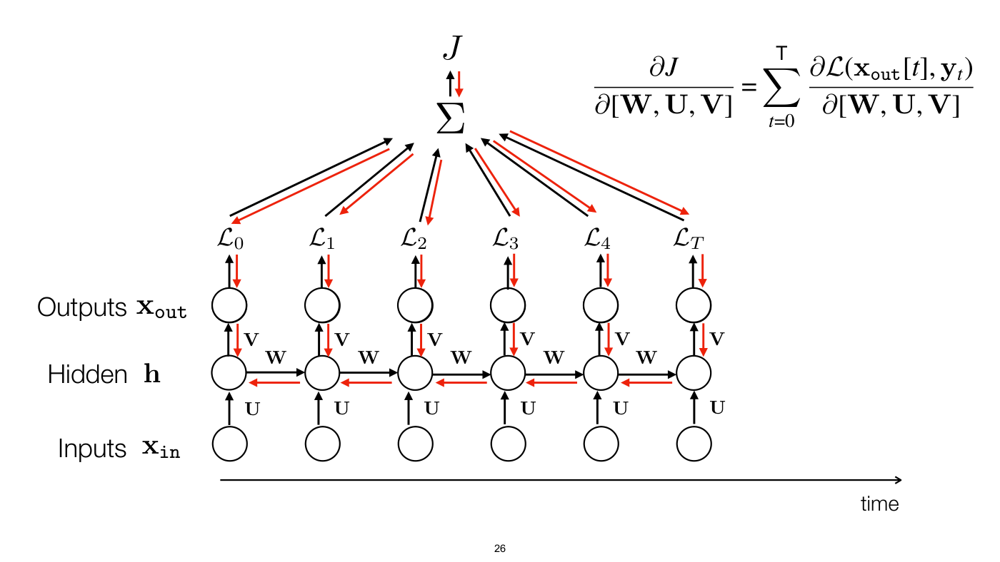

*Slide 26 — The loss is summed over the steps of the sequence, and its gradient flows back through each. [Deck](https://ocw.mit.edu/courses/6-7960-deep-learning-fall-2024/mit6_7960_f24_lec10.pdf)*

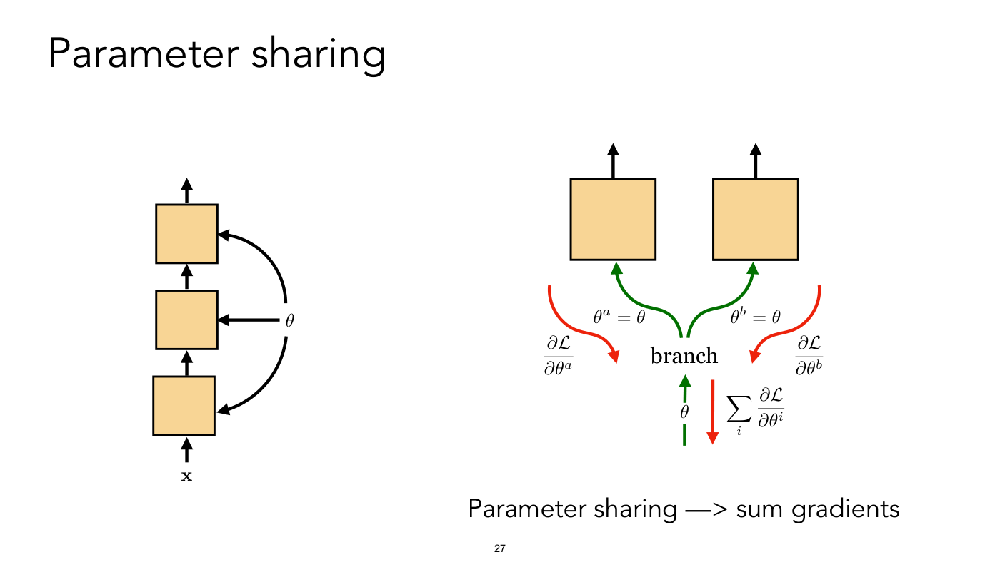

*Slide 27 — Parameter sharing: a parameter used in several places gets the sum of their gradients. [Deck](https://ocw.mit.edu/courses/6-7960-deep-learning-fall-2024/mit6_7960_f24_lec10.pdf)*

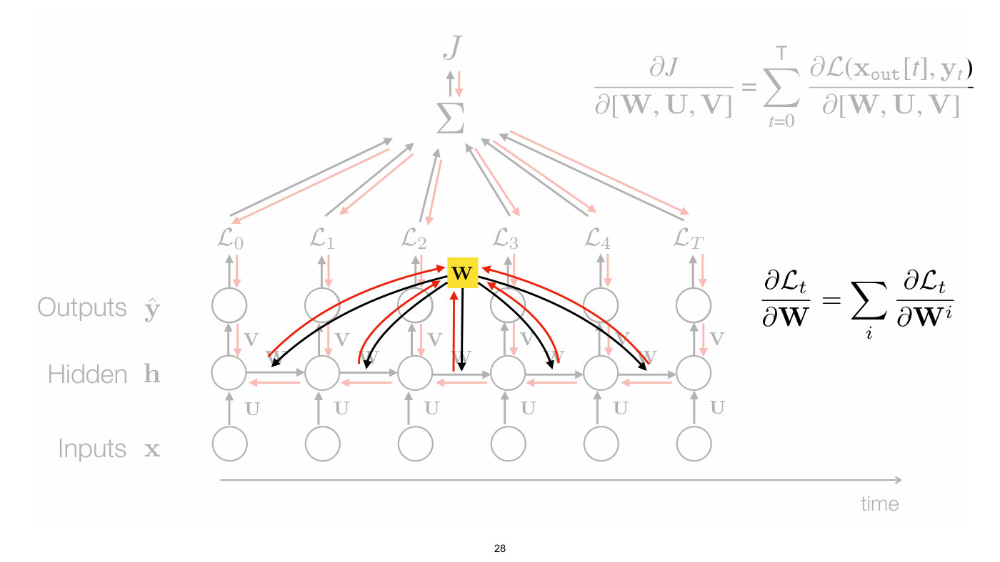

*Slide 28 — The recurrent weights W are shared by every step, so their gradient is a sum over the steps. [Deck](https://ocw.mit.edu/courses/6-7960-deep-learning-fall-2024/mit6_7960_f24_lec10.pdf)*

## The problem of long-range dependencies

Why not unroll forever and remember everything (slide 29)? Memory size grows with $t$; this kind of memory is
**nonparametric**, "there is no finite set of parameters we can use to model it"; and RNNs make a Markov
assumption, "the future hidden state only depends on the immediately preceding hidden state". By putting the
right information into the hidden state, an RNN can in theory model dependencies arbitrarily far apart,
"because the model learns with W how to keep the relevant information, or at least that's the hope"
(≈27:10–28:46). Capturing them means propagating information "through a long chain of dependences" (slide
30), "And this ends up being a bit difficult" (≈28:46). (The deck spells it "dependences", and slide 29's last
bullet "depedences".)

### Powers of W

The lecturer works this out on the chalkboard (≈28:46–30:19). Drop the nonlinearities and set the biases to
zero. Then

$$\mathbf{h}_ 1 = \mathbf{W}\mathbf{h}_ 0 + \mathbf{U}\mathbf{x}_ 1, \qquad \mathbf{h}_ 2 = \mathbf{W}(\mathbf{W}\mathbf{h}_ 0 + \mathbf{U}\mathbf{x}_ 1) + \mathbf{U}\mathbf{x}_ 2,$$

so $\mathbf{h}_ 2$ already carries "a W squared term essentially", the next step a $\mathbf{W}^3$, "all the
way up to W to the N". (These equations are reconstructed from what she says aloud; the board is not in the
deck.) Small values in the weight matrix "will go to 0. And anything in that weight matrix that's big will be
infinite". To be stable at all, the values "kind of need to be close to 1, which means it's kind of hard to
capture really variable information in there", and even slightly below 1, raised to a large power, goes to 0,
"because you have this sort of exponential relationship" (≈30:19; she first calls it "this quadratic
relationship", and the transcript marks it). So "old observations in a recurrent neural network are
forgotten", "stochastic gradients become really high variance", and gradients **vanish** or **explode**
(slide 30, ≈31:06; compare the vanishing and exploding landscapes of
[loss landscapes](loss-landscapes.md)).

A student asked whether the spectral norm of [lecture 7](07-scaling-rules-for-optimization.md) would fix
this. Normalizing the weights could keep them near 1 or stop them going to infinity, "But ... because of the
recurrence relationship, you're taking an exponential in the weights matrix. You could take a spectral norm
over that exponential, but you're still going to take the exponential first. So that might help you with the
exploding gradients problem, but it's not going to change the fact that the small things are going to go to
0" (≈31:06–31:53; see [norms](norms.md)). For more, slide 31 points to an optional reading on stability
analysis in recursion "from a control theory perspective", credited to Bhiksha Raj at CMU, under a cartoon of
the streetlight effect (≈32:39).

### Do we want to remember?

Exploding and vanishing gradients are not the same failure: "the exploding ones correspond to unstable
training ... And the vanishing ones would be old memories being forgotten" (≈33:25). Whether long memory is
wanted is "kind of the universal question". Temperature has daily cycles, so a fine-grained model should
remember yesterday; yearly cycles; and "weather cycles, like El Niño, that happen every seven years". So
"depending on what you're trying to model, there may actually be a lot of value in the longer and longer term
memory if there's signal in more and more time scale" (≈33:25–34:11).

## LSTMs

The **LSTM**, Long Short Term Memory (Hochreiter and Schmidhuber, 1997), is "A special kind of RNN designed
to avoid forgetting. This way the default behavior is not to forget an old state. Instead of forgetting by
default, the network has to *learn to forget*" (slide 32). Vanishing is the problem to design against because
exploding gradients can be handled, "to take normalization over the gradients to keep them from exploding ...
constrain it, or regularize it, or clip it. But we can't do that when things go to 0" (≈34:11–34:57). So in an
LSTM "the default is the identity. You're biased to not forget anything. And then you learn what to forget,
kind of like garbage collection" (≈34:57).

Slide 33 draws the standard RNN cell as a single tanh layer that takes the previous hidden state and the
current input. An LSTM puts "a little memory controller that decides what to save and what to delete" inside
each step (slide 34). "It turns out this is still Turing complete. And it's actually very close to a Turing
machine. It's kind of like that idea of a hidden tape that you can read to or write from" (≈35:44). The
LSTM figures are "derived from Chris Olah" and his blog post "Understanding LSTMs", which the lecturer
recommends because "This part is a little fiddly" (≈40:22–41:07).

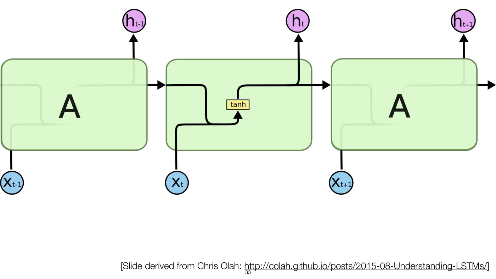

*Slide 33 — The standard RNN cell, after Chris Olah: one tanh layer on the previous hidden state and the input. [Deck](https://ocw.mit.edu/courses/6-7960-deep-learning-fall-2024/mit6_7960_f24_lec10.pdf)*

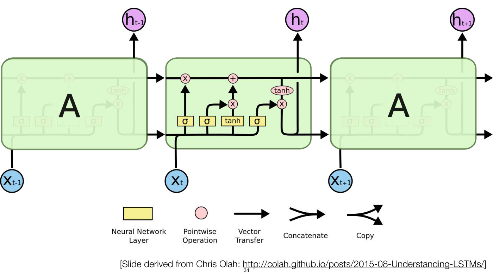

*Slide 34 — The LSTM cell, after Chris Olah: a cell-state line along the top and four gates below. [Deck](https://ocw.mit.edu/courses/6-7960-deep-learning-fall-2024/mit6_7960_f24_lec10.pdf)*

### The cell state

The new element is the **cell state** $C_t$ (slide 35), the line running along the top of the cell: "this is
kind of the tape in the Turing machine. And this cell state is what gets modulated by the part that decides
what to forget and what to add" (≈36:29).

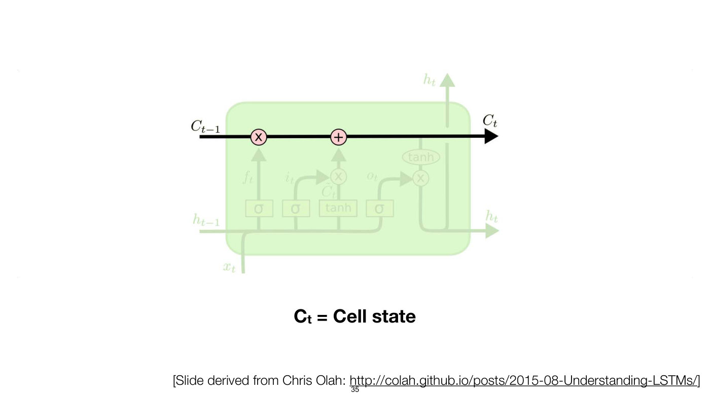

*Slide 35 — The cell state runs along the top of the cell, changed only by one multiplication and one addition. [Deck](https://ocw.mit.edu/courses/6-7960-deep-learning-fall-2024/mit6_7960_f24_lec10.pdf)*

### The forget gate

$$f_t = \sigma(W_f \cdot [h_{t-1}, x_t] + b_f)$$

Here $[h_{t-1}, x_t]$ is the previous hidden state concatenated with the current input, and $\sigma$ is the
sigmoid, plotted beside it on slide 36. The slide's reading: "Decide what information to throw away from the
cell state. Each element of cell state is multiplied by ~1 (remember) or ~0 (forget)." Large values go to 1
and small ones to 0, so the network gives "high values to things you want to remember and low values to things
you want to forget" (≈36:29–37:15). Because the sigmoid is bounded, "and not something like a ReLU, which would
be unbounded", the operation on each element is "essentially the identity function with some masking of what
we want to forget" (≈37:15). A student asked whether the $\sigma$ boxes are MLPs: "the sigmas are sigmoid
functions — literally sigmoid functions", chosen "because it's bounded between 0 and 1" (≈41:53; see
[activation functions](activation-functions.md)).

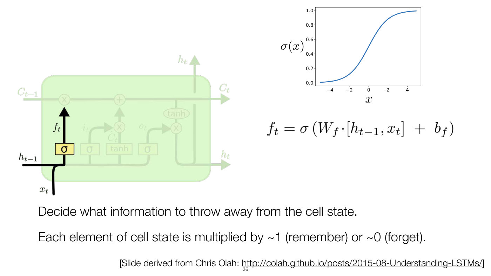

*Slide 36 — The forget gate: a sigmoid decides, element by element, what to keep (about 1) and what to forget (about 0). [Deck](https://ocw.mit.edu/courses/6-7960-deep-learning-fall-2024/mit6_7960_f24_lec10.pdf)*

### The input gate

Next the cell decides "what new information to add to the cell state" (slide 37):

$$i_t = \sigma(W_i \cdot [h_{t-1}, x_t] + b_i)$$

$$\tilde{C}_ t = \tanh(W_C \cdot [h_{t-1}, x_t] + b_C)$$

The slide labels $i_t$ "which indices to write to" and the candidate $\tilde{C}_ t$ "what to write to those
indices" (≈38:02).

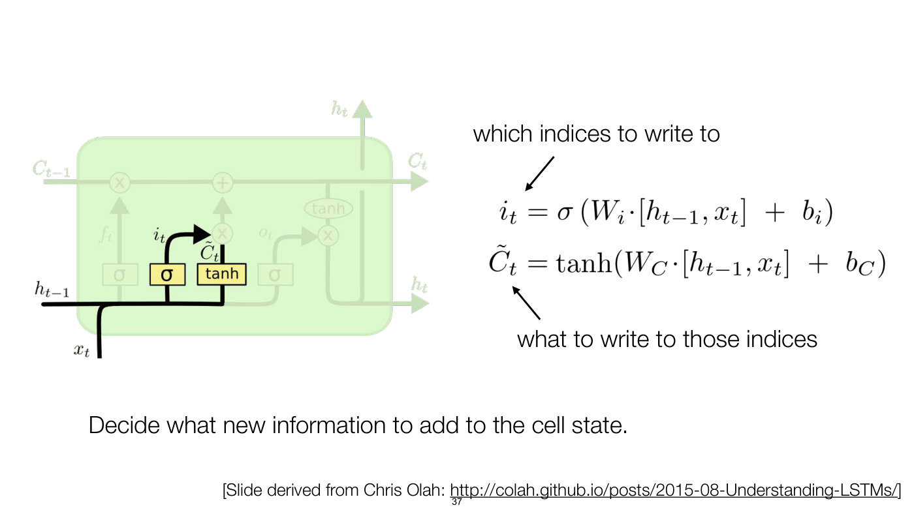

*Slide 37 — The input gate chooses which indices to write; the tanh layer chooses what to write there. [Deck](https://ocw.mit.edu/courses/6-7960-deep-learning-fall-2024/mit6_7960_f24_lec10.pdf)*

### The update

$$C_t = f_t \ast C_{t-1} + i_t \ast \tilde{C}_ t$$

"Forget selected old information, write selected new information" (slide 38). "What's quite different is, for
the first time now, we have these multiplicative relationships": the old cell state is multiplied by $f_t$,
"kind of either ones or 0's", and the new information $\tilde{C}_ t$ by $i_t$ (≈38:02–38:50). The products
are element-wise, as the lecturer confirms to a student, over however many entries $C$ has (≈41:07).

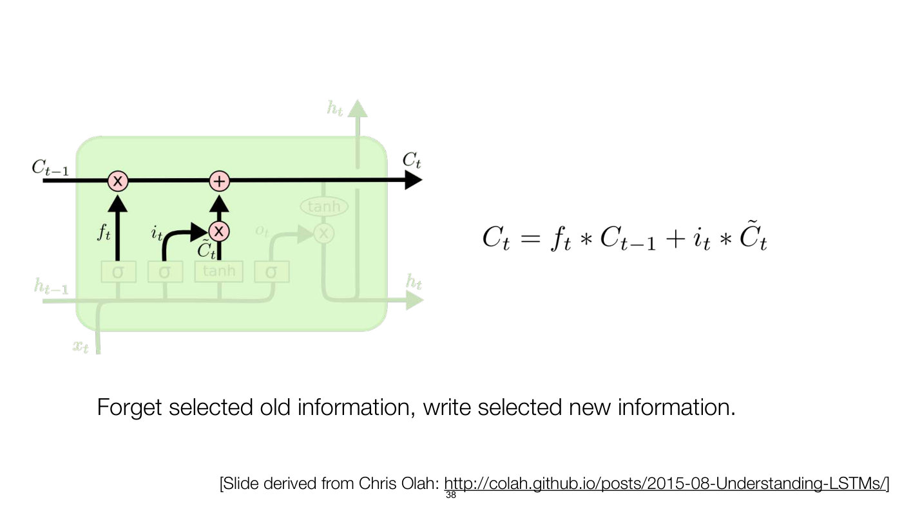

*Slide 38 — The update: forget selected old information, write selected new information. [Deck](https://ocw.mit.edu/courses/6-7960-deep-learning-fall-2024/mit6_7960_f24_lec10.pdf)*

### The output gate

$$o_t = \sigma(W_o [h_{t-1}, x_t] + b_o)$$

$$h_t = o_t \ast \tanh(C_t)$$

"After having updated the cell state's information, decide what to output" (slide 39). The lecturer compares
this, "not mathematically similar", to the value projection of the
[transformer](08-architectures-transformers.md): "this feels to me, on vibes, kind of like values" (≈38:50–39:36).
Two things now travel forward in time, the hidden state and "that ticker tape, that cell state" (≈39:36).
(Slide 39's output gate prints no dot between $W_o$ and the bracket, where slides 36 and 37 have one.)

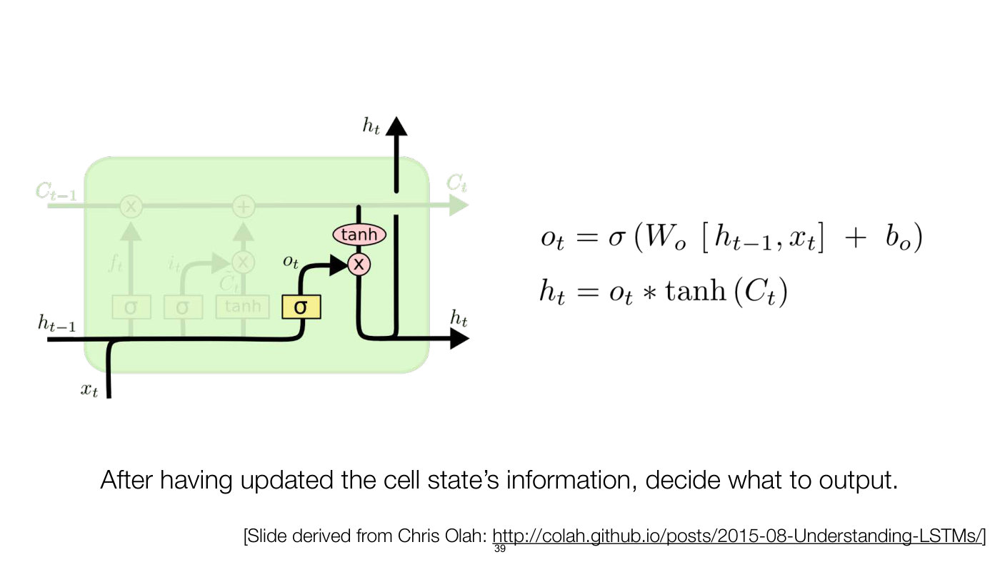

*Slide 39 — The output gate decides what part of the squashed cell state becomes the hidden state. [Deck](https://ocw.mit.edu/courses/6-7960-deep-learning-fall-2024/mit6_7960_f24_lec10.pdf)*

### Why it does not vanish

What the LSTM adds over the plain RNN is "this gating functionality that's provided by multiplicative updates to
the cell state, where now we explicitly learn what to remember and what to forget". By default the cell state
is multiplied by 1, "this identity instead of multiplying by yourself, which removes the vanishing and exploding
gradients. We no longer have that exponential". "Because the default is the identity, it's kind of like a skip
connection or a residual connection in a ResNet": the network could learn to send the same information forward
all the time (≈39:36–40:22; see [skip connections](skip-connections.md)). Asked whether the gate weights are
diagonal, the lecturer says no (≈41:53).

## Sequence models

### Autoregressive models

"But there's this new kid in town of what we call an autoregressive model" (slide 40, ≈41:53–42:41). The idea is
simple and the course has met it before, in [lecture 8](08-architectures-transformers.md): give the model the
beginning of a sequence, ask it to predict what comes next, add the prediction to the input, and ask again
(slide 41). "This idea of continually predicting what's next, predicting what's next, this is how we think about
doing modern generative AI", and language models like ChatGPT are explicitly trained this way (≈42:41–43:29). The
same framework could be told "to fill in the blanks or something" instead, as slide 41's second row does with
"Once ___ a time" (≈43:29).

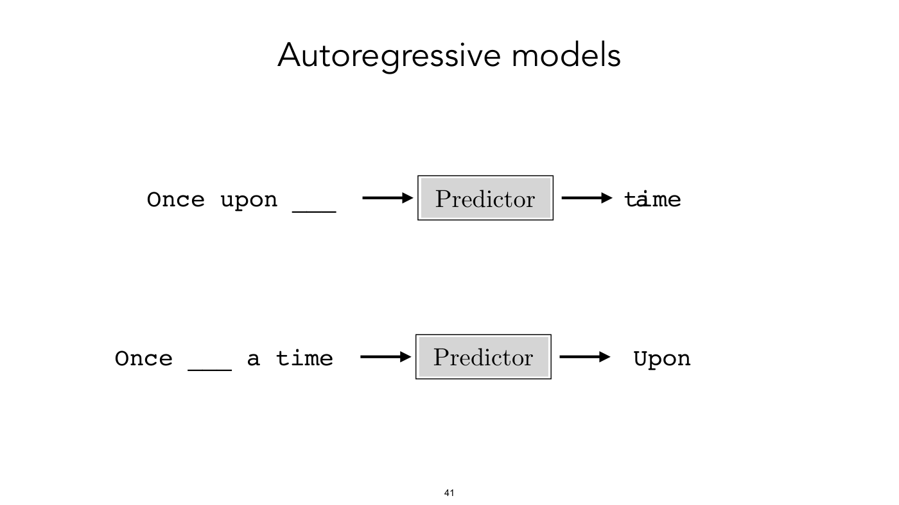

*Slide 41 — Autoregressive models: predict the missing word, at the end or in the middle. [Deck](https://ocw.mit.edu/courses/6-7960-deep-learning-fall-2024/mit6_7960_f24_lec10.pdf)*

Training and sampling are set out on slide 42. The training set is beginnings of sentences paired with their next
words ("Once upon a" → "time", "To be or not to" → "be"), and a learner fits a predictor to them. At test time the
predictor is given a new beginning, "Colorless green ideas sleep", predicts "furiously", and the prediction is
appended and fed back in, "again, and again, and again", until "you want to stop or until the predictor decides to
stop" (≈43:29–45:02).

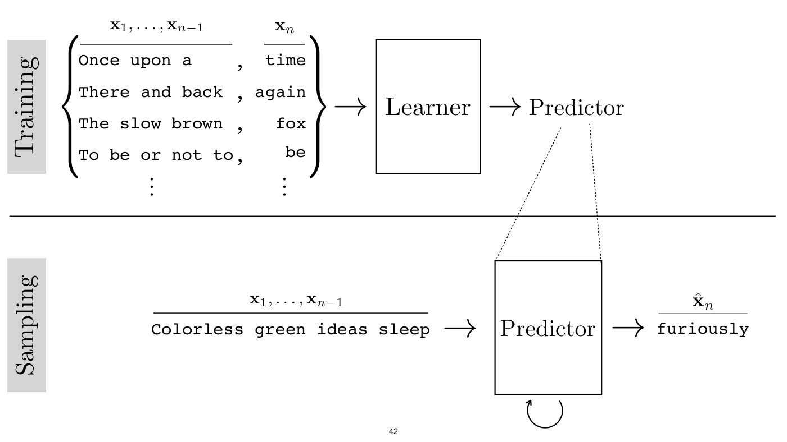

*Slide 42 — Training on beginnings of sentences and their next words, then sampling by feeding each prediction back in. [Deck](https://ocw.mit.edu/courses/6-7960-deep-learning-fall-2024/mit6_7960_f24_lec10.pdf)*

A student asked whether that is a way to evaluate an RNN, printing its samples. An RNN can predict the next word,
"But what an RNN doesn't have is this explicit loop back where now that output from up to t plus 1 becomes the part
of the input at the next time step. ... So it's not innately something that you would do in an RNN, but you could
totally loop it around that way" (≈45:02–45:48). Another asked about feeding the whole predicted distribution back
in, rather than one sampled word; that leads into the probability models (≈45:48–46:33).

### The probability of a sequence

Any joint distribution over a sequence $\mathbf{X} = (\mathbf{x}_ 1, \ldots, \mathbf{x}_ n)$ factorizes into
conditionals, each the probability of one element given everything before it (slide 43):

$$p(\mathbf{X}) = \prod_{i=1}^{n} p(\mathbf{x}_ i \mid \mathbf{x}_ 1, \ldots, \mathbf{x}_ {i-1})$$

"This is true for any probability distribution. You factorize them out, and you get something that's multiplicative
and is somewhat still autoregressive" (≈46:33–47:22). For a sentence,
$p(\texttt{Once upon a time}) = p(\texttt{Once}) \thinspace p(\texttt{upon} \mid \texttt{Once}) \thinspace p(\texttt{a} \mid \texttt{Once, upon}) \thinspace p(\texttt{time} \mid \texttt{Once, upon, a})$,
which is "how you would model the probability of given sentence — the likelihood of a sentence" (≈47:22–48:08). The
sequence models of the transformer lecture can be read the same way, as modeling the probability of a sentence
(≈47:22).

### A next-word classifier

How to model $p(\texttt{time} \mid \texttt{Once, upon, a})$? Students suggested logistic regression and then the
softmax, and its usual use is classification, so: "Just treat it as a next word classifier!" (slide 44). The
lecturer ties this to [lecture 9](09-hackers-guide-to-deep-learning.md): "a reasonable starting point for a lot of
things is just being like, let's see if we can formulate it as a multi-class classifier" (≈48:08–48:55). A neural net
produces scores, the softmax "will squish the outputs into a probability mass function. Non-negative vector sums to
1", and the classifier is trained with cross-entropy (≈49:41; see
[softmax and cross-entropy](softmax-and-cross-entropy.md)).

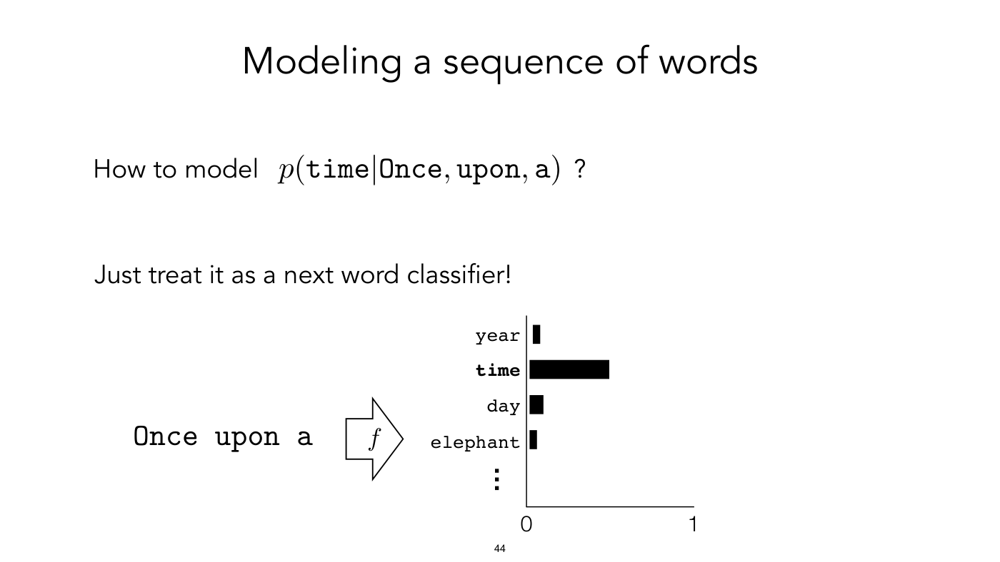

*Slide 44 — Treat each factor of a sentence's probability as a next-word classifier. [Deck](https://ocw.mit.edu/courses/6-7960-deep-learning-fall-2024/mit6_7960_f24_lec10.pdf)*

What are the classes? Words, as one-hot vectors of size $K$, the size of the vocabulary, "e.g., K=100,000" (slide
45). Multi-class classification gets harder as $K$ grows. The lecturer's own example: her group trains classifiers
over roughly 100,000 of the "about 450,000 species currently in iNaturalist", which needs a lot of data, "And it can
be quite unstable" (≈49:41–50:27). Or characters, "K=26 for English letters" (slide 46): "now your classification is
fewer way, but the sequence prediction is a lot harder. You have to take a lot more time steps", and "it's pretty
easy for these things to devolve over time. Imagine it starts spelling something weird, and then where are you going
to go?" (≈50:27–51:16). The sweet spot in practice is in between, "this idea of byte pairs, which is 2 character
pairs", which she puts at "about 1,000 — 26 times 26, maybe plus a few more", and these tokens are used "even in the
largest scale language models we have" (≈51:16). (In lecture 8, a byte pair can also stand for a longer string: "a
byte pair that represents I-N-G"; see [transformers](transformers.md).)

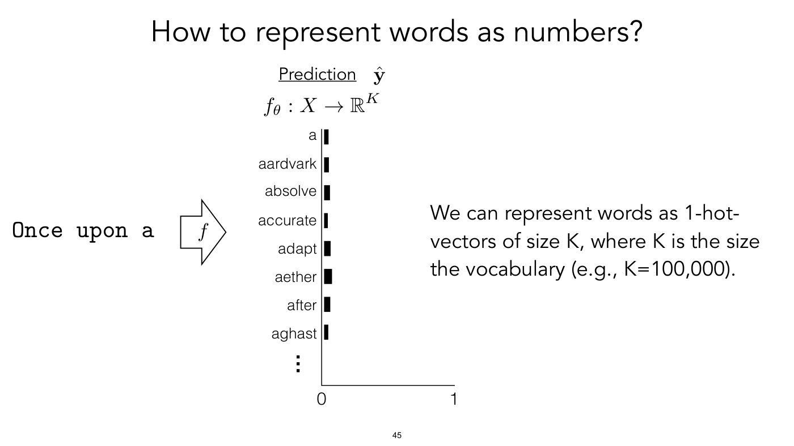

*Slide 45 — Words as classes: one-hot vectors over a vocabulary of size K, around 100,000. [Deck](https://ocw.mit.edu/courses/6-7960-deep-learning-fall-2024/mit6_7960_f24_lec10.pdf)*

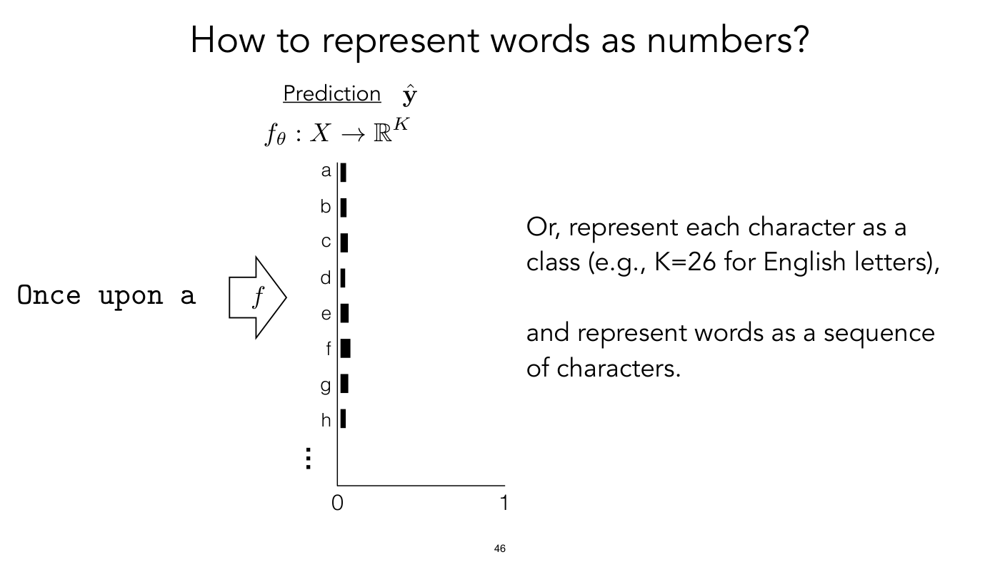

*Slide 46 — Characters as classes: K = 26 for English letters. [Deck](https://ocw.mit.edu/courses/6-7960-deep-learning-fall-2024/mit6_7960_f24_lec10.pdf)*

## Molecule to text

The worked example (slide 47) takes a caffeine molecule and generates a description of it, "a mild stimulant that
enhances cognitive ability", a "molecule to text" model (≈52:03). One way to build it (slide 48): run the molecule
through a [graph neural network](graph-neural-networks.md) to get a representation, use that to condition the start of
an LSTM, and let the LSTM predict the next word at each step, taking the previous ones into account (≈52:03–52:51).
The training sentence ends in an END token, "So now, for the first time, we've introduced the idea of stopping when
you're done" (≈52:51). (The deck prints "enchances" on every slide of this example but the last, which spells it "enhances".)

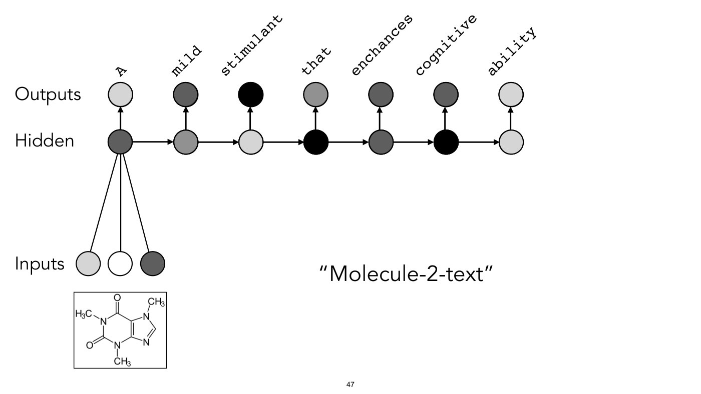

*Slide 47 — Molecule to text: a recurrent network describes a molecule word by word. [Deck](https://ocw.mit.edu/courses/6-7960-deep-learning-fall-2024/mit6_7960_f24_lec10.pdf)*

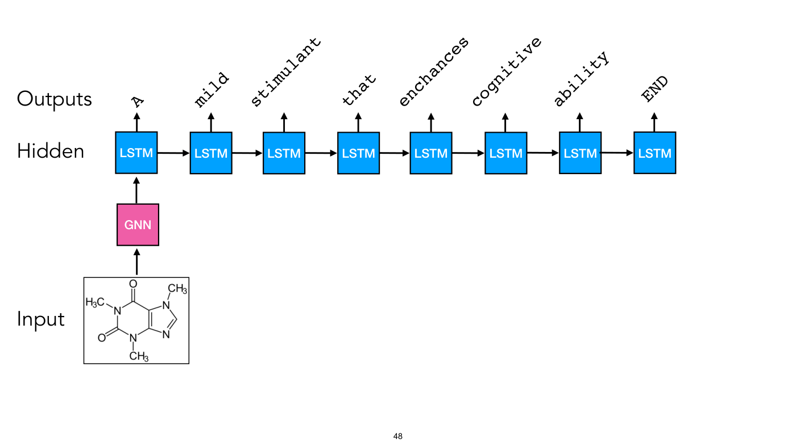

*Slide 48 — The same model with a GNN encoding the molecule and an LSTM writing the words, ending in END. [Deck](https://ocw.mit.edu/courses/6-7960-deep-learning-fall-2024/mit6_7960_f24_lec10.pdf)*

### Training: maximum likelihood and teacher forcing

At each step the LSTM outputs a distribution over the vocabulary, $p_\theta(\cdot)$, and training maximizes the
probability the model assigns to each target word, $\arg\max_\theta \log p_\theta(y)$ (slide 49). With the targets
one-hot encoded, that is the same as minimizing cross-entropy between the outputs and the targets (slide 50):

$$f^{\ast} = \arg\min_{f \in \mathcal{F}} \sum_{i=1}^{N} H(\mathbf{y}_ i, \hat{\mathbf{y}}_ i)$$

where $H$ is the cross-entropy, $\mathbf{y}_ i$ a one-hot target and $\hat{\mathbf{y}}_ i$ the predicted distribution:
"You can train it the same way we've trained things before" (≈53:37; she says "maximizing cross-entropy", and the
transcript marks it against the slide).

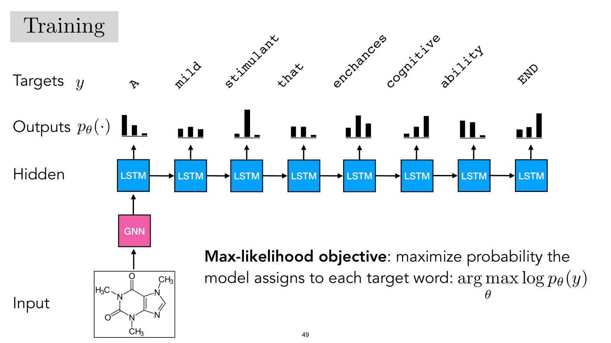

*Slide 49 — Training: maximize the probability the model assigns to each target word. [Deck](https://ocw.mit.edu/courses/6-7960-deep-learning-fall-2024/mit6_7960_f24_lec10.pdf)*

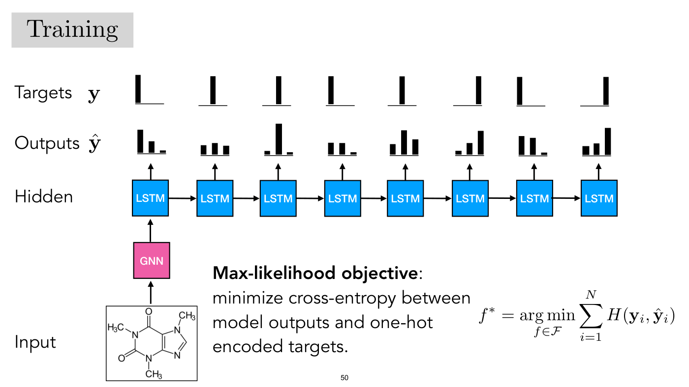

*Slide 50 — The same objective as cross-entropy against one-hot targets. [Deck](https://ocw.mit.edu/courses/6-7960-deep-learning-fall-2024/mit6_7960_f24_lec10.pdf)*

Feeding the model its own predictions during training lets errors compound, so "often, we use something called
**teacher forcing**, which is basically, even if you predict the wrong thing at a given time step, you enforce the
correct word goes in as the input" (slide 51). Each prediction is conditioned "on the ground-truth preceding words
instead of letting it devolve and then penalizing it for every mistake it made after it made its first mistake"
(≈53:37–54:24).

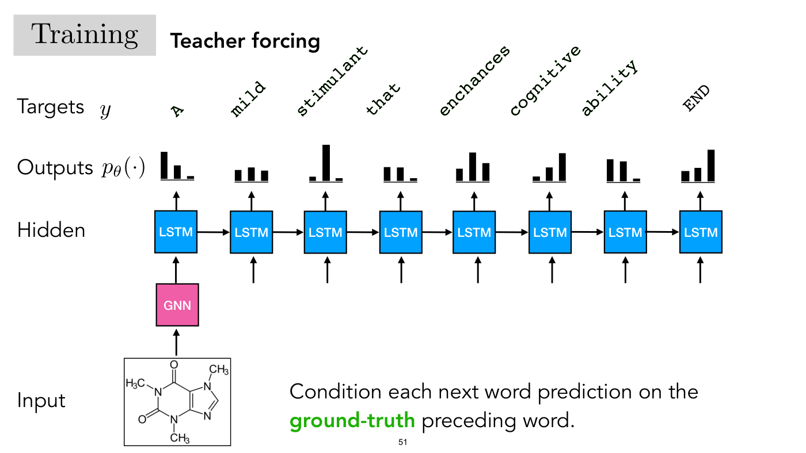

*Slide 51 — Teacher forcing: each prediction is conditioned on the ground-truth preceding word. [Deck](https://ocw.mit.edu/courses/6-7960-deep-learning-fall-2024/mit6_7960_f24_lec10.pdf)*

### Testing: sampling and beam search

At test time the model starts from the molecule, samples a word from its predicted distribution, feeds the sample back
in as the next input, and repeats (slide 52, which also allows taking the most likely word instead). On the slide it
produces "A strong stimulant that enhances cognitive ability". "After 'a,' we weren't super sure what was likely next.
And so the model predicted 'strong.' And it turns out that 'strong' was exactly wrong", and it changes the meaning:
"if you make one mistake, then often, it can take you down a path in almost this tree where you make a lot of mistakes"
(≈54:24–55:10).

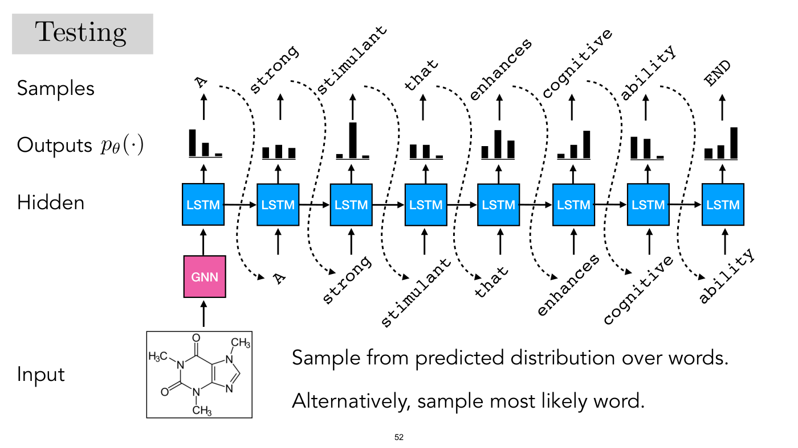

*Slide 52 — Testing: sample a word and feed it back in; here the model writes strong where the truth is mild. [Deck](https://ocw.mit.edu/courses/6-7960-deep-learning-fall-2024/mit6_7960_f24_lec10.pdf)*

**Beam search** (slide 53) handles that. "Let the model choose top k like what it thinks are the k most likely things.
And then from each of those you choose the k most likely things next", fill out the tree, score each whole path, and
"pick the one that scores best overall", with the score being "the model's confidence of the entire sentence",
$p_\theta(\mathbf{y}_ 1, \ldots, \mathbf{y}_ T \mid \mathbf{x})$ (≈55:10–55:56). Conditioned on the molecule, the
correct path through "mild" might then score higher. This kind of language model, "lots of different deep things plus
LSTM-flavored things put together to try to generate text or describe images or do VQA", was the approach "2015-ish";
"today, what we see is often people will use transformers instead" (≈55:56–56:45).

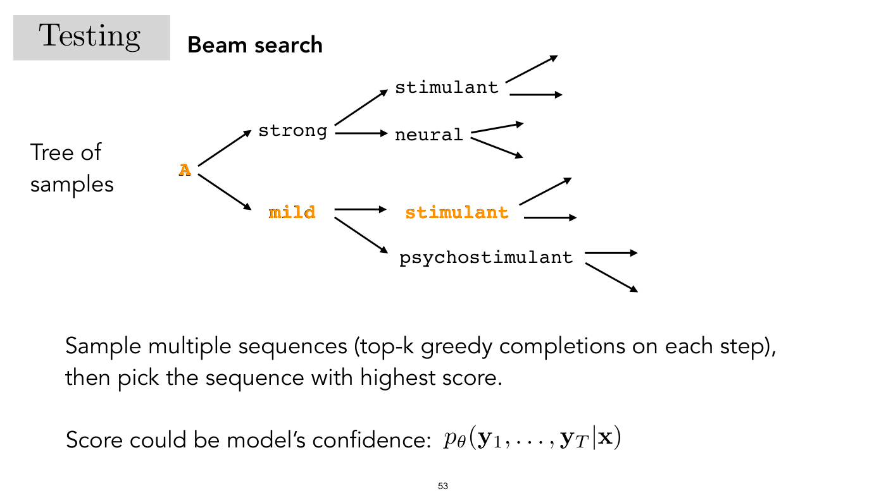

*Slide 53 — Beam search: expand the most likely continuations and keep the best-scoring sentence. [Deck](https://ocw.mit.edu/courses/6-7960-deep-learning-fall-2024/mit6_7960_f24_lec10.pdf)*

A student asked whether, to predict only the third word ahead, it is better to model the words in between or to predict
it directly. The lecturer's intuition is that "there's signal in those intermediate words that you would really want to
propagate forward", so she would step through them, perhaps with beam search; and "these days a lot of temperature
models are transformers with really large context windows" (≈56:45–58:19).

## Long memory

### Linking old memories directly

Back to Frank on the balcony ("he only gets supervised outside time, because I'm a good naturalist, and I don't let my
cat kill birds", ≈58:19). Instead of pushing memory forward through the sequence one step at a time, "you could just let
every single time step get a memory unit. You could just keep memories from every single point in time", and link them
directly to later predictions (slides 55–56, ≈59:07). Methods that do this (slide 57) are temporal convolutions,
attention and transformers, and memory networks, which "explicitly try to have these memory representations or units
that you can access over time, maybe through a separate bank of memories" (≈59:07–59:56).

### Recurrence, convolution and attention

Slide 58 puts the three ways of modeling arbitrarily long sequences side by side. **Recurrence**: "recurrent weights are
shared across time", and information is passed forward, by vanilla recursion, an LSTM or something more complicated.
**Convolution**: "conv weights are shared across time", but "you don't get to see anything outside of the time window of
that convolution". **Attention**: "weights are dynamically determined as a function of the data", drawn as a convolution
kernel whose weights come from the data, "So the way that you keep the information is dependent on the inputs, which is
quite flexible" (≈59:56–1:00:41). Convolution and attention have a time window; recurrence has one only for
backpropagation (≈1:01:29). See [convolution](convolution.md) and [transformers](transformers.md).

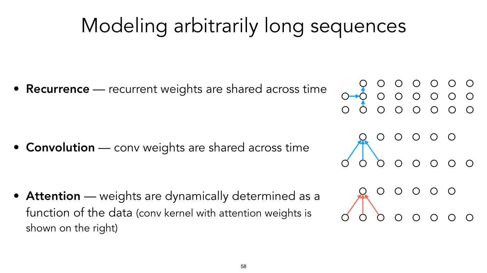

*Slide 58 — Recurrence, convolution and attention: three ways to model arbitrarily long sequences. [Deck](https://ocw.mit.edu/courses/6-7960-deep-learning-fall-2024/mit6_7960_f24_lec10.pdf)*

Their costs differ (slide 59, Table 1 of "Attention Is All You Need"), in terms of the sequence length $n$, the
representation dimension $d$, the kernel size $k$ and the neighbourhood size $r$ of restricted self-attention:

| Layer type | Complexity per layer | Sequential operations | Maximum path length |
| --- | --- | --- | --- |
| Self-attention | $O(n^2 \cdot d)$ | $O(1)$ | $O(1)$ |
| Recurrent | $O(n \cdot d^2)$ | $O(n)$ | $O(n)$ |
| Convolutional | $O(k \cdot n \cdot d^2)$ | $O(1)$ | $O(\log_k(n))$ |
| Self-attention (restricted) | $O(r \cdot n \cdot d)$ | $O(1)$ | $O(n/r)$ |

"The name 'Attention is All you Need' is actually really trying to say that we don't need memory. All we need is
attention" (≈1:01:29–1:02:17). The price is the $n^2$: self-attention computes the similarity of the whole sequence to
itself, which "can get really computationally exhaustive. It takes a lot of memory" (≈1:02:17).

### Even-larger-context transformers

Several lines of work try to stretch the context window within limited memory. The figures of slides 60 and 61 are
excluded from OCW's licence and described in the slide file only.

- **Efficiency from sparsification** (slide 60). Performers and Linformers decompose attention, for example by a low-rank
  matrix approximation, to bring the cost from $O(n^2)$ to $O(n)$; the Reformer uses locality-sensitive hashing to reach
  $O(n \log n)$. "But also frequently, this comes at the expense of a little bit of performance. And so if the trade off
  is performance versus computational efficiency, we just build GPUs with more memory" (≈1:03:02–1:03:49). Asked whether
  the saved compute could buy more data, the lecturer doubts that is the choice being made: "I think they're going to
  train on all the data they have with the biggest thing they have" (≈1:03:49).
- **Local plus global** (slide 61). Transformer XL "uses segment-level recurrence and then these very fancy positional
  encodings"; the Longformer combines local and global attention; the slide also lists Big Bird. Where the previous
  methods sparsify by decomposition, these sparsify by masking the $n \times n$ attention pattern (≈1:04:34).
- **Retrieval** (slide 62). A large GPT models "all the world's language and all the world's information" together.
  RETRO splits that into a lighter model of language plus a lookup into a database, "trillion-token databases", for facts
  (≈1:05:20–1:06:07). A model that predicts what is likely "can't guarantee that it actually matches the truth of the
  world's information", whereas a separate knowledge base lets you "try to enforce that those facts are actually going to
  be true, that you won't have things like hallucinations. Of course, there's still some complexity there" (≈1:06:07).

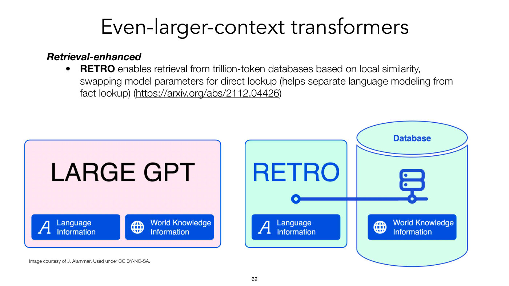

*Slide 62 — Retrieval: RETRO keeps language in the model and world knowledge in a database. [Deck](https://ocw.mit.edu/courses/6-7960-deep-learning-fall-2024/mit6_7960_f24_lec10.pdf)*

### How far back do we need to go?

"Do we really care about modeling things at the beginning of Pride and Prejudice by the time you get to the last chapter?"
Context windows have grown (slide 63): BERT 512 tokens, GPT-2 1,024, GPT-3 2,048, GPT-4 8,000 with a 32K version, and an
Anthropic model with about 100K tokens, "like 75,000 words. That's like two or three books worth of context" (≈1:06:07–1:06:52).
If that fits in memory, why need anything else? Because of cost: "how many people can afford H100s". Working out when this
much context is needed is "valuable from the sense of efficiency and accessibility of these models. And this takes a lot of
power, and it takes a lot of energy, and it's really slow to train" (≈1:06:52–1:07:43).

Mangalam et al. (slide 64), from Jitendra Malik's group, ask "When do we actually need long-term context?" for video action
recognition. They define a **minimum certificate set**, "essentially the total amount of frames or little clips of a video
that you need in terms of time to recognize an action accurately", and found that most video benchmarks "needed somewhere up
to maybe like two seconds of context. We didn't need models that could handle three-hour long movies". So they built a
benchmark, EgoSchema, with certificate lengths "more like 100" (≈1:07:43–1:09:15). The slide's chart plots certificate
length against clip length for each dataset, with EgoSchema at the top, near 100, an arrow marked "5.7x" up to it from LVU,
and the common benchmarks clustered near the origin. The lecturer's point is a general one: "the benchmarks that we build,
the ways that we model value, we model improvement in the machine learning space directly influence what we make progress
on". If longer context does not seem to improve performance, "Maybe it's because the benchmark we're measuring performance
on just doesn't actually include anything that needs it" (≈1:09:15–1:10:02).

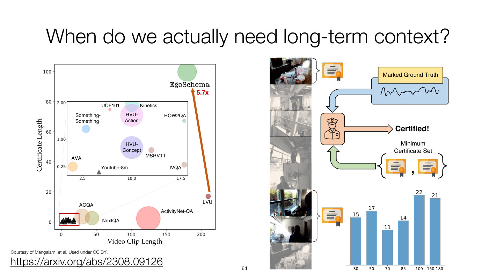

*Slide 64 — When do we need long-term context? Certificate length against clip length for video datasets (Mangalam et al.). [Deck](https://ocw.mit.edu/courses/6-7960-deep-learning-fall-2024/mit6_7960_f24_lec10.pdf)*

## Memory fast and slow

The lecture ends on a change of perspective (slide 65). Run data through a frozen network, and the activations
$\mathbf{h}^{(i)}$ are a statistic of that data point, a **fast memory**. Train a network on a dataset
$\lbrace \mathbf{x}^{(i)}, \mathbf{y}^{(i)} \rbrace_{i=1}^{N}$, and its parameters $\theta$ are a statistic of the
dataset: "So in a way, those parameters in a deep net are slow memory of the training data" (≈1:10:02–1:11:35).

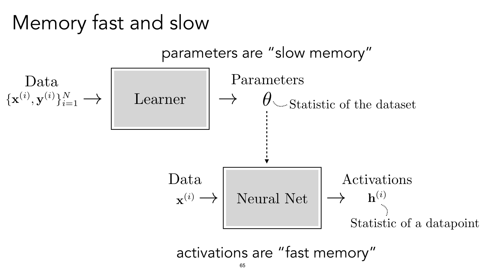

*Slide 65 — Parameters as slow memory of the dataset, activations as fast memory of a data point. [Deck](https://ocw.mit.edu/courses/6-7960-deep-learning-fall-2024/mit6_7960_f24_lec10.pdf)*

Can it go the other way (slide 66)? **Hypernets** are "nets that output weights of other nets", used "as a version of
neural architecture search", and the weights they output are "almost like a fast memory of the input data to that net".
**Codebooks** "use tensors of activations that are learned. So you're doing backprop to the activations themselves", and
those activations are "kind of slow memory of the data set you're learning" (≈1:11:35–1:12:21). The lecturer leaves it as
food for thought, then closes "with another picture of Frank, who's the best cat ever" (≈1:12:21–1:13:07); the OCW deck
ends with the outline instead (slides 67–68).

## The problem set

Homework 3's first problem, "RNNs versus transformers" (8 points), works with a simple RNN,
$\mathbf{h}_ t = \phi_h(\mathbf{W}_ h \mathbf{h}_ {t-1} + \mathbf{W}_ x \mathbf{x}_ t + \mathbf{b}_ h)$ and
$\mathbf{y}_ t = \phi_y(\mathbf{W}_ y \mathbf{h}_ t + \mathbf{b}_ y)$, in its own notation. With the hidden nonlinearity
set to the identity and the biases to zero, it asks for the hidden states and outputs after two, three and $T$ steps, what
happens to the first input's contribution when $T$ is long, and how the cost of a forward pass grows with $T$ for an RNN
and for a self-attention layer. See [sources](../sources.md) and [lecture 8](08-architectures-transformers.md#the-problem-set)
for the rest of the problem set.

## See also

- [Recurrent neural networks](recurrent-neural-networks.md) — the concept page: the recurrence, backpropagation through
  time, vanishing and exploding gradients, and the LSTM.
- [Autoregressive models](autoregressive-models.md) — next-token prediction from lecture 8's GPT to this lecture's
  factorization, vocabulary choices, teacher forcing and beam search.
- [Transformers](transformers.md) — attention as the alternative to recurrence, and the efforts to lengthen its context.
- [Convolution](convolution.md) — convolution in time and over the space–time cube.
- [Backpropagation](backpropagation.md) — parameter sharing and summed gradients, now through time.
- [Loss landscapes](loss-landscapes.md) — vanishing and exploding gradients, first met in lecture 2.
- [Skip connections](skip-connections.md) — the LSTM's identity default compared to a residual connection.
- [Lecture 8 — Architectures: Transformers](08-architectures-transformers.md), the previous architecture lecture.
