# Lecture 11 — Representation Learning: Reconstruction-Based

**Lecturer:** Phillip Isola ·
**Video:** [youtube.com/watch?v=QxOzQRtd440](https://www.youtube.com/watch?v=QxOzQRtd440) (81 min) ·
**Slides:** [`mit6_7960_f24_lec11.pdf`](https://ocw.mit.edu/courses/6-7960-deep-learning-fall-2024/mit6_7960_f24_lec11.pdf)
(65 pages; the deck is titled "Lecture 11: Representation Learning I"; transcribed slide by slide in [`raw/slides/11-representation-learning-reconstruction-based.md`](../raw/slides/11-representation-learning-reconstruction-based.md)) ·
**Transcript:** [`raw/transcripts/11-representation-learning-reconstruction-based.md`](../raw/transcripts/11-representation-learning-reconstruction-based.md)

## What this lecture establishes

This lecture opens "the next third of the class": after approximation, generalization and architectures,
"a kind of a new perspective on deep learning, which is the idea of representation learning and generative
modeling" (≈0:00). Its picture of a deep net is a sequence of **representations**: each layer re-describes the
data, and the forward, **encoding** direction, from data to embeddings, is representation learning. A
representation is worth learning because it **transfers**: a network pretrained on a lot of data can be adapted
to a new task with a little, by retraining a linear readout or by fine-tuning. Without labels there are two
general principles for learning one, **compression** and **prediction**. Compression gives the **autoencoder**,
which with linear maps is PCA and with an integer bottleneck is k-means, and whose deep version of k-means is the
vector-quantized autoencoder. Prediction gives **self-supervised learning**: predict one part of the raw data from
another, as in colorization, masked autoencoders and BERT. Empirically masked prediction learns better
representations than autoencoding, and why is, in the lecturer's words, "ongoing science" (≈1:16:06).

The lecturer calls the autoencoder "representation learning algorithm 101, just the most basic vanilla one, and
also my favorite, and probably the best one. And I think it will just win out in the end" (≈46:31).

**Notation on this page** follows the slides. A data point is $\mathbf{x}$ in a data domain $\mathcal{X}$, the
**encoder** is $f$, the embedding or representation of a point is $\mathbf{z} = f(\mathbf{x})$, the **decoder** is
$g$, and a reconstruction is $\hat{\mathbf{x}} = g(f(\mathbf{x}))$. Inside a layer, $\mathbf{x}_ {\texttt{in}}$ and
$\mathbf{x}_ {\texttt{out}}$ are its input and output, $\mathbf{W}$ and $\mathbf{b}$ its weights and bias. The
slides of the image examples use a bold capital $\mathbf{X}$ for a whole image and $\hat{\mathbf{X}}$ for its
reconstruction.

The deck is titled "Lecture 11", matching the recording, but its outline slide is headed "12. Representation
Learning I" (slide 2). See the [course map](course-map.md#the-decks-lecture-pointers). The outline is: nets learn
representations; why learn representations?; autoencoders; clustering and VQ; self-supervised learning by
reconstruction (slide 2). The next lecture covers "a different type of representation learning, which is called
metric learning or contrastive learning, where you learn about similarities and distances" (≈1:35).

## Two directions through a network

"Deep nets transform datapoints, layer by layer", and "Each layer is a different *representation* of the data"
(slide 3). The network takes raw data $\mathbf{x}$ "and turns it into f of x, and then f of f of x, and so forth.
And each layer is a different representation, so the data will be differently distributed" (≈1:35). The output
at the top is called the embedding or representation, "But actually, each layer is a representation of the data".

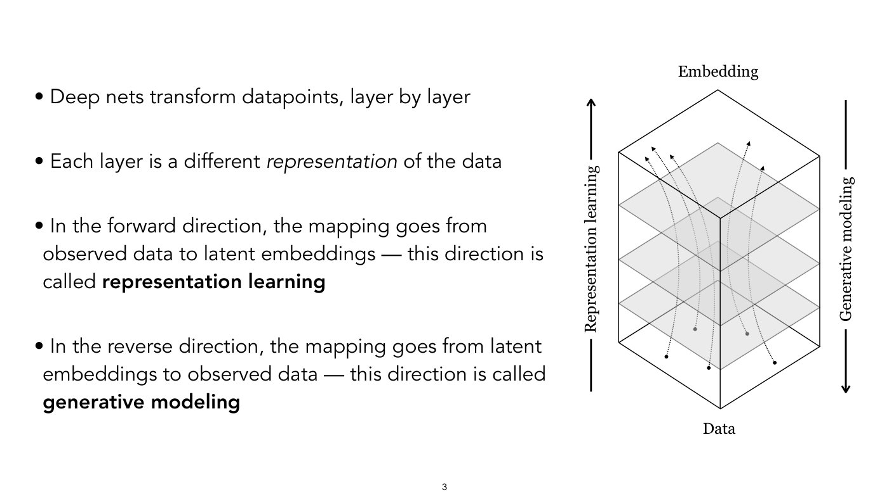

*Slide 3 — Each layer is a representation of the data; going up is representation learning, going down is generative modeling. [Deck](https://ocw.mit.edu/courses/6-7960-deep-learning-fall-2024/mit6_7960_f24_lec11.pdf)*

Slide 3 names the two directions. Forward, "from observed data to latent embeddings", is **representation
learning**; in reverse, "from latent embeddings to observed data", is **generative modeling**. The backwards
direction "is not going to be backprop. Now backprop tries to find the gradient. The backwards direction is more
like the inverse of the forward direction in this context" (≈2:23). The two "can roughly be thought of as inverses
of each other"; this lecture is about the first, and generative modeling comes "in a few weeks" (lectures 14–16).

One label for the forward direction is **x2vec** (slide 4): x is your data, and "the most famous early version of
x2vec was called word2vec", but "You can do this for images. You can do this for sounds. You can do this for
molecules, whatever you want" (≈3:08). The representation at layer 3 of an image is "the tensor of activations I
get out" after three layers, and it might encode that "there's a car, or there's a ground, or so forth, a building,
a road" (≈3:55). Slide 4's own words: "Represent data as a neural **embedding** — a vector/tensor of neural
activations". A student asks whether this is feature extraction: "is another name for the same thing, yeah"
(≈3:55–4:40). Another asks whether x2vec always maps to something smaller. "Often, the representation you want to
be a smaller object, a lower dimensional vector than the input, but that's not the only way of doing it" (≈4:40).

Slide 5 is the cartoon the next few lectures reuse. The data space is a blue blob, "some complicated object,
high-dimensional, weird topology. That's like the space of images." The representation space is a salmon circle,
"because we're going to make the point that the representation is, oftentimes, a simpler space", and the
distribution over embeddings "will typically be a Gaussian distribution" (≈5:27). The mapping from data to
representation is the **encoder** $f$ (≈6:12).

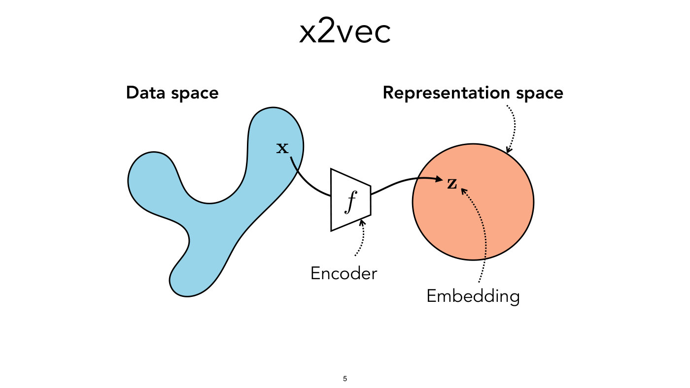

*Slide 5 — The cartoon the lecture reuses: a complicated data space, an encoder, and a simpler representation space. [Deck](https://ocw.mit.edu/courses/6-7960-deep-learning-fall-2024/mit6_7960_f24_lec11.pdf)*

## Layers as transformations of a distribution

### Two ways to draw a function

The usual plot of a function puts the input on the x-axis and the output on the y-axis (slide 6). "We're just going
to rotate the y-axis to be at the top", and read the function as "mapping a set of points on the input dimension to
the set of points on the output dimension"; the identity then "looks really simple, right? It's just straight
lines" (slide 7, ≈6:59). "I don't know why we decided to go with this way of representing functions as opposed to
this way, but I think both of them have some interesting properties" (≈6:59).

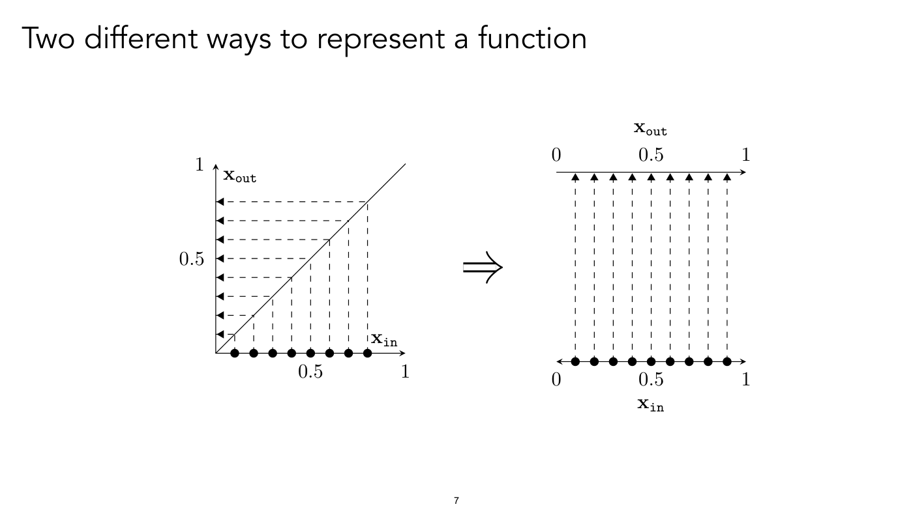

*Slide 7 — A function drawn two ways: as a graph, and as a map from points on the input line to points on the output line. [Deck](https://ocw.mit.edu/courses/6-7960-deep-learning-fall-2024/mit6_7960_f24_lec11.pdf)*

Slide 8 draws four scalar layers this way, for a network of width 1. A linear layer with weight 2, $\mathbf{x}_ {\texttt{out}} = 2\mathbf{x}_ {\texttt{in}}$,
"will just expand … it'll just spread it out". A ReLU "takes all of your data in the negative half space and maps
it to 0", so "You'll usually have a spike of density at 0". A sigmoid "will map most of your inputs to either 0 or
1, but in a soft way" (≈7:46). The fourth panel is the affine map $\mathbf{x}_ {\texttt{out}} = (\mathbf{x}_ {\texttt{in}} + 1)/2$,
which squeezes the inputs together. The point of the view: "think of your functions as taking a set, a distribution
of input data points, and doing these geometric transformations, squishing them, and skewing them, and remapping
them" (≈8:31).

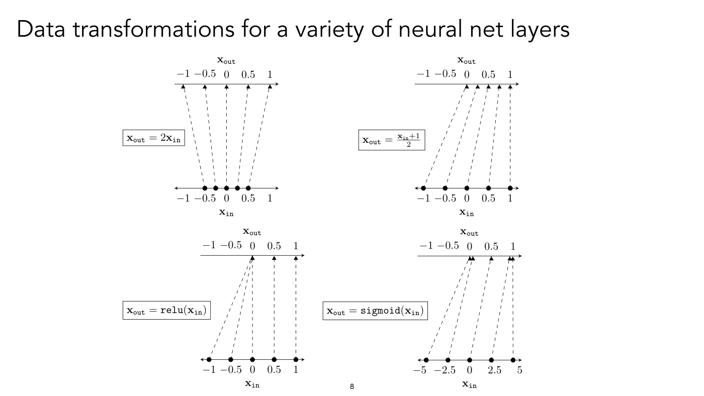

*Slide 8 — Scalar layers as maps: the linear layer spreads the points, the ReLU piles the negatives up at 0, the sigmoid squeezes towards 0 and 1. [Deck](https://ocw.mit.edu/courses/6-7960-deep-learning-fall-2024/mit6_7960_f24_lec11.pdf)*

### The basic layers, in two dimensions

Slide 9 sets four layers side by side, each with its wiring graph, its equation and its mapping, with activations
in red and parameters in blue: "the only learnable parameters are the weights and biases in these layers" (≈8:31).
The mapping view's advantage is that it can draw "2D to 2D functions … which you can't do with traditional
plotting" (≈9:17); each mapping is shown on a grid of inputs and on a Gaussian cloud.

- **Linear**, $\mathbf{x}_ {\texttt{out}} = \mathbf{W}\mathbf{x}_ {\texttt{in}} + \mathbf{b}$: "an affine
  transformation. And geometrically, it will just look like rotating, squishing, scaling" (≈9:17–10:02).
- **ReLU**, $x_{\texttt{out}}[i] = \max(x_{\texttt{in}}[i], 0)$. Two properties. It "maps all data to the positive
  orthant", the region where every coordinate is positive. And "most of the points get mapped to these axes. You
  get this what's called a sparse representation", because in each dimension about half the values are negative
  and are sent to 0; everything in the strictly negative orthant lands on the origin, "And in high dimensions, I
  think this effect becomes even more extreme" (≈10:02–10:49).
- **L2 norm**, $x_{\texttt{out}}[i] = x_{\texttt{in}}[i] / \lVert \mathbf{x}_ {\texttt{in}} \rVert_ 2$, "and same
  with RMS norm, and same with LayerNorm, which is a variation on this": it maps every input to a vector of norm 1,
  so in two dimensions to the circle and in high dimensions to the hypersphere. One reason that is nice is "that the
  numerics are going to be bounded somehow. The vectors will not go to infinity or not go to 0" (≈10:49–11:35). The
  lecturer had shown the picture "in one of the last lectures, but I didn't really fully explain it": lecture 9's
  drawing of the RMS norm and layer norm (see [normalization layers](normalization-layers.md)).
- **Softmax**, which slide 9 prints as $x_{\texttt{out}}[i] = e^{-\tau x_{\texttt{in}}[i]} / \sum_{k=1}^{K} e^{-\tau x_{\texttt{in}}[k]}$,
  with a minus sign in the exponent and the coefficient $\tau$ coloured as a parameter; the lecture does not comment on
  either. Its mapping sends the two-dimensional cloud onto a line segment. Asked what that line is, a student answers
  that it is where $x_1 + x_2 = 1$. "That's the simplex … the set of points in Rd, where the dimensions sum to 1. And
  the output of a softmax is going to be a point in the simplex" (≈11:35–12:21).

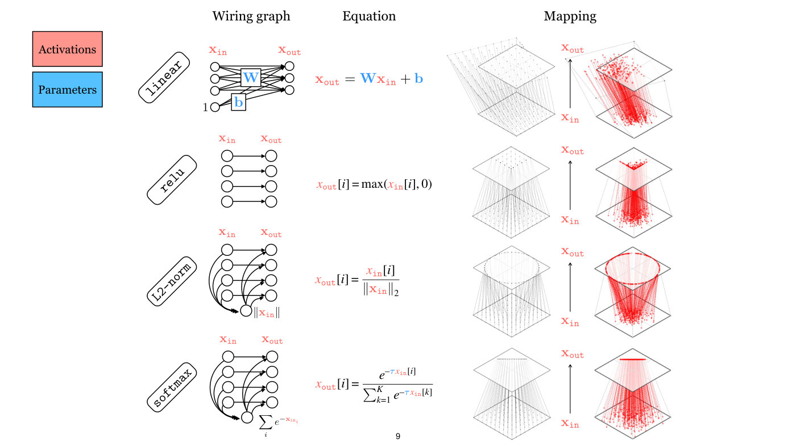

*Slide 9 — Each layer's mapping of a two-dimensional cloud: the linear layer skews it, the ReLU folds it into the positive quadrant, the L2 norm puts it on a circle, the softmax on a line. [Deck](https://ocw.mit.edu/courses/6-7960-deep-learning-fall-2024/mit6_7960_f24_lec11.pdf)*

### An MLP, layer by layer

Slide 10 applies the view to a whole network: a three-layer MLP, "three linear layers, so our convention is three
layers", with ReLUs between them and a softmax on top, trained with cross-entropy as softmax regression. The data
are "a cloud of points at the origin with label red and a hemisphere of points around with label blue", a nonlinear
problem because "there's no linear hyperplane that separates the red cloud from the blue cloud" (≈13:08–13:53).
Every layer has width 2, so "There's nothing hidden. It's not like I'm doing dimensionality reduction or
visualizing. It's just the raw activation values at each of these layers" (≈14:39).

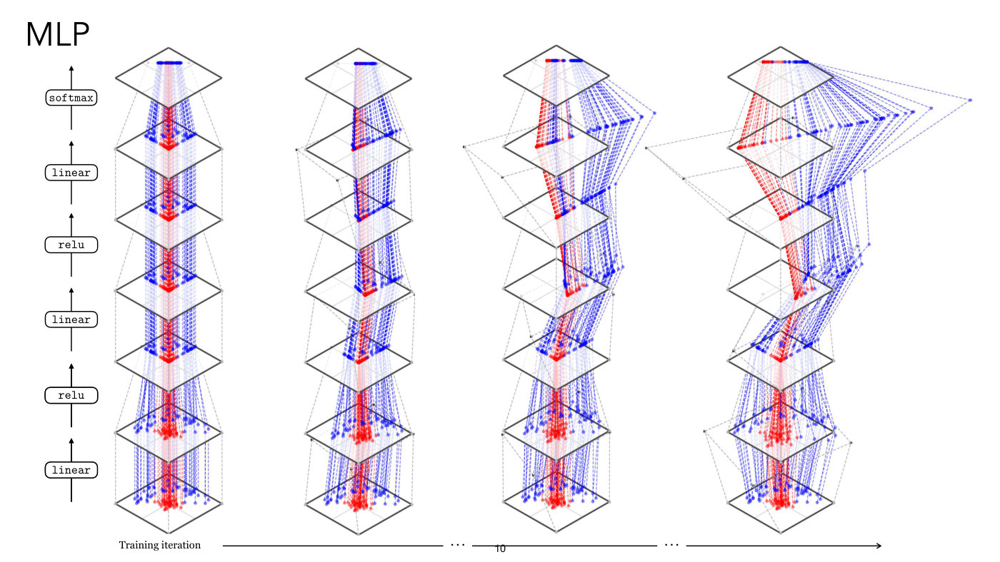

*Slide 10 — Training moves the red points away from the blue ones, layer by layer, until the softmax places them at opposite ends of its line. [Deck](https://ocw.mit.edu/courses/6-7960-deep-learning-fall-2024/mit6_7960_f24_lec11.pdf)*

As training proceeds, "the red points will move away from the blue points". A linear layer shifts things over, "the
ReLU snaps it back onto the axes", the next linear layer skews, "eventually, we get things to spread out on a line.
And then the softmax clamps that back down to this simplex", with the red points heading to one one-hot label and
the blue to the other (≈13:53–14:39). "Each of the layers now can be understood as a different representation of
the data distribution and a better and better representation" for the classification task (≈14:39). Slide 11 shows
the same stack animated in the lecture.

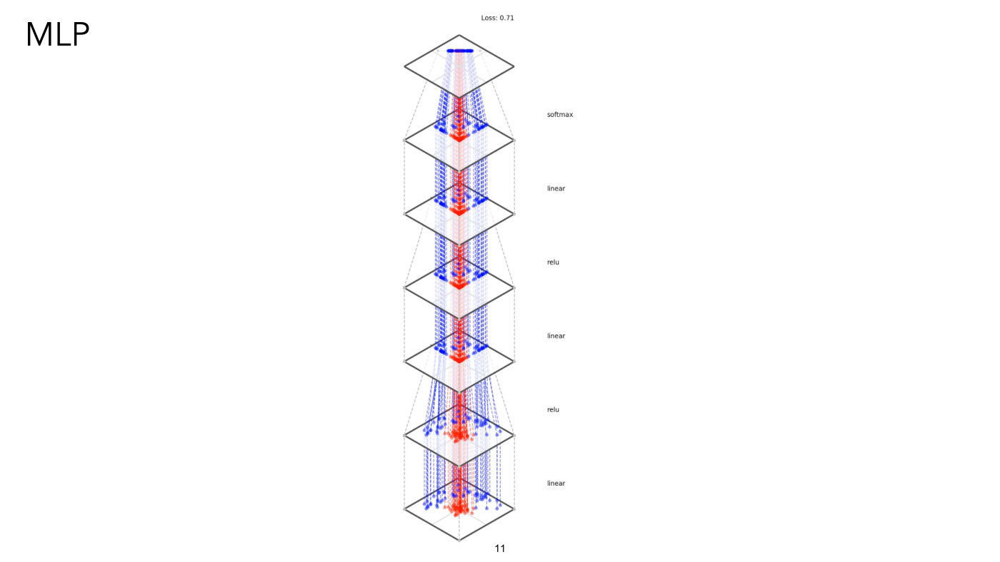

*Slide 11 — The same MLP as one stack of planes, shown animated in the lecture. [Deck](https://ocw.mit.edu/courses/6-7960-deep-learning-fall-2024/mit6_7960_f24_lec11.pdf)*

"Just for fun", slide 12 trains the network twice, with SGD and with steepest descent in the spectral norm, "the
spectral descent method that you worked out in your problem set 2", which normalizes the updates by their spectral
norm (≈15:30). "It's a little bit hard to read too much into this": spectral descent descends faster, "but that
depends on the learning rate", and it reaches a lower loss. One thing worth noticing is that the first linear layer
looks "almost like a rotation, which is a orthogonal transformation. And if your updates are orthogonalized, then
maybe that somehow relates to this first layer finding this orthogonal transformation" (≈15:30–16:17). See
[steepest descent](steepest-descent.md). Slide 12 links the code that made these figures.

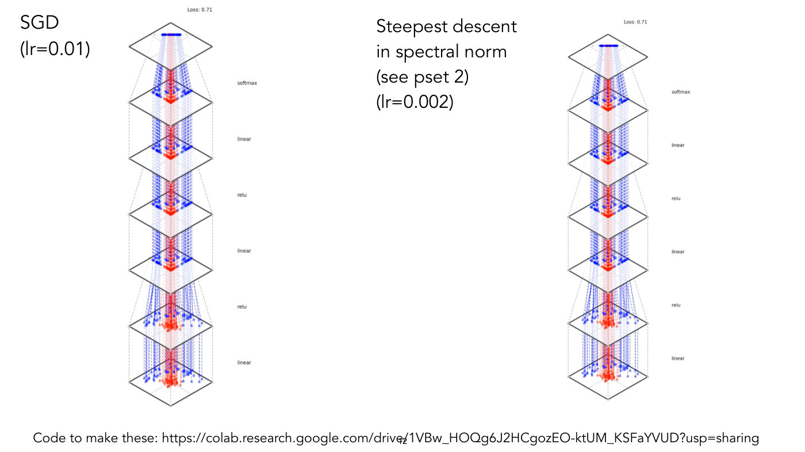

*Slide 12 — SGD (left) against steepest descent in the spectral norm (right), the method of problem set 2. [Deck](https://ocw.mit.edu/courses/6-7960-deep-learning-fall-2024/mit6_7960_f24_lec11.pdf)*

### A real network: CLIP

"This is where the power of the ideas of representation learning really come in. Not when I'm just having an MLP
over two-dimensional embeddings, but when I am having a very high-dimensional feature space" (≈16:17). Slide 13
shows CLIP, "a computer vision system that is quite good at extracting good features from images", with its
embeddings reduced by PCA, "so it's a bit of a cartoon", and each step between planes a block of three vision
transformer layers (≈17:04). As you go deeper, the colours, which are the classes of a computer vision data set,
separate, "because this network was trained for classification" (≈17:50). The general point: deep nets go "from
entangled, complicated data at the input … to, layer by layer, gradually morphing, disentangling it through these
geometric transformations, until you get clean separation of your semantics of interest", and "the output space is a
simpler object than the input space" (≈17:50–18:36). Slide 13's figure is not rendered in this knowledge base: it is
the same figure that lecture 1's deck marks "© Torralba, Isola, and Freeman. All rights reserved" (see `AGENTS.md`).

## Deep nets and brains

"One of the initial inspirations for deep learning, of course, was to understand the human brain" (≈18:36). Slide
14 is a cartoon of the visual cortex [Serre, 2014], a sequence of layers that "are linear followed by pointwise
nonlinear operations, plus some extra complexities that biologists debate", "about six of these layers or five or
six", ending in a layer called IT, "where that's thought to be where the semantics are segregated". Early layers
filter for edges, the next look for "conjunctions of edges, and disjunctions", and neurons deeper in become
selective "for more and more complex patterns" (≈19:23–20:09).

Do artificial nets do the same? The lecture probes a trained classifier "just like the neuroscientists do", with
"artificial probes into the neurons" to "see what inputs these neurons are responsive to" — **deep net
"electrophysiology"** (slides 15–16, ≈20:09–20:55). In the brain an electrode records when a neuron fires; in the
net, "That's when the ReLU is above 0". "One of the modern names for this type of work is interpretability or
mechanistic interpretability", but "it's an old problem" (≈20:55).

The results are Zeiler and Fergus's (2014), on "a vanilla convolutional network with five or six layers" (slides
17–20, ≈21:43). Each layer-1 filter outputs a feature map, and for nine filters slide 17 shows the nine image
patches that activate each most strongly. One is "like an edge detector. It's looking for an oriented line, a bright
followed by a dark transition"; another is "like a greenness detector" (≈22:28). "A filter is trying to filter out
something from the data, find the thing it's looking for and throw away everything else." Layer 2 is selective "not
for edges, but for some conjunction of edges, higher-order patterns", such as a cross from two edge orientations,
gradients or circles (slide 18, ≈23:14). By layer 3 there is "selectivity for faces", perhaps a "blobbiness detector"
that "happens to be an OK template for a human" (slide 19, ≈24:00), and layer 5 separates dog faces from human faces
(slide 20). Slide 21 sets the patches beside the visual-cortex diagram: "deep nets and the neuroscience models of the
brain are quite in alignment here" (≈24:47–25:32).

Modern networks with "dozens or hundreds of layers" have "very precise detectors deep in the network that code for
very specific things", in images and in language models too; "There was a famous paper called 'The Sentiment Neuron'",
and "now this is well known, that this just occurs in all of our modern deep nets" (≈24:47). One difference: the
brain has perhaps seven layers of filters "it depends how you count", against hundreds in modern architectures, "But
the brain has recurrence, so it uses those seven layers over and over again" (≈25:32).

## What is a representation?

The lecture restricts itself mainly to **vector embeddings** (slide 22, ≈26:21). Slide 22 gives two definitions:

- "A representation of a data domain $\mathcal{X}$ is a function $f : \mathcal{X} \to \mathbb{R}^d$ that assigns a
  feature vector to each input in that domain. This function is called an **encoder**."
- "A representation of a datapoint $\mathbf{x}$ is a vector $\mathbf{z} \in \mathbb{R}^d$ with $\mathbf{z} = f(\mathbf{x})$."

"So what is actually parameterizing f? It's the weights and biases. So if I have a neural network, the
representation, by this definition, is its weights and biases" (≈27:08). Both uses are common. "When we say the
learned representation, we usually mean f" (≈27:08–27:54).

## Why learn representations?

### To do more learning

"Maybe the simplest is to do more learning, right? So we learn to learn" (≈27:54). Slide 24's title is "To do more
learning! (aka **Transfer learning**)", and it quotes the *Deep Learning* book (Goodfellow et al. 2016): "Generally
speaking, a good representation is one that makes a subsequent learning task easier." There are "a few lectures on
transfer learning" later (lectures 18–19); this one introduces it because "the main use of trained representations is
to accelerate future learning" (≈27:54–28:41).

The lecturer calls it "a strange misconception in the early days of deep learning" that deep nets would come to new
problems as blank slates, the basis of the complaint that they are data hungry while "humans are much more sample
efficient" (≈28:41). "But it wasn't apples to apples": you come to this class after "billions of years of evolution"
and "20 plus years of pre-training in your lifetime", "so you're not blank slates. And deep nets also should generally
not be used as blank slates … We start with pretrained representations" (≈29:28).

### Training, adapting and testing

The example is a music company that trains a network to classify genre: an encoder $f$ to a representation
$\mathbf{z}$, then a readout $\mathbf{W}$, "like a linear layer on top of a representation z" (slide 25, ≈30:14). Any
layer can be called the representation, with the layers before it the encoder and those after it the readout. But
"Often, what we will be 'tested' on is not what we were trained on" (slide 25): a year later the company needs to
predict whether users like the music. "We don't want to use $1 billion to solve a new task" (≈31:01).

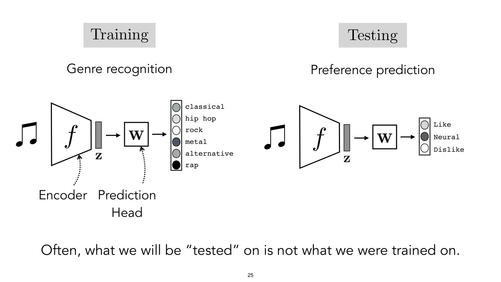

*Slide 25 — What we are tested on is often not what we were trained on: a genre classifier asked to predict whether users like the music. [Deck](https://ocw.mit.edu/courses/6-7960-deep-learning-fall-2024/mit6_7960_f24_lec11.pdf)*

- **Linear adaptation** (slide 26): "freeze f, train a new linear map to new target data". The readout "might, in this
  case, be a linear operation, which would be called a linear probe, or it could be MLP, or something else"
  (≈31:01–31:48).
- **Finetuning** (slide 27): "initialize f’ as f, then continue training on new target data", so "you just continue
  to do backprop to update to find some fine-tuned perturbation of your parameters" (≈31:48–32:36).

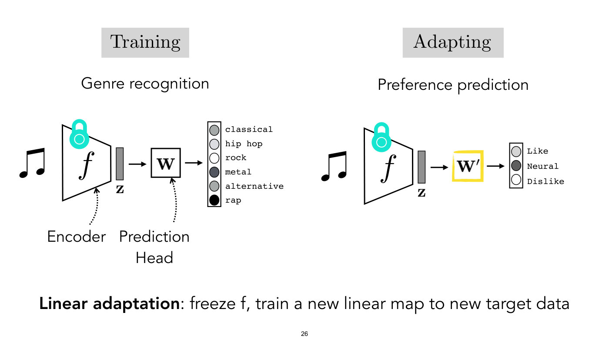

*Slide 26 — Linear adaptation: freeze the encoder (the padlocks) and train only a new linear readout. [Deck](https://ocw.mit.edu/courses/6-7960-deep-learning-fall-2024/mit6_7960_f24_lec11.pdf)*

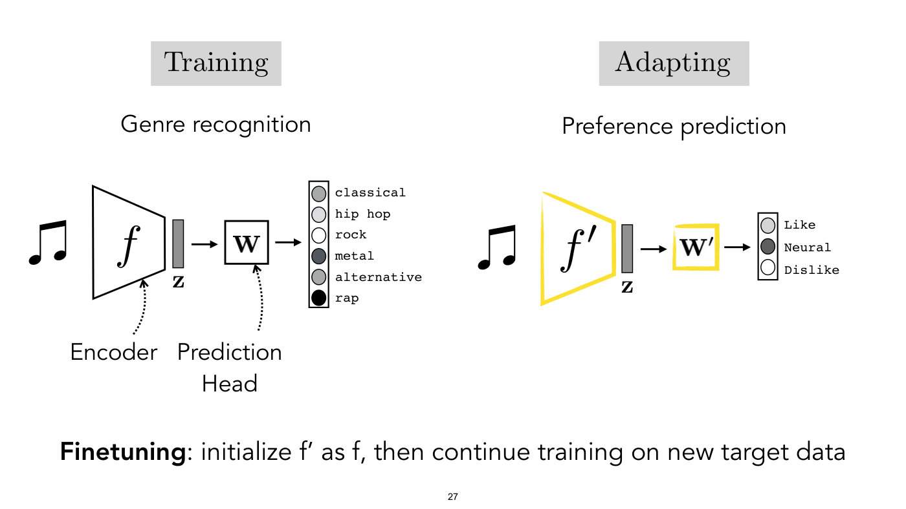

*Slide 27 — Fine-tuning: start the encoder from f and keep training all of it on the new task. [Deck](https://ocw.mit.edu/courses/6-7960-deep-learning-fall-2024/mit6_7960_f24_lec11.pdf)*

The phases have "new names … pre-training and post-training" (≈31:48). Slide 28 lays out the transfer-learning
paradigm, "what is typically done for real-world problems": **pretraining** on "A lot of data", **adapting** on "A
little data", and **testing** (≈32:36–33:22). Pretraining can use a lot of data because it "doesn't require as much
knowledge about what the final task is going to be"; autoencoders and contrastive learning are such methods (≈33:22).
"If you're ever going to play with deep nets, you'll download a pre-trained system, and you'll fine-tune it."

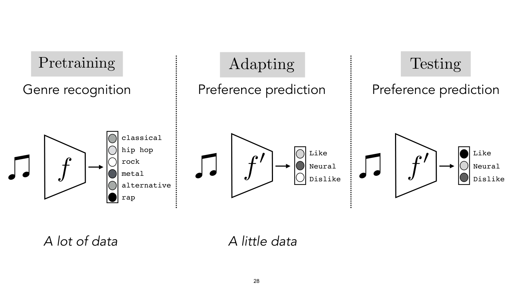

*Slide 28 — The transfer-learning paradigm: pretrain on a lot of data, adapt on a little, then test. [Deck](https://ocw.mit.edu/courses/6-7960-deep-learning-fall-2024/mit6_7960_f24_lec11.pdf)*

Slide 29 states the recipe: pretrain a network on task A, resulting in parameters $\mathbf{W}$ and $\mathbf{b}$;
initialize a second network with some or all of $\mathbf{W}$ and $\mathbf{b}$; train it on task B, resulting in
$\mathbf{W}'$ and $\mathbf{b}'$. It is called fine-tuning "because we assume the W prime is just a minor modification
of W", and you can do "all kinds of interesting network surgery" in choosing which weights to copy (≈33:22–34:10).

### Learning from little data

"A lot of people think of deep learning as the thing you do when you have a ton of data. But I think the real point of
deep learning is it's the thing you do that enables learning from little data … And the way you learn from little data
is by pre-training on massive data" (≈34:10–34:56). "That's a little trick that happened that people didn't quite
expect"; people had hoped for "some algorithm that's just better at learning", "but this works better" (≈34:56).

Three questions from the class follow.

- **How much is massive?** There is no precise answer and "the ratio is always becoming more extreme", but a language
  model might be pretrained on "10 trillion tokens", while fine-tuning "is typically something that you can do on Colab
  yourself in a few minutes or hours": "a trillion pre-training tokens and a million or less fine-tuning tokens, so the
  ratio is many orders of magnitude" (≈35:42–36:27). Linear probes and low-rank fine-tuning "will come in a future
  lecture".
- **What if your domain has no pretrained model?** "Are you allowed to use a language models pre-training that's
  trained on internet talking and text? And the empirical answer is, yes. That often actually works decently well."
  With a really big gap "it might not work as well", but "if you fine-tune a language model trained on the internet on
  almost anything, it will help" (≈37:14–38:00).
- **What is the theory?** The big question is "when and why does training on task A on data A help on task B and data
  B?" Empirically "it just generally works pretty well, more than people maybe thought. Theoretically, I would say it's
  very much an open question"; the lecturer points to Sanjeev Arora's papers and talks, "but I would say it's in its
  early days" (≈38:00–38:45).

See [transfer learning](transfer-learning.md).

## What makes a representation good?

Slide 31 lists the properties, and the lecturer adds the reasons (≈39:32–43:23):

1. **Compact** (*minimal*). Compact features use less memory, and by "an Occam's razor generalization theory type of
   analysis … the more compact representations will be somehow simpler and generalize better" (≈39:32–40:17).
2. **Explanatory** (*sufficient*): "Minimal, they're very low-dimensional or low-information, but sufficient, that they
   are sufficient statistics for solving your tasks". The cards on slide 31, a building, a car and a road, are "meant to
   be like a minimal sufficient representation for semantic understanding of a scene. Just three things and where they
   are, but not all the weird, photometric details" (≈40:17–41:04).
3. **Disentangled** (*independent factors*): the factors of variation separated "into independent dimensions, so
   axis-aligned representation" (≈41:04).
4. **Interpretable**, which a student proposes before the lecturer reaches it. It differs from explanatory: explanatory
   means the machine can use the representation to solve problems, interpretable that "a human can use that
   representation to solve problems and understand things" (≈41:04–41:51).
5. *Make subsequent problem solving easy*. "Think of the Fourier transform. It's a representation of data that makes
   convolution really easy. It makes convolution just into a product" (≈42:36–43:23).

The class adds unit variance or other "nice numerical properties", context awareness, and robustness: "you don't want it
to be you can just add a little noise to the data and, suddenly, the representation will go crazy" (≈41:51–42:36).
Slide 31 points to Bengio's "Representation Learning" (2013) for more.

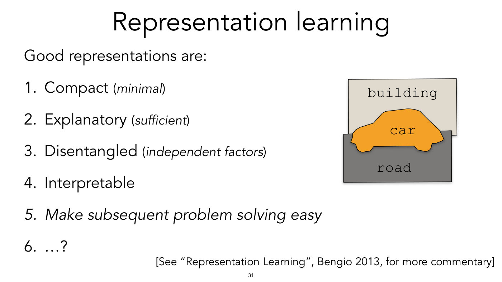

*Slide 31 — Good representations are compact, explanatory, disentangled and interpretable; the building, road and car cards are a minimal sufficient description of a scene. [Deck](https://ocw.mit.edu/courses/6-7960-deep-learning-fall-2024/mit6_7960_f24_lec11.pdf)*

## Learning without labels

One way to get a representation is to train on whatever task you have and hope, "just like supervised learning"
(≈43:23). Slide 32 writes **supervised learning** as learning from examples, pairs $\lbrace x^{(i)}, y^{(i)} \rbrace$
fed to a learner that outputs $f : X \to Y$:

$$f^{\ast} = \arg\min_{f \in \mathcal{F}} \sum_{i=1}^{N} \mathcal{L}(f(\mathbf{x}^{(i)}), \mathbf{y}^{(i)})$$

The lecture turns to methods that "don't target some supervised task, they just try to learn good representations
generically": **unsupervised** or **self-supervised learning**, where the data "is not xy pairs, but it's just x" (slide
33, ≈43:23). What comes out can be embeddings, clusters or metrics (slide 34). "A metric is a function of x1 and x2, so
it's a bivariate function as opposed to an embedding, which is a univariate function"; metrics are the next lectures'
subject (≈44:11).

"In my opinion, there's two general principles for how to learn a good vector embedding without having an explicit
supervised task": **compression**, "find a good compression of your data", and **prediction**, "be able to predict
missing data when you hold that data out" (≈44:11–44:58). Slide 35 sorts six methods by principle:

| Learning Method | Learning Principle | Short Summary |
| --- | --- | --- |
| Autoencoding | Compression | Remove redundant information |
| Contrastive | Compression | Achieve invariance to viewing transformations |
| Clustering | Compression | Quantize continuous data into discrete categories |
| Future prediction | Prediction | Predict the future |
| Imputation | Prediction | Predict missing data |
| Pretext tasks | Prediction | Predict abstract properties of your data |

Below it: "(Question: are these actually different?)". "If you want to, you can actually even see the compression
prediction as fundamentally the same. I'm not sure if there's really a difference, but at least it's useful,
intuitively" (≈44:58).

## Autoencoders

### Learning via compression

Take an image, find a vector embedding, then a lower-dimensional one and a lower-dimensional one again, "by constructing
a neural network, where the width decreases as a function of depth" (slides 36–37, ≈44:58–45:43). That gives a compact
code $\mathbf{z}$, but "I also need it to be sufficient and explanatory of the data. I don't want to just map my input to
0, right? I want to map it to something that actually still can reconstruct the data". So a second network decodes the
image back from the code (slide 38, ≈45:43–46:31). "Think of image as just a placeholder for whatever data you want to
put there." That is the **autoencoder**: "Just map the data to a simpler form such that you can decode the original data
from that simpler form. Autoencoders is just such a beautiful idea" (≈46:31). Slide 38 cites Hinton and Salakhutdinov
(Science, 2006), though "This is not the original reference for autoencoders"; "I'm not sure there's a single inventor
… it's an idea that's existed for centuries in some form or another" (≈47:20).

### The objective

Slide 39 draws it on the data-space and representation-space cartoon: the encoder $f$ maps $\mathbf{x}$ to $\mathbf{z}$,
the decoder $g$ maps $\mathbf{z}$ back to $\hat{\mathbf{x}}$ in data space, and the gap between $\hat{\mathbf{x}}$ and
$\mathbf{x}$ is the reconstruction error:

$$f^{\ast}, g^{\ast} = \arg\min_{f, g} \mathbb{E}_ {\mathbf{x}} \lVert \mathbf{x} - g(f(\mathbf{x})) \rVert_2^2$$

"Encode x into a lower-dimensional format, decode it back to the original dimensionality should be an identity. G of f
should be an identity" (≈48:06). The representation circle here need not really be a Gaussian; for that "we'll have to do
something called variational autoencoders. We'll come to that later" (≈47:20–48:06).

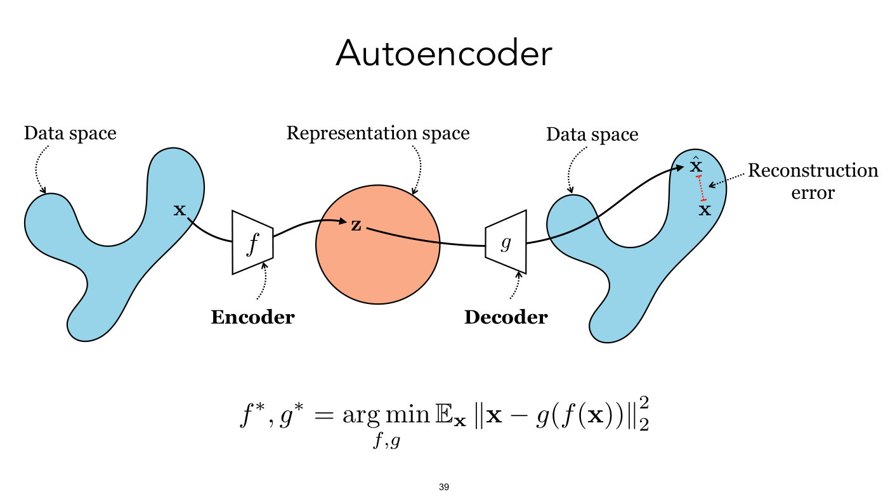

*Slide 39 — The autoencoder: f encodes x to z, g decodes z to a reconstruction, and training shrinks the gap to x. [Deck](https://ocw.mit.edu/courses/6-7960-deep-learning-fall-2024/mit6_7960_f24_lec11.pdf)*

### The hypothesis space does the work

Slide 40 writes the **$L_2$ autoencoder** as a learning problem. The objective is
$\mathcal{L}(F(\mathbf{x}), \mathbf{x}) = \lVert F(\mathbf{x}) - \mathbf{x} \rVert_2^2$, and the hypothesis space is
$F = g \circ f : \mathbb{R}^N \to \mathbb{R}^M \to \mathbb{R}^N$, with "Typically, M\<N". The funny thing is that the big
function $F$ "should ideally just be an identity. It should do nothing. So the objective is trivial … If I had no
constraints on the architecture, on the hypothesis space, the autoencoder would be a trivial thing to learn, and it would
have no utility." It "works because you put constraints over the architecture", mapping a high-dimensional space to a
lower-dimensional embedding and back (≈48:55–49:41). Some variants impose simplicity on the embeddings "in other ways than
dimensionality reduction", but for vanilla autoencoders $M \lt N$ (≈49:41).

### Linear autoencoders are PCA

"What if f and g are both linear?" (slide 41, ≈49:41). A student says it will be another linear function; another says
"the equivalent of PCA" (≈50:27). "PCA can be understood as trying to maximize the variance I'm capturing in the signal
via some linear orthogonal transformation of the vector. And if I'm maximizing the variance, I'm able to best reconstruct.
And that actually is exactly equivalent to the L2 reconstruction objective" (≈50:27–51:15).

The lecturer works through it in words. With linear maps, the encoder is a matrix $\mathbf{W}_ f$ and the decoder a matrix
$\mathbf{W}_ g$, and the objective asks that encoding and then decoding the data matrix give back the data matrix. "PCA is
a variant of this, where we assume that the encoder and decoder are the same matrix W", constrained to be orthogonal:
"It's a slightly different setting, but it's almost the same" (≈51:15). Under that condition the reconstruction objective
becomes minimizing "the variance in x minus the variance in the transformed version of x"; the first term does not depend
on $\mathbf{W}$, so dropping it and changing sign leaves "maximize the variance captured in the reconstructions", the
familiar form of PCA (≈52:00). The result, as slide 41 states it: "Then the embedding spans the same M-dimensional subspace
as PCA" (≈52:50). The equations he worked through are not in the OCW deck, which prints only those two lines.

So "an autoencoder, the very best representation learning method in the family of reconstruction based representation
learning is just nonlinear PCA. That's a generalization of PCA to nonlinear representations" (≈52:50). He adds that
ChatGPT "has gotten incredibly good at this": for "a concept in this class, not a homework question", "just ask ChatGPT,
or Claude, or whatever language model you prefer … Anyway, of course, they can be wrong" (≈52:50–54:21).

### An experiment: shapes and colours

"Are autoencoders actually learning good representations?" Besides saving memory, "do I get any other advantage out?"
(≈54:21). The data set is coloured shapes, "three different shapes — triangle, circle, and square. And we have nine or so
different colors" (slide 42), the same kind of data as a problem set (see [below](#the-problem-set)).

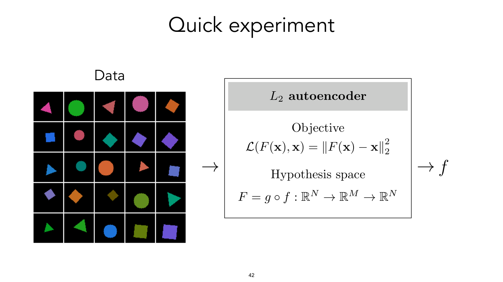

*Slide 42 — The coloured-shapes data set fed to an L2 autoencoder. [Deck](https://ocw.mit.edu/courses/6-7960-deep-learning-fall-2024/mit6_7960_f24_lec11.pdf)*

The first probe is a **nearest-neighbour probe**: embed a query image to $\mathbf{z}$ and look at the images whose
$\mathbf{z}$ vectors are nearest (slide 43, ≈55:12). The neighbours of a triangle are "other triangles that are roughly the
same color", and of a square, blue squares. "This is saying that our representation space has organized the data in a way
that seems meaningful and seems to match human perception" (≈55:12–55:59).

The second asks *where* the representation becomes effective. A **one-nearest-neighbour classifier** asks whether the
nearest neighbour in the data set has the same colour class, or the same shape class, as the query, and slide 43 plots its
accuracy at every layer of a convolutional encoder (≈55:59–56:46). Shape accuracy rises with depth, from about 75% at layer
0 to 99% at layer 6; colour accuracy falls, from about 73% to 58%.

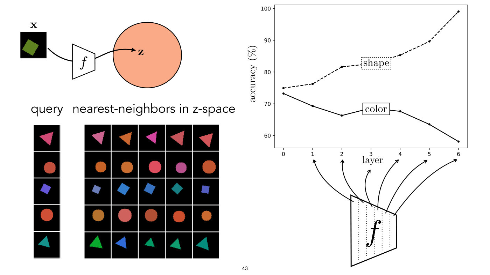

*Slide 43 — With depth the autoencoder's representation gets better at shape and worse at colour. [Deck](https://ocw.mit.edu/courses/6-7960-deep-learning-fall-2024/mit6_7960_f24_lec11.pdf)*

Why does colour not improve? A student suggests something like principal components, one for shape and one for colour,
which "would be if I had the linear autoencoder, that might be exactly what it does" (≈56:46). Another: "You don't need that
much stuff to decode color" (≈57:32). The lecturer's answer: pixel space is itself a representation, and "color is very
superficial and explicit in pixel space … Shape is not explicitly represented in pixel space. If I do L2 distance between
two images represented as pixels … it won't put similar shapes near each other, but it will put similar colors near each
other" (≈57:32). So "every representation is good at some things and bad at other things, and there's trade-offs …
autoencoding doesn't strictly result in better representations. It results in different representations. That's a
fundamental principle. All representation learning is making trade-offs to reformat the data into a way that makes some
tasks easier … and other tasks harder" (≈58:19).

## Clustering and vector quantization

"I said autoencoders are the deep learning version of PCA. And now I'm going to say that another model is the deep learning
version of k-means. So PCA and k-means are the two most important models, and everything else is just a generalization of
them. That's just some opinionated statement" (≈58:19–59:04).

### Clustering as an encoder to integers

Clustering assigns each data point to a cluster. "A representation-learning lens on clustering is you're learning an encoder
that doesn't output a vector. It outputs an integer", $f : \mathcal{X} \to \lbrace 1, \ldots, k \rbrace$, applied at
inference to colour the data by cluster (slide 44, ≈59:04–59:52). Written as a one-hot code, the output is "a vector
embedding, but it's just a one-hot vector embedding that's isomorphic with the integers" (≈59:52).

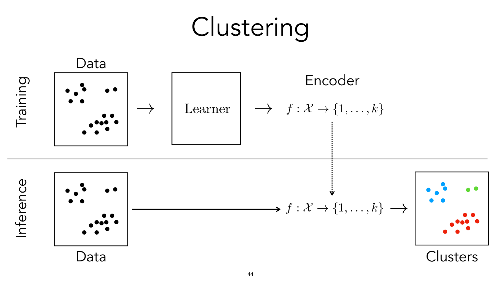

*Slide 44 — Clustering as representation learning: an encoder that outputs an integer for each data point. [Deck](https://ocw.mit.edu/courses/6-7960-deep-learning-fall-2024/mit6_7960_f24_lec11.pdf)*

"What's the best representation that the human brain has discovered?" A student says words, "That was my answer"
(≈1:00:38). "I come from a computer vision background, and so this is kind of blasphemy, I suppose. But I think language is
just the best representation of the world that humans have discovered … And words are the atoms of language." "One rough
definition of word is it's just like it is a symbol that denotes a set, and that's what clustering is doing", so
"Clustering is the problem of making up new words for things" (slide 45, ≈1:00:38–1:01:23).

### k-means is an L2 autoencoder

k-means "finds k different clusters in your data. And each cluster is represented with what's called the mean", mapping
each data point to an integer so that it "is as close as possible to the mean of the data points in the cluster it is
assigned to" (slide 46, ≈1:01:23–1:02:08). In the representation-learning view (slide 47), the encoder outputs one-hot codes
and the decoder is "like a lookup table. It takes in a one-hot code, and it outputs a vector": "Think of g as a matrix W
applied to a one-hot code. It selects a row of that matrix" (≈1:02:08–1:02:54). Every item of a cluster gets the same code
and so the same decoded vector, and the vector that minimizes the L2 distance to a set of points is their mean, as a student
answers. "So that means that k-means is an L2 autoencoder" (≈1:02:54).

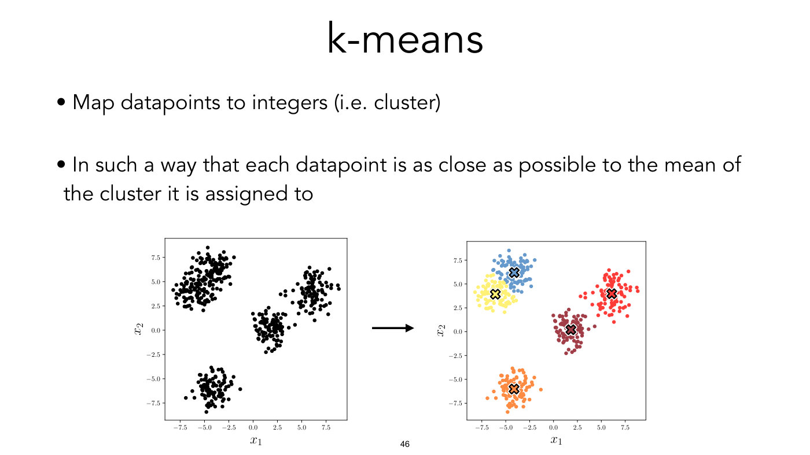

*Slide 46 — k-means assigns each point to the cluster whose mean is nearest; the crosses are the means. [Deck](https://ocw.mit.edu/courses/6-7960-deep-learning-fall-2024/mit6_7960_f24_lec11.pdf)*

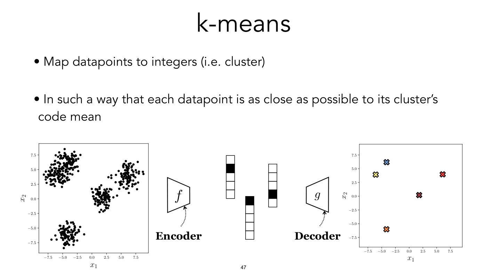

*Slide 47 — k-means as an encoder to one-hot codes and a decoder that looks up each code's mean. [Deck](https://ocw.mit.edu/courses/6-7960-deep-learning-fall-2024/mit6_7960_f24_lec11.pdf)*

Slide 48 writes it in the same box as the $L_2$ autoencoder: the objective is unchanged, the hypothesis space is
$F = g \circ f : \lbrace \mathbf{x} \rbrace_{i=1}^{N} \to \lbrace 1, \ldots, k \rbrace \to \mathbb{R}^M$, "f and g are both
lookup tables", and the optimizer is "Block coordinate descent". "The only difference from the other autoencoder that I showed
you is that the hypothesis space doesn't have a low-dimensional bottleneck. It has an integer bottleneck" (≈1:03:42). This
hypothesis space "is not differentiable", but it has structure that can be exploited, "So we optimize it with a different
algorithm than SGD. And that's where you might have encountered the expectation maximization method for doing k-means"
(≈1:03:42); the slide calls the optimizer block coordinate descent.

### VQ nets

"What if f and g are both deep nets? Then we call this a **'Vector Quantized' Autoencoder** (e.g., VQVAE, VQGAN)" (slide 49,
citing van den Oord, Vinyals and Kavukcuoglu, 2017). Its objective is the same reconstruction loss "+ …", its hypothesis space
the same integer bottleneck, and its optimizer "Backprop w/ approximations". "These have bells and whistles, but this is the
gist of it … it's just k-means with deep nets" (≈1:04:28). A student asks whether it learns the best $k$: "No … k is a
hyperparameter and, typically, the user has to define it" (≈1:05:15).

Data compression, then, "shows up in PCA, and k-means, and VQVAEs, and VQGANs, and autoencoders" (≈1:05:15). See
[autoencoders](autoencoders.md).

## Learning by prediction: self-supervised learning

"Rather than learning representations by compressing data, we're going to try to learn representations by predicting
held-out data" (≈1:05:15). Slides 50 to 52 set three schematics side by side. Data compression maps data $\mathbf{X}$ through a
bottleneck to $\hat{\mathbf{X}}$ (slide 50). Label prediction maps data to a label $y$ (slide 51), which "induces an OK
representation" for its task, but ties the representation to "a specific task" and needs humans to label it (≈1:06:02). Data
prediction, "aka 'self-supervised learning'", maps some data $\mathbf{X}_ 1$ to a prediction $\hat{\mathbf{X}}_ 2$ of other data
(slide 52). "It's called self-supervised learning because it's using the machinery of supervised learning, meaning predict y
from x, except that we define y as being some part of the raw data as opposed to some label" (≈1:06:02). "So this is like an
autoencoder, except I'm predicting half of the data from the other half of the data. And interestingly, this works really well.
This tends to work a lot better than autoencoders" (≈1:06:50).

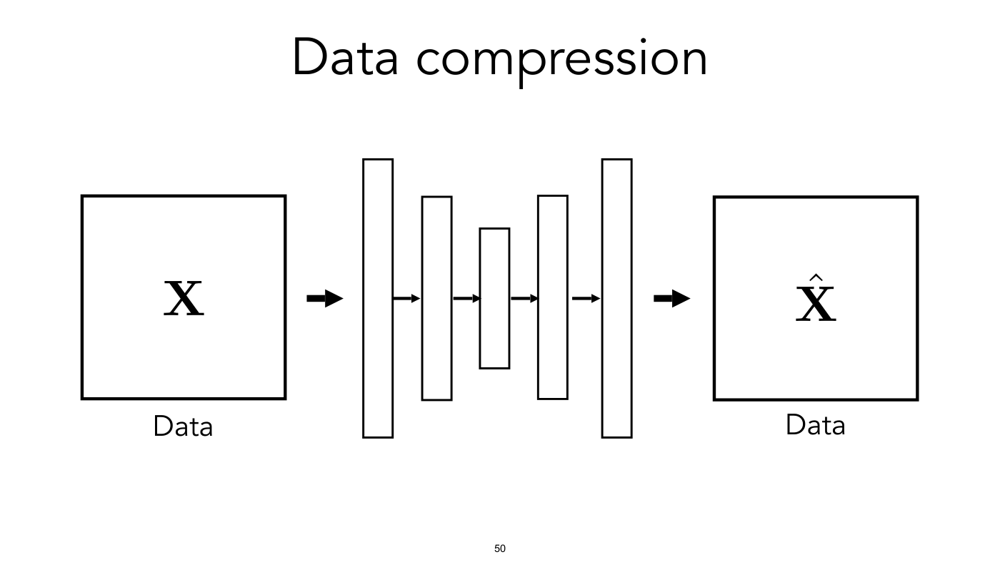

*Slide 50 — Data compression: reconstruct the input through a bottleneck. [Deck](https://ocw.mit.edu/courses/6-7960-deep-learning-fall-2024/mit6_7960_f24_lec11.pdf)*

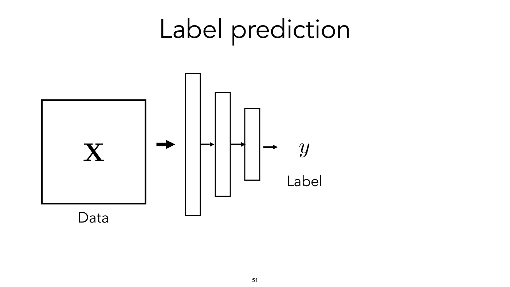

*Slide 51 — Label prediction: the supervised route, which ties the representation to a task. [Deck](https://ocw.mit.edu/courses/6-7960-deep-learning-fall-2024/mit6_7960_f24_lec11.pdf)*

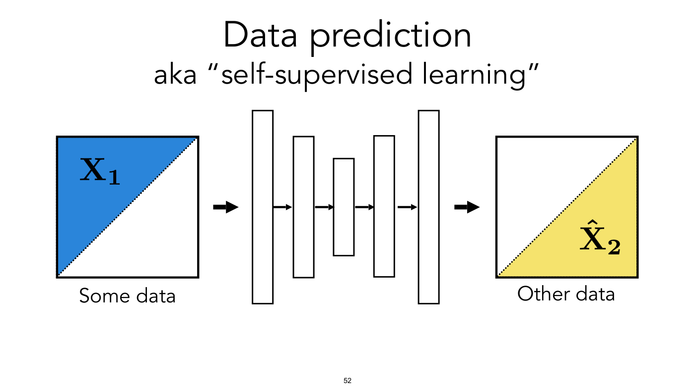

*Slide 52 — Data prediction, aka self-supervised learning: predict one part of the data from another. [Deck](https://ocw.mit.edu/courses/6-7960-deep-learning-fall-2024/mit6_7960_f24_lec11.pdf)*

### Colorization

The example is "the colorization problem I showed you before" (lecture 9): predict the colour channels of an image from its
black-and-white channel (slide 53, [Zhang, Isola, Efros, ECCV 2016]). Slide 53 writes the input as the grayscale L channel,
$\mathbf{X} \in \mathbb{R}^{H \times W \times 1}$, and the output as the ab colour channels,
$\widehat{\mathbf{Y}} \in \mathbb{R}^{H \times W \times 2}$. "It's free labels because color images have the colors built in"
(≈1:06:50–1:07:35).

What do its neurons learn? Probing layer 5 with deep net electrophysiology (slide 54), the class guesses textures, which "seem
to be — color is kind of low level", and objects, because "Different classes of objects have different colors": "If I know
something's strawberry, I can say it's probably red" (≈1:07:35–1:08:22). Slide 55 shows neurons at conv5 that fire on faces,
dog faces and flowers, with the feature maps blacked out below a threshold (≈1:08:22–1:09:08). Lower layers do respond to
textures. "But the interesting thing is that it doesn't really matter how you train these networks. If you train them to
predict classes, if you train them to predict colors, if you train them to inpaint missing pixels … the units that carve the
world at its joints, that are predictive of everything, turn out to be objects and semantics and the words that humans have.
So it's like words are not arbitrary. We have the words we have because they're very predictive statistically of missing data.
So this is discovery of semantic words without any semantic labels" (≈1:09:08).

That, the lecturer says, "has been the big finding over the last decade that led to this revolution in how we do deep learning,
which was the move from supervised learning to self-supervised learning" (≈1:09:53).

### Pretext tasks and imputation

The common trick (slide 56): "Convert 'unsupervised' problem into 'supervised' empirical risk minimization", "by cooking up
'labels' (prediction targets) from the raw data itself — called **pretext task**". Slide 57 sets three side by side: class
prediction, which "would be called supervised learning of representations", future frame prediction and next pixel
prediction; the last two are self-supervised "because no human had to provide the label target" (≈1:09:53–1:10:38).
Language models, which "predict the next word in a sequence", are "mostly in the family of this type of learning": "It happens
the raw data is semantic and is words, but … They're just predicting the next word" (≈1:10:38). See
[autoregressive models](autoregressive-models.md).

"All of these self-supervised tasks can be understood as something we call **imputation**": take your data, a matrix or a
tensor ("A video would be like time by x by y"), mask part of it, encode the rest, and decode a prediction of the masked part
(slide 58, ≈1:10:38–1:11:26). "Masked prediction or imputation is the standard pretext tasks that people like to use these days
to learn representations." Slide 58's examples are spatial imputation, with half of an image or scattered blocks of it masked,
and channel imputation, colours from the grayscale; in words, "Spatial imputation, just predict the next pixel from the previous
pixel. Temporal imputation — predict the next frame from the previous frame. Channel imputation — predict the colors from the
black and white" (≈1:11:26).

## Masked autoencoders and BERT

Framed "just like an autoencoder, again", masked prediction is a **masked autoencoder**: "you take your data, you mask random
chunks of it" (slide 59, [He, Chen, Xie, et al. 2021], ≈1:11:26–1:12:14). Applied to images it uses a vision transformer, which
already chops the image into patches and maps them to tokens (lecture 8), "And so they just said, well, what if I just remove
some of the tokens, and then I predict the missing tokens?" (≈1:12:14).

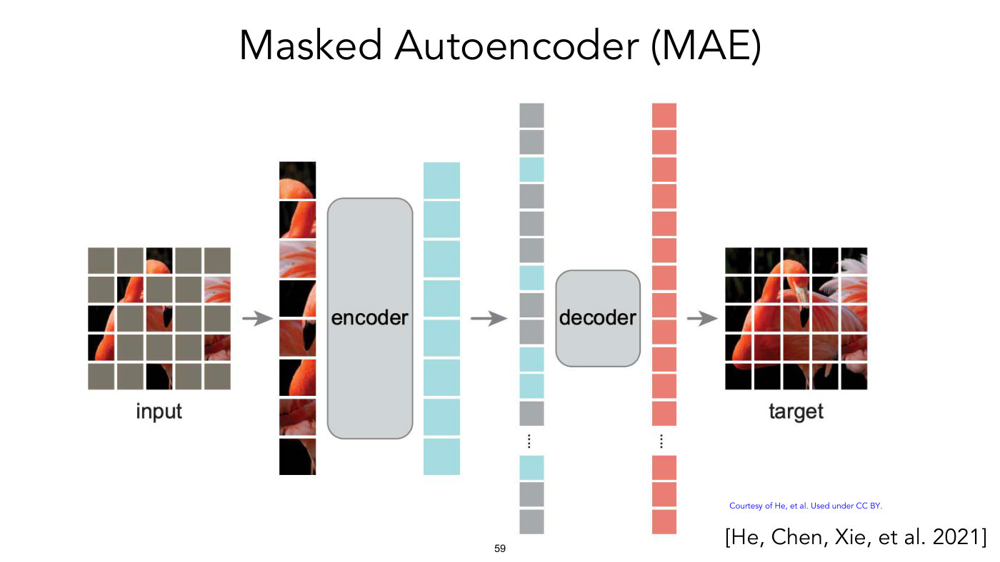

*Slide 59 — The masked autoencoder encodes only the visible patches; blank tokens for the masked ones are added before the decoder, which predicts the whole image. [Deck](https://ocw.mit.edu/courses/6-7960-deep-learning-fall-2024/mit6_7960_f24_lec11.pdf)*

"The really interesting thing about the attention architecture is that I can mask different ratios. I can only keep four of these
tokens, but then the attention mechanism will scale in a way that is proportional to the number of tokens": four tokens attend to
four, eight to eight, "So it has this nice kind of architectural invariance to the number of tokens you put in". To decode, "I just
have some blank tokens I put into another transformer", trained so that they "get filled in with the prediction of the pixels in
the missing tokens" (≈1:12:14–1:13:01). See [transformers](transformers.md).

"Masked autoencoders are just a new name for another model which was very popular called BERT" (≈1:13:01). Engineering it for
language rather than vision "is a very important difference but, conceptually, they're almost the same thing": tokenize text, mask
some tokens, run a transformer and predict the tokens (slide 60, ≈1:13:47). "And the autoregressive models that try to predict the
next word in a sentence are just the same, except they're only masking the final word as opposed to interleaving words. And that
has some advantages in that I can decode in sequential order" (≈1:13:47).

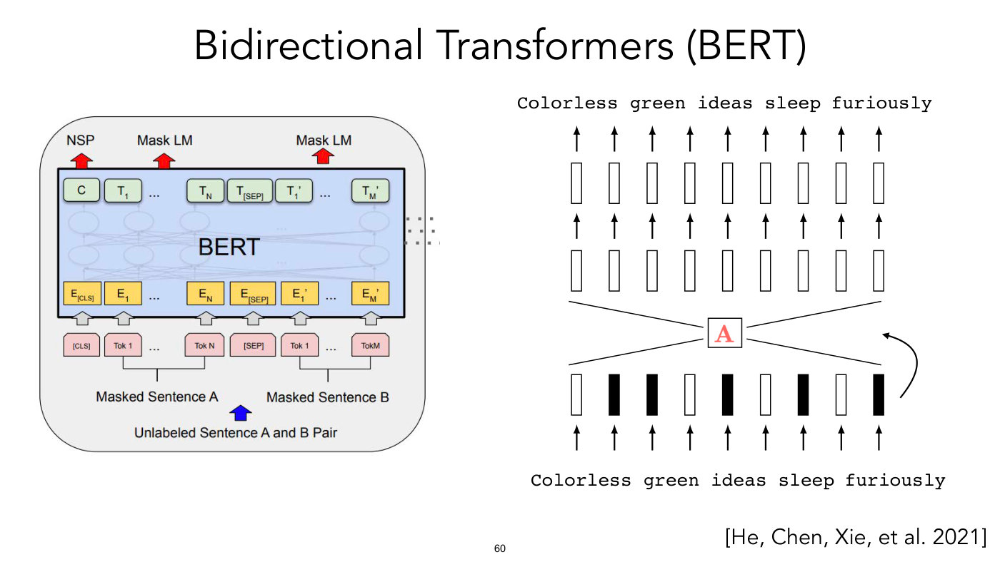

*Slide 60 — BERT: mask some tokens of a sentence and predict them; the masked autoencoder is the same idea on image patches. [Deck](https://ocw.mit.edu/courses/6-7960-deep-learning-fall-2024/mit6_7960_f24_lec11.pdf)*

Why has BERT gone out of fashion? Masking the final token "can be used for generating sentences autoregressively"; masking in the
middle is "like I'm generating words out of temporal order". In conversation, "time is an axis that is important and not symmetric
with other axes. I have to answer the question after the question has been asked", so causal masking "just fits into language
models". Once that became popular, "the biggest models were all masking only the tokens in the future … And because those were the
biggest models, they just worked the best. But if I want to learn a sentence embedding, I bet the BERT method is still going to work
better if scaled the same amount" (≈1:14:33–1:15:20).

## Why does masked prediction beat autoencoding?

"Masked prediction just tends to always work better than autoencoding", shown in the colorization paper "but it's been shown in a lot
of work" (≈1:15:20). Slide 61 compares an autoencoder with colorization layer by layer, by how well a linear classifier on each
layer's representation decodes ImageNet categories, "like a probe, just like we were doing with the shapes" (≈1:16:06). "As I go
deeper in the network, you get this separation, where autoencoding learns an OK representation, but masked prediction learns a
representation which is more semantic." The autoencoder's accuracy peaks at about 20% around conv2 and pool2 and falls to 12–14% by
conv5 and pool5, while colorization's climbs past 30% from conv3 on.

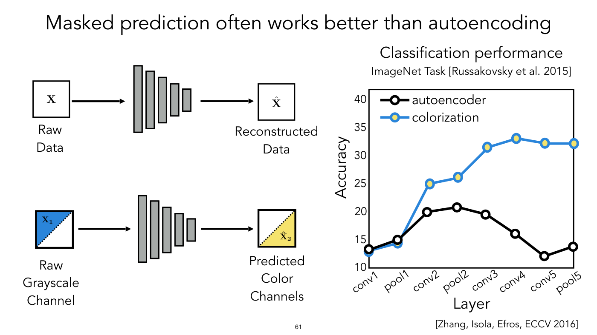

*Slide 61 — Predicting colour from grayscale gives representations that classify ImageNet far better, from the middle layers on, than reconstructing the input does. [Deck](https://ocw.mit.edu/courses/6-7960-deep-learning-fall-2024/mit6_7960_f24_lec11.pdf)*

"This is something that I thought I had a good explanation for, and then I realized I don't. So I'm going to call it ongoing science
and leave it as a puzzle for the class. And maybe this would be a good final project" (≈1:16:06). Slide 62 gives three hypotheses:

1. "It's hard to control compression via a dimensional bottleneck." Masked prediction controls compression differently, "by the
   non-overlap between the outputs you're predicting and the inputs you're conditioning on": only the mutual information between them
   helps, so it forgets whatever is specific to the inputs (≈1:16:52). A dimensional bottleneck "requires an architecture that has
   constraints on the dimensionality", and "anything with low dimension and deep learning just is hard. It interacts with optimization
   in weird ways and interacts with BatchNorm and LayerNorm in weird ways" (≈1:16:52–1:17:41).
2. "Autoencoders have shortcuts where they can copy part of the input and get a decent loss." What if an autoencoder had residual
   connections between $f$ and $g$? A student answers that it would not force the low-dimensional representation: "It skips the
   bottleneck. So there's all these little gotchas like that" (≈1:17:41). Autoencoders may tend "to copy the local information that
   they're processing", a decent solution "even though it would be better for them to capture global properties"; the slide calls
   these traps local minima "even if global minimizer is in fact good" (≈1:17:41–1:18:30). See [skip connections](skip-connections.md).
3. "Masked prediction is closer to the downstream problems we care about, which are mainly about prediction" (≈1:18:30).

The lecturer asked Kaiming He, the masked autoencoder's first author, "And he said, well, at the end of the day, it's just empiricism"
(≈1:18:30). "Still an open question!" (slide 62).

A student asks why, then, the lecturer thinks autoencoders will win out. "It just goes back to some first principle argument that I
can't really prove", along the lines of Occam's razor and "formalisms of that the compression is somehow equivalent to prediction.
And the most compressed representation will make the most accurate predictions about the future … if compression is all you need, then
autoencoders are all you need. I think there's more to say about that. I don't have time right now" (≈1:18:30–1:20:05).

## The cake

The lecture ends on Yann LeCun's cake (slide 63, a slide of his pasted whole): "intelligence is like this cake … where the bulk of the
cake is representation learning", learned "in a self-supervised way or an unsupervised way, not tied to any specific task"
(≈1:20:05). His slide counts the information the machine is given: "A few bits for some samples" in pure reinforcement learning, the
cherry; "10→10,000 bits per sample" in supervised learning, the icing; and "Millions of bits per sample" in self-supervised learning,
the cake génoise. "Self-supervision is about not having labels, but it's also about not being narrow and tied to a task. It's just
generally compress the universe into something that's predictive of the future and is compact … So he's making the point that
representation learning is the bulk of intelligence, and I agree with that point" (≈1:20:05).

The summary (slide 64), which the lecturer leaves to be read online (≈1:20:51): deep nets learn *representations*, "just like our
brains do"; this is useful "because representations transfer — they act as prior knowledge that enables quick learning on new tasks";
representations "can also be learned without labels, which is great since labels are expensive and limiting"; and of the many ways to
learn without labels, this lecture saw "representations as compressed codes" and "representations as predictions of missing data".

## The problem set

The lecturer says "You'll do some of these experiments on this same type of data on your p set 3" (≈54:21). On OCW the coloured-shapes
experiments are in **Homework 4**, whose second section, "Reconstruction and Similarities in Representation Learning" (12 points), works
on a data set of $64 \times 64$ images of coloured shapes varying in shape, location and colour. Its autoencoder question (6 points)
defines the objective as the mean squared error between $g(f(\mathbf{x}))$ and $\mathbf{x}$ over the training set, with
$f : \mathcal{X} \to \mathbb{R}^d$ and $g : \mathbb{R}^d \to \mathcal{X}$. It asks what a perfect solution on a finite training set can
and cannot determine (a sample's index, its colour, whether two red samples sit closer than a red and a blue one, and the same for unseen
samples), then has you implement the reconstruction loss, visualize the trained encoder by nearest neighbours on training and validation
images, and explain any clusters you see, since "The Autoencoder objective alone … doesn't enforce any grouping or smoothness of the
representation space". The section's other question, on contrastive learning, belongs with lecture 12. See [sources](../sources.md).

## See also

- [Representation learning](representation-learning.md) — the concept page: layers as representations, from lecture 1's preview through
  this lecture's definitions, probes and properties.
- [Autoencoders](autoencoders.md) — the autoencoder, its linear case (PCA), k-means and VQ nets, and masked autoencoders.
- [Self-supervised learning](self-supervised-learning.md) — pretext tasks, imputation, colorization, BERT, and why masked prediction beats
  reconstruction.
- [Transfer learning](transfer-learning.md) — pretraining, linear probes and fine-tuning.
- [Normalization layers](normalization-layers.md), [activation functions](activation-functions.md) and
  [softmax and cross-entropy](softmax-and-cross-entropy.md) — what each layer does to a distribution of points.
- [Lecture 10 — Architectures: Memory](10-architectures-memory.md), the previous lecture.
