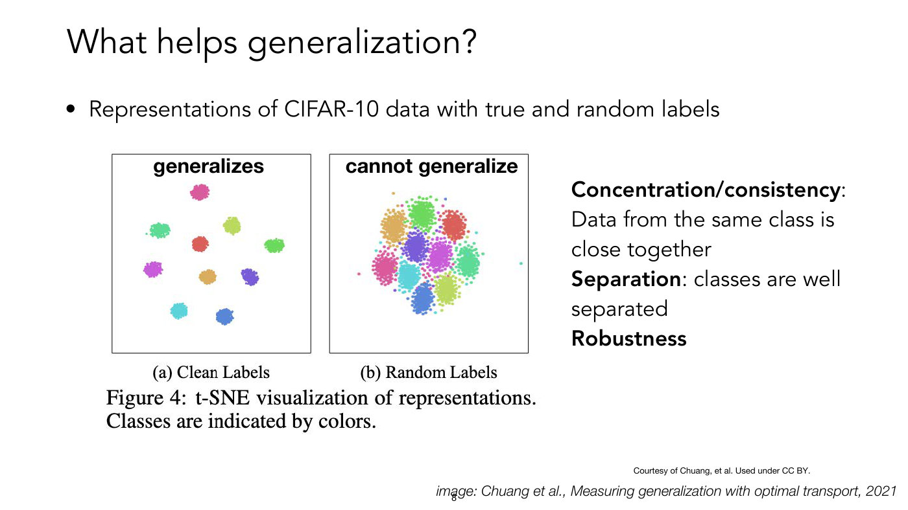
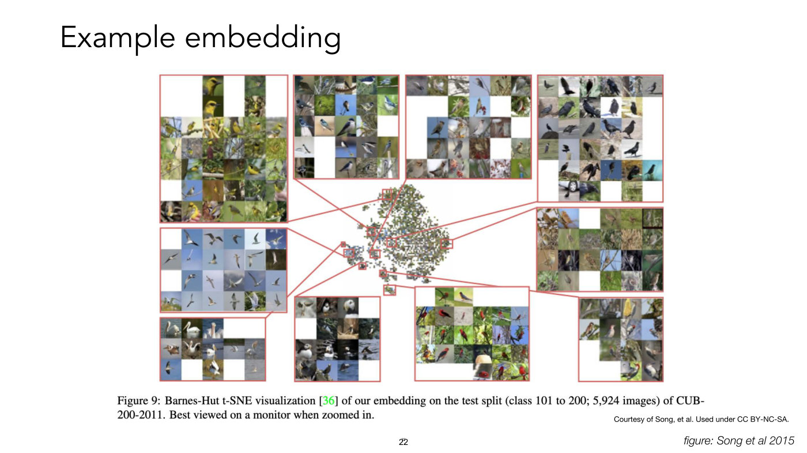
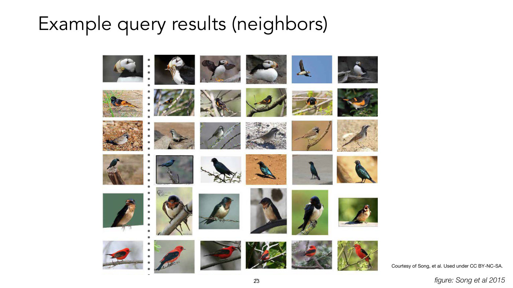
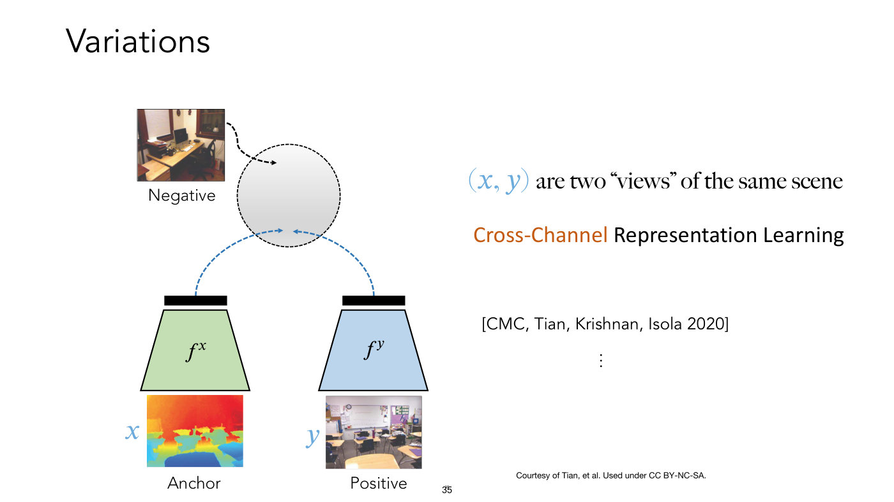
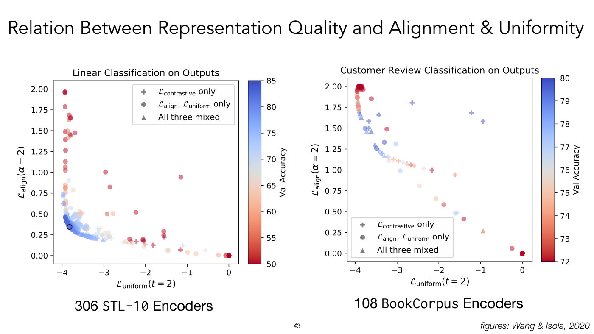
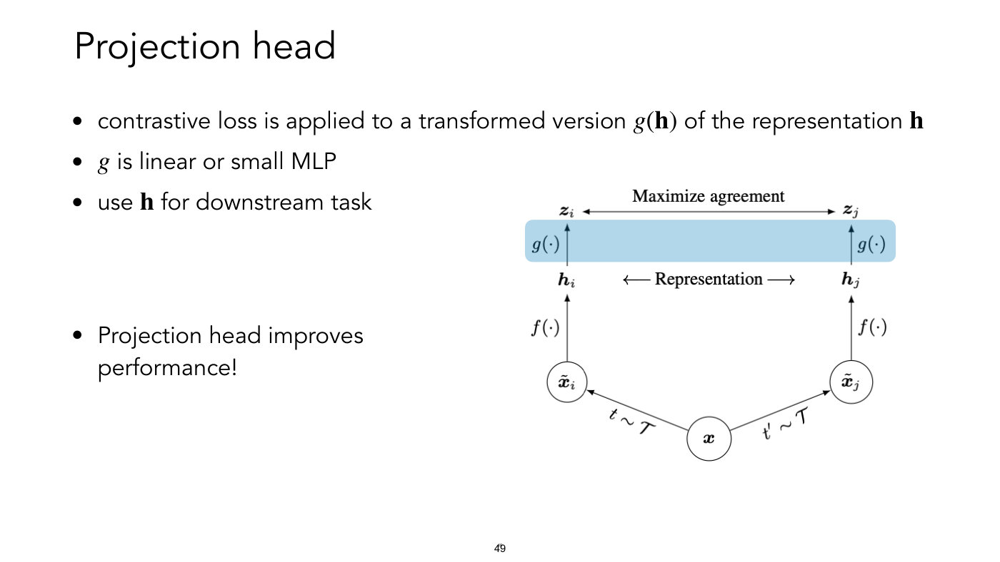
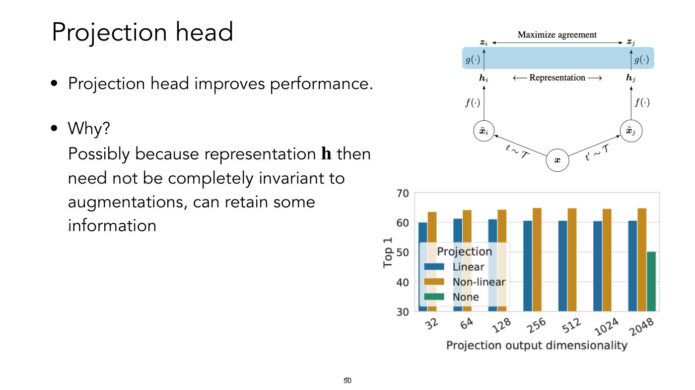
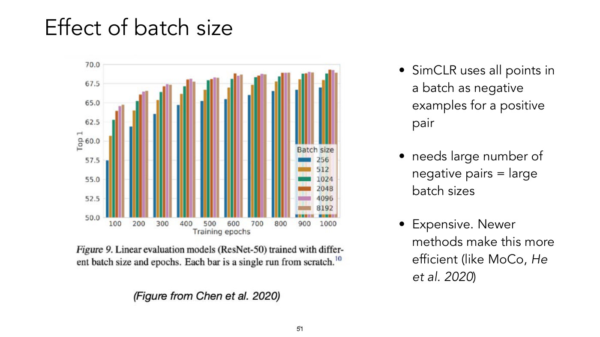

# Lecture 12 — Representation Learning: Similarity-Based

**Lecturer:** Sara Beery ·
**Video:** [youtube.com/watch?v=yUh1fEGGdl4](https://www.youtube.com/watch?v=yUh1fEGGdl4) (76 min) ·
**Slides:** [`mit6_7960_f24_lec12.pdf`](https://ocw.mit.edu/courses/6-7960-deep-learning-fall-2024/mit6_7960_f24_lec12.pdf)
(70 pages; the deck is titled "Lecture 12: Similarity-based Representation Learning"; transcribed slide by slide in [`raw/slides/12-representation-learning-similarity-based.md`](../raw/slides/12-representation-learning-similarity-based.md)) ·
**Transcript:** [`raw/transcripts/12-representation-learning-similarity-based.md`](../raw/transcripts/12-representation-learning-similarity-based.md)

## What this lecture establishes

[Lecture 11](11-representation-learning-reconstruction-based.md) learned representations by compressing or predicting
the data. This lecture learns them from **similarity**: the training signal says which pairs of inputs should end up
close together and which far apart. It opens with a list of what a good representation should be (compact,
explanatory, concentrated, separated and robust; slide 9), and then follows one line of methods. **Metric learning**
(2003) learns a linear map under which Euclidean distance respects given similar and dissimilar pairs, which makes it a
Mahalanobis distance. **Deep metric learning** replaces the linear map with a neural network and trains it with
**contrastive losses** such as the triplet loss. **Self-supervised contrastive learning** removes the labels: two
augmentations of the same image are a positive pair, other images are negatives, and the loss is a softmax
cross-entropy over inner products on a hypersphere, as in SimCLR.

Two ingredients make it work. The loss encourages **alignment** (positives together) and **uniformity** (everything
spread over the sphere), and the choice of pairs decides what the representation becomes **invariant** to. A case study
on iNaturalist 2021 shows the limit of that second ingredient: contrastive learning without labels nearly matches
supervised learning on ImageNet but falls about 30 points behind it on fine-grained species, because "for contrastive
learning to work well, you need to have a good similarity measure for your problem of interest" (≈1:07:16).

The lecturer calls contrastive learning "a pretty important point throughout this entire course because it turns out
that many of our modern architectures are built on top of some form, or some component of contrastive learning and
contrastive representations" (≈0:46).

**Notation on this page** follows the slides. A data point is $\mathbf{x}$, the **encoder** is $f$, and the
representation of a point is $\mathbf{z} = f(\mathbf{x})$. In a triplet, $\mathbf{x}$ is the **anchor**, $\mathbf{x}^+$
a **positive** (similar to it) and $\mathbf{x}^-$ a **negative** (dissimilar). For linear metric learning, $\mathbf{W}$
is the learned matrix and $\mathbf{A} = \mathbf{W}^\top \mathbf{W}$. In the self-supervised setup, $\mathbb{S}^{d-1}$ is
the unit hypersphere in $\mathbb{R}^d$, $N$ is the number of negatives, and $\tau$ is the temperature that divides the
inner products. For the projection head, $\mathbf{h}$ is the representation used downstream and $g$ maps it to the
space where the loss is applied.

The deck's title, "Lecture 12", matches the recording, and the deck prints no other lecture number. Its roadmap (slide 2)
is: representation learning, why?; what is a "good" representation?; metric learning; contrastive representation learning
(self-supervised), with "What does it do?" and "Models". Slides 55–68 are borrowed from Elijah Cole ("Slide: Elijah
Cole"), whose work the case study presents (≈1:09:36).

**Licence.** OCW marks 37 of this deck's 70 pages "excluded from our Creative Commons license", including nearly every
photograph and the whole iNaturalist case study, so most of the lecture's pictures exist in this knowledge base only as
prose in the slide file. Eight slides are shown below as images.

## Why learn representations?

Slide 3 gives five reasons: to improve generalization; to do more learning (transfer learning); to exploit geometric
similarity for new data or queries ("Have we seen the face of this person before or is it new?" and "Retrieval: which
items are similar to the query?"); to improve clustering with side information (similar and dissimilar pairs); and
dimensionality reduction, often unsupervised. The students supplied most of them first: "Use it for many tasks", "Maybe
more compact", "Generalization" (≈1:33–2:20). The lecturer adds that compactness is "a choice. You can actually build a
representation that's larger than your data input" (≈2:20). Geometric similarity covers a face that should look the same
"regardless of maybe the lighting, the pose, the orientation", and retrieval: "here's something I just found, have we
ever seen something similar to this before?" (≈3:05–3:51).

## What makes a representation good?

Asked what to expect from such representations (slide 3's closing question), a student answers that objects similar in
meaning should map to nearby points. The lecturer draws out two reasons. Closeness makes the representation robust: "if
you move a little bit in any direction, ... you're not moving far away from things that same semantic category". And it
makes the next step easy: "it's useful if the space is linearly separable. ... if different objects that are the same are
close together, and objects that are different are not close together ... then you just draw lines between things"
(≈4:40–6:12).

Slide 4 quotes Goodfellow et al. (2016): "Generally speaking, a good representation is one that makes a subsequent
learning task easier." Slide 5 gives the first two properties. **Compact (minimal)**: "it's not too big. We don't want to
have more capacity than we actually need." **Explanatory (sufficient)**: it captures "the dimensions that matter in our
original data", which depends on the downstream task, "because something that is sufficient to be explanatory for one
possible thing might be insufficient for another" (≈6:12–6:59).

Slide 6 shows the NeurIPS 2020 competition "Predicting Generalization in Deep Learning", which asked "can we build
complexity measures that accurately predict the generalization of models?" from the representation. Its "3 winning
strategies look at: Geometry of representation: consistency, separation" and "Robustness to perturbations" (slide 6,
≈7:45–8:30).

Slides 7 and 8 show what that geometry looks like, with t-SNE plots of a CIFAR-10 classifier's representations of its
training data (Chuang et al., 2021). Trained on the true labels, the ten classes form "a very consistent and separable
training space ... somewhat uniformly distributed in this space". Trained on random labels, "you still will get clusters
because the model can learn to memorize. But what you see is that those clusters are much less concise ... And they are
much less separable", so a small move "pretty quickly" crosses into another class (≈9:16–10:03). Slide 8 labels the first
"generalizes" and the second "cannot generalize".

*Slide 8 — Clean labels give tight, separated clusters ("generalizes"); random labels give fuzzy clusters packed together ("cannot generalize"). [Deck](https://ocw.mit.edu/courses/6-7960-deep-learning-fall-2024/mit6_7960_f24_lec12.pdf)*

Slide 9 completes the list of five properties of a good representation:

1. Compact (*minimal*);
2. Explanatory (*sufficient*);
3. Concentration: data from the same class is close together;
4. Separation: classes are well separated;
5. Robustness to irrelevant perturbations.

Robustness means not crossing a class boundary under a change that should not matter: "if you saw me from this angle,
you'd want to be robust to me looking the other direction. It's still Sara. It's not, somehow, a completely different
class" (≈10:50). The slide ends: "How could we encourage a model during training to achieve this?"

## Similarity as the training signal

The answer this lecture develops is to "Encourage good representations via feedback in terms of similarity: pairs of
similar/dissimilar inputs", which can be done unsupervised or supervised (slide 10). "You're not just looking at one
example at a time. You're actually looking at two or maybe three examples and giving information to the model about what
should be similar and what should be dissimilar" (≈11:37).

The lecturer motivates it with an example "from psychology". Asked to describe an elephant to someone who has never seen
one ("very big and bulky", "large ears", a trunk), you leave "almost an infinite set of things that might have those
characteristics". Asked to describe it to someone who knows a rhinoceros, you say "take a rhinoceros, but add a long
trunk, and then maybe add some big ears", and they are "much more likely to have an understanding of what that thing is
because I understand similarity and then these small contrastive differences" (≈12:23–13:55). Species identification is
taught the same way: "I'll say it looks a lot like this other bird, but the important differences are the spot near the
eye and the color of the legs" (≈13:55).

## Metric learning

"Euclidean distance in input space may be not ideal", for example "between all the pixels in one image and another".
Metric learning instead learns "a metric that respects desired properties": data points that "belong together" are
similar (close together) and data points that are "different" are dissimilar (far apart), with similarity information as
the supervision (slide 11, ≈14:43). Slide 11's example is three photographs of the course's instructors: "the two images of
Phil should be closer together because they're both Phil, and the image of me would be far apart because I'm not Phil"
(≈14:43–15:28).

### A linear metric is a Mahalanobis distance

Slide 12 sets up the linear case. There are data points $\mathbf{x}_ 1, \ldots, \mathbf{x}_ n$ and only weak supervision,
two sets of pairs:

$$\mathcal{S} := \lbrace (\mathbf{x}_ i, \mathbf{x}_ j) \mid \mathbf{x}_ i \text{ and } \mathbf{x}_ j \text{ are in the same class} \rbrace$$

$$\mathcal{D} := \lbrace (\mathbf{x}_ i, \mathbf{x}_ j) \mid \mathbf{x}_ i \text{ and } \mathbf{x}_ j \text{ are in different classes} \rbrace$$

The supervision is "not exactly the distances between things or how similar or dissimilar they are", only which pairs
share a category (≈15:28). The goal is a linear transformation $\mathbf{z} = \mathbf{W}\mathbf{x}$ that respects
similarity, measured by Euclidean distance in the representation space. Expanding that distance gives

$$\Vert \mathbf{z}_ i - \mathbf{z}_ j \Vert^2 = (\mathbf{x}_ i - \mathbf{x}_ j)^\top \mathbf{W}^\top \mathbf{W} (\mathbf{x}_ i - \mathbf{x}_ j),$$

so the learned distance is set by $\mathbf{A} = \mathbf{W}^\top \mathbf{W}$, a positive semidefinite matrix: "We like
positive semidefinite matrices because they're easy to work with mathematically" (≈16:14). This is the **Mahalanobis
distance** with matrix $\mathbf{A}$, written $d_{\mathbf{A}}(\mathbf{x}_ i, \mathbf{x}_ j) = \Vert \mathbf{x}_ i - \mathbf{x}_ j \Vert_ {\mathbf{A}}$
(slide 12). Learning an optimal $\mathbf{A}$, which is an optimal $\mathbf{W}$, gives "this transformation that
preserves similarity and difference maximally" (≈17:00). (Slide 12 sets the expansion in plain type; in the recording the
lecturer says "the distance between zi and xj", where the slide has $\mathbf{z}_ i$ and $\mathbf{z}_ j$.)

### Upper and lower bound constraints

The paper that "defined the term metric learning, and they call it distance metric learning" is Xing, Ng, Jordan and
Russell, "Distance metric learning, with application to clustering with side-information" (2003), which "introduced the
term and problem" (slide 13, ≈17:51). It sets an optimization problem with a constraint:

$$\min_{\mathbf{A} \succeq 0} \sum_{(i,j) \in \mathcal{S}} d_{\mathbf{A}}(\mathbf{x}_ i, \mathbf{x}_ j)^2 \quad \text{s.t.} \quad \sum_{(k,\ell) \in \mathcal{D}} d_{\mathbf{A}}(\mathbf{x}_ k, \mathbf{x}_ \ell)^2 \geq 1$$

The objective is labelled "min distance of similar points" and the constraint "keep distance of dissimilar points"
(slide 13). In the lecturer's words, "you're trying to bring the things that are similar as close together as possible,
while enforcing that there is at least some margin" from anything dissimilar (≈18:36). One "can swap objective and
constraint (upper bound for similar pairs)", and there are "many related ideas & follow-ups", such as
information-theoretic metric learning (Davis et al. 2007), which preserves "distribution information (relative entropy
between Gaussians) while observing upper/lower bounds as constraints" (slide 13, ≈18:36–19:24). The problem "really is
something that can be explicitly solvable" (≈18:36).

Slide 14 is the "simple example" from that paper: two classes, red and blue, in 3D, each split into two separated
clusters, so that a red and a blue cluster sit side by side twice over. After the learned projection each class is one
thin strip, clearly apart from the other. "The very, very simple optimal projection here would be just removing the
dimension ... And now they're very easily separable" (≈19:24–20:11).

### Deep metric learning and normalized representations

Slide 15 lists three developments: nonlinear transformations (kernels, deep metric learning); contrastive losses; and
normalization of representations, "angle instead of distance". Normalizing every representation onto the hypersphere
makes "distance ... essentially just equivalent to angle", so "you can look at inner products to measure similarity", and
"you don't end up having things that get really blown up by scale. You're removing the scale complexity" (≈20:57).

**Deep metric learning** replaces the linear transformation $\mathbf{z} = \mathbf{W}\mathbf{x}$ with a nonlinear one,
$\mathbf{z} = f(\mathbf{x})$, where $f$ is a neural network (slide 16). We "optimize not over psd matrices but weights of a
neural network", and "we can use things like stochastic gradient descent to do so" (slide 16, ≈21:45).

## Contrastive losses

### The intuition: relative similarity is easy to judge

Slide 17 shows three white moths on green leaves. Is the first the same kind as the second? "It's kind of hard to say,
right?" Shown a third, though, the students pick which two are the same kind at once (≈22:33). What counts as "the same"
depends on the category: all moths, white moths, white moths on green leaves, or species. "But it's actually very easy,
regardless of what you want your downstream task and the dimension of granularity to be to say those two are definitely
more similar than that one" (≈23:19).

### The triplet loss

"So the way we translate this into machine learning is we try to build a loss that explicitly says that the distance
between dissimilar pairs must be much larger than the distance between similar pairs" (≈23:19). The first such loss is
the **triplet loss** (Schroff et al. 2015, slide 18):

$$\mathcal{L}_ {\text{triplet}}(\mathbf{x}, \mathbf{x}^+, \mathbf{x}^-) = \sum_{\mathbf{x} \in \mathcal{X}} \max\left(0, \thinspace \Vert f(\mathbf{x}) - f(\mathbf{x}^+) \Vert_ 2^2 - \Vert f(\mathbf{x}) - f(\mathbf{x}^-) \Vert_ 2^2 + \epsilon\right)$$

Here $\mathbf{x}$ is the anchor, $\mathbf{x}^+$ "a positive example of the same as that anchor point", and $\mathbf{x}^-$
"a negative example that's different", and $\epsilon$ is the **margin**. The loss demands that "the distance between the
anchor and the negative example has to be bigger than the distance between the anchor and the positive example, plus some
margin", and "penalizes if that condition is not met" (≈24:06). Slide 18 also points to a related method, Large-margin
Nearest Neighbor metric learning (LMNN; Weinberger et al. 2009).

Slide 19 pictures one update. Before it, the model "had put this first horse, the anchor horse x, and this monkey closer
together than the anchor horse and this other horse"; the gradient of the loss pushes the horse and the monkey apart and
pulls the two horses together (≈24:54).

The network that computes it is a **triplet network** (slide 20): "You run all three of them through the same
convolutional neural network. You calculate embeddings for all three. You take a triplet loss over those three different
embeddings ... and then you back propagate" (≈24:54). The three branches share their weights.

### Many negatives per positive

Slide 21's improvement is to "compare to multiple negatives per positive pair", as in the **lifted structured loss**
(Song et al. 2015), which compares "to all negatives in a batch":

$$\mathcal{L}_ {\text{struct}} = \frac{1}{2\vert \mathcal{P} \vert} \sum_{(i,j) \in \mathcal{P}} \max\left(0, \mathcal{L}_ {\text{struct}}^{(ij)}\right)^2$$

$$\text{where } \mathcal{L}_ {\text{struct}}^{(ij)} = D_{ij} + \max\left( \max_{(i,k) \in \mathcal{N}} \epsilon - D_{ik}, \thinspace \max_{(j,l) \in \mathcal{N}} \epsilon - D_{jl} \right)$$

Here $D_{ij} = \Vert f(\mathbf{x}_ i) - f(\mathbf{x}_ j) \Vert_ 2$; the slide does not define $\mathcal{P}$ and
$\mathcal{N}$, which from their use are the positive and the negative pairs; and it adds "or smooth relaxation of the max"
(slide 21). The lecturer
explains the gain as training efficiency: "you can load an entire batch ... And then you can construct every possible
triplet of positive and negative and calculate the loss over those", "making the best use of the batch you've already
loaded in" (≈25:44). It also makes it likelier to find **hard negatives**: when a triplet already satisfies the margin,
"you don't get any signal. So the easy stuff doesn't actually help you train" (≈26:30).

### What a learned embedding looks like

Slide 22 shows a triplet-style embedding of birds from Song et al., a t-SNE map of the test split of CUB-200-2011 (the
Caltech-UCSD Birds data set), with enlarged patches of the map: yellow birds together, crows together, pelicans together,
gulls and terns in flight together. "Things that are similar tend to be clustered close together" (≈26:30).

*Slide 22 — A learned embedding of bird photographs: each enlarged patch of the map holds one kind of bird. [Deck](https://ocw.mit.edu/courses/6-7960-deep-learning-fall-2024/mit6_7960_f24_lec12.pdf)*

Asked what else it has learned beyond species, a student answers "Environment". One cluster is terns, but "they're also
all pretty much birds that are flying and mostly birds that are flying against a blue sky. So you can imagine that
similarity here has may be picked up on some more stuff than just maybe what we might be interested in" (≈27:18).

Slide 23 queries the same embedding: each row is a query photograph followed by its five nearest neighbours, and each row
returns the same kind of bird in other poses and settings. "You start to learn that things that look similar are similar
and things that look different are far apart" (≈28:05).

*Slide 23 — Nearest neighbours in the learned embedding: each query returns the same kind of bird in different poses and backgrounds. [Deck](https://ocw.mit.edu/courses/6-7960-deep-learning-fall-2024/mit6_7960_f24_lec12.pdf)*

### What makes an image "similar"?

Slide 24 shows nine triplets of photographs (butterflies, gallery rooms, pantry shelves, water lilies and so on) from a
study by Fu, Tamir, Sundaram et al. (2023), "a paper, actually, of Phil's, where they explicitly asked humans what they
thought was the most similar". Images can be "Similar in: Pose, Perspective, Foreground color, Number of items, Object
shape". "There's a lot of different ways that things can be similar. And what's the most useful way ... is probably going
to be contextualized by some downstream task that we're interested in" (slide 24, ≈28:05–28:53).

### Hard negatives

Which pairs should training present? Slide 25: "hard" negatives, which are "currently 'misplaced', i.e., closer to anchor
than a positive example", and which "accelerate learning, needed for triplet loss". Its figure (Kaya and Bilge's survey
of deep metric learning, 2019) sorts negatives $n$ for an anchor $a$ and positive $p$ by distance $d$:

- hard negatives, $d(a, n) \lt d(a, p)$;
- semi-hard negatives, $d(a, p) \lt d(a, n) \lt d(a, p) + \mathit{margin}$;
- easy negatives, $d(a, p) + \mathit{margin} \lt d(a, n)$.

"The more we can find the hard things, the more we train quickly" (≈29:40). The moths return as the example, three of them
stacked on slide 25. By pose, background colour and orientation, the first two "are actually more similar than this one
on the bottom, but in some of semantic categorization space, we want to know the type of moth"; the right answer is that
"these two moths at the bottom are the same and then that one at the top is different" (≈29:40–30:25). Pose and
background colour "are actually confounding dimensions right there. There are ways that we want our model to be invariant", and examples like these train
it faster (≈29:40–30:25).

## Self-supervised contrastive learning

All of this "assumes, though, that we already know the right answer". **Self-supervised contrastive representation
learning** takes "these ideas from metric learning and also self-supervision to build representation spaces that are not
explicitly supervised" (slide 27, ≈30:25).

### The common setup

The encoder maps data onto a hypersphere, $f : \mathcal{X} \rightarrow \mathbb{S}^{d-1}$, and the loss is a
"Cross-entropy for softmax 'classifier' to discriminate 'classes' defined by similarities" (slide 28):

$$\min_f \thinspace \mathbb{E}_ {(\mathbf{x}, \mathbf{x}^+) \sim p_{pos}, \thinspace \lbrace \mathbf{x}_ i^- \rbrace_ {i=1}^{N} \sim p_{data}} \left[ -\log \frac{e^{f(\mathbf{x})^{\top} f(\mathbf{x}^+)/\tau}}{e^{f(\mathbf{x})^{\top} f(\mathbf{x}^+)/\tau} + \sum_{i=1}^{N} e^{f(\mathbf{x})^{\top} f(\mathbf{x}_ i^-)/\tau}} \right]$$

The numerator is marked "pull positive pair together" and the sum over the $N$ negatives "push negative pairs apart"
(slide 28). Because the representations lie on the sphere, the comparison is an inner product: "we want to make sure that
the inner product is as close as possible to 1 because that would mean that they were as close as possible on this
sphere. And now instead of minimizing distance, we can maximize that inner product that minimizes the angle" (≈32:43). The
positive pairs are assumed to satisfy two conditions (slide 28):

- **Symmetry**: $p_{pos}(\mathbf{x}, \mathbf{x}^+) = p_{pos}(\mathbf{x}^+, \mathbf{x})$ for all
  $\mathbf{x}, \mathbf{x}^+$, so "the distance should basically be the same no matter whether your first one is the anchor or
  the second one is the anchor";
- **Matching marginal**: $\int p_{pos}(\mathbf{x}, \mathbf{x}^+) \thinspace d\mathbf{x}^+ = p_{data}(\mathbf{x})$, so
  "if we marginalize over one of those partners, we would end up with the data distribution" (≈33:31).

Slide 29 names the family: noise-contrastive estimation (NCE; Gutmann and Hyvärinen 2010) and the **InfoNCE loss** (van den
Oord et al. 2018), "similar losses also in metric learning" (≈34:22). Trained this way, with an input forced to match
"itself after running it through a bunch of different augmentations", the representation "can outperform some supervised
pretraining" (≈34:22); slide 30 says "As self-supervised learning, can outperform supervised pre-training (for some tasks)"
and cites He et al. 2020 and Misra and van der Maaten 2020. Why would leaving out supervision help? "If our supervision is
not well-aligned with the actual task that we want to use the representation for, we might learn dimensions of
invariance or dimensions of variance that are explicitly unhelpful", while self-supervision "might actually be better for
a bunch of different possible downstream tasks, but not necessarily better for everything. It's a little bit nuanced"
(≈35:07).

### Why a hypersphere?

Slide 31 gives two reasons: "more stable training (logistic regression needs regularization)", and "well-clustered
classes on hypersphere are linearly separable (cut off caps)". Its figure (Wang and Isola 2020) slices a cap of cat
photographs off a sphere ringed with dogs, cars and aircraft. "You can always build a linear classifier, just a slice
through that hypersphere, that will actually be linearly separable" (≈35:54).

### Positives and negatives without labels

"How can we make this 'self-supervised'?" (slide 32). The negatives are "randomly uniformly drawn from data", and the
positives are "perturbations that keep semantic meaning, data augmentation" (slide 33). Slide 33's figure (Chen, Kornblith,
Norouzi and Hinton 2020) shows one dog photograph under ten treatments: original; crop and resize; crop, resize and flip;
colour drop; colour jitter; rotation; cutout; Gaussian noise; Gaussian blur; and Sobel filtering, which gives "this rough
edge kind of representation" (≈36:40).

**SimCLR**, "one of the original methods that explicitly tried to teach this type of self-supervised contrastive
learning", does it within a batch: "for each data point in the batch, generate 2 random augmentations as positive pair",
and "all other 2(B-1) augmented samples in the batch (of size B) are used as negatives" (slide 34, ≈37:26). "You want the
exact same thing under some reasonable perturbations to be mapped very close together" (≈37:26).

Three student questions sharpen the idea.

- *What if the data set holds several pictures of the same thing?* Then some negatives are really positives, and "these
  types of positive negatives, almost in a way, are confusing when you're actually learning these representations. And
  there's explicitly work that shows that if you can remove those, even by using something like explicit supervision, it
  can actually really improve a representation" (≈37:26–38:12; see slide 52 below).
- *What augmentations suit other data?* They are "data-specific", and each one is "a strong assumption that we're building
  in". If a downstream task must tell right shoes from left shoes, random flipping "makes that almost impossible because if
  you say this is a right shoe and this is a right shoe and this is a left shoe and this is a left shoe, your model is
  incredibly confused". For molecules, text or video, "You then would have to inject some domain knowledge in terms of
  what types of augmentations ... are reasonable" (≈39:00–39:47).
- *What makes two different golden retrievers end up close?* Nothing in any one training step. But pairs are sampled "over
  and over during training in many different combinations", and "more often than not, you're going to get two
  augmentations of a golden retriever and a boat, not two augmentations of a golden retriever and another golden
  retriever", so "it comes out in the noise kind of over time" (≈40:35–41:21).

### Other views of the same scene

Positives need not be augmentations. Slides 35–37 draw two encoders, $f^x$ and $f^y$, whose inputs $(x, y)$ "are two
'views' of the same scene", with a negative from elsewhere. Slide 35 is **cross-channel** representation learning (CMC;
Tian, Krishnan and Isola 2020), pairing a depth-like image with a photograph: representations "that
capture something about scene structure by explicitly leveraging RGB-D during training" (≈42:06). Slide 36 is **video**:
"frames randomly sampled from the same video as positives and a frame from another video as negatives", citing work from
"Slow Feature Learning" (Wiskott and Sejnowski 2002) to van den Oord, Li and Vinyals (2018) (≈42:06–42:52). Slide 37 is
**language and vision**, citing Karpathy, Joulin and Fei-Fei (2014) and CLIP (Radford, Kim et al. 2021); its anchor is not a
photograph but a caption, "A man is riding a horse in a desert", and its positive is the matching photograph (the slide's
labels print garbled and are decoded in the slide file): "You have the text
description of an image and the image itself. You try to push those together, and you try to push them far away from an
image that doesn't match that text description" (≈42:52).

*Slide 35 — Contrastive learning across views: two encoders for two channels of the same scene, with a negative from another scene. [Deck](https://ocw.mit.edu/courses/6-7960-deep-learning-fall-2024/mit6_7960_f24_lec12.pdf)*

"A lot of modern work actually really is just people coming up with creative ways to supervise models without requiring
labels because ... handcrafted, human-generated labels are very expensive" (≈42:52).

## What is contrastive learning doing?

There are "2 ingredients": the contrastive loss ("which specific form") and the data ("which positive/negative pairs")
(slide 38). By data the lecturer means not only the data set but "specifically which types of positive and negative pairs
we surface to the model over time" (≈43:43).

### Not just mutual information

The loss is a "cross-entropy loss to distinguish data points", and it "maximizes a lower bound on mutual information
between 'views'" (Poole et al. 2019), $\text{MI}(f(\mathbf{x}), f(\mathbf{x}^+)) \geq \log(N) - \mathcal{L}(f)$
(slide 39). Here $\mathcal{L}(f)$ is slide 28's loss written as a function of the encoder, which slide 39's first line names
$\mathcal{L}_ {cont}(f)$; the bound itself prints it without the subscript. But that is not
the whole story: a study showed that if "you just explicitly maximize mutual information alone, it actually worsened
downstream performance. And looser bounds with simpler critics led to better representation. So essentially, the
contrastive loss has to be doing something else" (≈44:28). The deck does not cite that study.

### Alignment and uniformity

Slide 40 recalls the properties, now named: "Concentration/Alignment: Data from the same class is close together,
remove irrelevant information"; "Separation: classes are well separated, do not lose information"; and robustness to
irrelevant perturbations. Alignment "is really built into that loss from the beginning. We're saying we want to pull
similar samples together" (≈45:15). Pushing every negative apart equally is **uniformity**: "the optimal way to do that
would be to cover the entire hypersphere because if we don't use part of the hypersphere, then there's actually a way we
could have pushed even further apart things that are different". With no labels, "Every class is, again, one point
because we've said that the only information we have is that this image is the same as itself under perturbations"
(≈46:03). Slide 41 draws both from Wang and Isola: two aircraft photographs under two encoders beside a sphere, and a ring of
dogs, cats, cars and aircraft spread evenly around a sphere, captioned "Uniformity: Preserve maximal information".

Slide 42 shows it happening. CIFAR-10 encoders trained with a circle as the feature space, $\mathcal{S}^1$, are plotted by
the density of their validation features. **Unsupervised contrastive learning** gives "this distribution that is properly
uniform around that circle"; **supervised predictive (NLL) learning** gives an uneven ring; and a **randomly initialized
network** is "far from uniform", a thin arc at the bottom (≈46:51).

To measure the two properties, the lecturer defines (without a slide; the OCW deck has none for this part) an alignment
metric, "the expectation over the distance between features for positive pairs ... how far apart do I think any two
positive examples are going to be in expectation", and a uniformity metric, "the logarithm of the expected pairwise
Gaussian potential, which is essentially e to the minus squared distance", which "puts more focus on the smallest
distances". The uniform distribution on the hypersphere "becomes the unique measure that minimizes expected pairwise
potential" (≈47:38–49:11). Taking the number of negatives to infinity, the contrastive loss splits into two expectations:
"the first term gets minimized if and only if f is perfectly aligned. All the things that are same are exactly the same
embedding. And then the second one is minimized if we get perfect uniformity" (≈49:11–50:49).

Because both are measurable, each trained encoder can be placed by its alignment and uniformity and coloured by its
validation accuracy. Slide 43 (Wang and Isola 2020) does this for 306 STL-10 encoders and 108 BookCorpus encoders: the
most accurate ones sit where both losses are lowest. "This kind of red that goes into blue that goes back into red
explicitly tells us in some nice, measurable way that alignment and uniformity are in fact good qualities for a
representation space", though "simpler data sets show this better than more complicated ones" (≈50:49–51:36).

*Slide 43 — Each point is a trained encoder, placed by its uniformity and alignment losses and coloured by accuracy; blue (high accuracy) sits where both are low. [Deck](https://ocw.mit.edu/courses/6-7960-deep-learning-fall-2024/mit6_7960_f24_lec12.pdf)*

### What the pairs teach: learned invariance

So the loss encourages alignment and separation, and slide 44 asks "What do the selection of positive and negative pairs
encourage?" Slide 45 answers: "positive pairs = augmentations of the same data point should be close", so the "learned
representation is invariant to perturbations induced by data augmentations: learned invariance". "Finding the 'right'
invariances can be challenging for different types of data" (the molecules and the shoes). The slide sets "Learned versus
hard-coded invariances" side by side and asks "when would we use which?" Some invariances can be built into the
architecture, "If you want to be symmetrically invariant, you could build symmetry directly into your representation";
others "can be really difficult to define mathematically", and augmentation builds them in "without actually being able
to mathematically define explicitly what it means to be, for example, invariant to pose within a scene" (≈52:23–53:56).
The slide points to a "geometric DL lecture", which no lecture of this course is titled; [lecture 9](09-hackers-guide-to-deep-learning.md)
is where augmentation is set against geometric deep learning (see [data augmentation](data-augmentation.md)).

Slide 46 completes the division of labour: the loss function encourages concentration (alignment) and separation, and the
**data** encourages robustness to **irrelevant** perturbations. "That robustness to perturbations is coming just from our
data" (≈53:56).

## Making it work: the SimCLR ingredients

Slide 47 lists the "Ingredients to make self-supervised CL work (better)", bracketed as the "SimCLR model": heavy data
augmentation, projection heads, large batch size (many negative examples), and the choice of data pairs and hard negative
examples. Heavy augmentation means "not just simple stuff, doing really, really weird things to your inputs within
reason" (≈53:56).

### Heavy data augmentation

Slide 48 (Grill et al. 2020) plots the "Decrease of accuracy from baseline" as transformations are progressively removed
(baseline, remove grayscale, remove colour, crop and blur only, crop only), for BYOL and for a reproduction of SimCLR. With
crop alone, SimCLR loses about 27 points and BYOL about 13 (values read from the plot). The lecturer gives the SimCLR
ablation as "significantly lower, like 15% almost lower, than if you use all of the entire set of augmentations"
(≈54:42).

### Projection heads

"contrastive loss is applied to a transformed version $g(\mathbf{h})$ of the representation $\mathbf{h}$"; $g$ "is linear
or small MLP"; and one should "use $\mathbf{h}$ for downstream task" (slide 49). The diagram is SimCLR's: an input
$\boldsymbol{x}$, two augmentations $\tilde{\boldsymbol{x}}_ i$ and $\tilde{\boldsymbol{x}}_ j$ drawn with $t \sim \mathcal{T}$
and $t' \sim \mathcal{T}$, an encoder $f(\cdot)$ to representations $\boldsymbol{h}_ i$ and $\boldsymbol{h}_ j$, and a
projection $g(\cdot)$ to $\boldsymbol{z}_ i$ and $\boldsymbol{z}_ j$, where agreement is maximized.

*Slide 49 — The projection head: the loss compares the projections z, but the representation kept for downstream tasks is h. [Deck](https://ocw.mit.edu/courses/6-7960-deep-learning-fall-2024/mit6_7960_f24_lec12.pdf)*

"Projection head improves performance. Why? Possibly because representation $\mathbf{h}$ then need not be completely
invariant to augmentations, can retain some information" (slide 50). The contrastive loss pushes augmentations of one
object "completely together", "But actually, maintaining some dimensions of variance to some of those differences, it
seems, may be a helpful thing. This isn't something that's been super formalized" (≈56:15–57:03). The lecturer sees a
parallel in transformers, "there's one set of projections where you're calculating similarity between things. And then
there's this other set of projections that you use to actually pass information", which suggests keeping "differences
between the representations we actually use to keep information and the representations we use to calculate similarity"
(≈57:03; see [transformers](transformers.md)). Slide 50's bar chart compares projection heads by output dimensionality
(32 to 2048): a non-linear head scores about 64–65 top-1, a linear one about 60–61, and no projection about 50.

*Slide 50 — A non-linear projection head beats a linear one at every output size, and both beat no projection at all. [Deck](https://ocw.mit.edu/courses/6-7960-deep-learning-fall-2024/mit6_7960_f24_lec12.pdf)*

### Large batches

"SimCLR uses all points in a batch as negative examples for a positive pair", so it "needs large number of negative pairs
= large batch sizes" (slide 51). Slide 51's chart (Chen et al. 2020) shows top-1 accuracy of linear evaluation for batch
sizes from 256 to 8192 over 100 to 1000 training epochs: larger batches are better, most of all early in training, and the
gap narrows as training goes on; after about 400 epochs the sizes from 2048 up level off, and 2048 is the best at 1000 epochs. At 100 epochs it runs from about 57.5 (batch 256) to about 64.7 (batch 8192); the
lecturer describes "the difference is close to 10%" early on (≈57:51).

*Slide 51 — Bigger batches mean more negatives and higher accuracy, with the largest gains early in training. [Deck](https://ocw.mit.edu/courses/6-7960-deep-learning-fall-2024/mit6_7960_f24_lec12.pdf)*

That is expensive: "This is another reason why ... NVIDIA is building GPUs that have bigger and bigger and bigger memory
because we need to be able to capture batch sizes that are really big". "Newer methods make this more efficient (like
MoCo, He et al. 2020)" (slide 51); MoCo "was an improvement upon SimCLR that explicitly tried to make ... the batch size
dimension a little bit more efficient" (≈58:41).

### Better negatives

"We are pushing apart negative pairs. Negative pairs are random pairs from the data" (slide 52), so some are **false
negatives**: two golden retrievers, one of which the model is told to push "outside of a margin far away", "which is
something we don't necessarily want" (≈59:29). Slide 52's chart (Chuang et al., debiased contrastive learning) plots top-1
accuracy against the number of negatives $N$, from 30 to 510: using only true negatives beats random pairs at every size,
by about 8 points at $N = 30$ and about 3 at $N = 510$. Removing the false negatives gives "much higher top one accuracy
downstream", but "this assumes that you have access to labeled data for all of your data points and that the labeled data
probably needs to align with the downstream task" (≈1:00:17).

### Supervised and semi-supervised contrastive learning

When some labels are available, they can supply positives. "Contrastive learning provides more geometric and robustness
feedback than cross-entropy loss"; the "Idea: in addition to data augmentation, use images from same class as positive
pairs (multiple positive pairs)" (slide 53, Khosla et al. 2020). In its figure a second dog, a negative under
self-supervision, becomes a positive under supervision. With labels for only some points, "you can use those positive
examples as anchors" (≈1:01:02).

## Case study: iNaturalist 2021

"Representation learning using similarity seems to be really powerful", and the lecture ends with a case study of where it
falls short, from work "led by Elijah Cole" (Cole et al., "When Does Contrastive Visual Representation Learning Work?",
CVPR 2022; slides 55 and 68, ≈1:01:02 and ≈1:09:36).

**The data.** iNaturalist 2021 has 10,000 species, 2.7M training images, 50k validation images and 500k test images (slide
54): "so it's not on the order of billions, but it's pretty big" (≈1:01:49). Its labels have "pretty explicit structure.
It's species, so you can look at the taxonomic tree" (≈1:01:49). Slides 55–58 draw the tree radially: near the root, the
split is coarse-grained, "the difference between Animalia and Plantae"; at the rim, "different species within the same
genera are going to probably be quite visually similar", such as two moths of the same genus (slide 58 names them *S.
umbilicata* and *S. ornata*). The tree gives "this proxy for the level of visual granularity in the classes", from kingdom
(coarse) to species (fine) (≈1:01:49–1:02:36). Slide 59 lays the seven levels along an axis, with the number of labels at
each: kingdom 3, phylum 13, class 51, order 273, family 1103, genus 4884, species 10000.

**The experiment.** A supervised model is trained from scratch on iNat21 only ("We're not starting with ImageNet or
anything"), and two self-supervised contrastive models, SimCLR and MoCo, are trained and evaluated "using a linear probe —
so that means basically taking a representation space and then just learning a linear projection that's going to
actually be our categorizer", with supervision (≈1:03:23). All are trained at the species level, and their predictions are
rolled up the tree to evaluate each coarser level: "we're basically training on the finest level, but then we're evaluating
our ability to categorize a coarser and coarser levels" (slide 63, ≈1:04:09).

**The result** (slides 60–66). The three curves nearly agree at kingdom, phylum and class, where all are above about 0.9 top-1
accuracy ("Gap is small for coarse groupings", slide 65). Below that the self-supervised curves fall away, and at species
the supervised model reaches about 0.80 against about 0.50 for SimCLR and MoCo ("Gap grows as evaluation is made more
fine-grained", slide 66). "There's about a 30% gap between a supervised and self-supervised training on iNaturalist. And if
you do the same experiment on ImageNet, the gap is much, much smaller. It's more like 7%" (slide 64, ≈1:04:55), because
"ImageNet is a very coarse grained data set. The categories are not very similar to each other" (≈1:04:55).

**What the neighbours show.** Slides 67 and 68 query each representation with the same photograph of a small bird held in
a hand. For the supervised model, three of the ten nearest neighbours (framed in blue) are the same species and seven are not:
"even with supervision, this problem can be quite difficult", though "these are not all the same species, but they are in
the same of genus or family" (≈1:05:41–1:06:28). For SimCLR, "none of them are the same
species", and most are other small birds held in hands. "The types of augmentations we're doing is giving us more information
about contextual similarity — so, in this case, birds being held in human hands — than it is giving us information about
species similarity, which is what we're hoping this model will be good at" (≈1:08:02). Slide 68 sums it up: "On ImageNet,
contrastive SSL matches supervised. On iNat21, contrastive SSL lags far behind".

**Questions from the floor.**

- *Earlier the lecture praised uniformity, which contrastive learning has and supervised learning lacks, yet supervised
  wins here.* "It's usually good to have this separability. But for contrastive learning to work well, you need to have a
  good similarity measure for your problem of interest." Without a similarity signal aligned with the downstream goal,
  "these contrastive objectives, they're giving you uniformity, but they're maybe not giving you the uniformity that you
  want" (≈1:07:16–1:08:51).
- *Would segmenting out the birds help?* The point is that "if you don't have a self-supervised signal that is capturing
  the task that you actually have in mind, then it's possible that the contrastive objective really will not build a
  representation that is good in the context of your downstream task". Supervised contrastive learning would be
  interesting to test, "though I actually wouldn't anticipate it would be so different from cross-entropy loss in this
  case" (≈1:08:51–1:09:36). The benchmark shapes the verdict: "with ImageNet, we're saying, wow, without any labels at all,
  we're still building representations that are very, very close to as good as supervised representations. But it turns
  out that that's, again, contextualized on the task of interest" (≈1:09:36–1:10:21).
- *Negatives are not augmented, so how does the model treat unseen data?* The results shown are on unseen test data, and
  for ImageNet in particular they generalize well. If only positives were augmented, "the model might learn something
  about statistic weirdness in terms of the input space", though in practice negatives are often augmented too
  (≈1:11:54–1:14:13). Contrastive and triplet objectives "often will generalize better" to the unseen: almost all the best
  methods for individual re-identification, such as recognizing celebrities in CelebA, use them, and they are "explicitly
  better at that open set clustering problem", where a cross-entropy loss over a fixed set of categories says "almost
  nothing" about new ones (≈1:12:41–1:13:28).

## Summary

Slide 69: "Good representations capture relevant similarity/dissimilarity information": "well-clustered, compact and
separated/spread out classes", which "preserves relevant information" and "teaches relevant invariances ('forget'
irrelevant information)", learned "supervised or self-supervised". What is irrelevant is defined by the augmentations in
the self-supervised case and, in the supervised case, by "the things that are different about these two images of the
same category ... the fact that the bird is being held in a hand". "It all comes down to the difference between
supervised and self-supervised, the way that we decide what's a similar pair" (≈1:14:13–1:15:46). The next lecture is "on
Thursday" (≈1:15:46), lecture 13, Representation Learning: Theory.

## The problem set

On OCW, this lecture's material is the first section of **Homework 4**, "Similarity-Based Learning: Self-Supervised and
Supervised" (13 points), together with the contrastive question of its second section. The first section models
similarity as an equal mixture of $N$ distributions $p_i$, each one a group of mutually similar samples, and an encoder
$f : \mathcal{X} \to \mathbb{S}^{d-1}$, with a contrastive loss that has no temperature and takes exactly one negative from
each other group. Its questions ask you to cast image augmentations in that form (1 point); to read the loss as a
cross-entropy over classes, giving the number of classes, the logits and the target (1 point); to relate Euclidean
distance, dot product and cosine similarity on the unit sphere (0.5 points); to characterize which encoders classify
perfectly through each group's "diameter" and the "margin" between groups, and so connect alignment, invariance, margin
and uniformity, with Tammes' problem of spreading points on a sphere (7 points); to examine normalization and temperature
scaling, including numerical stability (2 points); and to show that supervised cross-entropy classification is exactly a
dual-encoder contrastive method (1.5 points). Its remark ties the result to this lecture: contrastive learning "might
prefer tight clusters that are uniformly placed in the representation space" (citing Wang and Isola, 2020).

The second section's question 8, "Contrastive Learning" (6 points), uses the standard loss with a
temperature ($\tau = 0.07$ in its code) on the $64 \times 64$ coloured-shapes data set of [lecture 11](11-representation-learning-reconstruction-based.md#the-problem-set).
It has you implement the loss over a batch of positive pairs, in which the second views of the other samples serve as each
sample's negatives, so that all the logits come from one matrix multiplication. Then, for three sets of augmentations, it asks whether the
learned representation would be invariant or sensitive to shape, location and colour. See [sources](../sources.md).

## See also

- [Contrastive learning](contrastive-learning.md) — the concept page: triplet loss, InfoNCE, SimCLR, alignment and
  uniformity, the ingredients, and the iNaturalist case study.
- [Metric learning](metric-learning.md) — learning a distance from similar and dissimilar pairs, from the Mahalanobis
  distance to deep metric learning and hard negatives.
- [Representation learning](representation-learning.md) — what a representation is, and what makes one good.
- [Self-supervised learning](self-supervised-learning.md) — learning without labels by prediction, the other route of
  lecture 11.
- [Data augmentation](data-augmentation.md) — the augmentations that define a contrastive model's invariances.
- [Softmax and cross-entropy](softmax-and-cross-entropy.md) — the classification loss the contrastive loss is built from.
- [Lecture 11 — Representation Learning: Reconstruction-Based](11-representation-learning-reconstruction-based.md), the
  previous lecture.
