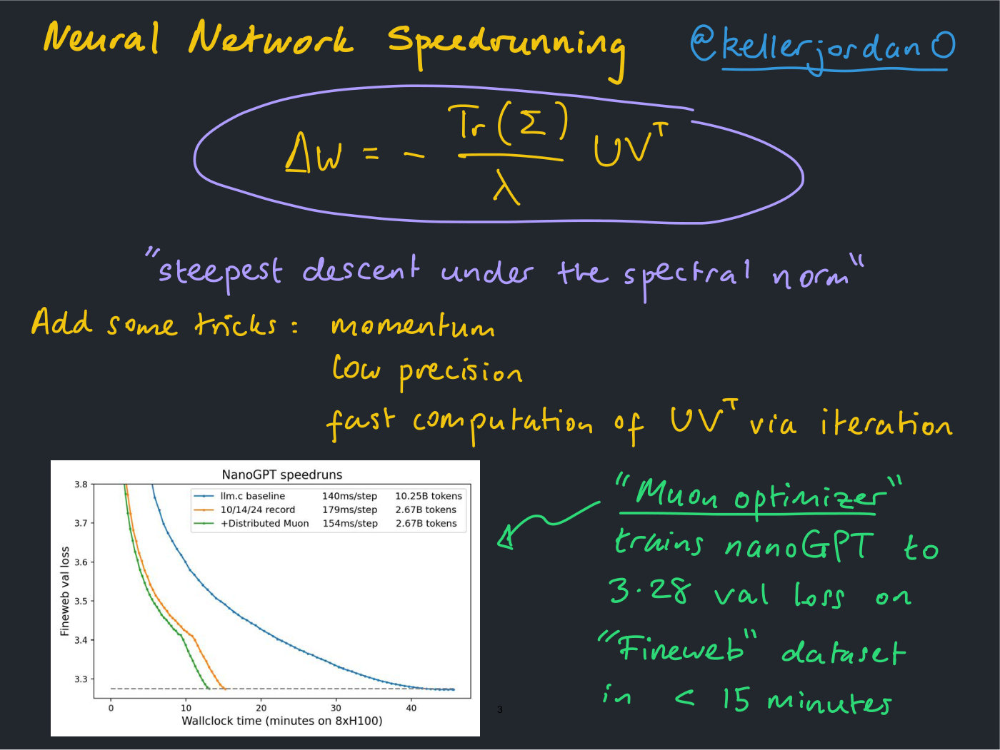
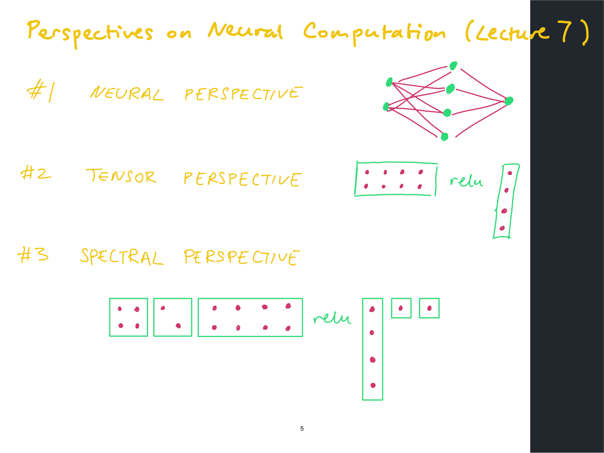
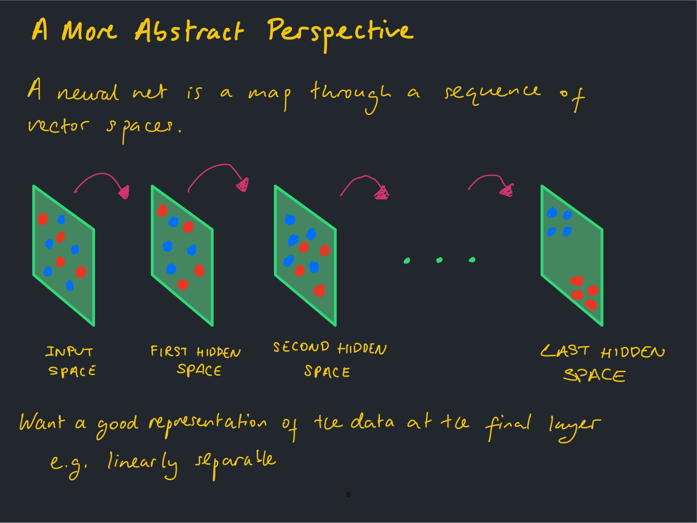
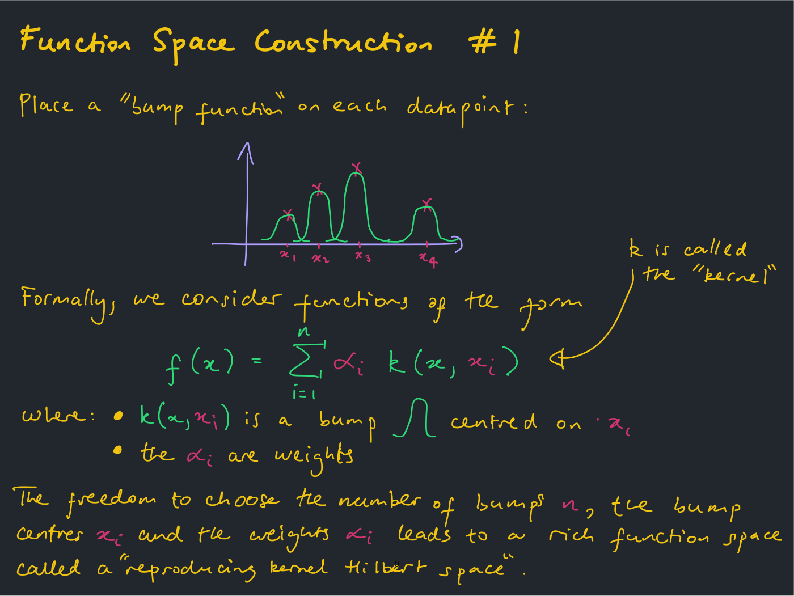
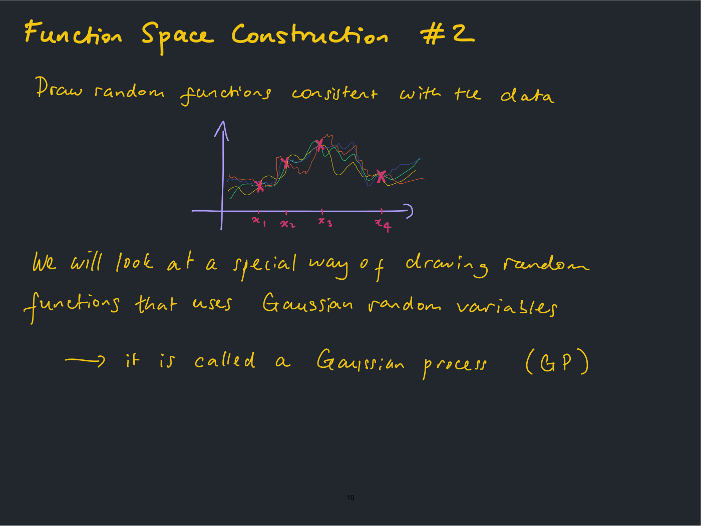
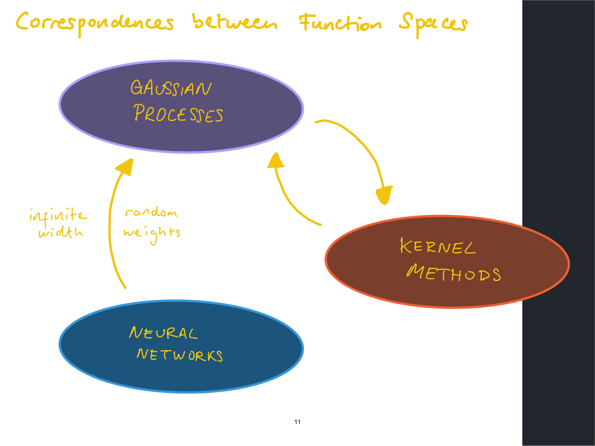
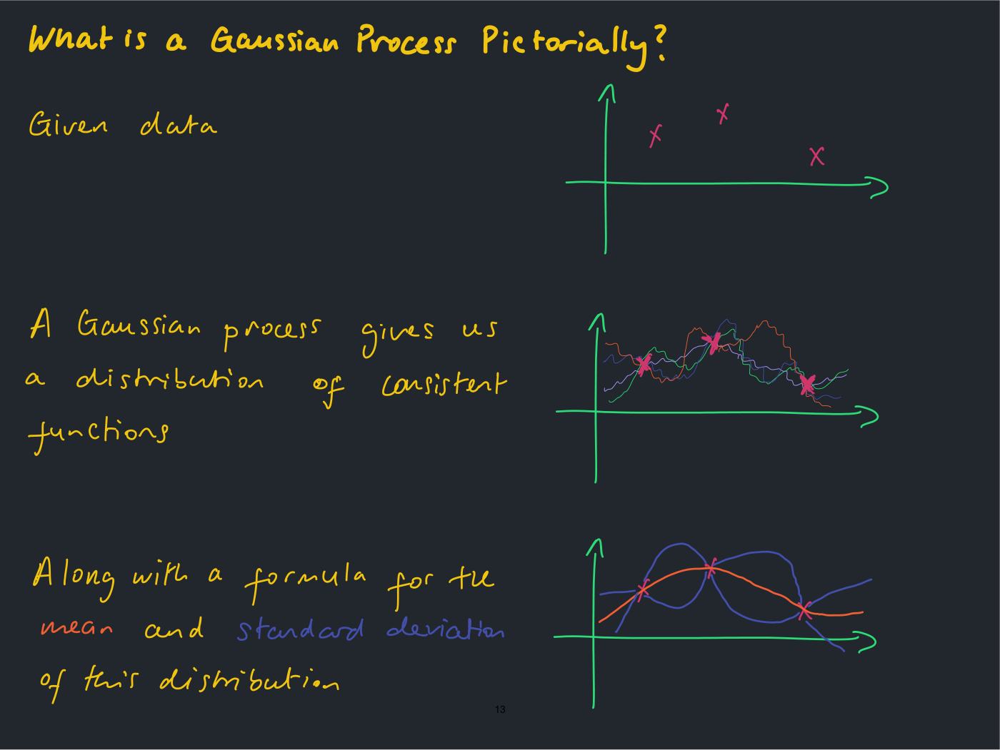
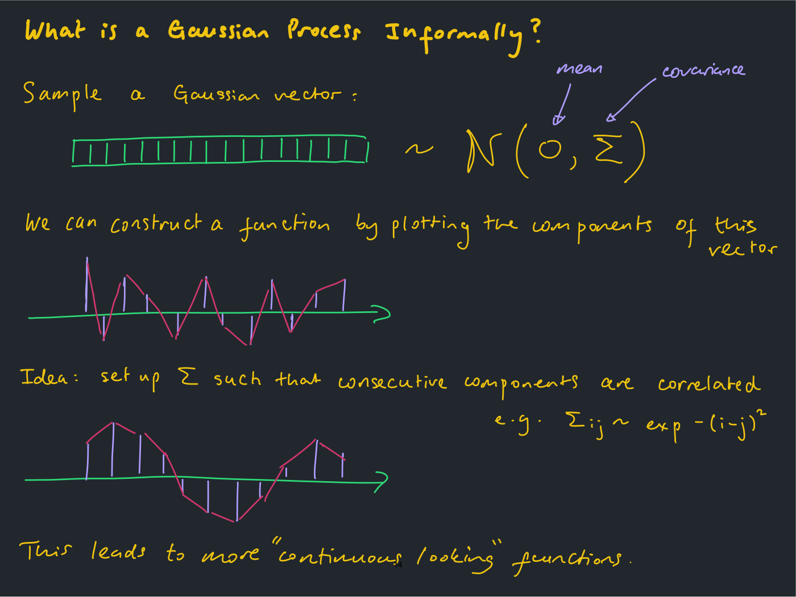
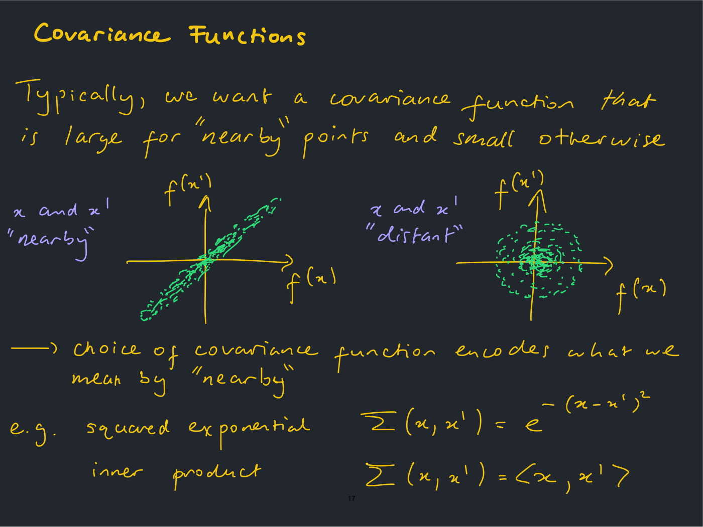
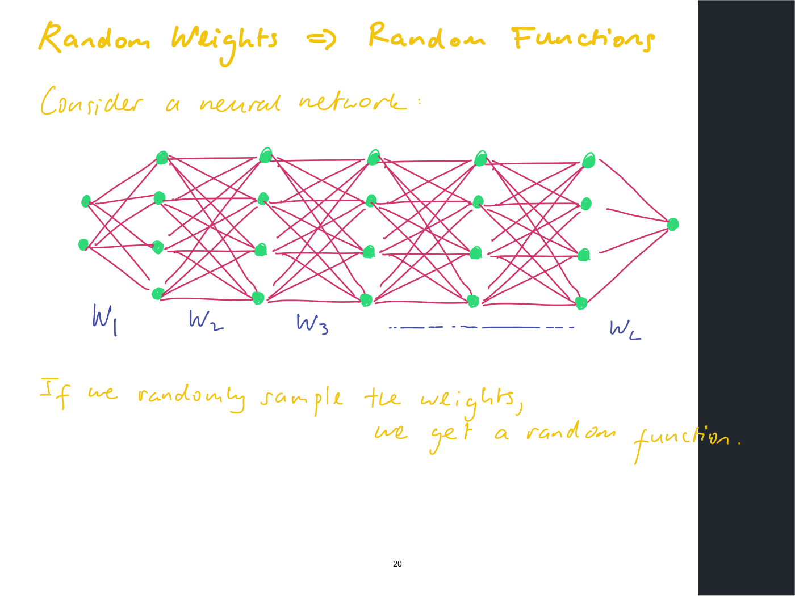

# Lecture 13 — Representation Learning: Theory

**Lecturer:** Jeremy Bernstein ·
**Video:** [youtube.com/watch?v=-eC0-5mXHQg](https://www.youtube.com/watch?v=-eC0-5mXHQg) (75 min) ·
**Slides:** [`mit6_7960_f24_lec13.pdf`](https://ocw.mit.edu/courses/6-7960-deep-learning-fall-2024/mit6_7960_f24_lec13.pdf)
(28 pages, handwritten; the title slide reads "Architectural Bias on Representations"; transcribed slide by slide in [`raw/slides/13-representation-learning-theory.md`](../raw/slides/13-representation-learning-theory.md)) ·
**Transcript:** [`raw/transcripts/13-representation-learning-theory.md`](../raw/transcripts/13-representation-learning-theory.md)

## What this lecture establishes

The two lectures before this one learned representations by training: by reconstruction in
[lecture 11](11-representation-learning-reconstruction-based.md) and by similarity in
[lecture 12](12-representation-learning-similarity-based.md), where a contrastive objective pulls similar
inputs together in embedding space. This lecture makes a claim about networks that have not been trained
at all: **a neural architecture, even before training, already expresses an opinion about which inputs
are similar.** The tool that makes the opinion visible is the **neural network–Gaussian process (NN-GP)
correspondence**. Sample a network's weights at random, again and again, and each sample is a random
function. If the network is infinitely wide, the outputs on any finite set of inputs are jointly
Gaussian, so the random network is a **Gaussian process**, and its covariance function, which says how
strongly the outputs on two inputs move together, is fixed by the architecture and the non-linearity.
That covariance function is the architecture's built-in measure of similarity (≈51:24–52:12).

To get there the lecture takes "a journey to the past", to two classical ways of building a space of
functions to fit data. **Kernel methods** place a bump function on every training point and reweight the
bumps to pass through the data. **Gaussian processes** sample random functions and keep the ones
consistent with the data, which is tractable because everything is Gaussian. The two are closely
related, and the infinitely wide network joins them as a third corner. The lecture then defines a
Gaussian process three times (as a picture, as a random vector plotted as a function, and formally),
explains covariance functions and how a Gaussian process makes predictions, and states the
correspondence with a proof sketch through the multivariate central limit theorem and a worked case:
a ReLU network, whose covariance function is the **compositional arccosine kernel**.

The lecturer is candid about the result's reach. Asked what effect it had, he answers that "it's had
actually very little impact on what people actually do in deep learning" (≈1:00:54), and "the point of
this lecture is not to tell you this is something for your practical toolkit", but to show one of the
ways people have found "to think about neural networks" (≈1:01:43–1:02:31). The lecture opens with an
aside on Homework 2's steepest descent under the spectral norm and its use in a fast optimizer, and it
closes with a doubt about the standard weight initialization that the correspondence assumes.

The deck is handwritten, in several ink colours, like the lecturer's
[lecture 3](03-approximation-theory.md) and [lecture 7](07-scaling-rules-for-optimization.md). Two of its
slides carry OCW notices excluding their photographs from its licence, so they are described in prose
and not shown.

**Notation on this page** follows the slides, with matrices and vectors bolded as in the
[course notation](notation.md) (the handwritten slides write nothing in bold). An input is $x$, a point of
an input space $\mathcal{X}$ (the slides write a plain $X$); it may be a number, an image or anything
else, and is bolded only where the slides make it a vector in $\mathbb{R}^d$. $f$ is a function, or a
random function. $\mathcal{N}(\mu, \sigma^2)$ is a normal (Gaussian) distribution with mean $\mu$ and
variance $\sigma^2$. A **covariance matrix** is $\boldsymbol{\Sigma}$, with entries $\Sigma_{ij}$, and a
**covariance function** is $\Sigma(x, x')$, a number for each pair of inputs. In the opening aside
$\boldsymbol{\Sigma}$ is instead the diagonal matrix of a gradient's singular values; the slides use the
same letter for both.

## An aside: steepest descent under the spectral norm (Homework 2)

The lecture opens with "the example … from the homework" (≈0:00), Homework 2's question on steepest
descent when the size of a weight update $\Delta \mathbf{W}$ is measured in the **spectral norm**, the
largest singular value, which the slide writes $\Vert \cdot \Vert_ \ast$. Given the gradient matrix
$\mathbf{G}$, the problem is

$$\underset{\Delta \mathbf{W}}{\arg\min} \quad \operatorname{Tr}\left(\mathbf{G}^{\top} \Delta \mathbf{W}\right) + \frac{\lambda}{2} \Vert \Delta \mathbf{W} \Vert_ {\ast}^{2},$$

where $\operatorname{Tr}(\mathbf{G}^{\top} \Delta \mathbf{W})$ is the first-order change in the loss and
$\lambda \gt 0$ sets how strongly large updates are penalized. If $\mathbf{G}$ has the reduced singular
value decomposition $\mathbf{G} = \mathbf{U} \boldsymbol{\Sigma} \mathbf{V}^{\top}$, the solution is

$$\Delta \mathbf{W} = - \frac{\operatorname{Tr}(\boldsymbol{\Sigma})}{\lambda} \mathbf{U} \mathbf{V}^{\top}$$

(slide 2, ≈0:46–1:39). A student offered another form, "I think it's G G-transpose to get the sigma
squared", which the lecturer accepted as "something like that"; there are "other ways to write the
answer, but this is a simple way". Conceptually, $\mathbf{U} \mathbf{V}^{\top}$ takes the SVD of the
gradient and sets "all the singular values to 1". The result is a **semi-orthogonal** matrix, "because
it's rectangular. It's not quite an orthogonal matrix" (≈1:39). The general method, steepest descent for
an arbitrary norm, is [lecture 7](07-scaling-rules-for-optimization.md)'s; see
[steepest descent](steepest-descent.md).

The reason to bring it up is "someone on Twitter called kellerjordan0 who calls himself a speedrunner":
he wants "to train the neural network as fast as he possibly can" (≈1:39–2:25). He took "a variant of
this method" and added tricks, which slide 3 lists as momentum, low precision and "fast computation of
$\mathbf{U} \mathbf{V}^{\top}$ via iteration". The iteration matters because "you don't really want to do
an SVD when you're training a neural network because it's kind of slow"; it computes the same term
without one, and "it throws away this learning rate, basically. It's a slight variant" (≈2:25–3:17). The
slide calls the result the "Muon optimizer", which "trains nanoGPT to 3.28 val loss on "Fineweb" dataset
in < 15 minutes" (slide 3).

Slide 3's pasted plot, titled "NanoGPT speedruns", shows validation loss on FineWeb (written "Fineweb")
against wallclock time in minutes on 8 H100 GPUs, with a dashed target line at about 3.28. The blue curve
is "llm.c baseline", which the lecturer describes as Andrej Karpathy's "very fast C implementation of
training transformer, which is supposed to be the fastest way to train a transformer"; it reaches the
target at about 42 minutes. The orange "10/14/24 record" reaches it at about 15 minutes and the green
"+Distributed Muon" at about 13 (≈3:17). "So the full disclosure is, I'm collaborating with Keller. So you
take everything with a grain of salt. But it seems to be actually much faster to use this method." It had
all happened "in the last couple of weeks", after the homework was written, and the lecturer suggests it
as a final-project topic: "thinking about the math of optimization to actually make the optimization go
faster" (≈3:17–4:49).

*Slide 3 — The spectral-norm update with tricks added, and the NanoGPT speedrun plot: the blue llm.c baseline reaches the dashed 3.28 target at about 42 minutes, the orange previous record at about 15, the green Muon run at about 13. [Deck](https://ocw.mit.edu/courses/6-7960-deep-learning-fall-2024/mit6_7960_f24_lec13.pdf)*

## Where this lecture sits

The recap starts from [lecture 12](12-representation-learning-similarity-based.md)'s contrastive learning:
"you specifically want to take basically similar data points and map them to nearby embeddings", and a
data point "from a very different class" to "an embedding that's far away" (≈4:49). Slide 4 draws it with
two photographs of a puppy mapped to nearby points and a monkey mapped far away; the photographs are
excluded from OCW's licence, so the slide is described in the
[slide file](../raw/slides/13-representation-learning-theory.md#slide-4--similarity-based-representation-learning-lecture-12)
and not shown here. Slide 5 recalls [lecture 7](07-scaling-rules-for-optimization.md)'s three
perspectives on a network: the neural perspective of nodes and edges, the tensor perspective of weight
matrices and activation vectors, and the spectral perspective of a matrix factored into its singular
value decomposition (≈5:36).

*Slide 5 — Lecture 7's three perspectives on a network, recalled: neural, tensor and spectral. [Deck](https://ocw.mit.edu/courses/6-7960-deep-learning-fall-2024/mit6_7960_f24_lec13.pdf)*

This lecture uses none of them. It thinks "more abstractly of a neural network as being a map from a
sequence of vector spaces", one vector space per layer (slide 6, ≈6:21). In the input space, data points
of unrelated things "are all mixed up together and not really separated or disentangled"; the hope is
that by the last layer, points from different classes, or "semantically different data points", are
separated, perhaps linearly separable (≈7:09). Slide 6 draws four planes, from the input space through
the first and second hidden spaces to the last, with blue and red dots that are mixed at the start and
in two clean clusters at the end.

*Slide 6 — A network as a map through a sequence of vector spaces: blue and red points mixed in the input space, cleanly separated in the last hidden space. [Deck](https://ocw.mit.edu/courses/6-7960-deep-learning-fall-2024/mit6_7960_f24_lec13.pdf)*

The lecture's thesis is on slide 7: "We will develop an advanced tool that shows that a neural
architecture (even without training) already expresses an opinion about data similarity." In the
lecturer's words, "when you pick what your neural network architecture is, it already has an opinion
about which data points are similar to each other and which ones are dissimilar, even without doing
contrastive learning" (≈7:55).

## A journey to the past: two ways to build a function space

Slide 8 asks the class to "pretend you've never heard of deep learning, and you want to fit some data"
(four points on a pair of axes). Students suggest interpolating with straight lines and polynomial
interpolation, perhaps "some kind of quadratic". "If you just think about this, you can invent a lot of
different function classes", and much of classical machine learning did just that: "invent their favorite
function class and say, hey, we're just going to do machine learning with this function class"
(≈8:41–10:58).

### Construction 1: a bump on every data point (kernel methods)

The first classic example is **kernel methods**, "quite related to what we talked about in the
approximation theory lecture" ([lecture 3](03-approximation-theory.md); the lecturer says "maybe lecture
two", ≈10:13). A kernel is "basically … a bump function", which "could just look like a little Gaussian".
Place one bump on the location of each input, so that four data points get four bumps, then rescale each
bump by a scalar coefficient so that the sum passes through the data: "four bump functions, four scalar
coefficients, four data points. Everything checks out" (≈10:58–11:47). Formally, the functions are

$$f(x) = \sum_{i=1}^{n} \alpha_i \thinspace k(x, x_i),$$

where $x_1, \ldots, x_n$ are the training inputs, $k(x, x_i)$ is a bump centred on $x_i$, called the
**kernel**, and the $\alpha_i$ are weights (slide 9). In the lecturer's reading, $k(x, 0)$ is the bump at
the origin, and the second argument "allow[s] me to translate this bump along the x-axis to be centered on
that i-th data point" (≈12:33).

*Slide 9 — A bump centred on each data point, each scaled by a weight so that the sum passes through the data. [Deck](https://ocw.mit.edu/courses/6-7960-deep-learning-fall-2024/mit6_7960_f24_lec13.pdf)*

"The freedom to choose the number of bumps $n$, the bump centres $x_i$ and the weights $\alpha_i$ leads to
a rich function space called a "reproducing kernel Hilbert space"" (slide 9). Letting the number of bumps
go to infinity, so that bumps may sit at every possible location, gives that space (≈13:20). "This was all
the rage before … the last 13 years of deep learning": instead of choosing an architecture, "you pick a
kernel function. You choose a good kernel or a good bump function that somehow captures the structure in
your data" (≈14:09). Which leaves a question the lecturer poses and does not settle: "it's not so obvious
why do we use neural networks. Why didn't we go back to kernel methods?" (≈14:55). See
[kernel methods](kernel-methods.md).

### Construction 2: random functions consistent with the data

The second classic way is to sample random functions, from what "we would call … some kind of stochastic
process". Keep sampling; throw away every function that does not fit the data and keep the ones that do,
and you end up with a distribution of functions that all go through the training data (slide 10,
≈14:55–15:43). In practice nobody samples and rejects: you "do something called conditioning the
distribution of functions on the training data", which gives "the posterior distribution of functions".
It becomes computationally tractable when the random functions are generated in "a Gaussian thing", and
"then all the computations that you need to do this procedure become straightforward" (≈15:43–16:30).
That special way is the **Gaussian process** (GP).

*Slide 10 — Random functions consistent with the data: every curve passes through the four points and varies away from them. [Deck](https://ocw.mit.edu/courses/6-7960-deep-learning-fall-2024/mit6_7960_f24_lec13.pdf)*

A student asked whether the optimal function here is "roughly like a kernel method itself". It is: if you
sample all the random functions consistent with the data and compute the mean of that distribution, you
get "a single, quite smooth function", and "that turns out to be equivalent to the kernel interpolator of
minimum kernel norm, for some definition of the RKHS norm" (≈16:30–18:04). The lecturer adds that this
"should not make sense to everyone, because we haven't defined any of those things", and the lecture does
not define the RKHS norm.

### Three corners, and the correspondences between them

Slide 11 puts the three function spaces at the corners of a triangle: Gaussian processes, kernel methods
and neural networks. Arrows run both ways between Gaussian processes and kernel methods ("there's sort of
a way to get a kernel method from a Gaussian process … And the relation somehow goes both ways"), and one
arrow runs from neural networks to Gaussian processes, labelled "infinite width" and "random weights"
(≈18:04–19:41). There may be "a couple ways" to get a Gaussian process from a network; the one this
lecture uses takes every hidden layer infinitely wide and samples the weights at random, "you just keep
re-initializing your network. And it keeps giving you random functions" (≈19:41). Such connections let
you "relate neural networks to these classical machine learning methods that people really cared a lot
about", and then ask "how useful are these correspondences?" (≈20:27).

*Slide 11 — Three function spaces and the correspondences between them; the arrow from neural networks needs infinite width and random weights. [Deck](https://ocw.mit.edu/courses/6-7960-deep-learning-fall-2024/mit6_7960_f24_lec13.pdf)*

Are the three equally expressive? The lecturer thinks "they may just be different in some sense", for
instance in the smoothness of their functions. Kernel functions, built out of bumps, "may still be
reasonably smooth functions" even with infinitely many bumps; a Gaussian process, "depending on the
covariate structure, you can have really horrendous functions", yet its posterior mean "is actually a
nice, smooth function. So it's just different. I don't know which one is more expressive"
(≈20:27–22:06). See [representational power](representational-power.md).

## Gaussian processes

Slide 12 opens the section. The lecture defines a Gaussian process three ways, and recommends the
second as the one to keep.

### Pictorially

Given some data, a Gaussian process gives "a distribution of consistent functions": random functions
that all go through the data points "but they're random away from the data" (slide 13, ≈22:06). Two
questions follow. What does the mean look like? "It's reasonable that the mean might be a lot smoother
than all the random squiggly functions." And what is the standard deviation around the mean? It "should
grow as you move away from the data, and then shrink to 0 on the data" (≈22:55). Slide 13's last row
draws exactly that: an orange mean curve through three data points, and a blue standard-deviation band
that bulges between the points and pinches to nothing at each one.

*Slide 13 — Data; a distribution of random functions consistent with it; and its mean (orange) with a standard-deviation band (blue) that shrinks to zero at each data point. [Deck](https://ocw.mit.edu/courses/6-7960-deep-learning-fall-2024/mit6_7960_f24_lec13.pdf)*

What a Gaussian process gives you is a formula, "just a simple thing that you can easily code up. It
just involves some matrices and some linear algebra", for both the mean and the standard deviation at any
new point on the x-axis; sweep the point along the axis and you draw the picture (≈22:55–24:25). Its
shape "depends upon something that we call the covariance structure of the Gaussian process. And that's
what we get to pick as machine learning people using Gaussian processes" (≈24:25).

### Informally: a random vector plotted as a function

"Just pretend that you don't know what a stochastic process is like. Most people honestly don't. But you
do know what a random vector is" (≈25:11). Sample a Gaussian vector with mean 0 and covariance matrix
$\boldsymbol{\Sigma}$, written $\sim \mathcal{N}(0, \boldsymbol{\Sigma})$ on slide 14, plot each of its
coordinates as the height of a stem along an axis, and connect the dots: you have built a function from a
random vector (slide 14, ≈25:11–26:00). With independent coordinates the picture is jagged, because
"neighboring points on the x-axis are not correlated with each other. And usually if I have a nice
function, I want nearby points to be similar to each other" (≈26:00).

So choose the covariance matrix so that neighbouring entries are strongly correlated. Slide 14's example
is $\Sigma_{ij} \sim \exp - (i-j)^2$, as written, meaning that the covariance of entries $i$ and $j$ falls off with
the square of the distance between their positions. Connecting the dots then gives "more "continuous
looking" functions" (slide 14). The structure depends on the order of the entries: "if I permuted all the
entries in the vector, it would break that" (≈26:48). A Gaussian process is "exactly this construction",
with the dimension of the vector taken to infinity, packing the sample points "more and more closely
together" until the result limits to something "more like a continuous function" (≈26:48–27:36). "So if you
forget everything else from the lecture, that's basically what a Gaussian process is" (≈27:36–28:22).

*Slide 14 — A Gaussian vector plotted coordinate by coordinate: jagged when the entries are independent, smooth when neighbouring entries are correlated. [Deck](https://ocw.mit.edu/courses/6-7960-deep-learning-fall-2024/mit6_7960_f24_lec13.pdf)*

### Formally

Consider an input space $\mathcal{X}$ (the $x$-axis in the pictures) and let $f(x)$ be a random variable
for every $x \in \mathcal{X}$. "Informally, think of $f$ as an infinite-dimensional random vector indexed
by $x \in \mathcal{X}$", the continuous generalization of a random vector in which $x$ says which
coordinate you are on (slide 15, ≈28:22–29:13). Infinite-dimensional objects are hard to handle, so the
definition only ever looks at finitely many inputs. If for every finite collection of inputs
$x_1, \ldots, x_n$ the random vector $(f(x_1), \ldots, f(x_n))$ is Gaussian, then $f$ is a **Gaussian
process** on $\mathcal{X}$ (slide 15, which writes "radom" for "random"; ≈29:13–30:01). "It's kind of like
an infinite dimensional object, where if you take any finite inspection of that object, it's a Gaussian
vector" (≈30:01).

The definition drew several questions.

- *How would you verify that a random vector is Gaussian?* "It's more analytical … you produce something
  which analytically, you know it satisfies this definition. You're very rarely in a situation where you
  would want to test empirically if it's a Gaussian" (≈30:01–30:52).
- *Does anything satisfy the definition?* "It's not obvious that anything should." There is a theorem that
  "most people who use Gaussian processes don't know", which the lecturer thinks is "called Kolmogorov
  extension theorem or something like this", and an area of mathematics about proving such things exist,
  "but it turns out you actually don't need to know that area of math to actually use this stuff"
  (≈30:52–31:39).
- *What exactly is a Gaussian vector?* The simplest has independent, identically distributed (iid)
  coordinates, each sampled from its own Gaussian; "a general one is defined with respect to a covariance
  matrix". Another way to think of a general one, which the lecturer is "pretty sure" is equivalent, is to
  take iid coordinates, rescale them and rotate the space (≈31:39–32:26). He suggested Wikipedia for the
  details, and said afterwards: "I should have defined what a standard multivariate Gaussian is. And I'll
  add that for next time" (≈34:45).
- *Is the dimension the number of data points?* The definition has to hold "for any collection of n for
  any n … It's quite a technical definition" (≈32:26–33:12).

### Covariance functions

A Gaussian process generalizes finite-dimensional Gaussian vectors to infinite-dimensional functions,
and in the same way it generalizes the covariance matrix, with entries $\Sigma_{ij}$ for
$i, j = 1, \ldots, n$, to a **covariance function** $\Sigma(x, x')$ for $x, x' \in \mathcal{X}$ (slide 16).
The covariance function says, "at two different inputs, what is the covariance between the function at
those inputs" (≈34:45–35:35). The finite example of slide 14 becomes, in the continuous case, something
like "e to the x minus x prime squared" (≈35:35).

"Typically, we want a covariance function that is large for "nearby" points and small otherwise" (slide
17). Slide 17 shows what that means for samples. Fix two inputs $x$ and $x'$, sample many random
functions, and plot each sample's pair of values $(f(x), f(x'))$. When $x$ and $x'$ are nearby, the
scatter is a thin band along the diagonal, strongly correlated, and "as x and x prime get closer and
closer together, it should concentrate on the samples being the same". When they are distant, the
scatter is round, and the two values are uncorrelated (≈36:24–38:02). So "the choice of covariance
function encodes what we mean by "nearby"" (slide 17). The slide's two examples are the **squared
exponential**

$$\Sigma(x, x') = e^{-(x - x')^2}$$

and the **inner product** $\Sigma(x, x') = \langle x, x' \rangle$ for multivariate inputs. "Basically, the
covariance structure is some kind of measure of similarity between the inputs" (≈38:02–38:47).

*Slide 17 — Sampled pairs of function values: a thin diagonal band when the inputs are nearby, a round cloud when they are distant. [Deck](https://ocw.mit.edu/courses/6-7960-deep-learning-fall-2024/mit6_7960_f24_lec13.pdf)*

A student asked whether this works for language, where words are not continuous. "There are ways to
define covariance functions, even on weird spaces. The inputs don't have to be the real line." That was
"one of the reasons people really like kernel methods as well". By contrast, "a downside of neural nets is
it's not obvious how to apply it to language": people "embed all the inputs and then learn the
embeddings. But it wasn't obvious that that was going to work before people showed that it worked"
(≈38:47–40:23).

Asked later what hyperparameters a Gaussian process has, the lecturer said the covariance function can
have as many as you design into it. The first kernel most people meet is the squared exponential, often
divided by $2\sigma^2$ in the exponent, where $\sigma$ "controls the length scale of the correlations"; a
multidimensional input can have one $\sigma$ per coordinate, or terms can be added. Papers offer "a table
of 10 different kernels" for different problem structures: "It's similar to, oh, use a ConvNet for images
and use a transformer for this. And it's just modeling decisions" (≈1:02:31–1:04:52).

### Conditioning on data: how a Gaussian process predicts

To predict ("or some people would say, how you do inference") at a new test input $x_{\ast}$ from known
values $f(x_1), \ldots, f(x_n)$, stack the known values and the unknown one into one vector
$(f(x_1), \ldots, f(x_n), f(x_{\ast}))$ (slide 18, ≈41:12–42:01). Because $f$ is a Gaussian process this
vector is Gaussian, by definition, since the definition covers every finite collection of inputs,
including the $n$ given ones plus the new one (≈42:46). A standard manipulation of Gaussian vectors gives
the conditional distribution of the last coordinate given the others, and "because Gaussians are so
well-behaved", it is itself Gaussian: $f(x_{\ast})$ given $f(x_1), \ldots, f(x_n)$ is
$\mathcal{N}(\mu, \sigma^2)$ (slide 18, ≈42:46–43:32).

"The mean $\mu(x_{\ast})$ and standard deviation $\sigma(x_{\ast})$ have simple closed form formulae"
(slide 18), "just involving evaluating the covariance matrix, basically, on the input points". Sweeping
$x_{\ast}$ along the axis draws slide 13's picture of mean and band (≈43:32–44:19). **The lecture does not
write these formulae down**: "I realized I'm not really telling you explicitly what these formulae are …
if you haven't seen this before, it's maybe easier just to have the intuitive explanation. And then you
can just look up what the formulae are if you're interested" (≈44:19). Nor does this page.

See [Gaussian processes](gaussian-processes.md) for the whole construction on one page.

## The neural network–Gaussian process correspondence

Slide 19 opens the section, on a result "that a lot of people have been really excited about over the
years" (≈45:07).

### Random weights give random functions

"Now forget everything we just talked about and just think about a neural network", most simply a
[multilayer perceptron](multilayer-perceptron.md) with weight matrices
$\mathbf{W}_ 1, \mathbf{W}_ 2, \mathbf{W}_ 3, \ldots, \mathbf{W}_ L$ (slide 20). "If we randomly sample the weights, we get a random
function" (slide 20). Resample, and you get another; keep resampling and you have a distribution over
functions, whose properties you can ask about (≈45:07–45:54).

*Slide 20 — Sample the weight matrices at random and the network computes a random function. [Deck](https://ocw.mit.edu/courses/6-7960-deep-learning-fall-2024/mit6_7960_f24_lec13.pdf)*

To inspect it, slide 21 samples 1,000 random networks $f_1, \ldots, f_{1000}$ (the slide writes the last
as $f_{100}$ in its text and $f_{1000}$ in the matrix), picks two inputs, and makes a scatter plot of the
$1000 \times 2$ matrix of outputs, one row per network:

$$\begin{bmatrix} f_1(x_1) & f_1(x_2) \cr f_2(x_1) & f_2(x_2) \cr \vdots & \vdots \cr f_{1000}(x_1) & f_{1000}(x_2) \end{bmatrix}$$

The two inputs could be anything, "x could be a picture of a cat and x-prime could be a picture of a dog";
the output is taken to be one-dimensional for simplicity (≈45:54–47:28). (The slide's text calls the
inputs $x$ and $x'$ and its matrix calls them $x_1$ and $x_2$; the lecturer speaks of "a 2 by 1,000
matrix".)

### An experiment: a three-layer MLP of width 1000

"I actually did this, but I did it two years ago" (≈47:28). Slide 22 reports it for a three-layer MLP
whose hidden layer has width 1000, on a truck from the CIFAR-10 dataset. Input 2 is "the same truck, but
with a little bit of jitter in the pixels", a little noise added; input 3 is "the same truck, but I just
added a lot more noise to the pixels" (≈47:28–48:14). Over the 1,000 random networks, the outputs on
inputs 1 and 2 fall along a thin diagonal line, while the outputs on inputs 1 and 3 form a wider elliptical
cloud along the same diagonal. The slide's observations: the "joint distribution of pairs of outputs seems
Gaussian", and the "covariance depends on similarity of inputs". "The two inputs, which are kind of similar
to each other, seem to have more correlated random outputs, whereas the two inputs that are a bit less
similar to each other, the outputs are slightly less correlated" (≈48:14–49:01).

The same could be done with five inputs and a five-dimensional scatter plot, and the claim is that it
would look Gaussian too, "because of this Neural Network Gaussian Process Correspondence. For a
sufficiently wide neural network, these scatter plots actually are Gaussian" (≈49:01–49:48). How would
you know? "There's tests for Gaussianity … But I don't know how to do that. But my claim is that really
they are Gaussian. And it's because the neural network is a wide network that it has to be the case"
(≈49:48). Slide 22 carries an OCW notice excluding its images ("Images © source unknown"), so the slide, plots
included, is described in the
[slide file](../raw/slides/13-representation-learning-theory.md#slide-22--3-layer-mlp-width-1000) rather
than shown.

### The correspondence

Slide 23 states it. If the weights of a neural network are sampled iid, then as the width goes to
infinity, the joint distribution of any finite collection of network outputs
$f(x_1), f(x_2), \ldots, f(x_n)$ is Gaussian, which is exactly the definition of a Gaussian process, "and it also would explain
these pictures" (≈49:48–51:24). And "the covariance function depends on the architecture and
non-linearity" (slide 23). Given an architecture, "you can expand its width and there will be a
corresponding covariance kernel or covariance function that is basically a function of what the network
architecture is" (≈51:24).

This is the lecture's thesis made precise. The architecture "has an opinion built into the choice of
architecture about what data points are similar to each other, and which data points are dissimilar to
each other. And one way to extract that information is to take the architecture to be really, really
wide", and read off the covariance function $\Sigma(x, x')$, which may depend on "what the depth of the
network is, what the nonlinearity is, and so on" (≈51:24–52:12). See
[inductive bias](inductive-bias.md#the-architectures-opinion-about-similarity-lecture-13).

### Questions the correspondence raised

**Doesn't an infinitely wide network overfit?** The Gaussian process picture suggests not necessarily.
Among the random functions through the data, there is "some probability of getting a really horrible
function", one that shoots far up and down between the data points, but it is very small, "because things
can't deviate too much from the mean with very significant probability" (≈52:58–54:36). And the mean is a
nice, smooth function. To make the distribution concentrate on its mean, the lecturer's argument, from
having "thought about that at one point", is that sampling the weights with a very small standard
deviation "causes the distribution to collapse onto the mean" (≈54:36–55:23). A second answer: networks
can be very overparameterized and still represent "lots of nice, simple functions", an idea co-instructor
Phillip Isola's [lecture 6](06-generalization-theory.md) took up; "the fact that the
network is very, very wide does not imply that you're going to overfit. It just implies that it's possible
to overfit" (≈55:23–56:09). See [generalization](generalization-and-double-descent.md).

**Why does the network need to be infinitely wide?** "Because the construction relies on a central limit
theorem over the width of the network … for things to converge to this Gaussian distribution, it's
because of a central limit theorem. And that requires something being large. And it turns out it's the
width" (≈56:56–57:42).

**If the network has an equivalent kernel, why not use the kernel?** "Some people really thought that we
should do kernel methods. But it just seems to be not the case." The lecturer offers possible reasons.
The Gaussian process has hyperparameters too, since the architecture affects the kernel, "so it's not like
it's really a tuning-free thing". And kernel methods scale worse with data: their cost is "cubic in the
size of the training set", whereas a network is trained once over the data at the cost of "a forward pass
and a backward pass multiplied by the size of your training set". "It's a super interesting question why
people use neural nets rather than kernel methods. I think it may still be a somewhat open problem"
(≈57:42–59:17).

**How far is a finite-width network from the limit?** "I think there are papers on this question." Even
for the classic central limit theorem, the Berry-Esseen theorem bounds the deviation from normality of a
large sum of independent random variables, so one could "take the Berry-Esseen theorem and turn the handle
and figure it out. I don't quite know if that actually works" (≈59:17–1:00:54).

**What difference did the result make?** "Very little impact on what people actually do in deep learning,
realistically." There could have been a version of deep learning in which you write down the architecture,
take the limit, work out the kernel and study it before training anything, "but that's just not what it
is. It's more like, OK, just get an architecture that seems reasonable and we'll just try it." The lesson
the lecturer draws: "anything that's too convoluted of a procedure is actually unlikely to be really
capturing what's going on", and in any case "you can just train the neural net and you just see"
(≈1:00:54–1:01:43).

### Proof sketch

The lecture sketches the proof rather than giving it, and promised to post a reading (≈1:04:52). The main
tool is the **multivariate central limit theorem** (MV-CLT), the generalization of the central limit
theorem from a single Gaussian variable to Gaussian vectors (slide 24, ≈1:04:52–1:05:38). There are two
steps:

1. For a fixed input and a fixed layer, the activations are iid random variables. Prove it by induction on
   depth using the MV-CLT.
2. For any collection of $k$ inputs $x_1, \ldots, x_k$, the network outputs $f(x_1), \ldots, f(x_k)$ are
   Gaussian. Prove it by writing the vector $(f(x_1), \ldots, f(x_k))$ as a sum over iid vectors from the
   penultimate layer, and applying the MV-CLT (slide 24).

In words: batch the activations of a layer over the inputs, treat each activation coordinate across the
batch as a random vector, and the next layer sums over those random vectors, which is where the central
limit theorem applies (≈1:05:38–1:06:24). "Anyway, I'm not really explaining it. So the short answer is,
there's a central limit theorem."

Two questions followed. Are the weights rescaled as the width grows? "Yes, exactly." And why should the
activations be independent, when the previous layers create complicated dependencies? "Maybe it's not
obvious that they are independent. And I think I maybe should not have said that. So I think that's
something you've got to show." The reason is that the network is so wide at every layer that a central
limit theorem happens at each one, "but I'm not giving you a mechanism, I'm just giving you a hand-wavy
justification" (≈1:06:24–1:07:55).

### A worked case: ReLU networks and the compositional arccosine kernel

For an MLP with ReLU, "all of the calculations, you can solve them exactly" (slide 25, ≈1:07:55). Set the
non-linearity to

$$\phi(x) = \sqrt{2} \thinspace \operatorname{relu}(x),$$

and sample the weights iid from $\mathcal{N}\left(0, \frac{1}{\text{fan-in}}\right)$, a variance of one over
the layer's number of inputs. That is "what we would call somehow the standard parameterization in
PyTorch", and the lecturer thinks "it's not the best way to initialize the weights in practice. But for this
statement to hold, that's the initialization you've got to use" (≈1:08:41). Then, for inputs
$\mathbf{x}, \mathbf{x}' \in \mathbb{R}^d$, the output has mean zero,

$$\mathbb{E} f(\mathbf{x}) = 0,$$

which "makes sense" because the network has no non-linearity on its output and the last layer is linear
(≈1:09:28). Its covariance is the **compositional arccosine kernel**:

$$\mathbb{E} f(\mathbf{x}) f(\mathbf{x}') = \underbrace{h \circ \cdots \circ h}_ {L - 1 \text{ times}} \left( \frac{\mathbf{x}^{\top} \mathbf{x}'}{d} \right),
\qquad h(t) = \frac{1}{\pi} \left[ \sqrt{1 - t^2} + t \left( \pi - \arccos t \right) \right].$$

Take the dot product between the inputs, scaled by their dimension $d$, then apply the function $h$
$L - 1$ times, where $L$ counts the weight matrices of slide 25's drawing (the recording says "where L
minus 1 is the depth", ≈1:09:28). "It's just a particular mathematical function which happens to
correspond to this architecture. Somebody proved it" (≈1:10:13). One of the references solves this kernel,
"but it's quite an old paper and it may not be that easy to read" (≈1:07:55).

A student checked that all of this is about untrained networks. Yes. The lecturer mentioned, without
developing it, "another thing, the neural tangent kernel, which is supposed to be a Gaussian process
characterization of trained networks. But it also holds under some assumptions. And people have moved away
from thinking too much about that at the moment" (≈1:10:13).

## Natural questions, and what became of them

"If you really buy into this picture", slide 26 asks: how does $\Sigma(x, x')$ depend on the choice of
architecture, and on the choice of weight distribution? And can this inform architecture design, and
weight regularization strategies? (≈1:11:08). "So that was the hope for this type of result. And it seems
to have just not really happened. Instead, we just do transformer. Or there's a list of architectures, and
you just pick one from that list." The hope was "a formal, analytical way to do … principle design in deep
learning. But it doesn't seem that we actually use it" (≈1:11:57).

## A doubt about the standard initialization

The lecture ends at the board on the initialization the correspondence assumes, variance one over fan-in,
"which is actually the PyTorch standard" (≈1:12:44). (The lecturer adds "People call this Xavier
initialization"; outside the course material, Xavier, or Glorot, initialization is usually defined with
variance $2 / (\text{fan-in} + \text{fan-out})$, and one over fan-in is usually credited to LeCun.) The deck
has no page for this part.

People believe in this initialization because "it's the initialization that is good at initialization": it
preserves activation magnitudes when the weights are random, which is also why the correspondence uses it
(≈1:13:30). But it ignores a fact of linear algebra. A matrix whose fan-in is much larger than its fan-out
"has a huge null space, meaning that a lot of the inputs are going to get mapped to 0". At initialization,
inputs hit that null space, so preserving their magnitude means scaling up the part that does not. Further
into training, "the inputs to the layer will kind of align with the non-null space. And then this principle
is kind of bad because then things are much too large" (≈1:13:30–1:14:18). The lecturer ties this to
"maximal update parameterization or MUP, which is something that if you're trying to train giant networks,
people care about this a lot" (≈1:14:18–1:15:05). [Lecture 7](07-scaling-rules-for-optimization.md)'s
width rule, which scales each layer by its RMS-to-RMS operator norm, is the course's own treatment of how
to size weights as width grows; see [scaling rules](scaling-rules.md).

## References

Slide 27 lists three readings, each a title and its authors:

- "Bayesian Learning for Neural Networks", Neal.
- "Kernel Methods for Deep Learning", Cho & Saul.
- "Deep Neural Networks as Gaussian Processes", Lee, Bahri, Novak et al.

## The problem set

The opening example is **Homework 2**'s question 4, "Steepest descent under the spectral norm" (3 points),
in [`mit6_7960_f24_hw2.pdf`](https://ocw.mit.edu/courses/6-7960-deep-learning-fall-2024/mit6_7960_f24_hw2.pdf).
Its optional part (a) bounds $\operatorname{trace}(\mathbf{G}^{\top} \mathbf{T})$ over matrices
$\mathbf{T}$ of unit spectral norm by $\operatorname{trace} \boldsymbol{\Sigma}$; its part (b) asks for the
steepest-descent step under the spectral norm "purely in terms of U, V, Σ and λ", which is what slide 2
shows. The problem set went out at [lecture 6](06-generalization-theory.md) and follows
[lecture 7](07-scaling-rules-for-optimization.md#problem-set-2). No problem set on OCW covers Gaussian
processes or the NN-GP correspondence.

## Pointers to other lectures

The title slide reads "6.7960 :: Lecture 13", matching the recording; its "6.7960" is handwritten on a pink
blob painted over a typed "6.S898", the course's earlier number, which the PDF's text layer still holds. Slide 4's heading points to "(Lecture
12)" for similarity-based representation learning and slide 5's to "(Lecture 7)" for the perspectives on
neural computation, both matching the recorded schedule; slide 2 points to "(HW2)". The recording points back
to "last time", lecture 12's contrastive learning (≈4:49), to the perspectives "in even the earlier
lectures" (lecture 7, ≈5:36), to "the approximation theory lecture, which was maybe lecture two" (lecture 3,
≈10:13), and to whether "Phillip talked about" overparameterized networks "in one of his lectures"
(≈55:23). It points ahead to no lecture, only to a reading to be posted (≈1:04:52, ≈1:08:41). See the
[course map](course-map.md#the-decks-lecture-pointers).

## See also

- [Gaussian processes](gaussian-processes.md) — random functions, covariance functions, prediction by
  conditioning, and the NN-GP correspondence.
- [Kernel methods](kernel-methods.md) — bump functions, the reproducing kernel Hilbert space, and the
  correspondences with Gaussian processes and networks.
- [Inductive bias](inductive-bias.md) — what an architecture assumes before it sees data.
- [Representation learning](representation-learning.md) — what a representation is, and how lectures
  11–13 learn and analyse one.
- [Steepest descent](steepest-descent.md) — the norm-penalized model behind the opening aside.
- [Scaling rules](scaling-rules.md) — initializing and updating weights so that width does not matter.
- [Multilayer perceptrons](multilayer-perceptron.md) — the architecture of every example here.
