# Lecture 14 — Generative Models: Basics

**Lecturer:** Phillip Isola ·
**Video:** [youtube.com/watch?v=hJlrAHqGOS8](https://www.youtube.com/watch?v=hJlrAHqGOS8) (81 min) ·
**Slides:** [`mit6_7960_f24_lec14.pdf`](https://ocw.mit.edu/courses/6-7960-deep-learning-fall-2024/mit6_7960_f24_lec14.pdf)
(60 pages; the deck is titled "Lecture 14: Deep Generative Models I"; transcribed slide by slide in [`raw/slides/14-generative-models-basics.md`](../raw/slides/14-generative-models-basics.md)) ·
**Transcript:** [`raw/transcripts/14-generative-models-basics.md`](../raw/transcripts/14-generative-models-basics.md)

## What this lecture establishes

This lecture opens the course's three lectures on **generative models**, "the new name for them is generative
AI" (≈0:00). The lecturer frames generative modeling as "just the inverse of representation learning": the last
three lectures went from data to a low-dimensional embedding, and now "we'll be going from simple low-dimensional
embeddings to data" (≈0:45). Of the two definitions of a generative model in use, the lecture adopts the first,
"an algorithm that generates data", over "a statistical model of the joint distribution of some data" (slide 4).

The lecture's argument runs in three printed "concepts". First, **noise is latent variables**: a generator is a
deterministic function fed random numbers, and those numbers are best thought of as the control knobs that set
everything about the output that the input did not specify. Second, **you can represent the data generating
process directly or indirectly**: learn a function that produces samples, or learn a function that scores data
points (a density or an energy) and then sample from it (slide 34). Third, **a common strategy is to turn generative
modeling into a sequence of supervised learning problems**, which is what autoregressive and diffusion models both
do. Along the way it derives **maximum likelihood** as minimizing the KL divergence from the data distribution,
shows that a model which memorizes its training data is the generative version of overfitting, derives the
**contrastive divergence** gradient for energy-based models, and then tours three popular families:
**autoregressive models**, **diffusion models** and **generative adversarial networks** (GANs).

"My favorite topic is representation learning, but my even more favorite topic is generative modeling. And I think
they're really the same topic" (≈2:18).

**Notation on this page** follows the slides. A data point is $\mathbf{x}$ in a data space $\mathcal{X}$; the latent
variables or "noise" fed to a generator are $\mathbf{z}$ in a space $\mathcal{Z}$. A model's parameters are
$\theta$ (and the discriminator's in a GAN are $\phi$). $p_{\theta}$ is a model's density, $E_{\theta}$ its energy,
$Z(\theta)$ the normalizing constant, and $p_{\texttt{data}}$ the unknown distribution the training data
$\lbrace \mathbf{x}^{(i)} \rbrace_ {i=1}^{N}$ were drawn from. $\mathbb{E}_ {\mathbf{x} \sim p}[\cdot]$ is an
expectation over $\mathbf{x}$ drawn from $p$. See also the course's [notation](notation.md).

## Where this lecture sits

The deck's second slide lays out the three lectures: "Lecture 14: fundamentals, a tour of popular models", "Lecture 15:
generative modeling meets representation learning" and "Lecture 16: conditional models, data prediction" (slide 2). Its
picture is the one [lecture 11](11-representation-learning-reconstruction-based.md) used for the two directions through a network: a box with "Data" at
the bottom and "Embedding" at the top, an upward arrow labelled "Representation learning" on its left and a downward
arrow labelled "Generative modeling" on its right, which this slide highlights. Next lecture covers variational
autoencoders, "a model that does both directions jointly"; then conditional models, "How can I condition a generative
model on some data to predict some other data?"; and lecture 16 is where "we'll talk more about the applications of
generative models" (≈1:31).

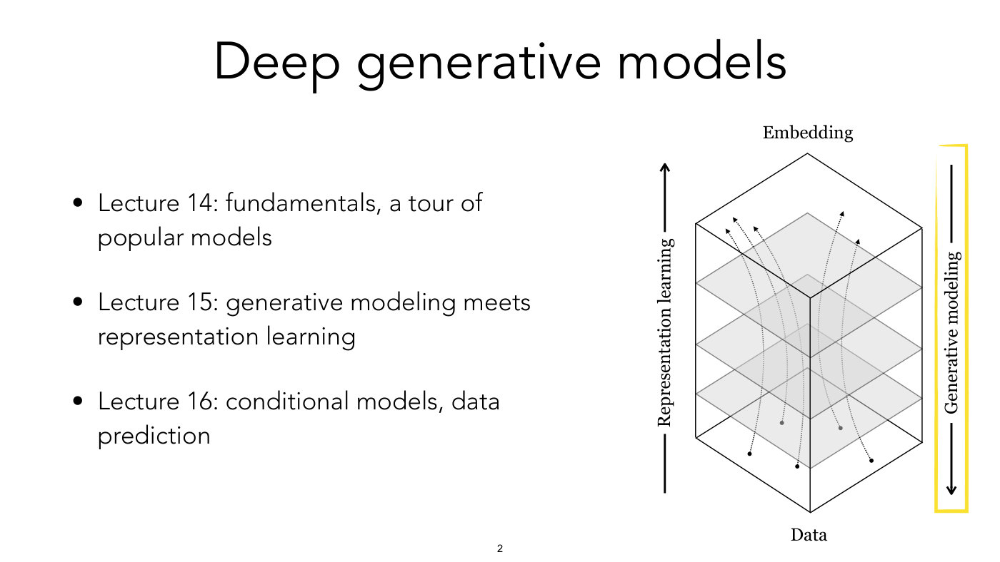

*Slide 2 — The three generative-modeling lectures, beside lecture 11's picture of the two directions through a network, now with the generative one highlighted: representation learning runs up from data to embedding, generative modeling down from embedding to data. [Deck](https://ocw.mit.edu/courses/6-7960-deep-learning-fall-2024/mit6_7960_f24_lec14.pdf)*

The outline (slide 3) is: math background; fundamentals of generative modeling; density functions, energy functions
and samplers; autoregressive models; diffusion models; generative adversarial networks. "The good news is all
generative models use the same principles … You can often cast one model as another model with some exchange of
variables. A diffusion model is a type of variational autoencoder, and an autoregressive model is a small variation on a
diffusion model" (≈3:03–3:48).

## What is a generative model?

Slide 4 gives the two definitions, and boxes the first:

1. An algorithm that generates data.
2. A statistical model of the joint distribution of some data, $p(x, y, \ldots)$.

The second is the "slightly older definition" from statistics and probability classes; the two are "highly related",
but "our real goal in generative modeling, especially in this area that we would call generative AI, is we want
algorithms that make things that look like data" (≈3:48–4:33). Data can be images, proteins and drug designs, or
stories and chat. This is the opposite direction to most of the course so far: "going from data to decisions or
abstract representations is what we've seen before, but now we're going from something to data" (≈4:33).

The examples are a text-to-image model and two scientific ones. Slide 5 shows eight DALL-E 2 images for the prompt "A
photo of a group of robots building the Stata Center" (≈5:21). Slide 6 shows DiffDock (Corso et al., 2022), a
diffusion model that places a ligand on a protein by "reverse diffusion over translations, rotations and torsions",
and an image-to-image model (Wolterink et al., 2017) that turns an MRI scan into the CT scan "it would look like if the
doctor hadn't scanned with an MRI machine but had scanned with a CT machine" (≈6:06–6:53). Slide 6's figures carry an
OCW notice and are not reproduced here; the slide file describes them.

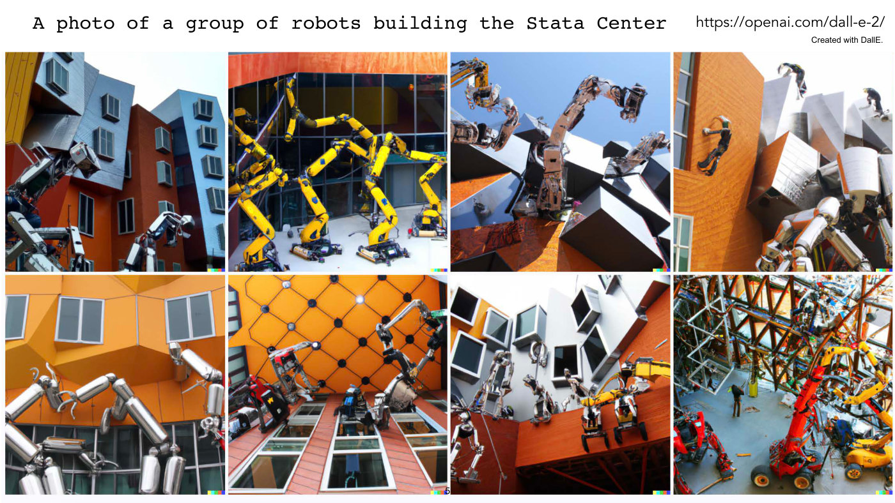

*Slide 5 — Eight DALL-E 2 images for the prompt "A photo of a group of robots building the Stata Center". [Deck](https://ocw.mit.edu/courses/6-7960-deep-learning-fall-2024/mit6_7960_f24_lec14.pdf)*

## Math background: neural nets that output distributions

So far the course has treated a network as a function $f_{\theta} : \mathcal{X} \to \mathcal{Y}$, "for each element of
the input space, there is a unique element of the output space … it's not a one-to-many mapping" — for instance an image
classifier $f_{\theta} : \mathbb{R}^{N \times M \times C} \to \lbrace 1, \ldots, d \rbrace$ into $d$ classes. That "is
not going to be sufficient for generative models because we want to make … a whole distribution of things" (slide 7,
≈7:39). So the lecture now treats networks as maps $f_{\theta} : \mathcal{X} \to \mathcal{P}(\mathcal{Y})$, where
$\mathcal{P}(\mathcal{Y})$ is the space of probability distributions over $\mathcal{Y}$.

That is already what classification does. Softmax regression models $P(\text{class} \mid X = \mathbf{x})$ as a map
$f_{\theta} : \mathbb{R}^{N \times M \times C} \to \Delta^{d-1}$, where the triangle denotes "the simplex, which is the
space of all categorical distributions over $d$ categories"; for a binary classifier it is a line (≈9:11; see
[softmax and cross-entropy](softmax-and-cross-entropy.md)). Regression with a squared-error loss can be recast the same
way, "as outputting a Gaussian distribution over the possibilities, and the mean is what you're regressing" (≈9:59).
Slide 7's "main perspective" is that "the outputs of our neural nets are, implicitly or explicitly, distributions".

This picks up a trick from [lecture 9](09-hackers-guide-to-deep-learning.md): condition on more information, such as a
video instead of a photo, to shrink the uncertainty of a prediction. "But now I'm going to tell you, if you don't have
that luxury, if you can't put more data into X, what do you do? How do you model a complicated output distribution
that's not just a point? … So that's what generative modeling tries to deal with" (≈10:44–11:30).

Asked how a network can be "an implicit distribution", the lecturer gives the regression case: predicting a number with
an L2 loss can be read as predicting a Gaussian whose mean is the network's output, "and that interpretation is valid
because the probability of the data under that Gaussian model is equal to the squared error loss function" (≈15:23–16:10).
There are two possibilities, both of which the lecture covers: "One, the network is outputting samples from a
distribution, and the other is the network is outputting parameters of a distribution" (≈16:10).

### Random variables, mass and density

Slide 8 sets out the vocabulary. A random variable $X$ has a distribution $p(X) \in \mathcal{P}(\mathcal{X})$, its
probability mass or density function; a realization $x \sim p(X)$ has a probability mass or density $p(x)$. "Uppercase
letters, in this course, are random variables … Lowercase letters are realizations" (≈12:16). A **probability mass
function** maps each $x$ to a number between 0 and 1, and the values sum to 1:

$$p : \mathcal{X} \to \mathbb{R}, \quad 0 \leq p(x) \leq 1, \quad \sum_{x \in \mathcal{X}} p(x) = 1$$

So "if you ever have a vector that sums to 1 … you can call that a probability mass function" (≈13:03). A **probability
density function** is the continuous version: nonnegative, and integrating to 1, but not bounded by 1 — "they can go to
infinity" (≈13:03–13:48):

$$p : \mathcal{X} \to \mathbb{R}, \quad p(x) \geq 0, \quad \int_{x \in \mathcal{X}} p(x) \thinspace dx = 1$$

As printed, slide 8 writes the codomain of both functions as a script $\mathcal{R}$, and writes the density of a
realization as $p(x) \in \mathcal{X}$, where a real number is meant; the formulas above use $\mathbb{R}$, as slide 9
does. Slide 9 reproduces the "Probabilities" section of the course's Math Notation handout: $p(X = \mathbf{x} \mid \ldots)$
is a scalar, the probability of a realization; $p(X \mid \ldots)$ is a function, the distribution over $X$;
$p(\mathbf{x} \mid \ldots)$ is shorthand for the first; and a named distribution such as $p_{\theta}$ written on its own
is shorthand for $p_{\theta}(X)$ (≈13:48–14:37).

Two student questions probe densities. If the probability of any single value of a continuous variable is zero, how is a
density defined? "You always only define the probability of a variable taking on some value over an interval … it's all
defined with respect to integrals" (≈14:37–15:23). And how can a density reach values far above 1 and still integrate to 1?
"The probability is an integral of the probability density over some interval … if the interval is infinitesimal, then
the density can go to infinity over an infinitesimal interval" (≈32:31–33:18).

## Generators: dice, knobs and latent variables

The intuition starts from a classifier, which maps a picture of a bird to the label "Bird" (slide 10), and turns it
round: a **generator** maps the label to a picture (slide 11). "There's no definition to label versus data", but
"generative models are when the outputs are something you would think of as data" (≈16:56). The trouble is that this
direction is one-to-many: "there's only one possible label that is the correct label for this bird. But in this
direction, that robin is just one possibility out of many" (≈17:42).

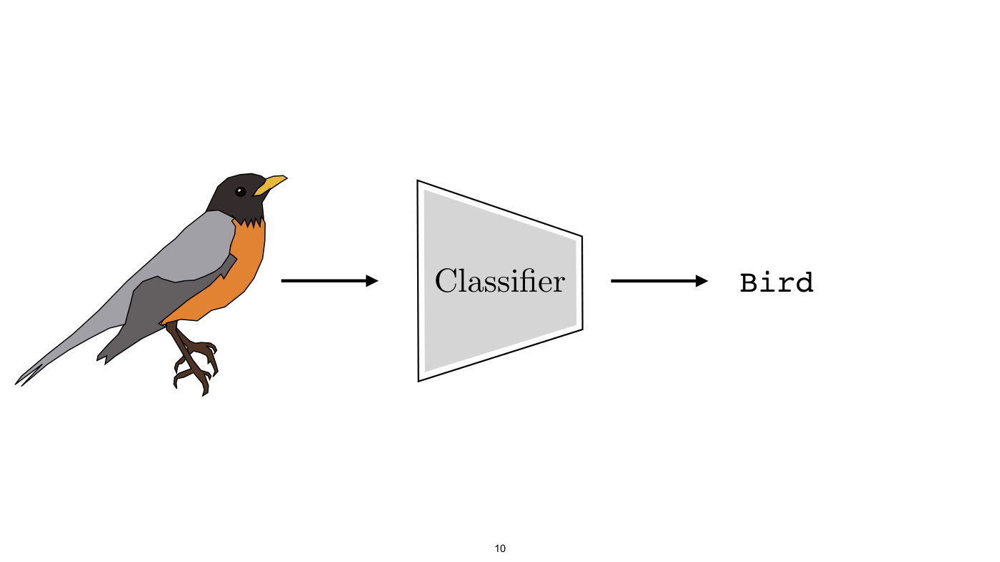

*Slide 10 — The familiar direction: a classifier maps a picture of a bird to the label "Bird". [Deck](https://ocw.mit.edu/courses/6-7960-deep-learning-fall-2024/mit6_7960_f24_lec14.pdf)*

The fix is to feed the generator random numbers as well. "It's a deterministic function, but we condition it on some
random variable … We roll the dice. We input that into our system. We get one outcome. We roll the dice. That's a
different setting of numbers, and that gives us another outcome" (slide 12, ≈17:42–18:28).

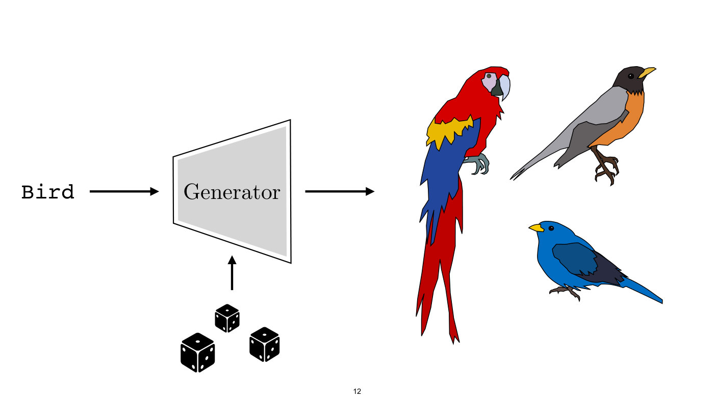

*Slide 12 — A generator fed a roll of the dice as well as the label: each roll gives a different bird. [Deck](https://ocw.mit.edu/courses/6-7960-deep-learning-fall-2024/mit6_7960_f24_lec14.pdf)*

The lecturer objects to calling these inputs noise: "They're noise in the sense that they are random variables … But they're not noise in the
sense that they're meaningless or something that you want to get rid of." Instead each one specifies something the
input left open — "What's the color of the bird? … What's the angle of the bird? … And what's the size of the bird?"
(slide 13, ≈18:28–19:14).

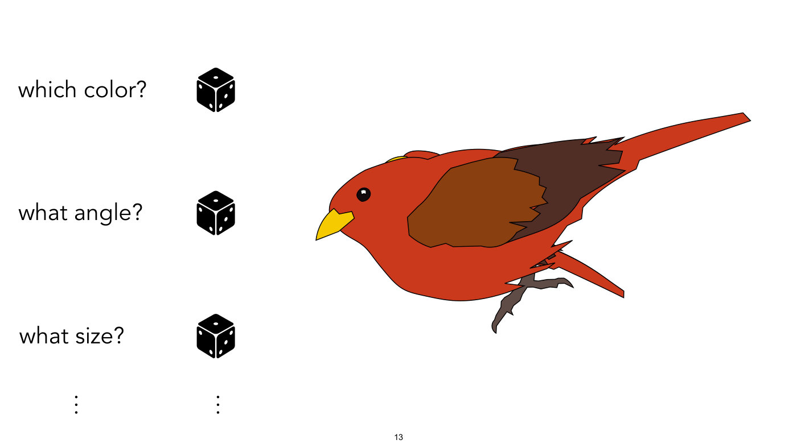

*Slide 13 — What the dice decide: everything the label leaves open, such as the bird's colour, angle and size. [Deck](https://ocw.mit.edu/courses/6-7960-deep-learning-fall-2024/mit6_7960_f24_lec14.pdf)*

A die can also be thought of as a knob: spin it randomly and you get a random bird, or "set that
knob … to a value of the bird I want", which is how many applications steer generative models (slide 14, ≈20:00).

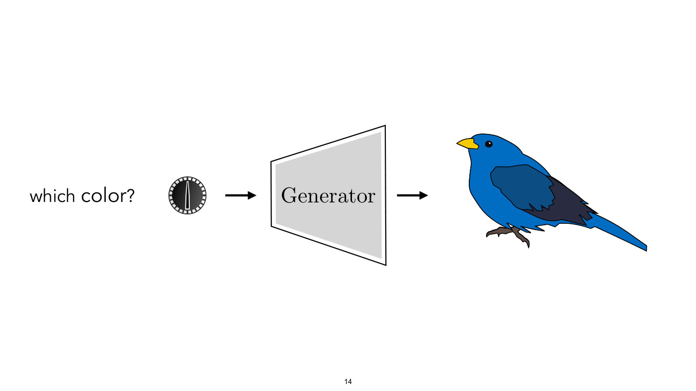

*Slide 14 — A die seen as a knob: set it on purpose and the generator draws the bird you asked for. [Deck](https://ocw.mit.edu/courses/6-7960-deep-learning-fall-2024/mit6_7960_f24_lec14.pdf)*

### A generative model by hand: procedural graphics

Generative modeling started in statistics, and also in computer graphics, where "the classical name is procedural
graphics. It's a way of making random content for your video game or movie" (≈20:00–20:45). The class builds one:
a student flips a coin, heads turns the river left and tails right — heads, heads, heads, tails — and "I have randomly
generated a river from a distribution" (≈20:45–21:31). The lecturer's program writes the procedure out:

$$\mathbf{z} \sim \texttt{Bernoulli}(0.5)$$

then for $i = 1, \ldots, N$, extend the line one unit in the current heading direction, and rotate the heading
$10^{\circ}$ to the right if $z_i = 1$ and to the left otherwise. "That's a mapping from random variables to generated
imagery. And that's how generative models tend to work" (slide 15, ≈22:17).

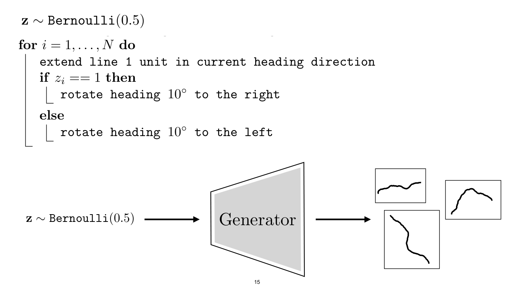

*Slide 15 — A generative model written by hand: coin flips decide each turn of the river, and different flips give different rivers. [Deck](https://ocw.mit.edu/courses/6-7960-deep-learning-fall-2024/mit6_7960_f24_lec14.pdf)*

Slide 16 extends it to whole map tiles: $\mathbf{z}_ 1 \sim \texttt{Bernoulli}(0.5)$ sets the river's turns,
$\mathbf{z}_ 2 \sim \texttt{Normal}(\mu_1, \boldsymbol{\Sigma}_ 1)$ the grass colour, and $\mathbf{z}_ 3 \sim \texttt{Unif}(0, 10)$
the number of trees. "You could say those random variables are noise. But what we'll think of them as is as control
knobs that specify all the attributes of the data. And a formal name for that is **latent variables**. So a latent
variable is any variable that determines how the data looks that is not directly observed" (slide 16, ≈23:03). Its box
states the lecture's first concept: "Concept #1: noise is latent variables" (≈23:53).

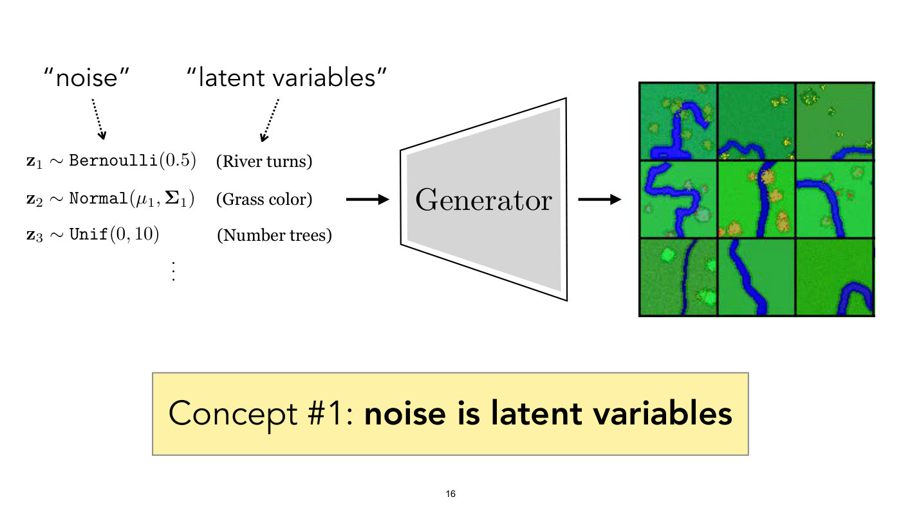

*Slide 16 — Concept #1: the random variables fed to the generator are latent variables, each setting one attribute of the map tile it draws. [Deck](https://ocw.mit.edu/courses/6-7960-deep-learning-fall-2024/mit6_7960_f24_lec14.pdf)*

## Learning a generator: the direct and the indirect approach

Writing the generator by hand is graphics; the question for deep learning is how to learn it. Slide 17 gives two
approaches:

1. **Direct approach**: learn a function that generates data directly, $G : \mathcal{Z} \to \mathcal{X}$.
2. **Indirect approach**: learn a function that scores data, $E : \mathcal{X} \to \mathbb{R}$, and generate data by
   finding points that score highly under it.

The direct approach is, "confusingly, sometimes called an 'implicit generative model'" (slide 17): "implicit sounds like
it's kind of indirect, but this is the direct approach. So what it means is that the sampling procedure implies a
probability distribution you're sampling from" (≈25:29–26:16). Conversely, a scoring function implies a sampler.

**The direct approach** (slide 18) is "just regular machine learning": a learner takes training data and outputs
parameters $\theta$ of a function $g_{\theta}$ that maps randomized latent variables $\mathbf{z}$, with simple
distributions, to samples "that look like the training data". The two phases are training and **sampling**, which "is
the same as the testing phase for any neural net" (≈26:16–27:01). It is "kind of the more popular characterization
right now".

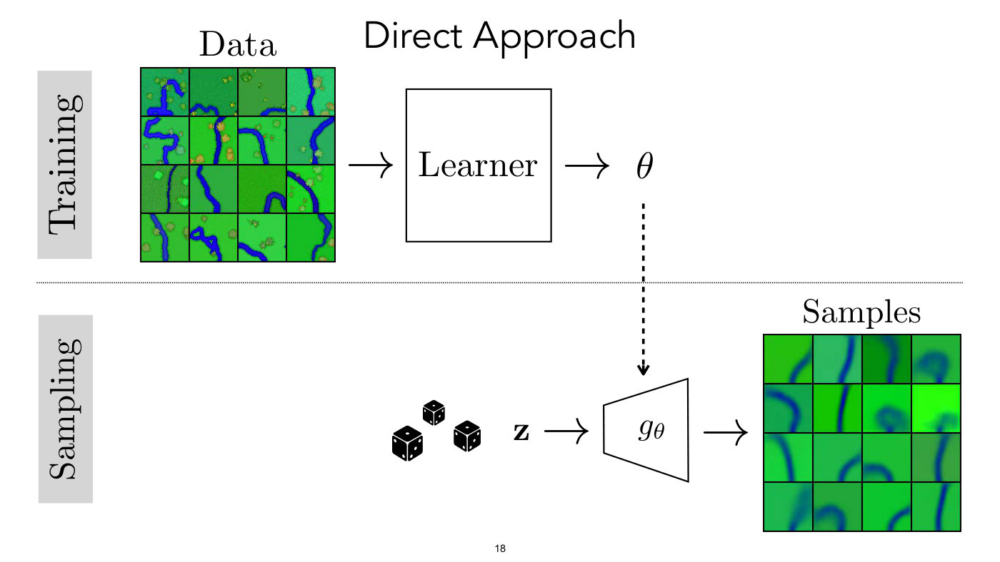

*Slide 18 — The direct approach: learn the parameters of a generator, then sample by feeding it random latent variables. [Deck](https://ocw.mit.edu/courses/6-7960-deep-learning-fall-2024/mit6_7960_f24_lec14.pdf)*

**The indirect approach** (slide 19) is "the more classical characterization" (≈26:16), the one of statistics classes:
learn a scoring function that is high where the data live — a probability density, an energy, or some other "score
function" — and then sample from it with a separate **sampling algorithm**, such as Markov chain Monte Carlo, or
rejection sampling, which takes a random sample and rejects it in proportion to its probability under the scoring
function (≈27:48–28:36). "We won't go into too much detail about these."

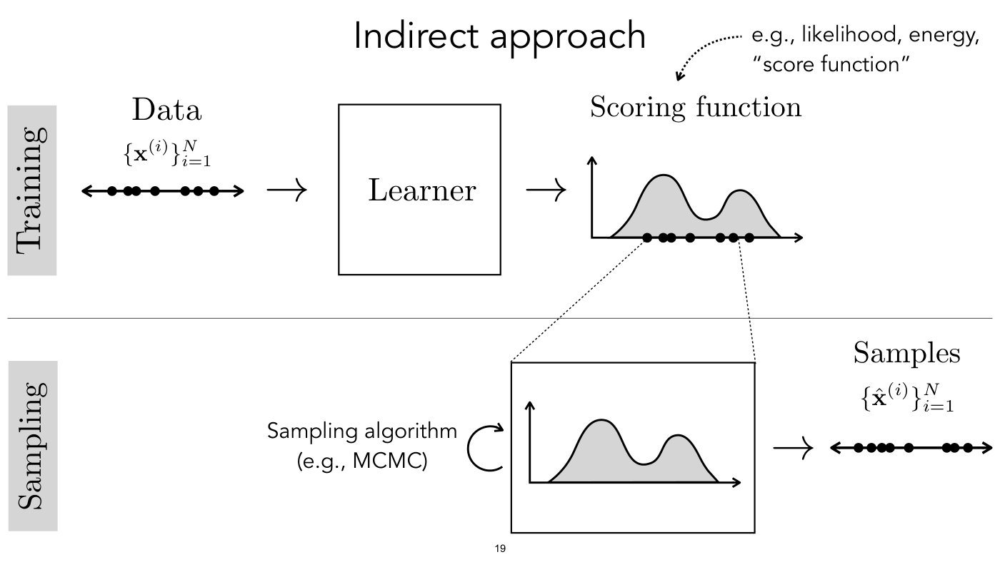

*Slide 19 — The indirect approach: learn a scoring function that is high where the data are, then sample it with a separate algorithm such as MCMC. [Deck](https://ocw.mit.edu/courses/6-7960-deep-learning-fall-2024/mit6_7960_f24_lec14.pdf)*

## Density models and maximum likelihood

What should "looks like real data" mean? "There's a lot of answers to this question, that lead to different types of
model. But we've kind of converged on one main one in machine learning": the generated data should have "high
probability under a density model fit to real data" (slide 20, ≈29:24).

A **density model** is a map $p_{\theta} : \mathcal{X} \to [0, \infty)$, with parameters $\theta$, "the weights and
biases in a neural network" (slide 21, ≈30:11). A network can represent one by outputting the parameters of a family of
normalized distributions: two numbers, a mean and a variance, for a one-dimensional Gaussian; "a hundred plus 10
numbers" for a 10-dimensional Gaussian with its $10 \times 10$ covariance and 10-dimensional mean; twice that for a
mixture of two; or the control points of some other parametric curve (≈30:57, ≈41:11–41:57).

Fitting is a matter of **constant mass**. Every setting of $\theta$ gives a curve with area 1 under it, so "if I increase
the curve where the data lives, I necessarily decrease the curve where the data does not live" (≈30:57–31:43). Slide 22
shows a single broad hump over five training points, each with a green arrow pushing the density up, and slide 23 the
same total mass redistributed into two bumps over the two clusters of points.

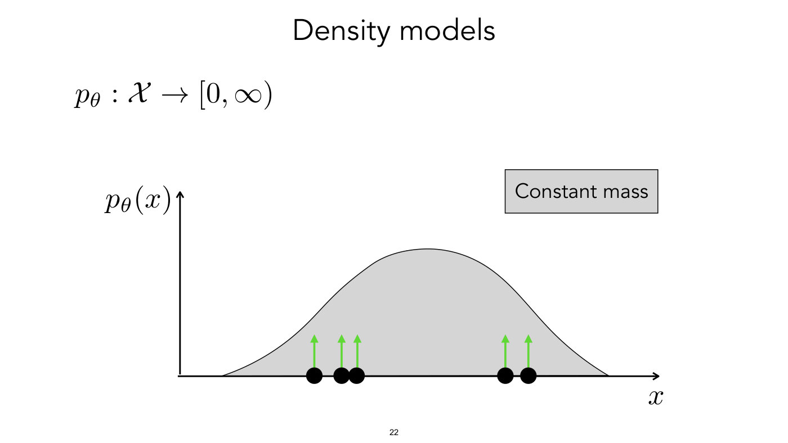

*Slide 22 — A density model before fitting: one broad hump of constant total mass over the training points. [Deck](https://ocw.mit.edu/courses/6-7960-deep-learning-fall-2024/mit6_7960_f24_lec14.pdf)*

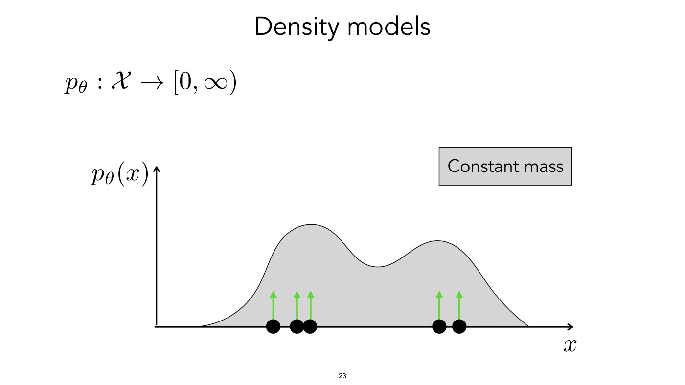

*Slide 23 — The same mass redistributed: the density rises over the data and falls in the gap between the clusters. [Deck](https://ocw.mit.edu/courses/6-7960-deep-learning-fall-2024/mit6_7960_f24_lec14.pdf)*

Formally, the model should match the unknown data-generating distribution $p_{\texttt{data}}$, "the distribution from
which the training data was sampled", in KL divergence (≈33:18–34:05). What that means is derived as follows:

$$p^{\ast}_ {\theta} = \underset{p_{\theta}}{\arg\min} \thinspace \texttt{KL}(p_{\texttt{data}}, p_{\theta}) = \underset{p_{\theta}}{\arg\min} \thinspace \mathbb{E}_ {\mathbf{x} \sim p_{\texttt{data}}} \left[ -\log \frac{p_{\theta}(\mathbf{x})}{p_{\texttt{data}}(\mathbf{x})} \right]$$

$$= \underset{p_{\theta}}{\arg\max} \thinspace \mathbb{E}_ {\mathbf{x} \sim p_{\texttt{data}}} \left[ \log p_{\theta}(\mathbf{x}) \right] - \mathbb{E}_ {\mathbf{x} \sim p_{\texttt{data}}} \left[ \log p_{\texttt{data}}(\mathbf{x}) \right] = \underset{p_{\theta}}{\arg\max} \thinspace \mathbb{E}_ {\mathbf{x} \sim p_{\texttt{data}}} \left[ \log p_{\theta}(\mathbf{x}) \right]$$

$$\approx \underset{p_{\theta}}{\arg\max} \thinspace \frac{1}{N} \sum_{i=1}^{N} \log p_{\theta}(\mathbf{x}^{(i)})$$

The second term is dropped "since no dependence on $p_{\theta}$" — which is lucky, "because we didn't even have a way of
evaluating that second term, since we don't have access to $p_{\texttt{data}}$ directly … That's just the universe"
(≈34:57–35:44). The expectation is then approximated, as always in machine learning, by an average over the finite
training set. The result is **maximum likelihood**: "maximize the likelihood, the probability, that the model places on
your training data" (≈35:44–36:31). "You should recognize this as being the same form as we saw with softmax
regression" (≈36:31). Slide 24 prints the derivation beneath two plots of the update: green arrows push the curve up at
each training point, and the new curve gains mass over the data and loses it in the gaps.

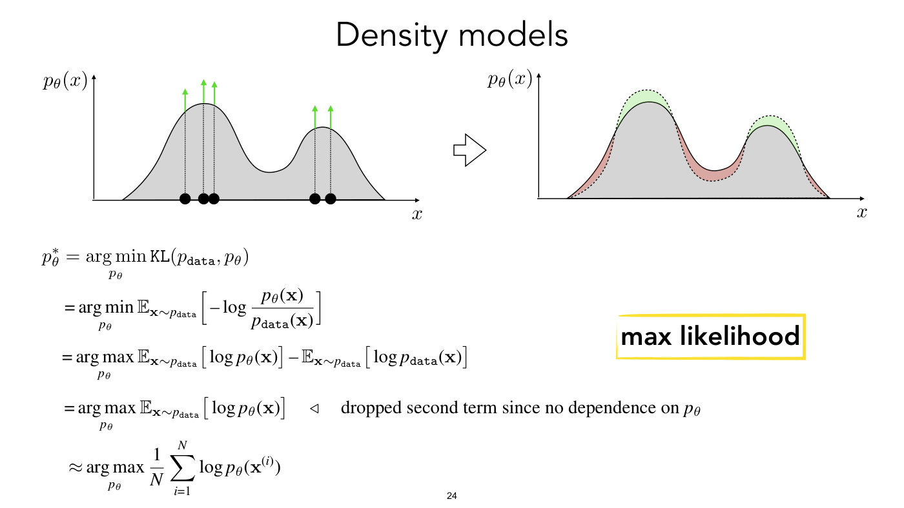

*Slide 24 — Maximum likelihood: pushing the density up at the data takes mass from everywhere else, and minimizing the KL divergence from the data distribution reduces to maximizing the average log-likelihood. [Deck](https://ocw.mit.edu/courses/6-7960-deep-learning-fall-2024/mit6_7960_f24_lec14.pdf)*

Asked whether this is a form of empirical risk minimization: "Generally, yes" — empirical maximum likelihood is
empirical risk minimization with the likelihood as the risk, and the usual losses, "like squared error or L1 error,
these all have interpretations as some type of likelihood function", though not every risk function does (≈43:29–44:16).

## Overfitting: is the filing cabinet a good generative model?

A student asks whether maximum likelihood without a regularizer just puts a Dirac delta on every data point. That is the
next slide (≈36:31). Slide 25 brings back the filing cabinet of [lecture 6](06-generalization-theory.md) as a generative
model: "Every time we see a new training point (x), we put it in the cabinet", and "Sample by picking a drawer at
random." Its code:

```python
def train(X):
  for x in X:
    cabinet.append(x)

def generate():
  return cabinet[np.random.randint(len(cabinet))]
```

"It doesn't make new stuff," a student says; but it does make data identical to the training data, and "this is the max
likelihood solution, or this is getting the highest likelihood you could possibly get" (≈37:18–38:04). The lecturer's
answer: "It's exactly the same as overfitting in classical machine learning" (≈38:04). The density the cabinet samples
from is a delta function on each training point (slide 26). The true data-generating process is some smooth unknown
curve, and new samples from it — test data — "will land somewhere else. And I'll have placed zero probability, under
this model, on those samples" (≈38:53). What matters is the probability placed on test data, so "you have to control
capacity or regularize in order to avoid the memorization solution" (≈39:39). See
[generalization and double descent](generalization-and-double-descent.md).

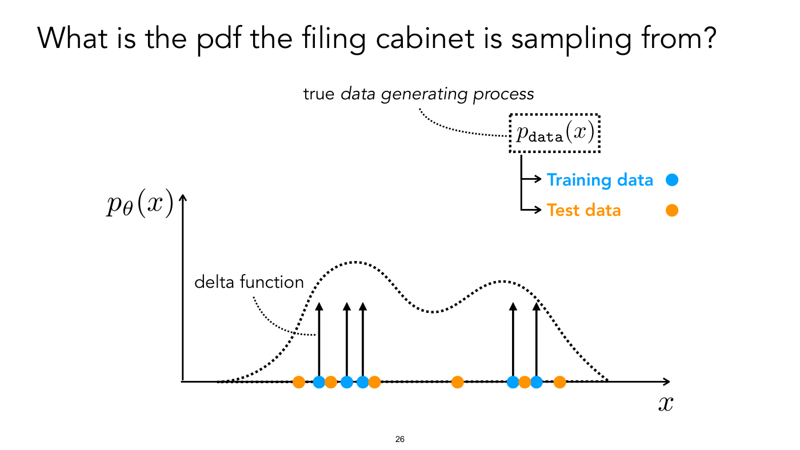

*Slide 26 — What the filing cabinet samples from: a spike on every training point (blue), and nothing at the test points (orange) drawn from the same true distribution. [Deck](https://ocw.mit.edu/courses/6-7960-deep-learning-fall-2024/mit6_7960_f24_lec14.pdf)*

So "the goal is not to replicate the training data but to make *new* data that is *realistic*", and "one way to quantify
this is: likelihood of the test data under the model" (slide 27). With test samples
$\lbrace x_{\texttt{test}}^{(i)} \rbrace_ {i=1}^{N}$ drawn from $p_{\texttt{data}}$, slide 27 prints

$$\text{generalization error} = \sum_{i} \log p_{\theta}(x_{\texttt{test}}^{(i)})$$

As printed, the quantity is the test log-likelihood, which is higher for a better model, under the label "generalization
error"; the lecturer says "you measure generalization error as the likelihood your model places on the test data"
(≈40:25). This held-out evaluation is easy for density models, which can simply be cross-validated, and hard for direct
methods "that just produce samples but not densities … It's a little bit hard to know what the test data likelihood is"
(≈39:39–40:25).

A student asks whether early stopping on validation likelihood is the procedure, and whether inductive biases — "images
should not look like static" — can be added. "All the tricks that we have from other deep learning can apply here": a
convolutional architecture's baked-in spatial locality, positional codes in transformers, regularizers (≈41:57–43:29; see
[inductive bias](inductive-bias.md)).

## Energy-based models

An **energy-based model** scores data with an energy, "i.e. unnormalized probability models" (slide 28). Any function
$E_{\theta} : \mathcal{X} \to \mathbb{R}$ implies a normalized density through the Boltzmann form (≈45:02):

$$p_{\theta} = \frac{e^{-E_{\theta}}}{Z(\theta)}, \qquad Z(\theta) = \int_{\mathbf{x}} e^{-E_{\theta}(\mathbf{x})} \thinspace d\mathbf{x}$$

The minus sign is "just a definition": low energy means high probability (≈48:53). An energy is "just a map from data to a
scalar, between negative infinity and infinity"; the logits of a softmax classifier are one, and softmax is exactly the
exponentiate-and-normalize step (≈45:48).

**Why energies:** a density must be normalized, so a network that outputs a density must be restricted to normalized
families. A network that outputs an arbitrary number per data point would have to be normalized by integrating over all
possible data, "and that's intractable" (≈46:33). But energies are often sufficient, because ratios of probabilities do
not need the normalizer (slide 28):

$$\frac{p_{\theta}(\mathbf{x}_ 1)}{p_{\theta}(\mathbf{x}_ 2)} = \frac{e^{-E_{\theta}(\mathbf{x}_ 1)} / Z(\theta)}{e^{-E_{\theta}(\mathbf{x}_ 2)} / Z(\theta)} = \frac{e^{-E_{\theta}(\mathbf{x}_ 1)}}{e^{-E_{\theta}(\mathbf{x}_ 2)}}$$

"Relative probabilities are often all you need (e.g., for sampling)" (slide 28): to decide whether snow or a hurricane
tomorrow is likelier, or to run Markov chain Monte Carlo, which "only requires relative probabilities" (≈47:20–48:53).

**Why probabilities, then?** A student suggests scale: "probabilities put everything on the same kind of unit, on the same
playing field", while "the energies could be arbitrarily scaled or arbitrarily offset". "If you go to the hospital and they
tell you your energy of having cancer is 10 million, what are you going to do with that, right? But if they say your
likelihood is 0.1%, you're going to be like, OK, that's fine." Human interpretability is the most obvious reason, "but I
think there's other reasons beyond that, too" (≈49:39–50:26).

### Fitting an energy: contrastive divergence

Pushing the energy down where the data lie is not enough: "I could just decrease my energy to be negative infinity
everywhere … I'm not forcing it to be normalized" (≈51:12). So add a term that pushes the energy **up where the model
currently puts its samples**. The model can be sampled without knowing $Z(\theta)$, by Markov chain Monte Carlo for
example, and "I'm sampling where there's low energy because that means high probability. I'm going to increase energy
there" (≈51:57). (In the sentence before, the lecturer says "where the model places high energy"; he means high
probability, low energy.) Slide 29's three panels show it: the energy starts as a broad bowl whose model samples (red
arrows, pushing up) sit away from the data (green arrows, pushing down); then two wells form over the two clusters of
data; and "at convergence, green (data) and red (model) samples are identical and model update (green-red) cancels out"
(slide 29, ≈52:44). This algorithm is **contrastive divergence**: "another contrast, the contrast between where the data
lives and where the model has placed high probability". It is "even connected to contrastive learning, but a little bit
indirectly" (≈52:44–53:32; see [contrastive learning](contrastive-learning.md)). Like any maximum-likelihood model it will
overfit, to a delta function on each data point, without early stopping or regularization (≈52:44).


*Slide 29 — Contrastive divergence: data push the energy down (green), the model's own samples push it up (red), and at convergence the two cancel. [Deck](https://ocw.mit.edu/courses/6-7960-deep-learning-fall-2024/mit6_7960_f24_lec14.pdf)*

The derivation (slides 30–32, ≈53:32–57:24) starts from the gradient of the expected log-likelihood and splits the log
of the Boltzmann form into two terms (slide 30):

$$\nabla_{\theta} \mathbb{E}_ {\mathbf{x} \sim p_{\texttt{data}}} \left[ \log p_{\theta}(\mathbf{x}) \right] = -\mathbb{E}_ {\mathbf{x} \sim p_{\texttt{data}}} \left[ \nabla_{\theta} E_{\theta}(\mathbf{x}) \right] - \nabla_{\theta} \log Z(\theta)$$

The first, the **positive term** (green on the slides), is easy: sample training data and backpropagate to lower their
energy. The second, the **negative term** (red), is the gradient of the log of the normalizer, "sometimes called the
partition function", and slide 30 asks "How to measure this?". Slide 31 rewrites it as an expectation, using
$\nabla \log f = \frac{1}{f} \nabla f$, the definition of $Z(\theta)$, exchanging the gradient with the integral, the chain
rule, and the definition of $p_{\theta}$:

$$-\nabla_{\theta} \log Z(\theta) = -\frac{1}{Z(\theta)} \int_{\mathbf{x}} e^{-E_{\theta}(\mathbf{x})} \nabla_{\theta} E_{\theta}(\mathbf{x}) \thinspace d\mathbf{x} = -\int_{\mathbf{x}} p_{\theta}(\mathbf{x}) \nabla_{\theta} E_{\theta}(\mathbf{x}) \thinspace d\mathbf{x} = -\mathbb{E}_ {\mathbf{x} \sim p_{\theta}} \left[ \nabla_{\theta} E_{\theta}(\mathbf{x}) \right]$$

"The whole point is to rearrange the terms until I get something that looks an expectation … because if I get things
into the form of an expectation, I know how to approximate expectations on finite data" (≈56:37). Two of slide 31's lines
are printed loosely, and the formula above gives the steps as the lecture states them: its first line, which reads
$-\nabla_{\theta} \log Z(\theta) = \frac{1}{Z(\theta)} \nabla_{\theta} Z(\theta)$, has no minus sign on the right; and its fourth line
prints a minus sign between $\frac{1}{Z(\theta)}$ and the integral. A student asked about that one, and the lecturer
agreed: "this is a times negative 1. Yeah, that's not subtraction. That's probably confusing" (≈57:24–58:11).

Putting the two terms together and replacing each expectation by an average over samples (slide 32):

$$\nabla_{\theta} \mathbb{E}_ {\mathbf{x} \sim p_{\texttt{data}}} \left[ \log p_{\theta}(\mathbf{x}) \right] = -\mathbb{E}_ {\mathbf{x} \sim p_{\texttt{data}}} \left[ \nabla_{\theta} E_{\theta}(\mathbf{x}) \right] + \mathbb{E}_ {\mathbf{x} \sim p_{\theta}} \left[ \nabla_{\theta} E_{\theta}(\mathbf{x}) \right] \approx -\frac{1}{N} \sum_{i=1}^{N} \nabla_{\theta} E_{\theta}(\mathbf{x}^{(i)}) + \frac{1}{N} \sum_{i=1}^{N} \nabla_{\theta} E_{\theta}(\hat{\mathbf{x}}^{(i)})$$

with $\mathbf{x}^{(i)} \sim p_{\texttt{data}}$ from the training set and $\hat{\mathbf{x}}^{(i)} \sim p_{\theta}$ sampled from
the model. (Slide 32 prints the subscript of the first term's energy on its third line as $E_{\theta(\mathbf{x})}$; it is
$E_{\theta}(\mathbf{x})$ as on the lines around it.) "So that's the math. But you can also just kind of keep in mind the
intuition. Push down energy where the data lives. Push up energy where the model currently places high probability.
Eventually, those cancel out, and the model has fit the data" (≈58:11). Slide 33 repeats the three-panel picture. See
[energy-based models](energy-based-models.md).

## Three ways to represent the data-generating process

Slide 34 sums up the fundamentals. Generative modeling takes data $\lbrace x^{(i)} \rbrace_ {i=1}^{N}$ and returns one of
three things: a **density function** $p_{\theta} : \mathcal{X} \to [0, \infty)$, an **energy function**
$E_{\theta} : \mathcal{X} \to \mathbb{R}$, or a **generator** $G_{\theta} : \mathcal{Z} \to \mathcal{X}$. "Concept #2: you
can represent the data generating process directly or indirectly." Each has its families of deep generative models, "and a
lot of deep generative models have multiple of these forms simultaneously" (≈58:11–58:58). The rest of the lecture tours
three of them; variational autoencoders come next lecture (≈59:43).

## Autoregressive models

Autoregressive models, "the simplest one to understand", are next-word or "next data point predictors", which the course
has met before (≈59:43; see [autoregressive models](autoregressive-models.md)). Slide 35 shows two text predictors: "Once
upon ___" → "time", and, to make the point that "I don't have to go in temporal order", "Once ___ a time" → "Upon". (Slide
35's output reads "taime": a letter "a" is printed over the "i" of "time", apparently two steps of an animation at once, since
the lecturer's predictor first outputs "a" and then "time", ≈59:43.)

Slide 36 shows the two phases. **Training** is standard supervised learning: chop sentences into a prefix
$\mathbf{x}_ 1, \ldots, \mathbf{x}_ {n-1}$ and the next word $\mathbf{x}_ n$ ("Once upon a" → "time", "There and back" →
"again", "The slow brown" → "fox", "To be or not to" → "be") and fit a predictor. **Sampling** runs the predictor on a
prefix ("Colorless green ideas sleep" → "furiously") and feeds its output back in. The predictor outputs not one word but
a categorical distribution over words, which is sampled (≈1:00:29).

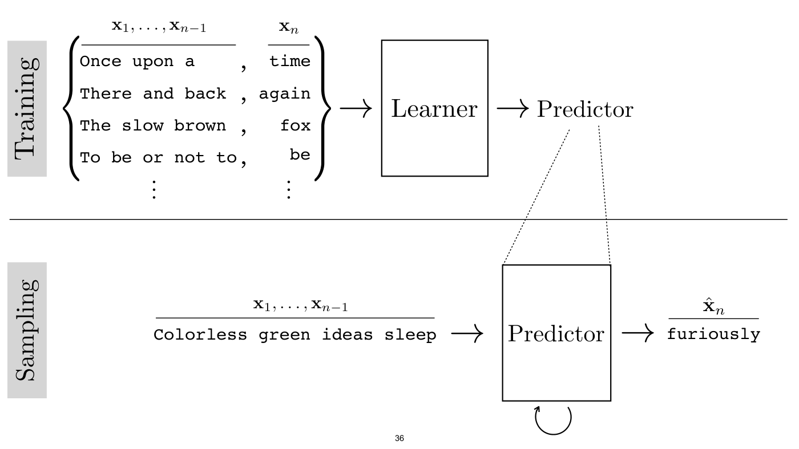

*Slide 36 — An autoregressive model of words: learn to predict the next word from a prefix, then sample by feeding each output back in. [Deck](https://ocw.mit.edu/courses/6-7960-deep-learning-fall-2024/mit6_7960_f24_lec14.pdf)*

Why is this a valid probability model, doing maximum-likelihood density modeling? Because of the chain rule of probability
(slide 37, ≈1:01:17):

$$p(\mathbf{X}) = \prod_{i=1}^{n} p(\mathbf{x}_ i \mid \mathbf{x}_ 1, \ldots, \mathbf{x}_ {i-1})$$

so that, for instance, $p(\texttt{Once upon a time}) = p(\texttt{Once}) \thinspace p(\texttt{upon} \mid \texttt{Once}) \thinspace p(\texttt{a} \mid \texttt{Once, upon}) \thinspace p(\texttt{time} \mid \texttt{Once, upon, a})$. "Autoregressive
modeling is simply modeling all of those conditional probabilities in a sequence and trying to maximize the likelihood"
(≈1:02:03). And each conditional is modeled by treating it as classification: "Just treat it as a next word classifier!"
(slide 38). Given "Once upon a", the classifier $f$ outputs a categorical distribution over the vocabulary, with "time"
the most probable word on the slide's bar chart.

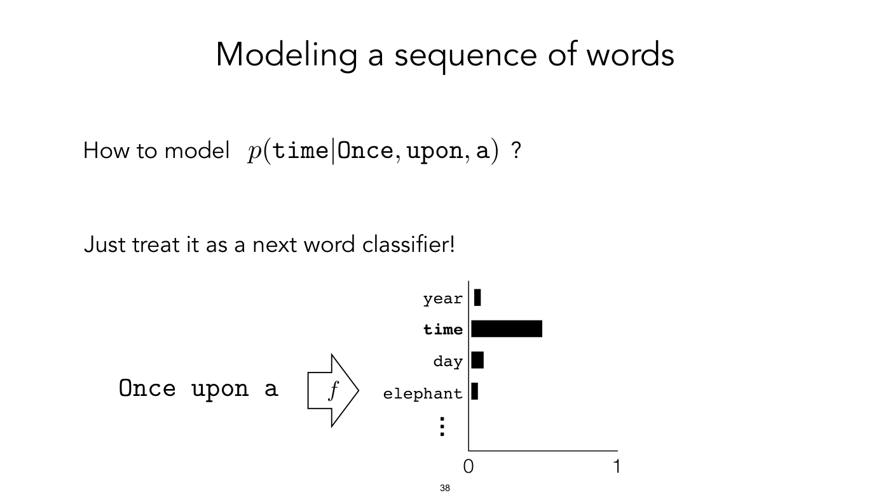

*Slide 38 — Each conditional as a classifier: given "Once upon a", a distribution over the next word, peaking at "time". [Deck](https://ocw.mit.edu/courses/6-7960-deep-learning-fall-2024/mit6_7960_f24_lec14.pdf)*

### Pixels

The same works for images (slide 39, ≈1:02:49–1:03:36). Draw the bird pixel by pixel; at each step, predict the colour of
the next pixel from the previous ones. Quantize pixel colours into classes, as in the colorization examples of
[lecture 9](09-hackers-guide-to-deep-learning.md) and [lecture 11](11-representation-learning-reconstruction-based.md),
output a categorical distribution with softmax regression, sample from it, write the sampled colour into the image and
iterate. Sampling a categorical distribution is easy: "take a uniform sample from 0 to 1, and I can walk through my
probability vector until I get to … the segment that has been sampled from" (≈1:03:36).

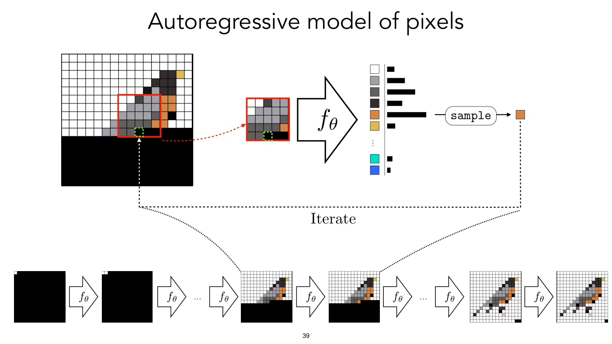

*Slide 39 — An autoregressive model of pixels: predict a distribution over the next pixel's colour from the pixels so far, sample it, write it in, and repeat. [Deck](https://ocw.mit.edu/courses/6-7960-deep-learning-fall-2024/mit6_7960_f24_lec14.pdf)*

The loss is the log probability the model places on the ground-truth colour (slide 40): the prediction's log probabilities,
multiplied elementwise by the one-hot ground-truth label, leave a single score, "the amount of probability my model places
on the ground-truth class. I want to maximize that" (≈1:03:36–1:04:24). Summed over every pixel of a training image, these
log probabilities are the log-likelihood of the image, and the whole thing is trained by backpropagation, as with the
[recurrent networks](recurrent-neural-networks.md) of [lecture 10](10-architectures-memory.md), "but now I'm just giving it
this probabilistic language" (≈1:06:47–1:07:34). Slide 41 repeats slide 36's training-and-sampling scheme with pixel
patches of birds in place of words.

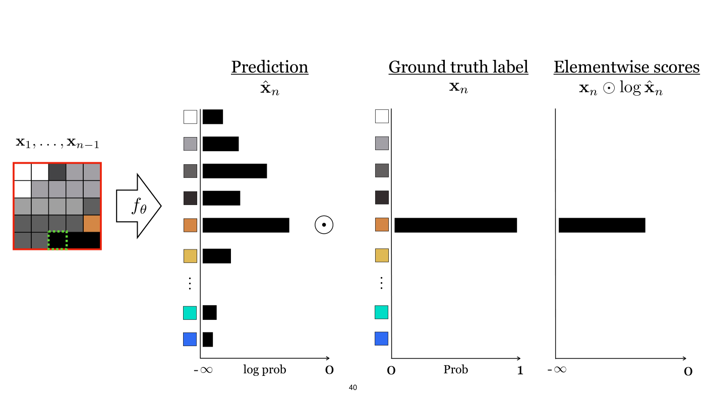

*Slide 40 — The loss on one pixel: the predicted log probabilities times the one-hot ground truth leave the log probability of the true colour. [Deck](https://ocw.mit.edu/courses/6-7960-deep-learning-fall-2024/mit6_7960_f24_lec14.pdf)*

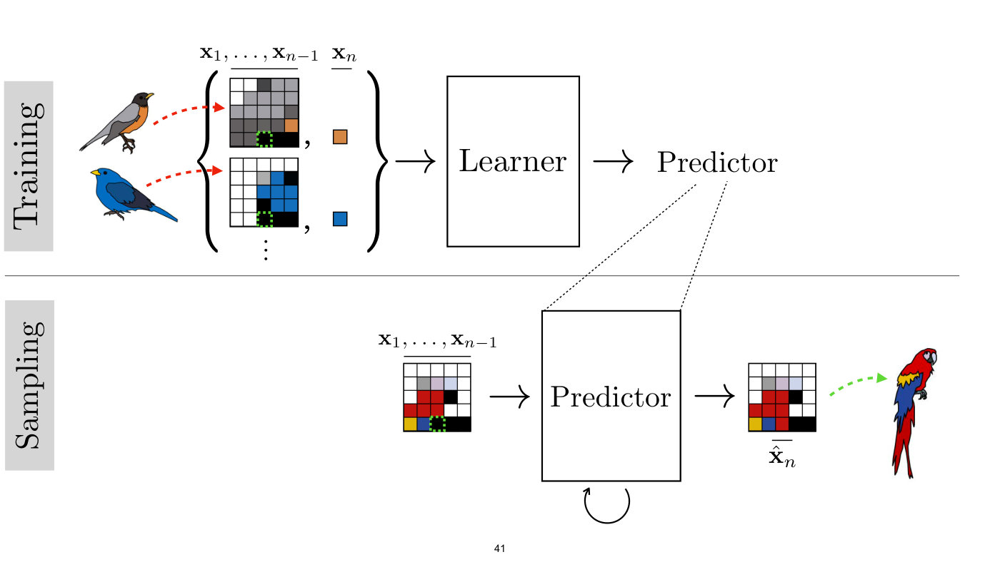

*Slide 41 — Slide 36's scheme with pixels: patches of birds and their next pixels train the predictor, which then draws new birds. [Deck](https://ocw.mit.edu/courses/6-7960-deep-learning-fall-2024/mit6_7960_f24_lec14.pdf)*

Is this a density model, an energy model or a sampler? The class votes mostly for density model, and the lecturer agrees,
while allowing "these things are a little fuzzy": the model outputs "the density over the next pixel given the previous
pixels", and "the product of all the conditional probabilities is the probability of the entire image. That's a density
that integrates to 1" (≈1:04:24–1:05:58).

Time series are often modeled the same way, and slide 42 cites WaveNet, an autoregressive model of raw audio that predicts
the next sample of a sound wave: "it looks exactly like language modeling. This is just autoregressive modeling on another
domain" (≈1:05:58).

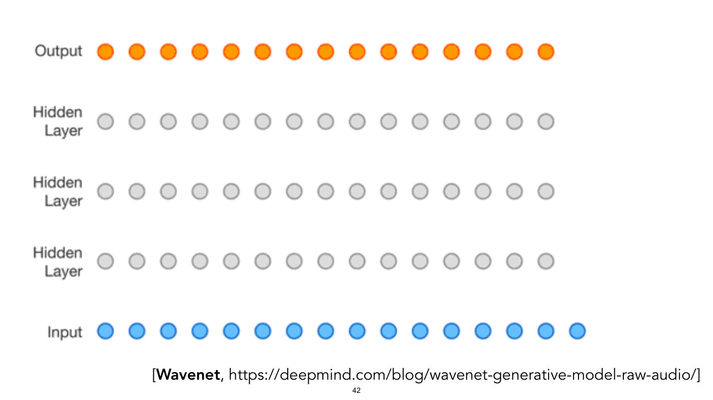

*Slide 42 — WaveNet, an autoregressive model of raw audio: predict the next sample of a sound wave from the ones before. [Deck](https://ocw.mit.edu/courses/6-7960-deep-learning-fall-2024/mit6_7960_f24_lec14.pdf)*

## Diffusion models

Diffusion models are direct generators, "directly mapping from a random dice roll to a sample", and they rest on a "very
clever observation": "it's very hard to convert noise … into data, structured objects, but it's really easy to convert
structured objects into noise" (≈1:07:34–1:08:21). Slide 43 shows the hard direction, a generator from noise to images,
and slide 45 the easy one, **diffusion**: "Just add noise." Imagine the birds as "balloon animals filled with some kind of
colored gas, and then you pop the balloon … All the particles spread out randomly … Physically, that's called a diffusion
process" (≈1:08:21). Add a little noise to every pixel, then a little more, until the image is "fully entropic": with a
sequence of Gaussian perturbations, "I end up with a unit Gaussian at the very end of that sequence" (≈1:09:09).

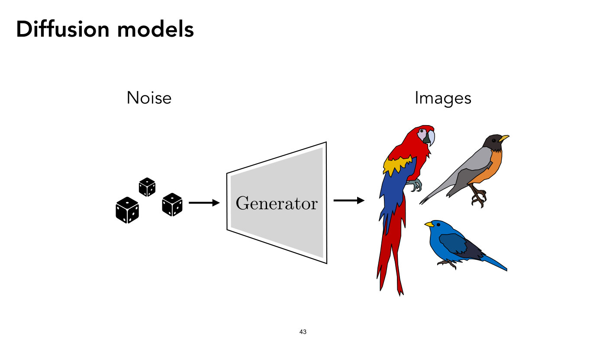

*Slide 43 — The hard direction: a generator from noise to images. [Deck](https://ocw.mit.edu/courses/6-7960-deep-learning-fall-2024/mit6_7960_f24_lec14.pdf)*

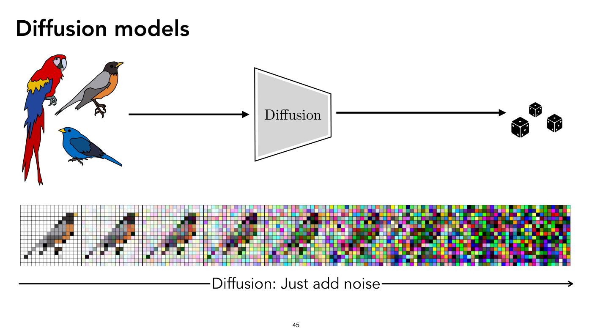

*Slide 45 — The easy direction: diffusion turns an image into noise by adding a little noise at a time. [Deck](https://ocw.mit.edu/courses/6-7960-deep-learning-fall-2024/mit6_7960_f24_lec14.pdf)*

Then **learn to reverse the process** (slide 46). Going from noise to data in one step is hard, "but I supervise it by
telling it the exact path to take. So every little step of denoising … is a very simple — just remove a little bit of
noise". Run the noising on the training data, reverse the sequences, chop them into pairs of a noisier image
$\mathbf{x}_ t$ and a less noisy one $\mathbf{x}_ {t-1}$, and fit a denoiser $f$ by supervised learning, "and this learns a
mapping from random noise to images" (≈1:09:54–1:10:40). The noise level is indexed by $t$, higher $t$ meaning more noise.
The training problem is

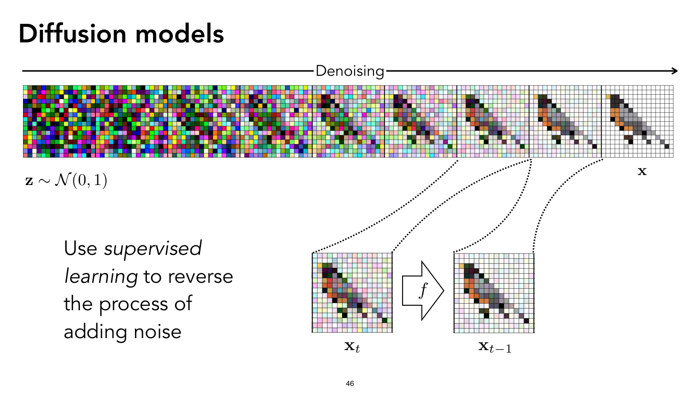

*Slide 46 — Diffusion reversed: a denoiser f learns, by supervised learning, to take each noisy image to a slightly less noisy one. [Deck](https://ocw.mit.edu/courses/6-7960-deep-learning-fall-2024/mit6_7960_f24_lec14.pdf)*

$$\underset{f \in \mathcal{F}}{\arg\min} \sum_{i=1}^{N} \mathcal{L}(f(\mathbf{x}_ t), \mathbf{x}_ {t-1})$$

where $\mathcal{L}$ could be as simple as the squared loss: it "converts generative modeling into a bunch of supervised
prediction problems" (slide 47, ≈1:10:40).

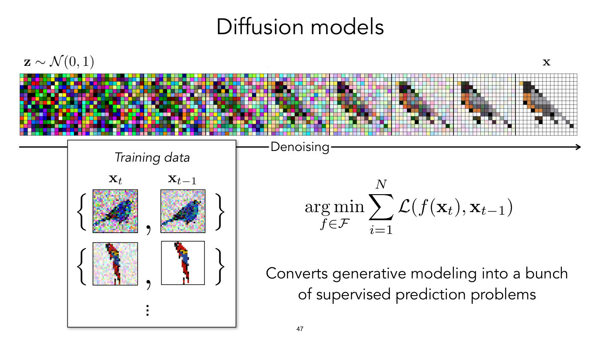

*Slide 47 — Training data for the denoiser: pairs of a noisier and a less noisy image, fitted by supervised learning. [Deck](https://ocw.mit.edu/courses/6-7960-deep-learning-fall-2024/mit6_7960_f24_lec14.pdf)*

Is $f$ the same function at every step? "Either option is fine. The most common option is you make f a function of x, and
you condition on t. So you just tell the network what timestep you're on" (≈1:11:26). To sample, start from a unit Gaussian
sample — the dice — and denoise repeatedly. "Every unit Gaussian sample gives me a different noisy image, which are like the
latent variables that specify all the properties of the data that you will generate in the end": different dice rolls give
different birds (slide 48, ≈1:12:13). Sampling "is just slow because you have to … run the denoising neural network, over and
over and over again … When these first came out, t was large, like, a thousand. Now people are showing how to do this with t
being pretty small, like, even going down to 1" (≈1:12:13–1:12:58).

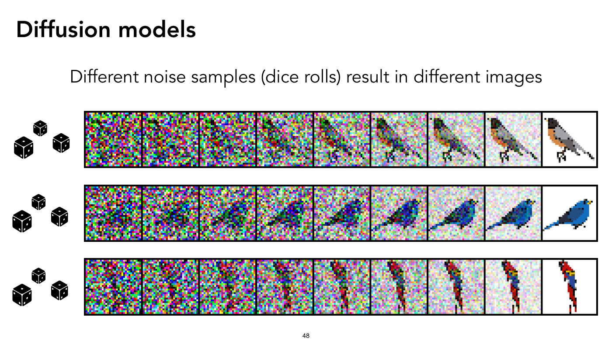

*Slide 48 — Different noise samples, different birds: the starting noise plays the part of the latent variables. [Deck](https://ocw.mit.edu/courses/6-7960-deep-learning-fall-2024/mit6_7960_f24_lec14.pdf)*

### Gaussian diffusion

Slide 49 makes it precise, with a figure adapted from Ho, Jain and Abbeel (2020): a chain $\mathbf{x}_ T \to \cdots \to \mathbf{x}_ t \to \mathbf{x}_ {t-1} \to \cdots \to \mathbf{x}_ 0$ from noise to a clean image, in which the model learns
the step $f_{\theta}(\mathbf{x}_ t, t)$ "which inverts" the noising step. The chain is Ho, Jain and Abbeel's own diagram
with the deck's pixel-art birds laid over its photographs, and OCW excludes that diagram from its licence where Homework 5
prints it, so slides 49 and 50 are not reproduced here; the slide file describes them. The **forward process** adds Gaussian noise
$\epsilon_t \sim \mathcal{N}(\mathbf{0}, \mathbf{I})$, scaled by $\beta_t$:

$$\mathbf{x}_ t = \sqrt{(1 - \beta_t)} \thinspace \mathbf{x}_ {t-1} + \sqrt{\beta_t} \thinspace \epsilon_t$$

The scale $\beta_t$ can vary with time, and "there's some engineering details about how you select beta. But in general, you
can do this in such a way that at the end of the day, you will get unit Gaussian noise, asymptotically" (≈1:13:45). The
**reverse process** treats each step as "a small Gaussian max likelihood density modeling problem": the network predicts the
mean of a Gaussian over the less noisy image, which is then sampled (≈1:13:45–1:14:33):

$$\mu = f_{\theta}(\mathbf{x}_ t, t), \qquad \mathbf{x}_ {t-1} \sim \mathcal{N}(\mu, \sigma^2)$$

"The variances, beta and sigma, are modeling choices. See Ho, Jain, and Abbeel for details" (slide 49). Slide 50 writes the
same two processes as distributions, with $q$ for the forward process and $p_{\theta}$ for the learned reverse one, notation
that "connects to the standard notation and things like called variational inference. But you don't have to worry about it
too much" (≈1:14:33):

$$q(\mathbf{x}_ t \mid \mathbf{x}_ {t-1}) = \mathcal{N}(\sqrt{1 - \beta_t} \thinspace \mathbf{x}_ {t-1}, \beta_t), \qquad p_{\theta}(\mathbf{x}_ {t-1} \mid \mathbf{x}_ t) = \mathcal{N}(f_{\theta}(\mathbf{x}_ t, t), \sigma^2)$$

Slide 51 gives a "stripped down training algorithm" (Algorithm 1.2): for each training example and each step $t = 1, \ldots, T$, draw $\epsilon_t \sim \mathcal{N}(\mathbf{0}, \mathbf{I})$ and set
$\mathbf{x}_ t^{(i)} \leftarrow \sqrt{(1 - \beta_t)} \thinspace \mathbf{x}_ {t-1}^{(i)} + \sqrt{\beta_t} \thinspace \epsilon_t$; then train the denoiser to
reverse these sequences,

$$\theta^{\ast} = \underset{\theta}{\arg\min} \sum_{i=1}^{N} \sum_{t=1}^{T} \mathcal{L}(f_{\theta}(\mathbf{x}_ t^{(i)}, t), \mathbf{x}_ {t-1}^{(i)})$$

and return $f_{\theta^{\ast}}$. (The slide prints one closing parenthesis too many at the end of this line.) The slide links
the lecturer's "very vanilla" [Colab](https://colab.research.google.com/drive/1YUFwGs0z0lEaBUpSdJIEZtCATe44TUjw?usp=sharing)
of it: "now, I think there's probably better ones out there" (≈1:15:21). See [diffusion models](diffusion-models.md).

## Autoregressive models and diffusion models are almost the same thing

"Both of them use a very simple trick. You change generative modeling of a high-dimensional structured object into a sequence
of very, very simple modeling problems" (≈1:15:21–1:16:07). Slide 52 sets the forward diffusion process — noise added
globally, to every pixel, until the image is a simple distribution — beside a "reverse autoregressive sequence", in which the
bird is erased one pixel at a time, from the last pixel back to the first, until nothing is left. Each sequence supervises its
reverse: the diffusion model learns to denoise, and the autoregressive model learns to classify the next pixel, starting from a
distribution that is trivial to sample, "a categorical distribution over the 256 possible colors" of the first pixel
(≈1:16:07–1:16:52). Slide 53 shows the two generative processes and states "Concept #3: A common strategy is to turn
generative modeling into a sequence of supervised learning problems" (≈1:16:52).

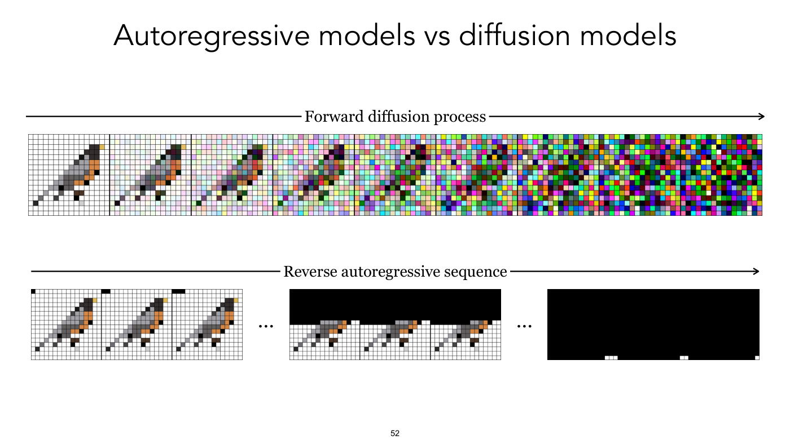

*Slide 52 — The data each model learns to reverse: diffusion noises every pixel at once; an autoregressive model's sequence removes one pixel at a time. [Deck](https://ocw.mit.edu/courses/6-7960-deep-learning-fall-2024/mit6_7960_f24_lec14.pdf)*

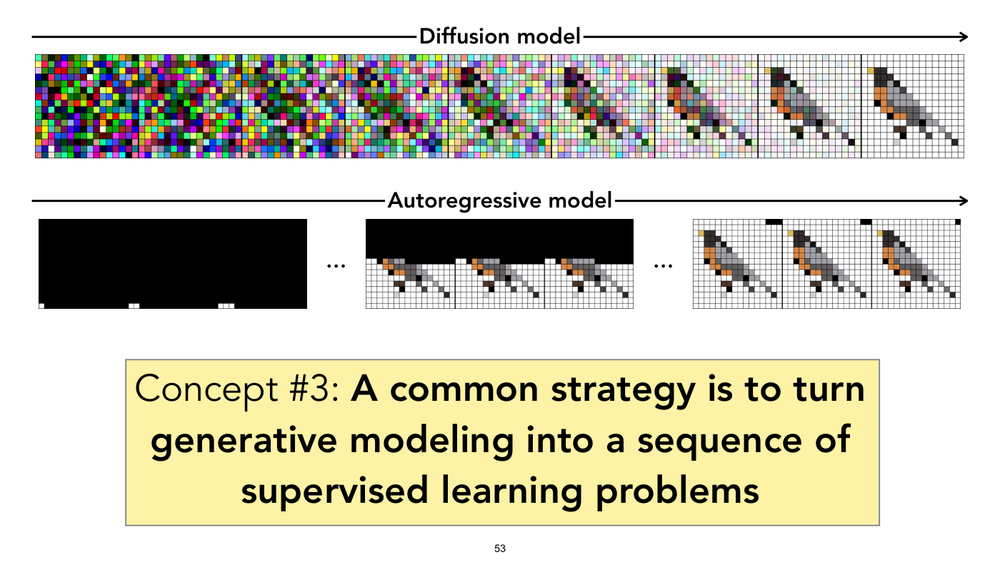

*Slide 53 — Concept #3: both models turn generation into a sequence of supervised learning problems. [Deck](https://ocw.mit.edu/courses/6-7960-deep-learning-fall-2024/mit6_7960_f24_lec14.pdf)*

## Generative adversarial networks

GANs, done "in the last two minutes", are "a whole other class of generative model" (≈1:17:40). A generator $g_{\theta}$ maps
a latent vector $\mathbf{z}$ of random numbers to an image $g_{\theta}(\mathbf{z})$, and a second network, the
**discriminator** $d_{\phi}$, decides whether an image is real or synthetic (slide 54, Goodfellow et al., 2014). Is this the
direct or the indirect approach? The class splits; the lecturer "would have called it direct because we're directly mapping
from a random variable to a sample from a distribution. But with d, it becomes a little more confusing" (≈1:18:26). Slide 54's
second line prints "g tries to identify the fakes"; "that's a typo … that should be d" (≈1:18:26). Slide 58 prints it
correctly.

Why should it work? "If g is able to make output data points which are indistinguishable from your training data points,
then it must be that you're outputting things that are from the same distribution. You can prove that, in fact" (≈1:18:26–
1:19:13). The discriminator is "just a binary softmax classifier" of real against fake (slide 55, ≈1:19:13), trained to
maximize

$$d^{\ast}_ {\phi} = \underset{\phi}{\arg\max} \thinspace \mathbb{E}_ {\mathbf{x} \sim p_{\texttt{data}}} \left[ \log d_{\phi}(\mathbf{x}) \right] + \mathbb{E}_ {\mathbf{z} \sim p_{\mathbf{z}}} \left[ \log (1 - d_{\phi}(g_{\theta}(\mathbf{z}))) \right]$$

where $d_{\phi}$ outputs the probability that its input is real: slide 55 shows a generated flamingo image scored "fake (0.1)"
and a real photograph scored "real (0.9)". The generator tries to *fool* the discriminator, minimizing "the exact same
objective that d was maximizing" (slide 56, ≈1:19:13–1:20:01):

$$\underset{\theta}{\arg\min} \thinspace \mathbb{E}_ {\mathbf{z} \sim p_{\mathbf{z}}} \left[ \log (1 - d^{\ast}_ {\phi}(g_{\theta}(\mathbf{z}))) \right]$$

Since the generator must fool the *best* discriminator, the whole is a min-max game (slide 57):

$$\arg \min_{\theta} \max_{\phi} \thinspace \mathbb{E}_ {\mathbf{x} \sim p_{\texttt{data}}} \left[ \log d_{\phi}(\mathbf{x}) \right] + \mathbb{E}_ {\mathbf{z} \sim p_{\mathbf{z}}} \left[ \log (1 - d_{\phi}(g_{\theta}(\mathbf{z}))) \right]$$

Training iterates between training $d$ and training $g$ with backprop, and the global optimum is reached "when g reproduces
data distribution" (slide 58). "This is a min-max game. It's an adversarial game. But think of it more like a student and a
teacher. d is the teacher, and g is the student. The teacher is saying, hey, you need to make a realistic painting, and you
didn't get it quite right. The shadows are wrong. So g will update its parameters to make realistic shadows" (≈1:20:01–
1:20:47). Slide 59, the summary figure, labels the discriminator's output on synthetic data "synthetic (0.9)" and on real data
"real (0.1)", the reverse of slide 55's "fake (0.1)" and "real (0.9)"; the lecture stops there without discussing it
(≈1:20:47). The GAN slides (54–59) carry OCW notices for their flamingo images, so none is reproduced here. See
[generative adversarial networks](generative-adversarial-networks.md).

The lecture ends: "we'll continue with two more lectures on generative models next week" (≈1:20:47).

## The problem set

On OCW, this lecture's diffusion material is the second section of **Homework 5**, "Diffusion Models" (17 points), which
follows Ho et al. (2020). It derives the closed form of the forward process $q(\mathbf{x}_ t \mid \mathbf{x}_ 0)$, shows that
$\mathbf{x}_ T$ is close to a unit Gaussian for large $T$, derives a denoising objective from the KL divergence to the true
reverse process and its noise-prediction form, trains a diffusion model in a Colab, plots its samples at $t \in \lbrace 200, 100, 50, 20, 10, 0 \rbrace$, and compares diffusion models with VAEs. Its first section, on variational autoencoders (14
points), belongs with lecture 15. The handout's header prints "Fall 2025" ([sources](../sources.md)).

## Pointers to other lectures

The deck prints three lecture numbers, all on slide 2 and all matching the recorded schedule: 14, 15 (generative modeling
meets representation learning) and 16 (conditional models, data prediction). The recording points back to the three
representation-learning lectures (11–13, ≈0:45), to "that hacker's guide lecture" (lecture 9, ≈9:59), to the filing cabinet
"from the lecture on generalization" (lecture 6, ≈37:18), to the colorization examples (lectures 9 and 11, ≈1:02:49) and to
sequence modeling "in previous lectures, like RNNs" (lecture 10, ≈1:07:34). It points ahead to variational autoencoders "next
week" (lecture 15, ≈1:31, ≈59:43), to conditional models (lecture 16, ≈1:31) and to the applications of generative models "in
lecture 16" (≈1:31). See the [course map](course-map.md).

## See also

- [Generative models](generative-models.md) — the hub page: definitions, latent variables, direct and indirect approaches,
  maximum likelihood.
- [Energy-based models](energy-based-models.md), [diffusion models](diffusion-models.md),
  [generative adversarial networks](generative-adversarial-networks.md) and [autoregressive models](autoregressive-models.md).
- [Representation learning](representation-learning.md) — the direction this lecture inverts.
- [Softmax and cross-entropy](softmax-and-cross-entropy.md) — classification as a distribution, and logits as energies.
- [Generalization and double descent](generalization-and-double-descent.md) — the filing cabinet.
